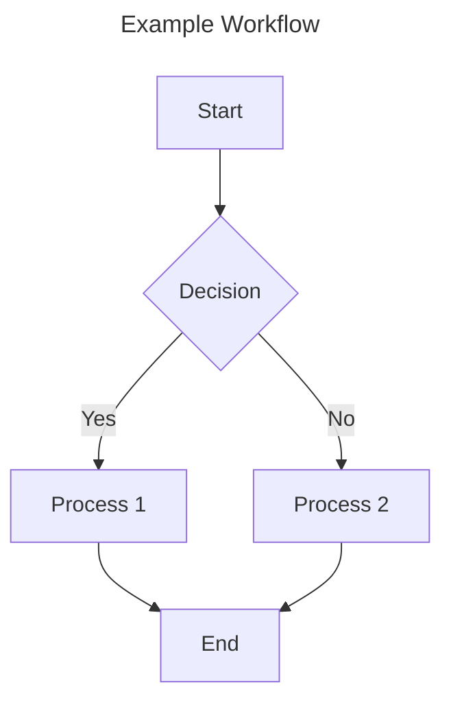
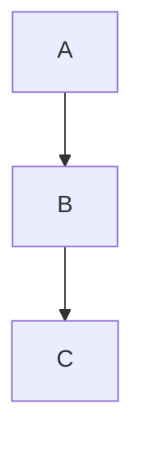

## 1001-markdown

> Always use for writing or updating Markdown files to ensure consistent formatting and readability across documentation


# Markdown Documentation Standards

## Context

- Applies to all `.md` and `.mdx` files.
- Ensures clear, structured, and consistent formatting.

## Requirements

- Follow the [Markdown Guide](mdc:https:/www.markdownguide.org) for syntax.
- Maintain logical document structure and readability.
- Use minimal, structured YAML front matter when needed.
- Leverage Mermaid diagrams for complex visual documentation.

## Markdown Formatting Rules

- Use ATX-style headings (`# Heading`), maintaining a proper hierarchy (max depth: 4).
- Add a blank line before and after headings.
- Indent XML tag content by 2 spaces; close tags on a new line.
- Use blockquotes with emoji for callouts (Warning, Tip, Note).

<example>

> 🚨 **Warning:** Critical information.
> 💡 **Tip:** Helpful suggestion.
> 📝 **Note:** Additional context.

</example>

## Code Blocks

- Use triple backticks and specify language.
- Indent properly within blocks.
- Add a blank line before and after the block.
- Use inline code for short references.

<example>

```typescript
function example(): void {
  console.log('Hello, Reliverse!');
}
```

Use `example()` inline.

</example>

## Tables

- Use alignment indicators (`:---`, `:---:`, `---:`).
- Include a header row and separator.
- Keep tables simple, with blank lines before and after.

<example>

| Name |  Type  | Description |
| :--- | :----: | ----------: |
| id   | number | Primary key |
| name | string | User's name |

</example>

## Special Elements

### Callouts

Use blockquotes with emoji:

<example>

> 🚨 **Warning:** Critical information.
> 💡 **Tip:** Helpful suggestion.
> 📝 **Note:** Additional context.

</example>

### Mermaid Diagrams

Use Mermaid for architecture flows, decision trees, state machines, and AI agent rule flows.

#### Diagram Best Practices

1. Add a title (`--- title: Example ---`).
2. Use descriptive node labels.
3. Comment complex flows.
4. Group related components in subgraphs.
5. Maintain consistent layout (`TD`, `LR`, `TB`).
6. Keep diagrams focused.

<example>



</example>

<example type="invalid">



❌ No title, unclear labels, no context.

</example>

## Examples

<example>

```md
# Heading

> 🚨 **Warning:** Important detail.
```

✅ Proper headings, callouts, and spacing.

</example>

<example type="invalid">

❌ No headings.
❌ Inline code block missing triple backticks.

</example>

---
> Source: [AbacatePay/abacate-chat](https://github.com/AbacatePay/abacate-chat) — distributed by [TomeVault](https://tomevault.io).
<!-- tomevault:4.0:gemini_md:2026-05-06 -->
