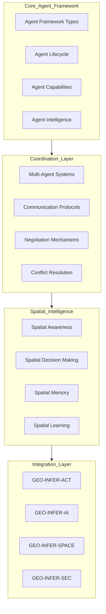

## geo-infer

> - [Overview](#overview)

# GEO-INFER Multi-Agent Systems Architecture

## Table of Contents

- [Overview](#overview)
- [Agent Module Index](#agent-module-index)
  - [Core Agent Modules](#core-agent-modules)
  - [Agent-Enabled Domain Modules](#agent-enabled-domain-modules)
  - [Agent Framework Support Modules](#agent-framework-support-modules)
  - [Agent Architectures & Capabilities](#agent-architectures--capabilities)
- [Implementation Status](#implementation-status)
  - [Currently Implemented](#currently-implemented)
  - [Aspirational/Planned Features](#aspirationalplanned-features)
- [Architecture Overview](#architecture-overview)
- [Core Agent Framework](#core-agent-framework)
  - [Agent Types](#agent-types)
  - [Agent Lifecycle Management](#agent-lifecycle-management)
- [Multi-Agent Coordination](#multi-agent-coordination)
  - [Coordination Strategies](#coordination-strategies)
  - [Communication Protocols](#communication-protocols)
  - [Negotiation Mechanisms](#negotiation-mechanisms)
- [Spatial Intelligence](#spatial-intelligence)
- [Security and Privacy](#security-and-privacy)
- [Integration Patterns](#integration-patterns)
  - [Module Integration Matrix](#module-integration-matrix)
- [Performance Optimization](#performance-optimization)
- [Use Cases](#use-cases)
- [Testing and Validation](#testing-and-validation)
- [Future Developments](#future-developments)

## Overview

This document describes the multi-agent systems architecture within the GEO-INFER framework. It covers design principles, agent types, coordination mechanisms, security protocols, and integration patterns that enable autonomous geospatial decision-making.

### 🧭 Quick Navigation

- **[Agent Module Index](#-agent-module-index)** - Index of agent-related modules
- **[Implementation Status](#implementation-status)** - What's implemented vs. planned
- **[Core Agent Framework](#core-agent-framework)** - Base agent types and lifecycle
- **[Multi-Agent Coordination](#multi-agent-coordination)** - Coordination strategies and protocols
- **[Integration Patterns](#integration-patterns)** - How agents integrate with other modules
- **[Agent Architectures](#agent-architectures--capabilities)** - BDI, Active Inference, RL, Swarm
- **[Use Cases](#use-cases)** - Real-world agent applications
- **[Related Documentation](#related-documentation)** - Links to module-specific agent docs

### Related Documentation

**Core Agent Modules:**

- **[GEO-INFER-ACT/AGENTS.md](./GEO-INFER-ACT/AGENTS.md)**: Active Inference agent implementations
- **[GEO-INFER-AGENT/AGENTS.md](./GEO-INFER-AGENT/AGENTS.md)**: Core agent framework
- **[GEO-INFER-ANT/AGENTS.md](./GEO-INFER-ANT/AGENTS.md)**: Swarm intelligence agents

**Infrastructure Modules:**

- **[GEO-INFER-SPACE/AGENTS.md](./GEO-INFER-SPACE/AGENTS.md)**: Spatial intelligence for agents
- **[GEO-INFER-TIME/AGENTS.md](./GEO-INFER-TIME/AGENTS.md)**: Temporal intelligence for agents
- **[GEO-INFER-DATA/AGENTS.md](./GEO-INFER-DATA/AGENTS.md)**: Data management for agents
- **[GEO-INFER-AI/AGENTS.md](./GEO-INFER-AI/AGENTS.md)**: AI/ML for agent learning
- **[GEO-INFER-API/AGENTS.md](./GEO-INFER-API/AGENTS.md)**: Agent communication interfaces

**Domain Applications:**

- **[GEO-INFER-AG/AGENTS.md](./GEO-INFER-AG/AGENTS.md)**: Agricultural intelligence agents
- **[GEO-INFER-HEALTH/AGENTS.md](./GEO-INFER-HEALTH/AGENTS.md)**: Health surveillance agents
- **[GEO-INFER-CLIMATE/AGENTS.md](./GEO-INFER-CLIMATE/AGENTS.md)**: Climate analysis agents
- **[GEO-INFER-TRANSPORT/AGENTS.md](./GEO-INFER-TRANSPORT/AGENTS.md)**: Transportation agents
- **[GEO-INFER-EMERGENCY/AGENTS.md](./GEO-INFER-EMERGENCY/AGENTS.md)**: Emergency response agents

## 📋 Agent Module Index

### Core Agent Modules

| Module | Agent Type | Status | Implementation | Links |
|--------|------------|--------|----------------|-------|
| **[AGENT](./GEO-INFER-AGENT/)** | Multi-Agent Systems | ✅ Beta | `BaseAgent`, `BDIAgent`, `RLAgent`, `ActiveInferenceAgent`, `HybridAgent` | [README](./GEO-INFER-AGENT/README.md) \| [AGENTS.md](./GEO-INFER-AGENT/AGENTS.md) \| [Examples](./GEO-INFER-AGENT/examples/) |
| **[ACT](./GEO-INFER-ACT/)** | Active Inference Agents | ✅ Beta | `ActiveInferenceModel`, `GenerativeModel`, `FreeEnergyCalculator` | [README](./GEO-INFER-ACT/README.md) \| [AGENTS.md](./GEO-INFER-ACT/AGENTS.md) \| [Examples](./GEO-INFER-ACT/examples/) |
| **[ANT](./GEO-INFER-ANT/)** | Swarm Intelligence Agents | 🟡 Alpha | `SwarmAgent`, `AgentPopulation`, `PheromoneSystem`, `ABC`, `PSO`, `ACO` | [README](./GEO-INFER-ANT/README.md) \| [AGENTS.md](./GEO-INFER-ANT/AGENTS.md) \| [Examples](./GEO-INFER-ANT/examples/) |
| **[SIM](./GEO-INFER-SIM/)** | Simulation Agents | 🟡 Alpha | Agent-based simulation environments | [README](./GEO-INFER-SIM/README.md) \| [Examples](./GEO-INFER-SIM/examples/) |
| **[COG](./GEO-INFER-COG/)** | Cognitive Agents | 🟡 Alpha | Cognitive modeling for agent behavior | [README](./GEO-INFER-COG/README.md) \| [Examples](./GEO-INFER-COG/examples/) |

### Agent-Enabled Domain Modules

| Module | Agent Applications | Status | Links |
|--------|-------------------|--------|-------|
| **[AG](./GEO-INFER-AG/)** | Crop monitoring, irrigation, pest detection, harvest planning | ✅ Beta | [README](./GEO-INFER-AG/README.md) \| [AGENTS.md](./GEO-INFER-AG/AGENTS.md) |
| **[HEALTH](./GEO-INFER-HEALTH/)** | Disease surveillance, healthcare coordination, outbreak detection | ✅ Beta | [README](./GEO-INFER-HEALTH/README.md) \| [AGENTS.md](./GEO-INFER-HEALTH/AGENTS.md) |
| **[LOG](./GEO-INFER-LOG/)** | Logistics optimization, fleet management, supply chain | ✅ Beta | [README](./GEO-INFER-LOG/README.md) \| [AGENTS.md](./GEO-INFER-LOG/AGENTS.md) |
| **[RISK](./GEO-INFER-RISK/)** | Risk assessment, hazard monitoring, vulnerability analysis | 🟡 Alpha | [README](./GEO-INFER-RISK/README.md) \| [AGENTS.md](./GEO-INFER-RISK/AGENTS.md) |
| **[IOT](./GEO-INFER-IOT/)** | Sensor network management, real-time monitoring | ✅ Beta | [README](./GEO-INFER-IOT/README.md) \| [AGENTS.md](./GEO-INFER-IOT/AGENTS.md) |
| **[TRANSPORT](./GEO-INFER-TRANSPORT/)** | Traffic analysis, route optimization, demand forecasting | 🟡 Alpha | [README](./GEO-INFER-TRANSPORT/README.md) \| [AGENTS.md](./GEO-INFER-TRANSPORT/AGENTS.md) |
| **[WATER](./GEO-INFER-WATER/)** | Water quality monitoring, watershed modeling, flood risk | 🟡 Alpha | [README](./GEO-INFER-WATER/README.md) \| [AGENTS.md](./GEO-INFER-WATER/AGENTS.md) |
| **[FOREST](./GEO-INFER-FOREST/)** | Forest health, deforestation detection, biomass estimation | 🟡 Alpha | [README](./GEO-INFER-FOREST/README.md) \| [AGENTS.md](./GEO-INFER-FOREST/AGENTS.md) |
| **[MARINE](./GEO-INFER-MARINE/)** | Ocean monitoring, coastal zone management, marine ecosystems | 🟡 Alpha | [README](./GEO-INFER-MARINE/README.md) \| [AGENTS.md](./GEO-INFER-MARINE/AGENTS.md) |
| **[ENERGY](./GEO-INFER-ENERGY/)** | Renewable assessment, grid optimization, demand forecasting | 🟡 Alpha | [README](./GEO-INFER-ENERGY/README.md) \| [AGENTS.md](./GEO-INFER-ENERGY/AGENTS.md) |
| **[EMERGENCY](./GEO-INFER-EMERGENCY/)** | Emergency coordination, resource deployment, evacuation | 🟡 Alpha | [README](./GEO-INFER-EMERGENCY/README.md) \| [AGENTS.md](./GEO-INFER-EMERGENCY/AGENTS.md) |
| **[EDU](./GEO-INFER-EDU/)** | Curriculum design, learning support, progress tracking | 🟡 Alpha | [README](./GEO-INFER-EDU/README.md) \| [AGENTS.md](./GEO-INFER-EDU/AGENTS.md) |
| **[BIO](./GEO-INFER-BIO/)** | Species distribution, biodiversity, ecosystem health | ✅ Beta | [README](./GEO-INFER-BIO/README.md) \| [AGENTS.md](./GEO-INFER-BIO/AGENTS.md) |
| **[CLIMATE](./GEO-INFER-CLIMATE/)** | Climate analysis, adaptation planning, carbon accounting | 🟡 Alpha | [README](./GEO-INFER-CLIMATE/README.md) \| [AGENTS.md](./GEO-INFER-CLIMATE/AGENTS.md) |
| **[ECON](./GEO-INFER-ECON/)** | Economic modeling, cost-benefit analysis, resource optimization | 🟡 Alpha | [README](./GEO-INFER-ECON/README.md) \| [AGENTS.md](./GEO-INFER-ECON/AGENTS.md) |

### Agent Framework Support Modules

| Module | Framework Capabilities | Status | Links |
|--------|----------------------|--------|-------|
| **[SPACE](./GEO-INFER-SPACE/)** | Spatial perception, reasoning, and action for agents | ✅ Beta | [README](./GEO-INFER-SPACE/README.md) \| [AGENTS.md](./GEO-INFER-SPACE/AGENTS.md) |
| **[TIME](./GEO-INFER-TIME/)** | Temporal perception and forecasting for agents | ✅ Beta | [README](./GEO-INFER-TIME/README.md) \| [AGENTS.md](./GEO-INFER-TIME/AGENTS.md) |
| **[DATA](./GEO-INFER-DATA/)** | Data perception and integration for agents | ✅ Beta | [README](./GEO-INFER-DATA/README.md) \| [AGENTS.md](./GEO-INFER-DATA/AGENTS.md) |
| **[MATH](./GEO-INFER-MATH/)** | Mathematical foundations for agent inference | ✅ Beta | [README](./GEO-INFER-MATH/README.md) \| [AGENTS.md](./GEO-INFER-MATH/AGENTS.md) |
| **[BAYES](./GEO-INFER-BAYES/)** | Bayesian inference for agent belief updating (GP, MCMC, model comparison) | ✅ Beta | [README](./GEO-INFER-BAYES/README.md) \| [AGENTS.md](./GEO-INFER-BAYES/AGENTS.md) |
| **[AI](./GEO-INFER-AI/)** | ML/AI capabilities for agent perception and learning | ✅ Beta | [README](./GEO-INFER-AI/README.md) \| [AGENTS.md](./GEO-INFER-AI/AGENTS.md) |
| **[API](./GEO-INFER-API/)** | Communication interfaces for agent messaging | ✅ Beta | [README](./GEO-INFER-API/README.md) \| [AGENTS.md](./GEO-INFER-API/AGENTS.md) |
| **[APP](./GEO-INFER-APP/)** | Human-agent interaction interfaces | ✅ Beta | [README](./GEO-INFER-APP/README.md) \| [AGENTS.md](./GEO-INFER-APP/AGENTS.md) |
| **[SEC](./GEO-INFER-SEC/)** | Security and authentication for agents | 🟡 Alpha | [README](./GEO-INFER-SEC/README.md) \| [AGENTS.md](./GEO-INFER-SEC/AGENTS.md) |
| **[OPS](./GEO-INFER-OPS/)** | Deployment and monitoring for agents | 🟡 Alpha | [README](./GEO-INFER-OPS/README.md) \| [AGENTS.md](./GEO-INFER-OPS/AGENTS.md) |

### Agent Architectures & Capabilities

| Architecture | Module | Implementation | Status | Links |
|--------------|--------|----------------|--------|-------|
| **Belief-Desire-Intention (BDI)** | [AGENT](./GEO-INFER-AGENT/) | `BDIAgent` | ✅ Implemented | [Source](./GEO-INFER-AGENT/src/geo_infer_agent/models/bdi.py) |
| **Active Inference** | [ACT](./GEO-INFER-ACT/), [AGENT](./GEO-INFER-AGENT/) | `ActiveInferenceAgent`, `ActiveInferenceModel` | ✅ Implemented | [ACT Source](./GEO-INFER-ACT/src/) \| [AGENT Source](./GEO-INFER-AGENT/src/) |
| **Reinforcement Learning** | [AGENT](./GEO-INFER-AGENT/) | `RLAgent` | ✅ Implemented | [Source](./GEO-INFER-AGENT/src/geo_infer_agent/models/rl.py) |
| **Rule-Based** | [AGENT](./GEO-INFER-AGENT/) | `RuleBasedAgent` | ✅ Implemented | [Source](./GEO-INFER-AGENT/src/geo_infer_agent/models/rule_based.py) |
| **Hybrid** | [AGENT](./GEO-INFER-AGENT/) | `HybridAgent` | ✅ Implemented | [Source](./GEO-INFER-AGENT/src/geo_infer_agent/models/hybrid.py) |
| **Swarm Intelligence** | [ANT](./GEO-INFER-ANT/) | `SwarmAgent`, `AgentPopulation` | ✅ Implemented | [Source](./GEO-INFER-ANT/src/geo_infer_ant/core/) |
| **Stigmergic Communication** | [ANT](./GEO-INFER-ANT/) | `PheromoneSystem`, `DigitalStigmergy` | ✅ Implemented | [Source](./GEO-INFER-ANT/src/geo_infer_ant/core/) |
| **Swarm Optimization** | [ANT](./GEO-INFER-ANT/) | `ABC`, `PSO`, `ACO` algorithms | ✅ Implemented | [Source](./GEO-INFER-ANT/src/geo_infer_ant/algorithms/) |
| **Cognitive Modeling** | [COG](./GEO-INFER-COG/) | Cognitive agents with attention, memory | 🟡 In Development | [Source](./GEO-INFER-COG/src/) |
| **Multi-Agent Coordination** | [AGENT](./GEO-INFER-AGENT/) | `AgentRegistry`, `MessagingService` | ✅ Implemented | [Source](./GEO-INFER-AGENT/src/geo_infer_agent/core/) |
| **Agent Telemetry** | [AGENT](./GEO-INFER-AGENT/) | `TelemetryService` | ✅ Implemented | [Source](./GEO-INFER-AGENT/src/geo_infer_agent/api/telemetry.py) |

## Implementation Status

**⚠️ Important Note**: This document describes both **implemented** and **aspirational** features. Features marked with 🔮 are planned/aspirational and not yet implemented. Features without this marker are currently implemented and available.

### ✅ Currently Implemented

| Feature | Module | Implementation | Links |
|---------|--------|----------------|-------|
| **Core Agent Framework** | AGENT | `BaseAgent`, `AgentRegistry` | [Source](./GEO-INFER-AGENT/src/geo_infer_agent/core/) |
| **Active Inference Agents** | ACT, AGENT | `ActiveInferenceAgent`, `ActiveInferenceModel`, `GenerativeModel` | [ACT Source](./GEO-INFER-ACT/src/) \| [AGENT Source](./GEO-INFER-AGENT/src/) |
| **BDI Agents** | AGENT | `BDIAgent` | [Source](./GEO-INFER-AGENT/src/geo_infer_agent/models/bdi.py) |
| **RL Agents** | AGENT | `RLAgent` | [Source](./GEO-INFER-AGENT/src/geo_infer_agent/models/rl.py) |
| **Hybrid Agents** | AGENT | `HybridAgent` | [Source](./GEO-INFER-AGENT/src/geo_infer_agent/models/hybrid.py) |
| **Swarm Agents** | ANT | `SwarmAgent`, `AgentPopulation` | [Source](./GEO-INFER-ANT/src/geo_infer_ant/core/) |
| **Stigmergic Communication** | ANT | `PheromoneSystem`, `DigitalStigmergy` | [Source](./GEO-INFER-ANT/src/geo_infer_ant/core/) |
| **Agent Communication** | AGENT | `MessagingService` | [Source](./GEO-INFER-AGENT/src/geo_infer_agent/api/messaging.py) |
| **Agent Telemetry** | AGENT | `TelemetryService` | [Source](./GEO-INFER-AGENT/src/geo_infer_agent/api/telemetry.py) |
| **Swarm Optimization** | ANT | `ABC`, `PSO`, `ACO` algorithms | [Source](./GEO-INFER-ANT/src/geo_infer_ant/algorithms/) |

### 🔮 Aspirational/Planned Features

| Feature | Priority | Target Module | Dependencies |
|---------|----------|---------------|--------------|
| **Environmental Monitoring Agents** | High | AGENT, CLIMATE | SPACE, TIME, IOT |
| **Infrastructure Management Agents** | High | AGENT | SPACE, TIME, OPS |
| **Urban Planning Agents** | Medium | AGENT, CIV | SPACE, ACT, CIV |
| **Emergency Response Agents** | High | AGENT, EMERGENCY | SPACE, TIME, RISK, IOT |
| **Hierarchical Coordination** | Medium | AGENT | ACT, SPACE |
| **Emergent Coordination** | Medium | ANT | ACT, SIM |
| **Auction-Based Coordination** | Low | AGENT | ECON, ACT |
| **Spatial Broadcasting Protocols** | Medium | AGENT | SPACE, SEC |
| **P2P Mesh Networks** | Low | AGENT | SPACE, COMMS |
| **Bilateral Negotiation** | Low | AGENT | ACT, ECON |
| **Multi-Party Negotiation** | Low | AGENT | ACT, ORG |
| **Spatial Intelligence Modules** | High | AGENT | SPACE, COG |
| **Agent Security Manager** | High | AGENT, SEC | SEC, ACT |
| **Performance Optimizers** | Medium | AGENT, OPS | OPS, ACT |

## Architecture Overview



## Core Agent Framework

### Agent Types

#### 1. Environmental Monitoring Agents 🔮

**Status**: Planned/Aspirational

**Purpose**: Autonomous environmental data collection and analysis.

**Capabilities**:

- Real-time sensor data processing
- Anomaly detection and alerting
- Predictive environmental modeling
- Quality assurance and validation

**Spatial Intelligence**:

- Adaptive sampling strategies based on spatial variability
- Optimal sensor placement algorithms
- Spatial interpolation of sensor data
- Geographic boundary monitoring

**Note**: Currently, you can use `GEO-INFER-ANT` swarm agents for environmental monitoring. See `GEO-INFER-ANT/AGENTS.md` for `EnvironmentalMonitoringSwarm`.

```python
# 🔮 Planned implementation - not yet available
from geo_infer_agent.environmental import EnvironmentalMonitoringAgent

agent = EnvironmentalMonitoringAgent(
    agent_id="env_monitor_001",
    spatial_bounds=monitoring_region,
    sensors=['temperature', 'humidity', 'air_quality'],
    monitoring_frequency='real_time',
    anomaly_detection=True,
    predictive_modeling=True)

# Agent capabilities
agent.monitor_environment()
agent.detect_anomalies()
agent.generate_alerts()
agent.optimize_sensor_placement()```

#### 2. Infrastructure Management Agents 🔮

**Status**: Planned/Aspirational

**Purpose**: Infrastructure monitoring and maintenance.

**Capabilities**:

- Structural health monitoring
- Predictive maintenance scheduling
- Resource allocation optimization
- Risk assessment and mitigation

**Spatial Intelligence**:

- Infrastructure network analysis
- Spatial dependency mapping
- Critical infrastructure identification
- Emergency response routing

```python
# 🔮 Planned implementation - not yet available
from geo_infer_agent.infrastructure import InfrastructureManagementAgent

agent = InfrastructureManagementAgent(
    agent_id="infra_mgr_001",
    infrastructure_type='transportation',
    spatial_network=road_network,
    maintenance_schedule='predictive',
    risk_assessment=True,
    resource_optimization=True)

# Agent capabilities
agent.monitor_infrastructure_health()
agent.schedule_maintenance()
agent.optimize_resource_allocation()
agent.assess_risks()```

#### 3. Urban Planning Agents 🔮

**Status**: Planned/Aspirational

**Purpose**: Collaborative urban development and planning.

**Capabilities**:

- Land use analysis and optimization
- Demographic trend analysis
- Infrastructure planning coordination
- Stakeholder engagement facilitation

**Spatial Intelligence**:

- Urban growth modeling
- Spatial equity analysis
- Multi-objective optimization
- Scenario planning and visualization

**Note**: `GEO-INFER-ACT` provides `UrbanModel` for urban planning with Active Inference. See `GEO-INFER-ACT/AGENTS.md`.

```python
# 🔮 Planned implementation - not yet available
from geo_infer_agent.urban import UrbanPlanningAgent

agent = UrbanPlanningAgent(
    agent_id="urban_planner_001",
    planning_horizon='2050',
    stakeholder_groups=['residents', 'businesses', 'government'],
    spatial_resolution='high',
    multi_objective_optimization=True,
    scenario_planning=True)

# Agent capabilities
agent.analyze_land_use_patterns()
agent.model_urban_growth()
agent.optimize_development_scenarios()
agent.facilitate_stakeholder_engagement()```

#### 4. Emergency Response Agents 🔮

**Status**: Planned/Aspirational

**Purpose**: Coordinated emergency management and response.

**Capabilities**:

- Real-time situation assessment
- Resource deployment optimization
- Multi-agency coordination
- Public communication management

**Spatial Intelligence**:

- Dynamic risk mapping
- Evacuation route optimization
- Resource allocation algorithms
- Spatial communication coverage

**Note**: `GEO-INFER-ANT` provides `DisasterResponseSwarm` for emergency response. See `GEO-INFER-ANT/AGENTS.md`.

```python
# 🔮 Planned implementation - not yet available
from geo_infer_agent.emergency import EmergencyResponseAgent

agent = EmergencyResponseAgent(
    agent_id="emergency_001",
    emergency_types=['flood', 'fire', 'earthquake'],
    response_coordination='multi_agency',
    real_time_assessment=True,
    public_communication=True)

# Agent capabilities
agent.assess_situation()
agent.optimize_resource_deployment()
agent.coordinate_response_efforts()
agent.manage_public_communication()```

### Agent Lifecycle Management

```mermaid
stateDiagram-v2
    [*] --> Created: Agent Initialization
    Created --> Configured: Load Configuration
    Configured --> Registered: Register with System
    Registered --> Active: Start Operations
    
    Active --> Learning: Continuous Learning
    Learning --> Active: Update Models
    
    Active --> Coordinating: Multi-Agent Coordination
    Coordinating --> Active: Coordination Complete
    
    Active --> Communicating: Inter-Agent Communication
    Communicating --> Active: Communication Complete
    
    Active --> Idle: Low Activity Period
    Idle --> Active: Activity Detected
    
    Active --> Maintenance: Scheduled Maintenance
    Maintenance --> Active: Maintenance Complete
    
    Active --> Error: System Error
    Error --> Recovering: Error Recovery
    Recovering --> Active: Recovery Successful
    
    Active --> Decommissioned: Agent Retirement
    Decommissioned --> [*]
    
    note right of Active : Core Operational State
    note right of Learning : Continuous Improvement
    note right of Coordinating : Collaborative Behavior```

## Multi-Agent Coordination

### Coordination Strategies

#### Hierarchical Coordination 🔮

**Status**: Planned/Aspirational

**Structure**: Tree-based hierarchy with central coordination.

**Benefits**:

- Clear command structure
- Efficient decision making
- Resource optimization
- Accountability

```python
# 🔮 Planned implementation - not yet available
from geo_infer_agent.coordination import HierarchicalCoordinator

coordinator = HierarchicalCoordinator(
    hierarchy_levels=['global', 'regional', 'local'],
    coordination_frequency='real_time',
    decision_authority='distributed',
    conflict_resolution='escalation')

# Establish coordination hierarchy
coordinator.establish_hierarchy(agent_population)
coordinator.assign_roles()
coordinator.set_coordination_rules()```

#### Emergent Coordination 🔮

**Status**: Planned/Aspirational

**Structure**: Self-organizing systems with emergent behavior.

**Benefits**:

- Adaptability to changing conditions
- Resilience to agent failures
- Scalability
- Innovation through emergence

**Note**: `GEO-INFER-ANT` provides swarm intelligence with emergent coordination. See `GEO-INFER-ANT/AGENTS.md`.

```python
# 🔮 Planned implementation - not yet available
from geo_infer_agent.coordination import EmergentCoordinator

coordinator = EmergentCoordinator(
    emergence_mechanisms=['stigmergy', 'self_organization'],
    feedback_loops=True,
    adaptation_rate='dynamic',
    stability_thresholds=True)

# Enable emergent coordination
coordinator.enable_stigmergic_communication()
coordinator.set_emergence_conditions()
coordinator.monitor_system_stability()```

#### Auction-Based Coordination 🔮

**Status**: Planned/Aspirational

**Structure**: Market-based resource allocation.

**Benefits**:

- Efficient resource allocation
- Incentive compatibility
- Price discovery
- Scalability

```python
# 🔮 Planned implementation - not yet available
from geo_infer_agent.coordination import AuctionCoordinator

coordinator = AuctionCoordinator(
    auction_mechanism='combinatorial',
    bidding_strategy='truthful',
    payment_rule='vickrey_clarke_groves',
    resource_types=['computing', 'bandwidth', 'storage'])

# Implement auction coordination
coordinator.designate_auctioneer()
coordinator.set_resource_markets()
coordinator.run_auction_rounds()```

### Communication Protocols

#### Secure Spatial Broadcasting 🔮

**Status**: Planned/Aspirational

**Protocol**: Encrypted broadcast within spatial bounds.

**Note**: Currently, use `MessagingService` from `geo_infer_agent.api.messaging` for agent communication.

```python
# 🔮 Planned implementation - not yet available
from geo_infer_agent.communication import SpatialBroadcastProtocol

protocol = SpatialBroadcastProtocol(
    spatial_bounds=communication_region,
    encryption_method='aes256',
    authentication='mutual_tls',
    message_integrity='hmac_sha256')

# Configure spatial broadcasting
protocol.set_spatial_boundaries()
protocol.enable_encryption()
protocol.configure_authentication()```

#### Peer-to-Peer Mesh Networks 🔮

**Status**: Planned/Aspirational

**Protocol**: Decentralized agent communication.

```python
# 🔮 Planned implementation - not yet available
from geo_infer_agent.communication import PeerToPeerProtocol

protocol = PeerToPeerProtocol(
    network_topology='mesh',
    routing_algorithm='geographic',
    reliability_guarantees='best_effort',
    bandwidth_optimization=True)

# Establish peer-to-peer network
protocol.discover_peers()
protocol.establish_connections()
protocol.optimize_routing()```

#### Hierarchical Message Passing 🔮

**Status**: Planned/Aspirational

**Protocol**: Structured communication through hierarchy.

```python
# 🔮 Planned implementation - not yet available
from geo_infer_agent.communication import HierarchicalProtocol

protocol = HierarchicalProtocol(
    hierarchy_definition=hierarchy_structure,
    message_routing='top_down_bottom_up',
    priority_levels=['emergency', 'urgent', 'normal'],
    quality_of_service=True)

# Implement hierarchical communication
protocol.define_hierarchy()
protocol.set_message_routing()
protocol.prioritize_communication()```

### Negotiation Mechanisms

#### Bilateral Negotiation 🔮

**Status**: Planned/Aspirational

**Mechanism**: Direct agent-to-agent negotiation.

```python
# 🔮 Planned implementation - not yet available
from geo_infer_agent.negotiation import BilateralNegotiator

negotiator = BilateralNegotiator(
    negotiation_protocol='alternating_offers',
    utility_functions='custom_defined',
    time_constraints=True,
    fairness_criteria='pareto_optimal')

# Conduct bilateral negotiation
negotiator.define_negotiation_space()
negotiator.set_utility_functions()
negotiator.conduct_negotiation()```

#### Multi-Party Negotiation 🔮

**Status**: Planned/Aspirational

**Mechanism**: Complex multi-agent negotiations.

```python
# 🔮 Planned implementation - not yet available
from geo_infer_agent.negotiation import MultiPartyNegotiator

negotiator = MultiPartyNegotiator(
    negotiation_model='monotonic_concession',
    coalition_formation=True,
    mediator_support=True,
    consensus_mechanisms=True)

# Manage multi-party negotiations
negotiator.identify_stakeholders()
negotiator.form_coalitions()
negotiator.facilitate_negotiation()```

## Spatial Intelligence

### Spatial Awareness

#### Spatial Perception 🔮

**Status**: Planned/Aspirational

**Capabilities**:

- Geographic context understanding
- Spatial relationship recognition
- Scale awareness and management
- Coordinate system handling

**Note**: Use `GEO-INFER-SPACE` for spatial operations and H3 v4 indexing. The SPACE module uses H3 v4 API with methods like `latlng_to_cell`, `cell_to_latlng`, and `geo_to_cells`. See [GEO-INFER-SPACE/README.md](./GEO-INFER-SPACE/README.md) for details.

```python
# 🔮 Planned implementation - not yet available
from geo_infer_agent.spatial import SpatialPerception

perception = SpatialPerception(
    spatial_context='urban_environment',
    scale_awareness='multi_resolution',
    coordinate_systems=['wgs84', 'utm', 'local'],
    relationship_types=['containment', 'adjacency', 'proximity'])

# Enable spatial perception
perception.analyze_spatial_context()
perception.recognize_relationships()
perception.manage_scales()```

#### Spatial Memory 🔮

**Status**: Planned/Aspirational

**Capabilities**:

- Long-term spatial knowledge storage
- Short-term spatial working memory
- Spatial pattern recognition
- Geographic knowledge updating

```python
# 🔮 Planned implementation - not yet available
from geo_infer_agent.spatial import SpatialMemory

memory = SpatialMemory(
    memory_capacity='adaptive',
    knowledge_types=['factual', 'procedural', 'episodic'],
    update_mechanisms='incremental_learning',
    retrieval_strategies='associative')

# Manage spatial memory
memory.store_spatial_knowledge()
memory.retrieve_spatial_patterns()
memory.update_geographic_knowledge()```

### Spatial Decision Making

#### Bayesian Spatial Reasoning 🔮

**Status**: Planned/Aspirational

**Approach**: Probabilistic spatial decision making.

**Note**: Use `GEO-INFER-BAYES` for Bayesian inference and `GEO-INFER-ACT` for Active Inference-based reasoning.

```python
# 🔮 Planned implementation - not yet available
from geo_infer_agent.spatial import BayesianSpatialReasoner

reasoner = BayesianSpatialReasoner(
    uncertainty_model='bayesian_networks',
    evidence_integration='real_time',
    belief_updating='active_inference',
    decision_thresholds='adaptive')

# Perform Bayesian spatial reasoning
reasoner.update_beliefs(evidence)
reasoner.assess_uncertainty()
reasoner.make_spatial_decisions()```

#### Multi-Objective Spatial Optimization 🔮

**Status**: Planned/Aspirational

**Approach**: Balanced spatial decision making.

```python
# 🔮 Planned implementation - not yet available
from geo_infer_agent.spatial import MultiObjectiveSpatialOptimizer

optimizer = MultiObjectiveSpatialOptimizer(
    objectives=['efficiency', 'equity', 'sustainability'],
    optimization_algorithm='pareto_frontier',
    constraint_handling='penalty_methods',
    solution_evaluation='weighted_sum')

# Optimize spatial decisions
optimizer.define_objectives()
optimizer.generate_pareto_frontier()
optimizer.select_optimal_solution()```

### Spatial Learning

#### Reinforcement Learning for Spatial Tasks 🔮

**Status**: Planned/Aspirational

**Capabilities**:

- Spatial navigation learning
- Resource allocation optimization
- Adaptive behavior development
- Spatial strategy refinement

**Note**: Use `RLAgent` from `geo_infer_agent.models.rl` for reinforcement learning agents.

```python
# 🔮 Planned implementation - not yet available
from geo_infer_agent.spatial import SpatialReinforcementLearner

learner = SpatialReinforcementLearner(
    learning_algorithm='deep_q_learning',
    spatial_state_representation='graph_based',
    action_space='continuous_movement',
    reward_function='task_specific')

# Learn spatial behaviors
learner.explore_spatial_environment()
learner.optimize_navigation_strategy()
learner.adapt_to_environmental_changes()```

#### Transfer Learning Across Spatial Domains 🔮

**Status**: Planned/Aspirational

**Capabilities**:

- Cross-domain knowledge transfer
- Spatial analogy recognition
- Domain adaptation techniques
- Meta-learning for spatial tasks

```python
# 🔮 Planned implementation - not yet available
from geo_infer_agent.spatial import SpatialTransferLearner

learner = SpatialTransferLearner(
    source_domains=['urban_planning', 'environmental_monitoring'],
    target_domain='emergency_response',
    transfer_mechanism='fine_tuning',
    adaptation_strategy='domain_adversarial')

# Transfer spatial knowledge
learner.identify_transferable_knowledge()
learner.adapt_to_target_domain()
learner.fine_tune_spatial_models()```

## Security and Privacy

### Agent Security Framework

#### Authentication and Authorization 🔮

**Status**: Planned/Aspirational

**Note**: Use `GEO-INFER-SEC` for security functionality.

```python
# 🔮 Planned implementation - not yet available
from geo_infer_agent.security import AgentSecurityManager

security = AgentSecurityManager(
    authentication_methods=['certificate_based', 'zero_knowledge'],
    authorization_model='attribute_based',
    audit_logging=True,
    threat_detection=True)

# Implement agent security
security.authenticate_agents()
security.authorize_actions()
security.monitor_security_events()```

#### Secure Communication 🔮

**Status**: Planned/Aspirational

```python
# 🔮 Planned implementation - not yet available
from geo_infer_agent.security import SecureCommunicationManager

communication = SecureCommunicationManager(
    encryption_protocols=['quantum_resistant', 'post_quantum'],
    key_management='distributed',
    message_integrity='blockchain_based',
    privacy_preservation='differential_privacy')

# Secure agent communications
communication.establish_secure_channels()
communication.encrypt_messages()
communication.verify_message_integrity()```

#### Privacy Protection 🔮

**Status**: Planned/Aspirational

```python
# 🔮 Planned implementation - not yet available
from geo_infer_agent.security import PrivacyProtectionManager

privacy = PrivacyProtectionManager(
    privacy_techniques=['federated_learning', 'homomorphic_encryption'],
    data_minimization=True,
    consent_management=True,
    privacy_policies='gdpr_compliant')

# Protect agent privacy
privacy.minimize_data_collection()
privacy.implement_privacy_preserving_computation()
privacy.manage_consent_and_policies()```

## Integration Patterns

### Module Integration Matrix

| Agent Module | Integrates With | Integration Type | Use Case |
|--------------|----------------|------------------|----------|
| **AGENT** | ACT | Core | Active Inference decision-making |
| **AGENT** | AI | Core | Machine learning for agent behavior |
| **AGENT** | SPACE | Essential | Spatial perception and navigation |
| **AGENT** | TIME | Essential | Temporal reasoning and planning |
| **AGENT** | SIM | Core | Agent-based simulation environments |
| **ACT** | BAYES | Core | Bayesian belief updating |
| **ACT** | MATH | Foundation | Mathematical foundations |
| **ANT** | ACT | Core | Active Inference in swarm systems |
| **ANT** | SIM | Core | Swarm simulation environments |
| **COG** | AGENT | Core | Cognitive modeling for agents |
| **COG** | SPACE | Essential | Spatial cognition |

### GEO-INFER-ACT Integration

**Pattern**: Active Inference for agent decision making.

**Module**: [GEO-INFER-ACT](./GEO-INFER-ACT/) | [Documentation](./GEO-INFER-ACT/AGENTS.md)

```python
from geo_infer_agent.models.active_inference import ActiveInferenceAgent
from geo_infer_act.core.active_inference import ActiveInferenceModel

# Create agent with active inference
agent = ActiveInferenceAgent(
    state_dim=10, 

# Dimensionality of state space
    obs_dim=5,    

# Dimensionality of observation space
    action_dim=3, 

# Dimensionality of action space
    config={
        'planning_horizon': 5,
        'precision': 1.0,
        'learning_rate': 0.01
    })

# Create Active Inference model from ACT module
act_model = ActiveInferenceModel(
    model_type='categorical',
    state_dim=10,
    obs_dim=5)

# Use the agent for perception and action
observation = agent.perceive(obs_array)
action = agent.act(observation)```

### GEO-INFER-AI Integration

**Pattern**: Machine learning enhancement of agent capabilities.

```python
# Note: IntelligentAgent and AIEngine integration is aspirational
# Currently, use specific agent models from geo_infer_agent.models
from geo_infer_agent.models.rl import RLAgent
from geo_infer_agent.models.hybrid import HybridAgent

# Create AI-agent using RL
rl_agent = RLAgent(
    state_dim=10,
    action_dim=3,
    learning_rate=0.001)

# Or use hybrid agent combining multiple approaches
hybrid_agent = HybridAgent(
    agent_id="hybrid_001",
    model_types=['active_inference', 'reinforcement_learning'],
    config={'learning_rate': 0.01})
```

### GEO-INFER-SPACE Integration

**Pattern**: Backend-agnostic spatial data and analysis for agent operations.

**Module**: [GEO-INFER-SPACE](./GEO-INFER-SPACE/) | [Documentation](./GEO-INFER-SPACE/README.md)

```python
from geo_infer_agent.core.agent_registry import AgentRegistry
from geo_infer_space.core.spatial_indexing import SpatialIndexingInterface
from geo_infer_space.core.analytics import SpatialAnalyticsInterface
from geo_infer_space.core.dispatcher import configure_backends

# Configure backend preferences for agent operations
configure_backends({
    'default_backends': {
        'indexing': 'h3',   

# Use H3 v4 for spatial indexing
        'analytics': 'srai', 

# Use SRAI for spatial analytics
    }})

# Create agent registry for managing multiple agents
registry = AgentRegistry()

# Create backend-agnostic spatial interfaces
spatial_indexer = SpatialIndexingInterface() 

# Uses H3 v4 by default
spatial_analytics = SpatialAnalyticsInterface() 

# Uses SRAI by default

# Use H3 v4 backend explicitly for high-precision spatial operations
h3_indexer = SpatialIndexingInterface(backend='h3')
cell_h3 = h3_indexer.latlng_to_cell(37.7749, -122.4194, 9) 

# H3 v4 API

# Use SRAI backend explicitly for AI-analytics
srai_analytics = SpatialAnalyticsInterface(backend='srai')
hotspots = srai_analytics.analyze_hotspots(spatial_data)```

### GEO-INFER-SEC Integration

**Pattern**: Security framework for agent operations.

```python
# Note: IntelligentAgent integration with SEC is aspirational
# Currently, use BaseAgent and integrate security at application level
from geo_infer_agent.core.agent_base import BaseAgent

class SecureAgent(BaseAgent):
    """Agent with security integration."""
    
    def __init__(self, agent_id=None, config=None):
        super().__init__(agent_id, config)
        self.security_enabled = config.get('security_enabled', False) if config else False

# Create secure agent instance
agent = SecureAgent(
    agent_id="secure_agent",
    config={'security_enabled': True})
```

## Performance Optimization

### Scalable Agent Management 🔮

**Status**: Planned/Aspirational

```python
# 🔮 Planned implementation - not yet available
from geo_infer_agent.performance import AgentPerformanceOptimizer

optimizer = AgentPerformanceOptimizer(
    scaling_strategy='horizontal',
    load_balancing='spatial_partitioning',
    resource_allocation='dynamic',
    monitoring_enabled=True)

# Optimize agent performance
optimizer.scale_agent_population()
optimizer.balance_workload()
optimizer.allocate_resources()
optimizer.monitor_performance()```

### Efficient Coordination 🔮

**Status**: Planned/Aspirational

```python
# 🔮 Planned implementation - not yet available
from geo_infer_agent.performance import CoordinationPerformanceOptimizer

optimizer = CoordinationPerformanceOptimizer(
    coordination_efficiency='adaptive',
    communication_overhead='minimized',
    decision_speed='optimized',
    scalability='horizontal')

# Optimize coordination performance
optimizer.streamline_communication()
optimizer.parallelize_decisions()
optimizer.distribute_coordination()```

### Spatial Intelligence Optimization 🔮

**Status**: Planned/Aspirational

```python
# 🔮 Planned implementation - not yet available
from geo_infer_agent.performance import SpatialIntelligenceOptimizer

optimizer = SpatialIntelligenceOptimizer(
    spatial_indexing='h3_optimized',
    computation_parallelization='gpu_accelerated',
    memory_management='adaptive',
    caching_strategy='hierarchical')

# Optimize spatial intelligence
optimizer.optimize_spatial_indexing()
optimizer.enable_parallel_computation()
optimizer.manage_memory_efficiently()```

## Use Cases

### Smart City Management 🔮

**Status**: Planned/Aspirational

**Scenario**: Coordinated management of urban infrastructure and services.

```python
# 🔮 Planned implementation - not yet available
from geo_infer_agent.smart_city import SmartCityAgentSystem

# Create city agent system
city_system = SmartCityAgentSystem(
    city_bounds=san_francisco_bounds,
    agent_types=['traffic', 'energy', 'waste', 'security', 'health'],
    coordination_strategy='hierarchical_emergent',
    real_time_monitoring=True)

# Deploy city management agents
traffic_agent = city_system.deploy_traffic_agent()
energy_agent = city_system.deploy_energy_agent()
security_agent = city_system.deploy_security_agent()

# Enable coordinated city management
city_system.enable_cross_domain_coordination()
city_system.monitor_city_performance()
city_system.optimize_city_operations()```

### Environmental Monitoring Network 🔮

**Status**: Planned/Aspirational

**Scenario**: Distributed environmental monitoring with adaptive sampling.

**Note**: Use `GEO-INFER-ANT` swarm agents for environmental monitoring. See `GEO-INFER-ANT/AGENTS.md` for `EnvironmentalMonitoringSwarm`.

```python
# 🔮 Planned implementation - not yet available
from geo_infer_agent.environmental import EnvironmentalMonitoringNetwork

# Create environmental monitoring network
network = EnvironmentalMonitoringNetwork(
    monitoring_region=california_bounds,
    agent_density='adaptive',
    sensor_types=['air_quality', 'water_quality', 'soil_moisture', 'wildlife'],
    coordination_strategy='swarm_intelligence')

# Deploy monitoring agents
air_quality_agents = network.deploy_air_quality_agents()
water_quality_agents = network.deploy_water_quality_agents()
wildlife_agents = network.deploy_wildlife_agents()

# Enable adaptive monitoring
network.enable_adaptive_sampling()
network.coordinate_monitoring_efforts()
network.detect_environmental_anomalies()```

### Emergency Response Coordination 🔮

**Status**: Planned/Aspirational

**Scenario**: Multi-agency emergency response with spatial optimization.

**Note**: Use `GEO-INFER-ANT` swarm agents for emergency response. See `GEO-INFER-ANT/AGENTS.md` for `DisasterResponseSwarm`.

```python
# 🔮 Planned implementation - not yet available
from geo_infer_agent.emergency import EmergencyResponseCoordinator

# Create emergency response coordinator
coordinator = EmergencyResponseCoordinator(
    emergency_types=['flood', 'fire', 'earthquake', 'hurricane'],
    agency_types=['fire', 'police', 'medical', 'national_guard'],
    coordination_strategy='auction_based',
    real_time_optimization=True)

# Deploy emergency response agents
response_agents = coordinator.deploy_emergency_agents()

# Coordinate emergency response
coordinator.assess_situation()
coordinator.allocate_resources()
coordinator.optimize_response_routes()
coordinator.coordinate_agency_efforts()```

## Testing and Validation

### Agent Testing Framework 🔮

**Status**: Planned/Aspirational

```python
# 🔮 Planned implementation - not yet available
from geo_infer_agent.testing import AgentTestingFramework

testing = AgentTestingFramework(
    test_types=['unit', 'integration', 'performance', 'security'],
    simulation_environment='virtual',
    validation_metrics=['correctness', 'efficiency', 'robustness'])

# Test agent functionality
testing.test_agent_decision_making()
testing.test_agent_coordination()
testing.test_agent_security()
testing.validate_agent_performance()```

### Multi-Agent System Validation 🔮

**Status**: Planned/Aspirational

```python
# 🔮 Planned implementation - not yet available
from geo_infer_agent.testing import MultiAgentSystemValidator

validator = MultiAgentSystemValidator(
    validation_scenarios=['normal_operation', 'stress_testing', 'failure_recovery'],
    performance_metrics=['throughput', 'latency', 'scalability'],
    correctness_criteria=['emergent_behavior', 'system_stability'])

# Validate MAS functionality
validator.validate_coordination_mechanisms()
validator.test_system_resilience()
validator.assess_emergent_behavior()```

## Future Developments

### Planned Capabilities

1. **Quantum-Agents**: Quantum computing for complex spatial optimization
2. **Neuromorphic Agents**: Brain-inspired computing for spatial cognition
3. **Autonomous Agent Evolution**: Self-evolving agent populations
4. **Inter-Agent Learning**: Knowledge transfer between agent populations
5. **Spatial Blockchain**: Decentralized spatial decision making

### Research Directions

1. **Spatial Collective Intelligence**: Emergent intelligence in spatial systems
2. **Human-Agent Collaboration**: Natural human-agent interaction patterns
3. **Spatial Ethics**: Ethical frameworks for autonomous spatial agents
4. **Agent Society Modeling**: Complex social dynamics in agent populations
5. **Spatial Consciousness**: Self-aware spatial intelligence

---

**This document provides a framework for understanding and implementing multi-agent systems within the GEO-INFER ecosystem. The architecture emphasizes spatial intelligence, secure coordination, and scalable performance while maintaining integration with core GEO-INFER modules.**

### Testing Coverage

All agent-related modules have test coverage:

| Module | Test Files | Tests | Key Coverage |
|--------|-----------|-------|--------------|
| **AGENT** | 10+ | 140+ | BaseAgent, BDI, RL, ActiveInference, Hybrid, Registry, Messaging, Telemetry |
| **ACT** | 19 | 111+ | Free energy, belief updating, generative models, ecological/urban/climate models |
| **ANT** | 7+ | 50+ | Swarm algorithms, pheromone system, ABC/PSO/ACO optimization |
| **SIM** | 4+ | 30+ | Simulation engine, ABM, system dynamics |
| **COG** | 10 | 146 | Cognitive engine, spatial perception/reasoning/memory, decision support |

**Last Updated**: 2026-02-25

---
> Source: [ActiveInferenceInstitute/GEO-INFER](https://github.com/ActiveInferenceInstitute/GEO-INFER) — distributed by [TomeVault](https://tomevault.io).
<!-- tomevault:4.0:gemini_md:2026-05-19 -->
