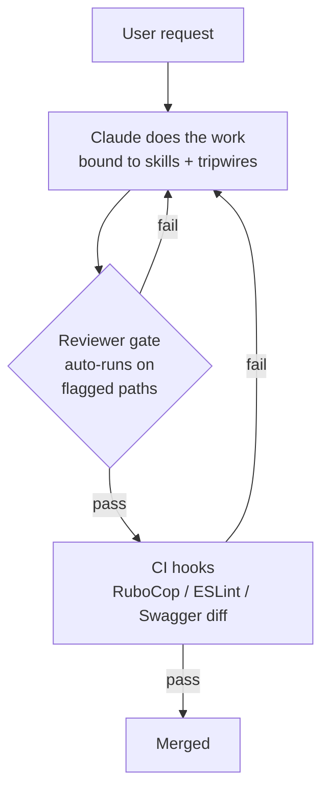
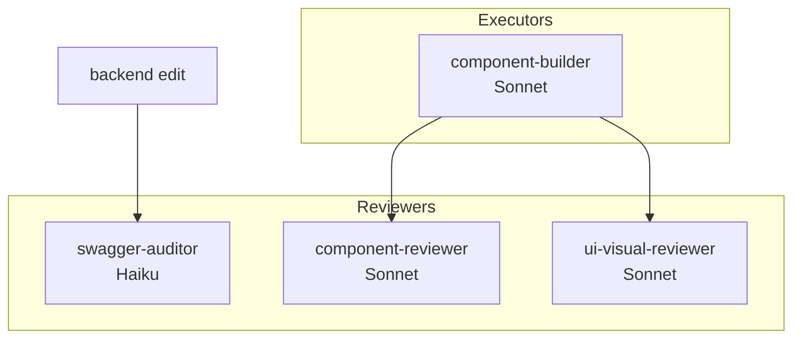
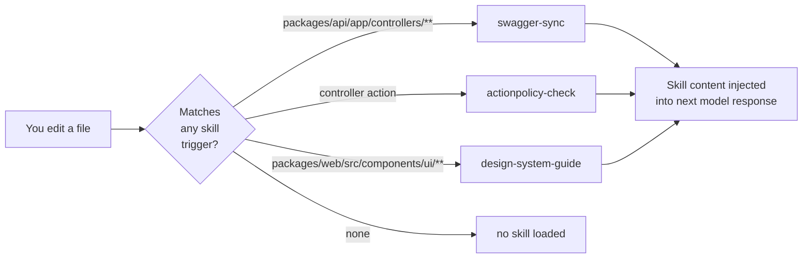
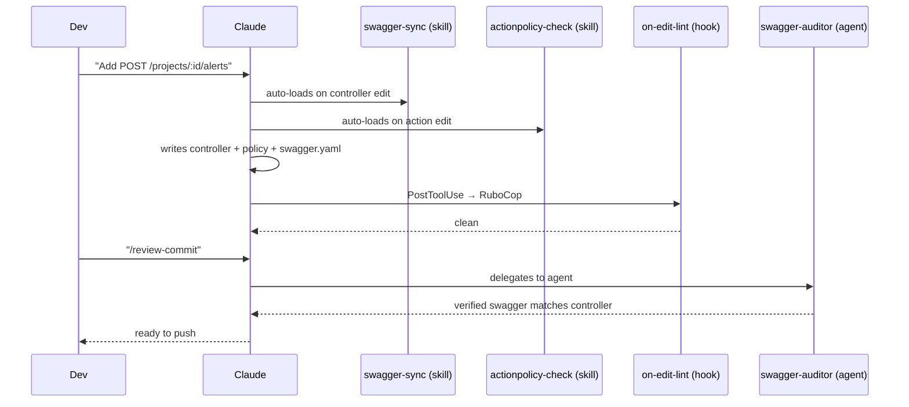
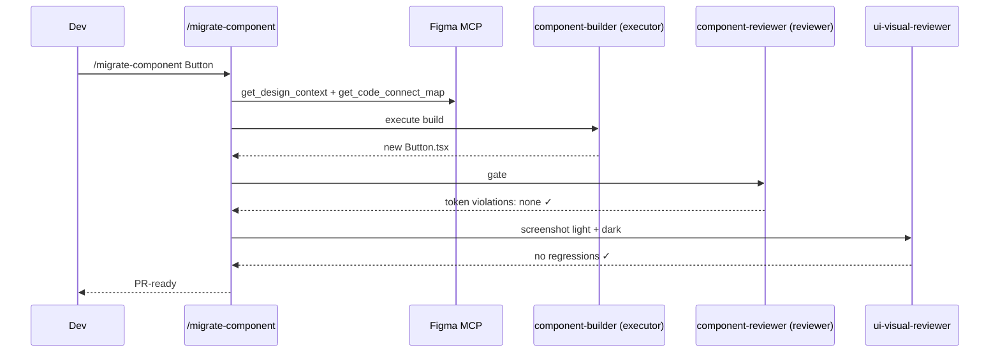
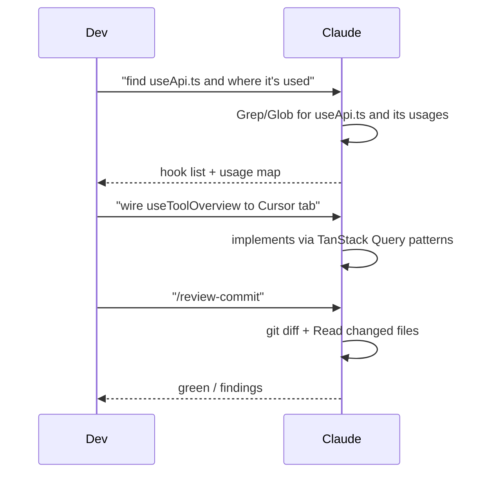

## insights

> Welcome! This doc explains the Claude tooling you have access to in this project: commands you can type, agents the model can spawn, skills that auto-load when you're editing certain files, and hooks that run automation for you.

# AGENTS.md — Claude tooling guide for Aixle Insights

Welcome! This doc explains the Claude tooling you have access to in this project: commands you can type, agents the model can spawn, skills that auto-load when you're editing certain files, and hooks that run automation for you.

> Use Grep, Glob, and Read to explore the codebase. For directed searches use those tools directly. For broader exploration use the Explore subagent.

**Who this is for:** every engineer on Aixle Insights, whether day-one or day-1000. The tooling teaches itself — if you forget how something works, just ask.

**Quick start:** run `/onboard` in Claude Code for a guided 10-minute walkthrough, or `/help-tooling` anytime to see a live catalog of what's available.

For conventions the tooling *enforces* (Alba, ActionPolicy, Swagger sync, etc.), see [CLAUDE.md](CLAUDE.md).

## TL;DR

| Primitive | Invoked by | Use for | File location |
|---|---|---|---|
| **Command** | You type `/name` | Explicit workflows you run on demand | `.claude/commands/*.md` |
| **Agent** | Model spawns via Task tool, or you `@agent-name` | Isolated deep work, specialist reviews | `.claude/agents/*.md` |
| **Skill** | Model auto-triggers on matching context | Domain knowledge pulled in silently | `.claude/skills/<name>/SKILL.md` |
| **Hook** | Harness runs on Claude events | Automation outside the model (lint, tests) | `.claude/hooks/*.ts` via `settings.json` |

Works identically in Claude Code CLI (terminal) and in Agent SDK sessions. Same folder, same schema.

---

## Architecture overview



Reviewer/auditor agents gate sensitive paths; CI hooks backstop everything. The model itself is single-tier — no executor/advisor split.

---

## Folder layout

```
.claude/
├── agents/
│   ├── component-builder.md      # executor — Figma-driven UI build
│   ├── component-reviewer.md     # reviewer — token/a11y gate
│   ├── swagger-auditor.md        # auditor — swagger-sync compliance
│   └── ui-visual-reviewer.md     # reviewer — screenshot regression
├── commands/
│   ├── debug-issue.md
│   ├── help-tooling.md
│   ├── implement-design.md       # Figma URL → production code (7-step MCP workflow)
│   ├── manage-worktrees.md
│   ├── migrate-component.md      # orchestrated component migration
│   ├── onboard.md
│   ├── review-architecture.md
│   └── review-commit.md
├── skills/
│   ├── actionpolicy-check/SKILL.md  # auto-triggered — controller actions
│   ├── design-system-guide/SKILL.md # auto-triggered — components/ui/**
│   └── swagger-sync/SKILL.md        # auto-triggered — controllers/routes
├── hooks/
│   └── on-edit-lint.ts           # PostToolUse: ESLint/RuboCop on edited file (Node.js, cross-platform)
├── scripts/
│   └── convention-check.ts       # Branch name + commit message format checker
├── settings.json                 # committed, portable (DB90_COACHING=true default)
└── settings.local.json           # gitignored, per-dev overrides
```

---

## Primitives in detail

### Commands — things you type (`/name`)

Type `/` in Claude Code to see them all autocomplete. Not sure which to use? Just ask — any command or agent can explain itself if you say "how does this work?"

| Command | When to use | Who it calls |
|---|---|---|
| `/help-tooling` | *"What's available and when do I use what?"* | — (meta) |
| `/onboard` | *"I'm new, walk me through this"* | — (guided) |
| `/review-architecture` | Before a big PR — deep architectural review | Reviewer agents |
| `/review-commit` | Pre-push sanity check | Reviewer agents |
| `/debug-issue` | Hunting a specific bug | — |
| `/migrate-component` | Migrating one component to new design system | component-builder + component-reviewer + ui-visual-reviewer |
| `/manage-worktrees` | Creating/opening/cleaning worktrees | — |
| `/implement-design` | Implement a Figma node URL into code — 7-step MCP workflow | Figma MCP |

### Agents — model invokes (specialists, isolated context)

Every agent is either an **executor** (does work) or a **reviewer** (gates work). Never both.



| Agent | Role | Scope | Model |
|---|---|---|---|
| `swagger-auditor` | Auditor (hard gate) | Controller diff + swagger.yaml diff | Haiku |
| `component-builder` | Executor | Figma node → shadcn/Radix component | Sonnet |
| `component-reviewer` | Reviewer | Token usage, dark mode, a11y | Sonnet |
| `ui-visual-reviewer` | Reviewer | Screenshots in both themes, visual regression | Sonnet |

Backend review work is covered by `/review-architecture` and `/review-commit` (no dedicated reviewer agent).

### Skills — auto-triggered (silent domain knowledge)



### Hooks — harness automation (silent enforcement)

Triggered by Claude Code events, not the model. Run shell commands; output is visible to Claude but side effects (e.g. RuboCop auto-correct) apply immediately.

- `PostToolUse` on `Edit|Write` → `on-edit-lint.ts` runs ESLint/RuboCop on just the edited file (Node.js, cross-platform — works on Windows, macOS, and Linux).
- Pre-approved Bash permissions remove prompt fatigue for safe commands.

---

## Example flows

### Adding a new API endpoint



### Migrating a design-system component



### Wiring a mocked UI to a real endpoint



---

## When to use what — decision tree

```mermaid
flowchart TD
    start[I want to...] --> q1{Explicit workflow\nI run on demand?}
    q1 -->|yes| cmd[Use a /command]
    q1 -->|no| q2{Should Claude pull\nin knowledge\nautomatically?}
    q2 -->|yes| skill[Write a skill]
    q2 -->|no| q3{Need isolated\ndeep work\nor specialist?}
    q3 -->|yes| agent[Write an agent]
    q3 -->|no| q4{Outside-the-model\nautomation?\n(lint, CI, format)}
    q4 -->|yes| hook[Write a hook]
    q4 -->|no| docs[Document in CLAUDE.md]
```

---

## UI tooling stack

For any UI-related work, use this combo:

| Tool | When | Why |
|---|---|---|
| **Figma Desktop MCP** | Build time — source of truth | Full API: code connect, variables, screenshots |
| **Claude_Preview** | Build time — inline render check | Fast feedback loop |
| **Browser MCP** (`@browsermcp/mcp`) | Review — screenshots, interaction, auth-required pages | Connects to running Chrome, preserves Keycloak sessions |
| **Figma Web MCP** | Fallback only | Desktop unavailable |

Browser MCP connects to the developer's already-running Chrome via the Browser MCP extension. It does not open a blank browser window. See `packages/web/README.md` for setup.

---

## Setup — for new engineers

### One-time machine setup (5 minutes)

```bash
# 1. Clone and install
git clone git@github.com:dualboot-partners/db90-rails.git
cd db90-rails
make up            # Start Docker services
make api &         # Run Rails in background
make web &         # Run Vite in background

# 2. Verify Claude Code sees the tooling (in Claude Code CLI)
# Open the repo in a new terminal:
claude
# Type: /
# You should see all commands listed under /

# 3. Verify hook works
# Inside Claude: ask to edit any .rb file
# You should see RuboCop output appear after the edit

# 4. Set up personal overrides (optional — experienced devs turn off coaching)
cp .claude/settings.local.json.example .claude/settings.local.json
# Edit to set DB90_COACHING=false or add your personal permissions
```

### Figma MCP setup (for UI work)

1. Open Figma Desktop.
2. Open the Aixle Insights design system file (ask lead for link).
3. In Claude Code, the Figma MCP is auto-detected when Desktop is running. Verify with: "list Figma libraries".

### Browser automation setup (first time)

Install the **Browser MCP** Chrome extension (search `Browser MCP` on the Chrome Web Store) — that's all. The MCP server is already configured in `.mcp.json` (`browsermcp` → `npx @browsermcp/mcp@latest`).

The agent connects to your already-running Chrome (with existing Keycloak sessions) via `npx @browsermcp/mcp@latest`. No blank browser window; click the Browser MCP toolbar icon to connect the tab.

See **`packages/web/README.md → Browser Automation & UI Review`** for full details.

`ui-visual-reviewer` will use Browser MCP to verify visual accuracy and feature behavior when invoked. Baseline snapshot storage and historical diff artifacts are out of scope for now — the reviewer verifies current state only.

### Worktree setup (for parallel tickets)

```bash
# In the main repo
claude
# Inside Claude:
/manage-worktrees create a worktree for AIX-XX
# Then open a new terminal at the worktree path and run `claude` there.
```

---

## How to work — common workflows

### A. Add a new API endpoint

1. In Claude: "Add `GET /organizations/:id/alerts`."
2. Claude auto-loads the `swagger-sync` skill when you edit a controller, and `actionpolicy-check` when you edit an action.
3. Claude writes controller + policy + `swagger.yaml` + spec.
4. `on-edit-lint` hook runs RuboCop automatically — fix anything it flags.
5. Run `make test-api` to confirm specs pass.
6. Invoke `/review-commit` before pushing — spawns `swagger-auditor`.
7. Push. CI runs full RuboCop + Brakeman + RSpec.

### B. Migrate a design-system component from new Figma

1. Make sure Figma Desktop is open on the component's page.
2. In Claude: `/migrate-component Button`
3. The command orchestrates: Figma pull → impl diff → consumer list → `component-builder` → `component-reviewer` → `ui-visual-reviewer`.
4. Review the diff and visual review findings.
5. Commit and open PR.

### C. Wire a mocked UI to a real endpoint

1. Ask Claude to find the existing hook (it'll Grep/Glob directly).
2. "Wire the Cursor tab to use `useToolOverview` instead of mock data."
3. Claude edits the page; TanStack Query handles fetching.
4. `on-edit-lint` hook runs ESLint automatically.
5. Manually verify in browser at `http://localhost:5173`.
6. `/review-commit` before pushing — runs the swagger-auditor and lint hooks.

### D. Debug a bug

1. `/debug-issue` — systematic trace using native search tools.
2. Greps for symbols → traces call sites → checks recent commits to see if a recent edit caused it.
3. Reports root cause with specific file:line refs.

### E. Pre-PR architecture review

1. `/review-architecture` — deep dive on maintainability, security, performance.
2. `/review-commit` — lint + test context.
3. Both together before a non-trivial PR.

---

## Reference

### Make commands

```bash
make up            # Start all Docker services
make api           # Run Rails API (port 3000)
make web           # Run Vite dev server (port 5173)
make test          # Run all tests (RSpec + Vitest)
make test-api      # RSpec only
make test-web      # Vitest only
make lint          # Run all linters (RuboCop + ESLint)
make lint-api      # RuboCop
make lint-web      # ESLint
make db-migrate    # Run pending migrations
make db-seed       # Seed the database
```

For direct Ruby commands (`bundle exec`, `rails runner`, `rspec`), run from `packages/api/` (where the Gemfile lives), not the repo root.

### Git conventions

**Branch naming.** Branch from `develop` (never `staging` or `main`):

```
<prefix>/AIX-XX-short-description
```

- `<prefix>` — `feature/` for new functionality, `bugfix/` for bug fixes (also `hotfix/`, `chore/`)
- `AIX-XX` — Linear ticket ID
- `short-description` — kebab-case, 2–4 words
- Examples: `feature/AIX-61-user-auth`, `bugfix/AIX-319-google-sign-in`

**Commit messages.** Conventional Commits are mandatory:

```
<type>(<scope>): [AIX-XX] short imperative description
```

- `<type>` — one of `feat`, `fix`, `refactor`, `test`, `docs`, `chore`, `perf`, `ci`
- `<scope>` — optional but encouraged (e.g. `api`, `web`, `aixle-insights`)
- `[AIX-XX]` — Linear ticket ID, required in the subject (not the footer)
- Imperative mood: "Add", "Fix", "Update", "Remove" — not "Added"
- Subject line under 72 characters
- Examples:
  - `feat(api): [AIX-184] Add project route guard and token refresh`
  - `fix(aixle-insights): [AIX-338] Pass resolved path to sqlite open helper`

See [CLAUDE.md](CLAUDE.md#git--worktree-integrity) for the authoritative rule.

**Flow.** Feature branches merge to `develop` via PR. `staging` deploys to staging (auto via CI). `main` deploys to production. CI runs: RSpec, RuboCop, Brakeman, Vitest, ESLint, TypeScript typecheck.

---

## Portability

- `settings.json` uses `${CLAUDE_PROJECT_DIR}` and `${env:VAR}` — never hardcoded absolute paths.
- Hook scripts live in-repo at `.claude/hooks/*.ts` — Node.js, cross-platform (Windows, macOS, Linux), no shell dependency. Invoked via `node --experimental-strip-types` (Node.js 22+ required, already pinned in `.tool-versions`).
- Per-machine overrides belong in `.claude/settings.local.json` (gitignored).

After `git pull`, every contributor gets commands + agents + skills + hooks with zero setup. Browser automation needs one one-time step: install the Browser MCP Chrome extension (see `packages/web/README.md`).

---

## Learning as you work — the tutor layer

Every primitive in `.claude/` is **self-teaching**. You never need to memorize anything.

### Three ways to learn

**1. Ask the primitive directly.**
```
"How does swagger-auditor work?"
"When should I use /review-architecture vs /review-commit?"
"What does the actionpolicy-check skill actually do?"
```
Any agent/skill/command switches to Tutor Mode and explains itself in under 200 words.

**2. Use `/help-tooling`.**
A live catalog generated from `.claude/` — never out of date. Filter by topic:
```
/help-tooling design system
/help-tooling backend
/help-tooling review
```

**3. Use `/onboard` once.**
A 10-minute guided walkthrough for new engineers. Run it again anytime as a refresher.

### Coaching trailers (default on)

By default, non-trivial commands end with a one-line trailer explaining *why* that path was taken:

> *(You saw the swagger-sync skill fire because you edited a controller. Run `/help-tooling swagger-sync` for more.)*

**Experienced devs can turn these off** by setting `"DB90_COACHING": "false"` in `.claude/settings.local.json`.

---

## A few principles

- **Defaults prefer safety over speed.** Coaching is on, reviewers run by default, CI hooks enforce what skills only suggest.
- **Nothing is enforced only at the model layer.** Every convention also has a backstop (RuboCop, ESLint, CI, or a reviewer agent).
- **Portable by construction.** `${CLAUDE_PROJECT_DIR}` and env vars — no `/Users/yourname/...` leaks.
- **Discoverable by construction.** The tooling teaches itself; no separate docs to maintain.
- **Rename is rare; deprecation is loud.** If we rename a command, the commit message flags it and this doc is updated same-PR.

---

## Codebase Exploration

Use Grep, Glob, and Read to explore the codebase. For directed searches (a known file, class, or function) use those tools directly. For broader open-ended exploration, use the Explore subagent.

---
> Source: [AixleHQ/insights](https://github.com/AixleHQ/insights) — distributed by [TomeVault](https://tomevault.io).
<!-- tomevault:4.0:gemini_md:2026-08-11 -->
