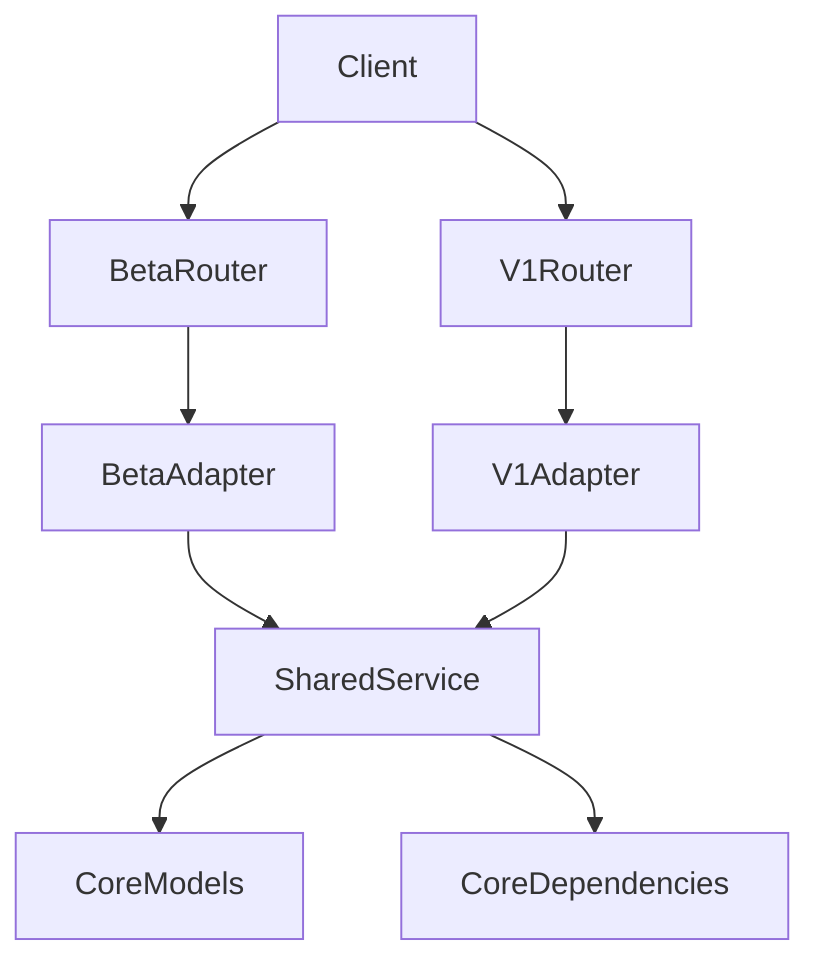

## api-router-structure

> FastAPI versioned API layout, router composition, and per-feature directory structure


# API Router Structure

This document defines the FastAPI layout for versioned APIs.

Use this structure when refactoring an existing FastAPI app so routing, versioning, and application startup stay predictable.

## Intent

- Keep application startup in one place: `src/<package_name>/main.py`
- Keep API version boundaries explicit under `src/<package_name>/api/`
- Keep router registration centralized in each version's `api.py`
- Keep feature endpoints inside version-local `routers/`
- Let a top-level feature own both its own endpoints and nested sub-feature routers
- Make it easy to run `v1` and `beta` side by side during migrations
- Keep versioned HTTP contracts at the edge; share business logic in `core`

## Canonical Layout

```text
src/<package_name>/
├── main.py
├── core/ # shared business logic services, standard models, and dependencies
│   ├── services/
│   ├── standard_models/
│   └── dependencies/
└── api/
    ├── __init__.py
    ├── beta/
    │   ├── __init__.py          # exports api_router
    │   ├── api.py
    │   └── routers/
    │       ├── __init__.py
    │       └── <feature>/
    │           ├── __init__.py
    │           ├── <feature>_router.py
    │           ├── <feature>_models.py
    │           ├── <feature>_service.py
    │           ├── <feature>_dependencies.py
    │           ├── <feature>_adapter.py
    │           └── sub_routers/
    │               ├── __init__.py
    │               └── <sub_feature>/
    │                   ├── __init__.py
    │                   ├── <sub_feature>_router.py
    │                   ├── <sub_feature>_models.py
    │                   ├── <sub_feature>_service.py
    │                   ├── <sub_feature>_dependencies.py
    │                   └── <sub_feature>_adapter.py
    └── v1/
        ├── __init__.py          # exports api_router
        ├── api.py
        └── routers/
            ├── __init__.py
            └── <feature>/
                ├── __init__.py
                ├── <feature>_router.py
                ├── <feature>_models.py
                ├── <feature>_service.py
                ├── <feature>_dependencies.py
                ├── <feature>_adapter.py
                └── sub_routers/
                    ├── __init__.py
                    └── <sub_feature>/
                        ├── __init__.py
                        ├── <sub_feature>_router.py
                        ├── <sub_feature>_models.py
                        ├── <sub_feature>_service.py
                        ├── <sub_feature>_dependencies.py
                        └── <sub_feature>_adapter.py
```

Every feature router gets a directory. No flat files for routers. A top-level feature may also contain its own nested `sub_routers/` directory for sub-features. The `<feature>` and `<sub_feature>` templates show the full scope of files a router package may include; omit any file that is not needed for a given feature.

## Directory Responsibilities

### `src/<package_name>/main.py`

Own the application lifecycle and top-level app wiring only.

- Create the FastAPI `app`
- Define the lifespan context manager
- Register middleware
- Register exception handlers
- Mount static assets if needed
- Include version routers by importing `api_router` from version packages
- Define only non-versioned endpoints (e.g. `/`)

Do not define versioned endpoints (e.g. `/api/v1/...` or `/api/beta/...`) in `main.py`. All versioned HTTP surface belongs under `src/<package_name>/api/<version>/...`.

Do not spread app startup, middleware setup, or version registration across multiple files.

Minimal pattern:

```python
from contextlib import asynccontextmanager
from collections.abc import AsyncGenerator

from fastapi import FastAPI

from <package_name>.api import beta
from <package_name>.api import v1


@asynccontextmanager
async def lifespan(app: FastAPI) -> AsyncGenerator[None, None]:
    # Initialize shared resources here.
    yield
    # Tear down shared resources here.


app = FastAPI(lifespan=lifespan)

app.include_router(v1.api_router)
app.include_router(beta.api_router)
```

### Version Package Exports

`src/<package_name>/api/v1/__init__.py` and `src/<package_name>/api/beta/__init__.py` export `api_router` directly so `main.py` imports the version package contract, not internal `api.py` paths.

```python
# api/v1/__init__.py
from <package_name>.api.v1.api import api_router

__all__ = ["api_router"]
```

```python
# api/beta/__init__.py
from <package_name>.api.beta.api import api_router

__all__ = ["api_router"]
```

### `src/<package_name>/api/`

This directory is the versioning boundary for the HTTP API.

- `api/beta/` is the first pass at an API surface before contracts and behavior are hardened
- `api/v1/` contains the hardened, stable versioned routes
- Future versions follow the same pattern: `api/v2/`, `api/v3/`, and so on

The top-level `api/` directory should not hold endpoint logic directly. It only organizes versions.

### `src/<package_name>/api/<version>/api.py`

This file is the composition point for a single API version.

- Define the version prefix once
- Import router modules from that version's `routers/` directory
- Register routers declaratively via a `ROUTER_MODULES` tuple and loop
- Keep version-specific assembly out of `main.py`

The declarative pattern keeps diffs clean and version-to-version comparisons easy. It also allows optional router inclusion later (e.g. config-driven gating for telemetry or internal endpoints) without changing the structure.

Minimal pattern:

```python
from fastapi import APIRouter

from <package_name>.api.v1.routers import feature_a, feature_b
from <package_name>.core.config import config

api_router = APIRouter(prefix=config.API_V1_STR)

ROUTER_MODULES = (
    feature_a,
    feature_b,
)

for router_module in ROUTER_MODULES:
    api_router.include_router(router_module.router)
```

For beta, keep the same shape but swap the prefix for the beta path, for example `"/api/beta"`.

### `src/<package_name>/api/<version>/routers/`

This directory holds all routers for one API version.

- Every feature gets a directory
- Group routes by feature area
- Keep files version-local, even if two versions expose similar features
- Version folders own HTTP contracts, not duplicated business logic
- Compose only top-level feature routers here; sub-features are composed inside their parent feature package

## Per-Feature Directory Contract

Each feature directory follows a thin-router split. Keep routers thin; push non-routing code out aggressively.

| File | Purpose |
|------|---------|
| `<feature>_router.py` | Route definitions, request parsing, response shaping |
| `<feature>_models.py` | Version-local request/response schemas when they differ from shared models |
| `<feature>_service.py` | Feature-specific orchestration that does not belong in `core/services` |
| `<feature>_dependencies.py` | Feature-specific FastAPI dependencies |
| `<feature>_adapter.py` | Maps core standard models into version-specific models (when needed) |
| `sub_routers/` | Optional nested sub-feature packages composed by the top-level feature router |

If a router file grows large, split into these modules. Shared business logic belongs in `core/services`. Shared domain models belong in `core/standard_models`.

Example feature directory (e.g. `session`):

```text
src/<package_name>/api/v1/routers/session/
├── __init__.py
├── session_router.py
├── session_models.py
├── session_service.py
├── session_dependencies.py
└── session_adapter.py
```

`__init__.py` exports the router (replace `session` with your feature name):

```python
from <package_name>.api.v1.routers.session.session_router import router

__all__ = ["router"]
```

`<feature>_router.py` holds the actual endpoints:

```python
from fastapi import APIRouter

router = APIRouter(
    prefix="/session",
    tags=["session"],
)


@router.get("/health")
async def session_health() -> dict[str, bool]:
    return {"ok": True}
```

## Sub-Feature Router Contract

Use a sub-feature when a top-level feature owns a family of related endpoints and needs internal organization, but the HTTP surface should still roll up under the parent feature prefix.

Example: `session` owns `/session`, but `tokens` and `devices` are distinct sub-areas under that feature.

```text
src/<package_name>/api/v1/routers/session/
├── __init__.py
├── session_router.py
├── session_models.py
├── session_service.py
├── session_dependencies.py
├── session_adapter.py
└── sub_routers/
    ├── __init__.py
    ├── tokens/
    │   ├── __init__.py
    │   ├── tokens_router.py
    │   ├── tokens_models.py
    │   ├── tokens_service.py
    │   ├── tokens_dependencies.py
    │   └── tokens_adapter.py
    └── devices/
        ├── __init__.py
        └── devices_router.py
```

Rules:

- The version `api.py` includes only the top-level feature router, such as `session`
- The parent feature router owns the base prefix, such as `"/session"`
- The parent feature router may define its own endpoints and also include sub-feature routers from `sub_routers/`
- Sub-feature routers use relative prefixes from the parent, such as `"/tokens"` and `"/devices"`
- Keep nesting shallow. Default to one extra router layer. Only go deeper if the feature is genuinely large
- Shared logic for the whole feature stays in `core/services` or the parent feature package, not duplicated across sub-features

Top-level feature package export:

```python
from <package_name>.api.v1.routers.session.session_router import router

__all__ = ["router"]
```

Parent feature router composition:

```python
from fastapi import APIRouter

from <package_name>.api.v1.routers.session.sub_routers import devices_router
from <package_name>.api.v1.routers.session.sub_routers import tokens_router

router = APIRouter(
    prefix="/session",
    tags=["session"],
)

SUB_ROUTERS = (
    tokens_router,
    devices_router,
)

for sub_router in SUB_ROUTERS:
    router.include_router(sub_router)


@router.get("/health")
async def session_health() -> dict[str, bool]:
    return {"ok": True}
```

Sub-routers package export:

```python
from <package_name>.api.v1.routers.session.sub_routers.devices import router as devices_router
from <package_name>.api.v1.routers.session.sub_routers.tokens import router as tokens_router

__all__ = ["devices_router", "tokens_router"]
```

Sub-feature package export:

```python
from <package_name>.api.v1.routers.session.sub_routers.tokens.tokens_router import router

__all__ = ["router"]
```

Sub-feature router example:

```python
from fastapi import APIRouter

router = APIRouter(
    prefix="/tokens",
    tags=["session"],
)


@router.post("/refresh")
async def refresh_session_token() -> dict[str, bool]:
    return {"ok": True}
```

This keeps the composition tree predictable:

- `main.py` assembles versions
- `api/<version>/api.py` assembles top-level features
- `<feature>_router.py` assembles that feature's own sub-features
- `<sub_feature>_router.py` defines only the sub-feature endpoints

## Shared Logic Across Versions

`beta` and `v1` share implementation to avoid duplication and drift. Version folders own HTTP contracts; shared behavior lives in `core`.



- **`core/services/`** - Version-agnostic use-case orchestration. Returns domain objects or internal DTOs, not router-shaped payloads.
- **`core/standard_models/`** - Default location for shared contracts and domain models. Version-local models only when wire shape or logic differs.
- **`core/dependencies`** - FastAPI composition layer: DB, Redis, auth/session validation, service factories.

When promoting a feature from `beta` to `v1`:

1. Reuse the same shared service
2. Reuse the same core dependencies
3. Reuse shared models from `core/standard_models`
4. Copy or adjust only the version contract layer (router, models, adapter) if the HTTP schema changed
5. If the schema did not change, point `v1` at the same adapter or promote that schema into a shared model

Version-local overrides exist only when behavior or wire shape diverges.

## Refactor Rules

When moving an existing FastAPI project into this layout:

1. Move app creation, lifespan, middleware, and exception wiring into `src/<package_name>/main.py`.
2. Move any versioned endpoints out of `main.py` into the appropriate version router.
3. Create `src/<package_name>/api/` as the root for API versions.
4. Create one subdirectory per version, such as `src/<package_name>/api/v1` and `src/<package_name>/api/beta`.
5. Add `__init__.py` in each version directory that exports `api_router`.
6. Add `api.py` inside each version directory to assemble that version's routers.
7. Move feature endpoints into `src/<package_name>/api/<version>/routers/` as feature directories.
8. If a feature needs internal structure, add `sub_routers/` inside that feature and compose sub-features in the parent `<feature>_router.py`.
9. Keep imports absolute so version boundaries stay obvious.
10. Include only version routers in `main.py`, not individual feature routers.

## What Goes Where

- `main.py`: app startup, app-wide wiring, non-versioned endpoints only
- `api/<version>/__init__.py`: exports `api_router`
- `api/<version>/api.py`: version prefix and declarative router composition
- `api/<version>/routers/<feature>/`: feature endpoints for one version
- `api/<version>/routers/<feature>/sub_routers/<sub_feature>/`: nested sub-feature endpoints owned by the parent feature
- `core/services/`: shared business logic services
- `core/standard_models/`: shared domain models and contracts
- `core/dependencies`: shared FastAPI dependencies

## Boilerplate Checklist

For a new API version:

- Create `src/<package_name>/api/<version>/`
- Add `__init__.py` that exports `api_router`
- Add `api.py` with declarative `ROUTER_MODULES`
- Add `routers/` with feature directories
- Import the version package into `src/<package_name>/main.py`
- Register it with `app.include_router(<version>.api_router)`

For a new feature router:

- Add the feature directory under `src/<package_name>/api/<version>/routers/`
- Export the router module from the feature `__init__.py`
- Add the router module to `ROUTER_MODULES` in `api.py`
- Register it via the loop in `api.py`

For a new sub-feature router:

- Add the sub-feature directory under `src/<package_name>/api/<version>/routers/<feature>/sub_routers/`
- Export the sub-feature router from the sub-feature `__init__.py`
- Import the sub-feature package into the parent `<feature>_router.py`
- Add the sub-feature module to the parent feature's `ROUTER_MODULES`
- Register it via the loop in the parent `<feature>_router.py`

---
> Source: [albusOS/sku-ops](https://github.com/albusOS/sku-ops) — distributed by [TomeVault](https://tomevault.io).
<!-- tomevault:4.0:gemini_md:2026-04-30 -->
