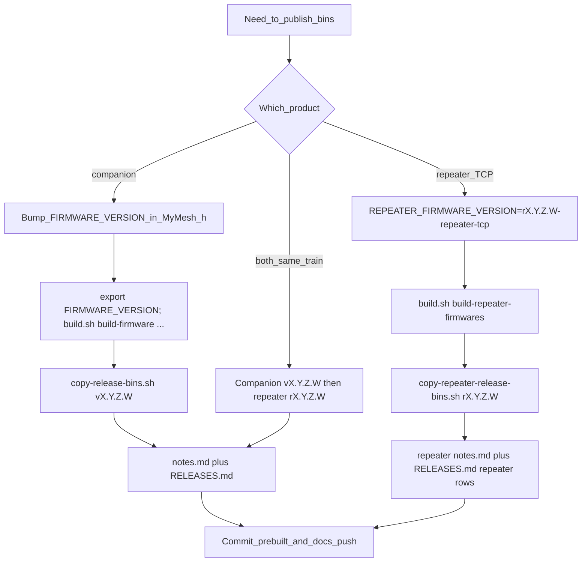

## meshcomod

> Use this file as the **single entrypoint** when promoting ESP32 meshcomod builds into **`prebuilt/`** on **`main`**. Human-oriented detail lives in [`docs/RELEASE_PROCEDURE.md`](docs/RELEASE_PROCEDURE.md), [`docs/REPEATER_RELEASE_PROCEDURE.md`](docs/REPEATER_RELEASE_PROCEDURE.md), and [`prebuilt/README.md`](prebuilt/README.md).

# Agent playbook: meshcomod prebuilt firmware on GitHub

Use this file as the **single entrypoint** when promoting ESP32 meshcomod builds into **`prebuilt/`** on **`main`**. Human-oriented detail lives in [`docs/RELEASE_PROCEDURE.md`](docs/RELEASE_PROCEDURE.md), [`docs/REPEATER_RELEASE_PROCEDURE.md`](docs/REPEATER_RELEASE_PROCEDURE.md), and [`prebuilt/README.md`](prebuilt/README.md).

## Invariants

1. **Immutable version folders:** Never replace binaries inside an existing **`prebuilt/releases/companion/v*…/`**, **`prebuilt/releases/repeater/r*…/`**, or **`prebuilt/releases/rooms/r*…/`** tree to mean “the same release.” Cut a **new** version id for any new drop.
2. **Independent “latest” tracks:** **`scripts/copy-release-bins.sh`** (companion), **`scripts/copy-repeater-release-bins.sh`** (TCP repeater), and **`scripts/copy-room-release-bins.sh`** (room multitransport) each update **their own** stable names under **`prebuilt/`**. Running one does **not** change the others’ latest files.
3. **Working directory:** All commands below assume **`cd`** to the **MeshCore** repo root (the directory that contains **`build.sh`** and **`scripts/`**).
4. **Use `build.sh`:** Do not promote ad-hoc **`pio run`** outputs unless filenames match what the copy scripts expect (see [`prebuilt/README.md`](prebuilt/README.md)).

## Decision tree

| Goal | Do this |
|------|---------|
| **Companion-only release** | Bump **`FIRMWARE_VERSION`** in **`examples/companion_radio/MyMesh.h`** → build companion envs → **`copy-release-bins.sh`** → **`prebuilt/releases/companion/v*…/notes.md`** + **`RELEASES.md`** → commit & push. **Skip** repeater build and **`copy-repeater-release-bins.sh`**. Repeater **`prebuilt/*.bin`** and **`prebuilt/releases/repeater/`** are unchanged. |
| **Repeater TCP–only release** | Set **`REPEATER_FIRMWARE_VERSION=rX.Y.Z.W-repeater-tcp`** (recommended; legacy **`vX.Y.Z.W-repeater-tcp`** still globs) → **`build.sh build-repeater-firmwares`** → **`copy-repeater-release-bins.sh rX.Y.Z.W`**. **Do not** set **`FIRMWARE_VERSION`** for repeater-only work. Update **`prebuilt/releases/repeater/r*…/notes.md`** / **`RELEASES.md`**. Companion **`prebuilt/*companion*.bin`** are unchanged unless you also run companion copy. |
| **Same train: companion + repeater** | Use matching numeric trains: **`vX.Y.Z.W`** (companion) and **`rX.Y.Z.W`** (repeater). Run **companion** first (**`copy-release-bins.sh vX.Y.Z.W`**, **`copy-heltec-v4-meshcomod-extras.sh vX.Y.Z.W`**), then **repeater** (**`REPEATER_FIRMWARE_VERSION=…-repeater-tcp`**, **`build-repeater-firmwares`**, **`copy-repeater-release-bins.sh rX.Y.Z.W`** or legacy **`vX.Y.Z.W`**). Destinations: **`prebuilt/releases/companion/vX.Y.Z.W/`** and **`prebuilt/releases/repeater/rX.Y.Z.W/`**. |
| **Room multitransport only** | Set **`ROOM_FIRMWARE_VERSION=rX.Y.Z.W-room-mt`** → **`sh build.sh build-room-multitransport-firmwares`** → **`sh scripts/copy-room-release-bins.sh rX.Y.Z.W`**. Update **`prebuilt/releases/rooms/rX.Y.Z.W/notes.md`** / **`RELEASES.md`** if you document the drop. Companion and repeater **`prebuilt/`** trees are unchanged unless you also run those copy scripts. |

**Repeater release id ≠ companion latest:** Repeater may ship **`r1.14.1.2`** while companion latest is **`v1.14.1.9`**. Choose **`r*`** to match the **`‑repeater-tcp`** string’s four-part base (map **`v` → `r`** in the folder name).

## Commands (copy-paste templates)

### Companion (USB+TCP meshcomod radio)

```bash
cd /path/to/MeshCore
# 1. Edit examples/companion_radio/MyMesh.h → FIRMWARE_VERSION "vX.Y.Z.W"
export FIRMWARE_VERSION=vX.Y.Z.W
export DISABLE_DEBUG=1   # recommended for release

sh build.sh build-firmware heltec_v4_companion_radio_usb_tcp
sh build.sh build-firmware Heltec_v3_companion_radio_usb_tcp
sh build.sh build-firmware heltec_v4_tft_companion_radio_usb_tcp_touch
sh build.sh build-firmware Heltec_Wireless_Paper_companion_radio_usb_tcp

sh scripts/copy-release-bins.sh vX.Y.Z.W
```

### Repeater TCP (Wi‑Fi companion subset)

```bash
cd /path/to/MeshCore
export REPEATER_FIRMWARE_VERSION=rX.Y.Z.W-repeater-tcp
export DISABLE_DEBUG=1
sh build.sh build-repeater-firmwares
sh scripts/copy-repeater-release-bins.sh rX.Y.Z.W
# Legacy: vX.Y.Z.W maps to release dir rX.Y.Z.W and globs vX.Y.Z.W-repeater-tcp in out/
```

### Optional: Heltec V4 extras (see prebuilt README)

```bash
sh scripts/copy-heltec-v4-meshcomod-extras.sh vX.Y.Z.W
```

## What to commit

- **`prebuilt/`** (updated stable names)
- **`prebuilt/releases/companion/<v*>/`** and/or **`prebuilt/releases/repeater/<r*>/`** (versioned bins + **`notes.md`**)
- **`RELEASES.md`** (new section at top)
- Source changes (**`MyMesh.h`**, etc.) when version bumped

## Push target

```bash
git push allfather main
```

(Adjust remote/branch if your fork uses different names.)

## Do not

- Do not run **`copy-repeater-release-bins.sh`** with args that do **not** match **`REPEATER_FIRMWARE_VERSION`**’s **`…-repeater-tcp`** glob segment in **`out/`** (see script header for **`v` → `r`** mapping).
- Do not run **`copy-room-release-bins.sh`** unless **`out/`** contains **`meshcomod-<ROOM_FIRMWARE_VERSION>-<sha>`** for **`_room_server_multitransport`** envs (see script header; **`ROOM_FIRMWARE_VERSION`** should end with **`-room-mt`**).
- Do not set **`FIRMWARE_VERSION`** when building **only** repeater targets; use **`REPEATER_FIRMWARE_VERSION`** (see **`build.sh help`**). For **only** room multitransport builds, prefer **`ROOM_FIRMWARE_VERSION`**.
- Do not invent new **`prebuilt/releases/{companion,repeater,rooms}/`** naming schemes; flasher expects companion **`v*.*.*.*`** and repeater / room multitransport pins use **`r*.*.*.*`** (optional **`-broken`**) or legacy **`repeater-X.Y.Z`** under **`repeater/`**.

## CI vs `prebuilt/` on `main`

- **Tag workflow** **[`.github/workflows/build-companion-firmwares.yml`](.github/workflows/build-companion-firmwares.yml)** (e.g. tag **`companion-v1.14.0.20`**) uploads **`out/`** to a **draft GitHub Release**. It does **not** update **`prebuilt/`** on **`main`**.
- **Canonical flasher / OTA URLs** for meshcomod are the committed trees under **`prebuilt/`** and **`prebuilt/releases/`** on **`main`**, unless you change release policy.

## Optional checks

- **`sh scripts/validate-prebuilt-release-folder.sh companion vX.Y.Z.W`**, **`… repeater rX.Y.Z.W`**, or **`… rooms rX.Y.Z.W`** — sanity-check **`notes.md`** claims vs files present (see script header).

## Flow diagram



---
> Source: [ALLFATHER-BV/meshcomod](https://github.com/ALLFATHER-BV/meshcomod) — distributed by [TomeVault](https://tomevault.io).
<!-- tomevault:4.0:gemini_md:2026-05-09 -->
