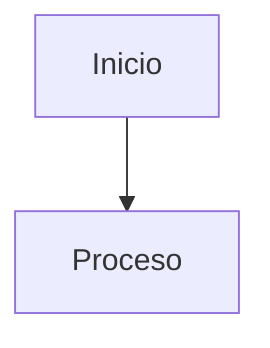

## axis-apuntes

> Este repositorio contiene material educativo para módulos de formación profesional. La documentación está dirigida a **alumnado** y debe ser **didáctica, clara y pedagógica**.

# Guía del Repositorio para Agentes

Este repositorio contiene material educativo para módulos de formación profesional. La documentación está dirigida a **alumnado** y debe ser **didáctica, clara y pedagógica**.

## Skills útiles para este proyecto

Este repositorio está orientado a la generación de contenido educativo. Solo se consideran útiles las skills que ayudan a crear, mejorar o enriquecer materiales didácticos.

- **imagegen**: Usar cuando se necesiten imágenes rasterizadas para apuntes, portadas, recursos visuales, mockups o ilustraciones educativas.  
  Ruta: `/Users/josemanuelgonzalezcastillo/.codex/skills/.system/imagegen/SKILL.md`
- **openai-docs**: Usar únicamente cuando se creen contenidos educativos relacionados con productos, APIs o modelos de OpenAI y sea necesario consultar documentación oficial actualizada.  
  Ruta: `/Users/josemanuelgonzalezcastillo/.codex/skills/.system/openai-docs/SKILL.md`
- **clonezilla-helper**: Usar cuando se generen apuntes, prácticas o guías educativas sobre Clonezilla, clonación de discos, creación de imágenes, restauración o despliegue en laboratorio.  
  Ruta: `/Users/josemanuelgonzalezcastillo/.codex/skills/clonezilla-helper/SKILL.md`
- **content-research-writer**: Usar cuando se necesite crear, ampliar o revisar contenidos educativos con estructura didáctica, mejores introducciones, citas, esquemas y revisión por secciones.  
  Ruta: `/Users/josemanuelgonzalezcastillo/.codex/skills/content-research-writer/SKILL.md`
- **research**: Usar cuando se necesite investigación estructurada con validación en varias fuentes y referencias completas para apuntes, unidades o recursos técnicos.  
  Ruta: `/Users/josemanuelgonzalezcastillo/.codex/skills/research/SKILL.md`
- **images-search**: Usar cuando se necesiten buscar imágenes reales en la web para incluirlas en documentación educativa. Requiere `BRAVE_SEARCH_API_KEY`.  
  Ruta: `/Users/josemanuelgonzalezcastillo/.agents/skills/images-search/SKILL.md`
- **web-search**: Usar cuando se necesite buscar, contrastar o extraer información web actualizada para enriquecer contenidos educativos, verificar conceptos técnicos o recopilar fuentes de referencia.  
  Ruta: `/Users/josemanuelgonzalezcastillo/.agents/skills/web-search/SKILL.md`
- **scrape**: Usar cuando se necesite extraer contenido de páginas concretas o listas de URLs para convertirlo en Markdown, HTML o JSON reutilizable en documentación educativa.  
  Ruta: `/Users/josemanuelgonzalezcastillo/.agents/skills/scrape/SKILL.md`
- **mkdocs**: Usar cuando se modifique la estructura del sitio, navegación, configuración, tema Material, plugins, búsqueda o publicación de la documentación MkDocs.  
  Ruta: `/Users/josemanuelgonzalezcastillo/.codex/skills/mkdocs/SKILL.md`
- **frontend-design**: Usar cuando se creen o mejoren recursos visuales web del proyecto, páginas HTML, componentes, portadas o interfaces educativas con diseño cuidado y responsive.  
  Ruta: `/Users/josemanuelgonzalezcastillo/.agents/skills/frontend-design/SKILL.md`
- **navigation-menu-generator**: Usar cuando se reorganice la navegación del sitio, menús, estructura de unidades, accesos a recursos o enlaces principales del módulo.  
  Ruta: `/Users/josemanuelgonzalezcastillo/.agents/skills/navigation-menu-generator/SKILL.md`
- **html-ppt**: Usar cuando se necesiten crear presentaciones HTML estáticas tipo PPT para contenidos educativos, con temas, plantillas, animaciones, navegación por teclado y modo presentador. Es especialmente útil para generar slides de unidades didácticas, exposiciones de aula o materiales de apoyo visual.  
  Ruta: `/Users/josemanuelgonzalezcastillo/.agents/skills/html-ppt/SKILL.md`

## Normas de redacción de apuntes

- Los apuntes deben ser claros, didácticos y orientados al aprendizaje del alumnado.
- No se permitirán faltas de ortografía en ningún contenido generado o editado.
- Todas las frases y todas las preguntas deben comenzar por mayúscula.
- Se deben seguir las reglas ortográficas del español (acentuación, puntuación y uso correcto de signos de interrogación y exclamación de apertura y cierre).
- Cada vez que se edite un fichero `.md`, se añadirá al final una línea con la fecha de actualización, con el formato: `**Fecha de actualización:** 31/01/2026`.
- Las cuestiones generadas se guardarán en un fichero en la raíz del repositorio. El nombre del fichero debe incluir el nombre del módulo y el nivel de dificultad.
- Cuando se solicite generar cuestiones, se generará directamente el fichero `.gift` final; no se crearán módulos ni scripts en Python para esa tarea.
- Siempre se generarán 30 cuestiones de tipo cuestionario en formato GIFT.
- Al finalizar cada generación de cuestiones, se validará el fichero con las reglas incluidas en este AGENTS.md.
- En cuestiones tipo test y de desarrollo, no se incluirán preguntas que obliguen a memorizar datos numéricos concretos (por ejemplo, nº de núcleos, tasas, latencias u otros valores específicos de dispositivos o conceptos).
- En preguntas tipo test y de desarrollo, los enunciados deben empezar por ¿ y terminar en ? y respetar tildes y ortografía correcta.
- En preguntas tipo test no se incluirán casos de taller. Si excepcionalmente se incluyen, deberán ser menos del 10% del total de preguntas del fichero.

## Estructura de documentos teóricos (teoria/)

Los archivos de teoría (teoria/) deben seguir esta estructura:

```
---
title: "UD X - X.Y Título del tema"
description: Breve descripción
summary: Resumen corto
authors:
    - Eduardo Fdez
date: YYYY-MM-DD
icon: "material/file-document-outline"
permalink: /modulo/unidadX/X.Y
categories:
    - MODULO
tags:
    - Tag1
    - Tag2
---

## X.Y. Título del tema

[Introducción al tema que explique el contexto y objetivo]

### 1. Primer concepto

[Explicación clara del concepto]

#### 1.1. Subconcepto o ejemplo práctico

[Explicación detallada del subconcepto]

### 2. Segundo concepto

[Continuar con estructura similar]
```

Además, este texto representa un patrón a seguir y explica cómo generar la documentación siguiendo este patrón. Es **muy importante** respetar los saltos de línea y el número de espacios de indentación (4 espacios):

Aconsejamos una lista de cosas, deben seguirse para generar documentos claros y didácticos:

- Ser claro y concisos.
  
    - Como es otro bloque de identación, 4 espacios mas. y una linea en blanco antes y despues del bloque identado.
    - La identación será de 4 espacios.
    - Usar listas para organizar ideas, pero no abusar de ellas.
  
        - Como es otro bloque de identación, 4 espacios mas. y una linea en blanco antes y despues del bloque.
        - Asegurarse de que cada punto aporta valor.
        - Dividir el contenido en secciones lógicas.
        
    - Incluir definiciones cuando sea necesario.
    
- Incluir ejemplos visuales.
- Usar subtítulos para organizar la información.

También se pueden incluir listas de numeradas, en este formato y es **importante** respetar los saltos de línea y número de espacios de indentación (4 espacios):

A continuación un listado: 

1. Primer punto importante
2. Segundo punto relevante
   
    - Como es otro bloque de identación, 4 espacios mas. y una linea en blanco antes y despues del bloque identado.
    - Y anidar las viñetas si es necesario
    
3. Tercer punto clave

Se pueden incluir citas en bloque para resaltar definiciones o ideas clave:

> La programación es el proceso de crear un conjunto de instrucciones que le dicen a una computadora cómo

Se pueden incluir bloques de código para ilustrar ejemplos prácticos:

También es importante incluir imágenes o diagramas para ilustrar conceptos complejos.
[Ejemplos si procede]

```
<figure markdown>   
     
  <figcaption>Descripción de la imagen</figcaption>   
</figure>
```

## Formato recomendado para apuntes

- Título principal con el nombre de la unidad y tema
- Objetivos de aprendizaje (3-5 puntos)
- Desarrollo del contenido con subsecciones claras
- Ejemplos prácticos o casos reales
- Resumen final en 3-5 ideas clave
- Referencias y enlaces (si aplica)
- Incluye todas las imagenes que consideres oportunas para complementar adecuadamente los apuntes.
- Estas autorizado a descargar todas las imagenes que consideres oportunas.

## Normas para diagramas en apuntes

- Cuando un concepto lo requiera, incluir diagramas explicativos en los apuntes (flujo, decisiones, relaciones entre componentes o procesos).
- Priorizar siempre diagramas e imágenes en español. Si un diagrama o imagen está en otro idioma, no incluirlo.
- Las búsquedas de imágenes/diagramas y fuentes para apuntes deben hacerse en español.
- Al buscar imágenes web para documentación educativa, usar imágenes con fuente clara y preferiblemente licencia Creative Commons, Wikimedia Commons o documentación oficial.
- Guardar siempre la URL original, el autor si aparece y la licencia indicada por la fuente.
- Insertar las imágenes en Markdown con `alt` descriptivo y `figcaption`.
- Evitar imágenes visualmente atractivas pero sin procedencia verificable, autoría clara o licencia compatible.
- Si ayuda a clarificar, usar diagramas Mermaid dentro del propio `.md` con bloques:



- En temas de diagnóstico o secuencias técnicas, incluir decisiones y rutas de error cuando aporte valor didáctico.
- Insertar el diagrama en el punto temático que corresponda (no dejarlo como prueba aislada fuera del contenido final).
- Si se crea una prueba temporal de diagrama, eliminar después el fichero de prueba y cualquier enlace en `mkdocs.yml` o índices.
- Validar siempre visualización final con `mkdocs build` y/o `mkdocs serve` para comprobar que el diagrama renderiza y no queda como bloque de código.

## 1. Estructura del repositorio

### 1.1. Carpeta `docs/`

Contiene la documentación principal en formato MkDocs Material. Está organizada por módulos:

- **section1**: Montaje y Mantenimiento de Equipos Informáticos
- **section2**: Sistemas Informáticos

#### Estructura general por módulo

```
docs/
├── index.md                     # Portada general del sitio
├── section1/                    # Montaje y Mantenimiento
│   ├── index.md                 # Portada del módulo
│   ├── recursos/                # Recursos del módulo
│   ├── u00..u08/                # Unidades didácticas
│   └── A1..A5/                  # Anexos (antiguas u09..u13)
├── section2/                    # Sistemas Informáticos
│   ├── index.md
│   ├── recursos/
│   └── u01..u02/
├── section1/slides/             # Slides del módulo (si aplica)
├── section2/slides/             # Slides del módulo (si aplica)
├── assets/                      # Recursos globales (logo, favicon, imágenes)
├── stylesheets/                 # CSS personalizado
├── includes/                    # Snippets y abreviaturas
├── blog.md
├── tags.md
└── about.md
```

#### Estructura típica de una unidad

```
sectionX/uXX/
├── index.md                     # Resumen y acceso a teoría
├── teoria/                      # Contenidos teóricos
│   ├── MODULO-UX.Y.-Tema.md
│   └── assets/                  # Imágenes y multimedia del tema
├── practica/                    # Prácticas (singular en section1)
└── gift/                        # Cuestionarios (GIFT)
└── slides/                      # Slides de la unidad (Markdown)
```

**Nota:** en `section2` la carpeta de prácticas se llama `practicas/` (plural).

### 1.2. Carpeta `site/`

Salida generada del sitio MkDocs. No editar manualmente.

## 2. Navegación y visibilidad

- La navegación se define en `mkdocs.yml`.
- **Prácticas y GIFT no aparecen en el menú lateral.**
- Los `.gift` están excluidos del build mediante:
  - `exclude_docs: "**/*.gift"`

## 3. Convenciones y formatos

### 3.0. Slides (Markdown y HTML)

- Cada módulo y cada unidad/anexo tiene carpeta `slides/`.
  - Módulo: `docs/sectionX/slides/`
  - Unidad: `docs/sectionX/uXX/slides/` o `docs/section1/A#//slides/`
- Las slides se pueden publicar como:
  - **Markdown** (borradores internos)
  - **HTML Reveal.js** para visualización en navegador
- En Markdown, usar separadores `---` por diapositiva y notas con `Note:`.
- En HTML Reveal.js, incluir `<aside class="notes">...</aside>` para notas.
- En HTML Reveal.js, incluir:
  - Logo arriba a la izquierda (usar `docs/assets/logo.png`)
  - Botón de retorno al módulo o repositorio
  - Incluir **imágenes** relevantes del tema.
  - Añadir **texto explicativo** para los puntos clave.
  - Resumir las **ideas clave** del tema en cada slide.
  - Diseño **responsive obligatorio**:
    - Usar imágenes con `max-width`, `max-height` y `object-fit: contain` para adaptarse a distintas resoluciones.
    - Ajustar tipografías con `clamp()` o tamaños escalables para móviles/tablets/escritorio.
    - Incluir `Reveal.initialize` con `width: "100%"`, `height: "100%"`, `margin` y escalado (`minScale`, `maxScale`).
    - Añadir `@media` para reorganizar columnas a una sola en pantallas estrechas.
    - Header adaptable: reducir el logo y apilar el botón de retorno en pantallas pequeñas para liberar espacio.
    - Ajuste dinámico en JS:
        - Calcular variables CSS (`--img-max-h`, `--img-wrap-h`, `--text-scale`) según `window.innerWidth/innerHeight`.
        - Recalcular en `resize`, `fullscreenchange`, `visibilitychange` y `orientationchange`.
        - Forzar `Reveal.configure({ width, height })` y `Reveal.layout()` tras cada recalculo.
        - Usar `requestAnimationFrame` para asegurar el cambio al salir de fullscreen o minimizar.

    - Imagen centrada cuando está sola:
        - Envolver en contenedor `.slide-image` con `display: flex` y `justify-content: center`.
        - Limitar altura con `vh` para evitar desbordes en resoluciones bajas.
    - Texto responsive:
        - Escalar tamaño con CSS variables y límites (ej. 0.78–1.0).
        - Añadir `padding-bottom` y margen inferior para evitar texto pegado al borde.
- Ejemplo básico (Markdown):

```md
---
marp: true
paginate: true
---

# Título

Note: Mensaje para el docente.
```

- Cuando se añadan slides nuevas, enlazarlas desde:
  - `docs/index.md` (sección Slides)
  - `docs/sectionX/index.md` (sección Slides del módulo)
  - `docs/sectionX/uXX/index.md` o `docs/section1/A#/index.md` si aplica
- Si una unidad no tiene presentación, enlazar a:
  - `docs/section1/slides/no-disponible.md` (section1)
  - `docs/section2/slides/no-disponible.md` (section2)

**Fecha de actualización:** 11/02/2026

### 3.1. Rutas de imágenes

- Usar rutas **relativas** en los `.md`.
- Para imágenes locales, el patrón correcto es:
  - `../assets/...` (desde un archivo de teoría dentro de `teoria/`)

### 3.2. Nomenclatura de anexos

Los antiguos `u09..u13` de section1 se renombraron a **A1..A5**:

- `A1` → Arquitecturas de procesadores
- `A2` → Procesos e hilos
- `A3` → Prevención de riesgos laborales
- `A4` → Guía para elegir procesador
- `A5` → Nomenclatura de procesadores

Los ficheros de teoría siguen el formato:

- `A1-1-Arquitecturas-de-procesadores.md`
- `A2-1-Procesos-e-hilos.md`
- `A3-1-Prevencion-de-riesgos-laborales.md`
- `A4-1-Guia-para-elegir-procesador.md`
- `A5-1-Nomenclatura-de-procesadores.md`

### 3.3. Categorías

- Section1 usa categoría `MON`
- Section2 usa categoría `SIS`
- Anexos usan categoría `ANE`

## 4. Recursos y branding

- Favicon: `docs/assets/favicon.ico`
- Logo: `docs/assets/logo.png`
- Logo principal en portada: `docs/index.md` (imagen centrada)

## 5. Comandos útiles

```bash
mkdocs serve
mkdocs build
mkdocs gh-deploy --force
```

Ejemplo básico (Reveal.js HTML):

```html
<section>
  <h2>Título</h2>
  <aside class="notes">Notas para el docente.</aside>
</section>
```

## 6. Publicación

- GitHub Pages publica desde la rama `gh-pages`.
- El despliegue se realiza con `mkdocs gh-deploy --force`.

## 7. Preguntas tipo test con penalización (formato GIFT)

Las preguntas tipo test para cuestionarios se generarán en **formato GIFT** de Moodle, con **una única respuesta correcta y varias incorrectas con penalización**.

### 7.0. Fuentes para generar preguntas

- Las preguntas deben basarse en los apuntes indicados.
- Complementar siempre con información actualizada de Internet.

### 7.1. Estructura básica de la pregunta

Cada pregunta seguirá esta estructura:

```gift
::Texto corto identificador de la pregunta::
Texto de la pregunta, lo más descriptiva posible. Puede plantear una situación práctica
relacionada con el contenido del archivo de teoría al que acompaña. {

=Respuesta correcta #Feedback formativo: explica por qué es correcta.
~%-33.3333%Respuesta incorrecta 1 #Feedback formativo: explica por qué NO es correcta.
~%-33.3333%Respuesta incorrecta 2 #Feedback formativo: explica por qué NO es correcta.
~%-33.3333%Respuesta incorrecta 3 #Feedback formativo: explica por qué NO es correcta.
}
```

### 7.2. Categorías Moodle (GIFT)

- Al generar cuestionarios, la **primera línea** del fichero debe ser la categoría correspondiente:
- Cada vez que se genere una unidad nueva, se deberá crear también su entrada de categoría en `scripts/SMR-categorias.gift` con el nombre normalizado de la unidad para Moodle.

```gift
$CATEGORY: SMR/Test/Nombre_de_la_unidad/Basico
```

El nombre de la unidad en la categoría debe estar **normalizado**:

- Sin tildes ni caracteres especiales
- Espacios reemplazados por `_`
- Solo letras, números, `_` y `-`
### 7.3 Obligatorio cuestiones (GIFT)

- Siempre has de generar minimo 30 cuestiones.
- Cuando se pidan cuestiones, se entregará únicamente el fichero `.gift`; no se generarán scripts ni módulos de apoyo en Python.

- Evita enunciados del tipo ¿Qué describe mejor... y ¿Qué decisión es adecuada...

- Cualquier caracter usado en el formato GIFT que pueda generar conflicto, como los símbolos de porcentaje (%), tilde (~), igual (=), almohadilla (#), llaves ({, }), o dos puntos (::), deben ser escapados con una barra invertida \ para evitar errores de interpretación.

- En la retroalimentacion de las cuestiones si se usan  símbolos de porcentaje (%), tilde (~), igual (=), almohadilla (#), llaves ({, }), o dos puntos (::), deben ser escapados con una barra invertida \ para evitar errores de interpretación.

- Estas dos reglas de escape deben comprobarse siempre al generar un fichero de cuestiones. Es obligatorio validar que se cumplen.

- El fichero con las cuestiones se almacena en el raiz del repositorio.

- Estas autorizado a buscar informacion en fuentes externas como internet.

### 7.4 Notación de bases en preguntas

- En las cuestiones de numeración, usar subíndice para indicar la base (por ejemplo: 1010₂, 3A₁₆, 725₈, 37₁₀).

### 7.5 Checklist de validación obligatoria (GIFT)

- 30 cuestiones exactamente.
- Primera línea con `$CATEGORY` correcto.
- Una única respuesta correcta y varias incorrectas con penalización.
- Fichero en la raíz del repositorio y nombre con módulo + dificultad.
- Escape de caracteres especiales en enunciados.
- Escape de caracteres especiales en retroalimentación.
- Subíndice para bases en numeración.


## 8. Preguntas tipo ensayo con editor HTML (formato GIFT Moodle)

Las preguntas de **tipo ensayo** con editor HTML en Moodle se representan en GIFT siguiendo este patrón:

```gift
$CATEGORY: RUTA/CATEGORIA

// question: ID_INTERNO  name: TÍTULO_VISIBLE_EN_MOODLE
::TITULO_INTERNO::[html]ENUNCIADO_EN_HTML{}
```

### 8.1 Categoría en cuestiones de ensayo

- Esta regla se aplicará **a partir de ahora** a todas las nuevas cuestiones de **ensayo** (no aplica a tipo test).
- La cabecera `$CATEGORY` debe ser siempre: `SMR/Desarrollo/Titulo_del_tema`.
- El `Titulo_del_tema` debe corresponder al título del tema sobre el que se hacen las cuestiones.
- Normalizar el título del tema:
  - Sin tildes ni caracteres especiales.
  - Espacios reemplazados por `_`.
  - Solo letras, números, `_` y `-`.

Ejemplo para U10 (Tarjetas Gráficas):

```gift
$CATEGORY: SMR/Desarrollo/Tarjetas_Graficas
```


**Fecha de actualización:** 06/02/2026

**Fecha de actualización:** 18/02/2026

**Fecha de actualización:** 19/02/2026

**Fecha de actualización:** 19/02/2026

**Fecha de actualización:** 04/05/2026

---
> Source: [AxisAlberti/Axis_Apuntes](https://github.com/AxisAlberti/Axis_Apuntes) — distributed by [TomeVault](https://tomevault.io).
<!-- tomevault:4.0:gemini_md:2026-05-16 -->
