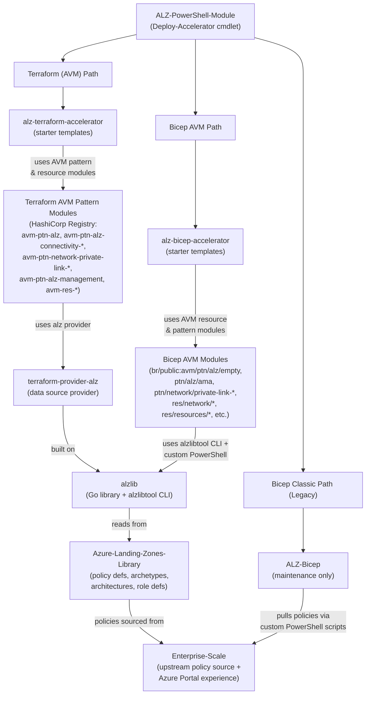
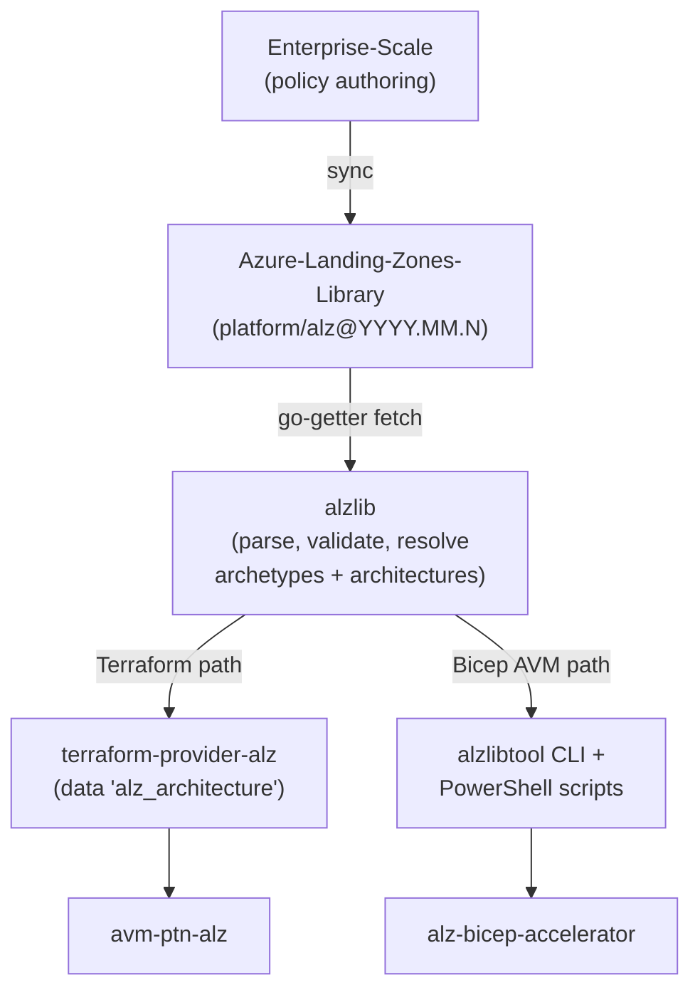

## azure-landing-zones

> This file provides context for AI agents and agentic workflows operating across the Azure Landing Zones (ALZ) polyrepo ecosystem. The `Azure/Azure-Landing-Zones` repo is the **centralised documentation hub** and **issue tracker** for the entire ecosystem — it does not contain deployable source code.

# Azure Landing Zones — Crosscutting Ecosystem Guide

This file provides context for AI agents and agentic workflows operating across the Azure Landing Zones (ALZ) polyrepo ecosystem. The `Azure/Azure-Landing-Zones` repo is the **centralised documentation hub** and **issue tracker** for the entire ecosystem — it does not contain deployable source code.

> **Scope guidance for agents**: If you are editing documentation content in this repo, skip to the **"This Repo — Documentation Conventions"** section for the rules you need. The ecosystem architecture, deployment flow, and issue triage sections below are background context — use them when triaging issues, answering cross-repo questions, or navigating the polyrepo dependency chain.

## Ecosystem Overview

Azure Landing Zones is a multi-repo platform-engineering framework that deploys enterprise-scale Azure governance, networking, and management infrastructure. It supports four deployment paths:

1. **Terraform (AVM)** — Current recommended IaC path using HashiCorp Registry AVM pattern modules and underlying resource modules
2. **Bicep (AVM)** — Current recommended IaC path using Bicep public registry AVM modules
3. **Azure Portal** — No-code deployment via custom portal experience in Enterprise-Scale repo
4. **Terraform (Classic)** / **Bicep (Classic)** — Legacy paths in maintenance mode

The **ALZ-PowerShell-Module** (`Deploy-Accelerator` cmdlet), which uses the **Accelerator Bootstrap Modules**, is the **recommended entry point** for IaC deployments.

However, it is not the only option—customers can also consume the AVM modules directly from the HashiCorp Registry or the Bicep public registry without using the accelerator orchestration.

Both Terraform and Bicep AVM accelerators compose **Azure Verified Modules (AVM)** — reusable, tested resource and pattern modules from the public registries — rather than implementing Azure resources from scratch.

## Polyrepo Architecture

The ecosystem is layered. Understanding the dependency chain is essential for navigating issues, making changes, and knowing where code lives.

The Azure Portal path is independent of the dependency stack shown above — see the **Deployment Flow** section for its details.

All IaC paths share:
- **accelerator-bootstrap-modules** — Terraform modules that create CI/CD infrastructure (GitHub Actions, Azure DevOps, or local) with OIDC authentication, state storage, and managed identities.
- **Azure-Landing-Zones** (this repo) — Centralised technical documentation and issue tracking.

## Repository Reference

### This Repo — Azure-Landing-Zones (Documentation & Issues)

| Attribute | Detail |
|-----------|--------|
| **Purpose** | Technical documentation site (https://aka.ms/alz/techdocs) and centralised issue tracker for the ALZ ecosystem |
| **Tech stack** | Hugo (Extended) with hugo-geekdoc theme |
| **Content** | Markdown with YAML front matter in `docs/content/` |
| **Templates** | Go HTML templates in `docs/layouts/` |
| **Config** | TOML (`docs/hugo.toml`) |
| **Utilities** | PowerShell scripts in `utl/` |
| **Build** | `make server` or `cd docs && hugo server` |
| **GitHub** | `Azure/Azure-Landing-Zones` |

**Documentation site structure** (`docs/content/`):
- `accelerator/` — ALZ Accelerator guides (bootstrap, deployment, customisation)
- `bicep/` — Bicep module documentation
- `terraform/` — Terraform module documentation
- `bootstrap/` — Bootstrap infrastructure setup
- `policy/` — Azure Policy documentation
- `sub-vending/` — Subscription vending
- `known-issues/` — Known issues and workarounds
- `faq/` — Frequently asked questions
- `whats-new/` — Release notes and updates
- `archive/` — Archived/deprecated content

### Policy & Library Layer

| Repository | GitHub | Purpose |
|-----------|--------|---------|
| **Enterprise-Scale** | `Azure/Enterprise-Scale` | Upstream source of truth for Azure Policy definitions. Policies are authored here and synced to the Library. Also contains the **custom Azure Portal deployment experience** (`eslzArm/` ARM templates + `eslz-portal.json` UI definition) — an alternative no-code path for customers who don't want IaC. Also contains legacy ARM reference implementations. |
| **Azure-Landing-Zones-Library** | `Azure/Azure-Landing-Zones-Library` | Versioned library of ALZ assets consumed by all IaC tooling. Contains policy definitions, policy set definitions, policy assignments, role definitions, archetype definitions (groupings of policies/roles per management group type), and architecture definitions (management group hierarchies). Organised under `platform/alz/`, `platform/amba/` (Azure Monitor Baseline Alerts), and `platform/slz/` (Sovereign Landing Zone). |

### Go Toolchain

| Repository | GitHub | Purpose |
|-----------|--------|---------|
| **alzlib** | `Azure/alzlib` | Go library that fetches, validates, and processes Library data. Resolves archetype/architecture definitions, validates policy assignability, calculates role assignments for DeployIfNotExists/Modify policies. Also provides `alzlibtool` CLI — used by **both** the Terraform provider and the Bicep AVM accelerator (via custom PowerShell scripts) to pull policy/role data from the Library. Key types: `AlzLib`, `Archetype`, `Architecture`, `ArchitectureManagementGroup`. |
| **terraform-provider-alz** | `Azure/terraform-provider-alz` | Terraform provider built on alzlib. Exposes `alz_architecture` and `alz_metadata` data sources — generates management group hierarchies, policy definitions, policy assignments, and role definitions as Terraform-consumable data. Does NOT manage Azure resources directly; output is consumed by AVM modules via AzAPI. |

### Terraform AVM Pattern Modules

| Repository | GitHub | HashiCorp Registry Source | Purpose |
|-----------|--------|----------------------|---------|
| **avm-ptn-alz** | `Azure/terraform-azurerm-avm-ptn-alz` | `Azure/avm-ptn-alz/azurerm` | Deploys full ALZ governance: management group hierarchy (7 levels), policy definitions, policy set definitions, policy assignments, role definitions, role assignments, subscription placement. Uses the `alz` provider's `alz_architecture` data source. |
| **avm-ptn-alz-connectivity-hub-and-spoke-vnet** | `Azure/terraform-azurerm-avm-ptn-alz-connectivity-hub-and-spoke-vnet` | `Azure/avm-ptn-alz-connectivity-hub-and-spoke-vnet/azurerm` | Hub & spoke networking: hub VNets, Azure Firewall, VPN/ExpressRoute gateways, route tables, DNS resolvers, Bastion, DDoS protection, VNet peering. |
| **avm-ptn-alz-connectivity-virtual-wan** | `Azure/terraform-azurerm-avm-ptn-alz-connectivity-virtual-wan` | `Azure/avm-ptn-alz-connectivity-virtual-wan/azurerm` | Virtual WAN networking: vWAN, virtual hubs, sidecar VNets, Azure Firewall, VPN/ER gateways, DNS resolvers, Bastion, routing intents. |
| **avm-ptn-network-private-link-private-dns-zones** | `Azure/terraform-azurerm-avm-ptn-network-private-link-private-dns-zones` | `Azure/avm-ptn-network-private-link-private-dns-zones/azurerm` | Deploys all known Azure Private Link private DNS zones with VNet links and NXDomain redirect support. Used by connectivity modules. |

### Bicep AVM Modules

The Bicep AVM accelerator composes 19 Azure Verified Modules (3 pattern + 16 resource) from the Bicep public registry (`br/public:avm/...`). Each module is independently versioned, tested, and maintained. See the [Bicep AVM for Platform Landing Zone blog post](https://techcommunity.microsoft.com/blog/azuretoolsblog/release-of-bicep-azure-verified-modules-for-platform-landing-zone/4487932) for the full announcement.

**Governance (Management Groups):**

| Component | Bicep Registry Module | Type |
|-----------|----------------------|------|
| Management group hierarchy (int-root, platform, connectivity, identity, management, security, landing zones, corp, online, sandbox, decommissioned) | `br/public:avm/ptn/alz/empty` | Pattern |

**Logging:**

| Component | Bicep Registry Module | Type |
|-----------|----------------------|------|
| Resource Groups | `br/public:avm/res/resources/resource-group` | Resource |
| Log Analytics Workspace | `br/public:avm/res/operational-insights/workspace` | Resource |
| Azure Monitoring Agent | `br/public:avm/ptn/alz/ama` | Pattern |

**Hub & Spoke Networking:**

| Component | Bicep Registry Module | Type |
|-----------|----------------------|------|
| Virtual Networks | `br/public:avm/res/network/virtual-network` | Resource |
| Azure Firewall | `br/public:avm/res/network/azure-firewall`, `br/public:avm/res/network/firewall-policy` | Resource |
| Azure Bastion | `br/public:avm/res/network/bastion-host`, `br/public:avm/res/network/network-security-group` | Resource |
| VPN Gateway | `br/public:avm/res/network/virtual-network-gateway` | Resource |
| ExpressRoute Gateway | `br/public:avm/res/network/virtual-network-gateway` | Resource |
| Route Tables | `br/public:avm/res/network/route-table` | Resource |
| DDoS Protection | `br/public:avm/res/network/ddos-protection-plan` | Resource |
| Private DNS Zones | `br/public:avm/ptn/network/private-link-private-dns-zones` | Pattern |
| DNS Private Resolver | `br/public:avm/res/network/dns-resolver` | Resource |

**Virtual WAN Networking:**

| Component | Bicep Registry Module | Type |
|-----------|----------------------|------|
| Virtual WAN | `br/public:avm/res/network/virtual-wan` | Resource |
| Virtual Hubs | `br/public:avm/res/network/virtual-hub` | Resource |
| ExpressRoute Gateway | `br/public:avm/res/network/express-route-gateway` | Resource |
| VPN Gateway (S2S) | `br/public:avm/res/network/vpn-gateway` | Resource |
| VPN Gateway (P2S) | `br/public:avm/res/network/p2s-vpn-gateway` | Resource |
| Sidecar VNet | `br/public:avm/res/network/virtual-network` | Resource |
| Azure Firewall | `br/public:avm/res/network/azure-firewall`, `br/public:avm/res/network/firewall-policy` | Resource |
| Azure Bastion | `br/public:avm/res/network/bastion-host`, `br/public:avm/res/network/public-ip-address` | Resource |
| DDoS Protection | `br/public:avm/res/network/ddos-protection-plan` | Resource |
| Private DNS Zones | `br/public:avm/ptn/network/private-link-private-dns-zones` | Pattern |
| DNS Private Resolver | `br/public:avm/res/network/dns-resolver` | Resource |

### Accelerators & Orchestration

| Repository | GitHub | Purpose |
|-----------|--------|---------|
| **alz-terraform-accelerator** | `Azure/alz-terraform-accelerator` | Terraform starter templates for platform landing zones. Contains `templates/platform_landing_zone/` (full deployment with examples for hub-spoke, vWAN, multi-region, NVA, SMB, sovereign), `templates/empty/` (minimal starter), and local library overrides in `lib/`. Composes AVM pattern modules (`avm-ptn-alz`, `avm-ptn-alz-connectivity-*`, `avm-ptn-alz-management`) and AVM resource modules (`avm-res-resources-resourcegroup`, `avm-utl-regions`) from the HashiCorp Registry. |
| **alz-bicep-accelerator** | `Azure/alz-bicep-accelerator` | Bicep AVM starter templates for platform landing zones. Configuration-driven via YAML. Supports hub & spoke and Virtual WAN. Composes 19 AVM modules from the Bicep public registry (see **Bicep AVM Modules** section above). Pulls policy definitions, role definitions, and assignments from the **Azure-Landing-Zones-Library** using `alzlibtool` CLI and custom PowerShell tooling (`templates/core/governance/tooling/Update-AlzLibraryReferences.ps1`). |
| **ALZ-Bicep** (Classic) | `Azure/ALZ-Bicep` | Legacy Bicep modules for ALZ. In maintenance mode — new deployments should use `alz-bicep-accelerator` instead. |
| **caf-enterprise-scale** (Classic) | `Azure/terraform-azurerm-caf-enterprise-scale` | Legacy Terraform module for ALZ (**Terraform Classic**). In maintenance mode — new deployments should use the AVM-based `alz-terraform-accelerator` and `avm-ptn-alz` module instead. |
| **accelerator-bootstrap-modules** | `Azure/accelerator-bootstrap-modules` | Terraform modules that bootstrap CI/CD infrastructure. Supports three platforms: GitHub Actions (`alz/github/`), Azure DevOps (`alz/azuredevops/`), and local filesystem (`alz/local/`). Creates managed identities with OIDC federation, state storage, networking, repositories, pipelines, and branch policies. |
| **ALZ-PowerShell-Module** | `Azure/ALZ-PowerShell-Module` | PowerShell module (`ALZ`) that orchestrates the end-to-end accelerator experience — the **recommended** (but not exclusive) entry point. Key cmdlet: `Deploy-Accelerator` — downloads bootstrap modules, renders configuration, executes Terraform/Bicep deployment. Also provides `Test-AcceleratorRequirement`, `New-AcceleratorFolderStructure`, and cleanup cmdlets. Requires PowerShell 7.4+. Customers can alternatively consume the AVM modules directly from the Terraform Registry or Bicep public registry without this orchestration layer. |

## Deployment Flow (How It All Stitches Together)

### End-to-End Terraform Deployment

1. User runs `Deploy-Accelerator` from **ALZ-PowerShell-Module**
2. Module downloads **accelerator-bootstrap-modules** release
3. Bootstrap creates CI/CD infrastructure (GitHub/ADO/Local) with OIDC, state storage, managed identities
4. Module downloads **alz-terraform-accelerator** starter template
5. Starter template uses **avm-ptn-alz** module → which calls **terraform-provider-alz** → which uses **alzlib** → which fetches **Azure-Landing-Zones-Library**
6. Starter template also uses connectivity modules (**hub-and-spoke-vnet** or **virtual-wan**) and **private-dns-zones**
7. CI/CD pipeline runs `terraform plan/apply` against Azure

### End-to-End Bicep AVM Deployment

1. User runs `Deploy-Accelerator` from **ALZ-PowerShell-Module**
2. Bootstrap infrastructure created via **accelerator-bootstrap-modules** (same as Terraform)
3. Module downloads **alz-bicep-accelerator** starter template
4. Starter template uses Bicep public registry AVM resource and pattern modules (`br/public:avm/res/...`, `br/public:avm/ptn/...`)
5. Policy/role definitions are pulled from **Azure-Landing-Zones-Library** using `alzlibtool` CLI + custom PowerShell (`Update-AlzLibraryReferences.ps1`)
6. Configuration driven by YAML files (e.g., `platform-landing-zone.yaml`)
7. CI/CD pipeline runs Bicep deployment against Azure

### Azure Portal Deployment (No-Code)

1. User navigates to [aka.ms/alz/portal](https://aka.ms/alz/portal)
2. Custom Azure Portal UI (`eslz-portal.json`) in **Enterprise-Scale** repo guides configuration
3. ARM templates (`eslzArm/eslzArm.json`) deploy directly to Azure — no IaC tooling required
4. Not the recommended path for production — lacks state management, drift detection, and CI/CD

## Data Flow: Policies → Deployment

Library versioning format: `platform/{library}@{YYYY.MM.patch}` (e.g., `platform/alz@2026.01.3`).

## Issue Triage Routing

This repo (`Azure/Azure-Landing-Zones`) is the centralised issue tracker. Most ALZ ecosystem repos redirect their issues here. When triaging, identify the **source repo** where the fix would be applied.

**Triage rules** — apply the first matching rule:

1. If issue references specific policy names (`Deny-*`, `Deploy-*`, `Append-*`), policy parameters, or compliance results → label `Product: Azure Policy` + `Topic: Policy`, code lives in `Enterprise-Scale` (synced to `Azure-Landing-Zones-Library`)
> **Label accuracy requirement**: When triaging, use the exact GitHub label names defined in `utl/github-labels/alz-labels.csv`. If a label in that file includes an emoji suffix, the emoji suffix is part of the label name and must be included exactly.

2. If issue mentions archetype names (root, platform, connectivity, identity, management, landing_zones, corp, online, sandbox, decommissioned) or which policies apply to which MG → apply the exact Library product label from `utl/github-labels/alz-labels.csv` (including any emoji suffix), code lives in `Azure-Landing-Zones-Library`
3. If issue mentions `alz_architecture` data source, provider configuration, or library fetch errors → apply the exact ALZ Provider (Terraform) product label from `utl/github-labels/alz-labels.csv` (including any emoji suffix), code lives in `terraform-provider-alz`
4. If issue mentions `azapi_resource`, management group deployment, or policy role assignment errors → apply the exact Terraform (AVM) product label from `utl/github-labels/alz-labels.csv` (including any emoji suffix), code lives in `terraform-azurerm-avm-ptn-alz`
5. If issue mentions hub VNet, Azure Firewall, VPN/ER gateway, DNS resolver, Bastion, or route tables → apply the exact Hub-and-Spoke networking topic label from `utl/github-labels/alz-labels.csv` (including any emoji suffix), code lives in `terraform-azurerm-avm-ptn-alz-connectivity-hub-and-spoke-vnet`
6. If issue mentions vWAN, virtual hub, routing intent → apply the exact Virtual WAN networking topic label from `utl/github-labels/alz-labels.csv` (including any emoji suffix), code lives in `terraform-azurerm-avm-ptn-alz-connectivity-virtual-wan`
7. If issue mentions private DNS zones, VNet links, NXDomain redirect → label `Topic: Networking (H&S)`, code lives in `terraform-azurerm-avm-ptn-network-private-link-private-dns-zones`
8. If issue contains Go stack traces or library processing/validation errors → code lives in `alzlib`
9. If issue mentions GitHub/ADO repo creation, OIDC federation, state storage, managed identity, pipeline setup → apply the exact Accelerator product label from `utl/github-labels/alz-labels.csv` (including any emoji suffix), code lives in `accelerator-bootstrap-modules`
10. If issue mentions `Deploy-Accelerator`, module download failures, or pre-flight check failures → apply the exact ALZ PowerShell product label from `utl/github-labels/alz-labels.csv` (including any emoji suffix), code lives in `ALZ-PowerShell-Module`
11. If issue mentions starter template configuration, `.tfvars`, example scenarios → apply the exact Accelerator product label from `utl/github-labels/alz-labels.csv` (including any emoji suffix), code lives in `alz-terraform-accelerator`
12. If issue mentions Bicep template errors, YAML configuration, AVM resource module versions → apply the exact Bicep (AVM) product label from `utl/github-labels/alz-labels.csv` (including any emoji suffix), code lives in `alz-bicep-accelerator`
13. If issue mentions legacy Bicep modules → apply the exact Bicep (Classic) product label from `utl/github-labels/alz-labels.csv` (including any emoji suffix), code lives in `ALZ-Bicep`
14. If issue mentions `caf-enterprise-scale` or legacy Terraform module → label `Product: Terraform (Classic)`, code lives in `terraform-azurerm-caf-enterprise-scale`
15. If issue mentions Azure Portal deployment, ARM templates, or UI definition → label `Product: Portal`, code lives in `Enterprise-Scale`
16. If issue mentions incorrect docs, missing content, broken links, Hugo rendering → label `Area: Documentation`, code lives in `Azure-Landing-Zones` (this repo)
17. If the issue author says "ALZ", "landing zone module", or "accelerator" without specifying Terraform or Bicep — look for language clues (`.tf`/`.tfvars` = Terraform, `.bicep`/`.yaml` = Bicep) before routing. If ambiguous, ask for clarification.
18. If the issue is about a missing feature, bug, or unsupported property in an **underlying AVM module** (e.g., `br/public:avm/res/network/virtual-network` or `Azure/avm-ptn-alz/azurerm`) rather than in ALZ-specific code → label `Needs: External Changes :gear:` and direct the user to open the issue against the specific AVM module repo (Bicep: `Azure/bicep-registry-modules`, Terraform: the relevant `Azure/terraform-azurerm-avm-*` repo). Include the appropriate product label (e.g., `Product: Bicep (AVM)` or `Product: Terraform (AVM)`) so the issue is still tracked.

### Issue Labels

Issues are classified using a structured label taxonomy with four categories:

**Product labels** (which component/path is affected):

> **Use the exact GitHub label name from `utl/github-labels/alz-labels.csv` when applying labels.**
> The product labels in this repo include emoji suffixes (for example, `Product: Accelerator :zap:` and `Product: Azure Policy :shield:`), so do not use shortened names without the emoji.

| Product label family *(use exact label from `utl/github-labels/alz-labels.csv`)* | Maps To |
|-------|--------|
| Accelerator | `accelerator-bootstrap-modules`, `alz-terraform-accelerator`, `alz-bicep-accelerator` |
| ALZ PowerShell | `ALZ-PowerShell-Module` |
| ALZ Provider (Terraform) | `terraform-provider-alz` |
| Azure Policy | `Enterprise-Scale` (policy authoring) → `Azure-Landing-Zones-Library` |
| Bicep (AVM) | `alz-bicep-accelerator` |
| Bicep (Classic) | `ALZ-Bicep` |
| Library | `Azure-Landing-Zones-Library` |
| Portal | `Enterprise-Scale` (portal deployment experience) |
| Sub/LZ Vending (Bicep) | Bicep subscription vending module |
| Sub/LZ Vending (TF) | Terraform subscription vending module |
| Terraform (AVM) | `terraform-azurerm-avm-ptn-alz`, connectivity modules |
| Terraform (Classic) | `terraform-azurerm-caf-enterprise-scale` |

**Topic labels** (what area of ALZ infrastructure; exact GitHub label names, including emoji suffixes, are defined in `utl/github-labels/alz-labels.csv`):

| Topic area | Scope |
|------------|-------|
| Topic: Policy | Policy definitions, assignments, compliance |
| Topic: RBAC | Role definitions, role assignments, permissions |
| Topic: Management Groups | MG hierarchy, structure, archetype mappings |
| Topic: Networking (general) | Networking agnostic to topology |
| Topic: Networking (H&S) | Hub & spoke topology specific |
| Topic: Networking (VWAN) | Virtual WAN topology specific |
| Topic: MDFC | Microsoft Defender for Cloud |
| Topic: Logging & Automation | Log Analytics, Automation accounts |
| Topic: Diagnostic Settings | Diagnostic settings configuration |
| Topic: Sovereign | Microsoft Sovereign Cloud |
| Topic: Non-Resource Specific | Cross-cutting (tags, location, etc.) |

**Status labels** (workflow state):
- `Needs: Triage :mag:` — New issue, not yet classified
- `Needs: Attention :wave:` — Requires maintainer action
- `Needs: Author Feedback :ear:` — Waiting on issue author
- `Needs: More Evidence :balance_scale:` — Needs reproduction or data
- `Needs: External Changes :gear:` — Requires changes outside this repo
- `Needs: Upstream Policy Changes :arrows_clockwise:` — Built-in policy update needed from Azure product team
- `Status: Blocked :collision:` — Blocked by external dependency
- `Status: Do Not Merge :no_entry:` — PR is not ready to merge
- `Status: Long Term :hourglass:` — Planned but lower priority
- `Status: No Recent Activity :zzz:` — Auto-close candidate
- `Status: Help Wanted :sos:` — Open for community contribution
- `Status: External Contribution :earth_americas:` — Being worked on by non-core contributor
- `Status: PR Modified Workflows :warning:` — PR contains changes to GitHub Actions Workflows

**Transfer labels** (provenance tracking — which repo the issue was transferred from):
- `Transfer From: Azure-Landing-Zones :arrow_right:`, `Transfer From: Enterprise-Scale :arrow_right:`, `Transfer From: ALZ Library :arrow_right:`, `Transfer From: alzlib :arrow_right:`, `Transfer From: alz-tf-accelerator :arrow_right:`, `Transfer From: alz-bicep-accelerator :arrow_right:`, `Transfer From: alz-powershell-module :arrow_right:`, `Transfer From: accel-bstrap-modules :arrow_right:`, `Transfer From: ALZ-Bicep :arrow_right:`, `Transfer From: caf-enterprise-scale :arrow_right:`, `Transfer From: TF avm-ptn-alz :arrow_right:`, `Transfer From: TF avm-ptn-alz-mgmt :arrow_right:`, `Transfer From: TF avm-ptn-con-hs :arrow_right:`, `Transfer From: TF avm-ptn-con-vwan :arrow_right:`, `Transfer From: TF avm-ptn-lz-vend :arrow_right:`, `Transfer From: tf-state-importer :arrow_right:`

## This Repo — Documentation Conventions

### Hugo Site

- **Site URL**: https://aka.ms/alz/techdocs
- **Build**: `make server` or `cd docs && hugo server`
- **Theme**: hugo-geekdoc
- **Output formats**: HTML, RSS, TXT (LLM-friendly)

### Content Conventions

- Most content uses YAML front matter with `title`; use `weight` where sidebar ordering matters, and `geekdocCollapseSection` where needed
- Section indexes are `_index.md` files — use `weight` on them when you need to control sidebar ordering
- Internal links use `` shortcode, never raw paths
- Callouts use `` shortcode
- Use the escaped `` form only when you need to display shortcode syntax literally in rendered docs, not when authoring normal content

### Custom Shortcodes

- `` — Renders CSV data as HTML tables
- `` — Expandable/collapsible sections
- `` — Include content from another file

### Templates & Layouts

- `docs/layouts/` — Custom shortcodes, partials (llms-section-tree), and LLM-friendly TXT output templates

### Utilities

- `utl/` — PowerShell scripts for cost estimation and GitHub label management
- PowerShell scripts should use `[CmdletBinding()]`, `param()`, comment-based help, and `$ErrorActionPreference = "Stop"`

### Do NOT in This Repo

- **Do not create Terraform (`.tf`), Bicep (`.bicep`), Go (`.go`), or ARM JSON files** — all deployable IaC code lives in the other ecosystem repos, not here
- **Do not modify policy definitions** — policies are authored in `Enterprise-Scale` and synced to the Library
- **Do not hardcode internal doc links** — always use ``
- **Do not place documentation pages outside `docs/content/`** — page content belongs under that tree, but legitimate Hugo site changes may also be needed under `docs/layouts/`, `docs/static/`, `docs/data/`, and similar support directories

## Agents

- **Hugo Documentation Site** — Maintains documentation with Hugo, geekdoc theme, Markdown content, Go templates, and PowerShell utilities

## Cross-Repo Development Notes

### Language/Tool Map

| Repository | Primary Language | Build/Test |
|-----------|-----------------|------------|
| Azure-Landing-Zones | Hugo (Markdown, Go templates, TOML) | `make server` |
| Azure-Landing-Zones-Library | JSON/YAML (policy defs, schemas) | `make`, shell scripts |
| Enterprise-Scale | ARM JSON, Bicep, Policy JSON | — |
| alzlib | Go | `go test`, `go build` |
| terraform-provider-alz | Go (Terraform Plugin Framework) | `go test`, `make` |
| avm-ptn-alz | Terraform (HCL) | `./avm pre-commit`, `./avm pr-check` |
| avm-ptn-alz-connectivity-* | Terraform (HCL) | `./avm pre-commit`, `./avm pr-check` |
| avm-ptn-network-private-link-* | Terraform (HCL) | `./avm pre-commit`, `./avm pr-check` |
| alz-terraform-accelerator | Terraform (HCL), PowerShell | `make fmt`, `make fmtcheck` |
| alz-bicep-accelerator | Bicep, YAML, PowerShell, Go (tests) | GitHub Actions workflows |
| accelerator-bootstrap-modules | Terraform (HCL) | `make` |
| ALZ-PowerShell-Module | PowerShell | `Invoke-Build`, Pester tests |

### Azure Verified Modules (AVM) Reference

- **LLM-friendly AVM documentation**: https://azure.github.io/Azure-Verified-Modules/llms.txt — fetch this for up-to-date AVM guidance, module indexes, contribution rules, and naming conventions.

### AVM Module Conventions (Terraform repos)

- All AVM repos use the `./avm` CLI tool for pre-commit checks and PR validation
- Run `PORCH_NO_TUI=1 ./avm pre-commit` then `PORCH_NO_TUI=1 ./avm pr-check` before PRs
- Provider version constraints: pessimistic (`~> X.0`); module versions: pin exactly (`version = "X.Y.Z"`)
- Telemetry: always map `enable_telemetry = var.enable_telemetry`

### Azure landing zone (ALZ) Reference

- **LLM-friendly ALZ documentation**: https://azure.github.io/Azure-Landing-Zones/llms.txt — fetch this for up-to-date technical documentation on the accelerator, deployment scenarios, configuration options, and related topics.
- **ALZ architecture, design principles, and design recommendations**: https://learn.microsoft.com/azure/cloud-adoption-framework/ready/landing-zone/ — use the `mslearn` MCP server to query this content. Fall back to fetching only if the MCP server is unavailable or returns an error.

### Conventional Commits

ALZ ecosystem repos use conventional commit format: `type(scope): description` (e.g., `fix(policy): correct DDoS assignment parameters`)

---
> Source: [Azure/Azure-Landing-Zones](https://github.com/Azure/Azure-Landing-Zones) — distributed by [TomeVault](https://tomevault.io).
<!-- tomevault:4.0:gemini_md:2026-07-24 -->
