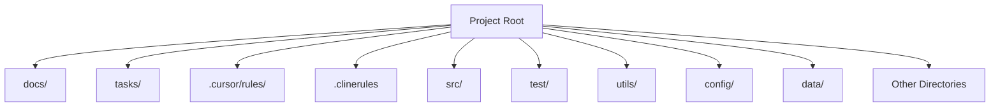

## directory-structure

> directory structure to follow

---
description: the top-level directory structure for the project
globs: 
alwaysApply: false
---     
# Directory Structure

---
> Source: [Bhartendu-Kumar/rules_template](https://github.com/Bhartendu-Kumar/rules_template) — distributed by [TomeVault](https://tomevault.io).
<!-- tomevault:4.0:gemini_md:2026-05-18 -->
