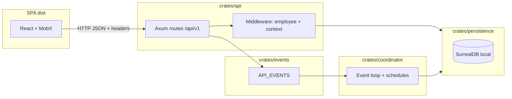

## blprnt

> This document orients AI and human contributors to **blprnt**: the Rust runtime plus the Vite/React SPA it serves. It describes how the backend and frontend are structured, how they communicate, and the conventions we expect when adding code.

# AGENTS.md — blprnt

This document orients AI and human contributors to **blprnt**: the Rust runtime plus the Vite/React SPA it serves. It describes how the backend and frontend are structured, how they communicate, and the conventions we expect when adding code.

---

## 1. What this repository is

- **Runtime**: A single `blprnt` binary (`crates/blprnt`) starts the HTTP API, optional adapter runtime, and coordinator loop, backed by **local SurrealDB** persistence.
- **Web UI**: A **React 19** SPA (Vite) in `src/`, built to `dist/`, which the API serves as static assets.
- **Contract**: Shared request/response shapes are defined in Rust with **`ts-rs`** and exported to TypeScript under `src/bindings/` so the UI stays aligned with the API.

**Excluded from the active workspace** (not built by default): `crates/engine_v2`, `crates/providers` — see `Cargo.toml` `[workspace] exclude`.

---

## 2. End-to-end architecture



**Operational defaults** (from `README.md`):

- API listens on **`0.0.0.0:9171`**.
- Data directory: **`~/.blprnt/data`** (Rocks-backed SurrealDB).
- Static files: **`./dist`** unless `BLPRNT_BASE_DIR` overrides it.
- Frontend uses `VITE_API_URL` or defaults to `http://localhost:9171/api/v1` (`src/lib/api/fetch.ts`).

### 2.1 Project directories in runtime context

- A **project record** can include one or more **working directories**. These are the actual source/work folders for the project. They are not blprnt metadata folders.
- **`PROJECT_HOME`** is separate from those working directories. It lives under `~/.blprnt/projects/<project_id>` and stores blprnt-managed project metadata.
- Treat **project working directories** as the correct places for code edits, source inspection, builds, tests, and normal project-file work.
- Treat **`PROJECT_HOME`** as the place for blprnt-managed files such as:
  - `PROJECT_HOME/memory` for project memory files
  - `PROJECT_HOME/plans` for plan documents
- Do not treat `PROJECT_HOME` as the primary project source tree unless the task is specifically about blprnt-managed metadata there.

---

## 3. Backend (Rust workspace)

### 3.1 Process model

The binary entrypoint is `crates/blprnt/src/main.rs`. It runs **concurrently** (via `tokio::join!`):

| Task | Feature flag | Role |
|------|----------------|------|
| `api::start_server()` | `api` | HTTP server + static SPA |
| `adapters::runtime::AdapterRuntime` | `adapter` | Local adapter server for agents/tools |
| `coordinator::Coordinator` | `coordinator` | Subscribes to API events; schedules runs per employee |

Default features: `api`, `coordinator`, `adapter` (`crates/blprnt/Cargo.toml`).

### 3.2 Crate map (workspace members)

| Crate | Responsibility |
|-------|----------------|
| **`blprnt`** | Binary entry; wires logging and subsystems |
| **`api`** | Axum app: `/api` → `/v1` JSON routes, CORS, middleware, DTOs, static file serving |
| **`coordinator`** | Heartbeat-style loop on `API_EVENTS`; creates/updates runs, employee schedules |
| **`persistence`** | SurrealDB connection, IDs, repositories (issues, employees, projects, runs, …) |
| **`events`** | In-process event buses (`API_EVENTS`, `COORDINATOR_EVENTS`, …) |
| **`shared`** | Errors, tool schemas, paths, helpers used across crates |
| **`tools`** | File/host tool implementations for agents |
| **`adapters`** | Adapter runtime (prompts, HTTP surface for adapter workflows) |
| **`memory`**, **`vault`**, **`oauth`**, **`qmd`**, **`json-repair`**, **`macros`**, **`sandbox`**, **`tools`** | Supporting libraries; **api** depends on e.g. `memory` and `vault` — follow imports when touching a feature |

### 3.3 HTTP API shape

- Routes are mounted under **`/api`**, with versioned API under **`/api/v1`** (`crates/api/src/routes/mod.rs`).
- **Protected routes** (issues, employees, runs, memory, projects, …) use **`api_middleware`**: requires header **`x-blprnt-employee-id`** and loads the employee from the DB (`crates/api/src/middleware/mod.rs`).
- Optional headers: **`x-blprnt-project-id`**, **`x-blprnt-run-id`** (attached to `RequestExtension` in `crates/api/src/state.rs`).
- **Owner-only** routes add **`owner_only`** middleware (e.g. providers).
- **Public** routes (e.g. onboarding/signup) sit under `routes/v1/public.rs` without the same guard.
- **Debug-only** routes may be merged under `#[cfg(debug_assertions)]` (`routes/v1/dev.rs`).

**Example — route module** (`issues`): registers `POST/GET /issues`, `PATCH/GET /issues/{id}`, children, comments, attachments, assign/checkout, etc. Handlers call `*Repository` types from `persistence::prelude` and may emit `ApiEvent` variants on `API_EVENTS` for the coordinator.

### 3.4 Persistence

- **`persistence::prelude`** exposes connection types, repositories, and domain models (issues, employees, projects, runs, turns, providers, …).
- IDs are typically UUID-backed; Surreal-specific helpers live in the crate.
- Repository methods are `async` and use the shared DB connection pattern.

### 3.5 Coordinator

- On **`Coordinator::init`**: e.g. marks interrupted runs, reconciles agent employee state, then **`listen`** loops on **`API_EVENTS`** (`crates/coordinator/src/coordinator.rs`).
- Events such as `StartRun`, `AddEmployee`, `CancelRun` cause scheduling work, run creation, or teardown of per-employee state.

### 3.6 TypeScript bindings from Rust

- Types that must match the UI carry **`#[derive(ts_rs::TS)]`** (often with `#[ts(export, …)]`) in **`api`**, **`persistence`**, or **`shared`**.
- Generated files live in **`src/bindings/`** (one TypeScript file per exported type). Regenerate when Rust types change (project tests or manual `ts-rs` export flow — follow existing patterns in the crate that owns the type).

---

## 4. Frontend architecture

Stack: **Vite**, **React 19**, **TanStack Router**, **MobX** (+ `mobx-react-lite` / observers), **Tailwind CSS 4**, **shadcn-style** primitives under `components/ui/`.

### 4.1 MVVM layering

We use a strict **Model / Viewmodel / View** split:

| Layer | Location | Purpose |
|-------|----------|---------|
| **Bindings (DTOs)** | `src/bindings/*.ts` | Serialized shapes from Rust; **no** business logic. |
| **Models** | `src/models/*.model.ts` | Client-side domain state: observable fields, validation, dirty tracking, mapping to/from DTOs (e.g. `IssueModel` wrapping `IssueDto`). |
| **Viewmodels** | `*.viewmodel.ts` or `*.viewmodel.tsx` | Actions, async API calls, loading/error flags, computed UI state. **`makeAutoObservable`** (and `runInAction` for async boundaries). |
| **Views** | `*.tsx` components | Presentational; read state from viewmodels/models via context or props; **no** direct `fetch` in leaf components unless intentionally minimal. |
| **API clients** | `src/lib/api/*.ts` | Thin wrappers around `apiClient` (`get/post/patch/delete`) with typed payloads from `bindings/`. |

**MobX rendering note**

- Components that read MobX observables in render must be wrapped in `observer(...)`.
- Keep pure presentational components plain when they only receive already-derived values and do not dereference observable state themselves.

**Global app state**

- **`AppModel`** (`src/models/app.model.ts`): singleton (`AppModel.instance`) — owner, employees, projects, onboarding flag, name resolution helpers.
- **`AppViewmodel`** (`src/app.viewmodel.tsx`): bootstraps owner/employees/projects on load; exposed via **`AppViewmodelContext`** at the root (`src/main.tsx`).

**Feature example — Issue page**

1. **Route** loads a **Provider** that constructs the viewmodel and wires context (`src/components/pages/issue/issue.provider.tsx`).
2. **Viewmodel** (`issue.viewmodel.ts`) loads `IssueModel` from `issuesApi`, exposes commands (`saveMetadata`, `comment`, …).
3. **Page** (`issue.page.tsx`) composes smaller components; each subscribes to MobX observables as needed.

Pattern:

```tsx
// Provider: lifecycle + context
export const IssueProvider = () => {
  const { issueId } = useParams({ from: '/issues/$issueId/' })
  const [viewmodel, setViewmodel] = useState<IssueViewmodel | null>(null)
  useEffect(() => {
    const vm = new IssueViewmodel(issueId)
    vm.init().then(() => setViewmodel(vm))
  }, [issueId])
  if (!viewmodel || viewmodel.isLoading) return <AppLoader />
  return (
    <IssueViewmodelContext.Provider value={viewmodel}>
      <IssuePage />
    </IssueViewmodelContext.Provider>
  )
}
```

Forms often use a dedicated **`IssueFormViewmodel`** (or similar) colocated under `components/forms/<feature>/` for create/edit dialogs.

### 4.2 Atomic design (folder conventions)

We follow **atomic design** names without being dogmatic about “atoms” as a separate top-level folder:

| Layer | Path | Examples |
|-------|------|----------|
| **Primitives / tokens** | `src/components/ui/` | `button`, `input`, `sidebar`, `tooltip` — shadcn-style, reusable, mostly stateless |
| **Molecules** | `src/components/molecules/` | Composed controls: `labeled-input`, `labeled-select`, `priority-icon` |
| **Organisms** | `src/components/organisms/` | Larger UI: `app-sidebar`, `header`, `kanban`, `markdown-editor` |
| **Layouts** | `src/components/layouts/` | Shell and page chrome: `product-shell`, `page` |
| **Pages (features)** | `src/components/pages/<feature>/` | Route-facing feature folders: `issue/`, `project/`, `employees/`, … |
| **Forms** | `src/components/forms/<feature>/` | Form viewmodels + small entry components; `index.ts` may re-export |

**Route files** live under `src/routes/` (TanStack Router file-based routes); they usually import page components from `components/pages/`.

### 4.3 File and size conventions (for agents)

- **One main React component or one main class per file** (e.g. one exported `IssuePage`, one `IssueViewmodel`). Avoid barrel files that hide multiple large components except small `index.ts` re-exports.
- **Keep each UI file under about 150 lines** where reasonable. If a screen grows, **split** into additional molecules/organisms or subcomponents under `components/` rather than inflating a single file.
- **Naming**: `*.viewmodel.ts` / `*.viewmodel.tsx` for viewmodels; `*.model.ts` for MobX models; `*.page.tsx` for route page components when used.

### 4.4 UI copy and chrome

- Default to **minimal UI copy**. Do **not** add helper text, explainer text, “how to read this” sections, metadata callouts, prompt previews, or other instructional chrome unless the user explicitly asks for them.
- Prefer the interface to speak through hierarchy, spacing, labels, and structure rather than extra prose.
- When metadata is necessary, show the minimum useful amount and avoid duplicating information across the same screen.

### 4.5 Forms and layout wrappers

- Treat `form` elements as structural wrappers by default. In this codebase they should be assumed to use `display: contents` unless a task explicitly requires a different layout behavior.
- Do **not** rely on styling applied directly to the `form` element for spacing, borders, backgrounds, grid layout, or visual grouping.
- Apply layout and visual styling to the form’s parent container or to explicit child wrappers inside the form instead.
- Prefer **flexbox** over grid for layout by default. Use grid only when the layout specifically benefits from two-dimensional placement or explicit row/column control.

### 4.6 API client and auth header

`ApiClient` (`src/lib/api/fetch.ts`) attaches **`x-blprnt-employee-id`** when `AppModel` has set the owner via `apiClient.setEmployeeId(owner.id)` — required for protected routes.

---

## 5. Minimal examples (copy-paste patterns)

### 5.1 New API endpoint (backend)

1. Add or extend a **`persistence`** repository method if new persistence is needed.
2. Add handler in the appropriate **`crates/api/src/routes/v1/*.rs`** module; use `Extension<RequestExtension>` for authenticated context.
3. If the UI needs the type, add **`ts_rs::TS`** export and regenerate **`src/bindings/`**.

### 5.2 New screen (frontend)

1. Add a **route** under `src/routes/`.
2. Create **`components/pages/<feature>/`** with:
   - `<feature>.provider.tsx` — params, `useEffect` init, `AppLoader`, React context for viewmodel.
   - `<feature>.viewmodel.ts` — MobX class + `createContext` / `useContext` hook.
   - `<feature>.page.tsx` — layout only.
   - `components/` subfolder for presentational pieces.
3. Add **`lib/api/<entity>.ts`** methods if new HTTP calls are needed.
4. If needed, add a **MobX model** in `src/models/` mapping DTO ↔ editable fields.

### 5.3 Model + viewmodel snippet

```ts
// Model: wraps DTO, tracks dirty state
export class IssueModel {
  constructor(issue?: IssueDto) { /* ... */ makeAutoObservable(this) }
  public toPayloadPatch(): IssuePatchPayload { /* ... */ }
}

// Viewmodel: loads/saves via API
export class IssueViewmodel {
  public issue: IssueModel | null = null
  constructor(issueId: string) {
    makeAutoObservable(this, {}, { autoBind: true })
  }
  async init() {
    const dto = await issuesApi.get(this.issueId)
    runInAction(() => { this.issue = new IssueModel(dto) })
  }
}
```

---

## 6. Development commands (reference)

| Task | Command |
|------|---------|
| Rust check (binary) | `cargo check -p blprnt` |
| Web build | `pnpm build` → outputs `dist/` |
| Web dev | `pnpm dev` |
| Lint/format (JS) | `pnpm fix` (Biome) |
| Release alignment check | `./scripts/check-release-alignment.sh` |

Toolchain expectations (see `README.md`): Rust **1.90.0**, Node **22**, **pnpm** **10.26.1**.

**Worktree setup**: When creating a new git worktree for this repository, copy `node_modules` and `target` from the source checkout into the new worktree immediately after creation. Reusing those directories materially speeds up frontend installs and Rust compiles/tests for follow-up work.

---

## 7. Runtime Prompting Rule

When writing user-facing or LLM-facing instructions, prompts, skills, or runtime messaging:

- do **not** reference source-tree paths like `docs/...`, `crates/...`, or `src/...` as if they will exist next to the compiled binary
- do **not** tell runtime agents to consult repository source files unless the runtime explicitly injects their contents into the prompt or exposes them through a tool
- prefer stable runtime-facing names such as `AGENT_HOME`, `PROJECT_HOME`, `HEARTBEAT.md`, `MEMORY.md`, `Canonical Blprnt Directory Structure`, or explicitly bundled references
- if a source document is compiled into the binary or mirrored into runtime state, refer to the runtime artifact or section name, not the repository path
- before adding a new prompt or skill reference, ask whether that reference will still make sense in a compiled binary with no source checkout available

---

## 8. License

Repository license: **BUSL-1.1** (`LICENSE`). Contributions are governed accordingly.

---

## 9. Summary for agents

- **Backend**: Axum API + persistence + coordinator; cross-cutting **events** connect API actions to background scheduling. Respect **middleware** and **headers** when reasoning about auth.
- **Frontend**: **MobX MVVM** — models hold state, viewmodels own async and commands, views stay thin. **Atomic design** maps to `ui` → `molecules` → `organisms` → `layouts` → `pages`/`forms`.
- **Contract**: **`src/bindings/`** must stay in sync with Rust **`ts-rs`** types.
- **Hygiene**: **one primary component or class per file**, keep UI files **under ~150 lines** by splitting into smaller components.

When in doubt, match the nearest existing feature folder (e.g. `components/pages/issue/`) for structure and naming.

---
> Source: [blprnt-ai/blprnt](https://github.com/blprnt-ai/blprnt) — distributed by [TomeVault](https://tomevault.io).
<!-- tomevault:4.0:gemini_md:2026-04-24 -->
