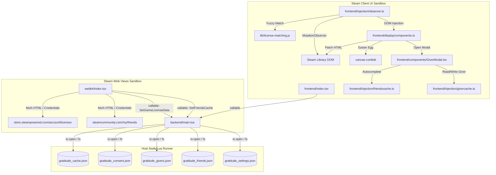

## gratitude-millennium-plugin

> This document provides a comprehensive guide to the **Gratitude** Steam library plugin, detailing its architectural patterns, runtime contexts, data synchronization flows, fuzzy matching algorithms, persistence mechanics, and development gotchas.

# Architectural Overview & Developer Guide (AGENTS.md)

This document provides a comprehensive guide to the **Gratitude** Steam library plugin, detailing its architectural patterns, runtime contexts, data synchronization flows, fuzzy matching algorithms, persistence mechanics, and development gotchas.

---

## 1. High-Level Purpose

The Steam Library does not natively indicate if a game was gifted to you or who the gifter was. **Gratitude** is a [Millennium](https://steambrew.app/) framework plugin that bridges this gap by:
1. **Scraping** the user's Steam Account license list to identify gifted games.
2. **Persisting** this metadata locally, categorized by Steam Account ID to support multiple users.
3. **Observing** the Steam UI DOM (in both Standard Desktop and Big Picture Mode) to inject a custom "Gifted" badge and details tooltip.
4. **Enabling annotations** where users can record who gifted a game (with friends-list autocomplete) and leave personal notes.

---

## 2. Runtime Architecture & Sandbox Contexts

Millennium plugins operate across three distinct environments. Each surface has unique security constraints and API accessibility:

### Context Breakdown

| Context | Main File / Folder | Environment & Execution Context | Capabilities & Limits |
| :--- | :--- | :--- | :--- |
| **Backend** | [backend/main.lua](backend/main.lua) | Lua execution runtime running directly on the host system. | Has full filesystem access. Persists state, runs database lookups, and exposes callback functions called by the Frontend and Webkit. |
| **Frontend** | [frontend/](frontend) | React & TypeScript running inside Steam's main library interface. | Detects active games, hooks popup/window events via `window.g_PopupManager`, listens to DOM mutations, and patches Steam UI. Restricted by Chromium sandbox (cannot write to host disk directly). |
| **Webkit** | [webkit/index.tsx](webkit/index.tsx) | Plain JavaScript & DOM running inside Steam browser views (Store/Community). | Runs on web pages like `store.steampowered.com` or `steamcommunity.com`. Uses standard browser `fetch` to scrape page markup. Cannot access Steam's React layer or direct host resources. |

---

## 3. Data Synchronization & Flows

### 3.1 License Synchronization
1. **Initialization**: When the user browses the Steam Store, [webkit/index.tsx](webkit/index.tsx) triggers a fetch request to `https://store.steampowered.com/account/licenses/`.
2. **Page Scraping**: The HTML is parsed for `table.account_table tbody tr`.
3. **Data Extraction**:
   - `item`: Name of the game or package.
   - `date`: The acquisition date (standardized to `"MMM DD, YYYY"`, e.g., `"Mar 5, 2025"`).
   - `acquisition`: Type of acquisition (filtered specifically for `"Gift/Guest Pass"`).
4. **Persistence**: Webkit invokes the backend callable `SetGameLicenseData` to parse and write this data to `backend/gratitude_cache.json`.

### 3.2 Library UI Injection
1. **DOM Tracking**: The frontend observer in [observer.ts](frontend/injection/observer.ts) listens to subtree changes.
2. **Game Detection**: When a game details page is rendered, the active game name (e.g. `"Serious Sam 3: BFE"`) is extracted.
3. **Matching Algorithm**: The game name is matched against the local backend cache using the fuzzy matching module [license-matching.js](lib/license-matching.js).
4. **Badge Insertion**: If there is a match showing the game was acquired as a `"Gift/Guest Pass"`, the UI builder in [components.ts](frontend/display/components.ts) creates a "Gifted" badge and injects it adjacent to the playtime tooltip element.
5. **Confetti Easter Egg**: Clicking the gift icon fires a confetti animation using `canvas-confetti`.

### 3.3 Friends Scraping & Giver Association
1. **Friends Sync**: When webkit runs on `https://steamcommunity.com`, it fetches the user's friend list page (`https://steamcommunity.com/my/friends/`) to scrape SteamID64s, display names, custom aliases, and avatar URLs. This is saved to `gratitude_friends.json`.
2. **Giver Dialog**: Clicking the text of the injected Gifted badge opens [GiverModal.tsx](frontend/components/GiverModal.tsx).
3. **Smart Autocomplete**: The friend input box autocompletes against the cached friends list.
4. **Annotation Persistence**: Saving details maps the game's license key to the gifter details in `gratitude_givers.json`.

---

## 4. Key Architectural Patterns

### 4.1 Fuzzy License Matching
Because library display names frequently vary from raw license names on Steam receipts, [license-matching.js](lib/license-matching.js) executes a cascade of fallback strategies:
1. **Exact Match**: Direct map query.
2. **Normalized Match**: Strips HTML entities, diacritics, trademark symbols (`™`, `®`), punctuation, and standardizes spacing and case.
3. **Prefix/Reverse Prefix Match**: Checks if the license starts with the game name or vice versa.
4. **Qualifier Suffix Stripping**: Removes tailing labels like `"- Special Edition"`, `"Test Server"`, `"Playtest"`, or `"(Beta)"`.
5. **Year/Classic Stripping**: Removes parenthetical regions or year indicators (e.g. `"(ROW)"`, `"(2023)"`).
6. **Alias Map Lookups**: Maps hardcoded equivalents (e.g., matching `"Counter-Strike 2"` to `"Counter-Strike: Global Offensive"`).

### 4.2 Multi-Account Database Isolation
Since Steam installations can be shared by multiple users, all state data is partitioned by the active user's **Steam Account ID** (resolved via [steamid.ts](lib/steamid.ts)):
- `gratitude_cache.json` keys licenses per Steam ID.
- `gratitude_givers.json` keys giver info per Steam ID, then by license.
- `gratitude_consent.json` maintains consent flags per Steam ID.
- `gratitude_friends.json` isolates friends lists per Steam ID.
- `gratitude_settings.json` houses settings per Steam ID.

### 4.3 Debounced Mutations
Mutations in Steam's React DOM can trigger observers multiple times in a single frame. To maintain smooth UI rendering, [observer.ts](frontend/injection/observer.ts) schedules processing tasks via `requestAnimationFrame`, ensuring a maximum of one DOM sweep per frame.

---

## 5. Development & Coding Gotchas

> [!WARNING]
> **Millennium Lua Argument Marshalling Gotcha**
> Lua backend callables exposed in Millennium do **not** guarantee the preservation of TypeScript object literal field order.
> When passing objects with multiple keys (e.g. `{ licenseKey, steamUserID }`), they may arrive in Lua sorted alphabetically by key name.
> - **Always verify** marshaled parameters in Lua using logger print statements.
> - **Best Practice**: Pass arguments as positional lists or wrap them inside JSON-serialized strings when calling backend methods.

> [!NOTE]
> **Steam Client DOM Selector Instability**
> Steam updates its client application regularly, changing class names and DOM shapes. Selectors are centralized in [types.ts](frontend/types.ts). If the badge stops showing up in the Steam library, verify that:
> - `SELECTORS.standard.tooltipContainer` (playtime layout block for standard UI)
> - `SELECTORS.bigPicture.tooltipContainer` (playtime layout block for Big Picture Mode)
> still match Steam's client markup.

---

## 6. Directory Map & Code Index

- [MILLENNIUM_DEVELOPMENT.md](MILLENNIUM_DEVELOPMENT.md): Millennium framework development guide, detailing CEF, DevTools setup, and context roles.
- [backend/main.lua](backend/main.lua): Core backend logic. Exposes callables, runs JSON file operations, and manages lifecycle events.
- [frontend/index.tsx](frontend/index.tsx): Plugin UI entry point. Registers window popup listeners and setups settings panel hooks.
- [frontend/injection/observer.ts](frontend/injection/observer.ts): Monitors client UI mutations and triggers fuzzy matching and badge injection.
- [frontend/display/components.ts](frontend/display/components.ts): Builds HTML elements for the gift badge, missing cache warn banners, and sets up click event animations.
- [frontend/components/GiverModal.tsx](frontend/components/GiverModal.tsx): Popup window for inputting gifter details, notes, and profile links with autocomplete support.
- [frontend/components/ConsentModal.tsx](frontend/components/ConsentModal.tsx): Overlay asking users for authorization to read/write license history.
- [webkit/index.tsx](webkit/index.tsx): Embedded web scraper. Queries Steam store licenses and community friends lists.
- [lib/license-matching.js](lib/license-matching.js): Pure JS normalization and string comparison logic for identifying gifted games.
- [lib/steamid.ts](lib/steamid.ts): Utility for translating between SteamID64 and 32-bit Account IDs across contexts.
- [tools/license-match-report.mjs](tools/license-match-report.mjs): Testing script to execute matches on offline HTML snapshots and output statistics.

---

## 7. Verification & Build Script Reference

- **Dev Build**: `npm run dev` compiles code for developers with live-reloads.
- **Prod Build**: `npm run build` runs compilation with minification into `.millennium/Dist/`.
- **Match Testing**: `npm run match:licenses -- --cache backend/gratitude_cache.json --dom path/to/snapshots` tests the matching algorithm against mock HTML pages.

---
> Source: [BlythT/Gratitude-Millennium-Plugin](https://github.com/BlythT/Gratitude-Millennium-Plugin) — distributed by [TomeVault](https://tomevault.io).
<!-- tomevault:4.0:gemini_md:2026-09-22 -->
