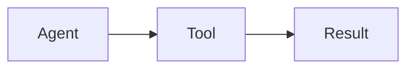

## 12-factor-agentops

> The 12-Factor methodology adapted for AI agent development. This is a documentation and methodology repository.

# 12-Factor AgentOps

## Purpose

The 12-Factor methodology adapted for AI agent development. This is a documentation and methodology repository.

## Content Focus

This repo defines the 12 factors for building reliable AI agents:

1. **Codebase** - One codebase, many deploys
2. **Dependencies** - Explicitly declare and isolate
3. **Config** - Store config in environment
4. **Backing Services** - Treat as attached resources
5. **Build, Release, Run** - Strictly separate stages
6. **Processes** - Execute as stateless processes
7. **Port Binding** - Export services via port binding
8. **Concurrency** - Scale out via process model
9. **Disposability** - Fast startup, graceful shutdown
10. **Dev/Prod Parity** - Keep environments similar
11. **Logs** - Treat as event streams
12. **Admin Processes** - Run as one-off processes

## Documentation Standards

### Markdown Structure
```markdown
# Factor N: Name

## The Factor

Brief description of the principle.

## Why It Matters for AI Agents

Agent-specific rationale.

## Implementation

Concrete guidance.

## Examples

Code examples and patterns.

## Anti-patterns

What to avoid.
```

### Diagrams
Use Mermaid for diagrams:


## Writing Style

- Clear, concise explanations
- Practical examples over theory
- Show anti-patterns alongside patterns
- Reference real-world agent scenarios

## Don't

- Don't be overly academic
- Don't skip practical examples
- Don't forget agent-specific context
- Don't use jargon without explanation

---
> Source: [boshu2/12-factor-agentops](https://github.com/boshu2/12-factor-agentops) — distributed by [TomeVault](https://tomevault.io).
<!-- tomevault:4.0:gemini_md:2026-05-03 -->
