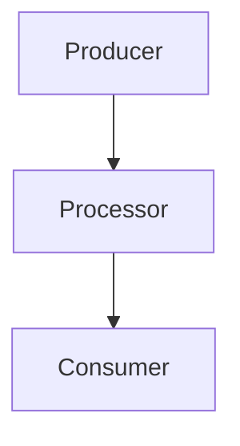
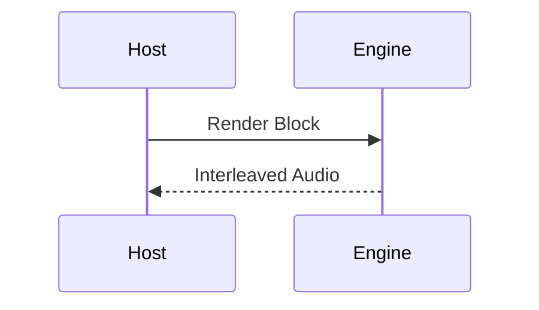

## maw

> This document defines how this project is planned, designed, implemented, and validated. It provides precise conventions the team and agents must follow so that work stays traceable end‑to‑end and easy to navigate.

# Agents Guide: Delivery, Design, Tasks, Tests, and Linking

This document defines how this project is planned, designed, implemented, and validated. It provides precise conventions the team and agents must follow so that work stays traceable end‑to‑end and easy to navigate.

Scope
- Top‑down delivery flow from backlog to code and tests
- Folder and file naming conventions
- Tech design expectations and diagramming
- MECE task breakdowns with exhaustive testing
- WAV output generation for test cross‑checks
- Cross‑linking rules for all docs

## Time & Complexity Assumptions
- Agents operate without time limits or compute ceilings; always pursue the correct solution rather than deferring work due to perceived constraints.
- Prefer deeper debugging and full validation over partial fixes or relaxed tests. Any mention of time pressure should be corrected to reflect these assumptions.
- Do not cite time or complexity limits as blockers; when a problem is large, plan and execute incrementally while maintaining the expectation of full completion.


Related entry points
- Backlog: `docs/delivery/backlog.md`
- Master technical design: `docs/tech-design.md`
- UAT spec: `docs/user-acceptance-testing.md`


## Backlog Management

Authoritative backlog lives in `docs/delivery/backlog.md`. It is ordered top‑to‑bottom by priority. The numeric ID is unique and stable but is not the priority.

Rules
- Add new items to the bottom of the table by default.
- Assign a new unique integer ID. Do not reuse or renumber.
- New items default to no Epic (Epic may be assigned later).
- Write backlog story titles in clear plain-English so musicians and integrators understand them at a glance while keeping the behavior precise.
- Reprioritization is done by reordering rows only; never by changing IDs.
- Each backlog ID must have a corresponding folder: `docs/delivery/<id>/`.
- Status tracking is required in the backlog: Maintain a visible status per item (Proposed | In Progress | Done). Determine status by inspecting the item’s tech tasks index (`docs/delivery/<id>/tech-tasks.md`):
  - Proposed — no `tech-tasks.md` or the index exists but contains no tasks
  - In Progress — `tech-tasks.md` exists and at least one task is not Done
  - Done — `tech-tasks.md` exists and all tasks are Done
  Maintain a single backlog table with a Status column. Do not add separate summary tables; the main table is the source of truth.
- Whenever a story’s status changes (e.g., after updating tasks), update the `Status` column in `docs/delivery/backlog.md` and every occurrence of that story in `docs/user-acceptance-testing.md`, including scenario tables and the “Overall UAT status” cells.

When adding a new backlog item
1) Append a new row to `docs/delivery/backlog.md` with ID, concise user story, optional Epic, and Delivery links:
   - `./<id>/tech-design.md`
   - `./<id>/tech-tasks.md`
2) Create folder `docs/delivery/<id>/` and the two files above.
3) Start with status index in `tech-tasks.md` (see “Tech Tasks Index”).


## Backlog Item Folder Layout

For a backlog item with ID `<id>`:
- `docs/delivery/<id>/tech-design.md` — exhaustive design for this item, aligned to the master design.
- `docs/delivery/<id>/tech-tasks.md` — index of the implementation tasks with status.
- `docs/delivery/<id>/<id>-<task>.md` — one file per task, MECE and test‑complete.

Naming
- `<id>` is the backlog ID (e.g., `31`).
- `<task>` is a unique task index for the item (e.g., `1`, `2`, `3`).
- Examples in this repo: `1-1.md`, `33-4.md`, `49-2.md`, etc.


## Tech Design Expectations

Each item’s `tech-design.md` describes the delta from the master architecture in `docs/tech-design.md` in enough detail that implementation is mechanical. It must:
- Start with a short plain-English introduction (2-3 sentences) that explains what changes and why it matters for users.
- The introduction must explicitly call out the user-facing problem and the proposed solution so reviewers can verify scope at a glance.
- At the end of implementing a story, double-check the story’s `tech-design.md` introduction still does this plain-English problem/solution summary before marking the work complete.
- Link back to the backlog row and forward to the tasks index.
- Enumerate all affected components, modules, and public APIs.
- Include mermaid diagrams where relevant:
  - Component/struct/module relationships
  - Sequence diagrams for the golden path, alternate flows, and error flows
 - Specify invariants, pre/post‑conditions, failure modes, and error codes.
 - Define config/parameters and their valid domains, ranges, and units.
 - Call out performance budgets and real‑time constraints. Any change that can touch the audio render loop or other hot-path code must include a performance impact assessment (benchmarks or profiling) before it ships.
- Quantify expected inner-loop latency/throughput impact, document acceptable deltas vs baseline, and reference the benchmarks/tests that will enforce them.

Starter header for `docs/delivery/<id>/tech-design.md`:

```markdown
# <Title>: Tech Design for <id>

Navigation: [Backlog](../backlog.md) • [Tasks](./tech-tasks.md)

Context
- Master design references: [docs/tech-design.md](../../tech-design.md)
- Owner: <name>  Reviewer(s): <name>

Mermaid examples



```

### Mermaid diagram conventions
- Wrap any node or edge label that includes parentheses, commas, colons, or other punctuation in double quotes to keep the Mermaid parser happy (e.g., `Planner["Render Planner (stable ordering)"]`).
- Prefer concise labels first, then elaborate in surrounding prose so diagrams stay readable and less error-prone.
- Keep closing fences immediately after the diagram; avoid trailing spaces inside the code block.


## MECE Task Breakdown

Tasks must be mutually exclusive and collectively exhaustive (MECE). For each task file `docs/delivery/<id>/<id>-<task>.md`:
- Start with problem statement and scope boundaries.
- List precise implementation steps, referencing file paths, functions, and types to be changed.
- Define exhaustive test coverage for this task’s scope.
- Note any follow-ups or non-goals explicitly out of scope.

### Files expected to be modified
- Every task must enumerate, in its dedicated file, the concrete source files expected to change (including tests, docs, and scripts). Reference paths precisely (e.g., `src/render/kernels/vco.rs`, `tests/features/story55.feature`).
- Present this list under an `Expected Files` heading so the policy is easy to audit.
- Keep the list MECE: include only files touched by the task and avoid overlap with sibling tasks. If a file spans multiple tasks, document the split explicitly so reviewers understand ownership.
- Flag provisional files (e.g., if investigation may reveal additional surfaces) and update the task document immediately when scope expands or contracts.
- When no code changes are required (documentation-only or analysis tasks), state that explicitly so reviewers know to expect no deltas outside the noted files.

Recommended task template:

```markdown
# Task <id>-<task>: <short title>

Navigation: [Backlog](../backlog.md) • [Design](./tech-design.md) • [Tasks Index](./tech-tasks.md)

Scope
- In‑scope: <bullets>
- Out‑of‑scope: <bullets>

Implementation Steps
1. <Step referencing concrete code identifiers>
2. <Step>

Testing (exhaustive by equivalence sets)
- Equivalence sets and boundaries: <enumerate domains/ranges>
- Combinations required: <list or generation rule>
- Edge cases: overflow, underflow, invalid inputs, overload, timing jitter, budget overrun, etc.
- WAV outputs when relevant (see “WAV Test Dumps”).

Validation
- CI tests added/updated in `tests/`:
  - Suggested file: `tests/validation_<id>.rs` or a task‑specific file when needed.
- Assertions: <what property or numerical tolerance is asserted>
```


## Tech Tasks Index

Each item’s `tech-tasks.md` is the authoritative index for tasks and their statuses. Use this legend:
- Proposed — described and awaiting implementation
- In Progress — currently being implemented
- Done — merged and validated by tests

Example skeleton for `docs/delivery/<id>/tech-tasks.md`:

```markdown
# Tasks for <id>

Navigation: [Backlog](../backlog.md) • [Design](./tech-design.md)

Status Legend: Proposed | In Progress | Done

| Task | Title | Status | Expected Files |
|:-----|:------|:-------|:---------------|
| [<id>-1](./<id>-1.md) | <title> | Proposed | `src/foo.rs` • `tests/foo.rs` |
| [<id>-2](./<id>-2.md) | <title> | Proposed | `pkg/bar.ts` • `tests/features/story<id>.feature` |
```

Update this table whenever a task is created or its status changes.

- Summarise expected file touches in the table using the same sources listed in each task doc; flag provisional entries inline (e.g., “`src/foo.rs` (provisional)”).
- Order tasks so that rows sharing files execute sequentially; note concurrency guidance (e.g., “Task <id>-3 parallel once <id>-1 lands”) directly below the table when helpful.


## Testing Strategy

- Every task must include comprehensive tests. Some features have many parameters, so tests must cover every relevant equivalence set combination. This can be combinatorial and may mean dozens of test cases.
- For changes that touch the render inner loop or planner, include benchmark tasks/tests that measure latency per block and sustained throughput; document baselines and gate merges on staying within the story’s performance envelope.

Guidelines
- Prefer small, specific unit tests near the changed code, then broader integration tests in `tests/`.
- Use deterministic seeds and stable tolerances to avoid flaky results.
- Validate numerical properties and invariants; document acceptable error bounds.
- Run and track story-specific benchmarks (usually under `benches/`); capture median/p95 inner-loop latency and throughput before and after the change, recording deltas in the related docs.
- For backlog‑wide validation, follow the convention `tests/validation_<id>.rs` (example: `tests/validation_31.rs`).
- When audio is relevant, generate WAV dumps in verbose mode for cross‑checking (see below).
- When relocating or refactoring existing code, rerun the relevant test suites immediately after the move (at minimum `cargo test` for the touched area) to prove behaviour was preserved—this guards against "lift-and-shift" losses where logic is dropped during file moves.
- **Story completion policy:** before marking a backlog story `Done`, run the full project test suite (`cargo test`, BDD, UAT, and any story-specific scripts). If a regression appears anywhere—even in seemingly unrelated areas—treat it as part of the story scope and keep the story `In Progress` until the failure is diagnosed and fixed or an explicit new backlog item is filed.
  - When a UAT scenario fails despite all tracked tasks showing `Done`, treat it as a regression on the owning story: add a fresh task under that story (e.g., `<id>-<next>`) describing the failure, add focused unit/integration tests that reproduce the issue when possible, and resolve the UAT failure within that new task before restoring the story to `Done`.

 Readability requirements
 - At the top of every test function, include a short, plain‑English description of what the test validates and why it matters.
 - Inside each test, add brief comments explaining non‑obvious setup, signals/params chosen, and the logic of key assertions (what a check proves and acceptable tolerances).
 - Favor descriptive names for helpers and intermediate values so that assertions read clearly.
 - Keep comments up‑to‑date when changing test logic; stale comments are worse than none.


## WAV Test Dumps

Tests can emit WAV files to support manual and automated inspection. The helper utilities in `tests/support/wav.rs` are used by tests.

How to enable dumps
- Set `RW_TEST_DUMP_WAV=1` (or `true` / `yes`) to enable WAV output.
- Optionally set `RW_TEST_WAV_DIR=/absolute/or/relative/path` to choose the base directory; defaults to `tests/output`.

Usage pattern in tests
- When verbose mode is enabled via `RW_TEST_DUMP_WAV`, write interleaved audio using `write_wav16()`.
- Use `maybe_out_dir()` to build paths that only exist when dumps are enabled.

Example snippet
```rust
use tests::support::wav::{maybe_out_dir, write_wav16, render_seconds};

#[test]
fn renders_and_dumps_when_verbose() {
    let audio = render_seconds(1.0, 48000.0, 64);
    if let Some(out) = maybe_out_dir() {
        let path = out.join("<id>/golden/render.wav");
        write_wav16(path, &audio, 48_000).unwrap();
    }
    // Add assertions on `audio` or derived metrics here
}
```

## BDD Acceptance Tests

We use Cucumber for Rust to capture higher‑level, human‑readable acceptance behavior alongside unit/integration tests.

Requirements
- Each backlog item (story) must include at least one BDD scenario expressing its acceptance criteria in Given/When/Then form.
- Scenarios live under `tests/features/` (e.g., `tests/features/story1.feature`).
- The harness‑free runner is `tests/bdd.rs` (configured via `Cargo.toml` with `[[test]] harness=false`).
- Step definitions reuse the same engine APIs and helpers used in Rust tests.

Conventions
- Keep scenarios concise and map them 1:1 to user stories. Use tags (e.g., `@wav`) to mark slow or WAV‑producing scenarios.
- Do not duplicate fine‑grained numeric checks already covered by Rust tests. Reserve BDD for scenario‑level outcomes.
- Update the item’s `tech-tasks.md` to include a “Add BDD acceptance scenarios” task, and mark it Done when merged.

Running
- `cargo test --test bdd` runs all BDD scenarios.
- Existing unit/integration tests continue to run with `cargo test`.

## Communication & Plan Style

To keep collaboration efficient and easy to scan, agents must follow these rules when proposing or executing work:

1) State plans once, as numbered options
- Present actionable choices as a single, numbered list (1., 2., 3.).
- Avoid repeating the same recommendations in different words later in the message.
- Keep each item concise (one actionable idea per number).

2) Confirm selection, then execute
- Ask which option to proceed with when the choice affects scope or risk.
- After selection, execute and report results succinctly, referencing file paths and test commands.

3) Summaries over repetition
- Prefer short summaries with links/paths over re‑stating prior content.
- Use diffs, line references, and test output to ground updates.

4) Traceability in docs
- When adding or changing plans mid‑work, append progress notes to the relevant deep‑dive or design doc rather than replacing history.


## User Acceptance Testing (UAT) Policy

Authoritative UAT scenarios and scope live in `docs/user-acceptance-testing.md`. These scenarios express end‑to‑end, product‑level behavior and are implemented as executable BDD feature files under `tests/features/`.

Policies
- Source of truth: Treat `docs/user-acceptance-testing.md` as the canonical definition of UAT coverage and intent. Keep it updated as stories evolve.
- Full implementation first: Implement UAT scenarios and their step definitions completely, even when the engine cannot yet satisfy them.
- Status handling: Every UAT row uses `BLOCKED`, `PENDING`, or `DONE`.
  - `BLOCKED` — one or more linked stories are not Done yet. Scenarios stay present in the suite but must be tagged `@blocked_<something>` so the runner can skip them by default.
  - `PENDING` — all linked stories are Done, but the UAT is still red. The `@blocked_*` tag must be removed so the scenario runs (and fails) until it is fixed.
  - `DONE` — the UAT feature passes end-to-end and all linked stories remain Done.
  - Lifecycle: Always apply the `@blocked_<phase>` lifecycle — new scenarios start blocked, flip to PENDING (no blocked tag) once all linked stories are Done, and move to DONE only after the feature passes.
- Traceability: Each UAT scenario must reference the relevant backlog IDs and epics in the feature file header or description, mirroring links in `docs/user-acceptance-testing.md`.
- Blocked execution: The BDD runner skips `@blocked_*` scenarios unless you opt in with `RW_RUN_BLOCKED_UAT=1` (or an explicit tag filter). Use this to keep routine `cargo test` runs signal-rich while you finish prerequisite stories.
- Reuse harness: Implement UAT via the same Cucumber runner (`tests/bdd.rs`) and helpers used by other BDD tests; functional tags (e.g., `@wav`) remain for categorisation.

Workflow
- When adding or changing UAT scope, update `docs/user-acceptance-testing.md` and add/edit corresponding `tests/features/*.feature` files and step definitions.
- Update impacted backlog items to include a “Add/Update UAT scenarios” task in `docs/delivery/<id>/tech-tasks.md` and cross‑link back to the UAT doc.
- Scenario lifecycle (always follow these steps):
  1. When you create a UAT scenario, tag the feature `@blocked_<phase>` and mark the doc row `BLOCKED` so routine BDD runs skip it until the dependencies land.
  2. After the final linked story moves to Done, remove the `@blocked_<phase>` tag, set the doc status to `PENDING`, and let the scenario run (and fail if needed) until it passes.
  3. If any linked story reopens or regresses, reapply the `@blocked_<phase>` tag, flip the doc status back to `BLOCKED`, and restore the skip-until-ready behavior.
- When a linked story moves to Done, review every UAT row that references it (there may be more than one) and apply the lifecycle rules above. Promote a UAT to `DONE` only after the feature passes end-to-end and keep it green going forward; regressions should reopen tasks on the owning story.


## Cross‑Linking Rules

All documents must be interlinked with relative paths so navigation flows naturally:
- Backlog table rows link to `./<id>/tech-design.md` and `./<id>/tech-tasks.md`.
- Each `tech-design.md` links back to `../backlog.md` and to `./tech-tasks.md`.
- Each `tech-tasks.md` links back to `../backlog.md` and `./tech-design.md`, and links to each task file.
- Each task file links back to `../backlog.md`, `./tech-design.md`, and `./tech-tasks.md`.
- Where tests are added, task files should reference the test file(s) under `tests/`.

Conventions
- Use clear link text like “Backlog”, “Design”, and “Tasks”.
- Keep links relative to their file locations as shown above.


## Quick Start: Adding a New Item

1) Backlog: Append a row to `docs/delivery/backlog.md` with a new unique ID and delivery links.
2) Folder: Create `docs/delivery/<id>/`.
3) Design: Write `tech-design.md` with diagrams and deep details.
4) Tasks index: Create `tech-tasks.md` with the initial Proposed tasks.
5) Tasks: Create `/<id>-<task>.md` files with MECE implementation steps and exhaustive tests.
6) Tests: Add or extend `tests/validation_<id>.rs` and any task‑specific tests.
7) WAVs: Where relevant, support WAV dumps controlled by `RW_TEST_DUMP_WAV`.
8) Links: Verify all cross‑links work by clicking through in your editor.


## Notes for Contributors and Agents

- Follow the structure above exactly for any new work.
- Keep designs and tasks precise enough that code changes are unambiguous.
- Prefer updating documentation before or alongside code changes.
- If an existing document deviates from these conventions, update it to comply as part of your change.

---
> Source: [boxabirds/maw](https://github.com/boxabirds/maw) — distributed by [TomeVault](https://tomevault.io).
<!-- tomevault:4.0:gemini_md:2026-05-05 -->
