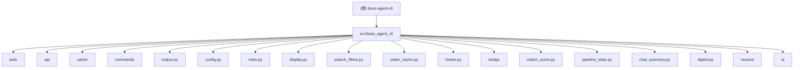

## boss-agent-cli

> 所有 teammate 开工前必须加载 pua skill。

# boss-agent-cli

# Agent Team PUA 配置
所有 teammate 开工前必须加载 pua skill。
teammate 失败 2 次以上时向 Leader 发送 [PUA-REPORT] 格式汇报。
Leader 负责全局压力等级管理和跨 teammate 失败传递。

## 项目愿景

专为 AI Agent 设计的 BOSS 直聘求职 CLI 工具。结合 geekgeekrun（浏览器自动化 + 反检测）和 boss-cli（CLI + 结构化输出）的优势，让 AI Agent 通过 subprocess 调用 CLI、读取 stdout JSON 输出，完成完整的求职操作链。

## 架构总览

```
CLI 入口 (Click)
    |
    +---> AuthManager (Token 生命周期)
    |         |
    |         +---> TokenStore (Fernet 加密持久化)
    |         +---> Playwright (Headless 登录 / stoken 刷新)
    |
    +---> BossClient (httpx + BrowserSession)
    |         |
    |         +---> RequestThrottle (共享反检测延迟)
    |         +---> BrowserSession (CDP 优先 / patchright 降级)
    |         |         |
    |         |         +---> CDP 连接用户 Chrome（真实指纹 + stoken 自动生成）
    |         |         +---> Headless patchright（降级方案）
    |         |
    |         +---> BridgeClient (可选 — Chrome 扩展通道)
    |         |         |
    |         |         +---> BridgeDaemon (HTTP + WebSocket 服务)
    |         |         +---> Chrome 扩展（真实浏览器环境执行）
    |         |
    |         +---> httpx（低风险 API 请求）
    |         +---> BOSS 直聘 wapi 接口
    |
    +---> CacheStore (SQLite WAL)
    |
    +---> display.py (Rich 渲染 / TTY 自适应)
    |
    +---> output.py (JSON 信封) ---> stdout
```

**数据流**：CLI 命令 -> AuthManager 确保有效 Token -> BossClient 发起 API 请求 -> output.py 格式化为 JSON 信封 -> stdout

**输出约定**：
- stdout: 仅 JSON 结构化数据
- stderr: 日志和进度信息（通过 `--log-level` 控制）
- exit code 0: 命令成功 (ok=true)
- exit code 1: 命令失败 (ok=false)

## 不变量契约

以下规则为 breaking change 红线，违反即为破坏性变更：

- **信封格式**：stdout 仅输出 JSON 信封 `{ok, schema_version, command, data, pagination, error, hints}`，任何命令不得直接 `print()` 到 stdout
- **错误三元组**：`error` 对象必须包含 `code` + `recoverable` + `recovery_action` 三个字段，缺一不可
- **福利筛选**：`--welfare` 为核心差异化功能，不得移除或降级
- **能力真源**：`boss schema` 返回完整工具自描述 JSON，是 Agent 理解能力的唯一入口，新增命令必须同步注册
- **信封字段**：不得移除或重命名现有信封顶层字段（ok / schema_version / command / data / pagination / error / hints）

## 模块结构图



## 模块索引

| 模块路径 | 语言 | 职责 | 入口文件 | 测试 |
|----------|------|------|----------|------|
| `src/boss_agent_cli/` | Python | 包根目录，版本号 | `__init__.py` | - |
| `src/boss_agent_cli/auth/` | Python | Token 生命周期：加密存储、Cookie 提取、patchright 扫码登录、stoken 刷新、文件锁 | `manager.py` | `tests/test_auth.py` |
| `src/boss_agent_cli/api/` | Python | wapi 端点常量、API 返回码常量、数据模型 (dataclass)、httpx 统一请求（高斯抖动+指数退避）、CDP/patchright 浏览器通道、共享请求限速 | `client.py` | `tests/test_api.py`, `tests/test_throttle.py`, `tests/test_browser_client.py` |
| `src/boss_agent_cli/cache/` | Python | SQLite WAL 缓存（搜索历史 100 条上限、已打招呼记录） | `store.py` | `tests/test_cache.py` |
| `src/boss_agent_cli/commands/` | Python | Click CLI 命令：schema/login/logout/status/doctor/search/detail/greet/batch-greet/recommend/export/cities/me/show/history/chat/chatmsg/chat-summary/mark/exchange/interviews/watch/preset/pipeline/follow-up/apply/shortlist/digest/resume/ai/config/clean | `search.py`, `greet.py`, `me.py` | `tests/test_commands.py`, `tests/test_new_commands.py`, `tests/test_welfare_filter.py`, `tests/test_pipeline_commands.py`, `tests/test_apply.py`, `tests/test_preset.py`, `tests/test_shortlist.py`, `tests/test_watch.py`, `tests/test_chat_summary_command.py`, `tests/test_digest_command.py`, `tests/test_resume_commands.py`, `tests/test_ai_commands.py`, `tests/test_config_cmd.py`, `tests/test_clean_cmd.py` |
| `src/boss_agent_cli/output.py` | Python | JSON 信封封装 + Logger（stderr 日志级别过滤） | - | `tests/test_output.py` |
| `src/boss_agent_cli/config.py` | Python | 配置文件读取与默认值 (`~/.boss-agent/config.json`) | - | `tests/test_output.py` |
| `src/boss_agent_cli/main.py` | Python | Click CLI group 入口 + 全局选项 + 配置加载 | - | `tests/test_commands.py` |
| `src/boss_agent_cli/display.py` | Python | Rich 终端渲染 + TTY/Pipe 自动切换 + `@handle_auth_errors` 统一装饰器 | - | `tests/test_display.py`, `tests/test_commands.py`（间接覆盖） |
| `src/boss_agent_cli/search_filters.py` | Python | 搜索结果预过滤：城市/薪资/学历/经验客户端筛选 | - | `tests/test_search_filters.py`, `tests/test_search_pipeline.py` |
| `src/boss_agent_cli/index_cache.py` | Python | 搜索结果索引缓存，支持 `boss show N` 快速导航 | - | `tests/test_index_cache.py` |
| `src/boss_agent_cli/hooks.py` | Python | 轻量事件钩子系统（SyncHook / BailHook） | - | `tests/test_hooks.py` |
| `src/boss_agent_cli/match_score.py` | Python | 职位匹配评分：基于薪资/经验/学历/城市计算匹配分和原因 | - | `tests/test_match_score.py` |
| `src/boss_agent_cli/pipeline_state.py` | Python | 候选进度状态机：聊天阶段判定、跟进筛选 | - | `tests/test_pipeline_state.py` |
| `src/boss_agent_cli/chat_summary.py` | Python | 聊天消息结构化摘要：阶段/待办/关键事实/风险标记 | - | `tests/test_chat_summary.py` |
| `src/boss_agent_cli/digest.py` | Python | 日报数据聚合：新增职位/待跟进/面试汇总 | - | `tests/test_digest.py` |
| `src/boss_agent_cli/bridge/` | Python | Browser Bridge — Chrome 扩展 + Python daemon 零配置浏览器通道 | `client.py` | `tests/test_bridge.py`, `tests/test_bridge_extended.py` |
| `src/boss_agent_cli/resume/` | Python | 简历数据模型、本地存储、模板渲染、多格式导出 | `models.py` | `tests/test_resume_commands.py`, `tests/test_resume_templates.py`, `tests/test_resume_export.py`, `tests/test_resume_models.py`, `tests/test_resume_store.py`, `tests/test_resume_import_compat.py` |
| `src/boss_agent_cli/ai/` | Python | 智能服务：多模型配置、密钥加密存储、提示词模板、对话补全 | `service.py` | `tests/test_ai_config.py`, `tests/test_ai_prompts.py`, `tests/test_ai_service.py`, `tests/test_ai_commands.py` |
| `src/boss_agent_cli/platforms/` | Python | 跨平台抽象（Issue #129 Week 1 骨架）：Platform ABC + 注册表 + BossPlatform adapter；招聘者抽象：RecruiterPlatform ABC + BossRecruiterPlatform adapter | `base.py`, `zhipin.py`, `recruiter_base.py`, `zhipin_recruiter.py` | `tests/test_platform_base.py`, `tests/test_recruiter_platform.py` |

## 技术栈

| 类别 | 选型 | 版本要求 |
|------|------|----------|
| 语言 | Python | >=3.10 |
| CLI 框架 | Click | >=8.0 |
| HTTP 客户端 | httpx | >=0.27 |
| 浏览器自动化 | patchright（Playwright 反检测 fork） | >=1.58.2 |
| Cookie 提取 | browser-cookie3 | >=0.16.2 |
| 加密 | cryptography (Fernet + PBKDF2) | >=42.0 |
| 终端渲染 | rich | >=13.0 |
| YAML 解析 | pyyaml | >=6.0 |
| 异步 HTTP（Bridge） | aiohttp（可选依赖） | >=3.9 |
| 数据库 | sqlite3（标准库，WAL 模式） | - |
| 包管理/构建 | uv + hatchling | - |
| 测试 | pytest | >=7.0 |
| Lint | ruff | >=0.4 |

## 运行与开发

```bash
# 初始化项目
cd /Users/can4hou6joeng4/Documents/code/boss-agent-cli
uv sync --all-extras
uv run playwright install chromium

# 验证安装
uv run python -c "import boss_agent_cli; print(boss_agent_cli.__version__)"

# 运行 CLI
uv run boss schema             # 查看工具能力描述
uv run boss --help             # 查看帮助
uv run boss search --help      # 查看 search 命令帮助

# 运行测试
uv run pytest tests/ -v
```

**CLI 入口点**：`boss = boss_agent_cli.main:cli`（定义在 `pyproject.toml` 的 `[project.scripts]`）

**本地存储目录**：`~/.boss-agent/`
```
~/.boss-agent/
  auth/
    session.enc      # Fernet 加密的 Cookie/Token/stoken
    salt             # PBKDF2 salt（16 字节随机值）
    refresh.lock     # 文件锁（刷新时临时创建）
  cache/
    boss_agent.db    # SQLite WAL 模式
  chat-history/      # 沟通列表 JSON 快照（按日期，用于 diff）
  chat-export/       # 沟通列表导出文件（按日期命名，同天覆盖）
  chrome-cdp-profile/  # CDP 模式专用 Chrome profile（独立于用户日常 Chrome）
  resumes/           # 简历 JSON 文件存储（按名称命名）
  ai/
    api_key.enc      # Fernet 加密的 AI 服务 API 密钥
    config.json      # AI 模型配置（提供商/模型/温度/最大令牌数）
  config.json        # 用户配置
```

## CDP 模式

通过 Chrome DevTools Protocol 连接用户本地 Chrome，获得真实浏览器指纹和天然 stoken 生成能力，从根本上消除 stoken 过期问题。

**启动方式**（需先完全退出 Chrome）：
```bash
# 使用 alias（已配置在 ~/.zshrc）
boss-chrome

# 或手动启动
/Applications/Google\ Chrome.app/Contents/MacOS/Google\ Chrome \
  --remote-debugging-port=9222 \
  --user-data-dir="$HOME/.boss-agent/chrome-cdp-profile" \
  --no-first-run
```

**工作原理**：
- `BrowserSession` 启动时自动探测 CDP 端口（HTTP → WS URL → DevToolsActivePort 文件）
- CDP 可用时复用用户 Chrome 上下文（真实指纹 + 登录态），在新 tab 中执行 `fetch()` 调用
- CDP 不可用时自动降级到 headless patchright（行为不变）
- `--cdp-url` 全局选项可指定自定义 CDP 地址，也可在 `config.json` 中配置 `"cdp_url"`
- `boss login --cdp` 在 CDP Chrome 中打开登录页等待扫码

**注意事项**：
- macOS 上 Chrome GUI 模式必须使用 `--user-data-dir` 参数才能绑定调试端口
- Chrome 148+ 对 Playwright HTTP CDP 请求返回 400，代码已处理（自动获取 WS URL 重连）
- CDP 模式下 `close()` 只关闭自建 tab，不影响用户浏览器

## 测试策略

- **测试框架**：pytest
- **测试目录**：`tests/`
- **TDD 流程**：先写测试 (RED) -> 运行失败 -> 实现代码 (GREEN) -> 重构
- **Mock 策略**：命令层测试通过 `unittest.mock.patch` 替换 AuthManager、BossClient、CacheStore
- **测试文件映射**：
  - `tests/test_output.py` -> output.py + config.py
  - `tests/test_cache.py` -> cache/store.py
  - `tests/test_auth.py` -> auth/token_store.py
  - `tests/test_auth_manager_flow.py` -> auth/manager.py（登录流程、Token 刷新）
  - `tests/test_api.py` -> api/endpoints.py + api/models.py
  - `tests/test_api_client_retry.py` -> api/client.py（重试策略、指数退避）
  - `tests/test_endpoints_loader.py` -> api/endpoints_loader.py（YAML 加载、Spec 解析）
  - `tests/test_throttle.py` -> api/throttle.py（延迟策略、突发惩罚）
  - `tests/test_browser_client.py` -> api/browser_client.py（CDP 发现、WS URL、close 行为）
  - `tests/test_bridge.py` -> bridge/（协议、客户端、daemon 工具）
  - `tests/test_commands.py` -> commands/* + main.py
  - `tests/test_new_commands.py` -> commands/chatmsg.py, mark.py, exchange.py, doctor.py 等新命令
  - `tests/test_welfare_filter.py` -> commands/search.py（福利筛选标签匹配、详情 fallback）
  - `tests/test_search_filters.py` -> search_filters.py（薪资/经验/学历/城市预过滤）
  - `tests/test_search_pipeline.py` -> search_filters.py（搜索流水线、福利关键词解析）
  - `tests/test_hooks.py` -> hooks.py（SyncHook / BailHook 事件系统）
  - `tests/test_display.py` -> display.py（TTY 检测、渲染器、认证错误装饰器）
  - `tests/test_index_cache.py` -> index_cache.py（索引保存/加载/按编号查询）
  - `tests/test_match_score.py` -> match_score.py（职位匹配评分）
  - `tests/test_pipeline_state.py` -> pipeline_state.py（候选进度状态机）
  - `tests/test_pipeline_commands.py` -> commands/pipeline.py + commands/digest.py（pipeline/follow-up/digest 命令）
  - `tests/test_chat_summary.py` -> chat_summary.py（消息摘要逻辑）
  - `tests/test_chat_summary_command.py` -> commands/chat_summary.py（chat-summary 命令）
  - `tests/test_digest.py` -> digest.py（日报数据聚合）
  - `tests/test_digest_command.py` -> commands/digest.py（digest 命令）
  - `tests/test_apply.py` -> commands/apply.py（投递/立即沟通命令）
  - `tests/test_preset.py` -> commands/preset.py（搜索预设管理）
  - `tests/test_shortlist.py` -> commands/shortlist.py（候选池管理）
  - `tests/test_watch.py` -> commands/watch.py（增量监控命令）
  - `tests/test_agent_docs.py` -> 文档一致性校验（命令数量、schema 对齐）
  - `tests/test_smoke_p0.py` -> 冒烟测试（模块可导入性验证）
  - `tests/test_resume_commands.py` -> commands/resume_cmd.py（简历管理命令）
  - `tests/test_resume_templates.py` -> resume/templates.py（简历模板渲染、防注入）
  - `tests/test_resume_export.py` -> resume/export.py（简历导出命令集成）
  - `tests/test_ai_config.py` -> ai/config.py（密钥加密、多模型配置）
  - `tests/test_ai_prompts.py` -> ai/prompts.py（提示词模板完整性）
  - `tests/test_ai_service.py` -> ai/service.py（对话补全、错误处理）
  - `tests/test_ai_commands.py` -> commands/ai_cmd.py（AI 优化命令组）
  - `tests/test_config_cmd.py` -> commands/config_cmd.py（配置管理命令）
  - `tests/test_clean_cmd.py` -> commands/clean.py（缓存清理命令）
  - `tests/test_resume_models.py` -> resume/models.py（简历数据模型）
  - `tests/test_resume_store.py` -> resume/store.py（简历本地存储）
  - `tests/test_resume_import_compat.py` -> resume/store.py（简历导入兼容性）
  - `tests/test_schema_contract.py` -> commands/schema.py（接口合约和错误码一致性）
  - `tests/test_agent_host_examples.py` -> 多宿主集成示例验证
  - `tests/test_mcp_server.py` -> MCP 服务端协议测试
  - `tests/test_chat_export_extended.py` -> commands/chat_export.py（导出扩展测试）
  - `tests/test_chat_snapshot_extended.py` -> commands/chat_snapshot.py（快照扩展测试）
  - `tests/test_chatmsg_extended.py` -> commands/chatmsg.py（聊天消息扩展测试）
  - `tests/test_doctor_extended.py` -> commands/doctor.py（诊断命令扩展测试）
  - `tests/test_cache_extended.py` -> cache/store.py（缓存扩展测试）
  - `tests/test_bridge_extended.py` -> bridge/（桥接扩展测试）
  - `tests/test_greet_detail_extended.py` -> commands/greet.py + commands/detail.py（打招呼和详情扩展测试）

## 编码规范

- **缩进**：使用 tab（`indent-width = 4`），ruff 格式化配置见 `pyproject.toml`
- **语言要求**：Python >=3.10（使用 `X | Y` 联合类型语法）
- **输出协议**：所有命令必须通过 `emit_success` / `emit_error` 输出 JSON 信封到 stdout
- **错误处理**：模块层抛异常（如 `AuthRequired`、`TokenRefreshFailed`），命令层统一捕获并转为 JSON 错误信封
- **不可变数据**：优先使用 `dataclass` 和纯函数
- **包管理器**：pnpm（前端相关）/ uv（Python）

## 错误码枚举

| 错误码 | 说明 | 可恢复 | 恢复动作 |
|--------|------|--------|----------|
| AUTH_EXPIRED | 登录态过期 | 是 | `boss login` |
| AUTH_REQUIRED | 未登录 | 是 | `boss login` |
| RATE_LIMITED | 请求频率过高 | 是 | 等待后重试 |
| TOKEN_REFRESH_FAILED | Token 刷新失败 | 是 | `boss login` |
| ACCOUNT_RISK | 风控拦截（code 36） | 视情况 | 启动 CDP Chrome 重试，或联系客服 |
| JOB_NOT_FOUND | 职位不存在或已下架 | 否 | - |
| ALREADY_GREETED | 已向该招聘者打过招呼 | 否 | - |
| ALREADY_APPLIED | 已发起过投递/立即沟通 | 否 | - |
| GREET_LIMIT | 今日打招呼次数已用完 | 否 | - |
| NETWORK_ERROR | 网络请求失败 | 是 | 重试 |
| INVALID_PARAM | 参数校验失败 | 否 | 修正参数 |
| RESUME_NOT_FOUND | 简历不存在 | 否 | 检查名称是否正确 |
| RESUME_ALREADY_EXISTS | 简历名称已占用 | 否 | 使用不同名称或先删除 |
| EXPORT_FAILED | 导出失败 | 是 | 检查依赖安装（如 patchright） |
| AI_NOT_CONFIGURED | AI 服务未配置 | 是 | `boss ai config --provider <p> --model <m> --api-key <k>` |
| AI_API_ERROR | AI 服务调用失败 | 是 | 检查网络连接和密钥配置，重试 |
| AI_PARSE_ERROR | AI 返回结果解析失败 | 是 | 重试（模型输出不稳定时可能发生） |
| RECRUITER_NOT_AUTHORIZED | 当前账号非招聘者账号 | 是 | 切换招聘者账号或使用 --role candidate |
| APPLICATION_NOT_FOUND | 投递申请不存在 | 否 | - |
| RESUME_NOT_SHARED | 候选人未分享简历 | 是 | 使用 resume <id> --request 请求简历 |
| JOB_POST_LIMIT | 职位发布数量已达上限 | 否 | - |

## AI 使用指引

**Agent 典型调用链**：
```
boss schema       -> 理解工具能力（32 个命令）
boss status       -> 检查登录态
boss doctor       -> 诊断本地环境、依赖和网络连通性
boss login        -> 若未登录（优先 Cookie 提取，失败扫码；--cdp 支持 CDP Chrome 扫码）
boss me           -> 获取用户信息（基本信息/简历/求职期望/投递记录）
boss search       -> 搜索职位（支持 --welfare 福利筛选，并行查详情）
boss recommend    -> 或获取个性化推荐
boss detail       -> 查看详情（参数为 security_id，传 --job-id 走 httpx 快速通道）
boss show         -> 按编号快速查看搜索结果中的职位
boss greet        -> 打招呼（security_id + job_id）
boss batch-greet  -> 搜索后批量打招呼（上限 10）
boss apply        -> 发起投递/立即沟通（复用立即沟通链路）
boss export       -> 导出搜索结果为 HTML/CSV/JSON
boss cities       -> 查看支持城市列表
boss chat         -> 查看沟通列表（支持 --export html/md/csv/json 导出，自动快照 + diff）
boss chatmsg      -> 查看与指定好友的聊天消息历史
boss chat-summary -> 基于聊天历史生成结构化摘要与下一步建议
boss mark         -> 给联系人添加/移除标签
boss exchange     -> 请求交换联系方式（手机号或微信）
boss interviews   -> 查看面试邀请
boss history      -> 查看浏览历史
boss watch        -> 保存搜索条件并执行增量监控（子命令：add/list/remove/run）
boss preset       -> 管理可复用搜索预设（子命令：add/list/remove）
boss shortlist    -> 管理职位候选池（子命令：add/list/remove）
boss pipeline     -> 聚合聊天和面试数据，生成统一候选进度视图
boss follow-up    -> 筛出需要优先跟进的候选项（未读、超时、面试）
boss digest       -> 汇总新增职位、待跟进会话和面试项的只读日报
boss resume       -> 本地简历管理（子命令：init/list/show/edit/delete/export/import/clone/diff）
boss ai           -> AI 简历优化与沟通准备（子命令：config/analyze-jd/polish/optimize/suggest/reply/interview-prep/chat-coach）
boss config       -> 查看和修改配置项（子命令：list/set/reset）
boss clean        -> 清理过期缓存和临时文件（--dry-run/--all/--days）
boss logout       -> 退出登录
```

**Agent 招聘者调用链**（`--role recruiter`）：
```
boss --role recruiter status           -> 检查登录态
boss --role recruiter recruiter applications           -> 查看候选人投递申请
boss --role recruiter recruiter applications --keyword python -> 按关键词筛选
boss --role recruiter recruiter resume <geek_id> --security-id <sid> -> 查看简历
boss --role recruiter recruiter resume <geek_id> --request         -> 请求简历
boss --role recruiter recruiter chat                              -> 沟通列表
boss --role recruiter recruiter jobs list                         -> 职位列表
boss --role recruiter recruiter jobs detail <job_id>              -> 职位详情
boss --role recruiter recruiter jobs close <job_id>               -> 关闭职位
boss --role recruiter recruiter candidates                        -> 候选人池
```

**关键设计决策**：
- `boss login` 优先从本地浏览器提取 Cookie（免扫码），失败才弹出 patchright 扫码；`--cdp` 模式在 CDP Chrome 中扫码
- `boss detail` 参数是 `security_id`（非 job_id），从 search/recommend/chat 结果获取；有 `encrypt_job_id` 时应传 `--job-id` 走 httpx 快速通道（毫秒级），否则先查缓存、最后降级浏览器通道（秒级）
- `--welfare "双休,五险一金"` 支持逗号分隔多条件 AND 筛选，标签未命中时通过 `ThreadPoolExecutor` 并行查详情（3 workers）
- 请求延迟由 `RequestThrottle` 统一管理（高斯分布 + 突发惩罚），httpx 和浏览器通道共享同一份策略
- 高风险操作（search/recommend/greet）走浏览器通道，低风险操作（detail/status/me）走 httpx
- CDP 模式优先连接用户 Chrome（真实指纹 + stoken 自动生成），不可用时降级到 headless patchright
- API 返回码已常量化：`CODE_SUCCESS=0`、`CODE_STOKEN_EXPIRED=37`、`CODE_RATE_LIMITED=9`
- `BossClient` 支持 context manager（`with` 语句），自动释放 httpx client 和 browser session
- 信封格式中的 `hints.next_actions` 为 Agent 提供下一步行动建议
- `boss schema` 返回完整工具自描述，Agent 调用一次即可理解所有命令

**相关文档**：
- 设计规范：`docs/superpowers/specs/2026-03-20-boss-agent-cli-design.md`
- 实施计划：`docs/superpowers/plans/2026-03-20-boss-agent-cli.md`
- 功能增强：`docs/superpowers/specs/2026-03-22-feature-enhancement-design.md`
- 浏览器桥接：`docs/superpowers/specs/2026-04-01-browser-bridge-design.md`
- 下阶段路线：`docs/superpowers/specs/2026-04-10-next-phase-roadmap.md`
- 简历集成：`docs/superpowers/specs/2026-04-14-resume-integration-design.md`
- 快速上手：`docs/agent-quickstart.md`
- 能力矩阵：`docs/capability-matrix.md`

## Git 规范

- commit message 格式：`type: 中文描述`（纯中文，不含英文/符号/文件名）
- type 类型：feat / fix / refactor / perf / docs / test / chore / ci
- **禁止** 添加 `Co-authored-by` 或任何 AI 标识符 trailer
- **禁止** 在中文描述中混入英文单词、文件路径、特殊符号（如 `→`、`+`、`(#N)`）
- 正确示例：`feat: 新增配置管理命令`、`test: 补齐缓存模块测试覆盖`
- 错误示例：`feat: 新增 config 命令 + clean 命令 (#38)`

## PR 合并流程

处理 PR 时必须按以下顺序，不得跳步：

1. 代码审查（读 diff + 上下文）
2. CI 检查（`gh pr checks` 全绿，合并前必查，不能合并后补查）
3. 合并（外部贡献单 commit 用 squash，message 遵循上述规范）
4. 本地同步 + 本地测试（`uv run pytest tests/ -q`）
5. 视情况更新 CLAUDE.md 变更记录

## 变更记录 (Changelog)

| 日期 | 操作 | 说明 |
|------|------|------|
| 2026-03-20 | 初始创建 | 基于设计规范和实施计划生成，项目处于预实现阶段（仅有设计文档，尚无源代码） |
| 2026-03-24 | 架构优化 | CDP 通道（stoken 根治）、RequestThrottle 抽取、API 返回码常量化、并行福利筛选 |
| 2026-03-24 | 完善补齐 | 测试 31→45、BossClient 资源清理、CDP 自动登录、schema/config 更新 cdp_url |
| 2026-03-25 | chat 导出 | chat 命令新增 `--export md/csv/json` 和 `-o` 选项；MD 模板补齐 unread/security_id 字段，按发起方分组；不指定 `-o` 时自动保存到 `~/.boss-agent/chat-export/`，按日期命名同天覆盖 |
| 2026-03-25 | 增量快照 | 每次导出自动保存 JSON 快照到 `~/.boss-agent/chat-history/`，与上次对比标注新增/消失/新消息，MD 中新条目标 `NEW` |
| 2026-03-25 | token 优化 | MD 主表 security_id 替换为短编号（S1~S33），完整 ID 收入底部 `<details>` 折叠映射表，主表 token 消耗降低约 40% |
| 2026-03-25 | 测试补齐 | 新增 4 个测试覆盖导出/diff/默认路径逻辑，测试 48→52 全绿 |
| 2026-03-25 | 导出路径 | 默认导出路径改为可配置 `export_dir`（config.py），默认 `~/Documents/files/boss`；main.py 将 config 传入 ctx.obj |
| 2026-03-25 | 安全修复 | CSV 公式注入防护（`=+@-` 前置单引号，chat.py + export.py）；MD 表格注入防护（转义 `\|` 和换行） |
| 2026-03-25 | 健壮性修复 | None 字段兜底（`or "-"`）；快照分页合并（同天按 sid 合并不覆盖）；快照结构校验（非数组/非 dict 安全降级）；未知 relationType 渲染到「未知」分组 |
| 2026-03-25 | 一致性修复 | schema `-o` 描述与实际路径对齐；文件写入加 `newline=""`（Windows 兼容）；未读 diff 改为增量检测 |
| 2026-03-25 | 测试加固 | 新增 6 个负面路径测试（注入/None/损坏快照/未知分组/分页合并），测试 52→58 全绿 |
| 2026-04-13 | 功能扩展 | 新增 watch/preset/pipeline/follow-up/apply/shortlist/digest/chat-summary 等 13 个命令（15→28），新增 match_score/pipeline_state/chat_summary/digest 模块，Bridge 通道支持，测试文件 11→31 |
| 2026-04-15 | 简历集成 | 新增简历数据模型和本地存储模块、简历管理命令（9 个子命令）、模板渲染和多格式导出、智能服务模块（多模型配置和对话补全），测试 31→37 |
| 2026-04-15 | 智能优化 | 新增 AI 简历优化命令组（config/analyze-jd/polish/optimize/suggest），新增配置管理命令和缓存清理命令，命令 28→32，测试 37→52（650 项），版本 1.6.0 |
| 2026-04-15 | 文档对齐 | 补充不变量契约段落、Git 禁止项和 PR 合并流程、AI 错误码、调用链和文档引用全量更新 |
| 2026-04-15 | 协议分析 | 基于竞品端点对比新增两个端点定义、诊断命令增加辅助凭据完整性检查、职位卡片请求优先走轻量通道，测试 52→55（658 项） |
| 2026-04-19 | 智能能力扩展 | ai 命令组新增 interview-prep 和 chat-coach 两个子命令，协议服务新增两个工具（41→43），测试 814→828，版本 1.8.0 |
| 2026-04-21 | Platform 抽象 | 新增 platforms/ 子包定义 Platform ABC + BossPlatform adapter（Week 1a 骨架，零行为变化），Issue #90 研究闭环，下游嵌入 API 新增 4 个导出符号，测试 927→956，mypy 严格模块 66→69 |
| 2026-04-21 | Platform CLI | 新增 --platform 全局选项与 get_platform_instance 辅助函数，schema 输出增加 current_platform / supported_platforms 字段，config.json 支持 platform 字段，测试 956→966，mypy 严格模块 69→70 |
| 2026-04-21 | Platform 迁移 | greet 和 apply 命令从 BossClient 直用切换到 get_platform_instance，Platform ABC 补齐 with 上下文管理器（__enter__/__exit__/close），测试 966→971 |
| 2026-04-21 | Platform 自证 | 新增 ZhilianPlatform stub 注册到 Platform 注册表，包络适配按 zhaopin.md 调研完整实现，P0/P1/P2 抛 NotImplementedError 待 Week 2 真实现，测试 971→998 |
| 2026-04-21 | Platform ABC 扩展 | Platform ABC 补齐 9 个 P0+ 方法（resume_baseinfo/resume_expect/deliver_list/job_card/interview_data/chat_history/friend_label/exchange_contact），BossPlatform 全部透传；interviews/detail/show/me/recommend 共 5 个命令迁移到 Platform 接口 |
| 2026-04-21 | Platform 迁移收口 | chat/chatmsg/mark/exchange/pipeline/digest 共 6 个命令迁移到 Platform（Week 1c 第 5 轮），累计 14 个命令已走 Platform 抽象 |
| 2026-04-21 | 招聘者模式 | 新增 --role recruiter 全局选项、BossRecruiterClient 双通道客户端、RecruiterPlatform ABC + BossRecruiterPlatform 适配器、招聘者命令组（applications/resume/chat/jobs/candidates）、4 个招聘者错误码、2 个缓存表、recruiter.yaml 端点定义，测试 998→1021（+23） |

---
> Source: [can4hou6joeng4/boss-agent-cli](https://github.com/can4hou6joeng4/boss-agent-cli) — distributed by [TomeVault](https://tomevault.io).
<!-- tomevault:4.0:gemini_md:2026-04-22 -->
