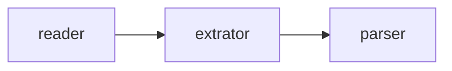

## omni-article-markdown

> - Install/update dependencies: `uv sync`

# AGENTS.md

## Commands

- Install/update dependencies: `uv sync`
- Run the CLI locally:
  - Convert to Markdown: `uv run mdcli https://example.com/article`
  - Read raw HTML: `uv run mdcli read https://example.com/article`
- Format: `uv run ruff format .`
- Lint: `uv run ruff check .`
- Type-check: `uv run mypy`
- Run all tests: `uv run pytest`
- Run one test file: `uv run pytest tests/test_parser.py`
- Run one test case: `uv run pytest tests/test_parser.py::test_codeblock`
- Build distribution artifacts: `uv build`

## Architecture

- `src/omni_article_markdown/cli.py` exposes the `mdcli` entry point. The Click group defaults to `parse`, so `mdcli <url>` runs the full article-to-Markdown pipeline, while `mdcli read <url>` stops after HTML acquisition.
- `OmniArticleMarkdown` in `omni_article_md.py` is the orchestrator. Its flow is fixed: `ReaderFactory` fetches HTML, `ExtractorFactory` turns that HTML into an `Article`, and `HtmlMarkdownParser` converts the cleaned article body into the final Markdown output.
- Reader and extractor discovery is plugin-based. `load_plugins()` imports every subclass under `src/omni_article_markdown/readers/` and `src/omni_article_markdown/extractors/`, so adding a new module in those packages is usually enough; there is no central registry to update.
- Reader selection is `URL -> first matching custom reader -> HtmlReader fallback`, and local files go through `FileReader`. Extractor selection is the same pattern: first matching custom extractor, otherwise `DefaultExtractor`.
- The parser does more than simple tag mapping. `HtmlMarkdownParser` walks the BeautifulSoup tree, resolves relative image URLs against `Article.url`, converts inline/block math, normalizes markdown formatting through `POST_HANDLERS`, and can fetch GitHub Gist contents during parsing.

## Key Conventions

- Always use `uv` commands in this repository. The project targets Python 3.13 and the existing agent guidance assumes `uv run ...` for scripts, tests, and tooling.
- Treat `skills/reader-developer/SKILL.md` and `skills/extractor-developer/SKILL.md` as task-specific playbooks when working on those areas. They document the expected investigation flow for acquiring HTML and for refining site-specific extraction.
- Keep `can_handle()` implementations narrow because factory selection stops at the first match. Readers typically match on URL prefixes; extractors often match on OG/canonical metadata helpers from `utils.py` such as `get_og_*()`, `get_canonical_url()`, and `is_matched_canonical()`.
- Reuse the existing browser stack instead of bootstrapping Playwright manually. `BrowserReader`, `ScrollableBrowserReader`, and `create_stealth_page()` centralize headers, stealth setup, and SSL handling for dynamic sites.
- Prefer the lightest reader that works. The codebase uses plain `requests` via `get_session()` by default and only escalates to Playwright for sites that need rendering, scrolling, cookies, or anti-bot workarounds.
- New extractors usually get the best results by overriding `article_container()` and cleanup predicates before reaching for a fully custom `extract_article()`. Use `pre_handle_soup()` for DOM normalization such as lazy-image fixes or converting non-semantic wrappers into real headings/paragraphs.
- `DefaultExtractor` removes duplicate top-level titles by deleting a matching first `<h1>` from the article body. If title extraction changes, check both the final Markdown heading and the saved filename because `OmniArticleMarkdown.save()` derives filenames from `to_snake_case(title)`.
- The main tests are small unit tests built from inline HTML snippets and the `make_soup` fixture in `tests/conftest.py`, not end-to-end browser tests. Match that style for parser/extractor changes unless the behavior truly depends on live page rendering.
- If you make code changes as part of an agent task, append a log entry to `agents/logs.md` using the `LOG-YYYYMMDD-XXX` format described in `AGENTS.md`.

## 概念

- `reader`: 负责读取目标网页，获得`html`代码
- `extrator`: 负责从`beautifulsoup4`提取正文、标题、摘要等有用内容，排除无用`html`标签
- `parser`: `html`->`markdown`核心转换引擎
- `OmniArticleMarkdown`: 将`readers`、`extrators`和`parser`串联起来的工具

## 自动化工作流示例 (Agent 执行步骤)

- **明确本次任务的角色**：是`reader-developer`、`extractor-developer`还是两者兼有
- **读取角色技能**：在`skills/`目录下找到角色对应的技能
- **进行开发编码工作**，不需要编写测试用例，除非明确要求

---
> Source: [caol64/omni-article-markdown](https://github.com/caol64/omni-article-markdown) — distributed by [TomeVault](https://tomevault.io).
<!-- tomevault:4.0:gemini_md:2026-05-18 -->
