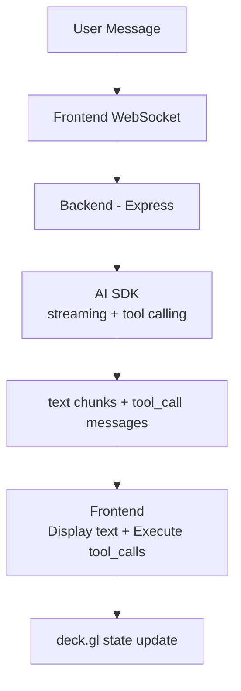

## carto-agentic-deckgl

> This file provides guidance to Claude Code (claude.ai/code) when working with code in this repository.

# CLAUDE.md

This file provides guidance to Claude Code (claude.ai/code) when working with code in this repository.

## Project Overview

AI-powered map control framework using `@carto/agentic-deckgl`. Users interact with a deck.gl map through natural language chat. Messages are processed by an LLM (via multiple AI SDK backends) that generates tool calls executed client-side to manipulate the map.

**Tech Stack:**
- Core Library: `@carto/agentic-deckgl` (TypeScript, Zod, framework-agnostic)
- Backends: Node.js + TypeScript, Express, WebSocket — OpenAI Agents SDK (default), Vercel AI SDK v6, or Google ADK
- Frontends: Angular 20, React 19, Vue 3, Vanilla JS — all with deck.gl, MapLibre GL, CARTO

## Project Structure

```
carto-agentic-deckgl/                        # Root IS the library package
├── src/                                     # Core library source (@carto/agentic-deckgl)
├── test/                                    # Core library tests
├── dist/                                    # Build output (ESM + CJS)
├── docs/                                    # Centralized documentation guides
├── examples/
│   ├── backend/
│   │   ├── openai-agents-sdk/               # Backend server — OpenAI Agents SDK (default)
│   │   ├── vercel-ai-sdk/                   # Backend server — Vercel AI SDK
│   │   └── google-adk/                      # Backend server — Google ADK
│   └── frontend/
│       ├── angular/                         # Angular 20 frontend
│       ├── react/                           # React 19 frontend (+ E2E tests)
│       ├── vue/                             # Vue 3 frontend
│       └── vanilla/                         # Vanilla JS frontend
├── package.json                             # Library package.json
├── rollup.config.js                         # Build config
├── tsconfig.json                            # TypeScript config
└── vitest.config.ts                         # Test config
```

## Development Commands

### Core Library
```bash
npm install
npm run build        # Build ESM + CJS outputs to dist/
npm run dev          # Watch mode
npm run type-check   # Type check without emitting
npm test             # Run unit tests
```

### Backend (OpenAI Agents SDK — default)
```bash
cd examples/backend/openai-agents-sdk
npm run dev          # Start dev server with hot reload (tsx watch, port 3003)
npm run dev:mock-mcp # Start with MCP mock mode (fixture-backed tools)
npm run build        # Compile TypeScript to dist/
npm start            # Run production build
npm run typecheck    # Type check without emitting
```

### Backend (Vercel AI SDK)
```bash
cd examples/backend/vercel-ai-sdk
npm run dev          # Start dev server with hot reload (tsx watch, port 3003)
npm run build        # Compile TypeScript to dist/
npm start            # Run production build
npm run typecheck    # Type check without emitting
```

### Backend (Google ADK)
```bash
cd examples/backend/google-adk
npm install --force  # --force needed for peer dependency conflicts
npm run dev          # Start dev server with hot reload (tsx watch, port 3003)
npm run build        # Compile TypeScript to dist/
npm start            # Run production build
npm run typecheck    # Type check without emitting
```

### Frontend (Angular)
```bash
cd examples/frontend/angular
pnpm install         # Install dependencies
pnpm start           # Start dev server (http://localhost:4200)
pnpm build           # Build for production
```

### Frontend (React)
```bash
cd examples/frontend/react
pnpm install         # Install dependencies
pnpm dev             # Start dev server (http://localhost:5173)
pnpm build           # Build for production
pnpm test            # Run unit tests
```

### E2E Tests (React)
```bash
cd examples/frontend/react
npx playwright install chromium                     # One-time browser install
pnpm e2e                                            # Headless (default: openai-agents-sdk backend)
pnpm e2e:headed                                     # Headed mode (watch in browser)
pnpm e2e:ui                                         # Interactive UI mode
pnpm e2e -- --grep "Counties"                       # Run a single test by name
BACKEND_SDK=vercel-ai-sdk pnpm e2e                  # Run against Vercel AI SDK backend
pnpm e2e:update-snapshots                           # Update screenshot baselines
pnpm e2e:report                                     # View HTML report
pnpm e2e:matrix                                     # Run full model matrix (default backend)
pnpm e2e:matrix --backend vercel-ai-sdk             # Run matrix against Vercel backend
pnpm e2e:matrix --backend openai-agents-sdk --current  # Run matrix with current model
```

### Running the Application

1. Start backend: `cd examples/backend/openai-agents-sdk && npm run dev` (runs on http://localhost:3003)
2. Start frontend: `cd examples/frontend/angular && pnpm start` (http://localhost:4200) or `cd examples/frontend/react && pnpm dev` (http://localhost:5173)

## Architecture

### Communication Flow



### Consolidated Tools (3 frontend-executed tools)

| Tool             | Purpose                                                                                                          |
|------------------|------------------------------------------------------------------------------------------------------------------|
| `set-deck-state` | Navigate (initialViewState), change basemap (mapStyle), add/update/remove layers, widgets, and effects           |
| `set-marker`     | Place, remove, or clear location marker pins at specified coordinates                                            |
| `set-mask-layer` | Editable mask layer for spatial filtering (set geometry or table name, draw mode, or clear). Uses MaskExtension. |

### Key Files — Backend (`examples/backend/<sdk>/src/`)

All three backends share the same directory structure with SDK-specific differences:

- `server.ts` — Express + WebSocket server, session management
- `services/agent-runner.ts` — AI orchestration (Vercel: `streamText`, OpenAI: `Agent` + `run()`, ADK: `LlmAgent` + `InMemoryRunner`)
- `services/conversation-manager.ts` — Per-session conversation history (max 20 messages)
- `agent/providers.ts` — LLM provider configuration (SDK-specific)
- `agent/tools.ts` — Tool aggregation (local + custom + MCP tools)
- `agent/custom-tools.ts` — Backend-only tools (e.g., LDS geocode)
- `agent/mcp-tools.ts` — MCP server integration
- `prompts/system-prompt.ts` — System prompt builder
- `prompts/custom-prompt.ts` — App-specific AI instructions
- `models/carto-litellm.ts` — (Google ADK only) BaseLlm bridge for OpenAI-compatible endpoints

### Key Files — Angular Frontend (`examples/frontend/angular/src/app/`)

**Components:**
- `components/map-view/` — deck.gl + MapLibre map container
- `components/chat-ui/` — Chat interface with markdown rendering
- `components/layer-toggle/` — Layer visibility controls with legend
- `components/zoom-controls/` — Zoom in/out buttons
- `components/snackbar/` — Notification component
- `components/confirmation-dialog/` — Confirmation modal

**Services:**
- `services/agentic-deckgl.service.ts` — Orchestrates WebSocket messages, tool execution, loader state
- `services/deck-map.service.ts` — Creates and manages deck.gl + MapLibre instances
- `services/websocket.service.ts` — WebSocket connection with auto-reconnect
- `services/consolidated-executors.service.ts` — Executes tool calls against DeckStateService

**State & Config:**
- `state/deck-state.service.ts` — Centralized reactive state (viewState, layers, basemap)
- `config/deck-json-config.ts` — JSONConverter setup for deck.gl JSON specs (@@type, @@function, @@=)
- `config/location-pin.config.ts` — Location pin layer spec generator
- `config/semantic-config.ts` — Welcome chips configuration

**Utils:**
- `utils/layer-merge.utils.ts` — Deep merge for layer spec updates
- `utils/legend.utils.ts` — Extract legend data from layer color styling
- `utils/tooltip.utils.ts` — Tooltip content formatting

### WebSocket Message Types

**Client → Server:**
```typescript
{ type: 'chat_message', content: string, timestamp: number, initialState?: InitialState }
{ type: 'tool_result', toolName: string, callId: string, success: boolean, message: string }
```

**Server → Client:**
```typescript
{ type: 'stream_chunk', content: string, messageId: string, isComplete: boolean }
{ type: 'tool_call_start', toolName: string, callId: string }
{ type: 'tool_call', toolName: string, data: object, callId: string }
{ type: 'mcp_tool_result', toolName: string, result: unknown, callId: string }
{ type: 'error', content: string, code?: string }
```

### deck.gl JSON Spec Pattern

The AI generates JSON specs using special prefixes resolved by JSONConverter:
- `@@type` — Layer class (e.g., `VectorTileLayer`, `H3TileLayer`)
- `@@function` — Data source or styling function (e.g., `vectorTableSource`, `colorBins`)
- `@@=` — Accessor expression (e.g., `@@=properties.population`)
- `@@#` — Constant reference (e.g., `@@#Red`, `@@#FlyToInterpolator`)

## Environment Variables

### Backend (`examples/backend/<sdk>/.env`)

All three backends use the same environment variables:

```
CARTO_AI_API_BASE_URL=https://...    # Required: LLM API endpoint
CARTO_AI_API_KEY=your-key            # Required: LLM API key
CARTO_AI_API_MODEL=gpt-4o            # Optional: defaults to gpt-4o
PORT=3003                            # Optional: defaults to 3003
CARTO_MCP_URL=https://...            # Optional: MCP server URL
CARTO_MCP_API_KEY=your-key           # Optional: MCP API key
MCP_WHITELIST_CARTO=tool1,tool2      # Optional: comma-separated MCP tool whitelist
CARTO_LDS_API_BASE_URL=https://...   # Optional: LDS geocoding endpoint
CARTO_LDS_API_KEY=your-key           # Optional: LDS API key
MCP_MOCK_MODE=true                   # Optional: use fixture-backed MCP tools (for testing)
```

### Frontend — Angular (`examples/frontend/angular/src/environments/environment.ts`)
```typescript
export const environment = {
  production: false,
  apiBaseUrl: 'https://gcp-us-east1.api.carto.com',
  accessToken: 'YOUR_CARTO_TOKEN',
  connectionName: 'carto_dw',
  wsUrl: 'ws://localhost:3003/ws',
  httpApiUrl: 'http://localhost:3003/api/chat',
  useHttp: false,
};
```

### Frontend — React (`examples/frontend/react/.env`)
```
VITE_API_BASE_URL=https://gcp-us-east1.api.carto.com
VITE_API_ACCESS_TOKEN=YOUR_CARTO_TOKEN
VITE_CONNECTION_NAME=carto_dw
VITE_WS_URL=ws://localhost:3003/ws
VITE_HTTP_API_URL=http://localhost:3003/api/chat
VITE_USE_HTTP=false
```

---
> Source: [CartoDB/carto-agentic-deckgl](https://github.com/CartoDB/carto-agentic-deckgl) — distributed by [TomeVault](https://tomevault.io).
<!-- tomevault:4.0:gemini_md:2026-05-26 -->
