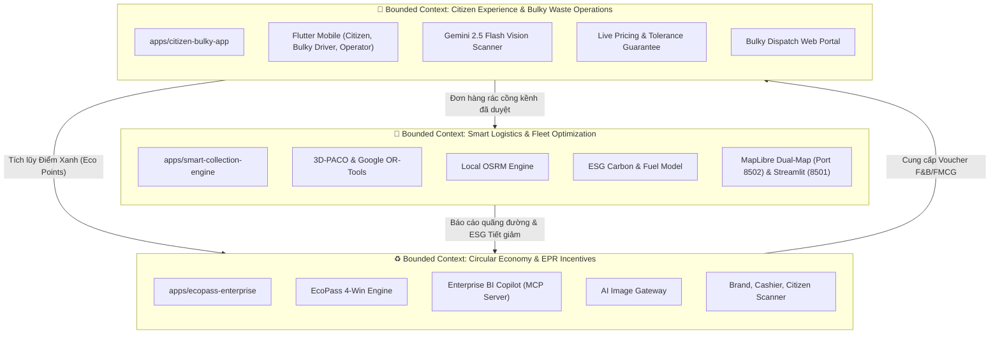

## nan-econet

> > Tài liệu này được biên soạn đặc biệt cho các AI Coding Agents (Claude, Gemini, Cursor, Copilot, Antigravity, Devin, v.v.) khi đọc hiểu, định hướng, phân tích và thực hiện sửa đổi mã nguồn trong Monorepo **NaN-EcoNet**.

# AGENTS.md — Hướng Dẫn Kỹ Thuật Dành Cho AI Coding Agents

> Tài liệu này được biên soạn đặc biệt cho các AI Coding Agents (Claude, Gemini, Cursor, Copilot, Antigravity, Devin, v.v.) khi đọc hiểu, định hướng, phân tích và thực hiện sửa đổi mã nguồn trong Monorepo **NaN-EcoNet**.

---

## 🧭 1. Bản Đồ Ngữ Cảnh Bounded Contexts (Domain-Driven Design)

Toàn bộ hệ thống NaN-EcoNet được kiến trúc theo phương pháp Domain-Driven Design (DDD), phân tách rành mạch thành 3 Bounded Contexts tương ứng với 3 thư mục trong `apps/`:

### 1.1. `apps/smart-collection-engine` (Logistics & Routing Context)
* **Trách nhiệm cốt lõi**: Giải quyết bài toán định tuyến phương tiện có tải trọng và khung thời gian (CVRPTW) cho các đội xe thu gom rác đô thị.
* **Thành phần**:
  * `src/`: Thuật toán 3D-PACO (Parallel Ant Colony Optimization) viết bằng C++ và Python, tích hợp Google OR-Tools CVRPTW solver.
  * `backend/`: FastAPI cung cấp REST API giải bài toán VRP, nhận danh sách trạm/điểm thu gom, trả về lộ trình tối ưu và ma trận OSRM.
  * `streamlit/`: Bảng điều khiển phân tích thông số thuật toán, đồ thị hội tụ và mô hình tính toán tiết giảm phát thải CO2, tiết kiệm dầu Diesel.
  * `map_ui/`: Giao diện bản đồ số MapLibre GL thời gian thực, mô phỏng xe chạy, hỗ trợ so sánh đối đầu (Dual-Map) giữa PACO và OR-Tools.

### 1.2. `apps/ecopass-enterprise` (Circular Economy & Commercial Context)
* **Trách nhiệm cốt lõi**: Tạo động lực kinh tế tuần hoàn liên kết 4 bên (Citizen, FMCG Brand, Merchant Store, Recycler) theo chuẩn trách nhiệm mở rộng của nhà sản xuất (EPR).
* **Thành phần**:
  * `ecopass/`: Hệ thống các Web Portal (Next.js, Django, SQLite):
    * `client-scanner` (Port 3011): Quét tem QR nhiệt 1-Time Burn từ thùng rác, trả lời khảo sát và nhận voucher.
    * `brand-portal` (Port 3009): Doanh nghiệp tài trợ ngân sách xanh, cấu hình chiến dịch voucher và theo dõi báo cáo EPR.
    * `cashier-pos` (Port 3010): Điểm bán lẻ/quán nước quét hủy voucher khi cư dân đổi quà.
  * `enterprise-bi-copilot/`: Triển khai giao thức **Model Context Protocol (MCP)** kết nối CopilotKit để hỗ trợ truy vấn báo cáo tài chính, tỷ lệ đổi quà (Redemption Rate) và phân tích dữ liệu rác thải bằng ngôn ngữ tự nhiên.
  * `agy-image-gateway/`: Proxy backend FastAPI điều phối sinh ảnh và phân tích thị giác AI.
  * `awesome-gpt-image-2/`: Studio thiết kế prompt phong cách công nghiệp cho chiến dịch truyền thông xanh.

### 1.3. `apps/citizen-bulky-app` (Citizen Portal & Bulky Operations Context)
* **Trách nhiệm cốt lõi**: Giải quyết triệt để vấn đề rác thải cồng kềnh (sofa, nệm, tủ gỗ, phế thải xây dựng) vốn không thể thu gom bằng xe ép rác thông thường.
* **Thành phần**:
  * `mobile/`: Ứng dụng di động Flutter phân quyền vai trò (Role-Based Access Control - RBAC):
    * *Cư dân (Citizen)*: Quét camera AI nhận diện đồ vật, chọn quy trình 3 bước Request Wizard, nhận báo giá tức thì, giữ chỗ cọc 15 phút và đổi voucher quà tặng.
    * *Tài xế cồng kềnh (Bulky Driver)*: Xem lộ trình ca làm việc chuyên dụng cho xe tải cồng kềnh, điều hướng bản đồ, lập biên bản sai lệch hiện trường (Discrepancy Report).
    * *Điều phối viên (Operator)*: Giám sát tải trọng, duyệt giá cước chính xác và phân công chuyến xe.
  * Camera AI: Tích hợp Gemini 2.5 Flash Vision Scanner vẽ Bounding Box, đo đạc kích thước và phân loại chất liệu.

---

## 📖 2. Bảng Thuật Ngữ Nghiệp Vụ (Domain Ontology & Glossary)

Khi sinh mã hoặc trao đổi kỹ thuật, AI Agent **bắt buộc** sử dụng chính xác các thuật ngữ miền chuẩn sau:

| Thuật Ngữ Miền | Khái Niệm & Định Nghĩa Kỹ Thuật | Phạm Vi Sử Dụng |
|---|---|---|
| **Bulky Waste** (Rác cồng kềnh) | Đồ phế thải có kích thước hoặc trọng lượng vượt ngưỡng thu gom thông thường (sofa, nệm, tủ, bàn ghế, thiết bị gia dụng cỡ lớn). | `citizen-bulky-app` |
| **Bulky Driver** vs **Regular Driver** | **Bắt buộc phân biệt tách rời**: Bulky Driver điều khiển xe tải cồng kềnh chuyên dụng, có thiết bị bốc xếp; Regular Driver điều khiển xe ép rác tuyến phố thông thường. | `citizen-bulky-app`, `smart-collection-engine` |
| **Tolerance Guarantee** | Chính sách bảo hiểm cam kết sai số chi phí thực tế tại hiện trường không vượt quá $\le \pm 10\%$ so với mức báo giá sơ bộ từ AI Vision. | `citizen-bulky-app` |
| **Request Wizard (3 Steps)** | Quy trình 3 bước tạo đơn thu gom cồng kềnh: (1) Danh mục vật tư & AI Scan, (2) Khảo sát hiện trường & Tháo dỡ/Tầng lầu, (3) Xác nhận & Báo giá. | `citizen-bulky-app/mobile` |
| **Slot Countdown Timer** | Đồng hồ đếm ngược 15 phút giữ chỗ slot xe cồng kềnh trong thời gian người dùng thanh toán tiền cọc. | `citizen-bulky-app/mobile` |
| **CVRPTW** | Capacitated Vehicle Routing Problem with Time Windows — Bài toán tối ưu hóa tuyến đường xe có tải trọng tối đa và khung giờ phục vụ bắt buộc. | `smart-collection-engine` |
| **3D-PACO** | Parallel Ant Colony Optimization đa chiều — Thuật toán bầy kiến song song tối ưu hóa đa mục tiêu (quãng đường, thời gian, tải trọng). | `smart-collection-engine` |
| **Local OSRM** | Máy chủ Open Source Routing Machine chạy offline cục bộ, dùng bản đồ OSM sạch, cung cấp ma trận khoảng cách thời gian thực. | `smart-collection-engine` |
| **Dual-Map View** | Giao diện hiển thị đối đầu song song lộ trình giữa PACO và OR-Tools để so sánh hiệu năng và quãng đường. | `smart-collection-engine/map_ui` |
| **4-Win Model** | Mô hình liên kết kinh tế 4 bên: Cư dân (nhận voucher) - Nhãn hàng (đạt chỉ tiêu ESG/EPR) - Điểm bán (tăng doanh thu từ voucher) - Đơn vị tái chế (thu gom nguyên liệu sạch). | `ecopass-enterprise` |
| **1-Time Burn QR** | Tem mã QR in nhiệt từ trạm tái chế, chỉ có giá trị quét đổi điểm 1 lần duy nhất, kết hợp xác thực tọa độ GPS chống gian lận. | `ecopass-enterprise/ecopass` |
| **MCP Server (Model Context Protocol)** | Giao thức tiêu chuẩn cung cấp Context, Tools và Resources cho AI LLMs truy vấn dữ liệu BI thời gian thực. | `ecopass-enterprise/enterprise-bi-copilot` |
| **EPR Compliance** | Tuân thủ Trách nhiệm Mở rộng của Nhà sản xuất (Extended Producer Responsibility) theo Luật Bảo vệ Môi trường Việt Nam. | `ecopass-enterprise` |

---

## 🔗 3. Ranh Giới Giao Tiếp API (API Boundaries & Contracts)

### 3.1. Giao Thức Liên Phân Hệ (Inter-Service Protocols)
* **VRP Solver API (`smart-collection-engine/backend` - Port 8000)**:
  * `POST /api/v1/solve/cvrptw`: Nhận mảng tọa độ điểm gom, tải trọng xe, khung thời gian. Trả về mảng lộ trình xe, tổng quãng đường (km), thời gian và chỉ số CO2 tiết giảm.
  * `GET /api/v1/health`: Kiểm tra trạng thái sẵn sàng của Solver và OSRM engine.
* **AI Vision Scanner Proxy (`citizen-bulky-app` & `agy-image-gateway`)**:
  * Gửi ảnh nén JPEG/WebP (Max 4MB) lên Gemini 2.5 Flash Endpoint với structured output JSON chứa: `labels`, `bounding_boxes` (ymin, xmin, ymax, xmax), `estimated_dimensions` (length, width, height tính bằng cm), và `material_type`.
* **Model Context Protocol (`enterprise-bi-copilot/apps/agent-server`)**:
  * Sử dụng giao thức MCP qua SSE (Server-Sent Events) hoặc Stdio.
  * Cung cấp các MCP Tools: `query_voucher_redemptions`, `get_epr_compliance_stats`, `calculate_brand_roi`, `fetch_fleet_esg_summary`.

---

## 🛡️ 4. Quy Tắc Bảo Tồn Mã Nguồn Bắt Buộc (Code Preservation Rules)

AI Agent khi làm việc trong kho mã nguồn này **TUYỆT ĐỐI TUÂN THỦ** các nguyên tắc bất di bất dịch sau:

1. **Bảo Tồn Thuật Toán Lõi Tối Ưu (Core Algorithm Integrity)**:
   * Tuyệt đối không tự ý xóa, thay thế hoặc viết lại các thuật toán lõi tại `apps/smart-collection-engine/src` (3D-PACO, OR-Tools CVRPTW solver, C++ bindings, OSRM matrix calculator) trừ khi có yêu cầu tối ưu hiệu năng cụ thể kèm benchmark đối chứng.
2. **Tuân Thủ Tuyệt Đối Về Chủ Quyền Bản Đồ & Dữ Liệu Địa Lý**:
   * Toàn bộ mã nguồn bản đồ (MapLibre GL, Leaflet, Folium) chỉ được sử dụng tile server chuẩn, trung lập (OpenStreetMap, CartoDB Positron, OSRM local).
   * **CẤM** sử dụng bất kỳ tile server hoặc dữ liệu bản đồ nào chứa đường lưỡi bò hoặc thông tin vi phạm chủ quyền lãnh thổ Việt Nam.
3. **Bảo Tồn Tính Độc Lập Của Luồng Xe Rác Cồng Kềnh**:
   * Không được gộp logic của `Bulky Driver` vào đội xe rác thông thường. Hai phân hệ này có quy trình vận hành, loại xe, thời gian biểu và cách tính chi phí hoàn toàn khác biệt.
4. **An Toàn Khóa Bí Mật & Môi Trường**:
   * Không bao giờ ghi cứng (hardcode) API Keys, JWT Secrets, Database Passwords vào code.
   * Luôn sử dụng biến môi trường thông qua tệp cấu hình chuẩn hoặc cấu trúc cấu hình tập trung.
5. **Giữ Vững Hợp Đồng Dữ Liệu (API Contract Stability)**:
   * Mọi sửa đổi backend phải duy trì tính tương thích ngược (Backward Compatibility) với các frontend hiện tại (Flutter Mobile App, Map UI, Streamlit Dashboard, EcoPass Portals).

---

> Khi nghi ngờ hoặc gặp mâu thuẫn về yêu cầu nghiệp vụ, hãy ưu tiên tham khảo các hồ sơ quyết định kiến trúc tại [docs/adr/](docs/adr/) trước khi đưa ra quyết định thay đổi mã nguồn.

---
> Source: [chinhanxt/NaN-EcoNet](https://github.com/chinhanxt/NaN-EcoNet) — distributed by [TomeVault](https://tomevault.io).
<!-- tomevault:4.0:gemini_md:2026-09-26 -->
