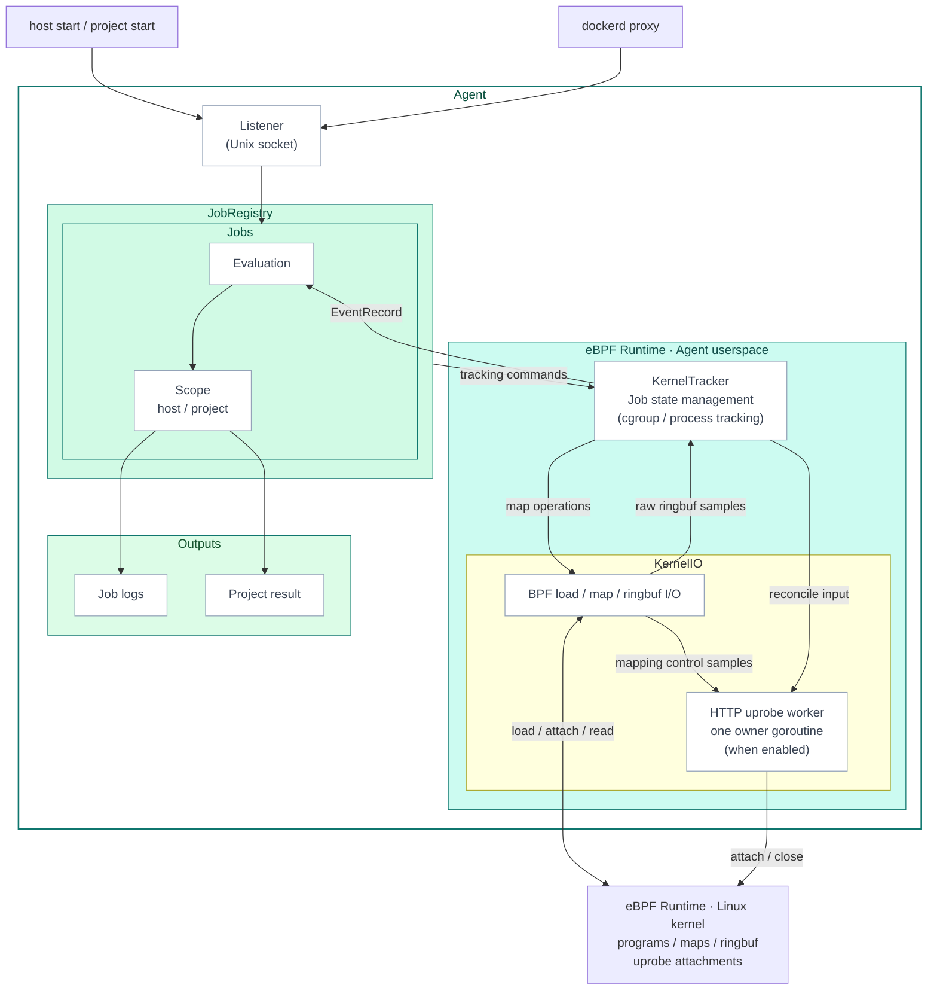

## cicd-sensor

> The Agent is the central component that connects CI/CD job lifecycle with runtime events.

# Agent Architecture

The Agent is the central component that connects CI/CD job lifecycle with runtime events.

One agent process runs on one host and can observe multiple CI/CD jobs at the same time.
Kernel-side observation is handled with eBPF. Job lifecycle and rule evaluation are handled in userspace.

## Architecture

This diagram is the reference point for reading the Agent implementation.
`host start`, `project start`, and dockerd proxy staging requests enter the Agent through the Listener over a Unix socket.
JobRegistry issues tracking commands to KernelTracker.
Scope owns rule, summary, and output state, but it does not operate
KernelTracker or KernelIO directly. Together with the programs and resources
loaded into the Linux kernel, KernelTracker and KernelIO form the
**eBPF Runtime** described in the dedicated developer-guide chapter. eBPF
Runtime is an architectural layer, not a separate process or Go component.

## Concepts

### Job

A **Job** is one CI/CD job tracked by the Agent. It is identified by the provider-supplied job identity (repository, workflow run, job name, runner) and owns its own cgroup tracking, rule evaluation, scope-local summaries, and outputs. The Agent can run many Jobs at the same time; each Job is finalized independently when its work completes.

The Agent separates job identity from job metadata.
Identity is required to register and track a Job.
Metadata is attached to the Job for logs, reports, and search.

| Category | Fields | Required | Purpose |
| --- | --- | --- | --- |
| Job identity | `provider`, `provider_host`, `project_path` | Yes | Common provider identity for every Job |
| GitHub identity | `github_run_id`, `github_job`, `github_run_attempt`, `github_runner_tracking_id` | Yes for GitHub Jobs | Identifies a GitHub Actions job run attempt and runner tracking ID |
| GitLab identity | `gitlab_job_id` | Yes for GitLab Jobs | Identifies a GitLab CI job execution |
| Job metadata | `commit_sha`, `ref_name`, `trigger`, `actor_id`, `actor_name`, `github_workflow_ref`, `github_workflow_sha`, `github_workflow`, `gitlab_job_name`, `gitlab_config_ref_uri` | No | Enriches logs, reports, and triage |

### Scope

A **Scope** is the configuration / control surface attached to a Job. Two kinds exist, and a single Job may have one or both:

| Scope | Owner | Where it comes from | Typical setup |
| --- | --- | --- | --- |
| **Host scope** | Host operator (e.g., the platform team that installs cicd-sensor on the runner host) | `host start` from a runner hook | Self-hosted runners, where the agent is provisioned by infrastructure |
| **Project scope** | Project / repository operator (e.g., the team owning the workflow) | `project start` from the cicd-sensor-action (or equivalent) | GitHub-hosted runners, where each workflow brings its own configuration through the Action |

Each scope carries its own rules, evaluation state, and output destinations. The two are isolated: one scope cannot read or override the other's rules, and their outputs are emitted separately. This lets the host operator and the repository operator each configure cicd-sensor for their own concerns without interfering with each other — the host operator can enforce a baseline across all jobs on the host, while a repository can layer project-specific rules on top.

For implementation ownership boundaries, see [Agent Ownership Boundaries](agent-ownership-boundaries.md).

## Subsystems

| Subsystem | Responsibility |
| --- | --- |
| Agent | Top-level orchestrator for Listener, JobRegistry, KernelTracker, and shutdown |
| Listener | Receives start / staging requests over the Unix socket and handles provider routes and peer credentials |
| JobRegistry | Handles job registration, host / project scope attachment, KernelTracker primitive composition, and finalize |
| Jobs / Scope | Handles per-job event workers, rule evaluation, and scope-local summaries / outputs |
| KernelTracker | Owns cgroup / process tracking, kernel sample decoding, and EventRecord attribution |
| KernelIO | Owns BPF load and attach, map operations, ringbuf I/O, and specialized kernel-facing workers |
| Outputs | Holds runtime summaries used as inputs for job logs, project results, reports, and attestations |

## Provider Flow

| Provider | Runner | Start entrypoint | cgroup seed |
| --- | --- | --- | --- |
| GitHub Actions | GitHub-hosted runner | `/v1/github/project/start` | cgroup of the project start peer PID |
| GitHub Actions | Self-hosted runner on a machine | `/v1/github/host/start` | cgroup of the hook peer PID |
| GitLab CI/CD | GitLab Runner Docker executor | `/v1/gitlab/staging/put` | Docker label evidence and staging promote |
| GitHub Actions | ARC default / dind mode | `/v1/github/k8s/start` | cgroup of the job hook peer PID; dind also binds the Pod cgroup tree |
| GitHub Actions | ARC Kubernetes mode | `/v1/github/k8s/start` + `/v1/github/k8s/staging/put` | job hook peer PID plus NRI-provided container cgroup basenames |
| GitLab CI/CD | GitLab Runner Kubernetes executor | `/v1/gitlab/k8s/staging/put` | GitLab Pod metadata and NRI-provided container cgroup basenames |

The agent process selects one provider at startup.
The Listener mounts either `/v1/github/*` or `/v1/gitlab/*`, not both.
Kubernetes runtime details are covered in [Kubernetes Runtime](kubernetes-runtime.md).

## Listener endpoints

These endpoints are internal Agent APIs over Unix sockets. They are not a public network API.

The normal agent control socket exposes the provider route family selected at agent startup:

| Provider | Endpoint | Caller | Purpose |
| --- | --- | --- | --- |
| GitHub | `/v1/github/job/health` | GitHub job hook / action | Check whether the caller belongs to a tracked Job. |
| GitHub | `/v1/github/host/start` | installed runner hook | Create or attach host scope for a machine runner Job. |
| GitHub | `/v1/github/host/end` | installed runner hook | End host scope for a machine runner Job. |
| GitHub | `/v1/github/project/start` | project action | Create or attach project scope for a Job. |
| GitHub | `/v1/github/project/result` | project action | Read project result data for reports and attestations. |
| GitHub | `/v1/github/staging/put` | Docker proxy | Stage Docker-created container cgroup basenames by peer PID. |
| GitHub | `/v1/github/k8s/staging/put` | host-side NRI observer | Stage Kubernetes-created container cgroup basenames by injected GitHub identity. |
| GitLab | `/v1/gitlab/host/start` | explicit host start caller | Create GitLab host Job state from runner metadata. |
| GitLab | `/v1/gitlab/staging/put` | Docker proxy | Create missing GitLab Jobs from runner labels, then stage Docker-created container cgroup basenames. |
| GitLab | `/v1/gitlab/k8s/staging/put` | host-side NRI observer | Create missing GitLab Kubernetes Jobs from cached host config, then stage container cgroup basenames. |

GitLab Docker proxy and Kubernetes/NRI staging both perform lazy Job creation inside their staging endpoint.
This keeps container lifecycle callers to one local agent request and leaves Job creation ownership with the Listener.

GitHub ARC also uses a separate runner socket mounted into the runner container:

| Endpoint | Caller | Purpose |
| --- | --- | --- |
| `/v1/github/k8s/start` | GitHub ARC job hook | Create the Job from GitHub identity and bind the runner or Pod cgroup before workflow steps run. |

## Listener trust model

A CI/CD job process typically has host-control-level permissions on the runner. Isolation between jobs comes from the layer below — a fresh VM per job for self-hosted runners, a fresh container for Kubernetes-based runners. cicd-sensor treats the runner host as a single trust domain inside that boundary.

The Listener's per-request checks identify which Job (and which UID) the request belongs to, and keep each Job's events and configuration from being attributed to another Job. They are not a strong access control.

The control socket is mode `0o777`; request identification uses `SO_PEERCRED`:

| Check | Endpoints | What it confirms |
| --- | --- | --- |
| Agent-owner UID | GitLab `host/start`, GitHub / GitLab staging endpoints | peer UID matches the agent process owner |
| Peer in tracked Job | GitHub `host/end`, `project/result`, `job/health` | peer PID's cgroup is in an already-tracked Job |
| Seed | GitHub `host/start`, GitHub `k8s/start` | peer's cgroup becomes the new Job's tracked root |

GitHub `project/start` is the mixed case: on a self-hosted runner the peer must already belong to the host Job (it attaches project scope); on a hosted runner no prior Job exists, so the peer's cgroup seeds a new project-only Job. Co-resident untrusted local users are out of scope.

Endpoints reachable from inside the job may only accelerate log delivery (`project/result` flushes buffered manager logs); finalization stays with triggers the job cannot forge: cgroup lifecycle, the completed hook, TTL, and shutdown. For `host end`, the CLI's `job/health` probe before the end call is what makes a double end fail the completed hook — the agent-side handler is lenient on a missing Job.

Kubernetes support keeps the GitHub k8s start endpoint on a separate runner socket because the caller is inside the ARC runner container, while the normal control socket and NRI staging callers are host-side agent components.
This keeps the container-visible surface to job start only and preserves the boundary between runner container code and host-side staging / runtime control.
The same runner socket may later carry GitHub Kubernetes project start/result endpoints, but the normal agent control socket should not be mounted into workflow containers.

In ARC default and dind modes, workflow code runs in the runner container and can reach the runner socket.
The request identity is caller-asserted, but the peer cgroup is still the guard: if that cgroup is already tracked for another Job, start is rejected and the partial Job is unwound.
An untracked peer cgroup can still assert a new identity, so Kubernetes runner job records are runner-asserted, not independently verified.

## KernelTracker Primitives

Job tracking is expressed by JobRegistry composing KernelTracker primitives.

| Primitive | Meaning |
| --- | --- |
| `RegisterJob(jobID)` | Creates userspace job state and a per-job event channel. Does not touch BPF maps. |
| `BindProcessCgroupToJob(jobID, pid)` | Resolves the PID cgroup and adds it to `tracked_cgroups`. |
| `StageCgroupBasenameForJob(basename, jobID)` | Stages a Docker cgroup basename. |
| `RemoveJob(jobID)` | Cleans up job state, cgroup bindings, staging entries, and process context. |

`RegisterJob` and cgroup binding are separate operations.
GitHub can resolve the cgroup from the peer PID at start time, so it uses `RegisterJob + BindProcessCgroupToJob`.
GitLab Docker executor registers a job from label identity evidence and waits for a later staging promote.

The per-job event channel is bounded. KernelTracker owns delivery-pressure handling before events reach Job rule evaluation, including repeated `file_open` suppression and delivery diagnostics. See [EventRecord delivery pressure](ebpf-runtime.md#eventrecord-delivery-pressure).

## Design Notes

- Job membership is determined by cgroup tracking. Process context is a fat node snapshot with `exec_path` / `argv` / `ancestors`; it is not used as the job boundary.
- KernelTracker state is owned exclusively by its loop goroutine. `jobTrackingState` is not published externally.
- Listener stays as the delivery layer. Provider differences are contained in handlers and JobRegistry primitive composition.
- Output runtime is scope-local. Host / project output queues are not hoisted into JobRegistry.
- JobRegistry owns lifecycle. It is not on the hot path for event routing.

For kernel-side observation details, see [eBPF Runtime](ebpf-runtime.md).
For Agent implementation ownership rules, see [Agent Ownership Boundaries](agent-ownership-boundaries.md).
For the rule authoring surface, see [Rules](../user-guide/rules.md).
For the rule implementation, see [Rule Engine](rule-engine.md).

---
> Source: [cicd-sensor/cicd-sensor](https://github.com/cicd-sensor/cicd-sensor) — distributed by [TomeVault](https://tomevault.io).
<!-- tomevault:4.0:gemini_md:2026-09-26 -->
