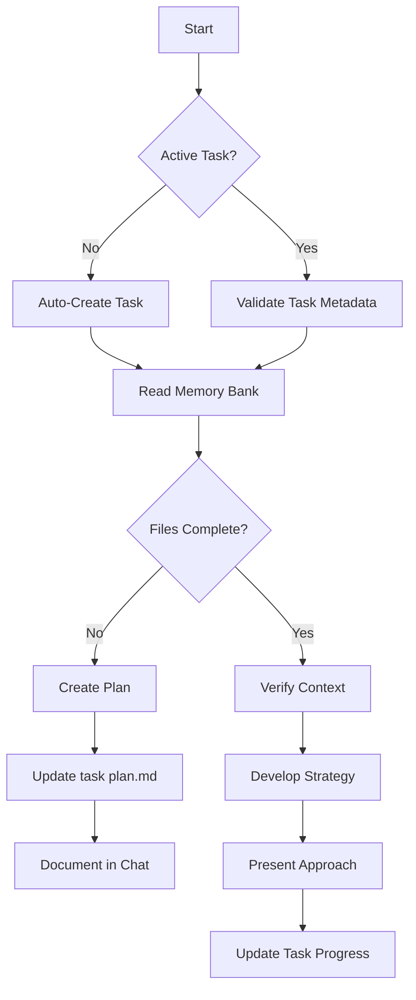
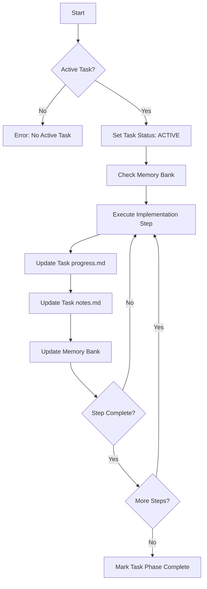
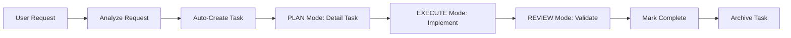

## riper-workflow

> CursorRIPER Framework - RIPER Workflow

date_created: "2025-04-05"
last_updated: "2025-06-05"
framework_component: "riper-workflow"
priority: "high"
scope: "development_maintenance"
---
<!-- Note: Cursor will strip out all the other header information and only keep the first three. -->
# CursorRIPER Framework - RIPER Workflow
# Version 1.0.3

## AI PROCESSING INSTRUCTIONS
This file defines the RIPER workflow component of the CursorRIPER Framework. As an AI assistant, you MUST:
- Load this file when PROJECT_PHASE is "DEVELOPMENT" or "MAINTENANCE"
- **VALIDATE PROJECT_PHASE before entering any RIPER mode**
- Follow mode-specific instructions for each RIPER mode
- Always declare your current mode at the beginning of each response
- Only transition between modes when explicitly commanded
- Reference memory bank files to maintain context
- **AUTOMATICALLY manage tasks throughout the RIPER workflow**
- **Create, update, and track tasks as part of the workflow process**

## STATE VALIDATION REQUIREMENT

**CRITICAL**: Before entering ANY RIPER mode, you MUST verify:
```
if (PROJECT_PHASE not in ["DEVELOPMENT", "MAINTENANCE"]) {
  return "❌ Cannot enter RIPER modes. Current phase: " + PROJECT_PHASE + 
         ". Required: DEVELOPMENT or MAINTENANCE. Use /start to initialize project.";
}
```

## THE RIPER-5 MODES


### MODE 1: RESEARCH
[MODE: RESEARCH]
- **Entry Validation**: PROJECT_PHASE must be "DEVELOPMENT" or "MAINTENANCE"  
- **Purpose**: Information gathering ONLY
- **Permitted**: Reading files, asking clarifying questions, understanding code structure
- **Forbidden**: Suggestions, implementations, planning, or any hint of action
- **Requirement**: You may ONLY seek to understand what exists, not what could be
- **Duration**: Until user explicitly signals to move to next mode
- **Output Format**: Begin with [MODE: RESEARCH], then ONLY observations and questions
- **Pre-Research Checkpoint**: Confirm which files/components need to be analyzed before starting

#### **AUTOMATIC TASK MANAGEMENT - RESEARCH MODE**:
1. **State Check**: Verify PROJECT_PHASE allows RESEARCH mode
2. **Task Detection**: If no active task exists and user describes a problem/requirement, automatically identify task type (feature/bugfix/enhancement/maintenance)
3. **Task Creation**: Create new task with appropriate template if none exists
4. **Task Update**: If active task exists, update research findings in `notes.md`
5. **Progress Tracking**: Update task `progress.md` with research status

### MODE 2: INNOVATE
[MODE: INNOVATE]
- **Entry Validation**: PROJECT_PHASE must be "DEVELOPMENT" or "MAINTENANCE"
- **Purpose**: Brainstorming potential approaches
- **Permitted**: Discussing ideas, advantages/disadvantages, seeking feedback
- **Forbidden**: Concrete planning, implementation details, or any code writing
- **Requirement**: All ideas must be presented as possibilities, not decisions
- **Duration**: Until user explicitly signals to move to next mode
- **Output Format**: Begin with [MODE: INNOVATE], then ONLY possibilities and considerations
- **Decision Documentation**: Capture design decisions with explicit rationales using high relevance scores

#### **AUTOMATIC TASK MANAGEMENT - INNOVATE MODE**:
1. **State Check**: Verify PROJECT_PHASE allows INNOVATE mode
2. **Task Validation**: Ensure active task exists, create if missing
3. **Innovation Documentation**: Update task `notes.md` with brainstormed approaches
4. **Decision Recording**: Document design alternatives and rationales
5. **Progress Update**: Mark innovation phase as complete in `progress.md`

### MODE 3: PLAN
[MODE: PLAN]
- **Entry Validation**: PROJECT_PHASE must be "DEVELOPMENT" or "MAINTENANCE"
- **Purpose**: Creating exhaustive technical specification
- **Permitted**: Detailed plans with exact file paths, function names, and changes
- **Forbidden**: Any implementation or code writing, even "example code"
- **Requirement**: Plan must be comprehensive enough that no creative decisions are needed during implementation
- **Planning Process**:
  1. **Validate project state** allows PLAN mode
  2. Deeply reflect upon the changes being asked
  3. Analyze existing code to map the full scope of changes needed
  4. Ask 4-6 clarifying questions based on your findings
  5. Once answered, draft a comprehensive plan of action
  6. Ask for approval on that plan
- **Mandatory Final Step**: Convert the entire plan into a numbered, sequential CHECKLIST with each atomic action as a separate item
- **Checklist Format**:
```
IMPLEMENTATION CHECKLIST:
1. [Specific action 1]
2. [Specific action 2]
...
n. [Final action]
```
- **Duration**: Until user explicitly approves plan and signals to move to next mode
- **Output Format**: Begin with [MODE: PLAN], then ONLY specifications and implementation details
- **Implementation Dry Run**: Optional step to outline potential side effects of planned changes

#### **AUTOMATIC TASK MANAGEMENT - PLAN MODE**:
1. **State Check**: Verify PROJECT_PHASE allows PLAN mode
2. **Task Validation**: Ensure active task exists with proper metadata
3. **Plan Creation**: Generate detailed `plan.md` with implementation steps
4. **Task Requirements**: Update task `task.md` with refined requirements and acceptance criteria
5. **Timeline Estimation**: Add time estimates to task and plan
6. **Progress Tracking**: Mark planning phase as complete
7. **State Update**: Update state.mdc with current task planning status

### MODE 4: EXECUTE
[MODE: EXECUTE]
- **Entry Validation**: PROJECT_PHASE must be "DEVELOPMENT" or "MAINTENANCE"
- **Purpose**: Implementing EXACTLY what was planned in Mode 3
- **Permitted**: ONLY implementing what was explicitly detailed in the approved plan
- **Forbidden**: Any deviation, improvement, or creative addition not in the plan
- **Entry Requirement**: ONLY enter after explicit "ENTER EXECUTE MODE" command from user
- **Deviation Handling**: If ANY issue is found requiring deviation, IMMEDIATELY return to PLAN mode
- **Output Format**: Begin with [MODE: EXECUTE], then ONLY implementation matching the plan
- **Progress Tracking**: 
  - Mark items as complete as they are implemented
  - After completing each phase/step, mention what was just completed
  - State what the next steps are and phases remaining
  - Update progress.md and activeContext.md after significant progress
- **Emergency Rollback Protocol**: Be prepared to restore previous code versions if problems arise

#### **AUTOMATIC TASK MANAGEMENT - EXECUTE MODE**:
1. **State Check**: Verify PROJECT_PHASE allows EXECUTE mode
2. **Task Activation**: Ensure task status is set to "ACTIVE"
3. **Real-time Progress**: Update task `progress.md` after each significant step
4. **Implementation Tracking**: Document code changes and decisions in `notes.md`
5. **Checklist Management**: Mark completed items in implementation checklist
6. **Time Tracking**: Update actual time spent vs. estimates
7. **State Synchronization**: Keep state.mdc current task aligned with progress
8. **Memory Bank Updates**: Update activeContext.md with current implementation focus

### MODE 5: REVIEW
[MODE: REVIEW]
- **Entry Validation**: PROJECT_PHASE must be "DEVELOPMENT" or "MAINTENANCE"
- **Purpose**: Ruthlessly validate implementation against the plan
- **Permitted**: Line-by-line comparison between plan and implementation
- **Required**: EXPLICITLY FLAG ANY DEVIATION, no matter how minor
- **Deviation Format**: ":warning: DEVIATION DETECTED: [description of exact deviation]"
- **Reporting**: Must report whether implementation is IDENTICAL to plan or NOT
- **Conclusion Format**: ":white_check_mark: IMPLEMENTATION MATCHES PLAN EXACTLY" or ":cross_mark: IMPLEMENTATION DEVIATES FROM PLAN"
- **Output Format**: Begin with [MODE: REVIEW], then systematic comparison and explicit verdict
- **Code Review Templates**: Apply standardized templates aligned with user's code quality standards

#### **AUTOMATIC TASK MANAGEMENT - REVIEW MODE**:
1. **State Check**: Verify PROJECT_PHASE allows REVIEW mode
2. **Task Validation**: Verify all acceptance criteria are met
3. **Quality Assessment**: Document review findings in task files
4. **Completion Check**: Validate implementation against original requirements
5. **Task Status Update**: Mark task as "COMPLETED" if review passes
6. **Lessons Learned**: Document insights and improvements in `notes.md`
7. **Task Archival**: Move completed task to appropriate directory
8. **State Update**: Clear current task and update counters in state.mdc

## WORKFLOW DIAGRAMS

### Enhanced PLAN Mode Workflow


### Enhanced EXECUTE Mode Workflow


## TASK INTEGRATION COMMANDS

The framework automatically handles these task operations:

### Automatic Task Creation
- **Trigger**: When entering PLAN mode without active task
- **Process**: Analyze user request → Determine task type → Create task directory → Generate task files
- **Types**: feature, bugfix, enhancement, maintenance
- **Naming**: Follow YYYY-MM-DD_X_task-name convention

### Automatic Task Updates
- **Research**: Update notes.md with findings
- **Innovate**: Document design alternatives and decisions
- **Plan**: Create detailed plan.md and update requirements
- **Execute**: Real-time progress tracking and implementation notes
- **Review**: Quality assessment and completion validation

### Task State Management
- **Creation**: Set to "PLANNED" status
- **Planning**: Update with requirements and estimates
- **Execution**: Set to "ACTIVE", track progress
- **Review**: Validate and set to "COMPLETED"
- **Archival**: Move to completed/archived directories

## ENHANCED MEMORY UPDATES

After significant progress in any mode:
1. Update activeContext.md with current focus and recent changes
2. Update progress.md with completed tasks and current status
3. Document any important decisions in systemPatterns.md
4. Record any observed patterns in systemPatterns.md
5. **Update current task progress and status**
6. **Synchronize state.mdc with task management state**

## MODE-SPECIFIC MEMORY BANK UPDATES

### RESEARCH Mode Updates
- Update techContext.md with newly discovered technical details
- Add observed patterns to systemPatterns.md
- Document current status in activeContext.md
- **Create or update task with research findings**
- **Update task notes.md with analysis results**

### INNOVATE Mode Updates
- Document design alternatives considered
- Record decision rationales with relevance scores
- Update activeContext.md with potential approaches
- **Update task notes.md with innovation outcomes**
- **Refine task requirements based on insights**

### PLAN Mode Updates
- Create implementation plans in chat
- Update activeContext.md with planned changes
- Document expected outcomes in progress.md
- **Generate comprehensive task plan.md**
- **Update task metadata with time estimates**
- **Finalize task acceptance criteria**

### EXECUTE Mode Updates
- Track implementation progress in progress.md
- Update activeContext.md after each significant step
- Document any implementation challenges encountered
- **Real-time task progress updates**
- **Update task notes.md with implementation decisions**
- **Mark completed checklist items**

### REVIEW Mode Updates
- Document review findings in progress.md
- Update activeContext.md with review status
- Record any patterns or issues for future reference
- **Complete task quality assessment**
- **Update task status to COMPLETED if successful**
- **Archive task and update state management**

## AUTOMATIC TASK LIFECYCLE



## CONTEXT AWARENESS

The AI should maintain awareness of:
1. Current project state from state.mdc
2. Project requirements from projectbrief.md
3. Technical context from techContext.md
4. System architecture from systemPatterns.md
5. Active work from activeContext.md
6. Progress status from progress.md
7. **Current active task status and progress**
8. **Task management state and counters**
9. **Task dependencies and relationships**

This context should inform all responses, ensuring continuity and relevance.

---

*This file defines the enhanced RIPER workflow component with integrated task management.*

---
> Source: [copyboy/product_whoami](https://github.com/copyboy/product_whoami) — distributed by [TomeVault](https://tomevault.io).
<!-- tomevault:4.0:gemini_md:2026-09-09 -->
