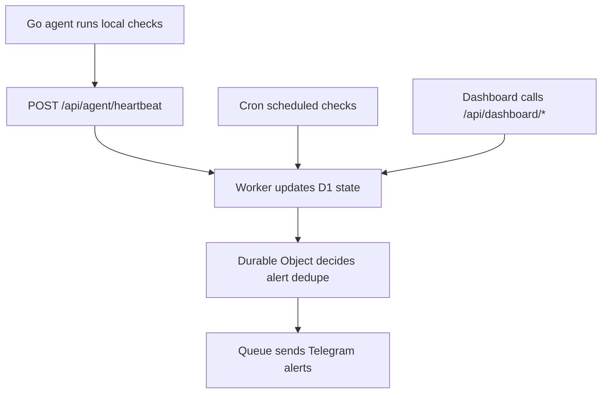
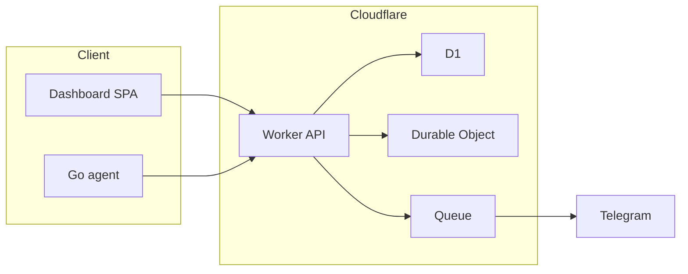
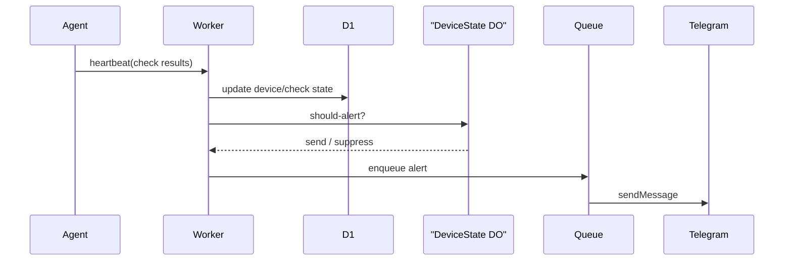

## clawping

> ClawPing is a Cloudflare Workers-first, Telegram-first watchdog for home servers, mini PCs, NAS boxes, and self-hosted apps. The public control plane runs on Cloudflare. A lightweight Go agent runs inside the user's network and pushes health data outward over HTTPS.

# ClawPing

## Overview

ClawPing is a Cloudflare Workers-first, Telegram-first watchdog for home servers, mini PCs, NAS boxes, and self-hosted apps. The public control plane runs on Cloudflare. A lightweight Go agent runs inside the user's network and pushes health data outward over HTTPS.

The repo is intentionally split into four main surfaces:

- `apps/worker/`: control plane, API, scheduler, Telegram webhook, alerting
- `apps/dashboard/`: React onboarding and operations UI
- `packages/shared/`: shared types, schema validation, crypto helpers
- `agent/`: Go agent that performs local checks and sends heartbeats

## Where To Start

1. Read [product-spec.md](/Volumes/SSD/clawping/clawping/product-spec.md) for the product contract.
2. Read [.omx/plans/prd-clawping.md](/Volumes/SSD/clawping/.omx/plans/prd-clawping.md) for the implementation breakdown.
3. Start with [apps/worker/src/index.ts](/Volumes/SSD/clawping/clawping/apps/worker/src/index.ts) for routing and runtime bindings.
4. Use [product-spec-checklist.md](/Volumes/SSD/clawping/clawping/product-spec-checklist.md) as the completion ledger.

## Key Components

- Worker API entry: [apps/worker/src/index.ts](/Volumes/SSD/clawping/clawping/apps/worker/src/index.ts)
- Agent registration and heartbeat routes: [apps/worker/src/routes/agents.ts](/Volumes/SSD/clawping/clawping/apps/worker/src/routes/agents.ts)
- Telegram webhook and bot commands: [apps/worker/src/routes/telegram.ts](/Volumes/SSD/clawping/clawping/apps/worker/src/routes/telegram.ts)
- Cloud-side checks and heartbeat sweep: [apps/worker/src/routes/checks.ts](/Volumes/SSD/clawping/clawping/apps/worker/src/routes/checks.ts)
- Durable Object alert dedupe: [apps/worker/src/durable-objects/device-state.ts](/Volumes/SSD/clawping/clawping/apps/worker/src/durable-objects/device-state.ts)
- Shared validation helpers: [packages/shared/src/schema.ts](/Volumes/SSD/clawping/clawping/packages/shared/src/schema.ts)
- Dashboard app shell: [apps/dashboard/src/App.tsx](/Volumes/SSD/clawping/clawping/apps/dashboard/src/App.tsx)
- Go agent heartbeat manager: [agent/internal/heartbeat/heartbeat.go](/Volumes/SSD/clawping/clawping/agent/internal/heartbeat/heartbeat.go)

## Diagrams

### Flowchart

### Component Diagram

### Sequence Diagram

---
> Source: [cschanhniem/clawping](https://github.com/cschanhniem/clawping) — distributed by [TomeVault](https://tomevault.io).
<!-- tomevault:4.0:gemini_md:2026-05-17 -->
