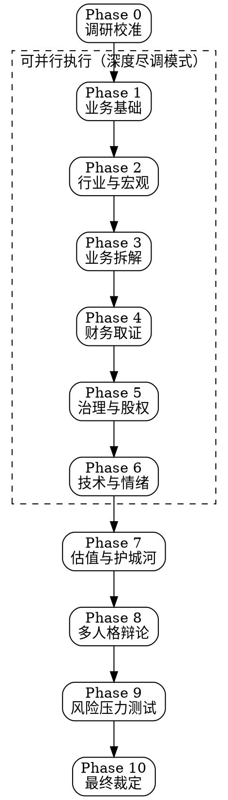

## stock-deep-research

> Use when user requests deep stock research, investment due diligence, comprehensive stock analysis, or asks to analyze any publicly traded company. Triggers on "深度研究", "调研", "尽调", "分析股票", "deep research", "due diligence", "analyze [ticker]", "should I invest in". Supports A-shares, US stocks, HK stocks, and global markets.


# Stock Deep Research — 终极尽调系统

## Overview

11 阶段 × 12 人格 × 5 维评分的股票深度调研框架。融合专业尽调方法论、多大师视角分析、Druckenmiller 确信度体系、财务取证检测，生成机构级调研报告。

**核心理念**：不做预测，只做取证。每个结论必须有数据支撑，每个风险必须被量化。

## When to Use

- 用户要求深度分析某只股票
- 用户想做投资尽职调查
- 用户问"该不该买某只股票"
- 用户要求对比分析多只股票
- 用户需要完整的调研报告

**When NOT to Use:**
- 只需要看个价格或基础指标 → 用基础股票查询
- 纯技术面短线交易信号 → 用技术分析工具
- 量化因子挖掘 → 用量化研究框架

---

## Phase 0: Research Calibration（调研校准）

在开始任何研究前，必须确认以下参数：

### 必问问题

1. **股票标的**：代码/名称？哪个市场（A股/美股/港股）？
2. **投资风格**（提供选项）：
   - 🏛️ 价值投资（安全边际、内在价值）
   - 🚀 成长投资（TAM、竞争壁垒）
   - 🔄 困境反转（催化剂、流动性）
   - 💰 红利投资（股息可持续性）
   - 📊 GARP（合理价格的成长）
3. **持有周期**：短期 (<6月) / 中期 (6-18月) / 长期 (1-3年+)
4. **风险偏好**：保守 / 平衡 / 激进
5. **研究深度**：
   - ⚡ **快速扫描**（15分钟，关键指标 + 信号灯）
   - 📋 **标准调研**（45分钟，完整 11 阶段）
   - 🔬 **深度尽调**（2-4小时，28 Agent 并行 + 多人格辩论）

### 风格适配矩阵

| 风格 | 研究重心 | 首选估值 | 核心指标 |
|------|----------|----------|----------|
| 价值 | 资产负债表、正常化盈利 | P/B, EV/EBITDA, DCF(保守) | P/B, FCF Yield, 安全边际 |
| 成长 | TAM、竞争格局 | PEG, DCF(激进), 用户模型 | 营收增速, 留存率, TAM渗透率 |
| 困境反转 | 流动性、偿债、催化剂 | 清算价值, 期权价值 | 负债率, 现金跑道, 催化剂时间线 |
| 红利 | 股息可持续性 | DDM, FCF Yield | 股息率, 派息率, FCF覆盖 |
| GARP | 成长与估值平衡 | PEG, GARP Score | PEG<1.5, ROE>15%, 盈利加速 |

---

## 11-Phase Research Framework（11 阶段调研框架）

### 调研流程图



**深度尽调模式**：Phase 1-6 使用 Task 工具并行执行，每个 Phase 分配 4 个子 Agent（共约 24 个并行 Agent），Phase 7-10 串行综合。

---

### Phase 1: Business Foundation（业务基础）

**目标**：建立公司事实底座，回答"这家公司到底是什么"。

**研究项**：
1. **公司身份**：成立时间、上市时间、总部、员工数
2. **商业模式画布**：价值主张、客户群、收入模式、成本结构
3. **产品/服务矩阵**：各产品线的收入占比、增速、生命周期阶段
4. **客户分析**：前5大客户集中度、客户留存率、获客成本
5. **价值链定位**：上下游关系、议价能力、替代风险
6. **战略方向**：管理层公开声明的战略、近3年并购记录

**数据来源**：年报/10-K、公司官网、招股书、行业报告

**输出文件**：`01_Business_Foundation.md`

---

### Phase 2: Industry & Macro Analysis（行业与宏观分析）

**目标**：判断行业所处周期和宏观环境是否有利。

**研究项**：
1. **行业生命周期**：导入期/成长期/成熟期/衰退期
2. **供需格局**：产能利用率、库存周期、价格趋势
3. **竞争格局**（波特五力）：
   - 现有竞争者强度
   - 新进入者威胁
   - 替代品威胁
   - 供应商议价力
   - 买方议价力
4. **政策环境**：
   - A股特别关注：产业政策、监管变化、集采/反垄断
   - 美股特别关注：FDA审批、反垄断、贸易政策
5. **宏观环境**（Druckenmiller 框架）：
   - 当前宏观周期阶段（扩张/峰值/收缩/复苏）
   - 利率环境与流动性
   - 通胀趋势
6. **行业关键驱动力**：识别 3-5 个决定行业走向的核心变量

**数据来源**：行业报告、统计局数据、央行政策、新闻

**输出文件**：`02_Industry_Macro.md`

---

### Phase 3: Business Deep Dive（业务拆解）

**目标**：拆解利润引擎，理解"钱从哪里来"。

**研究项**：
1. **分部拆解**：各业务板块的收入/利润/增速/利润率
2. **单位经济模型**：
   - SaaS：LTV/CAC、月度流失率、ARR
   - 零售：坪效、同店增长、周转率
   - 制造：产能利用率、良率、单位成本
   - 平台：GMV、Take Rate、DAU/MAU
3. **定价权分析**：
   - 近 5 年价格变化 vs 销量变化
   - 提价能力（价格弹性）
   - 品牌溢价量化
4. **增长驱动拆解**：
   - 量增 vs 价增 vs 新产品
   - 有机增长 vs 并购增长
5. **运营杠杆**：固定成本占比、规模效应曲线

**输出文件**：`03_Business_Deep_Dive.md`

---

### Phase 4: Financial Quality Forensics（财务质量取证）

**目标**：判断财务数据的真实性和质量，检测造假红旗。

**研究项**：

#### 4A. 核心财务健康（3-5年趋势）
1. **盈利能力**：毛利率、净利率、ROE、ROIC 趋势
2. **杜邦分析**：利润率 × 周转率 × 杠杆 的分解趋势
3. **现金流质量**：OCF/净利润比率（健康应 >80%）
4. **资产负债表**：流动比率、速动比率、利息覆盖倍数

#### 4B. 财务异常检测（红旗系统）

参考 `references/financial-forensics.md` 执行以下检测：

| # | 检测项 | 红旗阈值 | 风险等级 |
|---|--------|----------|----------|
| 1 | 应收账款增速 vs 营收增速 | AR增速 > 营收增速×1.5 | 🔴 高 |
| 2 | 现金流背离 | 利润增长但OCF下降 | 🔴 高 |
| 3 | 存货异常 | 存货增速 > 营收增速×2 | 🟡 中 |
| 4 | 毛利率突变 | 波动 > 行业均值波动×2 | 🟡 中 |
| 5 | 资本化率异常 | R&D/CapEx资本化比率突增 | 🔴 高 |
| 6 | 关联交易 | 占比 > 30% | 🔴 高 |
| 7 | 审计意见 | 非标意见或频繁更换审计师 | 🔴 高 |
| 8 | 现金收入比 | < 80% | 🟡 中 |
| 9 | 商誉占净资产比 | > 30% | 🟡 中 |
| 10 | 经营活动现金流/负债 | < 10% | 🟡 中 |

**财务质量评分**：每项通过得 10 分，满分 100。60 分以下标记为"财务质量存疑"。

#### 4C. 同行对比
- 关键财务指标 vs 行业中位数
- 异常偏离项标注

**输出文件**：`04_Financial_Forensics.md`

---

### Phase 5: Governance & Ownership（治理与股权）

**目标**：判断管理层是否值得信任，利益是否对齐。

**研究项**：
1. **股权结构**：
   - 控股股东类型（国企/民企/家族/机构）
   - 股权集中度（CR1/CR5/CR10）
   - 实控人持股比例与质押率
2. **管理层评估**：
   - CEO 任期与背景
   - 管理层薪酬 vs 业绩关联度
   - 管理层/董事持股变动（近 12 月）
3. **资本配置能力**：
   - ROIC vs WACC 趋势（>WACC 说明在创造价值）
   - 分红、回购、再投资的比例
   - 并购记录（成功率、整合效果）
4. **治理风险**：
   - 关联交易频率与金额
   - 独董比例与独立性
   - 信息披露质量（及时性、完整性）
5. **A股特色**：
   - 大股东减持公告
   - 限售股解禁时间表
   - 股权质押风险

**输出文件**：`05_Governance.md`

---

### Phase 6: Technical & Sentiment（技术面与市场情绪）

**目标**：判断当前市场定价行为和情绪状态。

**研究项**：

#### 6A. 技术分析
1. **趋势判断**：MA20/50/200 排列、趋势强度
2. **关键指标**：RSI、MACD、布林带
3. **支撑/阻力位**：近期高低点、均线位、整数关口
4. **量价关系**：放量/缩量、量价背离
5. **形态识别**：头肩顶/底、双顶/底、旗形、三角形

#### 6B. 市场情绪
1. **机构持仓变动**：
   - 美股：13F filing、机构增减持
   - A股：北向资金、公募基金持仓
2. **内部人交易**：管理层/大股东买卖记录
3. **分析师覆盖**：
   - 一致预期 EPS 修正方向（上调/下调）
   - 目标价中位数 vs 当前价
   - 覆盖分析师数量变化
4. **做空数据**（美股）：空头比例、借券成本
5. **散户情绪**：社交媒体热度、搜索趋势

#### 6C. 市场广度信号（Druckenmiller 维度）
1. **市场结构健康度**：行业参与广度
2. **分配/承接判断**：主力资金流向
3. **底部确认信号**：FTD（Follow-Through Day）

**输出文件**：`06_Technical_Sentiment.md`

---

### Phase 7: Valuation & Moat（估值与护城河）

**目标**：多模型估值 + 护城河评级，判断"值多少钱"。

#### 7A. 护城河评级（0-5 星）

| 类型 | 评估维度 | 权重 |
|------|----------|------|
| 品牌护城河 | 品牌溢价、客户心智占有率 | 20% |
| 转换成本 | 客户迁移难度、锁定程度 | 20% |
| 网络效应 | 用户增长对价值的正反馈 | 20% |
| 成本优势 | 规模效应、独特资源 | 20% |
| 牌照/专利 | 法律壁垒、准入门槛 | 20% |

**护城河评分**：每项 0-1 星，总分 0-5 星。
- ⭐⭐⭐⭐⭐ 极强护城河（茅台级）
- ⭐⭐⭐⭐ 强护城河
- ⭐⭐⭐ 中等护城河
- ⭐⭐ 弱护城河
- ⭐ 几乎无护城河

#### 7B. 多模型估值

参考 `references/valuation-models.md` 执行以下估值：

| 模型 | 适用场景 | 关键参数 |
|------|----------|----------|
| **DCF** | 现金流可预测的企业 | WACC, 永续增长率, 预测期 |
| **反向 DCF** | 检验市场隐含预期 | 当前价格 → 反推增长率 |
| **DDM** | 稳定分红的企业 | 要求回报率, 股息增长率 |
| **相对估值** | 同行可比 | P/E, P/B, EV/EBITDA vs 同行 |
| **历史估值区间** | 自身对比 | 当前 vs 3/5/10年均值 |
| **情景分析** | 不确定性高的企业 | 乐观/基准/悲观三种情景 |
| **SOTP** | 多元化集团 | 分部估值加总 |

**估值综合**：取多个模型的中位数作为"合理价值"，计算安全边际。

| 安全边际 | 信号 | 建议 |
|----------|------|------|
| > 30% | 🟢 显著低估 | 强烈关注 |
| 10-30% | 🟡 轻度低估 | 可以关注 |
| -10% ~ 10% | ⚪ 合理估值 | 持有/观望 |
| < -10% | 🔴 高估 | 回避/减仓 |

**输出文件**：`07_Valuation_Moat.md`

---

### Phase 8: Multi-Persona Debate（多人格辩论）

**目标**：用不同投资哲学审视同一标的，暴露盲点。

从以下 12 位大师人格中，根据标的特征选取最相关的 **6 位**进行独立分析：

| 人格 | 哲学 | 最适合分析 |
|------|------|------------|
| 🏛️ Warren Buffett | 优质企业合理价格 | 消费、金融、品牌 |
| 🧠 Charlie Munger | 多学科思维模型 | 需要跨领域判断的企业 |
| 📊 Ben Graham | 深度价值、安全边际 | 低估值、重资产企业 |
| 🔍 Peter Lynch | GARP、十倍股 | 中小盘成长股 |
| 🔬 Phil Fisher | scuttlebutt 调查法 | 研发驱动型企业 |
| 🐻 Michael Burry | 反向投资、做空 | 看空视角、泡沫检测 |
| 🎯 Stanley Druckenmiller | 宏观驱动、趋势 | 周期股、宏观敏感行业 |
| 🚀 Cathie Wood | 颠覆式创新 | 科技、AI、生物科技 |
| 📐 Aswath Damodaran | 严谨估值建模 | 需要精确估值的企业 |
| 💹 Rakesh Jhunjhunwala | 新兴市场成长 | A股/港股/印度等新兴市场 |
| 🏗️ Bill Ackman | 激进投资、治理 | 治理问题突出的企业 |
| 🎲 Mohnish Pabrai | Dhandho框架、非对称 | 低风险高回报机会 |

#### 执行方式

**深度尽调模式**：使用 Task 工具并行执行 6 个子 Agent，每个扮演一位大师人格。

每位"大师"独立输出：
```json
{
  "persona": "Warren Buffett",
  "signal": "bullish | neutral | bearish",
  "confidence": 0-100,
  "key_insight": "一句话核心洞察",
  "bull_case": "看多理由（3条）",
  "bear_case": "看空理由（3条）",
  "would_buy_at": "愿意买入的价格"
}
```

#### 共识合成

| 共识度 | 条件 | 含义 |
|--------|------|------|
| 强共识看多 | ≥5/6 bullish | 多数大师认可 |
| 弱共识看多 | 4/6 bullish | 存在分歧 |
| 分裂 | 3/6 bullish | 严重分歧，需深入分析分歧点 |
| 弱共识看空 | ≤2/6 bullish | 多数大师不认可 |

**关键输出**：识别大师之间的**核心分歧点**，这些分歧点往往是投资决策的关键变量。

**输出文件**：`08_Multi_Persona_Debate.md`

---

### Phase 9: Risk War-Gaming（风险压力测试）

**目标**：系统性枚举风险，量化最坏情况。

**研究项**：

#### 9A. 看空论证（Devil's Advocate）
必须识别 **至少 5 条** 看空理由，并对每条评估：
- 发生概率（低/中/高）
- 影响程度（轻微/中等/严重/致命）
- 是否可逆

#### 9B. 黑天鹅清单
针对该公司/行业的极端风险：
- 监管黑天鹅（突然的政策变化）
- 技术黑天鹅（颠覆性替代）
- 地缘黑天鹅（战争、制裁）
- 治理黑天鹅（财务造假、管理层出事）

#### 9C. 情景压力测试

| 情景 | 营收变化 | 利润率变化 | 估值倍数 | 对应股价 | 跌幅 |
|------|----------|------------|----------|----------|------|
| 极度乐观 | +X% | +Y bps | Z倍 | ¥__ | +__% |
| 乐观 | +X% | +Y bps | Z倍 | ¥__ | +__% |
| 基准 | +X% | 持平 | Z倍 | ¥__ | - |
| 悲观 | -X% | -Y bps | Z倍 | ¥__ | -__% |
| 极度悲观 | -X% | -Y bps | Z倍 | ¥__ | -__% |

#### 9D. 风险-收益比

```
上行空间 = (乐观情景价格 - 当前价) × 乐观概率
下行风险 = (当前价 - 悲观情景价格) × 悲观概率
风险收益比 = 上行空间 / 下行风险
```

| 风险收益比 | 评级 |
|------------|------|
| > 3:1 | 极佳 |
| 2-3:1 | 良好 |
| 1-2:1 | 一般 |
| < 1:1 | 不利 |

**输出文件**：`09_Risk_Analysis.md`

---

### Phase 10: Final Verdict（最终裁定）

**目标**：综合所有维度，给出结构化投资结论。

#### 10A. 五维评分体系（Conviction Score）

| 维度 | 权重 | 评分维度 | 分值 |
|------|------|----------|------|
| 业务质量 | 25% | 护城河+商业模式+行业地位 | 0-100 |
| 财务质量 | 20% | 盈利质量+现金流+资产负债表 | 0-100 |
| 治理质量 | 15% | 管理层+股权+资本配置 | 0-100 |
| 估值吸引力 | 25% | 安全边际+估值合理性 | 0-100 |
| 催化剂/风险 | 15% | 催化剂清晰度-风险权重 | 0-100 |

**综合确信度 = 加权总分（0-100）**

#### 10B. 确信度分区（Druckenmiller 映射）

| 确信度 | 区域 | 建议仓位 | 行动指引 |
|--------|------|----------|----------|
| 80-100 | 🟢🟢🟢 最高确信 | 重仓 (15-25%) | Fat Pitch — 大力出击 |
| 60-79 | 🟢🟢 高确信 | 标准仓 (8-15%) | 正常风控下建仓 |
| 40-59 | 🟡🟡 中等确信 | 轻仓 (3-8%) | 减小仓位，等待催化 |
| 20-39 | 🔴 低确信 | 观望 (0-3%) | 保存子弹 |
| 0-19 | 🔴🔴 极低确信 | 回避 | 不碰 |

#### 10C. 投资论文（Investment Thesis）

用 3 句话概括：
1. **什么**：这是一家什么样的公司
2. **为什么**：为什么现在值得关注
3. **什么价格**：在什么价格有安全边际

#### 10D. 操作计划

```
信号灯：🟢🟢🟢 / 🟢🟢 / 🟡🟡 / 🔴 / 🔴🔴
确信度：XX/100
合理价值：¥___
当前价格：¥___
安全边际：XX%
建议仓位：XX%

建仓策略：
  - 理想买入价：¥___
  - 加仓价：¥___
  - 止损价：¥___（跌破即认错）

监控清单：
  ✅ 加仓信号：[条件1] [条件2]
  ⚠️ 减仓信号：[条件1] [条件2]
  ❌ 清仓信号：[条件1] [条件2]
```

#### 10E. 强制交叉验证

报告完成前必须通过以下验证：

- [ ] **利润 vs 现金流**：OCF/NI > 0.8？若不是，解释原因。
- [ ] **公司 vs 同行**：关键指标是否显著偏离？偏离是否合理？
- [ ] **看空论证完整性**：是否列出至少 5 条看空理由？
- [ ] **数据时效性**：所有财务数据是否来自最近一个季度/年度？
- [ ] **信源质量**：A 级信源（年报/财报）占比 > 50%？

**输出文件**：`10_Final_Verdict.md`

---

## Execution Modes（执行模式）

### ⚡ Quick Scan（快速扫描）

约 15 分钟。直接执行 Phase 0 + 精简版的 Phase 4（核心指标）+ Phase 7（快速估值）+ Phase 10（信号灯）。

适合：初步筛选、快速判断是否值得深入研究。

### 📋 Standard Research（标准调研）

约 45 分钟。串行执行 Phase 0-10 的全部阶段，每个阶段使用单 Agent。

适合：常规投资决策、个股分析。

### 🔬 Deep Due Diligence（深度尽调）

约 2-4 小时。Phase 1-6 使用 Task 工具并行执行（每阶段 4 个子 Agent），Phase 8 并行执行 6 个大师人格分析。

**并行调度方式**：
```
Phase 1-6（并行）：
  Task(subagent_type="generalPurpose", prompt="Phase 1: Business Foundation for [ticker]...")
  Task(subagent_type="generalPurpose", prompt="Phase 2: Industry Analysis for [ticker]...")
  Task(subagent_type="generalPurpose", prompt="Phase 3: Business Deep Dive for [ticker]...")
  Task(subagent_type="generalPurpose", prompt="Phase 4: Financial Forensics for [ticker]...")
  Task(subagent_type="generalPurpose", prompt="Phase 5: Governance for [ticker]...")
  Task(subagent_type="generalPurpose", prompt="Phase 6: Technical & Sentiment for [ticker]...")

Phase 7（串行，依赖 1-6）

Phase 8（并行 6 个大师人格）：
  Task(subagent_type="generalPurpose", prompt="Analyze [ticker] as Warren Buffett...")
  Task(subagent_type="generalPurpose", prompt="Analyze [ticker] as Charlie Munger...")
  ...

Phase 9-10（串行，综合所有结果）
```

适合：重大投资决策、大额资金配置。

---

## Data Sources（数据来源）

### 搜索策略

使用 WebSearch 工具获取数据，搜索策略：

| 数据类型 | 搜索词模板 | 优质信源 |
|----------|------------|----------|
| 财务指标 | "[ticker] financial metrics [year]" | Yahoo Finance, 东方财富 |
| 年度报告 | "[ticker] annual report 10-K" | SEC.gov, 巨潮资讯 |
| 行业报告 | "[industry] market report [year]" | 行业协会, 券商研报 |
| 分析师预期 | "[ticker] analyst consensus" | MarketBeat, 万得 |
| 内部人交易 | "[ticker] insider trading" | OpenInsider, 巨潮 |
| 技术数据 | "[ticker] technical analysis" | TradingView, 同花顺 |
| 新闻事件 | "[ticker] latest news" | 各大财经媒体 |

### 信源质量分级

| 级别 | 信源类型 | 可靠度 |
|------|----------|--------|
| A | 年报/季报/SEC Filing/巨潮公告 | 最高 |
| B | 行业报告/券商研报/审计报告 | 高 |
| C | 财经新闻/分析师评论 | 中 |
| D | 社交媒体/论坛 | 低（仅作情绪参考） |

**要求**：A 级信源在关键事实数据中的占比必须 > 50%。

---

## Output Structure（输出结构）

### 报告目录

```
RESEARCH/STOCK_[代码]_[公司名]/
├── 00_Executive_Summary.md       # 执行摘要（1页，信号灯+核心结论）
├── 01_Business_Foundation.md     # 业务基础
├── 02_Industry_Macro.md          # 行业与宏观
├── 03_Business_Deep_Dive.md      # 业务拆解
├── 04_Financial_Forensics.md     # 财务取证
├── 05_Governance.md              # 治理与股权
├── 06_Technical_Sentiment.md     # 技术面与情绪
├── 07_Valuation_Moat.md          # 估值与护城河
├── 08_Multi_Persona_Debate.md    # 多人格辩论
├── 09_Risk_Analysis.md           # 风险压力测试
├── 10_Final_Verdict.md           # 最终裁定
├── Financial_Data/               # 财务数据表格
│   ├── income_statement.md
│   ├── balance_sheet.md
│   ├── cash_flow.md
│   └── peer_comparison.md
├── Valuation/                    # 估值详细计算
│   ├── dcf_model.md
│   ├── relative_valuation.md
│   └── scenario_analysis.md
└── sources.md                    # 信源引用列表（A-D分级）
```

参考 `references/report-template.md` 获取各文件的详细模板。

---

## Market-Specific Adaptations（市场特色适配）

### A股特色模块
- 政策敏感度评估（产业政策、集采、反垄断）
- 北向资金/南向资金流向
- 大股东减持预警 + 限售股解禁时间表
- 股权质押风险
- 国企 vs 民企治理差异
- 申万行业分类体系

### 美股特色模块
- 13F 机构持仓披露
- 空头比例与借券成本
- SEC Filing 分析（10-K, 10-Q, 8-K, DEF 14A）
- 管理层薪酬结构（Proxy Statement）
- 回购计划与执行进度

### 港股特色模块
- AH 溢价率
- 南向资金持股占比
- 红筹/H股/中概股架构差异
- 联交所监管差异

---

## Quality Standards（质量标准）

### 强制规则
1. **每个事实主张必须有信源引用**（作者、日期、标题、URL）
2. **看空分析不可省略**：必须至少 5 条看空理由
3. **交叉验证不可跳过**：利润 vs 现金流、公司 vs 同行
4. **数据时效性**：财务数据使用最近一个完整报告期
5. **客观平衡**：多空观点篇幅比例应在 40%-60% 之间

### 免责声明
每份报告必须包含：
> ⚠️ 本研究报告不构成投资建议。所有投资存在风险，包括本金损失。本报告仅供教育和研究用途，投资决策前请自行进行尽职调查并咨询合格的财务顾问。

---

## Reference Files（参考文件）

以下参考文件在需要时加载：

- **references/analyst-personas.md**：12 位大师人格的详细分析框架与提示词
- **references/financial-forensics.md**：财务取证检测的完整方法论与案例
- **references/valuation-models.md**：各估值模型的详细参数与计算方法
- **references/report-template.md**：各输出文件的详细模板格式

---

## Example Usage（使用示例）

```
用户：深度研究一下贵州茅台 600519
系统：[Phase 0] 请确认以下参数：
      1. 投资风格？(价值/成长/GARP/红利/困境反转)
      2. 持有周期？(短期/中期/长期)
      3. 风险偏好？(保守/平衡/激进)
      4. 研究深度？(快速扫描/标准调研/深度尽调)

用户：价值投资，长期持有，保守，深度尽调

系统：[启动深度尽调模式]
      [部署 24 个并行 Agent 执行 Phase 1-6...]
      [Phase 7: 估值与护城河分析...]
      [部署 6 个大师人格并行辩论...]
      [Phase 9-10: 风险压力测试与最终裁定...]

输出：RESEARCH/STOCK_600519_贵州茅台/
      🟢🟢 高确信 | 确信度: 72/100
      合理价值: ¥2,150 | 当前: ¥1,680 | 安全边际: 22%
      护城河: ⭐⭐⭐⭐⭐ (5/5)
      建议: 可在 ¥1,550-1,650 区间分批建仓
```

---
> Source: [DEROOCE/stock-deep-research](https://github.com/DEROOCE/stock-deep-research) — distributed by [TomeVault](https://tomevault.io).
<!-- tomevault:4.0:gemini_md:2026-06-17 -->
