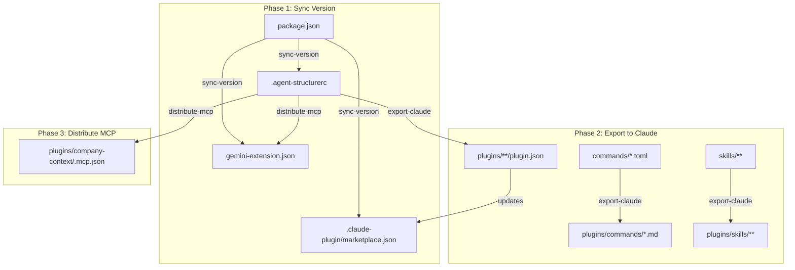
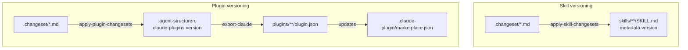

## ai-team

> This project is a collection of AI utils like agents/commands/skills and more that are intended to be used together to use AI tools more effectively.

# Agent Instructions: AI Team Project

This project is a collection of AI utils like agents/commands/skills and more that are intended to be used together to use AI tools more effectively.

## Overview

Support different AI agents/commands/skills formats:

### Command File Formats

#### Markdown Format

Used by: Claude Code, Cursor, opencode, Windsurf, Amazon Q Developer, Amp, SHAI, IBM Bob

**Standard format:**

Used by Claude Code

```markdown
---
description: "Command description"
---

Command content with {SCRIPT} and $ARGUMENTS placeholders.
```

#### TOML Format

Used by: Gemini

```toml
description = "Command description"

prompt = """
Command content with {SCRIPT} and {{args}} placeholders.
"""
```

### Organization

- **`commands/`**: Source command files in TOML format, primarily used by Gemini CLI.
- **`skills/`**: Source skill files (SKILL.md), providing specialized knowledge and instructions.
- **`plugins/`**: Claude Code plugins. Each subdirectory represents a plugin and contains exported versions of commands and skills in Markdown format.
- **`.claude-plugin/`**: Metadata and configuration for Claude Code. The root folder contains the `marketplace.json`, while plugin folders contain their respective `plugin.json`.

### AI Team MCP

The `ai-team` MCP server provides authoritative business and architectural context.

#### Available Tools

| Tool | Description |
|---|---|
| `get_enterprise_context` | Retrieves the enterprise mission, strategic goals, and core architecture characteristics. |
| `get_company_outcomes` | Retrieves the high-level business outcomes and key results. |
| `get_architecture_principles` | Retrieves the technology-agnostic architecture principles. |
| `search_product` | Dynamic tool to search for specific product characteristics. |

#### Context Folder Structure

```text
context/
├── enterprise.md              # Shared mission, goals, and core characteristics
├── outcomes.md                # Shared strategic outcomes (OKRs)
├── architecture-principles.md # Fundamental philosophy and standards
└── products/                  # Product-specific characteristics
    ├── personal-website.md
    ├── collecstory.md
    └── default.md             # Fallback for undocumented products
```

#### Project Configuration (`.agent-structurerc`)

File `.agent-structurerc` is used to configure the project structure.

```json
{
  "claude-plugins": {
    "npm-tools": {
      "name": "npm-tools",
      "version": "0.0.1",
      "description": "Tools for working with npm"
    },
    "design-system": {
      "name": "design-system",
      "version": "0.0.1",
      "description": "Authoritative design system context and tools"
    },
    "company-context": {
      "name": "company-context",
      "version": "0.0.3",
      "description": "Authoritative company context and tools"
    },
    "web-quality": {
      "name": "web-quality",
      "version": "0.0.1",
      "description": "Skills for auditing and optimizing web quality (Performance, Accessibility, SEO, Core Web Vitals, Best Practices)"
    },
    "frontend-tools": {
      "name": "frontend-tools",
      "version": "0.0.1",
      "description": "Expert procedural guidance for frontend development (React, Next.js, etc.)"
    },
    "database-tools": {
      "name": "database-tools",
      "version": "0.0.1",
      "description": "Expert procedural guidance for database optimization and best practices"
    }
  },
  "commands": [
    {
      "name": "npm-package-setup",
      "source": "npm/package-setup.toml",
      "claude-plugin": "npm-tools"
    },
    {
      "name": "npm-publish",
      "source": "npm/publish-setup.toml",
      "claude-plugin": "npm-tools"
    }
  ],
  "skills": [
    {
      "name": "design-tokens",
      "source": "skills/design-tokens/SKILL.md",
      "claude-plugin": "design-system"
    },
    {
      "name": "performance",
      "source": "skills/performance/SKILL.md",
      "claude-plugin": "web-quality"
    },
    {
      "name": "accessibility",
      "source": "skills/accessibility/SKILL.md",
      "claude-plugin": "web-quality"
    },
    {
      "name": "seo",
      "source": "skills/seo/SKILL.md",
      "claude-plugin": "web-quality"
    },
    {
      "name": "core-web-vitals",
      "source": "skills/core-web-vitals/SKILL.md",
      "claude-plugin": "web-quality"
    },
    {
      "name": "best-practices",
      "source": "skills/best-practices/SKILL.md",
      "claude-plugin": "web-quality"
    },
    {
      "name": "web-quality-audit",
      "source": "skills/web-quality-audit/SKILL.md",
      "claude-plugin": "web-quality"
    },
    {
      "name": "react-best-practices",
      "source": "skills/react-best-practices/SKILL.md",
      "claude-plugin": "frontend-tools"
    },
    {
      "name": "next-best-practices",
      "source": "skills/next-best-practices/SKILL.md",
      "claude-plugin": "frontend-tools"
    },
    {
      "name": "supabase-postgres-best-practices",
      "source": "skills/supabase-postgres-best-practices/SKILL.md",
      "claude-plugin": "database-tools"
    }
  ],
  "mainMcp": {
    "claude-plugin": "company-context",
    "version": "1.4.6",
    "package": "@dezkareid/ai-team",
    "command": "npx",
    "args": [
      "-y",
      "${package}@${version}"
    ],
    "contextFiles": {
      "get_enterprise_context": "context/enterprise.md",
      "get_company_outcomes": "context/outcomes.md",
      "get_architecture_principles": "context/architecture-principles.md"
    }
  },
  "mcpServers": {
    "chrome-devtools": {
      "claude-plugin": "frontend-tools",
      "command": "npx",
      "args": [
        "-y",
        "chrome-devtools-mcp@latest"
      ]
    }
  }
}
```
#### Claude Plugin Structure

```
plugins/
└── <claude-plugin>/
    ├── .claude-plugin/
    │   ├── plugin.json
    ├── commands/ (optional)
    │   ├── <command-name>.md
    ├── skills/ (optional)
    │   └── <skill-name>/
    │       └── SKILL.md
    └── .mcp.json (optional)
```

### Argument Patterns

Different agents use different argument placeholders:

- **Markdown/prompt-based**: `$ARGUMENTS`
- **TOML-based**: `{{args}}`

## Development

Always use Context7 MCP when I need library/API documentation, code generation, setup or configuration steps without me having to explicitly ask.

### Workflow

The project uses a structured workflow to keep versions, commands, and configurations in sync across Gemini and Claude platforms.



> **Note**: You must run `pnpm run build` before executing these commands, as they rely on the compiled files in the `dist/` directory.

1.  **Sync Version**: Run `pnpm run sync-version` to propagate the version and name from `package.json` to `.agent-structurerc` (specifically `mainMcp`), `.claude-plugin/marketplace.json`, and `gemini-extension.json`.
2.  **Export to Claude**: Run `pnpm run export-claude` to process source files.
    -   **Commands**: Converts TOML source files to Markdown with Claude-compatible frontmatter and `$ARGUMENTS` placeholders.
    -   **Skills**: Symlinks `SKILL.md` and reference files into the `plugins/` directory.
    -   **Plugin Versions**: Updates `plugin.json` in each plugin folder and reflects them in the `marketplace.json`.
3.  **Distribute MCP**: Run `pnpm run distribute-mcp` to resolve placeholders (like `${version}`) in MCP configurations defined in `.agent-structurerc`.
    -   Updates `gemini-extension.json` for Gemini CLI.
    -   Creates/updates `.mcp.json` in relevant plugin folders (e.g., `plugins/company-context/`) for Claude Code.

### Versioning Skills and Plugins

Skills and plugins are versioned independently using changeset files (powered by `@changesets/cli`).

#### Version sources

| Artifact | Where the version lives |
|---|---|
| **Skill** | `metadata.version` field in the skill's `SKILL.md` frontmatter |
| **Plugin** | `version` field under `claude-plugins.<id>` in `.agent-structurerc` |

> **Important**: When a skill is modified, you MUST also bump the version of the plugin it belongs to in `.agent-structurerc` using a changeset. This ensures that the changes are propagated to the Claude plugin registry.

#### Changeset file format

Create a file inside `.changeset/` (any name, `.md` extension). The frontmatter lists one or more names and their bump type (`major`, `minor`, or `patch`). The same name can appear in both scripts — each one only acts on its own registry.

```md
---
"design-tokens": minor
"npm-tools": patch
---

Brief description of what changed.
```

Use `pnpm changeset` to generate the file interactively, or create it manually.

#### Applying changesets

```bash
pnpm run build

# Bump versions in SKILL.md files for any skill listed in pending changesets
pnpm run apply-skill-changesets

# Bump versions in .agent-structurerc for any plugin listed in pending changesets
pnpm run apply-plugin-changesets
```

Each script reads all `.md` files in `.changeset/` (skipping `README.md`), applies the highest bump when a name appears in multiple files, writes the new version to its respective location, and deletes the consumed changeset files.

#### Workflow diagram



After bumping plugin versions, run `pnpm run export-claude` so the new versions are propagated to `plugin.json` and `marketplace.json`.

### Commit Rules

Always use Conventional Commits format for commit messages.

Never commit directly to `main` or `master`. If the current branch is one of them, propose creating a new branch before committing.

### Critical Dependency Versions

The following versions are established across the project's packages and should be respected when adding new dependencies or troubleshooting.

Always prefer use exact versions for dependencies. Do not use `^` or `~`.

#### Core Languages & Runtimes
- **TypeScript**: `5.9.3`

#### Build & Bundling Tools
- **Rollup**: `4.56.0`

#### Testing Frameworks
- **Vitest**: `4.0.18`

#### Linting & Formatting
- **ESLint**: `9.39.2`

#### Type Definitions
- **@types/node**: `25.0.10`
- **@types/fs-extra**: `11.0.4`

### Project Structure & Conventions
- **Package Manager**: `pnpm` is the required package manager.

## Testing

### Approach

Tests are written using **Vitest** and follow **BDD (Behaviour-Driven Development)** conventions:

- Test files live next to the source files they cover, using the `.spec.ts` suffix.
- Tests are structured with `describe` blocks that express the context ("given …") and `it` blocks that express the expected behaviour ("should …").
- Side effects (filesystem, child processes, `process.exit`) are isolated with `vi.mock` / `vi.spyOn` so tests remain fast and deterministic.
- Pure functions (template generators) are tested without mocks.

### Running Tests

```bash
# Run the full test suite once
pnpm test
```

## Documentation

When a command in templates or npx commands are added/updated/removed/renamed/deprecated, ask to update the AGENTS.md and README.md files.

---
> Source: [dezkareid/ai-team](https://github.com/dezkareid/ai-team) — distributed by [TomeVault](https://tomevault.io).
<!-- tomevault:4.0:gemini_md:2026-05-03 -->
