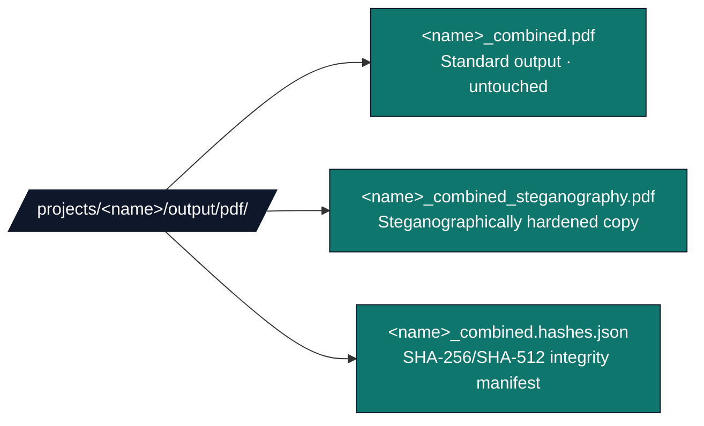
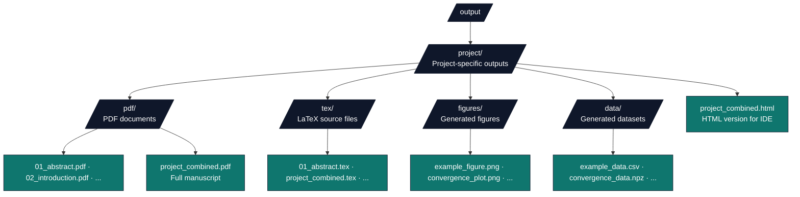

## template

> This document provides documentation for the Research Project Template system, ensuring understanding of all functionality, configuration options, and operational procedures.

# 🤖 AGENTS.md - System Documentation

## 🎯 System Overview

This document provides documentation for the Research Project Template system, ensuring understanding of all functionality, configuration options, and operational procedures.

### 📄 Publication

**Title**: *A template/ approach to Reproducible Generative Research: Architecture and Ergonomics from Configuration through Publication*
**DOI**: [10.5281/zenodo.19139090](https://doi.org/10.5281/zenodo.19139090) · **Record**: [zenodo.org/records/19139090](https://zenodo.org/records/19139090)

`template/` applies Infrastructure as Code to the research lifecycle: version-controlled manuscripts, tests, and provenance, built through a ten-stage DAG. **Layer 1** (`infrastructure/`, **313** Python files under `infrastructure/` per `find infrastructure -name '*.py' | wc -l` on this tree) is separated from **Layer 2** (self-contained projects under `projects/`). Each directory carries `README.md` + `AGENTS.md`; infrastructure packages usually add `SKILL.md` for agent routing. Full paper, metrics, and claims: Zenodo record above and root [`README.md`](README.md).

### Documentation map

| Entry | Role |
| --- | --- |
| [`README.md`](README.md) | Human onboarding, badges, quick paths |
| [`CLAUDE.md`](CLAUDE.md) | Claude Code: commands, architecture, constraints |
| [`.github/README.md`](.github/README.md) | GitHub: CI overview, templates, Dependabot |
| [`.github/AGENTS.md`](.github/AGENTS.md) | Actions job names, coverage gates, branch protection hints |

## Learned User Preferences

- When a "Plan" / "Implementation Plan" file is attached, treat the existing todos as authoritative: do not recreate them, do not edit the plan file, mark each in_progress as you work, and do not stop until every todo is complete.
- Purge legacy / historical / outdated / deprecated narrative from docs, manuscripts, and code on every review pass; never leave superseded references behind.
- When pointing users to past Cursor agent transcripts, cite only **parent** transcript files (UUID link text with a short title, UUID without the `.jsonl` suffix in the path); do not cite or discuss subagent transcripts or their IDs.
- Prefer understated, semantically necessary wording in docs and names; trim hype adjectives such as "enhanced", "real", and "new" unless they change meaning.
- In manuscript introductions and related work, prefer building on, juxtaposing, and extending prior work over oppositional "against" framing; show, do not tell.

## Learned Workspace Facts

- Manuscript metrics, counts, and variables are auto-injected from per-project `output/data/manuscript_variables.json` at render time; never hand-author values that should be injected. The PDF cover DOI is a separate path: `publication.doi` in `projects/{name}/manuscript/config.yaml` is read by `infrastructure/rendering/_pdf_latex_helpers.py` and emitted as `\href{https://doi.org/<doi>}{DOI: <doi>}` on the title page.
- **Rotating Lean-toolchain project (e.g. `fep_lean`, when checked out under `projects/`)**: real Lean 4 + Mathlib via `lake build`, OpenGauss `gauss` CLI, and the Hermes LLM pipeline (no mocks); validate end-to-end through `./run.sh`. Combined-PDF link colours come from `hyperref` / `\hypersetup` in the project's `manuscript/preamble.md` (red `fepred` for link, URL, and citation colours). Infrastructure only injects red when it rewrites a `hidelinks` draft in the emitted `.tex`.
- For that rotating project, Hermes and per-topic Gauss markdown reports are built from the pipeline stage payload (`TopicRunResult.as_dict()`), not by re-reading SQLite artifacts; that dict must include the Hermes fields the reporter uses (`tokens_used`, `explanation`, `refined_lean_sketch`, `hermes_model`, `cache_hit`, `hermes_lean_compiles`) or aggregate and per-topic reports will show empty tokens and missing sections.
- Topic sketch sources of truth (when checked out) are the catalogue in the project's `scripts/catalogue_sketches.py` and `config/topics.yaml` (one `TopicEntry` per topic: `lean_sketch` + `latex_equations`); the project's `lean/FepSketches/` is for `Basic.lean`, `fep_all.lean`, and ephemeral `_verify_*` verifier files, not long-lived per-topic `.lean` files for the full catalogue. The manuscript emits a **unified** `09z_unified_formalism_catalogue.md` (B+C material juxtaposed per topic; PDF refs `sec:appendix_b_full_topic_lean_catalogue` and `sec:appendix_c_latex_equations` both resolve in that chapter). The project's `scripts/theorem_latex_signatures.py` drives display-math strings aligned with Lean. The pipeline may write LaTeX `equation` environments with `\label{eq:…}` for autonumbered cross-refs, not only `$$` display blocks.
- That project's manuscript-variables injector reads only `run_*/verification_manifest.json` artifacts and ignores `verify_*/` standalone re-verifications, so the canonical compile-rate cited in the abstract is the Hermes-refined run (e.g. `49/50` with one fallback) — standalone verifier-only runs reporting `50/50` do not propagate into manuscript metrics.
- Content-validation diagnostics carry stable dotted IDs from `infrastructure/validation/content/diagnostic_codes.py` (`MarkdownCode`, `BibtexCode`, e.g. `MARKDOWN.PANDOC_BARE_PIPE`, `BIBTEX.UNDEFINED_KEY`); every new `DiagnosticEvent` emission must pass `code=…`, and renaming an existing code is a breaking change for downstream `jq`/`rg` filters on `diagnostics.json`.
- `uv run python -m infrastructure.validation.cli prerender <project>` runs the strict source-markdown gate (`prevalidate_source_markdown`) without triggering a full render; use it for fast pre-flight before `scripts/03_render_pdf.py`.
- Slides keep Beamer Unicode/math parity with combined PDFs via `extract_math_font_preamble` in `infrastructure/rendering/_pdf_latex_helpers.py`, wired through Pandoc `-H header.tex` from `SlidesRenderer.render`; prose Unicode glyphs in body LaTeX are remapped by `infrastructure/rendering/_pdf_unicode_remap.py` inside `_pdf_combined_renderer.postprocess_latex`.
- Project roster under `projects/` rotates; the **only three permanent canonical exemplars** are [`projects/template_code_project/`](projects/template_code_project/), [`projects/template_prose_project/`](projects/template_prose_project/), and [`projects/template_search_project/`](projects/template_search_project/) — consult [`docs/_generated/active_projects.md`](docs/_generated/active_projects.md) before hard-coding any other project paths in docs (every non-template path may rotate to `projects_in_progress/` or `projects_archive/` between renders). Running **all** `projects/*/tests/` in **one** pytest process fails when two projects each ship `tests/conftest` under the `tests.conftest` package name; run **one project test directory per pytest invocation** (with `--cov-append` to merge coverage) or follow `.github/workflows/ci.yml` (e.g. `fep_lean` in its own job).
- `projects/biology_textbook/` is WIP-friendly: `infrastructure.project.discovery.resolve_project_root` lets `uv run python scripts/03_render_pdf.py --project biology_textbook` work from the repository root before promotion, but `./run.sh` and default discovery only list it after it moves under `projects/`.
- `projects_in_progress/cognitive_integrity/`: pass the program segment in `--project` (e.g. `cognitive_integrity/cogsec_multiagent_1_theory`); bare `cogsec_multiagent_*` resolves under `projects/` and will not find the WIP tree—same `resolve_project_root` rule as other nested `projects_in_progress` layouts.
- `projects/biology_textbook/docs/api_reference.md` is manually curated; after adding or renaming public functions in `src/biology/`, reconcile it with `rg '^\\s*def ' src/biology` and refresh any doc counts from live measurement. `docs/accessibility.md` in the same project lists which `manuscript/config.yaml` keys are advisory vs test-enforced.

## 📋 Table of Contents

1. [Core Architecture](#core-architecture)
2. [Directory-Level Documentation](#directory-level-documentation)
3. [Configuration System](#configuration-system)
4. [Rendering Pipeline](#rendering-pipeline)
5. [Validation Systems](#validation-systems)
6. [Testing Framework](#testing-framework)
7. [Output Formats](#output-formats)
8. [Advanced Modules](#advanced-modules)
9. [Troubleshooting](#troubleshooting)
10. [Maintenance](#maintenance)

## 🏗️ Core Architecture

### Two-Layer Architecture

#### Layer 1: Infrastructure (Generic - Reusable)

- `infrastructure/` - Generic build/validation tools (reusable across projects)
- `scripts/` - Entry point orchestrators (core pipeline or full pipeline via `./run.sh`)
- `tests/` - Infrastructure and integration tests

#### Layer 2: Projects (Project-Specific - Customizable)

- `projects/{name}/src/` - Research algorithms and analysis (domain-specific per project)
- `projects/{name}/tests/` - Project test suite
- `projects/{name}/scripts/` - Project analysis scripts (thin orchestrators)
- `projects/{name}/manuscript/` - Research manuscript
- `projects/{name}/output/` - Working outputs during pipeline execution
- `output/{name}/...` - Final deliverables after pipeline completion

### Thin Orchestrator Pattern

**CRITICAL**: All business logic resides in `projects/{name}/src/` modules. Scripts are **thin orchestrators** that:

**Root Entry Points (Generic):**

- Coordinate build pipeline stages
- Discover and invoke `projects/{name}/scripts/` for specified project
- Handle I/O, orchestration only
- Work with ANY project structure (single or multi-project)

**Project Scripts (Project-Specific):**

- Import from `projects/{name}/src/` for computation
- Import from `infrastructure/` for utilities
- Orchestrate domain-specific workflows
- Handle I/O and visualization

**Violation of this pattern breaks the architecture**.

### Multi-Project Support

The template now supports **multiple independent projects** within a single repository:

**Project Discovery:**

- Projects are discovered automatically from `projects/` directory
- Each project must have `src/` and `tests/` directories
- Projects are validated for structural completeness

**Project Isolation:**

- Each project has its own source code, tests, manuscript, and scripts
- Working outputs are stored in `projects/{name}/output/`
- Final deliverables are organized in `output/{name}/...`

**Orchestration Options:**

- Run individual projects: `--project {name}`
- Run all projects sequentially: `--all-projects`
- Interactive project selection menu
- Backward compatibility with single-project workflows

**Active projects** (under `projects/`): the set **rotates** as workspaces are promoted, archived, or moved. Authoritative names **at any moment** are only in [`docs/_generated/active_projects.md`](docs/_generated/active_projects.md) (regenerate after layout changes). The **only** path **guaranteed** to remain the **control-positive** exemplar for docs and commands is `projects/template_code_project/` (optimization research exemplar).

**Note:** Exemplars such as `blake_bimetalism`, `traditional_newspaper`, `area_handbook`, `density_bioscales` may live under [`projects_archive/`](projects_archive/). In-progress trees live under [`projects_in_progress/`](projects_in_progress/) until promoted (roster varies by checkout). Active names are listed in [`docs/_generated/active_projects.md`](docs/_generated/active_projects.md).

## 📂 Project Organization: Active vs Archived

### Active Projects (`projects/`)

Projects in the `projects/` directory are **actively discovered and executed** by infrastructure:

- **Discovered** by `infrastructure.project.discovery.discover_projects()`
- **Listed** in `run.sh` interactive menu
- **Executed** by all pipeline scripts (`01_run_tests.py`, `02_run_analysis.py`, etc.)
- **Outputs** generated in `projects/{name}/output/` and copied to `output/{name}/`

### Archived Projects (`projects_archive/`)

Projects in the `projects_archive/` directory are **preserved but not executed**:

- **NOT discovered** by infrastructure discovery functions
- **NOT listed** in `run.sh` menu
- **NOT executed** by any pipeline scripts
- **Preserved** for historical reference and potential reactivation

### Project Lifecycle

**Archiving:** Move `projects/{name}/` → `projects_archive/{name}/`
**Reactivation:** Move `projects_archive/{name}/` → `projects/{name}/`

Projects are automatically discovered when moved to the `projects/` directory.

### Projects In Progress (`projects_in_progress/`)

An optional intermediate staging area for projects that are under active development but not yet ready to run through the full pipeline. Projects here:

- **NOT discovered** by infrastructure discovery functions
- **NOT listed** in `run.sh` menu
- **NOT executed** by any pipeline scripts
- Useful for drafting new project scaffolding before promoting to `projects/`

**Current projects in progress:** see the directories under [`projects_in_progress/`](projects_in_progress/) (e.g. `cogant`, `template` on this checkout; not executed by `./run.sh` until promoted to `projects/`). **Active** projects under `projects/` are listed only in [`docs/_generated/active_projects.md`](docs/_generated/active_projects.md).

**To promote:** Move `projects_in_progress/{name}/` → `projects/{name}/`

## 📚 Repository Structure

The template separates **generic infrastructure** from **project-specific code**:

```mermaid
flowchart TB
%% noqa: docs-lint — pre-existing diagram, see TO-DO MED4 follow-up to repair syntax
    ROOT[/template//<br/>Generic template repository]

    ROOT --> INFRA[/infrastructure//<br/>Layer 1 · generic build · validation tools]
    ROOT --> SCRIPTS[/scripts//<br/>Pipeline stage orchestrators 00–07]
    ROOT --> TESTS[/tests//<br/>Infrastructure test suite]
    ROOT --> PROJECTS[/projects//<br/>Active workspaces · roster rotates]
    ROOT --> WIP[/projects_in_progress//<br/>Staging · not executed]
    ROOT --> ARCH[/projects_archive//<br/>Retired · preserved · not executed]
    ROOT --> OUT[/output//<br/>Final deliverables · organized by project]

    INFRA --> I_DOCS[AGENTS.md · README.md · SKILL.md]
    INFRA --> I_CONFIG[/config//<br/>Repo-wide configuration]
    INFRA --> I_DOCKER[/docker//<br/>Container specs]
    INFRA --> I_SUB[Layer 1 packages listed in<br/>`infrastructure/AGENTS.md` —<br/>17 Python dirs + logrotate configs ·<br/>313 `.py` files in `infrastructure/`]

    PROJECTS --> P_README[README.md · multi-project guide]
    PROJECTS --> P_STUB[/_test_project//<br/>Stub · output/ only · not discovered]
    PROJECTS --> P_CODE[/template_code_project//<br/>Guaranteed control-positive exemplar]
    PROJECTS --> P_OTHER[/&lt;name&gt;//<br/>Additional discovered projects]

    P_CODE --> P_C_SRC[/src · tests · scripts · manuscript · output/<br/>+ pyproject.toml]

    OUT --> O_CODE[/template_code_project//<br/>Project outputs]
    OUT --> O_DOTS[/&lt;other projects&gt;//]

    classDef root fill:#0f172a,stroke:#0f172a,color:#fff
    classDef l1 fill:#1e3a8a,stroke:#0f172a,color:#fff
    classDef l2 fill:#0f766e,stroke:#0f172a,color:#fff
    classDef gen fill:#7c2d12,stroke:#0f172a,color:#fff
    class ROOT root
    class INFRA,SCRIPTS,TESTS,I_CONFIG,I_DOCKER,I_SUB,I_DOCS l1
    class PROJECTS,P_CODE,P_OTHER,P_STUB,P_README,P_C_SRC l2
    class WIP,ARCH,OUT,O_CODE,O_DOTS gen
```

## 📚 Directory-Level Documentation

Each directory contains documentation for easy navigation:

### Generic Infrastructure (Reusable)

| Directory | AGENTS.md | README.md | Purpose |
| --------- | --------- | --------- | ------- |
| [`infrastructure/`](infrastructure/) | [AGENTS.md](infrastructure/AGENTS.md) | [README.md](infrastructure/README.md) | Generic build/validation tools (Layer 1) |
| [`scripts/`](scripts/) | [AGENTS.md](scripts/AGENTS.md) | [README.md](scripts/README.md) | Generic entry point orchestrators |
| [`tests/`](tests/) | [AGENTS.md](tests/AGENTS.md) | [README.md](tests/README.md) | Infrastructure test suite |

### Project-Specific (Customizable)

| Directory | AGENTS.md | README.md | Purpose |
| --------- | --------- | --------- | ------- |
| [`projects/template_code_project/`](projects/template_code_project/) | [AGENTS.md](projects/template_code_project/AGENTS.md) | [README.md](projects/template_code_project/README.md) | Code-centric exemplar (canonical, always present) |
| [`projects/template_prose_project/`](projects/template_prose_project/) | [AGENTS.md](projects/template_prose_project/AGENTS.md) | [README.md](projects/template_prose_project/README.md) | Prose-centric exemplar (canonical, always present) |
| [`projects/template_search_project/`](projects/template_search_project/) | [AGENTS.md](projects/template_search_project/AGENTS.md) | [README.md](projects/template_search_project/README.md) | Literature-search exemplar (canonical, always present) |
| Rotating projects (e.g. `fep_lean`, `actinf_policy_entanglement_lean`) | see project tree when checked out under `projects/` | see project tree when checked out under `projects/` | See [`docs/_generated/active_projects.md`](docs/_generated/active_projects.md) for current roster; rotates between `projects_in_progress/` and `projects_archive/` |

**In-progress projects** (under `projects_in_progress/`, not executed by pipeline):

| Directory | Purpose |
| --------- | ------- |
| [`projects_in_progress/cogant/`](projects_in_progress/cogant/) | Cognitive agent project |
| [`projects_in_progress/template/`](projects_in_progress/template/) | Meta-documentation and template metrics |

**Archived projects** (under `projects_archive/`, preserved but not executed):

| Directory | Purpose |
| --------- | ------- |
| [`projects_archive/cognitive_case_diagrams/`](projects_archive/cognitive_case_diagrams/) | Categorical case modeling manuscript and implementation |

Archived exemplars are preserved under [`projects_archive/`](projects_archive/) (not discovered or executed until moved to `projects/`). See [`projects/README.md`](projects/README.md) for narrative descriptions. The authoritative list of active projects is in [`docs/_generated/active_projects.md`](docs/_generated/active_projects.md). Regenerate it after layout changes: `uv run python scripts/generate_active_projects_doc.py`.

### Documentation Directories

| Directory | AGENTS.md | README.md | Purpose |
| --------- | --------- | --------- | ------- |
| [`docs/`](docs/) | [AGENTS.md](docs/AGENTS.md) | [README.md](docs/README.md) | Project documentation hub |

### Documentation Navigation

**For detailed information:**

- Read directory-specific **AGENTS.md** files for details
- Each AGENTS.md covers architecture, usage, and best practices

**For quick reference:**

- Check directory-specific **README.md** files for fast answers
- Each README.md provides quick start and essential commands

**Root documentation:**

- This file (root **AGENTS.md**) - System overview
- [README.md](README.md) - Project quick start and introduction

### Directory Structure

```mermaid
flowchart TB
%% noqa: docs-lint — pre-existing diagram, see TO-DO MED4 follow-up to repair syntax
    ROOT[/template//<br/>Generic Template]

    ROOT --> INFRA[/infrastructure//<br/>Layer 1 · generic build/validation tools]
    ROOT --> DOCS[/docs//<br/>Documentation hub]
    ROOT --> CUR[/.cursor//<br/>Editor configuration]
    ROOT --> SCR[/scripts//<br/>Pipeline stage entry points]
    ROOT --> TS[/tests//<br/>Infrastructure tests]
    ROOT --> PR[/projects//<br/>Multiple research projects]
    ROOT --> WIP[/projects_in_progress//<br/>Work-in-progress · not discovered]
    ROOT --> ARC[/projects_archive//<br/>Archived · preserved]
    ROOT --> PYPROJ[pyproject.toml<br/>Root configuration]

    INFRA --> I_DOCS[AGENTS.md · README.md · SKILL.md]
    INFRA --> I_CFG[/config/<br/>.env.template · secure_config.yaml/]
    INFRA --> I_DOCKER[/docker/<br/>Dockerfile · docker-compose.yml/]
    INFRA --> I_MODULES[build_verifier.py · figure_manager.py · ...]

    DOCS --> D_FILES[AGENTS.md · README.md ·<br/>CLOUD_DEPLOY.md · PAI.md · RUN_GUIDE.md]

    CUR --> C_FILES[.cursorrules · .cursorignore · README.md]

    SCR --> S_DOCS[AGENTS.md · README.md]
    SCR --> S_STAGES[00_setup_environment.py<br/>01_run_tests.py<br/>02_run_analysis.py<br/>03_render_pdf.py<br/>04_validate_output.py<br/>05_copy_outputs.py]

    TS --> T_FILES[AGENTS.md · README.md · test_*.py]

    PR --> PR_CODE[/template_code_project//<br/>Optimization exemplar · active]
    PR --> PR_OTHER[/&lt;name&gt;//<br/>additional discovered projects]
    PR_CODE --> PRC_LAYOUT[/src · tests · scripts ·<br/>manuscript · output/<br/>+ pyproject.toml]

    classDef root fill:#0f172a,stroke:#0f172a,color:#fff
    classDef l1 fill:#1e3a8a,stroke:#0f172a,color:#fff
    classDef l2 fill:#0f766e,stroke:#0f172a,color:#fff
    classDef gen fill:#7c2d12,stroke:#0f172a,color:#fff
    class ROOT,PYPROJ root
    class INFRA,DOCS,CUR,SCR,TS,I_DOCS,I_CFG,I_DOCKER,I_MODULES,D_FILES,C_FILES,S_DOCS,S_STAGES,T_FILES l1
    class PR,PR_CODE,PR_OTHER,PRC_LAYOUT l2
    class WIP,ARC gen
```

**Documentation in each directory:**

- **AGENTS.md** - Detailed directory-specific documentation
- **README.md** - Quick reference and navigation

**Note on src/ directory:**

- Root `src/` no longer exists (was empty shells)
- All code is in `infrastructure/` (generic) or `projects/{name}/src/` (project-specific)
- This separation enables reusability across projects

## ⚙️ Configuration System

### Configuration File (Recommended)

The system supports configuration through a YAML file, providing a centralized, version-controllable way to manage all paper metadata.

**Location**: `projects/{name}/manuscript/config.yaml`
**Template**: `projects/{name}/manuscript/config.yaml.example`

**Example configuration**:

```yaml
paper:
  title: "Novel Optimization Framework"
  subtitle: ""  # Optional
  version: "1.0"

authors:
  - name: "Dr. Jane Smith"
    orcid: "0000-0000-0000-1234"
    email: "jane.smith@university.edu"
    affiliation: "University of Example"
    corresponding: true

publication:
  doi: "10.5281/zenodo.12345678"  # Optional
  journal: ""  # Optional
  volume: ""  # Optional
  pages: ""  # Optional

keywords:
  - "optimization"
  - "machine learning"

metadata:
  license: "Apache-2.0"
  language: "en"

# LLM Review Settings (optional)
llm:
  reviews:
    enabled: true
    types:
      - executive_summary  # Default: single review
      # Uncomment to enable additional reviews:
      # - quality_review
      # - methodology_review
      # - improvement_suggestions
  translations:
    enabled: true  # Set to false to disable translation generation
    languages:
      - zh  # Default: single translation (Chinese Simplified)
      # Uncomment to enable additional languages:
      # - hi  # Hindi
      # - ru  # Russian
```

**Benefits**:

- ✅ Version controllable (can be committed to git)
- ✅ Single file for all metadata
- ✅ Supports multiple authors with affiliations
- ✅ Structured format (YAML)
- ✅ Easy to edit and maintain

### Environment Variables (Alternative Method)

Environment variables are supported as an alternative configuration method and take precedence over config file values:

| Variable | Default | Description |
|----------|---------|-------------|
| `AUTHOR_NAME` | `"Project Author"` | Primary author name |
| `AUTHOR_ORCID` | `"0000-0000-0000-0000"` | Author ORCID identifier |
| `AUTHOR_EMAIL` | `"author@example.com"` | Author contact email |
| `DOI` | `""` | Digital Object Identifier (optional) |
| `PROJECT_TITLE` | `"Project Title"` | Project/research title |
| `LOG_LEVEL` | `1` | Logging verbosity (0=DEBUG, 1=INFO, 2=WARN, 3=ERROR) |

**Priority order**:

1. Environment variables (highest priority - override config file)
2. Config file (`projects/{name}/manuscript/config.yaml`)
3. Default values (lowest priority)

### Configuration Examples

#### Using Configuration File (Recommended)

```bash
# Edit projects/{name}/manuscript/config.yaml with your information
vim projects/{name}/manuscript/config.yaml

# Build with config file values
uv run python scripts/03_render_pdf.py --project {name}
```

#### Using Environment Variables

```bash
export AUTHOR_NAME="Dr. Jane Smith"
export PROJECT_TITLE="Novel Optimization Framework"
export AUTHOR_EMAIL="jane.smith@university.edu"
export AUTHOR_ORCID="0000-0000-0000-1234"
export DOI="10.5281/zenodo.12345678"  # Optional

uv run python scripts/03_render_pdf.py
```

#### Verbose Logging

```bash
export LOG_LEVEL=0  # Show all debug messages
uv run python scripts/03_render_pdf.py
```

### Runtime Configuration

Configuration is read at runtime by `scripts/03_render_pdf.py` and applied to:

- PDF metadata (title, author, date)
- LaTeX document properties
- Generated file headers
- Cross-reference systems
- Title page generation

## 🚀 Rendering Pipeline

### Pipeline Execution

The template provides **three entry points** for pipeline execution:

#### Main Entry Point (Recommended)

```bash
# Routes to manuscript operations
./run.sh
```

#### Manuscript Operations

```bash
# Interactive menu with manuscript operations
./run.sh

# Non-interactive: full pipeline — 10 named stages in pipeline.yaml; run.sh displays [0/9] clean + [1/9]–[9/9]; --core-only would drop the two LLM stages and leave 8.
./run.sh --pipeline
```

LLM review stages use the local Ollama workflow documented in
`infrastructure/llm/README.md`. Canonical smoke commands:

```bash
ollama serve
ollama pull gemma3:4b
uv run pytest tests/infra_tests/llm/ -m requires_ollama -v
```

### Secure Pipeline (`secure_run.sh`)

A **two-stage wrapper** around the standard pipeline that adds steganographic PDF hardening. It provides an interactive text menu identical to `run.sh`, but with options optimized for security, steganographic post-processing, and multi-project execution.

**Stage 1:** Runs `run.sh [args]` (interactive or non-interactive depending on flags).
**Stage 2:** `infrastructure/steganography.SteganographyProcessor` post-processes PDFs for
all discovered active projects by default, or only the `--project` target when provided,
producing a companion `*_steganography.pdf` and a `.hashes.json` integrity manifest.
Original PDFs are always left untouched.

```bash
# Interactive secure menu (recommended)
./secure_run.sh

# Full secure pipeline (pipeline + steganography)
./secure_run.sh --project template_code_project

# Re-process existing PDFs only (skip pipeline re-run)
./secure_run.sh --steganography-only --project template_code_project

# Core pipeline only (no LLM) + steganography
./secure_run.sh --pipeline --core-only

# Multi-project core pipeline then steganography for all discovered projects
./secure_run.sh d
```

**Output files:**



**Steganographic techniques:** diagonal watermark overlays, QR + barcode strips, PDF
metadata/XMP injection, SHA-256/SHA-512 hash manifests, invisible text layers, optional
AES-256 password encryption.

**Configuration** (`infrastructure/config/secure_config.yaml`):

Controls all steganography settings. Any `steganography:` block in a project's
`manuscript/config.yaml` overrides these repo-level defaults. Key fields:

```yaml
steganography:
  overlays_enabled: true       # Diagonal watermark
  barcodes_enabled: true       # QR + Code128 strip
  metadata_enabled: true       # PDF metadata + XMP
  hashing_enabled: true        # SHA-256/512 manifest
  encryption_enabled: false    # AES-256 password (set pdf_password to enable)
  overlay_mode: "text"         # "text" | "qr" | "none"
  overlay_text: "CONFIDENTIAL"
  overlay_opacity: 0.08        # 0.02 subtle → 0.30 strong
  output_suffix: "_steganography"
```

**See also:** [`scripts/AGENTS.md`](scripts/AGENTS.md) · [`infrastructure/steganography/`](infrastructure/steganography/)

#### Entry Point Comparison

- **`./run.sh`**: Main entry point — interactive menu or pipeline run. Bash progress: `[0/9]` clean, then `[1/9]`–`[9/9]` for nine tracked steps (see `run.sh` `STAGE_NAMES`).
- **`./run.sh --pipeline`**: Non-interactive full DAG; optional LLM stages may skip if Ollama is unavailable.
- **`uv run python scripts/execute_pipeline.py --project {name} --core-only`**: Core DAG only — **8** stages in default [`infrastructure/core/pipeline/pipeline.yaml`](infrastructure/core/pipeline/pipeline.yaml) (LLM-tagged stages excluded); no LLM dependencies.

### Pipeline Stages

**Full Pipeline Stages** — the default `pipeline.yaml` declares **10 named stages** (`Clean Output Directories` is stage 0; nine numbered stages follow). `run.sh` displays them as `[0/9]` for clean and `[1/9]`–`[9/9]` for the nine numbered stages. `--core-only` runs **8 stages** by excluding the two LLM-tagged stages.

- **[0/9] Clean Output Directories** - Clean working and final output directories (pre-step)
1. **Environment Setup** - Verify system requirements and dependencies
2. **Infrastructure Tests** - Run infrastructure test suite (60% coverage minimum, may be skipped)
3. **Project Tests** - Run project test suite (90% coverage minimum)
4. **Project Analysis** - Execute `projects/{name}/scripts/` analysis workflows
5. **PDF Rendering** - Generate manuscript PDFs and figures
6. **Output Validation** - Validate all generated outputs
7. **LLM Scientific Review** - AI-powered manuscript analysis (optional, requires Ollama)
8. **LLM Translations** - Multi-language technical abstract generation (optional, requires Ollama)
9. **Copy Outputs** - Copy final deliverables to root `output/` directory

**Infrastructure Tests Behavior:**

- **Single project mode**: Infrastructure tests run as stage 2 (may be skipped with `--skip-infra`)
- **Multi-project mode** (`--all-projects`): Infrastructure tests run **once** for all projects at the start, then are **skipped** for individual project executions to avoid redundant testing. This is shown in logs as "Running infrastructure tests once for all projects..." followed by "Skipping stage: Infrastructure Tests" for each project.

**Multi-Project Executive Reporting** (`--all-projects` mode only):

- **Executive Reporting** - Cross-project metrics, summaries, and visual dashboards (generated after all projects, not as a numbered stage)

**Stage numbering (canonical phrasing — keep in sync with CLAUDE.md and README.md):**

> The default [`pipeline.yaml`](infrastructure/core/pipeline/pipeline.yaml) declares **10 named stages** (`Clean Output Directories` is stage 0; nine numbered stages follow). `run.sh` displays them as `[0/9]` for clean and `[1/9]`–`[9/9]` for the nine numbered stages. `--core-only` runs **8 stages** by excluding the two LLM-tagged stages.

### Manual Execution Options

**Individual Stage Execution:**

```bash
# Environment setup
uv run python scripts/00_setup_environment.py --project {name}

# Test execution (combined infra + project)
uv run python scripts/01_run_tests.py --project {name}

# Project analysis scripts
uv run python scripts/02_run_analysis.py --project {name}

# PDF rendering
uv run python scripts/03_render_pdf.py --project {name}

# Output validation
uv run python scripts/04_validate_output.py --project {name}

# Copy outputs
uv run python scripts/05_copy_outputs.py --project {name}

# LLM manuscript review (optional, requires Ollama)
uv run python scripts/06_llm_review.py --project {name}

# Generate executive report (multi-project only)
uv run python scripts/07_generate_executive_report.py --project {name}
```

**Validation Tools:**

```bash
# Validate markdown files
uv run python -m infrastructure.validation.cli markdown projects/{name}/manuscript/

# Validate PDF outputs
uv run python -m infrastructure.validation.cli pdf output/{name}/pdf/
```

## Validation Systems

### PDF Validation

```bash
# Validate generated PDF for issues (per-project)
uv run python -m infrastructure.validation.cli pdf output/{name}/pdf/

# With verbose output
uv run python -m infrastructure.validation.cli pdf output/{name}/pdf/ --verbose

# Specific PDF file
uv run python -m infrastructure.validation.cli pdf output/{name}/pdf/{name}_combined.pdf
```

**Validation Checks**:

- Unresolved references (`??`)
- Missing citations (`[?]`)
- LaTeX warnings and errors
- Document structure integrity
- Word count and content preview

### Markdown Validation

```bash
# Validate all markdown files
uv run python -m infrastructure.validation.cli markdown projects/{name}/manuscript/

# Strict mode (fail on any issues)
uv run python -m infrastructure.validation.cli markdown projects/{name}/manuscript/ --strict
```

**Validation Checks**:

- Image reference resolution
- Cross-reference integrity
- Equation label validation
- Link formatting
- Mathematical notation

### Test Coverage

See `docs/_generated/canonical_facts.md` for current status from live test runs.

```bash
# Run via orchestrator
uv run python scripts/01_run_tests.py --project {name}

# Manual with reports
uv run pytest tests/infra_tests/ --cov=infrastructure --cov-report=html
uv run pytest projects/{name}/tests/ --cov=projects/{name}/src --cov-report=html
```

**Requirements**:

- projects/{name}/src/ : 90% minimum
- infrastructure/ : 60% minimum

Tests use real data and computation.

## Testing Framework

### ABSOLUTE PROHIBITION: No Mocks Policy

**CRITICAL REQUIREMENT**: Under no circumstances use `MagicMock`, `mocker.patch`, `unittest.mock`, or any mocking framework. All tests must use data and computations only.

This policy ensures:

- Tests validate actual behavior, not mocked behavior
- Integration points are truly tested
- Code is tested in realistic conditions
- No false confidence from mocked tests

### No-Mocks Implementation Patterns

**HTTP API Testing**: Use `pytest-httpserver` for local test servers

```python
# BEFORE (mocked)
with patch('requests.post') as mock_post:
    mock_post.return_value = MagicMock(status_code=200, json=lambda: {"result": "ok"})

# AFTER (HTTP)
def test_api_call(ollama_test_server):
    # ollama_test_server fixture provides HTTP server
    config = OllamaClientConfig(base_url=ollama_test_server.url_for("/"))
    client = LLMClient(config)
    response = client.query("test")  # HTTP request
    assert "response" in response.lower()
```

**CLI Testing**: Execute subprocess commands instead of mocking sys.argv

```python
# BEFORE (mocked)
with patch('sys.argv', ['cli.py', 'validate', 'file.pdf']):
    cli.main()

# AFTER (subprocess)
result = subprocess.run(
    ['python', '-m', 'infrastructure.validation.cli', 'validate', 'file.pdf'],
    capture_output=True, text=True
)
assert result.returncode == 0
```

**PDF Generation**: Create PDFs with reportlab instead of mocking PDF libraries

```python
# BEFORE (mocked)
with patch.dict('sys.modules', {'pdfplumber': mock_pdfplumber}):
    result = extract_text(pdf_file)

# AFTER (PDF)
from reportlab.pdfgen import canvas
c = canvas.Canvas(str(pdf_file))
c.drawString(100, 750, "Test content")
c.save()

result = extract_text(pdf_file)  # PDF processing
assert "Test content" in result
```

**File System Operations**: Use temp files and directories

```python
# BEFORE (mocked)
with patch('builtins.open') as mock_open:
    mock_open.return_value.__enter__.return_value.read.return_value = "content"

# AFTER (files)
def test_file_operation(tmp_path):
    test_file = tmp_path / "test.txt"
    test_file.write_text("content")
    result = read_file(test_file)  # File operation
    assert result == "content"
```

**External Tool Testing**: Use `@pytest.mark.skipif` for optional dependencies

```python
# BEFORE (mocked subprocess)
with patch('subprocess.run') as mock_run:
    mock_run.return_value = MagicMock(returncode=0)

# AFTER (tool execution)
@pytest.mark.skipif(not shutil.which('pandoc'), reason="pandoc not installed")
def test_pandoc_conversion(tmp_path):
    md_file = tmp_path / "test.md"
    md_file.write_text("# Test")
    pdf_file = tmp_path / "test.pdf"

    result = subprocess.run(['pandoc', str(md_file), '-o', str(pdf_file)])
    assert result.returncode == 0
    assert pdf_file.exists()
```

### Test Structure

Tests follow the **thin orchestrator pattern** principles:

- Import methods from `projects/{name}/src/` or `infrastructure/` modules
- Use data and computation
- Validate actual behavior (no mocks)
- Ensure reproducible, deterministic results

### Test Categories

1. **Unit Tests** (`test_*.py`) - Individual function validation
2. **Integration Tests** - Script and pipeline integration
3. **Validation Tests** - PDF and markdown quality checks

### Running Tests

```bash
# All tests via orchestrator (recommended)
uv run python scripts/01_run_tests.py

# Specific test file
uv run pytest projects/{name}/tests/test_example.py -v

# Infrastructure tests with coverage
uv run pytest tests/infra_tests/ --cov=infrastructure --cov-report=html

# Project tests with coverage
uv run pytest projects/{name}/tests/ --cov=projects/{name}/src --cov-report=html
```

## 📤 Output Formats

### Generated Files Structure



### PDF Versions

1. **Standard PDF** (`project_combined.pdf`)
   - Professional printing format
   - Optimized for LaTeX rendering
   - Cross-references and citations

2. **IDE-Friendly PDF** (`project_combined_ide_friendly.pdf`)
   - for text editor viewing
   - Better font rendering in IDEs
   - Simplified layout for screen reading

3. **HTML Version** (`project_combined.html`)
   - Web browser compatible
   - IDE integration
   - Interactive features (when available)

## 🧪 **Advanced Modules**

The template includes 13 advanced infrastructure subpackages for scientific development:

### 🔒 Core Utilities (`infrastructure/core/`)

Enterprise-grade security and system monitoring.

**Key Features:**

- **Input Sanitization**: LLM prompt validation and threat detection
- **Security Monitoring**: Security event tracking and alerting
- **Rate Limiting**: Configurable request rate limiting with monitoring
- **Health Checks**: System health monitoring with component-level status
- **Security Headers**: HTTP security header implementation

**Usage:**

```python
from infrastructure.llm.core.sanitization import sanitize_llm_input
from infrastructure.core.security import get_security_validator
from infrastructure.core.runtime.health_check import quick_health_check, get_health_status

# Validate LLM input with security checks
sanitized = sanitize_llm_input(user_prompt)

# Perform system health check
if quick_health_check():
    status = get_health_status()
```

### 🔍 Validation System (`infrastructure/validation/`)

Comprehensive file integrity, manuscript structures, cross-references, and output validation.

**Key Features:**

- **File Integrity**: Hash-based verification of output files
- **Cross-Reference Validation**: LaTeX reference integrity checking
- **Data Consistency**: Format and structure validation
- **Academic Standards**: Compliance with writing standards
- **Build Artifact Verification**: Output validation

**Usage:**

```python
from infrastructure.validation.integrity.integrity import verify_output_integrity, generate_integrity_report

report = verify_output_integrity(output_dir)
print(generate_integrity_report(report))
```

### 🔬 Scientific Development (`infrastructure/scientific/`)

Scientific computing best practices and tools.

**Modular Structure:**

- `stability.py` - Numerical stability checking
- `benchmarking.py` - Performance benchmarking
- `documentation.py` - API documentation generation
- `validation.py` - Best practices validation
- `templates.py` - Research workflow templates

**Key Features:**

- **Numerical Stability**: Algorithm stability testing
- **Performance Benchmarking**: Execution time and memory analysis
- **Scientific Documentation**: API documentation generation
- **Best Practices Validation**: Code quality assessment
- **Research Workflow Templates**: Reproducible experiment templates

**Usage:**

```python
from infrastructure.scientific import check_numerical_stability, benchmark_function

stability = check_numerical_stability(your_function, test_inputs)
benchmark = benchmark_function(your_function, test_inputs)
```

### 🤖 LLM Integration (`infrastructure/llm/`)

Local LLM assistance for research workflows.

**Key Features:**

- **Ollama Integration**: Local model support (privacy-first)
- **Template System**: Pre-built prompts for common research tasks
- **Context Management**: Multi-turn conversation handling
- **Streaming Support**: Response generation
- **Model Fallback**: Automatic fallback to alternative models
- **Token Counting**: Track usage and costs

**Research Templates:**

- Abstract summarization
- Code documentation
- Data interpretation
- Section drafting assistance
- Citation formatting
- Technical abstract translation (Chinese, Hindi, Russian)

**Usage:**

```python
from infrastructure.llm import LLMClient

client = LLMClient()
summary = client.apply_template("summarize_abstract", text=abstract)
response = client.query("What are the key findings?")
```

### 🎨 Rendering System (`infrastructure/rendering/`)

Multi-format output generation from single source.

**Key Features:**

- **PDF Rendering**: Professional LaTeX-based PDFs
- **Presentation Slides**: Beamer (PDF) and reveal.js (HTML) slides
- **Web Output**: Interactive HTML with MathJax
- **Scientific Posters**: Large-format poster generation
- **Format-Agnostic**: Single source, multiple outputs
- **Quality Validation**: Automated output checking

**Usage:**

```python
from infrastructure.rendering import RenderManager

manager = RenderManager()
pdf = manager.render_pdf("manuscript.tex")
slides = manager.render_slides("presentation.md", format="revealjs")
html = manager.render_web("manuscript.md")
all_outputs = manager.render_all("manuscript.md")
```

### 🚀 Publishing Module (`infrastructure/publishing/`)

Automated publishing to academic platforms.

**Module Structure:**

- `core.py` - Publication metadata extraction, DOI validation, citation generation
- `api.py` - Platform API clients (Zenodo, arXiv, GitHub)
- `citations.py` - Citation format generation (BibTeX, APA, MLA)
- `metadata.py` - Publication metadata management
- `platforms.py` - Platform-specific integration logic

**Key Features:**

- **Zenodo Integration**: Upload with DOI minting
- **arXiv Preparation**: Submission package creation
- **GitHub Releases**: Automated release management
- **Metrics Tracking**: Download and citation tracking
- **Distribution Packages**: Publication bundles

**Usage:**

```python
from infrastructure.publishing import (
    extract_publication_metadata,
    publish_to_zenodo,
    create_github_release,
    prepare_arxiv_submission
)

# Extract metadata
metadata = extract_publication_metadata([Path("manuscript.md")])

# Publish to Zenodo
doi = publish_to_zenodo(metadata, files, token)

# Create GitHub release
release = create_github_release(metadata, files, token)

# Prepare arXiv submission
package = prepare_arxiv_submission(metadata, files)
```

### **Module Integration**

All advanced modules follow the **thin orchestrator pattern**:

- **Business logic** in `infrastructure/` modules with test coverage
- **Orchestration** in separate utility scripts
- **Integration** with existing build pipeline
- **Testing** ensuring reliability
- **Documentation** for each module's functionality

**Testing Coverage:**

- ✅ **Security**: Tests (15+ tests)
- ✅ **Health Check**: Tests (10+ tests)
- ✅ **Input Sanitization**: Tests (8+ tests)
- ✅ **Integrity**: Tests (16 tests)
- ✅ **Publishing**: Tests (14 tests)
- ✅ **Scientific Dev**: Tests (12 tests)
- ✅ **Build Verifier**: Tests (10 tests)
- ✅ **LLM Integration**: 91% coverage (11 tests)
- ✅ **Rendering System**: 91% coverage (10 tests)
- ✅ **Reporting**: 0% coverage (module, tests pending)

### Accessing Outputs

```bash
# Open combined PDF
open output/{name}/pdf/{name}_combined.pdf

# Open HTML version in browser
open output/{name}/{name}_combined.html

# List all generated files
ls -la output/{name}/

# Check PDF validation
uv run python -m infrastructure.validation.cli pdf output/{name}/pdf/
```

## 🔧 Troubleshooting

### Quick Reference

- **General Troubleshooting**: [`docs/operational/troubleshooting/`](docs/operational/troubleshooting/)
- **Common Errors**: [`docs/operational/troubleshooting/common-errors.md`](docs/operational/troubleshooting/common-errors.md)
- **LLM Review Issues**: [`docs/operational/troubleshooting/llm-review.md`](docs/operational/troubleshooting/llm-review.md)
- **Checkpoint/Resume**: [`docs/operational/config/checkpoint-resume.md`](docs/operational/config/checkpoint-resume.md)
- **Performance Issues**: [`docs/operational/config/performance-optimization.md`](docs/operational/config/performance-optimization.md)
- **Headless / Cloud Deploy**: [`docs/CLOUD_DEPLOY.md`](docs/CLOUD_DEPLOY.md) ☁️

### Common Issues

#### Tests Failing

```bash
# Ensure coverage requirements met for both suites
uv run python scripts/01_run_tests.py

# Or run individually with coverage reports
uv run pytest tests/infra_tests/ --cov=infrastructure --cov-fail-under=60
uv run pytest projects/{name}/tests/ --cov=projects/{name}/src --cov-fail-under=90
```

#### Scripts Failing

```bash
# Run scripts individually to debug
python3 projects/{name}/scripts/analysis_pipeline.py

# Check import errors
python3 -c "import sys; sys.path.insert(0, 'projects/{name}/src'); import optimizer; print('Import successful')"
```

#### PDF Generation Issues

```bash
# Check LaTeX installation
which xelatex

# Validate LaTeX packages (pre-flight check)
python3 -m infrastructure.rendering.latex_package_validator

# Validate markdown first
uv run python -m infrastructure.validation.cli markdown projects/{name}/manuscript/

# Check compilation logs
ls output/pdf/*_compile.log
```

**Missing LaTeX Package Errors**:

If you see "File *.sty not found" during PDF rendering:

1. **Identify the missing package** from the error message
2. **Install via tlmgr** (BasicTeX package manager):

   ```bash
   sudo tlmgr update --self
   sudo tlmgr install multirow cleveref doi newunicodechar
   ```

3. **Verify installation**:

   ```bash
   /usr/local/texlive/2025basic/bin/universal-darwin/kpsewhich multirow.sty
   ```

4. **Run pre-flight validation**:

   ```bash
   python3 -m infrastructure.rendering.latex_package_validator
   ```

**Common missing packages in BasicTeX**:

- `multirow`, `cleveref`, `doi`, `newunicodechar` - Require installation
- `bm`, `subcaption` - Already included (part of `tools` and `caption`)

**Alternative**: Install full MacTeX (~4 GB) instead of BasicTeX (~100 MB):

```bash
brew install --cask mactex
```

#### Missing Dependencies

```bash
# Install system dependencies
# Ubuntu/Debian:
sudo apt-get install -y pandoc texlive-xetex texlive-fonts-recommended fonts-dejavu

# macOS (BasicTeX - minimal):
brew install pandoc
brew install --cask basictex
sudo tlmgr update --self
sudo tlmgr install multirow cleveref doi newunicodechar

# macOS (MacTeX):
brew install pandoc
brew install --cask mactex
```

### Debug Mode

```bash
# Enable verbose logging
export LOG_LEVEL=0
uv run python scripts/03_render_pdf.py --project {name}

# Run with debug output
uv run python -m infrastructure.validation.cli pdf output/{name}/pdf/ --verbose
```

### Log Files

Key log files for debugging:

- `output/pdf/*_compile.log` - LaTeX compilation logs
- `output/project_combined.md` - Combined markdown source
- Test output from pytest runs

## 🛠️ Maintenance

### System Updates

1. **Update Dependencies**

   ```bash
   # Update Python packages
   uv sync

   # Update system packages
   sudo apt-get update && sudo apt-get upgrade
   ```

2. **Version Control**

   ```bash
   # Check current status
   git status

   # Stage changes
   git add .

   # Commit with descriptive message
   git commit -m "feat: add validation feature"
   ```

3. **Backup Strategy**

   ```bash
   # Clean outputs before backup
   python3 -c "from pathlib import Path; from infrastructure.core.files.operations import clean_output_directories; clean_output_directories(Path('.'), '{name}')"

   # Backup source files only
   tar -czf project_backup.tar.gz projects/{name}/src/ projects/{name}/tests/ projects/{name}/scripts/ projects/{name}/manuscript/ docs/
   ```

### Adding Features

1. **Business Logic** → Add to `projects/{name}/src/`
2. **Tests** → Add to `projects/{name}/tests/`
3. **Scripts** → Add to `projects/{name}/scripts/` (use `projects/{name}/src/` methods)
4. **Documentation** → Update relevant `.md` files
5. **Validation** → Ensure coverage requirements met

### Performance Optimization

- **Parallel Testing**: Use `pytest-xdist` for faster test runs
- **Caching**: Enable pytest caching for repeated runs
- **Incremental Builds**: Only rebuild changed components
- **Performance Monitoring**: Automatic bottleneck detection in pipeline summary
- **Resource Tracking**: Memory and CPU usage reporting (when enabled)

See [`docs/operational/config/performance-optimization.md`](docs/operational/config/performance-optimization.md) for optimization guide.

### Checkpoint and Resume

The pipeline includes automatic checkpointing for resume capability:

```bash
# Resume from last checkpoint
uv run python scripts/execute_pipeline.py --project {name} --core-only --resume
./run.sh --pipeline --resume

# Start fresh (clears checkpoint on success)
uv run python scripts/execute_pipeline.py --project {name} --core-only
./run.sh --pipeline
```

**Features**:

- Automatic checkpoint after each successful stage
- Checkpoint validation before resume
- Graceful handling of corrupted checkpoints
- Preserves pipeline start time and stage durations

See [`docs/operational/config/checkpoint-resume.md`](docs/operational/config/checkpoint-resume.md) for documentation.

## 📚 References

### Internal Documentation

- [`README.md`](README.md) - Project overview and quick start
- [`docs/CLOUD_DEPLOY.md`](docs/CLOUD_DEPLOY.md) - **Headless / cloud server deployment** ☁️
- [`docs/RUN_GUIDE.md`](docs/RUN_GUIDE.md) - Full pipeline orchestration reference
- [`docs/core/how-to-use.md`](docs/core/how-to-use.md) - Usage guide
- [`docs/core/architecture.md`](docs/core/architecture.md) - System design details
- [`docs/core/workflow.md`](docs/core/workflow.md) - Development workflow
- [`projects/README.md`](projects/README.md) - Multi-project management guide
- [`docs/documentation-index.md`](docs/documentation-index.md) - Full documentation hub

### External Resources

- [Pandoc Manual](https://pandoc.org/MANUAL.html) - Document conversion
- [LaTeX Wikibook](https://en.wikibooks.org/wiki/LaTeX) - LaTeX documentation
- [Python Testing](https://docs.pytest.org/) - Testing framework

## 🎯 Best Practices

### Development Workflow

1. Write tests first (TDD)
2. Ensure coverage requirements met
3. Follow thin orchestrator pattern
4. Validate all outputs
5. Update documentation
6. Commit with clear messages

### Project Structure

- **Working outputs**: `projects/{name}/output/` (generated during pipeline)
- **Final deliverables**: `output/{name}/` (copied by stage 5)
- **Source code**: `projects/{name}/src/`
- **Tests**: `projects/{name}/tests/`
- **Scripts**: `projects/{name}/scripts/`
- **Manuscript**: `projects/{name}/manuscript/`

### Code Quality

- **Type Hints**: All public APIs must have type annotations
- **Documentation**: Clear docstrings for all functions
- **Error Handling**: Graceful failure with informative messages
- **Consistency**: Follow established patterns and conventions

### System Reliability

- **Deterministic Outputs**: All generation must be reproducible
- **Validation**: Check all aspects of output quality
- **Error Recovery**: Handle failures gracefully with clear messages
- **Performance Monitoring**: Track execution time and resource usage

---

## ✅ System Status: OPERATIONAL

**All systems confirmed functional with exemplar projects:**

- ✅ **Multi-project pipeline**: default **10**-stage DAG in `pipeline.yaml` (including LLM stages) + optional executive reporting for `--all-projects`
- ✅ **Test coverage excellence**: All active projects meet coverage requirements
- ✅ **Publication-quality outputs**: Professional PDFs, cross-referenced manuscripts, automated figures
- ✅ **Mathematical rigor**: Advanced equations, theorem proofs, convergence analysis
- ✅ **Testing**: Edge cases, performance benchmarks, type safety validation
- ✅ **Documentation**: AGENTS.md/README.md across all directories
- ✅ **Data testing**: Zero mocks, integration testing
- ✅ **Infrastructure robustness**: Fixed critical bugs, improved error handling

**Environment Management:**

- ✅ Matplotlib auto-configuration (headless operation via MPLBACKEND=Agg)
- ✅ Optional dependency handling (python-dotenv graceful fallback)
- ✅ Test failure tolerance (MAX_TEST_FAILURES environment variable)
- ✅ LaTeX path management (BasicTeX/MacTeX support)
- ✅ Docker containerization (`infrastructure/docker/Dockerfile` + `docker-compose.yml`)

**Modules (v2.1):**

- ✅ Security System (tests) - Input sanitization and monitoring
- ✅ Health Check System (tests) - System health monitoring
- ✅ Input Sanitization (tests) - LLM prompt validation
- ✅ LLM Integration (91% coverage, 11 tests) - Local Ollama support
- ✅ Rendering System (91% coverage, 10 tests) - Multi-format output
- ✅ Publishing API (integrated) - Zenodo, arXiv, GitHub automation
- ✅ Multi-project architecture (projects/{name}/ structure)

**Audit Status:**

- ✅ **High code coverage** across all modules (90%+ target achieved for key modules)
- ✅ Zero mock methods - all tests use data and HTTP calls
- ✅ All .cursorrules standards implemented
- ✅ compliance with thin orchestrator pattern
- ✅ Production-ready build pipeline (core pipeline + full pipeline with optional LLM stages)
- ✅ Reproducible outputs (deterministic with fixed seeds)
- ✅ Graceful degradation for optional features
- ✅ Multi-project support (projects/{name}/ structure)
- ✅ manuscript reference validation (all citations, figures, equations, sections resolved)
- ✅ HTTP testing with pytest-httpserver (no mocks for API calls)

---
> Source: [docxology/template](https://github.com/docxology/template) — distributed by [TomeVault](https://tomevault.io).
<!-- tomevault:4.0:gemini_md:2026-05-06 -->
