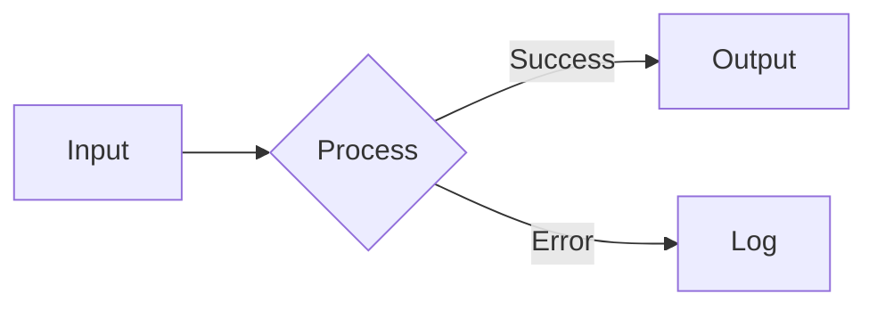
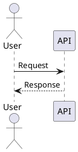

## slidev

> |


# Slidev Presentations - Developer Slide Decks

Generate production-quality presentations using Slidev (sli.dev) v52+. Slidev renders Markdown + Vue as web-based slides with code highlighting, animations, diagrams, and themes. Output is a `slides.md` file that runs via `bun run dev`.

## When to Use

- User asks to create a presentation, slide deck, talk, or slides
- User wants to convert content (blog post, README, docs) into slides
- User needs a conference talk, lightning talk, or workshop deck
- User asks to modify or improve existing Slidev presentations

## Generation Workflow

Follow this checklist for every presentation:

1. **Clarify scope**: Ask about topic, audience, duration, and style if not specified
2. **Choose template**: Tech talk (20-30 min), lightning talk (5-10 min), or workshop (60+ min)
3. **Outline first**: Draft slide titles before writing content (share with user for approval)
4. **Write slides.md**: Generate the complete file with headmatter, layouts, and content
5. **Apply polish**: Add animations (v-click), code highlighting, transitions, speaker notes
6. **Setup project**: Create package.json if new project, or write to existing slides.md
7. **Verify**: Ensure `---` separators have blank lines above and below, frontmatter is valid YAML

### Content Guidelines

- **One idea per slide** - never overload
- **6x6 rule**: Max 6 bullet points, max 6 words each (for bullet slides)
- **Code blocks**: Keep under 15 lines per slide, highlight key lines
- **Progressive disclosure**: Use v-click to reveal points step-by-step
- **Speaker notes**: Add for every non-obvious slide
- **Visual variety**: Alternate between text, code, diagram, and image slides

## Project Setup

### New Project

```bash
bun create slidev@latest my-presentation
cd my-presentation
bun install
bun run dev
```

### package.json

```json
{
  "name": "my-presentation",
  "private": true,
  "packageManager": "bun@1.2.22",
  "scripts": {
    "dev": "slidev --open",
    "build": "slidev build",
    "export": "slidev export"
  },
  "dependencies": {
    "@slidev/cli": "^52.0.0",
    "@slidev/theme-default": "latest"
  }
}
```

### Directory Structure

```
my-presentation/
├── slides.md            # Main presentation (you generate this)
├── package.json
├── components/          # Custom Vue components (optional)
├── public/              # Static assets (images, videos)
├── global-bottom.vue    # Persistent footer (optional)
├── setup/               # Shiki, Monaco, Mermaid config (optional)
└── snippets/            # External code files for import (optional)
```

## Slide Structure

### Headmatter (First Block)

Controls the entire presentation. Always include:

```yaml
---
theme: default
title: "Presentation Title"
info: |
  ## Presentation Title
  A brief description for the info dialog.
author: "Author Name"
transition: slide-left
mdc: true
lineNumbers: false
fonts:
  sans: Inter
  mono: Fira Code
---
```

### Slide Separator

Every slide boundary requires `---` with **blank lines** above and below:

```markdown
# Slide 1 Content

---

# Slide 2 Content
```

### Per-Slide Frontmatter

```yaml
---
layout: center
transition: fade
class: text-center
background: /image.jpg
---
```

### Speaker Notes

```markdown
# My Slide

Content here

<!--
Speaker notes go in HTML comments at the end.
They support **Markdown** formatting.
Visible only in presenter mode (press `p`).
-->
```

### Importing Slides from Other Files

Use `src:` in frontmatter to import slides from external files:

```yaml
---
src: ./pages/intro.md
---
```

Import specific slides: `src: ./pages/demo.md#2,5-7`

Each imported file can contain multiple slides with their own frontmatter. Useful for splitting long presentations into manageable files.

## Layout Reference

All 19 built-in layouts:

| Layout            | Purpose                            | Key Props / Slots                            |
| ----------------- | ---------------------------------- | -------------------------------------------- |
| `default`         | General content                    | -                                            |
| `center`          | Centered content                   | -                                            |
| `cover`           | Title/cover page                   | `background`                                 |
| `intro`           | Introduction with author           | -                                            |
| `section`         | Section divider                    | -                                            |
| `end`             | Thank you / final slide            | -                                            |
| `fact`            | Highlight a statistic or fact      | -                                            |
| `statement`       | Bold statement/affirmation         | -                                            |
| `quote`           | Quotation display                  | -                                            |
| `full`            | Full-bleed (uses all screen space) | -                                            |
| `none`            | Blank canvas (no styling)          | -                                            |
| `image`           | Full-screen image                  | `image`, `backgroundSize` (default: `cover`) |
| `image-left`      | Image left, content right          | `image`, `class`                             |
| `image-right`     | Image right, content left          | `image`, `class`                             |
| `iframe`          | Embedded webpage                   | `url`                                        |
| `iframe-left`     | Webpage left, content right        | `url`, `class`                               |
| `iframe-right`    | Webpage right, content left        | `url`, `class`                               |
| `two-cols`        | Two-column layout                  | Slot: `::right::`                            |
| `two-cols-header` | Header + two columns               | Slots: `::left::`, `::right::`               |

### Layout Examples

**Cover slide:**

```yaml
---
layout: cover
background: https://images.unsplash.com/photo-1...
class: text-center
---
# My Talk Title
Subtitle or tagline

<div class="abs-bl m-6 text-sm opacity-50">
Conference Name - Date
</div>
```

**Two columns:**

```markdown
---
layout: two-cols
---

# Left Column

- Point A
- Point B

::right::

# Right Column

- Point C
- Point D
```

**Image-right:**

```yaml
---
layout: image-right
image: /architecture.png
---
# System Architecture

Key components:
  - API Gateway
  - Message Queue
  - Database Cluster
```

### Custom Layouts

Create `layouts/my-layout.vue` with `<slot />` for content. Custom layouts override built-in ones with the same name. Layout loading priority: Slidev defaults > theme > addons > local `./layouts/`. See [references/custom-layouts.md](references/custom-layouts.md) for full guide.

## Animation Patterns

### v-click (Progressive Reveal)

```markdown
<v-clicks>

- First point (appears on click 1)
- Second point (click 2)
- Third point (click 3)

</v-clicks>
```

Or on individual elements:

```markdown
<div v-click>Appears on first click</div>
<div v-click>Appears on second click</div>
<div v-click.hide>This HIDES on click (visible initially)</div>
```

### v-after (Appear with Previous)

```markdown
<div v-click>Main point</div>
<div v-after>Supporting detail (appears simultaneously)</div>
```

### Click Ranges

```markdown
<div v-click="[2, 4]">Visible from click 2 through 4, hidden on 5</div>
```

### v-switch (Content Swap)

```markdown
<v-switch>
  <template #0>Step 1: Initial state</template>
  <template #1>Step 2: After first click</template>
  <template #2>Step 3: After second click</template>
</v-switch>
```

### v-motion (Animated Movement)

```markdown
<div
  v-motion
  :initial="{ x: -80, opacity: 0 }"
  :enter="{ x: 0, opacity: 1, transition: { delay: 200 } }"
>
  Slides in from left
</div>
```

### v-clicks Depth (Nested Lists)

```markdown
<v-clicks :depth="2">

- Parent item (click 1)
  - Child item (click 2)
  - Child item (click 3)
- Parent item (click 4)

</v-clicks>
```

### Click Positioning

```markdown
Relative: <div v-click="'+2'">Skips ahead by 2</div>
Absolute: <div v-click="3">Always on click 3</div>
Range: <div v-click="[2, 5]">Visible clicks 2 through 5</div>
```

### Click-Based Motion

```markdown
<div
  v-motion
  :initial="{ scale: 1 }"
  :click-1="{ scale: 1.5, x: 50 }"
  :click-2="{ scale: 1, x: 0 }"
  :leave="{ opacity: 0 }"
>
  Animates through click states
</div>
```

### v-mark (Rough Markers)

Hand-drawn style highlighting powered by Rough Notation:

```markdown
<span v-mark.red>Highlighted text</span>
<span v-mark.circle.orange>Circled</span>
<span v-mark.underline.blue="3">Underlined on click 3</span>
```

| Type                  | Effect               |
| --------------------- | -------------------- |
| `underline` (default) | Underline            |
| `circle`              | Circle around        |
| `box`                 | Box around           |
| `highlight`           | Background highlight |
| `strike-through`      | Strikethrough        |
| `crossed-off`         | X through            |

Colors: Any UnoCSS color name (`.red`, `.blue`, `.orange`, `.green`, etc.)

### Custom Transitions

Define CSS classes `.slidev-vt-NAME-forward/.backward` with standard Vue transition properties. Use `transition: my-name` in frontmatter. See [references/custom-transitions.md](references/custom-transitions.md) for full CSS template.

### Slide Transitions

Set in frontmatter per slide or globally in headmatter:

| Transition        | Effect                   |
| ----------------- | ------------------------ |
| `fade`            | Crossfade                |
| `fade-out`        | Fade out then in         |
| `slide-left`      | Slide from right to left |
| `slide-right`     | Slide from left to right |
| `slide-up`        | Slide from bottom to top |
| `slide-down`      | Slide from top to bottom |
| `view-transition` | View Transitions API     |

**Directional override** (forward | backward):

```yaml
---
transition: fade-out | slide-right
---
```

## Code Presentation Patterns

### Syntax Highlighting with Line Focus

````markdown
```ts {2,3}
function greet(name: string) {
  const message = `Hello, ${name}!`; // highlighted
  console.log(message); // highlighted
}
```
````

### Dynamic Highlighting (Click-Through)

````markdown
```ts {1-2|3-4|all}
// Step 1: Define the type
interface User {
  name: string;
  age: number;
}
// Step 2: Create instance (click)
const user: User = { name: "Alice", age: 30 };
```
````

### Line Numbers

````markdown
```ts {lines:true,startLine:5}
// Shows as line 5
// Shows as line 6
```
````

### Shiki Magic Move (Animated Code Transitions)

Wrap consecutive same-language code blocks in `````md magic-move`:

`````markdown
````md magic-move
```ts
// Step 1
const count = 1;
```

```ts
// Step 2 - code morphs smoothly
const count = ref(1);
const doubled = computed(() => count.value * 2);
```
````
`````

### Monaco Editor (Live Coding)

````markdown
```ts {monaco}
// Fully editable in the browser
console.log("Edit me live!");
```
````

### Monaco Run (Execute Code)

````markdown
```ts {monaco-run}
console.log("Runs in the browser!");
const result = 2 + 2;
console.log(`Result: ${result}`);
```
````

### Monaco Height

````markdown
```ts {monaco} {height:'auto'}
// Auto-grows with content
```
````

### TwoSlash (Inline Type Info)

````markdown
```ts twoslash
const msg = "Hello";
//    ^?
// Shows: const msg: "Hello"
```
````

### Code Import from File

````markdown
```ts
<<< @/snippets/example.ts
```

With line selection and highlighting:

```ts {2-5}
<<< @/snippets/example.ts#3-10
```
````

### Code Groups (Tabbed)

````markdown
:::code-group

```js [JavaScript]
console.log("Hello");
```

```ts [TypeScript]
console.log("Hello" as string);
```

```python [Python]
print("Hello")
```

:::
````

### Max Height (Scrollable)

````markdown
```ts {maxHeight:'200px'}
// Long code block becomes scrollable
```
````

## Styling Quick Reference

### UnoCSS Utilities (Built-in)

Use Tailwind-style classes anywhere:

```markdown
# Title {.text-gradient.from-blue-500.to-green-500}

<div class="grid grid-cols-2 gap-4 mt-8">
  <div class="bg-blue-500/10 p-4 rounded-lg">Column 1</div>
  <div class="bg-green-500/10 p-4 rounded-lg">Column 2</div>
</div>
```

### MDC Syntax (Inline Styling)

```markdown
# Red Title {.text-red-500}

Styled paragraph {style="font-size: 1.5em; color: #4a9"}
```

### Scoped CSS (Per-Slide)

```markdown
# My Slide

<style>
h1 { background: linear-gradient(45deg, #4EC5D4 10%, #146b8c 20%);
     background-clip: text; -webkit-text-fill-color: transparent; }
</style>
```

### Fonts

```yaml
---
fonts:
  sans: Inter
  serif: Playfair Display
  mono: Fira Code
  provider: google
---
```

### Icons (Iconify)

```markdown
<carbon-logo-github /> GitHub
<mdi-language-typescript class="text-blue-500" /> TypeScript
<logos-vue /> Vue.js
```

## Built-in Components

| Component           | Purpose                       | Key Props                                 |
| ------------------- | ----------------------------- | ----------------------------------------- |
| `<Arrow>`           | Draw directional line         | `x1, y1, x2, y2, color, width, two-way`   |
| `<VDragArrow>`      | Draggable arrow               | Inherits Arrow props                      |
| `<AutoFitText>`     | Auto-scaling text             | `max, min, modelValue`                    |
| `<LightOrDark>`     | Theme-conditional content     | Slots: `#dark`, `#light`                  |
| `<Link>`            | Internal slide navigation     | `to` (slide number)                       |
| `<RenderWhen>`      | Context-conditional rendering | `context` (main/presenter/print/overview) |
| `<SlideCurrentNo>`  | Current slide number          | -                                         |
| `<SlidesTotal>`     | Total slide count             | -                                         |
| `<Toc>`             | Table of contents             | `columns, maxDepth, minDepth, mode`       |
| `<Transform>`       | CSS transform wrapper         | `scale, origin`                           |
| `<Tweet>`           | Embed tweet                   | `id, scale`                               |
| `<Youtube>`         | Embed YouTube video           | `id, width, height`                       |
| `<SlidevVideo>`     | HTML5 video with controls     | `autoplay, autoreset, controls, poster`   |
| `<PoweredBySlidev>` | Attribution badge             | -                                         |

## Diagrams & Math

### Mermaid

````markdown

````

Supports: flowchart, sequence, class, state, ER, gantt, pie, git graph, mindmap.

### LaTeX / KaTeX

```markdown
Inline: $E = mc^2$

Block:

$$
\int_{0}^{\infty} e^{-x^2} dx = \frac{\sqrt{\pi}}{2}
$$
```

### PlantUML

Requires `plantUmlServer` in headmatter:

````markdown

````

## Global Layers

Persistent elements across all slides (create as Vue SFCs in project root):

| File                      | Scope      | Use Case               |
| ------------------------- | ---------- | ---------------------- |
| `global-top.vue`          | All slides | Headers, logos         |
| `global-bottom.vue`       | All slides | Footers, page numbers  |
| `slide-top.vue`           | Per-slide  | Slide-specific headers |
| `slide-bottom.vue`        | Per-slide  | Slide-specific footers |
| `custom-nav-controls.vue` | Navigation | Custom nav buttons     |

### Footer Example (global-bottom.vue)

```vue
<template>
  <footer
    v-if="$nav.currentLayout !== 'cover'"
    class="absolute bottom-0 left-0 right-0 p-4 flex justify-between text-xs opacity-50"
  >
    <span>My Presentation</span>
    <span>{{ $nav.currentPage }} / {{ $nav.total }}</span>
  </footer>
</template>
```

### $nav API

`$nav.currentPage`, `$nav.currentLayout`, `$nav.total`, `$nav.isPresenter`, `$nav.clicks`, `$nav.clicksTotal`

## Configuration Reference

### Key Headmatter Options

| Option           | Type    | Default   | Notes                                          |
| ---------------- | ------- | --------- | ---------------------------------------------- |
| `theme`          | string  | `default` | npm theme name or `none`                       |
| `title`          | string  | -         | Page title + first slide                       |
| `author`         | string  | -         | Author attribution                             |
| `transition`     | string  | -         | Default slide transition                       |
| `mdc`            | boolean | `true`    | Enable MDC inline syntax                       |
| `lineNumbers`    | boolean | `false`   | Code line numbers globally                     |
| `highlighter`    | string  | `shiki`   | Syntax highlighter                             |
| `monaco`         | string  | `dev`     | Monaco editor (dev/build/true/false)           |
| `colorSchema`    | string  | `auto`    | auto/dark/light                                |
| `aspectRatio`    | string  | `16/9`    | Canvas ratio                                   |
| `canvasWidth`    | number  | `980`     | Base canvas width                              |
| `routerMode`     | string  | `history` | history or hash                                |
| `download`       | boolean | `false`   | Show PDF download button                       |
| `record`         | string  | `dev`     | Recording mode                                 |
| `drawings`       | object  | `{}`      | `{ enabled, persist, presenterOnly, syncAll }` |
| `favicon`        | string  | -         | Custom favicon URL                             |
| `exportFilename` | string  | -         | Custom export filename                         |
| `wakeLock`       | string  | `build`   | Prevent screen sleep                           |
| `selectable`     | boolean | `false`   | Allow text selection in slides                 |
| `defaults`       | object  | -         | Default frontmatter for all slides             |
| `addons`         | array   | `[]`      | Slidev addons to load                          |

### Per-Slide Frontmatter Options

| Option        | Type    | Notes                       |
| ------------- | ------- | --------------------------- |
| `layout`      | string  | Slide layout name           |
| `zoom`        | number  | Scale slide content         |
| `drag`        | boolean | Enable draggable elements   |
| `clicks`      | number  | Set total click count       |
| `clicksStart` | number  | Start from click N          |
| `routeAlias`  | string  | Custom URL path             |
| `hide`        | boolean | Hide from presentation      |
| `disabled`    | boolean | Skip slide entirely         |
| `hideInToc`   | boolean | Hide from table of contents |
| `preload`     | boolean | Preload slide assets        |

### Popular Themes

Install via `bun add @slidev/theme-<name>`:

| Theme         | Style                      |
| ------------- | -------------------------- |
| `default`     | Clean, minimal             |
| `seriph`      | Serif typography, elegant  |
| `apple-basic` | Apple Keynote inspired     |
| `dracula`     | Dark theme, Dracula colors |
| `geist`       | Vercel Geist inspired      |

## Export & Deploy

### CLI Export

```bash
bun add -D playwright-chromium   # Required for export

slidev export                     # PDF (default)
slidev export --format pptx       # PowerPoint
slidev export --format png        # PNG images
slidev export --with-clicks       # Include click animations
slidev export --dark              # Dark mode
slidev export --range 1,3-5       # Specific slides
slidev export --with-toc          # PDF outline/bookmarks
```

### Build SPA

```bash
slidev build                      # Output to dist/
slidev build --base /talks/name/  # For sub-path hosting
```

### Deploy

- **Vercel**: `slidev build`, deploy dist/ (add `vercel.json` with SPA rewrite)
- **Netlify**: `slidev build`, publish dist/ (add `netlify.toml`)
- **GitHub Pages**: `slidev build --base /repo-name/`, deploy with GitHub Actions

## CLI Reference

### slidev dev

```bash
slidev [entry]                # Default: slides.md
```

| Flag                  | Default | Description                        |
| --------------------- | ------- | ---------------------------------- |
| `--port`, `-p`        | `3030`  | Server port                        |
| `--open`, `-o`        | `false` | Open in browser                    |
| `--remote [password]` | -       | Enable remote control              |
| `--force`, `-f`       | `false` | Force re-bundle                    |
| `--theme`, `-t`       | -       | Theme override                     |
| `--log`               | `warn`  | Log level (error/warn/info/silent) |

### slidev build

```bash
slidev build [entry]
```

| Flag              | Default | Description           |
| ----------------- | ------- | --------------------- |
| `--out`, `-o`     | `dist`  | Output directory      |
| `--base`          | `/`     | Base URL for hosting  |
| `--download`      | `false` | Enable PDF download   |
| `--without-notes` | `false` | Exclude speaker notes |

### slidev export

```bash
slidev export [entry]
```

| Flag                  | Default | Description                   |
| --------------------- | ------- | ----------------------------- |
| `--format`            | `pdf`   | pdf / pptx / png / md         |
| `--output`            | -       | Output path                   |
| `--range`             | -       | Slide range (e.g., `1,3-5,8`) |
| `--with-clicks`, `-c` | `false` | Export click animations       |
| `--with-toc`          | `false` | Generate PDF outline          |
| `--dark`              | `false` | Dark mode export              |
| `--per-slide`         | `false` | Export each slide separately  |
| `--omit-background`   | `false` | Remove background (PNG)       |
| `--timeout`           | `30000` | Render timeout (ms)           |
| `--wait`              | -       | Delay before export (ms)      |

### Other Commands

```bash
slidev format [entry]           # Auto-format slides
slidev theme eject [--dir dir]  # Extract theme for customization
```

## Interactive Features

### Drawing Mode

Press `e` to toggle drawing mode. Configure in headmatter:

```yaml
---
drawings:
  enabled: true
  persist: false
  presenterOnly: false
  syncAll: true
---
```

Features: pen, eraser, color picker, undo/redo, clear all. Drawings can be persisted across sessions and synced to connected clients.

### Draggable Elements

Use `v-drag` to make elements repositionable:

```markdown
<div v-drag="'my-element'">
  Drag me around!
</div>

<v-drag pos="100,200,300,100">
  Positioned draggable box
</v-drag>
```

Positions persist across page reloads when `drag: true` is set in frontmatter.

### Slide Lifecycle Hooks

Use in `<script setup>` to run code when slides activate/deactivate:

```markdown
<script setup>
import { onSlideEnter, onSlideLeave, useIsSlideActive } from "@slidev/client";
import { ref, watch } from "vue";

const isActive = useIsSlideActive();

onSlideEnter(() => {
  console.log("Slide entered");
});

onSlideLeave(() => {
  console.log("Slide left - cleanup here");
});
</script>
```

Essential for starting/stopping animations, timers, or API calls scoped to a specific slide.

## Design Best Practices

### Slide Flow Pattern

A well-structured presentation follows this arc:

1. **Hook** (1 slide) - cover with compelling title
2. **Problem** (1-3 slides) - why this matters
3. **Solution** (core slides) - the meat, with code/diagrams
4. **Demo** (optional) - live code or screenshots
5. **Summary** (1 slide) - key takeaways
6. **Call to Action** (1 slide) - what to do next, links/resources

### Visual Hierarchy

- Use `layout: section` between major topics for pacing
- Alternate slide types: text -> code -> diagram -> image
- Use `layout: fact` or `layout: statement` for impact moments
- Limit bullet slides to ~30% of total (avoid "wall of bullets")
- Use `layout: two-cols` for comparisons (before/after, pros/cons)

### Animation Discipline

- Use `v-clicks` on bullet lists by default (progressive reveal)
- Use dynamic code highlighting (`{1-2|3-4|all}`) for code walkthroughs
- Limit v-motion to 1-2 key moments (not every element)
- Set a consistent `transition: slide-left` in headmatter
- Don't over-animate - clarity beats flash

## Starter Templates

### Tech Talk (20-30 min, ~25 slides)

Structure: cover -> section -> content slides -> two-cols comparison -> section -> end

Key slides in the template:

**Headmatter:**

```yaml
theme: default
title: "Introduction to TypeScript Generics"
author: "Your Name"
transition: slide-left
mdc: true
fonts:
  sans: Inter
  mono: Fira Code
```

**Cover slide** (layout: default, class: text-center):
Title + subtitle + conference attribution in `abs-bl` div.

**Section dividers** (layout: section):
Use between major topics: "Why Generics?", "Real-World Patterns"

**Problem slide** with animated code highlighting:

````
```ts {all|2|4|all}
function identity(arg: any): any {
  return arg  // Type info lost!
}
const result = identity("hello")
// result is 'any', not 'string'
````

````
Followed by `<v-click>` for the key insight.

**Solution slide** with the same animated pattern.

**Comparison slide** (layout: two-cols):
Before code on left, `::right::` separator, After code on right.

**End slide** (layout: end, class: text-center):
"Thank You!" with social links.

### Lightning Talk (5-10 min, ~10 slides)

Structure: cover -> [fact -> content] repeated -> end

**Pattern**: Alternate between `layout: fact` (number + topic name) and default layout (explanation + code). Keeps pace fast.

**Headmatter:** Minimal - just theme, title, transition, mdc.

**Example fact slide:**
```yaml
layout: fact
````

```
# 1
## Container Queries
```

**Content slide with v-click punchline:**
Show the code block, then reveal the key insight via `<v-click>`.

**End slide** (layout: end): Short call to action.

### Workshop (60+ min, ~40 slides)

Structure: cover -> prerequisites -> [section -> explanation -> exercise] repeated -> end

**Extra headmatter**: `lineNumbers: true` (workshops need line refs).

**Cover slide**: Include repo clone URL in `abs-bl` div.

**Prerequisites slide**: Use `<v-clicks>` for checklist + code block for setup command.

**Section dividers** (layout: section): "Part 1: Setup & Basics", "Part 2: CRUD Operations"

**Explanation slides**: Use `<v-clicks>` for feature lists.

**Exercise slides**: Use `{monaco}` code blocks for live editing. Include `bun run dev` command. Add speaker notes with timing hints.

**End slide** (layout: end): Links to docs, repo, and solutions branch.

### Template Usage

When generating a presentation, pick the closest template and adapt:

1. Copy the structure (slide flow and layout choices)
2. Replace content with the user's topic
3. Add/remove slides to match target duration (~1 slide per minute)
4. Apply code highlighting, v-clicks, and speaker notes

## Reference Files

For advanced features, read the appropriate reference file:

| File                                                      | Content                                                     | When to Read                                   |
| --------------------------------------------------------- | ----------------------------------------------------------- | ---------------------------------------------- |
| [custom-layouts.md](references/custom-layouts.md)         | Custom Vue layout creation, slots, inheritance              | Need a layout beyond the 19 built-in           |
| [custom-transitions.md](references/custom-transitions.md) | Custom CSS transitions, direction styles, animation classes | Want custom transition effects                 |
| [setup-files.md](references/setup-files.md)               | Shiki, Monaco, Mermaid, KaTeX, shortcuts config             | Need to customize highlighting, diagrams, math |
| [theming.md](references/theming.md)                       | Theme creation, ejection, CSS variables, publishing         | Want to create or customize a theme            |
| [deployment.md](references/deployment.md)                 | GitHub Pages, Netlify, Vercel, Docker configs               | Need platform-specific deploy configs          |
| [vue-components.md](references/vue-components.md)         | Custom components, composables, $nav API deep dive          | Need interactive Vue components in slides      |
| [presenter-tools.md](references/presenter-tools.md)       | Recording, camera, remote control, timer                    | Need presenter workflow features               |

For features not covered in main or reference files, consult the official docs at https://sli.dev.


<!-- Generated from ~/agents/skills/slidev-presentations/skill.yaml -->
<!-- Do not edit directly - changes will be overwritten on next sync -->

---
> Source: [duhman/slidev](https://github.com/duhman/slidev) — distributed by [TomeVault](https://tomevault.io).
<!-- tomevault:4.0:gemini_md:2026-06-17 -->
