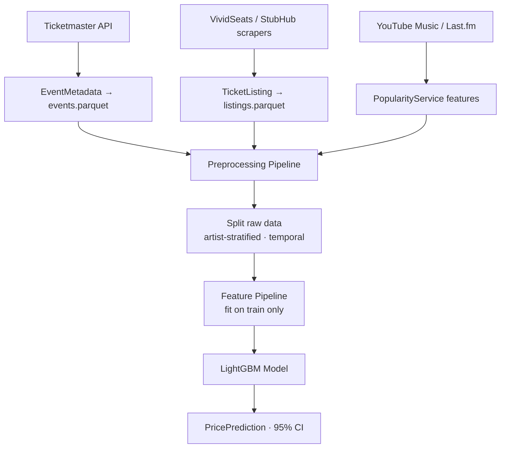

## ticket-price-predictor

> ML system for predicting secondary-market ticket prices at the seat-zone level using historical time-series data, demand signals, and event context.

# Ticket Price Predictor

ML system for predicting secondary-market ticket prices at the seat-zone level using historical time-series data, demand signals, and event context.

## Project Structure

```
src/ticket_price_predictor/
├── api/                    # External API clients (Ticketmaster, Setlist.fm)
├── schemas/                # Pydantic data models
├── storage/                # Parquet storage layer (repositories)
├── ingestion/              # Data collection services
├── scrapers/               # VividSeats/StubHub web scrapers (Playwright)
├── normalization/          # Seat zone normalization
├── validation/             # Data quality checks
├── preprocessing/          # Data cleaning, validation, transformation pipeline
├── popularity/             # External popularity aggregation (YouTube Music, Last.fm)
├── synthetic/              # Synthetic data generation
└── ml/                     # Machine learning pipeline
    ├── features/           # Feature extractors (10 domains, 67 features with snapshot / 63 without)
    │   ├── performer.py    # Artist stats + artist×zone encoding
    │   ├── event.py        # Event/location features
    │   ├── seating.py      # Seat zone features
    │   ├── timeseries.py   # Time-to-event & momentum features
    │   ├── popularity.py   # External API popularity features
    │   ├── regional.py     # Regional price variation features
    │   ├── event_pricing.py # Event-level target encoding (strongest features)
    │   ├── geo_mapping.py  # City→country/region lookup helpers
    │   └── pipeline.py     # Feature pipeline orchestration
    ├── models/             # Baseline (Ridge) + LightGBM + Quantile LightGBM
    ├── training/           # Training pipeline (split-first, no leakage)
    │   ├── splitter.py     # TimeBasedSplitter with artist stratification
    │   ├── trainer.py      # ModelTrainer with leak-free flow
    │   └── evaluator.py    # Model evaluation metrics
    ├── tuning/             # Optuna hyperparameter tuning
    └── inference/          # Prediction service with cold-start handling
```

## Quick Commands

```bash
# Data collection
python scripts/collect_listings.py --artist "Bruno Mars" --max-events 3
python scripts/ingest_events.py --event-types concert --cities "Las Vegas"

# Model training
python scripts/train_model.py --model lightgbm --version v13
python scripts/train_model.py --from-study lightgbm_aggressive --version v14

# Hyperparameter tuning
python scripts/tune_model.py --n-trials 50

# Predictions
python scripts/predict.py --artist "BTS" --city "Tampa" --all-zones

# Preprocessing
python scripts/preprocess_data.py

# Quality checks
make check   # lint + typecheck + test
make test    # pytest only
```

## Key Patterns

- **Pydantic models** for all data schemas with Parquet serialization
- **Repository pattern** for data access (EventRepository, ListingRepository, SnapshotRepository)
- **Feature extractors** implement `FeatureExtractor` base class with `fit()` and `extract()`
- **Split-first training** — raw data is split temporally before feature extraction to prevent data leakage
- **Artist stratification** — each artist is split independently by time for balanced representation
- **ArtistStatsCache** computes popularity from historical data (no hardcoded lists)
- **RegionalStatsCache** computes city/country/global price stats with fallback chain
- **Preprocessing pipeline** with cleaners, validators, and transformers (PipelineBuilder)

## Data Flow



The dashed **split-before-fit** boundary is the leakage guard: everything downstream of
`Split raw data` is fitted on the training split only. See
[`docs/ARCHITECTURE.md`](docs/ARCHITECTURE.md) for the full layer-dependency graph.

## Training Pipeline

The training pipeline prevents data leakage by:
1. Filtering invalid prices (<$10) and capping outliers at 95th percentile
2. Normalizing city names for consistent regional grouping
3. Normalizing artist name aliases (e.g. "BTS - Bangtan Boys" → "BTS")
4. Splitting raw data temporally with artist stratification (`split_raw()`)
4. Fitting the feature pipeline on training data only (with Bayesian-smoothed regional stats)
5. Transforming train/val/test independently
6. Removing zero-variance features and log-transforming price-based features
7. Log-transforming target (`np.log1p`) for better skewed-price handling
8. Training LightGBM with GBDT boosting + Huber loss and early stopping (patience=100)

## Issue Tracking

When you encounter a major issue during any task (bugs with non-obvious root causes, feature engineering experiments that failed or succeeded unexpectedly, data quality problems, performance regressions, or architectural decisions with significant trade-offs), document it in `docs/issues/`. Use the next available number following the format `NNN-short-description.md` with sections: Problem, Impact, Root Cause, Solution, Outcome. Mark status as Open or Resolved and severity as Critical/High/Medium.

## Agent Evaluation

Agent-readiness is measured, not assumed. [`evals/`](evals/README.md) runs a suite of
acceptance tasks (doc-path integrity, the `ml/` layer invariant, decision-log indexing,
module compilation) and records a pass-rate to `evals/agent-results.json` — an agent-run log
and baseline for telemetry. Run `make evals` (or `python evals/run_evals.py`) after any
agent-driven change; a drop below threshold fails the run so regressions surface early.

## Environment

- Python >=3.11, uv for package management
- Key deps: pydantic, pyarrow, lightgbm, scikit-learn, playwright
- API keys in `.env`: `TICKETMASTER_API_KEY`, `LASTFM_API_KEY`

## Current Model Performance (v36 — StackingEnsembleV2)

- **MAE**: $83.63
- **MAPE**: 46.5%
- **R²**: 0.6734
- **RMSE**: $141.35
- **Dataset**: ~2,900 events, ~1,060 artists (197,857 listings)
- **Model**: StackingEnsembleV2 (LightGBM Huber + LightGBM deeper + ResidualModel → Ridge meta-learner)
- **Top features**: `event_section_median_price` (49.1%), `event_zone_median_price` (16.6%), `artist_regional_median_price` (5.3%), `event_median_price` (5.3%), `artist_regional_avg_price` (3.6%)
- **Key improvements over v34**: MAPE -11.9% (52.8→46.5%), R² +9.4% (0.615→0.673), stacking ensemble, 12 new section structural features
- **Feature pipeline**: 11 domains, 81 active features after zero-variance removal
- **Known limitation**: Test MAE bottlenecked by unseen events (43% of test, $128.91 MAE) vs seen events ($52.75 MAE). Event-level target encoding provides weak signal for temporally unseen events.

## Sale Probability Model (CVR v3)

- **AUC-ROC**: 0.7653
- **ECE**: 0.1525
- **Best iteration**: 1830
- **Label strategy**: Inventory depletion (30% threshold, 48h window, ~20% positive rate)
- **Top features**: `days_to_event` (21.8%), `days_to_event_squared` (10.8%), `event_listing_count` (7.7%), `day_of_week` (5.5%), `artist_regional_listing_count` (4.8%)

---
> Source: [dxlpi/ticket-price-predictor](https://github.com/dxlpi/ticket-price-predictor) — distributed by [TomeVault](https://tomevault.io).
<!-- tomevault:4.0:gemini_md:2026-07-08 -->
