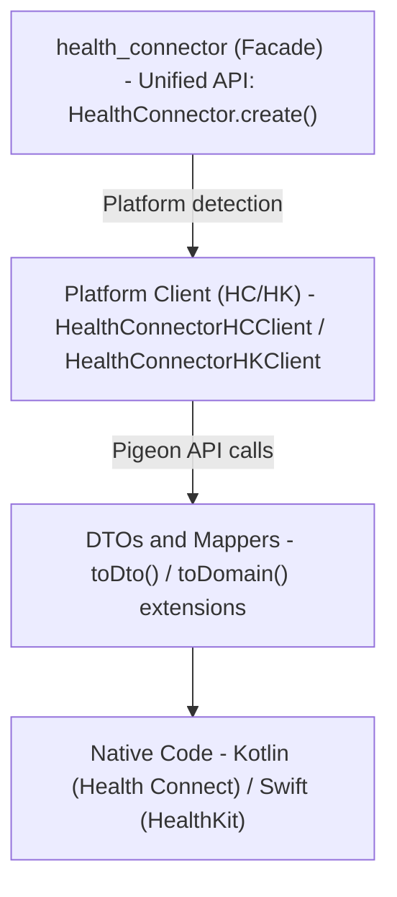

## health-connector

> This file provides guidance to Claude Code (claude.ai/code) when working with code in this repository.

# CLAUDE.md

This file provides guidance to Claude Code (claude.ai/code) when working with code in this repository.

## Project Overview

Health Connector is a Flutter plugin monorepo providing unified access to health data across Android (Health Connect)
and iOS (HealthKit). Uses Melos for workspace management and Pigeon for type-safe platform channels.

## Rules

1. Always use Context7 MCP when I need library/API documentation, code generation, setup or configuration steps without me having to explicitly ask.

## Package Structure

- **health_connector** - Main facade package (public API)
- **health_connector_core** - Domain models and abstractions
- **health_connector_hc_android** - Android Health Connect implementation
- **health_connector_hk_ios** - iOS HealthKit implementation
- **health_connector_lint** - Shared lint rules
- **health_connector_logger** - Logging utilities

## Directory Structure

```text
.github/
├── actions/                     # setup-cocoapods, setup-flutter, setup-gradle, setup-java, setup-melos
└── workflows/                   # CI/CD and reusable workflow definitions
doc/
├── assets/videos/               # Demo GIFs
└── guides/migration_guides/
examples/                        # Example Flutter app
packages/
├── health_connector             # Main facade (public API)
├── health_connector_core        # Domain models and abstractions
├── health_connector_hc_android  # Android Health Connect implementation
├── health_connector_hk_ios      # iOS HealthKit implementation
├── health_connector_lint        # Shared lint rules
└── health_connector_logger      # Logging utilities
CLAUDE.md
pubspec.yaml                     # Root pubspec for melos bootstrap
README.md
LICENSE
```

## Essential Commands

### Setup

```bash
dart pub get                    # Install dependencies (runs melos bootstrap)
```

### Running Tests

```bash
melos run test:dart                   # All Dart/Flutter tests
melos run test:kotlin                 # Kotlin unit tests for `health_connector_hc_android` plugin
fvm flutter test                      # Run tests in current package
fvm flutter test test/path_test.dart  # Run single test file
```

### Code Quality

```bash
melos run analyze               # All analysis (Dart, Swift, Kotlin)
melos run analyze:dart:strict   # Dart with fatal warnings
melos run format                # Format all code
melos run format:check          # Check formatting without changes
```

### Platform-Specific

```bash
melos run analyze:swift         # SwiftLint
melos run analyze:kotlin        # Detekt
melos run format:swift          # SwiftFormat
melos run format:kotlin         # KtLint format
```

### Code Generation

```bash
melos run pigeon                # Regenerate platform channel code
```

## Architecture

The project follows a **Plugin Architecture** with facade pattern:

1. **Core Layer** (`health_connector_core`): Defines interfaces, data types, and abstractions
2. **Platform Layer** (`health_connector_hc_android`, `health_connector_hk_ios`): Platform-specific implementations
   using Pigeon-generated code
3. **Facade Layer** (`health_connector`): Unified public API that abstracts platform differences

### Data Flow



### Mapper Pattern

Platform packages use extension methods to convert between DTOs and domain models:

- `record.toDto()` - Domain model → DTO (for writing to platform)
- `dto.toDomain()` - DTO → Domain model (for reading from platform)

Mappers are organized by health record type in `lib/src/mappers/health_record_mappers/`

## Code Generation

Pigeon generates type-safe platform channel code:

- Input: `packages/health_connector_hc_android/pigeon/health_connector_hc_android_api.dart`
- Input: `packages/health_connector_hk_ios/pigeon/health_connector_hk_ios_api.dart`
- Generated files: `*.g.dart`, `*.g.kt`, `*.g.swift` (excluded from linting)

After modifying Pigeon input files, run `melos run pigeon` to regenerate.

## Lint Configuration

- **Dart**: Uses `health_connector_lint` package, excludes `*.g.dart`
- **Kotlin**: Detekt + KtLint, excludes `*.g.kt`
- **Swift**: SwiftLint (strict mode with baseline), excludes `*.g.swift`

## Testing Patterns

- **Dart**: Uses `mocktail` for mocking, `parameterized_test` for data-driven tests
- **Kotlin**: JUnit 5 + MockK + Kotest assertions + Robolectric
- Test files located in `test/` directories within each package
- Platform packages use `test/unit_tests/` subdirectory structure mirroring `lib/src/`
- Kotlin tests in `example/android/src/test/kotlin`

## Platform Differences

Some APIs behave differently across platforms:

- **Record updates**: Only supported on Android Health Connect; iOS HealthKit uses immutable records
- **Permission status**: iOS read permissions always return `unknown` for privacy
- **Feature permissions**: iOS returns `granted` by default (features always available)

Use `@supportedOnHealthConnect` annotation to mark Android-only APIs.

---
> Source: [fam-tung-lam/health_connector](https://github.com/fam-tung-lam/health_connector) — distributed by [TomeVault](https://tomevault.io).
<!-- tomevault:4.0:gemini_md:2026-05-04 -->
