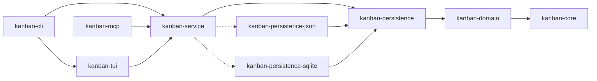

## kanban

> This file provides guidance to Claude Code (claude.ai/code) when working with code in this repository.

# CLAUDE.md

This file provides guidance to Claude Code (claude.ai/code) when working with code in this repository.

**See also:**
- [CONTRIBUTING.md](CONTRIBUTING.md) - Development workflow, code style, testing, and PR guidelines
- [README.md](README.md) - Project overview, features, installation, and usage

## Project Overview

This is a **terminal-based kanban/project management tool** written in **Rust**, inspired by lazygit's interface design. It follows **SOLID principles** with a clean, modular architecture using Cargo workspaces.

**Tech Stack**:
- Language: Rust (2021 edition)
- TUI Framework: ratatui + crossterm
- Async Runtime: Tokio
- Development Environment: Nix

## Architecture Philosophy

### SOLID Principles Applied

1. **Single Responsibility**: Each crate has one clear purpose
2. **Open/Closed**: Domain models are extensible through traits
3. **Liskov Substitution**: Repository and Service traits enable polymorphism
4. **Interface Segregation**: Minimal, focused trait definitions
5. **Dependency Inversion**: All layers depend on abstractions (traits)

### Workspace Structure

```
crates/
├── kanban-core/               # Core traits, errors, and result types
├── kanban-domain/             # Domain models (Board, Card, Column, Sprint)
├── kanban-persistence/        # Persistence traits, registry, and shared types
├── kanban-persistence-json/   # JSON file storage backend
├── kanban-persistence-sqlite/ # SQLite storage backend
├── kanban-service/            # Service layer: KanbanContext, persistence orchestration
├── kanban-tui/                # Terminal UI with ratatui
├── kanban-cli/                # CLI entry point
└── kanban-mcp/                # Model Context Protocol server for LLM integration
```

**Dependency Flow** (respecting dependency inversion):



## Development Environment

### Nix Setup
```bash
nix develop            # Enter development shell
```

The shell provides:
- Rust toolchain (stable, rust-analyzer, rust-src)
- cargo-watch, cargo-edit, cargo-audit, cargo-tarpaulin
- bacon (background compiler)

## Common Commands

### Building
```bash
cargo build            # Build all crates
cargo build --release  # Optimized production build
nix build              # Build with Nix (reproducible)
```

### Running
```bash
cargo run              # Launch TUI
cargo run -- tui       # Explicit TUI mode
cargo run -- init --name "My Board"  # Initialize board
```

### Development
```bash
cargo watch -x run     # Auto-rebuild on changes
bacon                  # Background compiler with diagnostics
cargo check            # Fast compilation check
cargo clippy           # Linting
cargo fmt              # Format code
```

### Testing
```bash
cargo test             # Run all tests
cargo test --package kanban-domain  # Test specific crate
cargo tarpaulin        # Code coverage
```

## Crate Descriptions

### kanban-core
**Purpose**: Foundation crate with shared abstractions

- `KanbanError` - Centralized error types
- `KanbanResult<T>` - Standard result type
- `Repository<T, Id>` - Generic repository trait
- `Service<T, Id>` - Generic service trait

**Design Pattern**: Error handling with thiserror, async traits

### kanban-domain
**Purpose**: Pure domain models with business logic

**Models**:
- `Board` - Top-level kanban board
- `Column` - Board columns with WIP limits
- `Card` - Task cards with priority, status, due dates
- `Tag` - Categorization tags

**Design Pattern**: Rich domain models with behavior, no infrastructure dependencies

### kanban-persistence
**Purpose**: Persistence trait layer — defines `PersistenceStore`, `StoreFactory`, `StoreRegistry`, and shared types (errors, snapshots, conflict detection, file watching)

- `PersistenceStore` - Async trait for load/save operations
- `StoreFactory` - Trait for backend registration (`name`, `supported_patterns`, `matches`, `create`)
- `StoreRegistry` - Registry that matches a locator string to the right factory
- `StoreSnapshot`, `PersistenceMetadata` - Shared serialization types
- `ConflictResolver`, `FormatVersion`, `MigrationStrategy` - Shared abstractions

**Design Pattern**: Trait-based abstraction layer; backends register via `StoreFactory`

### kanban-persistence-json
**Purpose**: JSON file storage backend implementing `StoreFactory`

- `JsonFileStore` - `PersistenceStore` impl with atomic writes (temp file + rename)
- `JsonStoreFactory` - Matches `*.json` and any non-URI path (catch-all fallback)
- V2 format with metadata envelope; automatic V1→V2 migration with `.v1.backup`
- Debounced saving (500ms minimum interval)

### kanban-persistence-sqlite
**Purpose**: SQLite storage backend implementing `StoreFactory`

- `SqliteStore` - `PersistenceStore` impl with WAL mode, foreign keys, max 2 connections
- `SqliteStoreFactory` - Matches `*.sqlite`, `*.sqlite3`, and `*.db`
- Relational schema (14 tables: metadata, boards, columns, cards, sprints, etc.)
- Schema versioning (v1) with migration skeleton
- Auto-creates database file on first use

### kanban-tui
**Purpose**: Terminal UI implementation

- `app` - Application state and main loop
- `ui` - Rendering components (ratatui widgets)
- `events` - Keyboard/terminal event handling

**Design Pattern**: Event-driven architecture, component-based rendering

### kanban-cli
**Purpose**: CLI entry point and command parsing

- Uses clap for command-line argument parsing
- Initializes tracing/logging
- Coordinates TUI launch

## Code Style Guidelines

### Rust Best Practices
- Use `impl Trait` for return types when appropriate
- Prefer `&str` over `String` for function parameters
- Use `Result<T, E>` for recoverable errors, `panic!` only for unrecoverable
- Leverage type system for compile-time guarantees
- Keep functions small and focused (< 50 lines)

### Error Handling
- All public APIs return `KanbanResult<T>`
- Use `thiserror` for error definitions
- Provide context with error messages
- Use `anyhow` only in application layer (kanban-cli)

### Async Patterns
- Use `async-trait` for async trait methods
- Tokio runtime for async execution

### Testing

**TDD workflow (mandatory — Red → Green → Refactor):**

1. **Red**: Write a failing test that specifies the expected behavior. Present tests to the user for review before implementing anything.
2. **Green**: Write the minimum implementation needed to make the test pass. Do not over-engineer at this step.
3. **Refactor**: Clean up implementation and tests without breaking anything. This step is not optional.
4. No feature or fix is complete until all tests pass and the refactor step is done.

**Test naming:** Names are living documentation. Use the pattern `test_<scenario>_<expected_outcome>`, e.g. `test_move_card_to_full_column_returns_wip_limit_error`. Avoid generic names like `test1` or `it_works`.

**Test return types:** Prefer `-> KanbanResult<()>` over `#[should_panic]`. This gives better failure messages and composes with `?`. Use `#[should_panic]` only for unrecoverable invariant violations.

**Test requirements by layer:**

| Layer | Test Type | Pattern |
|---|---|---|
| `kanban-core`, `kanban-domain` | Inline unit tests (`#[cfg(test)]`) | Pure logic, no I/O, no mocks needed |
| `kanban-persistence` | Inline unit tests | Trait contracts, registry logic |
| `kanban-persistence-json` | Inline unit tests + real tempfile I/O | Serialization, migration, round-trips |
| `kanban-persistence-sqlite` | Inline unit tests + real tempfile I/O | Schema, round-trips, concurrent access |
| `kanban-service` | Integration tests in `tests/` | `#[tokio::test]`, `KanbanContext` with real persistence via `TempDir` |
| `kanban-tui` | Integration tests in `tests/` | Component instantiation, key event simulation, export/import flows |
| `kanban-cli` | Integration tests in `tests/` | `assert_cmd` + real binary invocation via `cargo_bin_cmd!` |
| `kanban-mcp` | Integration tests in `tests/` | End-to-end tool calls against a real `KanbanContext` |

**Coverage:** Use `cargo tarpaulin` to verify no untested paths exist. 100% line coverage is the floor, not the goal — every assertion must verify observable behavior or an invariant, not just execute a code path.

**Refactoring for testability:** If a function cannot be tested in isolation, refactor before writing tests:
- Extract logic from handlers/renderers into pure functions
- Introduce trait abstractions for dependencies (e.g. I/O, time)
- Use `mockall` for mocking traits where real I/O is impractical

## Inspirations from lazygit

- **Keyboard-driven**: Vim-like navigation
- **Panel-based layout**: Multiple views (boards, columns, cards)
- **Contextual commands**: Bottom panel shows available shortcuts
- **Fast navigation**: hjkl movement, quick jumps
- **Visual clarity**: Clear separation of concerns in UI

## Development Workflow

0. **Tests First**: Follow the TDD workflow in [Testing](#testing) — write and present failing tests before any implementation.
1. **Domain First**: Define models in `kanban-domain`
2. **Persistence Layer**: Implement storage in `kanban-persistence`
3. **Service Layer**: Orchestrate operations in `kanban-service`
4. **TUI Components**: Build UI in `kanban-tui`
5. **Integration**: Wire up in `kanban-cli`

## Commit Message Convention

Use conventional commits with the crate name as scope, dropping the `kanban-` prefix:

```
<type>(<crate>): <description>
```

**Types:** `feat`, `fix`, `test`, `refactor`, `chore`, `docs`

**Scope:** crate name without the `kanban-` prefix — e.g. `tui`, `domain`, `service`, `persistence`, `cli`, `mcp`, `core`

**Examples:**
```
feat(tui): preselect first board and refresh card view on startup
fix(service): handle empty board list on context init
test(tui): preselect first board and refresh card view on startup
refactor(domain): extract card sorting into pure function
```

Split commits by type — tests and implementation go in separate commits.

## Guidelines

- **No comments** unless documenting public APIs or complex algorithms
- **Small, focused modules**: Each file should have < 300 lines
- **Reusability**: Extract common patterns into traits
- **Type safety**: Leverage newtype pattern (e.g., `BoardId`, `CardId`)
- **Immutability**: Prefer immutable data, use `&mut` only when necessary

---
> Source: [fulsomenko/kanban](https://github.com/fulsomenko/kanban) — distributed by [TomeVault](https://tomevault.io).
<!-- tomevault:4.0:gemini_md:2026-05-05 -->
