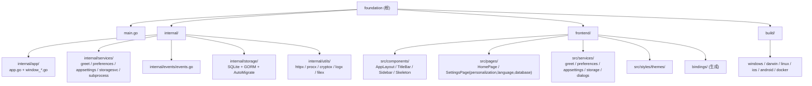

## foundation

> `foundation` 是一个开箱即用的跨平台桌面应用脚手架，基于 Wails v3 + React 19 + MUI 9，为新项目提供：

# Foundation - Wails v3 桌面应用脚手架

## 项目愿景

`foundation` 是一个开箱即用的跨平台桌面应用脚手架，基于 Wails v3 + React 19 + MUI 9，为新项目提供：

- 已分层的 Go 后端（`internal/app` + `internal/services` + `internal/events`）
- 已分平台的窗口配置（Windows/Linux 无边框前端自绘，macOS 沉浸式标题栏保留红绿灯）
- 已落地的前端 MVVM 规范（每个组件 / 页面独立文件夹，View / ViewModel / Style 三件分离）
- 已实现的 Discord 风格三栏布局（ServerList + ChannelList + Content）+ 方圆按钮主题
- README 中的「改名引导」让使用者一步把脚手架变成自己的项目

## 架构总览

- 后端：Go 1.25，`main.go` 仅做 `embed.FS` + `app.Run`，业务装配集中在 `internal/app`。
- 前端：React 19 + TypeScript（strict）+ MUI 9 + Vite 8，主题统一在 `frontend/src/styles/theme.ts`。
- 通信：通过 `wails3 generate bindings` 生成 `frontend/bindings/foundation/...`，前端 `services/` 层包装。
- 构建：根 `Taskfile.yml` 调用各平台子 Taskfile（Windows/macOS/Linux/iOS/Android/Docker）。

通信链路：

```
React 组件 (View)
    └── ViewModel (use<Page>)
        └── services/GreetService.ts
            └── @bindings/foundation/internal/services/greet (Wails 生成)
                └── 后端 internal/services/greet.Greet

后端 internal/events/events.go (RegisterEvent[string]("time"))
    └── internal/app/app.go: app.Event.Emit("time", ...)
        └── 前端 shared/hooks/useTimeEvent.ts (Events.On)
```

## 模块结构图



## 模块索引

| 模块 | 路径 | 语言/技术 | 一句话职责 |
|------|------|-----------|------------|
| 应用入口 | `main.go` | Go | 仅含 `embed.FS` 与 `app.Run(assets)`，业务下沉到 `internal/` |
| 应用启动 | `internal/app/` | Go | 服务注册、平台窗口配置、事件循环 |
| 业务服务 | `internal/services/` | Go | Wails Service（每个领域一个子包：greet / preferences / appsettings / storagesvc / subprocess） |
| 持久化层 | `internal/storage/` | Go + GORM | SQLite 打开 / PRAGMA / AutoMigrate / 路径配置 / Holder |
| 工具层 | `internal/utils/` | Go | httpx（HTTP）/ procx（子进程 + JobObject）/ cryptox（AES-GCM）/ logx（slog + rotate）/ filex（原子写） |
| 事件契约 | `internal/events/` | Go | 集中注册类型化事件，前后端共享名称 |
| 前端 UI | `frontend/` | React 19 + MUI 9 + TS | 用户界面、调用 Service、订阅事件 |
| 多平台构建 | `build/` | Taskfile / Gradle / Shell / nfpm | 各平台打包脚本与资源 |

## 运行与开发

前置条件：Go 1.25+、Node.js + pnpm、`wails3` CLI、`task` (go-task)。

| 命令 | 说明 |
|------|------|
| `wails3 dev` 或 `task dev` | 前后端热重载（Vite 端口默认 9245） |
| `wails3 generate bindings` | 重新生成 `frontend/bindings/<module>/...` |
| `task build` | 当前 OS 生产构建 |
| `task package` | 当前 OS 打包 |
| `cd frontend && pnpm install` | 首次或更新依赖后 |
| `cd frontend && pnpm typecheck` | TypeScript 类型检查 |
| `cd frontend && pnpm build` | 前端单独生产构建 |
| `go build .` | 后端单独构建（需要 `frontend/dist` 已存在） |

## 改名 / 业务化指南

由于 `foundation` 既是模块名又是 bindings 路径前缀，改名顺序很关键：

1. 改 `go.mod` 的 `module foundation` → `module <你的名字>`
2. 全局替换 `import "foundation/internal/app"` 为新模块名
3. 改前端 `services/greet/GreetService.ts` 中的 `@bindings/foundation/...` 路径
4. 跑 `go mod tidy` 与 `wails3 generate bindings`
5. 改 `build/config.yml` 的 `info.*` 字段并 `wails3 task common:update:build-assets`
6. 改 `Taskfile.yml` 的 `APP_NAME`、`internal/app/app.go` 的 `Name/Description`、`frontend/src/App.tsx` 的 title

完整对照表见 [README.md](./README.md)。

## 持久化（SQLite + GORM）

> 详细使用指南见 `.claude/skills/foundation-persistence/SKILL.md`（加表三步、业务 service 接入、路径切换、表统计与清空、Provider 异步化模式、反例）。

应用所有跨会话状态存到 `~/Library/Application Support/Foundation/foundation.db`（macOS）/ `%AppData%\Foundation\foundation.db`（Windows）/ `~/.local/share/Foundation/foundation.db`（Linux），位置可由用户在「设置 → 数据存储」里改。配置文件 `storage.json` 与默认数据库放在同目录（独立于 db）。

**驱动 / ORM**：`modernc.org/sqlite`（纯 Go，无 CGO 需求）+ `gorm.io/gorm` + `github.com/glebarez/sqlite`（GORM 对接 modernc 的适配）。

**关键 PRAGMA**：WAL / `synchronous=NORMAL` / `busy_timeout=5000` / `cache_size=-64000` / `mmap_size=256MB` / `temp_store=MEMORY` / `foreign_keys=ON`。

**模型注册中心**：`internal/storage/models.go` 的 `AllModels` 数组。**加新表零迁移文件**：

```
1. 在 internal/storage/ 写 GORM 结构体（建议新文件 models_<domain>.go 拆开）
2. 把 &YourModel{} 追加到 AllModels
3. 重启 → AutoMigrate 自动建表 / 加列 / 加索引
```

GORM AutoMigrate **不会**做：删列、删表、重命名字段；这些保留旧 schema 不丢数据。需要重命名字段时业务方手写一次性数据迁移钩子。

**业务 service 接入持久化**：

```go
// internal/services/<domain>/<domain>.go
type Service struct {
    holder *storage.Holder // 不要 capture *storage.DB —— 切换路径会替换它
}

func (s *Service) DoSomething(ctx context.Context) error {
    return s.holder.Current().GORM.WithContext(ctx).Save(...).Error
}
```

切换路径时（`storagesvc.SetCustomPath`）会原子替换 holder 内的 DB 指针，业务 service 继续从 `holder.Current()` 取永远拿到活跃句柄。

## 测试策略

当前仓库无测试代码（Go / 前端均无）。建议：

- Go：`internal/services/<domain>/<name>_test.go` 用标准 `go test`。
- 前端：Vitest（配 React Testing Library）覆盖 ViewModel hook，Playwright 覆盖关键流程。

## 编码规范

- Go：`gofmt`、`go vet`，按 `internal/` 分层，跨文件夹引用走 import 而非相对路径。
- 前端：见 [frontend/DEVELOPMENT.md](./frontend/DEVELOPMENT.md)（MVVM、文件夹规约、theme-only 配色、方圆设计）。
- 文件路径：仓库内统一正斜杠。`.gitignore` 已忽略 `bin`、`frontend/dist`、`frontend/node_modules`、`frontend/bindings`、`.task`。

## AI 使用指引

- **分层准则**：业务逻辑写到 `internal/services/<domain>/`，启动配置写到 `internal/app/`，事件名集中在 `internal/events/events.go`，持久化模型集中在 `internal/storage/models.go`，跨业务横切关注点放 `internal/utils/<name>/`。`main.go` 不接受任何业务代码追加。
- **平台分支**：窗口配置走 `internal/app/window_<os>.go` 的 build tag 文件，不要在 `app.go` 里写 `runtime.GOOS` 判断。
- **持久化铁律**：跨会话状态**只能走 SQLite**（前端 `PreferencesService` / `AppSettingsService`，或自己加业务 service）。**禁止**前端用 `localStorage` / `sessionStorage`。后端业务 service 持有 `*storage.Holder`，**不要** capture `*storage.DB`（切换路径会替换它）。加新表只需把 `&Model{}` 追加到 `internal/storage/models.go` 的 `AllModels`，重启自动 AutoMigrate。详见 `.claude/skills/foundation-persistence/SKILL.md`。
- **工具层铁律**（详见 `.claude/skills/foundation-utils/SKILL.md`）：
  - **HTTP**：禁止 `net/http.DefaultClient` / `http.Get/Post`；用 `httpx.GetJSON` / `httpx.PostJSON` / `httpx.Do`
  - **子进程**：禁止 `os/exec.Cmd.Start` 直接用；用 `procx.StartCtx` / `procx.Run`（自动绑 Windows JobObject / Unix pgid）
  - **加密**：敏感字符串落 SQLite **必须**先 `cryptox.EncryptString`
  - **日志**：禁止 `log.Printf` / `fmt.Println`；用 `logx.For("component").Info(...)`
  - **配置文件**：禁止 `os.WriteFile` 写配置；用 `filex.WriteAtomic`
  - **前端调子进程**：必须经 `internal/services/subprocess` 白名单，**禁止**给前端开万能 `RunCommand`
- **前端调用边界**：组件 → ViewModel hook → `services/<Domain>Service.ts` → `@bindings/<module>/...`。View 不许直接 import bindings；ViewModel 不许直接 import bindings。
- **原生对话框铁律**：所有"打开 / 保存 / 选择文件夹 / 确认 / 错误提示"必须走 `NativeDialogs`（封装 Wails v3 `Dialogs.*`）。**禁止**使用浏览器 `alert` / `confirm` / `prompt` / `<input type="file">`。
- **Icon 铁律**：UI 中所有图标必须用 `@mui/icons-material` 的 React 组件（推荐 `*Rounded` 系列以匹配方圆设计语言）。**禁止** emoji、Unicode 符号、第三方 icon 包当图标。详见 `frontend/CLAUDE.md` 的「Icon 规范」。
- **样式取色**：永远从 `theme.palette.foundation.*` 取，不要硬编码十六进制。圆角语言：按钮 12 / 容器 8（详见 `frontend/CLAUDE.md`）。
- **i18n 铁律**：任何"人类可见字符串"必须经 `t('key')` —— JSX 文本、`aria-label`、`placeholder`、Tooltip、按钮文字、错误文案、对话框标题 / 消息 / 按钮、常量字符串都不允许硬编码。新增页面必须配套 `pages/<Name>/lang/{<code>.ts}` 并在 `App.tsx` 注册。详见 `.claude/skills/foundation-i18n/SKILL.md`。
- **设置页子目录隔离**：`SettingsPage/<sub>/` 每个子页面独立目录（含 View / VM / Style / lang），文案命名空间 `settings.<sub>.*`，子页面之间不互相 import。详见 `frontend/CLAUDE.md` 的「设置页：子目录隔离规范」。
- **改名提醒**：`module foundation` 一旦改动，必须同步前端 import + bindings 重新生成 + Taskfile 的 APP_NAME；`internal/storage/AppDirName` / `internal/utils/cryptox/AppDirName` / `internal/utils/logx/AppDirName` 也要同步改成新业务名（决定数据 / 密钥 / 日志目录）。

## 变更记录 (Changelog)

- 2026-05-28 13:09:44：初始化文档结构。
- 2026-05-28（升级）：Go module 重命名 `changeme → foundation`；后端拆分为 `internal/{app,services,events}/`；前端升级 React 19 + MUI 9 + TypeScript；引入 MVVM 规范；新增 Discord 风格三栏布局与自绘标题栏；分平台窗口配置（Windows/Linux 无边框，macOS 沉浸式）。
- 2026-05-28（i18n）：前端新增国际化系统 `frontend/src/i18n/`，内置 `zh-CN`（默认）/ `en-US`；公用文案与页面级文案分离（`src/i18n/locales/` + `src/pages/<Name>/lang/`）；新增 `<I18nProvider>` / `useT()`；TitleBar / Sidebar / 路由 label / 现有页面全部接入 `t()`；设置页拆出"语言"独立入口；新增 `foundation-i18n` SKILL，确立"人类可见字符串必须走 t()"铁律。
- 2026-05-28（首屏骨架）：消除启动白屏 —— `frontend/index.html` 内联静态骨架（webview 立即可见，跟随系统明暗），React mount 后 160ms 淡出移除；新增通用骨架组件 `src/components/Skeleton/`，HomePage / SettingsPage 各配版式骨架；`RouteDefinition` 增加 `fallback` 字段；`SettingsPage` 改 `React.lazy` 拆独立 chunk，主 bundle 减小约 17KB。
- 2026-05-28（持久化迁移 SQLite）：新增 `internal/storage/`（modernc/sqlite + GORM AutoMigrate + WAL + 单连接池）；新增三个 Wails service —— `preferences`（KV）、`appsettings`（单行表，主题 / 自定义主题 / 语言）、`storagesvc`（路径管理 / 切换 / 重置）；前端 Provider 全异步化，**移除全部 localStorage**；新增 `NativeDialogs` 服务封装 Wails 原生对话框，禁用浏览器 alert/confirm/prompt；设置页新增「数据存储」子页面（原生「另存为」对话框 + 重置确认），并按子目录隔离规范重构（`personalization/` / `language/` / `database/` 各自独立 View / VM / Style / lang）。
- 2026-05-28（数据可视化 + 表清理）：`internal/storage/models.go` 引入 `ModelDescriptor`（labelKey / clearable）；`storagesvc` 新增 `GetTableStats`（dbstat 精确字节，回退按行数估算）+ `ClearTable`（白名单 + clearable 校验）；前端升级 `@mui/x-charts@^9.3.0`，数据存储页新增双图（PieChart 占比 + 横向 BarChart 字节）+ 逐表清空（带原生确认对话框）；新增 Icon 规范铁律：UI 图标必须用 `@mui/icons-material`，禁止 emoji / Unicode 符号 / 第三方 icon 包。
- 2026-05-28（工具层）：新增 `internal/utils/`：`httpx`（HTTP 客户端 + JSON helper + 重试，单例 client）、`procx`（子进程 + Windows JobObject / Unix setpgid，父进程崩溃连带 kill）、`cryptox`（AES-GCM 对称加密，主密钥 ~/.../<App>/.master.key）、`logx`（slog + 控制台 + 文件 rotate）、`filex`（原子写、限长读）；新增 `internal/services/subprocess` 白名单子进程 service（前端可调，命令必须在 commands.go 注册并通过 ArgPattern 校验）；改造 `storage/config.go` 走 filex.WriteAtomic 保护 storage.json；新增 `foundation-utils` SKILL。

---
> Source: [FxRayHughes/foundation](https://github.com/FxRayHughes/foundation) — distributed by [TomeVault](https://tomevault.io).
<!-- tomevault:4.0:gemini_md:2026-06-02 -->
