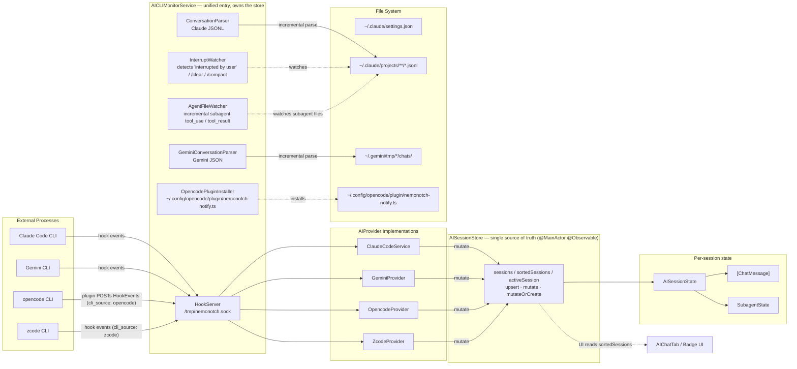
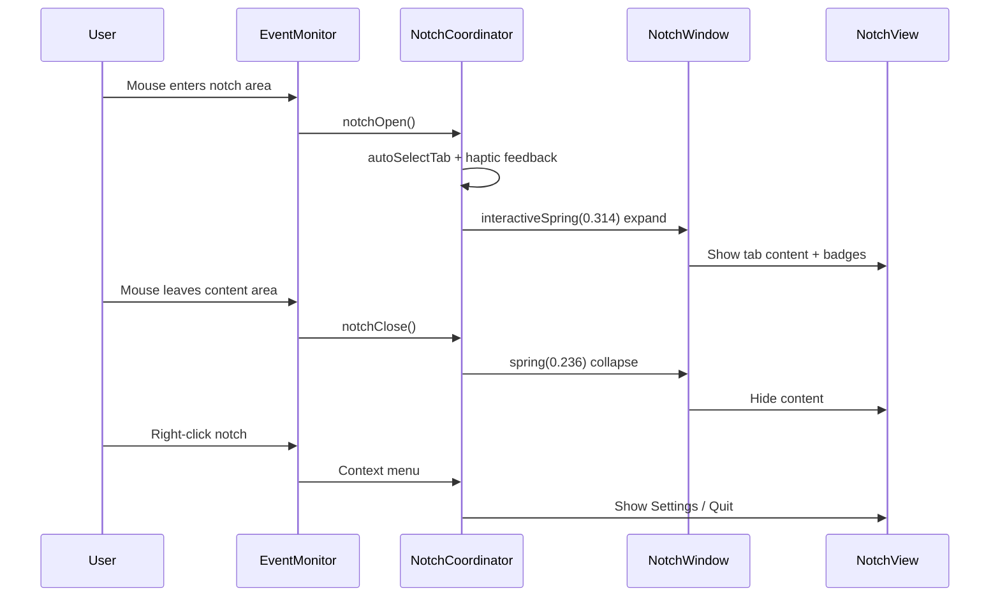

## nemonotch

> NemoNotch is a macOS notch utility that provides an interactive floating panel in the MacBook notch area, integrating media controls, calendar events, AI CLI monitoring (Claude Code / Gemini CLI / opencode / zcode), multi-agent monitoring (OpenClaw / Hermes-agent), and an app launcher.

# NemoNotch — CLAUDE.md

## Project Overview

NemoNotch is a macOS notch utility that provides an interactive floating panel in the MacBook notch area, integrating media controls, calendar events, AI CLI monitoring (Claude Code / Gemini CLI / opencode / zcode), multi-agent monitoring (OpenClaw / Hermes-agent), and an app launcher.

### Tech Stack

- Swift 6 + SwiftUI, macOS only, depends on CocoaLumberjack, KeyboardShortcuts, mediaremote-adapter (perl-bridge media control)
- Key frameworks: AppKit (NSWindow), MediaPlayer, EventKit, IOKit

### Project Structure

```
NemoNotch/
├── NemoNotchApp.swift           # Entry point, MenuBarExtra, global hotkeys, service assembly
├── Models/                      # Data models (Tab, AppSettings, AIProvider, PlaybackState, MultiAgentMonitor, etc.)
├── Notch/                       # Notch UI core (window, animation, event monitoring, TabBar, HUD)
├── Tabs/                        # Tab content views (AIChatTab unifies AI sessions, AgentMonitorTab unifies agents)
├── Services/                    # Background services (media, calendar, AI CLI, launcher, HermesService, etc.)
├── Settings/                    # Settings UI
└── Helpers/                     # Utilities (MarkdownRenderer, ClaudeCrabIcon, ToolStyles)
```

## Architecture

### Overview

```mermaid
graph TB
    subgraph Entry["App Entry"]
        App["NemoNotchApp<br/>@main"]
        AD["AppDelegate<br/>Lifecycle & Service Assembly"]
    end

    subgraph Services["Service Layer — all @Observable"]
        MS["MediaService<br/>MediaRemote (notifications) + NowPlayingCLI (read) + MediaRemoteCommander (control)"]
        AIM["AICLIMonitorService<br/>Unified AI entry + owns AISessionStore"]
        AISS["AISessionStore<br/>Central AI session truth source (@Observable)"]
        CCS["ClaudeCodeService<br/>AIProvider impl<br/>HookServer + ConversationParser"]
        GP["GeminiProvider<br/>AIProvider impl<br/>GeminiConversationParser"]
        REG["AgentMonitorRegistry<br/>Unifies agent monitors"]
        OCS["OpenClawService<br/>WebSocket client (MultiAgentMonitor)"]
        HES["HermesService<br/>HTTP API client (MultiAgentMonitor)"]
        CS["CalendarService<br/>EventKit"]
        LS["LauncherService<br/>App search & launch"]
        NS["NotificationService<br/>Dock Accessibility API"]
        WS["WeatherService<br/>wttr.in"]
        UQS["UsageQuotaService<br/>Claude + Codex + Gemini usage quota"]
        HUD["HUDService<br/>Volume/Brightness/Battery"]
        SYS["SystemService<br/>CPU/memory/disk sampling (SystemTab)"]
        TS["TaskStore<br/>Persistent TODO list (~/.NemoNotch/tasks.json)"]
        PHS["PomodoroHistoryStore<br/>Append-only history (~/.NemoNotch/pomodoro-history.json)"]
        PTS["PomodoroTimerService<br/>State machine + tick + end-alert pipeline"]
        NPM["NotificationPermissionMonitor<br/>UNUserNotificationCenter probe"]
        HK["Hotkeys.swift<br/>KeyboardShortcuts registration (AppDelegate.setupHotkeys)"]
        CFS["CompletionFlashService<br/>Observes AISessionStore + AgentMonitorRegistry<br/>throttle/merge → drives flash + toast"]
    end

    subgraph NotchUI["Notch UI Layer"]
        NC["NotchCoordinator<br/>Open/close state & animation"]
        NW["NotchWindow<br/>NSPanel .statusBar+8"]
        NV["NotchView<br/>SwiftUI main view"]
        EM["EventMonitor<br/>Mouse event listener"]
        CB["CompactBadge<br/>Collapsed icons"]
        TB["TabBarView<br/>Tab navigation"]
        HO["HUDOverlayView<br/>Volume/Brightness overlay"]
    end

    subgraph Tabs["Tabs"]
        OT["OverviewTab<br/>Media + Calendar + Weather"]
        AT["AIChatTab<br/>Claude + Gemini unified"]
        LT["LauncherTab"]
        OCT["AgentMonitorTab<br/>OpenClaw + Hermes unified"]
        PT["PomodoroTab<br/>Idle stats + TODO list + active pie"]
        ST["SystemTab"]
    end

    subgraph Settings["Settings"]
        AS["AppSettings<br/>UserDefaults persistence"]
        SW["SettingsWindow"]
        SV["SettingsView"]
    end

    App --> AD
    AD -->|"creates & owns"| Services
    AD -->|"creates"| NC
    AIM --> CCS
    AIM --> GP
    AIM -->|"owns"| AISS
    CCS -.->|"mutate"| AISS
    GP -.->|"mutate"| AISS
    REG -->|"registers"| OCS
    REG -->|"registers"| HES
    NC --> NW --> NV
    NV --> Tabs
    NV --> CB
    NV --> TB
    NV --> HO
    EM -->|"mouse events"| NC
    HK -->|"hotkeys"| NC
    AS --> SV

    Services -.->|"@Environment injection"| NV
    AS -.->|"@Environment injection"| NV
```



Core data flow: Service → @Observable property changes → SwiftUI auto-redraw → Tab content updates.

### AI Service Architecture



**AISessionStore — central session truth source:** All AI providers (Claude Code, Gemini, opencode, zcode, future DeepSeek/OpenAI) write into one `@MainActor @Observable` store (`NemoNotch/Services/AISessionStore.swift`) owned by `AICLIMonitorService`. Providers translate hook events + file-parse results into `upsert` / `mutate` / `mutateOrCreate` calls on the store; **UI reads `sortedSessions` directly and never touches a provider's internal state**. The store keeps a cached `sortedSessions` (descending by `lastEventTime`, rebuilt on every mutation) and exposes `activeSession` via a priority comparator (`waitingForApproval > processing/compacting > waitingForInput > idle > ended`, ties broken by recency). `sessions(for:)` filters by `AISource` for per-provider surfaces (e.g. a badge that only cares about Claude). Adding a provider means writing to this store — no UI or consumer changes.

**Context-window resolution:** `ModelContextWindow` (`NemoNotch/Models/ModelContextWindow.swift`) maps a model id → context-window size (tokens) for the `contextPercent` / `contextLimitDisplay` labels on `AISessionState`. `limit(for:)` is sync and called from SwiftUI computed props, so resolution is layered with no caller changes: (1) curated hardcoded `limits` table — the source of truth, never overridden, keeps the app correct offline / on a cold launch; (2) an OpenRouter-fetched overlay (`GET https://openrouter.ai/api/v1/models`, **no auth**, public catalog) keyed by normalized bare id (strip `vendor/` prefix, lowercase) — fills gaps for models the table doesn't list yet, so a new GLM/Gemini release shows a real value without a code change; (3) Claude `opus`/`sonnet` family prefix → 1M (Claude ids are dated/dot-versioned so neither exact nor overlay matches reliably); (4) `defaultValue`. The overlay lives in a `Mutex<[String:Int]>` (`import Synchronization`), warmed by `ModelContextWindow.warm()` at launch (skipped under `UITestMode`): loads the disk cache (`~/.NemoNotch/model-context-cache.json`, TTL 3 days) instantly if fresh, else fires a background `refresh()`. Fetch failures are logged and swallowed — the curated table still resolves everything. `parse(data:)` is a pure function (tested without network). The **curated table wins over the overlay on conflict** (the catalog never silently overrides a deliberate value).

**Agent monitoring — registry pattern:** `OpenClawService` and `HermesService` both conform to `MultiAgentMonitor` and are collected by `AgentMonitorRegistry` (`NemoNotch/Services/AgentMonitorRegistry.swift`). The registry exposes unified reads — `installedMonitors`, `anyActiveAgent`, `hasAnyActiveAgent`, `activeAgents` (non-idle across all monitors, sorted by recency) — which `AgentMonitorTab` and the badge layer consume. Hermes additionally has its own `HermesConversationParser` + `HermesHookInstaller`, mirroring Claude's parser/installer split. Adding an agent monitor is one `registry.register(...)` call.

**Usage quota:** `UsageQuotaService` exposes `quotas: [QuotaProvider: ProviderUsageQuota]` and fetches **Claude Code** (Keychain `Claude Code-credentials` / `~/.claude/.credentials.json` → `GET /api/oauth/usage`) and **Codex** (`~/.codex/auth.json` / Keychain `Codex Auth` → `GET chatgpt.com/backend-api/wham/usage` with `ChatGPT-Account-Id`) concurrently. The Codex section appears only when a Codex credential is detected (`hasCodexCredential`). Windows are normalized (session→weekly) and rendered as a card in `AIChatTab`. **Credential reads are file-first** (`~/.claude/.credentials.json` / `~/.codex/auth.json`). **Claude additionally keeps a local read-cache** (`~/.NemoNotch/claude-cred.json`, `0600`, **accessToken + expiresAt only — never the refreshToken**) written on every successful credential read (`writeClaudeCache`); `readClaudeCredential` checks it **before** the CLI file and Keychain, so the common refresh path skips the Keychain entirely and survives sleep without re-validating the ad-hoc signature's ACL trust (that trust lapses across sleep — see below — and used to force a re-authorize every wake). The cache is used only until its token expires (then re-resolved from CLI file / Keychain), and dropped on a usage-API 401 (`invalidateClaudeCache`) since a server rejection means the cached token is stale despite the clock check. When a credential lives only in the Keychain, the AI tab must never auto-prompt: the no-UI flags do **not** suppress the cross-app ACL dialog for a GUI app's `kSecReturnData` read (only attribute reads are silent). So the automatic path uses an **attributes-only probe** (`kSecReturnAttributes`) to detect presence without prompting → `CredentialStatus.needsAuthorization` renders an **Authorize** button (+ a one-line reason) in both the full card and the compact meters, matching the `PermissionCard` "never auto-prompt" pattern. `authorize(_:)` does the one interactive `kSecReturnData` read (off the main actor) that surfaces the dialog and **persists the grant keyed by the running code's cdhash** (`quota.keychainGrantedIdentity.<provider>` in UserDefaults, via `SecCodeCopySigningInformation`); a later launch does a silent gated data read **only if the cdhash still matches**. Because ad-hoc signing changes the cdhash each rebuild, a stale grant reads as not-granted → the entry path shows the button (no auto-prompt) instead of a prompting data read; a stable signature makes it truly one-time. The gated data read itself is wrapped in `SecKeychainSetUserInteractionAllowed(false)` (legacy-keychain process-wide toggle, `dlsym`-resolved, `Boolean`→`DarwinBoolean`) so that even when the cdhash gate passes but the ACL doesn't durably trust the app (user clicked "Allow" once, not "Always Allow", or a restrictive item ACL), the read **fails with `errSecInteractionNotAllowed` instead of popping the consent dialog** → button shown. Without this, the 5-min auto-refresh timer surfaces the Keychain prompt with no user click. **Forgetting the grant is gated on `errSecItemNotFound`** (item genuinely gone): a transient `errSecInteractionNotAllowed` (ACL trust lapsed across sleep on an ad-hoc build) now **keeps** the grant so a later refresh retries the silent read instead of permanently reverting to the button — combined with the local read-cache above, this is why the app no longer demands re-authorize after every sleep. The durable fix remains a stable code signature (ad-hoc cdhash can't anchor "Always Allow" across a cold re-validation). See macOS cookbook §14.3 step 4. `LifecycleAware`, 60s refresh throttle, 5-minute timer, robust `resets_at` parse, and reset-backfill from the previous fetch (ideas borrowed from `CodexBar`). **Gemini** quota (free-tier personal Google account, gated by `geminiEnabled` + `hasGeminiCredential`) uses a three-call Cloud Code flow: refresh the OAuth token (`POST oauth2.googleapis.com/token`; the client_id/secret are extracted at runtime from the installed gemini-cli's bundled JS by `GeminiOAuthClientLocator` — locate binary → resolve symlink → read `oauth2.js` / scan `bundle/*.js` — never hardcoded, so a Google key rotation can't break us; `GeminiOAuthClientLocator.resolve()` runs off the main actor since it may spawn a subprocess) → resolve the project (`:loadCodeAssist`, with a `cloudresourcemanager` fallback) → `:retrieveUserQuota`. The refreshed token is written back to `~/.gemini/oauth_creds.json` (atomic) to stay in sync with the CLI. Credentials live in that plain file — **no Keychain**, so Gemini never uses the `needsAuthorization`/Authorize path; `settings.json`'s `security.auth.selectedType` gates out api-key/vertex-ai auth. Per-model buckets collapse to the lowest remaining fraction and render as `QuotaWindow.gemini(label:)` rows (`utilization = (1 - remainingFraction) * 100`, ordered most-constrained first).

**opencode integration — plugin-based hook delivery:** [opencode](https://opencode.ai) is the third `AIProvider`, implemented by `OpencodeProvider` (`NemoNotch/Services/OpencodeProvider.swift`). Because opencode exposes a TypeScript plugin API rather than a shell-hook mechanism, NemoNotch ships its own plugin at `~/.config/opencode/plugin/nemonotch-notify.ts`, written and installed by `OpencodePluginInstaller` (`NemoNotch/Services/OpencodePluginInstaller.swift`). The plugin subscribes to opencode lifecycle hooks (`chat.message`, `tool.execute.before/after`, `permission.ask`) and the event bus (`session.idle`, `session.error`, `session.compacted`), then POSTs normalized `HookEvent` payloads — including `cli_source: "opencode"` and a `model` field — to the existing `HookServer` Unix socket. `AICLIMonitorService.routeEvent` gained an `"opencode"` case that forwards events to `OpencodeProvider`, which translates them into `upsert` / `mutate` calls on `AISessionStore` exactly as Claude and Gemini do — so badges, completion flash, toast, and the AI tab status card all light up with no further changes. **Scope: notify + live status only** — no conversation/token parsing (messages aren't forwarded), and `permission.ask` is notify-only (approval happens in opencode's own TUI; `respondToPermission` is a no-op). No usage quota. `AppSettings.opencodeEnabled` (default `true`) gates the provider; an "Install opencode hooks" menu button and a recovery card in the AI tab mirror the Claude/Gemini install flow. The Settings → AI Agents page (`SettingsView.claudeView`) renders every provider as a per-provider **card** (`providerCard` shell + `hookCard` wrapper) — Claude / Gemini / opencode / zcode / Hermes / OpenClaw, each with its own brand logo in a tinted chip and install/reinstall/uninstall (OpenClaw: connect/disconnect/remove) — so opencode now has full reinstall + uninstall there, not just the menu-bar install. The card tints are window-appearance-adaptive (the Settings window follows system light/dark, unlike the dark-only `NotchTheme`). opencode's brand mark renders via `OpencodeLogoIcon` (`NemoNotch/Helpers/OpencodeLogoIcon.swift`), a tintable vector of the opencode.ai favicon, used in the badge and AI-tab source-icon slots (cf. `ClaudeCrabIcon`). **Source authority:** a foreign opencode plugin (e.g. `oh-my-openagent`) can race ahead and POST an *untagged* (`cli_source` absent) Claude-shaped event for the same `ses_…` session, which would otherwise mint a `.claude` phantom that the later opencode-tagged event can't relabel. Two defenses: `AISessionStore.mutateOrCreate` makes the caller's `cli_source` authoritative (`session.source` is now `var`, reassigned on every mutate — the explicit per-event source wins over a stale one); and `routeEvent` attributes an unknown-source event whose `sessionId` has the opencode `ses_` prefix to opencode before the Claude fallback. Without these the opencode session shows Claude's crab icon.

**zcode integration — reused hook pipeline, no plugin:** zcode (ZCode.app's GLM-based, Claude-Code-compatible agent CLI) is the fourth `AIProvider`, implemented by `ZcodeProvider` (`NemoNotch/Services/ZcodeProvider.swift`). Unlike opencode it needs no plugin: its hooks are Claude-shaped and flow through the existing `hook-sender.sh` → `HookServer` → provider pipeline unchanged, with `HookEvent` decoding its payload as-is. Its config lives at `~/.zcode/cli/config.json`, which nests hook entries under `hooks.events.<Event>` with a sibling `hooks.enabled = true` flag rather than Claude/Gemini's flat `hooks.<Event>`; `HookInstaller` handles the shape difference with a `.zcode` `HookTarget` whose `usesNestedEventsContainer` flag routes install/uninstall/detection through pure `readEvents`/`writeEvents`-wrapped `applyInstall`/`applyUninstall`/`detectInstalled` transforms shared with Claude and Gemini. zcode session ids are `sess_`-prefixed (distinct from opencode's `ses_`), so `hook-sender.sh` checks `$ZCODE_SESSION_ID` (and a `zcode`-matching parent-process fallback) before the Claude branch to tag `cli_source: "zcode"`, and `AICLIMonitorService.routeEvent` attributes an untagged event whose session id starts with `sess_` to zcode ahead of the opencode/Claude fallbacks. `ZcodeProvider` maps zcode's **actual** hook set (SessionStart→idle; UserPromptSubmit/PreToolUse/PostToolUse/PostToolUseFailure→processing; Stop→waitingForInput). zcode emits **neither `Notification` nor `SessionEnd`** (it has only `SessionStart`, with `startup`/`resume`/`clear`/`compact` matchers) — so `HookInstaller.zcode.hookEvents` registers only the real events and ended sessions are reaped by the stale-session timeout (mirroring `OpencodeProvider`'s cleanup), not a removal event. zcode *does* emit `PermissionRequest` (and `PreToolUse` can return allow/ask/deny), but notch-side approval is intentionally out of scope, so that event is not registered. **Scope: notify + live status only** — no conversation/token parsing and no notch-side approval (`respondToPermission` is a no-op; zcode's own TUI owns the approval decision), so there is no usage quota either. `AppSettings.zcodeEnabled` (default `true`) gates the provider; hooks auto-install on launch only when `~/.zcode/cli/config.json` already exists, and an "Install zcode hooks" menu button plus a card on the Settings → AI Agents page (alongside Claude / Gemini / opencode / Hermes / OpenClaw) mirror the other providers' install/reinstall/uninstall flow. zcode's brand mark renders via `ZcodeLogoIcon` (`NemoNotch/Helpers/ZcodeLogoIcon.swift`) in the badge and AI-tab source-icon slots.

### Notch Event Flow



**Hotkey-aware dismiss:** When the notch is opened via global hotkey, it does NOT close on mouse-move-outside until either (a) the mouse enters the content area at least once, (b) 3 seconds elapse with no mouse entry (`NotchConstants.hotkeyAutoCloseDelay`), or (c) the user presses ESC / hotkey / clicks outside. Mouse-hover open path is unchanged. State machine lives in `HotkeyDismissState`.

**Permission UI pattern:** Calendar, Location, and Notification permissions are NOT auto-requested on launch. Instead the relevant Tab/Settings section renders a `PermissionCard` with a "Grant" button. AX uses the same card but only links to System Settings (no programmatic request API). Card lives at `NemoNotch/Helpers/PermissionCard.swift`. Notification permission ships in the Pomodoro settings page (`PomodoroSettingsView`), backed by `NotificationPermissionMonitor`.

**Pomodoro hotkeys:** `openPomodoro` opens the Pomodoro tab; `openQuickStart` toggles the centered draggable `QuickStartWindow` (`NemoNotch/Notch/QuickStartWindow.swift` / `QuickStartWindowController.swift`). Neither has a default binding — users must set them in Settings → Pomodoro.

### Badge Priority (when notch is collapsed)

```
ai approval > notification > pomodoro running > agents active > ai working > media playing > calendar upcoming
```

**Single-row stacked layout:** The collapsed notch never grows a second row. `activeBadgeItems` (priority-sorted) is folded by `BadgeGrouping.group` (`NemoNotch/Notch/Badge/BadgeGrouping.swift`) into `BadgeGroup`s keyed by **icon identity** (AI by source, agents by emoji, media/notification/pomodoro/calendar each their own key); each group's highest-priority member is its `representative` and `count` is its size. `BadgeGrouping.cluster(_:cap:)` caps the visible groups at `NotchConstants.badgeGroupCap` (4), folding extras into a `+K` chip (`BadgeCluster.overflow`). `CompactBadgesView` renders a **mirror fan**: left = overlapping logos (highest priority frontmost, hugging the notch), right = corresponding statuses (highest priority hugging the notch); a group of more than one (same-app instances) shows **only its count**, centered in the slot, in place of the status indicator. A single group of one is pixel-identical to the old single-item look. Tapping anywhere opens the highest-priority group's tab. `BadgeRowView` and the collapsed-notch vertical growth (`extraHeight`) were removed. The collapsed notch instead grows **horizontally** to contain the fan: `NotchView.closedBadgeExtraWidth` sizes the black shape from the visible fan extent (`badgeSpread + index·badgeStackStep`/`badgeStatusStep` per group, plus `badgeEdgeMargin`) rather than a fixed pad, so the shape widens as more groups appear (a single group still yields the historical +72pt). The width is read from `badgeCluster` (the debounced `displayedBadgeItems`), so it animates in sync with the fan.

**Empty-collapse debounce:** The compact badges' visibility is driven by `BadgeViewModel.applyBadgeUpdate(newTypes:)` (called from `NotchView`'s `onChange(of: activeBadgeItems)`). It animates `displayedBadgeItems` which feeds into `BadgeViewModel.badgeCluster` — these must stay in sync to ensure a smooth visual transition. Non-empty updates coalesce on a 16ms tick; an update that drops to **empty** is delayed by `NotchConstants.badgeEmptyGrace` (600ms) and cancelled if a non-empty set arrives within the window. This absorbs momentary idle dips — e.g. an agent (OpenClaw) briefly returning to `.idle` between tool calls drops out of `AgentMonitorRegistry.activeAgents` (which filters `.idle`), which would otherwise empty `activeBadgeItems` for a tick and replay the visual transition. Genuine completion (empty for >600ms) still collapses normally.

### Activity Glow (when notch is expanded)

The expanded notch body renders a soft blurred glow ring hugging its inner edge whenever there is AI/agent activity — the center (content) stays clean. It is purely visual (`.allowsHitTesting` unaffected; never alters layout). Decision is the pure function `BadgeItem.glow(for: activeBadgeItems) -> NotchGlow`: `.attention` if any session awaits approval, else `.running` if AI is working or an agent is active, else `.none`. Both active states render in the app's theme accent (`NotchTheme.accent`, orange) — the enum stays split so the two can be re-differentiated later without touching the decision logic. `BadgeViewModel.glowState` exposes it; `NotchView` passes it to `NotchBackgroundView`, which strokes the notch's rounded shape, blurs it, and lets the existing notch `.mask` clip the outward spread so only an inner-edge ring remains; a further vertical `LinearGradient` `.mask` fades it so only the **lower-half** edge glows (vanishing by the middle). `.screen` blended, only when `status != .closed`. Tunables: `NotchConstants.glowRingOpacity` / `glowRingWidth` / `glowRingBlur` / `glowRingCoverage`.

### Completion Flash (when AI/agent finishes)

When an AI session transitions working→idle or an agent transitions active→idle, NemoNotch plays a one-shot **full-screen accent-orange edge glow** on every connected display, plus a **toast capsule centered in the lower portion of the screen** (`completionToastBottomFraction`, ~15 % up from the bottom edge; the capsule leads with the **source app's logo** (Claude Code crab / Gemini / opencode / zcode / agent / Pomodoro — so you can tell which app finished) and hugs its text via horizontal padding, `completionToastMaxWidth` only bounds/truncates very long names) listing the finished project/agent name(s). The **Pomodoro end alert also raises this same unified toast** (via the toast-only entry described below) — the toast is the shared completion surface across both subsystems.

**`CompletionFlashService`** (`NemoNotch/Services/CompletionFlashService.swift`) is the decoupled `@MainActor @Observable` driver. It observes `AISessionStore.sortedSessions` and `AgentMonitorRegistry.installedMonitors` via `withObservationTracking`, feeding the current snapshot into the pure `CompletionDetector` on each change to identify working→idle / active→idle edges. On a detected completion it either fires the flash (exposes `flashLevel` 0...1, animated through a continuous double-pulse curve `0 → 1 → completionFlashDipLevel → 1 → 0` via `completionFlashRise` / `completionFlashDip` / `completionFlashFall`; the view scales `completionGlowOpacity` by it) or, if a flash is already within the `completionFlashThrottle` cooldown (~2 s), merges the new items into the visible toast via `CompletionFlashNames.merge` (dedup by name + count chip) without replaying the glow. Each completed unit is a `CompletionItem` (`name` + `CompletionSource` — `.ai(AISource)` / `.agent` / `.pomodoro`) produced by `CompletionDetector.step`, so the toast can render the source app's logo. The service exposes `toastItems` and `toastVisible` for the toast view, which dwells for `completionToastDuration` (5 s) before fading — its own value, independent of the volume/brightness HUD's shorter `hudDismissDelay`.

**Per-screen overlay windows** are managed by `CompletionFlashWindowController` (`NemoNotch/Notch/CompletionFlashWindow.swift`). It creates one borderless transparent `CompletionFlashWindow` per `NSScreen`, covering the full screen frame, and rebuilds on `NSApplication.didChangeScreenParametersNotification`. Each window hosts a `CompletionFlashView` — a `.blendMode(.screen)` accent frame (a `Rectangle().strokeBorder` rim wrapping all four sides: a crisp solid outer line plus a blurred halo fading inward), with `allowsHitTesting(false)`. See [§5.10] in the cookbook for the full window recipe.

**Toast** (`NemoNotch/Notch/CompletionToastView.swift`) is rendered **inside `CompletionFlashView`** (the full-screen overlay), not the notch window — so it can sit at bottom-center, out of the ~800×430 notch panel's reach. It's positioned via a `GeometryReader`/`.position` at `y = height * (1 - completionToastBottomFraction)`, horizontally centered, sized by `.fixedSize(horizontal:)` so the capsule hugs its content instead of stretching to the offered full-screen width, and fades/slides in on `service.toastVisible`. The glow flashes every display, but the toast renders on **one screen only** (`showsToast`, computed by `CompletionFlashWindowController` to match `NotchView.isHUDScreen` — built-in display, else first) so a multi-monitor setup shows no duplicate capsule. The toast dwells for `completionToastDuration` (5 s) before fading.

**Toast-only entry (Pomodoro):** `CompletionFlashService.showCompletionToast(names:)` is a public method that shows/merges the toast **without** firing the glow (Pomodoro's visual channel is the notch ring pulse, not the flash). It deliberately leaves the flash cooldown untouched, so a Pomodoro toast can never swallow a subsequent AI/agent flash. `PomodoroTimerService` holds an optional `CompletionFlashService` (injected in `NemoNotchApp`; optional so tests skip the overlay stack) and calls it from `triggerEndAlerts` alongside the unchanged sound / system notification / pulse.

**Setting:** `AppSettings.completionFlashEnabled` (default `true`) gates the service — no flash or toast fires when disabled (including the Pomodoro toast). Toggle lives in the Settings → Tabs page (the `tabManagementView` form).

**Tunables** in `NotchConstants`: `completionFlashThrottle`, `completionFlashRise`, `completionFlashDip`, `completionFlashFall`, `completionFlashDipLevel`, `completionToastDuration`, `completionToastBottomFraction`, `completionToastHeight` / `completionToastMaxWidth` / `completionToastHPadding` / `completionToastIconSize` / `completionToastFontSize` / `completionToastCountFontSize`, `completionGlowWidth`, `completionGlowBlur`, `completionGlowEdgeWidth`, `completionGlowOpacity`.

## Debug Pitfalls

### Info.plist Configuration

**The project has `GENERATE_INFOPLIST_FILE = YES`**, so keys in the source `NemoNotch/Info.plist` will **not** end up in the build product! All Info.plist keys must be declared as `INFOPLIST_KEY_*` in `NemoNotch.xcodeproj/project.pbxproj` (both Debug and Release configurations).

Correct process for adding new permission descriptions (e.g. `NSAppleEventsUsageDescription`, `NSMicrophoneUsageDescription`):

1. Edit `project.pbxproj`, find all `INFOPLIST_KEY_NSCalendarsFullAccessUsageDescription = ...;` lines, add a new line next to them: `INFOPLIST_KEY_NSAppleEventsUsageDescription = "...";`
2. Verify: `/usr/libexec/PlistBuddy -c "Print :Key" $APP/Contents/Info.plist` must output the value
3. **Missing `NSAppleEventsUsageDescription` causes macOS to silently refuse to show the "automation authorization" dialog**, and the automation settings panel cannot manually add the app — this pitfall is extremely deep. When debugging, first check whether the build product's Info.plist actually has this key.

### Media Info Retrieval

**⚠️ Important**: Now Playing info (title, artist, album, artwork, duration, progress) is **retrieved via `NowPlayingCLI`**; playback state (isPlaying) uses an **optimistic-update + guard** mechanism driven entirely by the CLI (no ScriptingBridge). **There is no `MediaBridge` / ScriptingBridge / Automation permission anymore** — reads come from `NowPlayingCLI`, control from `MediaRemoteCommander`.

- `NowPlayingCLI` launches a perl daemon (`mediaremote-mini.pl` + dylib extracted from `MediaRemoteMini.bin.gz`), polling via stdin/stdout JSON protocol
- `MediaService.updateNowPlaying()` → `nowPlayingCLI.fetchNowPlayingInfo()` → `applyInfo()`
- **All playback control** (play/pause/next/previous/seek, **every player including Music & Spotify**) goes through `MediaRemoteCommander`, a thin wrapper around the `mediaremote-adapter` Swift package's `MediaController`. Since macOS 15.4 Apple gated the private `MediaRemote.framework` control functions (`MRMediaRemoteSendCommand` / `MRMediaRemoteSetElapsedTime`) to Apple-signed processes, so calling them **in-process** (the old `MediaRemote.swift` path) silently no-ops. The adapter spawns the Apple-signed `/usr/bin/perl`, which `dlopen`s the framework and issues the command — same perl-bridge bypass `NowPlayingCLI` already uses for reads. **Control no longer needs Automation/AppleScript.** Empirically verified on Spotify: `set_time` (absolute seek), `toggle_play_pause`, `next_track`, `previous_track` all work — the old "Spotify needs AppleScript for seek" note applied only to the **relative** `SkipBackward/Forward` commands, which Spotify rejects; **absolute `MRMediaRemoteSetElapsedTime` is honored**. See macOS cookbook §7.6.
- `MediaRemote.swift` now only **registers system notifications** to trigger refresh / `setCanBeNowPlayingApplication`; its old `sendCommand` / `skip` / `setElapsedTime` (and the `Command` enum) were removed — in-process control is gated since 15.4
- `MediaBridge`, `MediaAutomationPermissionMonitor`, and the `ScriptingBridge/` Spotify/Music interfaces were **deleted** — control no longer needs AppleScript/Automation, and the authoritative `isPlaying` read they provided is no longer needed (the CLI playback-rate + guard self-heal, see below). The Automation `PermissionCard` and the `NSAppleEventsUsageDescription` Info.plist key are gone too.
- When debugging "info lost" issues, prioritize investigating NowPlayingCLI daemon state / dylib extraction (`~/Library/Application Support/NemoNotch/MediaRemoteMini.dylib`) / perl script, rather than modifying MediaRemote.swift

**Play/Pause state reconcile flow**:

1. User taps play/pause → `togglePlayPause()` sets optimistic `isPlaying` + `reconcileExpectedIsPlaying` guard, then sends the command via `MediaRemoteCommander`
2. After ~0.5s, `reconcilePlayState()` just triggers a fresh `updateNowPlaying()` (CLI fetch) — and the player's own `com.spotify.client.PlaybackStateChanged` / `com.apple.Music.playerInfo` distributed notifications also trigger refreshes for fast convergence
3. `applyInfo()` respects the guard: while a stale CLI poll disagrees, the guard preserves the optimistic value; once the CLI's reported playback rate agrees (or the 3s hard expiry passes), the guard self-clears and the CLI value wins — so the button never lags, flickers, or sticks

**Media seek (skip forward/back 15s)**:

- **All players** (Music, Spotify, browsers, Podcasts, …): `MediaService.seek(toAbsolute:)` computes the absolute target and calls `MediaRemoteCommander.setTime(seconds:)` → `set_time` over the perl bridge (`MRMediaRemoteSetElapsedTime`). This is honored even by Spotify (verified). No AppleScript / Automation needed.
- `MediaService.supportsSeeking` is now simply `playbackState.duration > 0` (any finite timeline is seekable), not a per-player capability gate.
- The old in-process `MediaRemote.skip(interval:)` / `setElapsedTime` and the AppleScript `MediaBridge.setPlayerPosition` paths were removed (along with all of `MediaBridge`) — the former is gated since 15.4, the latter is no longer needed now that absolute seek works through the bridge for Spotify too.

## Development Conventions

### Behavioral Guidelines

**Tradeoff:** These guidelines bias toward caution over speed. For trivial tasks, use judgment.

**Think Before Coding — Don't assume. Don't hide confusion. Surface tradeoffs.**
- State assumptions explicitly. If uncertain, ask.
- If multiple interpretations exist, present them — don't pick silently.
- If a simpler approach exists, say so. Push back when warranted.
- If something is unclear, stop. Name what's confusing. Ask.

**Simplicity First — Minimum code that solves the problem. Nothing speculative.**
- No features beyond what was asked.
- No abstractions for single-use code.
- No "flexibility" or "configurability" that wasn't requested.
- No error handling for impossible scenarios.
- If you write 200 lines and it could be 50, rewrite it.
- Ask yourself: "Would a senior engineer say this is overcomplicated?" If yes, simplify.

**Surgical Changes — Touch only what you must. Clean up only your own mess.**
- Don't "improve" adjacent code, comments, or formatting.
- Don't refactor things that aren't broken.
- Match existing style, even if you'd do it differently.
- If you notice unrelated dead code, mention it — don't delete it.
- Remove imports/variables/functions that YOUR changes made unused.
- Every changed line should trace directly to the user's request.

**Goal-Driven Execution — Define success criteria. Loop until verified.**
- Transform tasks into verifiable goals with success criteria.
- "Add validation" → "Write tests for invalid inputs, then make them pass"
- "Fix the bug" → "Write a test that reproduces it, then make it pass"
- "Refactor X" → "Ensure tests pass before and after"
- For multi-step tasks, state a brief plan with verification at each step.

Strong success criteria let you loop independently. Weak criteria ("make it work") require constant clarification.

**These guidelines are working if:** fewer unnecessary changes in diffs, fewer rewrites due to overcomplication, and clarifying questions come before implementation rather than after mistakes.

### Logging

Use CocoaLumberjack (`LogService`), outputting to both console and file. Log directory: `~/.NemoNotch/logs/`, rotated daily, retained for 7 days.

Usage: `LogService.debug/info/warn/error("message", category: "xxx")`

**Log coverage requirements** — When implementing features, logs must be added at every key point:

- **Service init/deinit**: `.info` level, marking lifecycle
- **External interactions**: Network requests, IPC, file I/O, subprocess launch/exit — `.info` (success) or `.error` (failure)
- **State changes**: Key property assignments (playback state, session phase, connection status) — `.debug` with before/after values
- **Error paths**: All `catch`, `nil` fallbacks, permission denials, timeouts — `.warn` or `.error` with context
- **Async callback entry**: Timer, NotificationCenter, Delegate callbacks — `.debug` to confirm callback fired

Category naming: use module name, e.g. `"MediaService"`, `"HookServer"`, `"NotchCoordinator"`, for easy filtering.

### Git Workflow

**Never commit directly on main.** All development must follow Git Flow.

- **main**: Stable release branch, only accepts merges from develop, never direct commits
- **develop**: Daily development branch, all feature branches are based on this
- **feature/xxx**: Feature branches, branched from develop, merged back to develop when complete
- **hotfix/xxx**: Hotfix branches, branched from main, merged back to both main and develop

Workflow:

1. New feature: `git checkout develop && git checkout -b feature/xxx`
2. After development, merge back to develop. After testing, merge develop to main
3. Release: tag from main (`vX.Y.Z`)

**Enforced guards (per-clone, run once: `sh .githooks/install.sh`):** Source lives in `.githooks/` and is copied into the shared `.git` dir so it stays active across every branch and worktree. The guards make the rules above mechanical:

- `pre-commit` / `pre-merge-commit` hooks: **block any commit or merge on `main`** (PR-only; locally use `git pull --ff-only`), and only allow `feature/*` / `hotfix/*` (or `origin/develop` self-sync) to merge into `develop`. Direct commits to `develop` stay allowed. Bypass with `--no-verify` in emergencies.
- `pre-commit` also **normalizes any staged `*.xcstrings`** via `scripts/xcstrings.py format` (re-adds it), so String Catalog edits from Xcode's GUI, the script, or by hand all commit in Xcode's canonical format with a minimal diff — see [Localization](#localization-string-catalog).
- Config: `pull.ff=only` (main never silently diverges), `branch.develop.rebase=true`, `branch.develop.mergeoptions=--no-ff` (feature merges keep a merge commit).

**Worktree workflow (parallel features):** `git feat <name>` creates `feature/<name>` off `origin/develop` in a sibling worktree at `../NemoNotch-worktrees/<name>`; `git feat-done <name>` merges it back to `develop` (`--no-ff`) and tears the worktree down; `git feat-list` shows all worktrees. See `docs/git-worktree-workflow.md`.

### Testing

- Unit tests live in `NemoNotchTests/`, written with **Swift Testing** (`import Testing`, `@Test`, `#expect`). Do not use XCTest for new code.
- Test pure logic — parsers, encoders, state transitions. Skip ScriptingBridge / AX / NSWindow integration tests (they need real macOS permissions and are flaky in CI).
- Run locally: `xcodebuild test -project NemoNotch.xcodeproj -scheme NemoNotch -destination 'platform=macOS'`.
- New tests must pass before merging to `develop`.

### Localization (String Catalog)

All UI strings live in `NemoNotch/Resources/Localizable.xcstrings` (a JSON String Catalog, en + zh-Hans). The catalog is kept in **Xcode's own String Catalog format** — `"key" : value` (a space on **both** sides of the colon), 2-space indent, `ensure_ascii=False` so CJK stays literal, insertion order preserved (**never sorted**), empty objects expanded to the multi-line `{\n\n<indent>}` form, and **no trailing newline**. This format is what Xcode's editor writes, so editing in the Xcode GUI produces zero churn.

- **Edit freely — in the Xcode GUI editor, via `scripts/xcstrings.py`, or by hand.** A `pre-commit` hook runs `scripts/xcstrings.py format` on any staged `*.xcstrings`, normalizing it byte-for-byte to Xcode's format before commit, so no matter how it was edited the committed diff is minimal. The trap this avoids: a naive `json.dump(indent=2)` uses `": "` and can sort keys, reformatting *every line* — never write the catalog that way; go through `scripts/xcstrings.py` (whose `dump_canonical()` reproduces Xcode's bytes exactly).
  - `scripts/xcstrings.py set [file] KEY --en "…" --zh "…"` — add/update a fully-`translated` key (avoids build-time `state:"new"` re-extraction), then rewrites canonically.
  - `scripts/xcstrings.py format [file]` — normalize in place (no-op if already canonical); `check [file]` — exit non-zero if not canonical.
  - `file` defaults to `NemoNotch/Resources/Localizable.xcstrings`.
- The `%@` / `%1$@` / empty-object entries already in the catalog are Xcode's auto-extracted placeholders — leave them; they are not build noise.

### Coding Conventions

- Planning docs follow the **Superpowers** convention: design specs go in `docs/superpowers/specs/YYYY-MM-DD-<topic>-design.md` (via the brainstorming skill), implementation plans go in `docs/superpowers/plans/YYYY-MM-DD-<feature>.md` (via the writing-plans skill). Once a plan ships, move it to `docs/superpowers/plans/archive/`; the spec stays in `specs/`. Commit plan docs alongside code.
- After adding or modifying features, must update `README.md`, `README_CN.md`, and `CLAUDE.md` to reflect changes in feature descriptions, tech stack, architecture, etc.
- All Services use `@Observable` macro, UI updates via SwiftUI reactivity
- AI providers implement the `AIProvider` protocol, managed via `AICLIMonitorService`
- Notch window level is fixed at `.statusBar + 8`, properties: `fullScreenAuxiliary` + `stationary` + `canJoinAllSpaces`
- Prefer checking reference projects for existing implementations before building from scratch

### Protocol-First Extensible Design

Multi-provider scenarios (AI Provider, Conversation Parser, Multi-Agent Monitor, etc.) use a **protocol + concrete implementation** pattern:

- Define protocols with only **common interfaces** (e.g. `messages`, `tokens`, `findSessionFile`, `agents`, `hasActiveAgents`)
- Each Provider/Parser keeps **independent Result types and parsing logic**, don't force unified data structures
- Provider-specific fields (Claude's `cacheRead`, Gemini's `thoughtTokens`) stay in their implementations, accessed via protocol extensions or concrete types
- Generic consumers use protocol interfaces, specific logic accesses concrete types
- Adding a new Provider (e.g. DeepSeek, OpenAI) or a new Agent Monitor (e.g. HermesService) only requires implementing the protocol, no changes to existing code

## macOS Cookbook

> **The macOS knowledge base lives in its own repo:** `git@github.com:GaoZimeng0425/macos-playbook.git`. `docs/macos` here is a **local symlink** to a sibling checkout (`../macos-playbook`) and is **gitignored** — it won't appear in a fresh clone of NemoNotch. To get it, clone the playbook repo as a sibling directory; the symlink then resolves and all `docs/macos/...` paths below work. Edits to these docs are committed in the playbook repo, not here.

A consolidated reference of every macOS-specific technique used in this codebase lives at `docs/macos/macos-cookbook.md`. Organized by subsystem, anchored to `file:line` in real source. Use it before re-deriving how to do `dlopen`, MediaRemote, Carbon hotkeys, AX, IPC, etc.

For **reusable, cross-project macOS playbooks** (distilled from NemoNotch + Peekaboo + Ironsmith + Raycast, organized by macOS development block — `window/` `media/` `permissions/` `keychain/` `ipc/` `architecture/` etc., plus `ai-codegen/` `native-feel/` `design-system/` domain modules), see the knowledge base at `docs/macos/index.md`. The cookbook above is NemoNotch's precise `file:line` map; the playbooks are the generalized patterns + Pitfalls + checklists that cite it.

**Top-level sections:** 1) How to use · 2) Critical pitfalls · 3) Build & release · 4) Private API loading · 5) Notch & window · 6) Event capture & hotkeys · 7) Media · 8) System sensing · 9) ScriptingBridge & AppleScript · 10) Accessibility & Dock badges · 11) Permissions · 12) IPC & subprocess · 13) Hook installers · 14) Keychain · 15) Swift 6 concurrency · 16) SwiftUI patterns · 17) Architecture · 18) Logging · 19) Reference projects index · 20) UI-test screenshot harness (`--uitest`).

**When to update:** Any commit that adds a new private API call, a new system-framework integration, or a new `@unchecked Sendable` / `nonisolated(unsafe)` boundary must add a matching technique entry in the same commit.

## Reference Projects

All reference projects are located at `/Users/gaozimeng/Learn/macOS/`. Check these first when facing implementation questions.

| Need | Reference Project | What to Reference |
|------|------------------|-------------------|
| Notch window positioning, multi-screen | **NotchDrop** | NSPanel subclass, screen.notchSize detection, per-screen WindowController |
| Notch window management, tri-state machine | **Peninsula** | NSPanel subclass, notch positioning, closed/popping/opened state machine, NotchBackgroundView notch shape rendering |
| Notch animation, auto-collapse | **DynamicNotchKit** | Spring animation .bouncy(duration: 0.4), Timer auto-dismiss, NSScreen extensions (hasNotch/notchSize/notchFrame) |
| Mouse event monitoring | **NotchDrop** | Global NSEvent monitor for mouse approach/leave detection |
| Global hotkeys | **KeyboardShortcuts** | User-customizable bindings via `Hotkeys.swift` name registry; registered in `AppDelegate.setupHotkeys` |
| Now Playing info retrieval | **PlayStatus** / **Tuneful** | MediaPlayer framework, MPNowPlayingInfoCenter polling |
| Media key interception | **PlayStatus** | sendEvent override intercepting NX_KEYTYPE_PLAY etc. |
| CLI now playing info | **nowplaying-cli** | daemon connection → legacy callback → MRNowPlayingController three-tier fallback, dylib path search |
| MediaRemote bridging | **PlayStatus** | dlopen/dlsym dynamic loading of MediaRemote.framework private API |
| Window management | **Loop** | WindowEngine architecture, radial menu, keyboard event handling |
| Spotlight-style search | **DSFQuickActionBar** | NSPanel floating window, async search, keyboard navigation |
| Dock hover preview | **DockDoor** | SCWindow screenshots, window thumbnail cache, AXUIElement window control |
| Menu bar architecture | **eul** | StatusBarManager, Combine reactive, dark/light mode adaptation, host_processor_info CPU sampling, host_statistics64 memory reading |
| Brightness monitoring | **MonitorControl** | DisplayServicesGetBrightness() private API, dlopen dynamic loading |
| AI Hook architecture | **masko-code** | Unix Socket event delivery, HookInstaller writing to ~/.claude/settings.json, hook-sender.sh process tree detection |
| Conversation parsing | **vibe-notch** | Incremental JSONL parsing, ChatMessage structured parsing, PermissionRequest approval flow |
| Status icons | **NotchNook** | Notch-side icon layout style |

## Build & Release

- One-click build: `./build.sh` (arm64, default), `./build.sh --x86` (Intel), or `./build.sh --arm` (explicit) — auto Archive → export .app → generate DMG. Single-arch only (no universal binary); each build passes `ARCHS` to `xcodebuild`
- Output: `build/NemoNotch-<arch>.dmg` (e.g. `build/NemoNotch-arm64.dmg`, `build/NemoNotch-x86_64.dmg`) — arch-suffixed so `--arm` and `--x86` builds don't overwrite each other
- Supporting files: `ExportOptions.plist` (export config), `build.sh` (build script)
- Currently skips signing (`CODE_SIGN_IDENTITY="-"`), configure signing and notarization for official distribution
- **Version is injected at build time, not stored in pbxproj.** pbxproj's `MARKETING_VERSION` (`1.0`) is only a local Xcode/dev-run placeholder (shown in Settings → About). `build.sh` overrides `MARKETING_VERSION` from the latest global `vX.Y.Z` tag (build number = commit count); the release workflow overrides it from the **pushed tag** (`GITHUB_REF_NAME`, build number = Actions run number). So the About tab and DMG always show the real release version — bumping `release.sh`'s tag is all that's needed.

### Release Process

When the user says "release":

1. Confirm all changes are committed to main
2. Create version tag (format `vX.Y.Z`, e.g. `v0.1.0`)
3. Push tag to origin: `git push origin <tag>`
4. GitHub Actions auto-builds and publishes **two DMGs** (`NemoNotch-arm64.dmg` for Apple Silicon, `NemoNotch-x86_64.dmg` for Intel) to Releases via a `matrix.arch` build (workflow: `.github/workflows/release.yml`)
5. Build status: `https://github.com/GaoZimeng0425/NemoNotch/actions`

---
> Source: [GaoZimeng0425/NemoNotch](https://github.com/GaoZimeng0425/NemoNotch) — distributed by [TomeVault](https://tomevault.io).
<!-- tomevault:4.0:gemini_md:2026-07-08 -->
