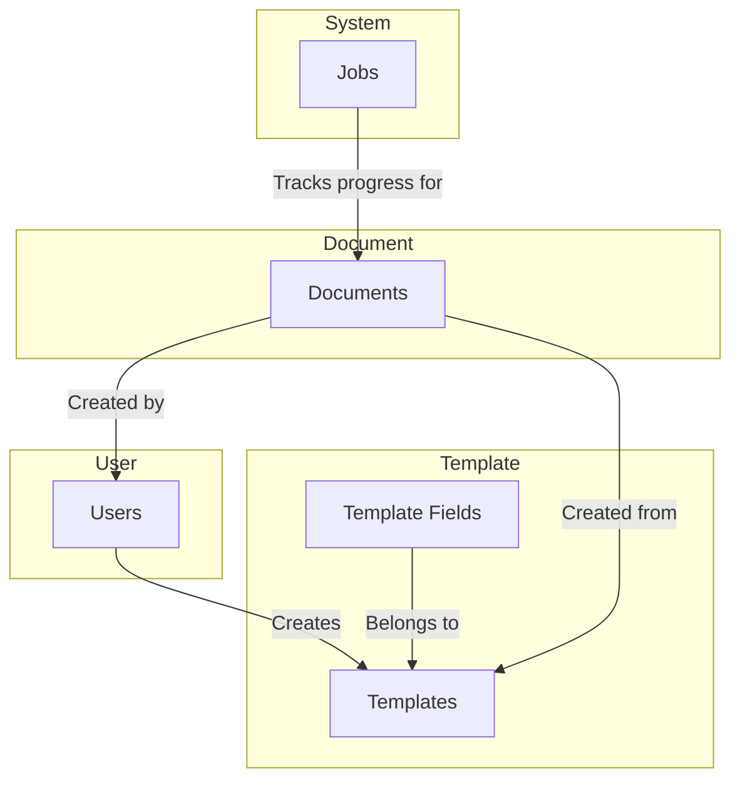
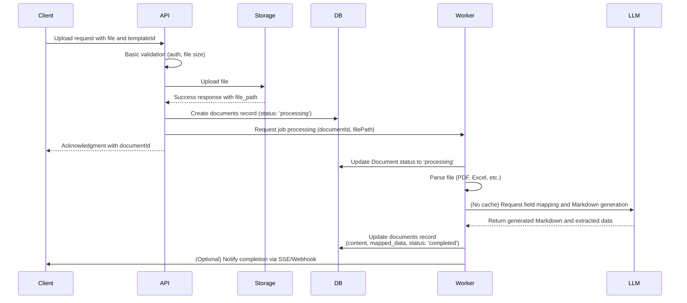

## database

> This revised architecture focuses on rapid launch and core value validation by incorporating the feedback above.

## A Minimal Viable Product (MVP) Data Flow and Schema

This revised architecture focuses on rapid launch and core value validation by incorporating the feedback above.

### 1. MVP Data Flow

The flow is simplified by merging complex phases and removing non-essential components, leaving only the core process.

#### 1.1 Simplified Overall Architecture



#### 1.2 Core Data Flow



-----

### 2. MVP Database Schema

The number of tables has been drastically reduced to focus on core entities.

```sql
-- User role ENUM type definition
CREATE TYPE user_role AS ENUM ('admin', 'member');

-- Users
CREATE TABLE users (
    id UUID PRIMARY KEY DEFAULT gen_random_uuid(),
    email VARCHAR(255) UNIQUE NOT NULL,
    name VARCHAR(255),
    auth_provider VARCHAR(50),
    role user_role DEFAULT 'member',
    created_at TIMESTAMPTZ DEFAULT NOW(),
    updated_at TIMESTAMPTZ DEFAULT NOW()
);

-- Field type ENUM
CREATE TYPE field_type AS ENUM ('text', 'number', 'date', 'boolean', 'select', 'multiselect');

-- Templates
CREATE TABLE templates (
    id UUID PRIMARY KEY DEFAULT gen_random_uuid(),
    name VARCHAR(255) NOT NULL,
    description TEXT,
    content TEXT NOT NULL, -- The Markdown body of the template
    created_by UUID REFERENCES users(id) ON DELETE SET NULL,
    is_active BOOLEAN DEFAULT true,
    created_at TIMESTAMPTZ DEFAULT NOW(),
    updated_at TIMESTAMPTZ DEFAULT NOW()
);

-- Template Fields
CREATE TABLE template_fields (
    id UUID PRIMARY KEY DEFAULT gen_random_uuid(),
    template_id UUID NOT NULL REFERENCES templates(id) ON DELETE CASCADE,
    field_key VARCHAR(255) NOT NULL, -- e.g., {{customer_name}}
    field_name VARCHAR(255) NOT NULL, -- e.g., "Customer Name"
    field_type field_type NOT NULL DEFAULT 'text',
    mapping_hints TEXT[], -- Hints for LLM mapping
    is_required BOOLEAN DEFAULT false,
    default_value TEXT,
    validation_rules JSONB,
    display_order INTEGER DEFAULT 0,
    created_at TIMESTAMPTZ DEFAULT NOW(),
    updated_at TIMESTAMPTZ DEFAULT NOW(),
    UNIQUE(template_id, field_key)
);

-- Document status ENUM type definition
CREATE TYPE document_status AS ENUM ('processing', 'completed', 'failed');

-- Documents (Core consolidated table)
CREATE TABLE documents (
    id UUID PRIMARY KEY DEFAULT gen_random_uuid(),
    template_id UUID NOT NULL REFERENCES templates(id),

    -- Source file info
    source_file_name VARCHAR(255) NOT NULL,
    source_storage_path TEXT NOT NULL,
    source_file_type VARCHAR(50),
    source_file_size INTEGER,

    -- Processing status and results
    status document_status DEFAULT 'processing',
    title VARCHAR(255),
    content TEXT, -- The final generated Markdown
    mapped_data JSONB, -- Data extracted and mapped by the LLM
    error_message TEXT, -- Error message on failure
    processing_started_at TIMESTAMPTZ,
    processing_completed_at TIMESTAMPTZ,

    -- Creation info
    created_by UUID REFERENCES users(id) ON DELETE SET NULL,
    created_at TIMESTAMPTZ DEFAULT NOW(),
    updated_at TIMESTAMPTZ DEFAULT NOW()
);

-- Indexes (Only basic FK and query indexes)
CREATE INDEX idx_users_email ON users(email);
CREATE INDEX idx_templates_created_by ON templates(created_by);
CREATE INDEX idx_templates_active ON templates(is_active);
CREATE INDEX idx_template_fields_template ON template_fields(template_id);
CREATE INDEX idx_documents_template ON documents(template_id);
CREATE INDEX idx_documents_status ON documents(status);
CREATE INDEX idx_documents_created_by ON documents(created_by);
CREATE INDEX idx_documents_status_created_at ON documents(status, created_at);
```

---
> Source: [greatSumini/document-parser](https://github.com/greatSumini/document-parser) — distributed by [TomeVault](https://tomevault.io).
<!-- tomevault:4.0:gemini_md:2026-05-06 -->
