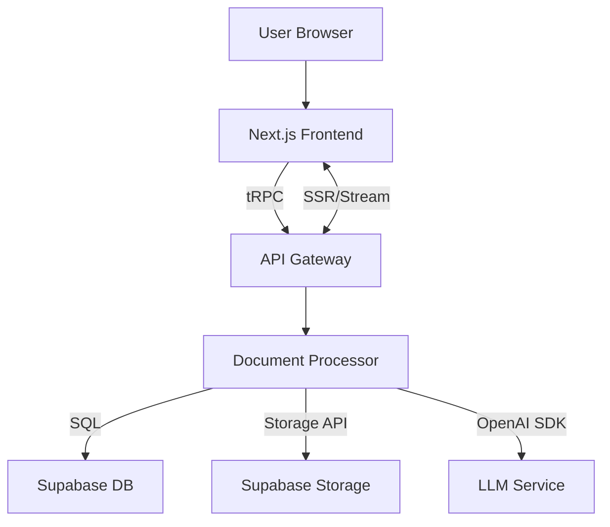

## vooster-architecture

> 사용자 업로드 자료(Excel, CSV, PDF, TXT 등)를 LLM(OpenAI GPT-4o)으로 파싱·매핑하여 병원 지정 Markdown 문서를 자동 생성하는 웹 SaaS. Next.js 15(App Router) + Server Components를 활용한 단일 코드베이스 풀스택 아키텍처로, Vercel에 배포하여 초기 시장 진입 속도를 극대화한다.

# 기술 요구 사항 문서(TRD)

## 1. 기술 총괄 요약
- **프로젝트 개요**  
  사용자 업로드 자료(Excel, CSV, PDF, TXT 등)를 LLM(OpenAI GPT-4o)으로 파싱·매핑하여 병원 지정 Markdown 문서를 자동 생성하는 웹 SaaS. Next.js 15(App Router) + Server Components를 활용한 단일 코드베이스 풀스택 아키텍처로, Vercel에 배포하여 초기 시장 진입 속도를 극대화한다.

- **핵심 기술 스택**  
  Frontend/Backend: Next.js 15 (App Router) + TypeScript, TRPC, Supabase(PostgreSQL & Storage), OpenAI SDK, Vercel AI SDK, Shadcn UI, Tailwind CSS  
  DevOps: Vercel(웹) + GitHub Actions(CI/CD), Supabase(데이터), Sentry(모니터링)  
  인프라 비용 최소화와 HIPAA 수준 보안을 동시에 고려한 클라우드 네이티브 구성을 채택

- **주요 기술 목표**  
  • 문서 생성 시간 ≤ 30 초(P95)  
  • 템플릿 목록 API 응답 ≤ 1.5 초(P95)  
  • 동시 문서 생성 1,000건 처리 시 SLO 99% 유지  
  • 매핑 정확도 ≥ 90%, 필수 필드 누락 0건

- **주요 기술 가정**  
  • 초기 MAU 5,000 기준 Supabase 단일 리전 성능으로 충분  
  • Vercel 서버리스 한계(50 ms 콜드 스타트)는 문서 생성 API에 영향 미미  
  • 향후 규제 필요 시 Vercel FedRAMP/HIPAA 파트너십 활용 가능  
  • LLM 비용은 프롬프트 최적화 및 캐싱으로 월 $2k 이하 유지

---

## 2. 기술 스택 아키텍처
### 프런트엔드
| 항목 | 기술 | 설명 |
| --- | --- | --- |
| 핵심 프레임워크 | Next.js 15(App Router) | 서버 컴포넌트 기반 SSR/SSG 지원, Vercel 최적화 |
| 상태 관리 | react-query(서버 상태) + Zustand(클라이언트 상태) | 데이터 동기화 및 로컬 UI 상태 분리 |
| 라우팅 | Next.js App Router | 파일 기반 라우팅 및 Layout 컴포지션 |
| UI/UX | Shadcn UI + Tailwind CSS + Lucide Icons | 접근성 준수 및 빠른 커스터마이징 |
| 빌드 도구 | Vercel(빌드) + Turbopack | 모노레포 스케일 지원 |

### 백엔드
| 항목 | 기술 | 설명 |
| --- | --- | --- |
| 런타임 | Node.js 20(Edge Runtime 병행) | V8 최적화, Vercel Edge Functions 지원 |
| 웹 프레임워크 | Next.js API Route + tRPC | 타입 안전 실시간 호출, 코드 공유 |
| API 패턴 | RPC(tRPC) + REST(파일 업로드) 혼합 | 실시간 및 대용량 전송 구분 |
| 입력 검증 | Zod 스키마 | 클라이언트·서버 동일 검증 |
| 미들웨어 | Sentry, Helmet, Rate-Limiter Flex | 로깅·보안·속도 제한 일관 적용 |

### 데이터베이스 & 영속 계층
| 항목 | 기술 | 설명 |
| --- | --- | --- |
| 기본 DB | Supabase(PostgreSQL 15) | JSONB·RLS, HIPAA­-ready |
| 스키마 설계 | 정규화 + JSONB Hybrid | 템플릿·버전 이력은 정규화, 매핑 메타는 JSONB |
| 캐싱 | Vercel Edge Config + SWR | LLM 캐시 및 읽기 집중 API 캐싱 |
| 마이그레이션 | Prisma Migrate | 코드 우선 스키마 관리 |
| 백업/복구 | Supabase PITR + Daily Snapshot | RPO ≤ 5 분, RTO ≤ 30 분 |

### 인프라 & DevOps
| 항목 | 기술 | 설명 |
| --- | --- | --- |
| 호스팅 | Vercel(프론트·서버리스) + Supabase(DB/Storage) | 무서버 인프라로 운영 부담 최소화 |
| 컨테이너화 | 필요 시 Docker(로컬 개발) | 운영 환경은 Vercel Serverless |
| CI/CD | GitHub Actions → Vercel Preview → Prod | PR 단위 미리보기 자동 생성 |
| 모니터링 | Sentry(APM) + Vercel Analytics + Supabase Logs | 장애 즉시 알림 및 성능 추적 |
| 로깅 | Sentry Error Track + Supabase Log Export | 중앙 집중 로그 및 규제 감사 대응 |

---

## 3. 시스템 아키텍처 설계

### 최상위 빌딩 블록
- Frontend Web App  
  • 사용자 인증, 파일 업로드, 실시간 편집 UI  
- API Gateway(tRPC Router)  
  • 인증 검증, 요청 라우팅, 속도 제한  
- Document Processor Service  
  • 파일 파서, 데이터 매핑, LLM 프롬프트 관리  
- Rendering Engine  
  • Markdown 생성·프리뷰, 버전 저장  
- Persistence Layer  
  • Supabase DB(메타) + Supabase Storage(파일)  
- Monitoring & Observability  
  • Sentry, Vercel Analytics, Log Export

### 상호 작용 다이어그램


- 사용자는 Frontend에서 파일 업로드 및 템플릿 선택 후 tRPC 호출  
- API Gateway는 인증·속도 제한 후 Document Processor로 포워딩  
- Document Processor는 파일 파싱→DB·Storage 저장→LLM 호출→Markdown 생성  
- 생성 결과는 DB에 버전 기록 후 프론트엔드로 스트리밍 전송

### 코드 조직 & 규칙
**도메인 중심 조직 전략**
- 검사 보고서, 템플릿, 인증, 감사 로그 등 바운디드 컨텍스트별 디렉터리 분리  
- 프레젠테이션·응용 서비스·도메인 모델·인프라 계층을 명확히 구분  
- 공통 유틸리티·타입은 `/shared` 모듈에 집중하여 재사용성 확보

**폴더 구조 트리**
```
/app-root
├── apps/
│   └── web/ (Next.js)
│       ├── app/
│       ├── components/
│       ├── features/
│       │   ├── report/
│       │   ├── template/
│       │   └── auth/
│       ├── lib/
│       └── styles/
├── packages/
│   ├── api/ (tRPC routers)
│   ├── db/  (Prisma, schema)
│   ├── llm/ (prompt, helpers)
│   └── shared/
│       ├── types/
│       ├── utils/
│       └── constants/
├── infra/
│   ├── docker/
│   ├── scripts/
│   └── config/
└── .github/
    └── workflows/
```

### 데이터 흐름 & 통신 패턴
- 클라이언트-서버: tRPC mutation으로 JSON 직렬화, SSE(LLM 스트림) 수신  
- DB 인터랙션: Prisma Client 사용, 트랜잭션으로 버전·메타 동시 기록  
- 외부 서비스: OpenAI SDK 호출 시 Retry + Circuit Breaker 패턴 적용  
- 실시간: SSE 스트리밍으로 프론트엔드 Mark­down 실시간 업데이트  
- 데이터 동기화: react-query 캐시·SWC 형상 업데이트로 UI 일관성 유지

---

## 4. 성능 최적화 전략
- LLM 프롬프트 결과 Edge Config 캐싱(60분 TTL)로 중복 호출 감소  
- 파일 파싱 CPU 부하를 분리하기 위해 Vercel Background Function 활용  
- 템플릿·정적 자산은 Next.js ISR(Incremental Static Regeneration) 적용  
- 쿼리 최적화: 필요한 컬럼만 선택, JSONB Index로 매핑 메타 조회 속도 향상

---

## 5. 구현 로드맵 & 마일스톤
### 단계 1: 기초(MVP) M0~M2
- 인프라: Vercel + Supabase 기본 세팅, CI/CD 파이프라인 구축  
- 필수 기능: 템플릿 CRUD, Excel/CSV 업로드·매핑, Markdown 생성  
- 보안: Clerk OAuth2, HTTPS, RLS 설정  
- 개발 환경: 모노레포, 코드 스타일, 테스트(Playwright smoke)  
- 완료 목표: 8주

### 단계 2: 기능 강화 M2~M4
- 고급 기능: 버전 관리, 역할 기반 권한(RBAC), PDF 렌더링  
- 성능: Edge Function 활용, 캐싱 레이어 도입  
- 보안 강화: 감사 로그, HIPAA 암호화 키 관리  
- 모니터링: Sentry 트레이싱, Log Export 대시보드  
- 완료 목표: 8주

### 단계 3: 확장·최적화 M4~M6
- 스케일: 동시 1,000건 처리 위한 워크큐(Redis → Queue Worker) 도입  
- 통합: 병원 EMR·LIS API 커넥터, 클라우드-온프렘 옵션  
- 엔터프라이즈: AI 편집 제안, 멀티 언어 UI, 조직 관리  
- 규제: 완전한 HIPAA/HITECH 감사 패키지, Pen-Test 완료  
- 완료 목표: 8주

---

## 6. 위험 평가 & 대응
### 기술적 위험
| 위험 | 설명 | 대응 |
| --- | --- | --- |
| LLM 출력 오류 | 의료 데이터 부정확 가능 | 룰 기반 검증, 재-프롬프트, 인간 검수 옵션 |
| 서버리스 콜드 스타트 | Peak Latency 증가 | Edge Function 로컬리티, 지속적 프리-워밍 |
| 파일 파싱 실패 | 다양한 형식·언어로 파싱 오류 | 파일 형식 검출 라이브러리, 예외 핸들링 UI 알림 |
| DB 성능 병목 | JSONB 검색 확장 시 IO 부하 | 인덱스 튜닝, Read Replica 도입 |

### 프로젝트 위험
| 위험 | 설명 | 대응 |
| --- | --- | --- |
| 일정 지연 | 새로운 규제 요구·LLM 비용 변수 | 버퍼 20% 포함, 기능 스코프 조정 |
| 인력 부족 | LLM·프론트 전문 개발자 수급 | 외부 컨설턴트 풀 확보, 문서화로 온보딩 단축 |
| 품질 저하 | 테스트 커버리지 부족 | CI 머지 블로커, e2e 테스트 자동화 |
| 배포 실패 | 환경 차이로 프로덕션 장애 | 3-Stage(Preview/Staging/Prod) 배포, Canary 릴리스 |

---

---
> Source: [greatSumini/document-parser](https://github.com/greatSumini/document-parser) — distributed by [TomeVault](https://tomevault.io).
<!-- tomevault:4.0:gemini_md:2026-05-06 -->
