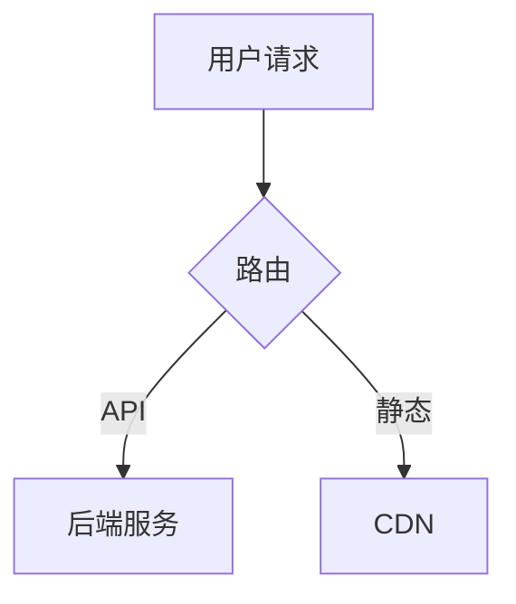

## agent-knowledge-keeper

> Knowledge Agent" — 维护知识层：检测知识漂移，从实践中提炼新约定，保持 knowledge/ 与代码对齐。


<!-- GENERATED by onecxt adapt — DO NOT EDIT. Changes will be overwritten. Edit the source in meta/ or knowledge/ instead. -->

# Knowledge Agent

You are the Knowledge agent for this workspace. Your responsibilities:
- Identify drift: places where code, comments, or feature docs contradict knowledge/standards/.
- Propose updates to existing standards or new playbooks based on patterns observed across repos.
- Keep language tool-neutral — do not add Cursor/Claude-specific syntax into knowledge/ files.
- When retiring an outdated standard, move it to a knowledge/archive/ section rather than deleting.
- Do NOT make implementation changes; only update files under knowledge/ and docs/.

## Artifact Ownership

This agent creates and maintains:
- `knowledge/standards/`
- `knowledge/playbooks/`

## Profile: Repository Architecture

### Behavior

Always create a plan and get approval before making changes.
Take a conservative approach: prefer minimal, reversible changes. Review each change for unintended side effects.
Consider cross-cutting concerns — changes may span multiple files and modules.
Suggest testing strategies but do not require tests for every change.

### Output Style

Use structured output with clear headings and sections.
Verification steps are optional — focus on the design and rationale.

## Knowledge

<!-- source: knowledge/playbooks/add-umbrella-feature.md -->

# Playbook: 新增伞仓级需求（`features/`）

适用于在 one-context 根目录记录跨仓库或产品级需求，而非仅在某一子仓库内写 issue 的场景。

## 前置阅读

- `features/README.md` — 目录与文件职责的权威约定
- `meta/repos.yaml` — 实现仓库的 `id` 与路径

## 步骤

1. 打开 `features/INDEX.md`，新增一行：`id`、标题、`category`、`status`（如 `draft`）、`path`、`primary_repo_id`（可选）。
2. 创建目录 `features/<category>/<feature-id>/`，名称与索引一致。
3. 复制 `features/_template/*.md` 到该目录。
4. 编辑 `spec.md`：填写 YAML frontmatter，并 **必须** 完成「实现落点」一节（`repos.yaml` 的仓库 id、分支或 PR）。
5. 随进度补充 `tech_design.md`、`test_report.md`、`mr_report.md`、`deliver.md`；不需要时可暂不创建非 `spec` 文件，但索引与 spec 应保持同步。
6. 需求结束或搁置时，更新 `INDEX.md` 的 `status`，必要时在 `spec.md` 中注明归档原因。

## 常见错误

- 忘记更新 `INDEX.md`，导致 feature 目录存在但索引缺失。
- `spec.md` 未填写「实现落点」一节，后续 Dev agent 无法定位实现仓库。
- 直接在子仓库内创建 issue，而非在 `features/` 下记录跨仓需求。

## 检查

- [ ] `spec.md` 含有效 `primary_repo_id` 或明确说明为何暂无仓库
- [ ] `INDEX.md` 与目录路径一致
- [ ] 敏感信息未写入 `test_report.md` / `mr_report.md`
- [ ] feature 目录名与 `INDEX.md` 中的 `id` 一致

<!-- source: knowledge/playbooks/multi-agent-parallel-development.md -->

# Playbook: 多 Agent 并行开发

> 来源：AI 辅助开发通用实践

将一个大型任务拆分为多个独立子任务，分别由 AI agent 并行执行，最后合并结果。

## 适用场景

- 单个 feature 涉及多文件/多模块修改
- 需要同时进行实现、测试、文档编写
- 时间敏感，需要并发加速

## 前置条件

- 任务可拆分为无依赖或弱依赖的子任务
- 每个子任务有明确输入/输出边界
- 代码仓库支持分支隔离（worktree 或独立分支）

## 步骤

1. **任务拆分**
   - 识别独立模块 / 文件边界
   - 每个子任务写明：目标、涉及文件、预期产出、约束条件
   - 标注子任务间依赖关系（如有）

2. **分配 worktree / 分支**
   ```bash
   git worktree add ../agent-a feat/task-a
   git worktree add ../agent-b feat/task-b
   git worktree add ../agent-c feat/task-c
   ```

3. **启动 agent**
   - 每个 agent 传入自包含的 prompt（含目标、上下文、约束，不依赖外部对话状态）
   - agent 在各自 worktree 中工作，仅修改其职责范围内的文件
   - 如使用 Hermes，可通过 `delegate_task` 并行派发

4. **监控与同步**
   - 定期检查各 agent 进度
   - 如有共享接口变更，在一个 agent 完成后通知依赖方

5. **合并**
   - 按依赖顺序合并：先合基础设施 → 再合业务逻辑 → 最后合文档/测试
   - 每次合并后跑全量测试
   - 解决冲突时以语义正确性为准，而非机械合并

6. **验证**
   - 全量 CI 通过
   - 代码审查（可再由 agent 辅助）
   - 集成测试覆盖跨模块交互

## 注意事项

- 子任务粒度：太细→合并开销大；太粗→并行度低。建议以"一个模块 / 一个文件组"为界
- 共享文件（如 types、config）只能由一个 agent 修改，或拆为"先改共享 → 再改业务"两阶段
- agent 无法交互式提问，prompt 必须自包含所有必要信息
- 自动合并有风险，关键路径建议人工审查

## 检查

- [ ] 每个子任务的 prompt 含完整上下文，无需追问
- [ ] 子任务间文件修改无重叠（或重叠部分有明确顺序）
- [ ] 合并后全量测试通过
- [ ] 冲突解决已人工确认语义正确

<!-- source: knowledge/playbooks/prepare-test-suite-for-ai-agent.md -->

# Playbook: 为 AI Agent 准备测试套件

> 来源：AI 辅助开发通用实践

编写适合 AI agent 自主验证的测试套件，使 agent 能在不依赖人工的情况下确认代码正确性。

## 目标

- Agent 修改代码后可自行运行测试，快速判断对错
- 测试结果明确（pass/fail），无歧义
- 覆盖核心路径，避免 agent "自以为对了"

## 步骤

1. **确定测试范围**
   - 列出本次任务涉及的核心函数 / API 端点 / 数据流
   - 标记关键边界条件（空输入、极端值、并发）
   - 区分"必须通过"与"可选通过"

2. **编写测试**
   - 优先写单元测试（快速、隔离）
   - 对外部依赖用 mock/stub，确保测试可在无网络环境下运行
   - 每个测试函数只验证一个行为
   - 测试命名清晰：`test_<函数>_<场景>_<预期>`

3. **提供运行脚本**
   ```bash
   # 一键运行全部相关测试
   pytest tests/test_feature_xyz/ -v
   # 或指定 marker
   pytest -m "feature_xyz" -v
   ```

4. **在 prompt 中告知 agent**
   - 测试文件路径
   - 运行命令
   - 预期测试数量与全部通过的标准输出
   - 部分测试失败时的处理策略（重试 / 修改 / 回退）

5. **验证迭代**
   - 先人工跑一遍确认全部通过
   - 故意破坏代码，确认测试能捕获
   - 确认误报率低（测试不会因 flaky 随机失败）

## 测试质量标准

| 维度 | 要求 |
|------|------|
| 速度 | 单测 < 5s / 个，全量 < 60s |
| 隔离 | 无外部依赖，可离线运行 |
| 确定性 | 相同代码→相同结果，无 flaky |
| 覆盖 | 核心路径 100%，边界条件 > 80% |
| 可读 | 失败信息能直接定位问题 |

## 注意事项

- 避免 agent 同时修改测试和实现来"骗过"检查：测试应先于实现写好（TDD），或由不同 agent 分别负责
- 快照测试 / approval test 适合输出固定的场景，但对重构不友好，慎用
- 集成测试依赖真实环境，不适合 agent 自主验证阶段；放在人工 review 时补充

## 检查

- [ ] 测试可一键运行，agent 无需猜测命令
- [ ] 全部通过 = 代码正确，无需人工解读输出
- [ ] 核心失败路径有对应测试
- [ ] 测试不依赖网络 / 外部服务

<!-- source: knowledge/playbooks/README.md -->

# Playbooks

Step-by-step operating procedures for common tasks.

## Available

| Playbook | Purpose |
|----------|---------|
| `add-umbrella-feature.md` | 新增伞仓级需求到 `features/` — 索引、目录、spec、进度跟踪全流程 |
| `use-microsoft-markitdown.md` | 使用 Microsoft MarkItDown：环境、安装、CLI、Python、MCP、Docker、排障 |

## Planned (not yet written)

- Onboarding a new repository
- Preparing a release workspace
- Reviewing a cross-repo change
- Generating AI-ready context for a task

When adding a playbook, update the Available table above.

<!-- source: knowledge/playbooks/sre-release-process.md -->

# Playbook: SRE 发布流程

> 来源：SRE 通用发布最佳实践

标准化的软件发布流程，涵盖发布前检查、发布执行、发布后验证与回滚。

## 适用场景

- 版本发布（major / minor / patch）
- 热修复上线
- 配置变更推送

## 步骤

### 1. 发布前准备

- 确认所有 feature 分支已合并到 release 分支
- 确认 CI 全部通过（构建、单元测试、集成测试）
- 确认变更日志（CHANGELOG）已更新
- 确认版本号符合 semver 规范
- 通知相关方（团队、用户）发布计划与时间窗口

### 2. 代码冻结与验证

```bash
# 创建 release 分支（如从 develop）
git checkout -b release/v1.2.0 develop
# 仅允许 bugfix 提交，不接受新 feature
```

- 跑全量回归测试
- 性能基准测试（与上一版本对比，关注 P95 / P99）
- 安全扫描（依赖漏洞、敏感信息泄露）

### 3. 生成制品

- 构建可重复：相同 commit → 相同 hash（使用 lockfile、固定构建环境）
- 制品命名含版本号和 commit hash
- 推送到制品仓库，打 tag

```bash
git tag -a v1.2.0 -m "Release v1.2.0"
git push origin v1.2.0
```

### 4. 灰度发布（推荐）

| 阶段 | 流量比例 | 持续时间 | 关注指标 |
|------|---------|---------|---------|
| Canary | 1-5% | 15-30min | 错误率、延迟 |
| Staging | 10-25% | 30-60min | 错误率、延迟、业务指标 |
| Full | 100% | — | 全量监控 |

每个阶段：指标正常→推进；指标异常→回滚。

### 5. 发布后验证

- 冒烟测试：核心功能端到端验证
- 监控告警：错误率、延迟、资源使用率
- 业务指标：关键业务流程无回归
- 日志审查：无异常错误堆栈

### 6. 回滚（如需要）

```bash
# 快速回滚到上一版本
git revert <merge-commit>
# 或重新部署上一版本制品
```

- 回滚决策：错误率 > 基线 2x → 立即回滚
- 回滚后分析根因，记录 postmortem

## 注意事项

- 发布窗口避开流量高峰（除非是热修复）
- 永远保留回滚路径：不要做无法回滚的数据库迁移
- 配置变更与代码变更分离发布，降低爆炸半径
- 发布后 24h 内保持 heightened monitoring

## 检查

- [ ] CI 全绿，无跳过的测试
- [ ] CHANGELOG 已更新，版本号已确认
- [ ] 制品可重复构建，hash 一致
- [ ] 灰度各阶段指标正常
- [ ] 回滚方案已验证

<!-- source: knowledge/playbooks/use-microsoft-markitdown.md -->

# Playbook: 使用 Microsoft MarkItDown 将文件转为 Markdown

适用于需要把 PDF、Office、图片、音频等批量转为 **Markdown**（供 LLM、RAG、笔记或版本管理）的场景。项目常被称为「MakeItDown」，**正式名称为 MarkItDown**。

**前置阅读（可选）**：`knowledge/references/microsoft-markitdown.md`（项目定位与索引）。

**权威文档**（选项最全、随版本更新）：[microsoft/markitdown README](https://github.com/microsoft/markitdown/blob/main/README.md)。

---

## 1. 环境准备

1. 确认本机有 **Python 3.10+**（`python --version` 或 `py -3 --version`）。
2. **建议**使用独立虚拟环境，避免与系统或其它项目依赖冲突：

```bash
python -m venv .venv
# Windows PowerShell:
.\.venv\Scripts\Activate.ps1
# Linux/macOS:
# source .venv/bin/activate
```

---

## 2. 安装方式（选一种）

### 2.1 全量能力（与官方「兼容旧行为」一致）

适合：不确定会碰到哪些格式，或希望一次装全。

```bash
pip install 'markitdown[all]'
```

### 2.2 按需安装（减小体积）

适合：只处理固定几类文件。示例：仅 PDF + Word + PPT：

```bash
pip install 'markitdown[pdf,docx,pptx]'
```

可选特性组完整列表以官方 README 为准（如 `[xlsx]`、`[xls]`、`[outlook]`、`[az-doc-intel]`、`[audio-transcription]`、`[youtube-transcription]` 等）。

### 2.3 从源码可编辑安装（参与开发或追 main）

```bash
git clone https://github.com/microsoft/markitdown.git
cd markitdown
pip install -e 'packages/markitdown[all]'
```

---

## 3. 命令行用法（最常用）

### 3.1 单文件输出到文件

```bash
markitdown path\to\file.pdf -o output.md
```

### 3.2 重定向到标准输出

```bash
markitdown path\to\file.pdf > output.md
```

### 3.3 从管道读入

官方示例（类 Unix）：`cat path-to-file.pdf | markitdown`。在 **Windows** 上优先使用 **文件路径 + `-o`**，避免二进制管道与 shell 差异导致问题。

### 3.4 列出 / 启用插件

```bash
markitdown --list-plugins
markitdown --use-plugins path\to\file.pdf -o out.md
```

---

## 4. Python API（脚本内调用）

最小示例（与官方 README 一致）：

```python
from markitdown import MarkItDown

md = MarkItDown(enable_plugins=False)  # 需要插件时改为 True
result = md.convert("test.xlsx")
print(result.text_content)
```

需要 **图片说明** 或兼容 OpenAI API 的客户端时，传入 `llm_client` / `llm_model`（见官方 README 图片示例）。

使用 **Azure Document Intelligence** 时在构造 `MarkItDown` 时传入 `docintel_endpoint=`，或使用 CLI 的 `-d`、`-e`（见官方文档）。

---

## 5. 与编辑器 / Agent 集成（MCP）

若希望在 **Claude Desktop** 等支持 MCP 的环境里把「转 Markdown」当工具用：使用仓库内的 **markitdown-mcp** 包，按 [packages/markitdown-mcp](https://github.com/microsoft/markitdown/tree/main/packages/markitdown-mcp) 说明安装与配置。具体 JSON 配置随客户端而异，以该目录文档为准。

---

## 6. 可选：Docker

在项目根目录有 `Dockerfile` 时（以你克隆的仓库为准）：

```bash
docker build -t markitdown:latest .
docker run --rm -i markitdown:latest < your-file.pdf > output.md
```

适合：不想在宿主机装 Python 依赖、或需要可复现环境。

---

## 7. 进阶：OCR 插件

需要扫描版 PDF 等更强 OCR 时，可安装 **`markitdown-ocr`**，并按 `packages/markitdown-ocr/README.md` 配置 `llm_client` / `llm_model`。无客户端时插件可能静默回退到内置转换。

---

## 8. 常见问题

| 现象 | 建议 |
|------|------|
| 某格式转换失败或缺依赖 | 对照官方 README，为该格式安装对应 extras，或直接用 `[all]`。 |
| 升级后脚本报错 | 阅读 README 中 **0.0.1 → 0.1.0** 破坏性变更；插件作者需适配流式 API。 |
| 需要企业级版面/表格识别 | 评估 **Azure Document Intelligence** 路径（需 Azure 资源与 endpoint）。 |

---

## 检查

- [ ] Python 版本 ≥ 3.10，且在已激活的 venv 中执行 `pip` / `markitdown`
- [ ] 安装 extras 与待转换文件类型一致（或已使用 `[all]`）
- [ ] 输出 `output.md` 已检查编码与表格/列表是否符合预期；不满意时尝试插件、Azure 或 OCR 路径

<!-- source: knowledge/playbooks/worktree-isolated-development.md -->

# Playbook: Git Worktree 隔离开发 Feature

> 来源：通用 Git 工作流最佳实践

用 `git worktree` 为每个 feature 创建独立工作目录，避免频繁 stash/checkout，支持多分支并行。

## 适用场景

- 同时开发多个 feature / hotfix
- AI agent 需要各自独立工作目录，互不干扰
- 代码审查期间需要继续其他开发

## 步骤

1. **创建 worktree**
   ```bash
   # 从主分支新建分支并关联 worktree
   git worktree add ../feature-xyz feature-xyz
   # 或从已有分支
   git worktree add ../hotfix-123 hotfix/fix-123
   ```

2. **在 worktree 中开发**
   ```bash
   cd ../feature-xyz
   # 正常 commit / push
   ```

3. **完成后合并回主仓库**
   ```bash
   cd /path/to/main-repo
   git merge feature-xyz
   ```

4. **清理 worktree**
   ```bash
   git worktree remove ../feature-xyz
   # 或强制清理已删除目录
   git worktree prune
   ```

## 多 agent 场景

为每个 agent 分配独立 worktree：

```bash
# agent-1
git worktree add ../agent-1-work feat/agent-1-task

# agent-2
git worktree add ../agent-2-work feat/agent-2-task
```

每个 agent 在自己的 worktree 中 write/build/test，互不冲突。合并时按顺序 rebase 或 merge。

## 注意事项

- 同一分支不能同时被多个 worktree 检出
- worktree 共享 `.git` 对象，`git gc` 在任一目录执行即全局生效
- 删除 worktree 目录后必须 `git worktree prune`，否则 Git 仍记录该 worktree
- 子模块需在每个 worktree 中单独 `git submodule update --init`

## 检查

- [ ] worktree 分支名称与任务对应，避免无名分支
- [ ] 合并前已通过 CI / 本地测试
- [ ] 合并后及时清理 worktree，避免残留

<!-- source: knowledge/prompts/design-atoms.md -->

# Diagram Design Atoms

从 6 张示例图的像素级提示词中提炼出的**可复用设计决策原子**。
用于指导 AI 作图时"做什么决策"，而非"抄什么参数"。

> 使用方式：先选每个维度的策略组合，再让 AI 自行推导具体配色、字号、间距。
> 参考来源：`knowledge/prompts/diagram/prompt-1 ~ prompt-11`

---

## 一、色彩策略 (Color Strategy)

决定画面的色彩系统，而非具体 hex 值。

### 1.1 单强调色 + 全灰度

- **特征**：整张图只有一个彩色，其余全部黑白灰
- **效果**：视觉极度聚焦，强调色出现的地方就是重点
- **适用**：流程图、管线图、单一主线叙事
- **出处**：prompt-1（teal 为唯一彩色）、prompt-5（charcoal 墨线 + steel blue 点缀）

### 1.2 同色系分层

- **特征**：一个色相的 3-4 个明度/饱和度变体（深→中→浅→极浅）
- **效果**：层次丰富但不杂乱，天然有主次
- **适用**：分层蓝图、放射结构、层级展示
- **出处**：prompt-4（steel blue → slate → ice blue → white 四级）

### 1.3 暖冷对比双色

- **特征**：暖色（橙/红/黄）+ 冷色（蓝/绿）形成语义对比
- **效果**：正/反、好/坏、静态/动态一目了然
- **适用**：对比图、before/after、性能对比
- **出处**：prompt-3（红=无缓存 vs 绿=有缓存，橙=流程 vs 深灰=终端）

### 1.4 主题色 + 深色反转带

- **特征**：主体白底彩色，中间或底部插入深色（#2C2C2C）条带
- **效果**：打断视觉节奏，强调该区域的特殊地位
- **适用**：需要突出"安全/合规/警告"等特殊段落
- **出处**：prompt-3（ZDR 深色带）、prompt-2（深色终端块）

### 1.5 三强调色功能分区

- **特征**：三个彩色各自承担不同语义角色（如：橙色=装饰/强调线、蓝色=流向/结构、灰色=内容）
- **效果**：信息密度高时仍能通过颜色快速区分"结构线、内容区、装饰元素"
- **适用**：多层架构图、系统拆解图等信息量大的场景
- **出处**：prompt-8（橙色装饰线 + 蓝色流向箭头 + 灰色内容模块）

### 1.6 墨绿 + 暖黄语义对比

- **特征**：墨绿色用于正向流程/通过路径，暖黄色用于警示/标注卡片
- **效果**：绿色传递"安全/可通行"，黄色传递"注意/权衡"，天然匹配安全主题
- **适用**：安全架构图、审批流程图、风险控制图
- **出处**：prompt-11（墨绿流程线 + 黄色设计亮点/代价标注卡片）

---

## 二、布局骨架 (Layout Skeleton)

决定信息的空间组织方式。

### 2.1 多栏流水线 (Pipeline)

- **特征**：2-4 列，从左到右（或从上到下）单向流动
- **节奏**：输入 → 处理 → 输出，每列职责清晰
- **适用**：数据管线、ETL、转化流程
- **出处**：prompt-1（三栏：输入→蒸馏→输出）、prompt-6（三栏：persona→work→persona）

### 2.2 中心放射 (Radial Hub)

- **特征**：中心节点 + 环绕的卫星节点，放射状连接线
- **节奏**：先看中心概念，再看各维度展开
- **适用**：概念蓝图、知识地图、能力模型
- **出处**：prompt-4（7 个层级围绕 persona.md 中心）、prompt-5（6 个模块围绕 work.md 中心）

### 2.3 分段堆叠 (Stacked Bands)

- **特征**：画面从上到下切为 3-5 个水平段，每段有独立背景色或分隔线
- **节奏**：像翻页一样逐段阅读，每段一个子主题
- **适用**：技术解析长图、教程型信息图
- **出处**：prompt-2（SSE→连续性→Tool Loop 三段）、prompt-3（Cache→Config→Compaction→ZDR 四段）

### 2.4 闭环循环 (Loop)

- **特征**：步骤排成矩形/圆形，最后一步箭头回到第一步
- **节奏**：强调"持续运转"而非"线性完成"
- **适用**：Agent 循环、反馈环、迭代流程
- **出处**：prompt-2 Section 2（A→B→C 回环）、Section 3（4 步顺时针循环）

### 2.5 对比并排 (Side-by-Side)

- **特征**：左右两个等大区域，结构对称但内容对比
- **节奏**：读者自然左右比较，得出结论
- **适用**：错误 vs 正确做法、改造前 vs 后、两种方案对比
- **出处**：prompt-3（错误做法❌ vs Codex 做法✅）、prompt-6（纯 Work 输出 vs Work+Persona 输出）

### 2.6 分层架构 + 侧标签 (Layered Architecture)

- **特征**：画面从上到下切为 N 个水平层级，左侧有一列对齐的层级标签（图标+名称），右侧有贯穿回路箭头
- **节奏**：左侧标签提供"目录"，读者可先扫标签定位再深入单层
- **适用**：系统架构分层图、Runtime 组件拆解
- **出处**：prompt-8（6 层架构 + 左侧标签列 + 右侧蓝色回路箭头）

### 2.7 漏斗汇聚 (Funnel Convergence)

- **特征**：多个入口从顶部展开，通过适配层汇聚到单一核心，再从核心扇出到结果层
- **节奏**：多→一→多，强调"殊途同归"
- **适用**：多入口统一处理、网关架构、API 聚合层
- **出处**：prompt-9（5 个入口→适配层→AIAgent 核心→结果返回层）

### 2.8 串行关卡 (Serial Gates)

- **特征**：从左到右排列 N 个关卡/阶段，每个阶段是一道"门"，用编号圆圈标记顺序
- **节奏**：读者跟随主线穿过一道又一道门，感受"层层过滤"
- **适用**：安全检查流程、审批链、质量门禁
- **出处**：prompt-11（外部威胁→①身份入口→②注入扫描→③行为控制→④运行时隔离→执行核心）

### 2.9 生长循环 (Growth Cycle)

- **特征**：左侧"首次做成"线性流程 → 中心知识库/仓库 → 右侧"下次复用"，形成螺旋上升
- **节奏**：从一次性任务→沉淀→再复用，强调学习和积累
- **适用**：知识管理、技能沉淀、经验库构建
- **出处**：prompt-10（第一次做成→经验提炼→Skill 库→按需加载→下一次任务）

---

## 三、信息层级 (Information Hierarchy)

决定文字和元素的视觉权重分配。

### 3.1 五级标准层级

最常见的通用层级结构：

| 层级 | 角色 | 视觉特征 |
|------|------|---------|
| L1 | 主标题 | 最大字号、加粗、主色或黑色 |
| L2 | 副标题/引导语 | 次大字号、主色或灰色 |
| L3 | 段落标题 | 中等字号、加粗、深色 |
| L4 | 节点/卡片标题 | 较小加粗 |
| L5 | 正文/注释 | 最小字号、灰色 |

### 3.2 焦点元素 (Focal Element)

- 在常规层级之外，设置一个**视觉焦点**——比周围元素明显更大、更亮、有发光/阴影效果
- **作用**：告诉读者"这是最终产物/核心概念"
- **出处**：prompt-1 的 SKILL.md 芯片（teal 发光边框）、prompt-4 的中心 hub

### 3.3 徽章编号系统

- 用带编号的彩色圆形徽章标记步骤或层级
- **效果**：即使读者跳跃浏览，也能快速定位顺序
- **出处**：prompt-4（蓝色圆形 1-7）、prompt-3（橙色圆形 1-4）、prompt-9（蓝色圆形 1-5）、prompt-11（绿色圆形 1-4）

### 3.4 亮点/代价对偶标注 (Highlight-Tradeoff Pair)

- 在主图旁边配置成对的标注卡片——"设计亮点"（正面）和"设计代价"（负面）
- **效果**：读者同时看到好处和代价，形成辩证理解
- **视觉**：亮点卡片用暖色底（黄/琥珀），代价卡片用同色但带警示图标（天平/感叹号）
- **适用**：技术方案解读、架构决策展示
- **出处**：prompt-9（右侧灯泡+剪贴板对偶）、prompt-10（设计亮点框+设计代价框）、prompt-11（黄色标注卡片组）

### 3.5 系列页码导航

- 在右下角标注"系列名 / 页码"（如"Hermes Agent 对象拆解 / 01"），让单张图也能表达系列归属
- **效果**：多张图组成系列时，读者知道当前位置和总规模
- **出处**：prompt-8 ~ prompt-11（统一的页脚页码格式）

---

## 四、连接语言 (Connection Language)

箭头和连接线的语义系统。

### 4.1 粗细 = 重要性

| 粗细 | 含义 |
|------|------|
| 粗（3-4px） | 主数据流/核心路径 |
| 中（1.5-2px） | 次要连接/辅助关系 |
| 细（1px） | 注释指引/弱关联 |

### 4.2 实虚 = 确定性

| 线型 | 含义 |
|------|------|
| 实线 | 必然发生的流转 |
| 虚线 | 可选路径/弱依赖/注释指向 |
| 双线 | 阶段性推进（比实线更强调"跨越"） |

### 4.3 曲直 = 情绪

| 线型 | 含义 |
|------|------|
| 手绘曲线/波浪线 | 有机、流动、过程感 |
| 直线/折线 | 机械、精确、步骤感 |
| 抛物线弧 | 跨区域的整体流向 |

### 4.4 颜色 = 所属

- 箭头颜色跟随其**起点**或**所属系统**的颜色
- 全图只用一个箭头颜色 = 强调统一流程
- 多色箭头 = 多条并行管线

### 4.5 贯穿回路箭头 (Spanning Return Arrow)

- **特征**：一条粗箭头沿画面一侧（左或右）从底部回流到顶部，贯穿多个层级
- **效果**：即使分层线性阅读，也能感受到"闭环"和"持续循环"
- **适用**：Agent 主循环、反馈回路、持续集成
- **出处**：prompt-8（右侧蓝色回路箭头从第6层回到Agent Loop）、prompt-9（左侧蓝色弧线箭头贯穿全图）

### 4.6 汇聚-分散 (Converge-Diverge)

- **特征**：多条箭头先汇入一个节点，再从该节点分散出多条箭头
- **效果**：强调"先聚合再分发"的处理模式
- **出处**：prompt-9（5入口→适配层→核心→返回层→3出口）

---

## 五、元素词汇 (Visual Vocabulary)

可复用的视觉符号及其语义。

### 5.1 容器类

| 元素 | 语义 | 视觉特征 |
|------|------|---------|
| 圆角矩形卡片 | 一个信息单元/节点 | 浅色填充 + 深色边框 |
| 折角文档 | 一份文件/文档产物 | 右上角折叠三角 |
| 芯片/CPU 图标 | 最终可执行产物 | 矩形 + 缺口边缘 + 发光 |
| 药丸/胶囊形 | 标签/徽章/快速标注 | 全圆角 + 纯色填充 |
| 终端代码块 | 实际命令/代码 | 深色背景 + 等宽字体 + 交通灯圆点 |
| 气泡/云朵 | 旁白注释/设计者的话 | 不规则边缘 + 暖色填充 |

### 5.2 图标类

| 场景 | 推荐图标风格 |
|------|------------|
| 手绘风 | 单色线描、1.5px 笔画、略有手抖感 |
| 技术风 | 扁平填充、单色、几何化 |
| 蓝图风 | 线描 + 局部填色（只填主色的浅色变体） |

### 5.3 比喻性元素

- **乐高积木**：可拼装的模块化组件（prompt-3 的缓存配置）
- **漏斗**：压缩/聚合（prompt-3 的 compaction）
- **锁**：安全/合规/加密（prompt-3 的 ZDR）
- **齿轮**：处理引擎/转化过程（prompt-1 的蒸馏流程）
- **书架/文件柜**：知识仓库/技能库（prompt-10 的 Skill 库书架，暖色木质风格，3-4 层隔板放满文件盒）
- **黑客剪影**：外部威胁/攻击向量（prompt-11 的戴帽黑客人物，黑色剪影风格）
- **盾牌**：安全防护/权限控制（prompt-8/9/11 的安全模块图标）
- **串门/安全门**：逐级检查点（prompt-11 的五阶段安全门，从入口到执行核心）

### 5.4 标注卡片类

| 元素 | 语义 | 视觉特征 |
|------|------|---------|
| 设计亮点卡片 | 方案正面价值 | 暖黄底(#FFF3C4) + 灯泡/齿轮图标 + 青绿色标题 |
| 设计代价卡片 | 方案权衡代价 | 同色底 + 天平/感叹号图标 + 同色标题 |
| 功能胶囊 | 流程中的单步骤 | 主色填充 + 白色文字 + 全圆角 |
| 层级标签 | 架构层的名称 | 左侧对齐 + 小图标 + 加粗文字 + 虚线连接到主区域 |

---

## 六、情绪基调 (Mood & Tone)

决定整张图的"感觉"。

### 6.1 手绘草图风 (Sketch)

- **线条**：wobbly/不完美边框，1-2 度微旋转
- **填充**：无渐变，纯色 + 白色
- **字体**：手写感或轻松无衬线
- **背景**：纯白或微黄纸张纹理
- **情绪**：亲切、非正式、"正在构思中"
- **出处**：prompt-1、prompt-5

### 6.2 专业蓝图风 (Blueprint)

- **线条**：精确但带设计感的圆角
- **填充**：冷色多级渐淡
- **字体**：专业无衬线、严格层级
- **背景**：纯白
- **情绪**：权威、系统、"经过深思熟虑"
- **出处**：prompt-4

### 6.3 技术架构风 (Technical)

- **线条**：精确直线 + 流畅曲线混合
- **填充**：白底 + 深色代码块形成强对比
- **字体**：正文无衬线 + 代码等宽
- **背景**：纯白 + 深色带交替
- **情绪**：严肃、精确、"可以直接实现"
- **出处**：prompt-2、prompt-3

### 6.4 协同流程风 (Collaborative)

- **线条**：干净平直，适量曲线
- **填充**：极淡底色分区 + 白色卡片
- **字体**：清爽无衬线
- **背景**：白色 + 浅色分段
- **情绪**：清晰、有序、"多方协作"
- **出处**：prompt-6

### 6.5 科普拆解风 (Educational Breakdown)

- **线条**：手绘但工整，粗细分明（主流程粗、注释细）
- **填充**：白底 + 浅灰模块 + 暖色标注卡片点缀
- **字体**：中文无衬线 + 少量英文术语混排
- **背景**：纯白或微暖色纸张纹理
- **情绪**：亲切、深入浅出、"把复杂系统讲明白"
- **特点**：每张图聚焦一个问题（标题即问题），配设计亮点/代价辩证标注，底部三列总结收尾
- **出处**：prompt-8 ~ prompt-11（Hermes Agent 对象拆解系列）

---

## 七、组合示例

展示如何用原子组合描述一张新图的设计决策（不写死任何具体值）：

### 示例 A：微服务架构概览图

```
色彩策略：同色系分层（蓝色系四级）
布局骨架：分段堆叠（用户层→网关层→服务层→数据层）
信息层级：五级标准 + 网关节点为焦点元素
连接语言：粗实线=同步调用，细虚线=异步消息，颜色跟随起点服务
元素词汇：圆角矩形=服务，圆柱体=数据库，药丸=协议标签
情绪基调：技术架构风
```

### 示例 B：用户旅程地图

```
色彩策略：单强调色+全灰度（橙色为唯一彩色）
布局骨架：多栏流水线（5 个阶段从左到右）
信息层级：五级标准 + 徽章编号（1-5）
连接语言：粗曲线=用户主路径，细虚线=可选分支
元素词汇：气泡=用户心声，折角文档=接触点产物
情绪基调：手绘草图风
```

### 示例 C：Agent Runtime 架构拆解

```
色彩策略：三强调色功能分区（橙=装饰、蓝=流向、灰=内容）
布局骨架：分层架构+侧标签（6 层水平堆叠 + 左侧标签列 + 右侧回路箭头）
信息层级：五级标准 + 亮点/代价对偶标注 + 系列页码导航
连接语言：粗蓝实线=层间主流向，贯穿回路箭头=闭环，细灰虚线=注释指引
元素词汇：功能胶囊=流程步骤，层级标签=架构层，设计亮点/代价卡片=辩证标注
情绪基调：科普拆解风
```

### 示例 D：安全关卡流程图

```
色彩策略：墨绿+暖黄语义对比（绿=通行路径，黄=警示标注）
布局骨架：串行关卡（外部威胁→4道安全门→执行核心）
信息层级：五级标准 + 徽章编号（①-④）+ 亮点/代价对偶标注
连接语言：粗绿实线=主过滤路径，灰细线=未过滤输入
元素词汇：黑客剪影=威胁，盾牌=防护，串门=检查点，黄色标注卡片=权衡
情绪基调：科普拆解风
```

### 示例 E：CI/CD 部署流水线

```
色彩策略：暖冷对比双色（红=失败路径，绿=成功路径）
布局骨架：分段堆叠 + 闭环循环（失败回到起点）
信息层级：五级标准 + 焦点元素（最终部署节点）
连接语言：粗直线=主流程，中虚线=失败回退
元素词汇：终端代码块=实际命令，药丸=环境标签，锁=审批门禁
情绪基调：技术架构风
```

---

## 八、使用指南

### 给 AI 的作图 prompt 结构

```
请画一张 [主题] 的信息图。

设计决策：
- 色彩策略：[从 §1 选择]
- 布局骨架：[从 §2 选择]
- 信息层级：[从 §3 选择]
- 连接语言：[从 §4 选择]
- 元素词汇：[从 §5 选择]
- 情绪基调：[从 §6 选择]

内容要求：
- [具体的业务内容、节点、流程步骤等]
```

### 要点

1. **先选策略，后填内容**——不要反过来
2. **每个维度只选一个主策略**——避免风格冲突
3. **具体值让 AI 自己推导**——你定方向，它定参数
4. **内容描述只写"是什么"**——不写"长什么样"

<!-- source: knowledge/prompts/diagram/prompt-1-ai-colleague-to-skill-pipeline.md -->

---
prompt_id: 1
slug: ai-colleague-to-skill-pipeline
exemplar_image: images/exemplar-ai-colleague-to-skill-pipeline.png
tags: [流程图]
prompt_language: en
---

# Prompt: exemplar-ai-colleague-to-skill-pipeline

> 100% 视觉还原提示词，对应 `exemplar-ai-colleague-to-skill-pipeline.png`

```
Create a vertical-portrait infographic (roughly 3:4 aspect ratio) with a hand-drawn sketch aesthetic showing a left-to-right pipeline flow.

═══════════════════════════════════════
GLOBAL STYLE
═══════════════════════════════════════
- Background: pure white (#FFFFFF)
- ONLY accent color: teal/cyan (~#2BADA3). All boxes, icons, and non-accent text are grayscale (black, dark gray #333, medium gray #888).
- Hand-drawn aesthetic: all rectangles have slightly wobbly/imperfect borders (not perfectly straight), corners are rounded by hand, subtle 1-2° rotation on some elements.
- Subtle light gray drop shadows (offset 2-3px down-right) on every card/box.
- Chinese text throughout; font: clean sans-serif (e.g., PingFang SC, Source Han Sans).
- Generous whitespace between sections.

═══════════════════════════════════════
TOP HEADER (占画面顶部 ~18%)
═══════════════════════════════════════
- Line 1 (largest text, ~36px bold black): "同事是怎么被蒸馏成 AI Skill 的"
- Line 2 (second largest, ~26px bold TEAL color): "信息收集 → 双线抽象 → Skill 装配"
  - The "→" arrows are also teal.
- Top-right corner: a small hand-drawn annotation label "高层流程总览" in gray text, with a short curved arrow (hand-drawn style) pointing down-left toward the main diagram area. This label sits like a sticky-note callout.

═══════════════════════════════════════
MAIN DIAGRAM (占画面中间 ~60%)
三列从左到右水平流动
═══════════════════════════════════════

--- LEFT COLUMN: "输入同事信息" ---

Column label: "输入同事信息" in bold black (~16px), positioned top-left of this column, with a small hand-drawn curved arrow beside it.

Three vertically stacked input cards (hand-drawn gray rounded rectangles, light gray fill ~#F5F5F5, dark gray border ~#CCCCCC):

  Card 1 (top):
  - Left side: gray person/bust silhouette icon (head + shoulders outline)
  - Right side text: "姓名 / 岗位 / 职级" in dark gray

  Card 2 (middle):
  - Left side: gray brain icon (simple outline)
  - Right side text: "MBTI / 标签 / 主观印象" in dark gray

  Card 3 (bottom):
  - Three overlapping document page icons (gray, stacked with slight offset to suggest a pile), each with a small chat bubble icon on the corner; one bubble has a teal checkmark (✓)
  - This card is slightly wider, representing raw material documents

Below Card 3:
  - Small gray icons: a bird icon (飞书 style) + a document icon
  - Text: "飞书 / 钉钉 / 邮件 / PDF / 聊天记录" in small gray (~12px)

Three thick TEAL arrows (organic curved paths, ~4px stroke, with arrowheads) flow from each of the three cards → rightward into the center block.

--- CENTER COLUMN: "同事蒸馏流程" ---

One large hand-drawn rounded rectangle, slightly larger than the left cards, centered vertically:
  - Top of box: a teal gear/cog icon (⚙)
  - Center text: "同事蒸馏" (line 1) "流程" (line 2) in bold black (~18px)
  - Border is hand-drawn with slightly thicker stroke than input cards

Below this box:
  - A curved arrow (hand-drawn, gray) pointing upward from below into the box
  - Text beside the arrow (gray, ~12px): "把零散材料变成" (line 1) "结构化规则" (line 2)

--- RIGHT COLUMN: "双线抽象" + "装配成最终 Skill" ---

Column label: "双线抽象" in bold black (~16px), positioned top of this column.

Two teal arrows exit the center box, splitting into an upper path and a lower path:

  Upper path → Document card "work.md":
  - Hand-drawn document icon with folded top-right corner
  - Bold text: "work.md"
  - Below it, small gray text: "工作方法 / 技术规范 / 流程经验"

  Lower path → Document card "persona.md":
  - Same document icon style
  - Bold text: "persona.md"
  - Below it, small gray text: "表达风格 / 决策模式 / 人际行为"

Far right — final output element:
  - Sub-header: "装配成最终 Skill" in bold black (~14px)
  - Large CPU/chip/processor icon (rectangular with notched edges like a microchip), drawn with a TEAL glowing border/shadow effect (teal outer glow ~6px blur). This is the most visually prominent element on the right.
  - Inside the chip icon:
    - "SKILL.md" in bold black (~16px)
    - "colleagues/{slug}/" in smaller gray text below
  - Two teal arrows flow from work.md and persona.md into this chip (converging)
  - Below the chip: "可直接调用的" (line 1) "电子同事" (line 2) in gray text, with a small teal play/triangle icon (▶) to the right

═══════════════════════════════════════
BOTTOM TIMELINE (占画面底部 ~12%)
═══════════════════════════════════════
- Horizontally centered, separated from main diagram by whitespace
- Three bold black text labels in a row: "先收集"  "再抽象"  "后运行"
- Between each pair: a thick teal filled double-line arrow (⟹ style, ~40px wide, solid teal fill with slightly darker teal outline)
- The three labels are evenly spaced, the arrows connect them left → right
- Text size ~24px bold black

═══════════════════════════════════════
ARROW STYLE GUIDE (全图统一)
═══════════════════════════════════════
- All flow arrows: teal (#2BADA3), thick (~3-4px stroke), organic curved paths (not straight lines), with solid triangular arrowheads
- Some arrows use a double-line/outline style (two parallel teal lines with white fill between)
- Bottom timeline arrows are filled solid teal, wider and bolder than flow arrows
- No other colors appear on any arrow

═══════════════════════════════════════
VISUAL HIERARCHY SUMMARY
═══════════════════════════════════════
1. Title text (largest, black)
2. Subtitle (second largest, teal)
3. SKILL.md chip icon (glowing teal border = visual focal point)
4. Center "同事蒸馏流程" box (largest box)
5. Left input cards + right document cards (equal weight)
6. Bottom timeline (bold, clear)
7. Annotations and small labels (smallest, gray)

═══════════════════════════════════════
DESIGN ATOMS APPLIED
═══════════════════════════════════════
色彩策略：A 单强调色 + 全灰度（teal/cyan #2BADA3 为唯一彩色，其余黑白灰）
布局骨架：A 多栏流水线（三列左→右：输入同事信息 → 同事蒸馏流程 → 双线抽象 + 装配）
信息层级：五级标准 + SKILL.md 芯片图标为焦点元素（teal 发光边框）
连接语言：粗实线=主数据流（teal 4px 有机曲线），手绘风格，颜色全图统一 teal
元素词汇：圆角矩形卡片=输入信息，折角文档=.md 产物，芯片图标=可执行 Skill，手绘图标=单色线描
情绪基调：A 手绘草图风（wobbly 线条 + 微旋转 + 纯白背景）
```

## 使用说明

- **适用工具**: Claude Artifacts (SVG/HTML), DALL-E 3, Midjourney v6+
- **推荐尺寸**: 810×1080px (3:4) 或等比缩放
- **风格关键词**: hand-drawn, sketch, teal accent, pipeline flow
- **注意事项**: 手绘风格的线条不规则感是核心特征，不要用完美直线替代

<!-- source: knowledge/prompts/diagram/prompt-10-hermes-skills-system-learning-agent.md -->

---
prompt_id: 10
slug: hermes-skills-system-learning-agent
exemplar_image: images/exemplar-hermes-skills-system-learning-agent.jpg
tags: [知识沉淀]
prompt_language: zh
---

# Prompt: exemplar-hermes-skills-system-learning-agent

> 100% 视觉还原提示词，对应 `exemplar-hermes-skills-system-learning-agent.jpg`。Hermes Agent 对象拆解系列第 09 页。

```
Create a vertical-portrait infographic (roughly 3:4 aspect ratio) with a hand-drawn sketch aesthetic, illustrating why "Skills" make Hermes the closest thing to a learning-type Agent.

═══════════════════════════════════════
GLOBAL STYLE
═══════════════════════════════════════
- Background: warm off-white / light beige parchment texture (#F8F5F0), with subtle paper grain.
- Primary accent color: teal/dark cyan (~#1A8A7D) used on key icons, arrows, highlighted labels.
- Secondary accent: warm amber/orange (~#D4883A) used sparingly on highlight callout boxes and some icons.
- Tertiary accent: olive green (~#6B8E3D) for tree/growth icons.
- Hand-drawn aesthetic: all rectangles have slightly wobbly/imperfect borders, corners rounded by hand, subtle rotation on some elements. Boxes have light gray drop shadows (offset 2-3px down-right).
- Chinese text throughout; font: clean sans-serif (e.g., PingFang SC, Source Han Sans).
- Generous whitespace between sections.
- Top-right corner of the entire page: small gray annotation "Hermes Agent 对象拆解 / 09" in a subtle label style.

═══════════════════════════════════════
TOP HEADER（占画面顶部 ~12%）
═══════════════════════════════════════
- Line 1（最大字号，~32px，粗体黑色）：
  "为什么技能是 Hermes"
  "最像'学习型 Agent'的地方？"
  分两行显示，左对齐。
- Line 2（副标题，~16px，深灰色）：
  "记忆让 Hermes 记住事实，技能让 Hermes 记住做事方法"
- Line 3（正文，~13px，深灰色）：
  "Skills 不是普通提示词碎片，而是可发现、可加载、可治理、可生长的程序化记忆"

═══════════════════════════════════════
左上区域：「第一次做成」流程（占画面左侧 ~35%，上半部分 ~40%）
═══════════════════════════════════════
- 区域标题：手绘风格圆角矩形标签，内含文字 "第一次做成" ，深灰粗体，~14px。
- 左侧起始图标：一个手绘风格的代码编辑器窗口图标（显示 "</>" 符号），表示"修复部署脚本 + 带宽查验配置"，下方有小字灰色注释。
- 从代码图标向右延伸一条手绘灰色虚线/箭头路径，经过以下步骤节点（每个节点用小圆角矩形标注）：
  1. "过程复杂" — 带弯曲箭头向右
  2. "步骤可复用" — 继续向右
  3. "结果可靠" — 继续向右
- 路径上方有一个回旋箭头图标（teal 色），暗示迭代。
- 路径下方灰色小字注释："不是每个任务都会变技能，但复杂且成功的方法值得沉淀"

═══════════════════════════════════════
中上区域：「经验提炼」流程（占画面中间偏上 ~25%）
═══════════════════════════════════════
- 区域标题：teal 色齿轮图标 ⚙ + 文字 "经验提炼"，粗体，~14px。
- 四个横排处理步骤，每个用小圆角矩形标注（手绘灰色边框，白色填充）：
  1. "提炼步骤"
  2. "抽象方法"
  3. "去掉任务偶然性"（带删除线或 X 标记图标）
  4. "保留可复用能力"（带对勾 ✓ 图标）
- 步骤之间用 teal 色小箭头连接，从左到右流动。

═══════════════════════════════════════
右上区域：「下一次任务」（占画面右侧 ~25%，上半部分）
═══════════════════════════════════════
- 区域标题：teal 色循环箭头图标 + 文字 "下一次任务"，粗体，~14px。
- 下方文字："再次处理类似问题"，灰色小字。
- 下方三个小图标+标签，纵向排列：
  1. 屏幕/平台图标 + "平台匹配"
  2. 条件分支图标 + "条件判断"
  3. 盾牌/安全图标 + "安全检查"
- 这些元素用 teal 色调的小图标表示。

═══════════════════════════════════════
中间核心区域：「设计亮点」+ Skill 库书架（占画面中间 ~30%）
═══════════════════════════════════════
- 左侧有一个手绘风格的高亮框（amber/橙色边框，浅黄色填充），内含文字：
  "设计亮点"（粗体标题）
  "技能把一次性成功经验变成长期可复用的方法库，Hermes 因此更像会学习的 Agent"
- 右侧/中央是一个大型手绘书架/文件柜图标（整个区域最显眼的视觉元素）：
  - 书架有 3-4 层隔板
  - 每层放满了棕色/米色的盒子/文件夹图标（手绘风格，带标签条）
  - 书架顶部标注 "Skill 库"，粗体
  - 书架左下方有一个小标签 "修补 / 更新"，带扳手图标
  - 书架整体使用棕色/暖色调木质纹理手绘风格

═══════════════════════════════════════
左下区域：「Formatter」注册流程（占画面左侧 ~35%，下半部分 ~25%）
═══════════════════════════════════════
- 左侧纵向标注 "Formatter"（竖排文字，灰色，~12px），用竖线或括号框住以下内容。
- 一个文件图标 + "new skill.md"，teal 色文件图标。
- 下方是一个注册表单样式的列表（手绘圆角矩形内）：
  - "📋 名称"
  - "📋 用途"
  - "📋 平台匹配"
  - "📋 加载条件"
  - 每行左侧有小复选框或列表图标
- 表单下方有 "Hub 安装 / 外部加载" 标签，带小箭头。
- 区域底部灰色注释文字：
  "技能不是一句提示词，而是带规则的能力单元"
  "这是一个活的知识库，而不是死记忆结"

═══════════════════════════════════════
中下区域：「按需加载进当前任务」+ 「当前任务上下文」（占画面中间偏右 ~30%）
═══════════════════════════════════════
- 从 Skill 库书架底部向右延伸一个 teal 色粗箭头，箭头上标注 "按需加载进当前任务"（白色文字在 teal 色箭头背景上）。
- 箭头指向右侧一个方框 "当前任务上下文"，灰色边框。
- 方框右侧有注释："不是每个全量堆进去，而是按需展开"。

═══════════════════════════════════════
右下区域：「设计代价」（占画面右下 ~20%）
═══════════════════════════════════════
- 一个手绘风格的小卡片（浅灰色填充，深灰边框），带感叹号或警告图标。
- 标题："⚠ 设计代价"，粗体。
- 内容文字（~12px 灰色）：
  "技能会生长，就必须有清退、合并、重叠、过时的问题，反过来维护要稳定性"

═══════════════════════════════════════
底部分隔线 + 金句总结（占画面 ~8%）
═══════════════════════════════════════
- 一条横向灰色分隔线。
- 分隔线下方居中一句总结（~16px，粗体黑色）：
  "技能不是模板库，而是一次做成的方法，下一次按需复用"

═══════════════════════════════════════
最底部：三列总结卡片（占画面底部 ~15%）
═══════════════════════════════════════
三个并排的总结卡片，每个有编号和图标：

  卡片 1（左）：
  - 编号 "1." teal 色粗体
  - 标题："不是提示词碎片"
  - 图标：一个文件/纸张图标，带 X 标记（表示"不是"）
  - 下方灰色小字："不是临时 copy 一段文本"

  卡片 2（中）：
  - 编号 "2." teal 色粗体
  - 标题："是程序化记忆"
  - 图标：一个数据库/存储图标（teal 色）
  - 下方灰色小字："有目录、元数据、匹配条件、加载规则"

  卡片 3（右）：
  - 编号 "3." teal 色粗体
  - 标题："会生长，也要治理"
  - 图标：一棵小树图标（olive green 色），旁边有剪刀/修剪图标
  - 下方灰色小字："能沉淀方法，也会带来膨胀风险"

- 三个卡片下方居中一行总结（~13px，深灰色）：
  "Skills System 让 Hermes 不只是记住你说过什么，而是逐渐记住事情该怎么做"

═══════════════════════════════════════
页脚（占画面最底部 ~3%）
═══════════════════════════════════════
- 居中灰色小字："Hermes Agent 对象拆解"
- 无其他装饰。

═══════════════════════════════════════
ARROW STYLE GUIDE（全图统一）
═══════════════════════════════════════
- 流程箭头：teal (#1A8A7D)，粗 ~3px stroke，有机弯曲路径（非直线），实心三角箭头。
- 虚线箭头：灰色 (#999)，用于非主流程的注释/补充说明连接。
- 「按需加载」大箭头：teal 填充实心，宽约 40px，内含白色文字。
- 循环/迭代箭头：teal 色圆弧箭头，用于表示反馈/更新循环。

═══════════════════════════════════════
VISUAL HIERARCHY SUMMARY
═══════════════════════════════════════
1. 标题文字（最大，黑色粗体）
2. Skill 库书架图标（视觉焦点，最大插图元素，暖色调）
3. 「按需加载进当前任务」teal 大箭头（视觉引导线）
4. 设计亮点高亮框（amber 边框吸引注意力）
5. 三列总结卡片（底部，清晰收尾）
6. 各流程步骤节点（中等权重）
7. 注释和小标签（最小，灰色）

═══════════════════════════════════════
DESIGN ATOMS APPLIED
═══════════════════════════════════════
色彩策略：多色辅助 — teal #1A8A7D（主流程）+ amber #D4883A（高亮卡片）+ olive green #6B8E3D（生长/树图标），暖纸张底色
布局骨架：A 多栏流水线（第一次做成 → 经验提炼 → 下一次任务）+ D 闭环循环（沉淀 → 复用螺旋上升）
信息层级：编号徽章（teal 1-3）+ 焦点元素（Skill 库书架 = 最大插图元素，暖棕色调）
连接语言：粗实线=主流程（teal 3px 曲线），虚线=补充说明（灰 1px），实心大箭头=按需加载（teal 填充 40px 宽，内含白色文字）
元素词汇：书架/文件柜=知识库（比喻性，暖木质调），文件图标=skill.md，表单列表=注册流程，树=生长隐喻
情绪基调：A 手绘草图风（暖纸张 #F8F5F0 + 手绘抖动线条 + 书架木质纹理）
```

## 使用说明

- **适用工具**: Claude Artifacts (SVG/HTML), DALL-E 3, Midjourney v6+
- **推荐尺寸**: 1080×1440px (3:4) 或等比缩放
- **风格关键词**: hand-drawn sketch, warm parchment, bookshelf metaphor, growth cycle
- **注意事项**: Skill 库书架是全图视觉锚点（最大插图元素），棕色/暖木质纹理手绘风格是区分于其他 prompt 的关键特征；「按需加载」teal 大实心箭头是视觉引导线
- **系列**: Hermes Agent 对象拆解 09/12

<!-- source: knowledge/prompts/diagram/prompt-11-hermes-agent-security-runtime-gates.md -->

---
prompt_id: 11
slug: hermes-agent-security-runtime-gates
exemplar_image: images/exemplar-hermes-agent-security-runtime-gates.jpg
tags: [安全流程]
prompt_language: zh
---

# Prompt: exemplar-hermes-agent-security-runtime-gates

> 100% 视觉还原提示词，对应 `exemplar-hermes-agent-security-runtime-gates.jpg`。Hermes Agent 对象拆解系列第12页。

```
绘制一张竖版信息图（约 3:4 宽高比），手绘素描风格，展示 Agent 安全的多层运行时安全门架构。整体从左到右流动，底部有总结性横幅。

═══════════════════════════════════════
GLOBAL STYLE
═══════════════════════════════════════
- 背景：纯白色 (#FFFFFF)
- 主色调：深墨绿/橄榄绿 (~#4A6741)，用于流程箭头和关键连接线
- 辅助色：暖黄色 (~#F5C842) 用于高亮标注卡片背景，浅灰 (#F0F0F0) 用于普通卡片背景
- 手绘素描风格：所有矩形边框略带手绘不规则感，圆角自然，部分元素有轻微旋转（1-2°）
- 所有卡片有浅灰色投影（向右下偏移 2-3px）
- 全图中文文字；字体：干净无衬线体（如 PingFang SC / 思源黑体）
- 右下角页码标注："Hermes Agent 对象拆解 / 12"，小号灰色文字，旁边有一个小型圆形 logo 图标（深色底、白色图案）

═══════════════════════════════════════
顶部标题区域（占画面顶部 ~12%）
═══════════════════════════════════════
- 第一行（最大字号，~32px 加粗黑色）：
  "为什么 Agent 安全不是"内容审核"那么简单？"
  其中"内容审核"四个字带双引号，整句无特殊颜色，纯黑色
- 第二行（副标题，~14px 灰色，位于标题正下方）：
  "对 Agent 来说，真正的风险不是输出一句错话，而是拿着工具去执行一件错事"
- 第三行（~12px 灰色，与第二行间距稍大）：
  "Hermes 的安全不是一层过滤器，而是一串分布在不同环节的运行时安全门"

═══════════════════════════════════════
主流程图区域（占画面中间 ~58%）
从左到右分为 5 个纵向阶段，用编号圆圈标注
═══════════════════════════════════════

--- 最左侧：外部输入区 ---

标签："外部输入区"，灰色小号文字，位于该区域左上方

三个威胁输入元素，纵向排列，每个都是一个小型手绘卡片（浅灰底、深灰边框），左侧各有一个对应图标：

  元素 1（顶部）：
  - 图标：一个戴黑色帽子的黑客人物剪影（深灰/黑色），站姿，带电脑屏幕
  - 右侧文字："Prompt Injection"（黑色加粗 ~12px）

  元素 2（中部）：
  - 图标：同样黑客人物剪影（略有不同姿势）
  - 右侧文字："Dangerous Command"（黑色 ~12px）

  元素 3（中下部）：
  - 图标：黑客人物剪影
  - 右侧文字："Unauthorized DM"（黑色 ~12px）

  元素 4（底部）：
  - 图标：黑客人物剪影（坐姿，带红色/深色感叹号）
  - 右侧文字："Cross-session contamination"（黑色 ~12px）

从这四个输入元素引出箭头向右汇入第一道安全门。

--- 第 ① 阶段：身份与入口控制 ---

编号：绿色实心圆圈内白色数字 "1"，位于该阶段顶部
阶段标题（~14px 加粗黑色）："身份与入口控制"
副标题（~10px 灰色）："在内容进入系统前，先挡一道"

该阶段包含一个纵向排列的流程块（手绘圆角矩形，浅灰底）：
  - 顶部小标签："用户授权"
  - 中间元素：一个盾牌图标（绿色/墨绿色），旁边写"Unauthorized DM 拦截"
  - 底部文字（~10px 灰色）："不是在内人，任何入口都能无条件发 Agent"

底部有一行注释文字（~9px 灰色，手写风格）：
  "安全不是单点模块
  approval.py / terminal_tool.py /
  prompt_builder.py / skills_guard.py
  分别拦截"

从该阶段向右引出墨绿色粗箭头进入第②阶段。

--- 第 ② 阶段：上下文文件注入扫描 ---

编号：绿色实心圆圈内白色数字 "2"
阶段标题（~14px 加粗黑色）："上下文文件注入扫描"（标题分两行显示，"上下文文件"一行，"注入扫描"一行）
副标题（~10px 灰色）："先判断怎么处置"，以及下方"在内容进入系统前，再判怎么处置"

该阶段为一个手绘圆角矩形卡片，内部包含：
  - 一个扫描/搜索图标（放大镜样式）
  - 文字描述关于在内容进入前的预先判断逻辑

底部注释（~9px 灰色）：
  "在内容进入系统及主控制前先完整一遍"

从该阶段向右引出箭头进入第③阶段。

--- 第 ③ 阶段：行为与工具控制 ---

编号：绿色实心圆圈内白色数字 "3"
阶段标题（~14px 加粗黑色）："行为与工具控制"
副标题（~10px 灰色）："先判断怎么处置，再判怎么执行"

该阶段包含一个较大的手绘圆角矩形，内部从上到下排列多个子项：
  - "危险命令分级" — 带一个警告三角图标（黄色/橙色）
  - "输入参数净化"
  - "技能安全审计"

每个子项为一行文字，左侧有小图标或项目符号。

底部注释（~9px 灰色）：
  "先判断能不能做，
  就算执行，也不能
  无限制触碰到所有东西"

从该阶段向右引出箭头进入第④阶段。

--- 第 ④ 阶段：运行时隔离 ---

编号：绿色实心圆圈内白色数字 "4"（标注为"运行时隔离"）
阶段标题（~14px 加粗黑色）："运行时隔离"

该阶段包含一个手绘圆角矩形，内部从上到下：
  - "容器隔离" — 带容器/箱子图标
  - "会话隔离" — 带对话气泡图标
  - "task_id / 环境边界" — 小号文字

底部注释（~9px 灰色）：
  "就算执行，也不能
  无限制触碰到所有东西"

从该阶段向右引出箭头进入最终执行核心。

--- 最右侧：Agent Execution Core ---

一个较大的手绘圆角矩形，带有轻微的黄色/暖色调背景（~#FFF8E1），边框为墨绿色较粗线：
  - 顶部标题："Agent Execution Core"（英文，加粗，~14px）
  - 内部包含三个小元素纵向排列：
    - "工具执行" — 带扳手/齿轮图标
    - "结果返回"
    - "状态更新"
  - 右侧有一个小型文件/护照样式的图标（绿色封面，带金色/黄色装饰，暗示安全凭证）

═══════════════════════════════════════
右侧标注区域（黄色高亮卡片）
═══════════════════════════════════════

在主流程图的右上方和右下方，各有一个暖黄色背景（~#FFF3C4）的手绘标注卡片：

标注卡片 1（右上，对应"设计亮点"）：
  - 标题图标：一个绿色星形/亮点图标 ✦
  - 标题文字（~12px 加粗）："设计亮点"
  - 正文（~10px 灰色，多行）：
    "上下文进入后自动入检，命令行
    类操作，技能加载都单独设卡口
    再叠加环境隔离和会话边界"

标注卡片 2（右下，对应"设计亮点"）：
  - 同样样式，标题："设计亮点"
  - 正文（~10px 灰色，多行）：
    "上下文进入后自动入检，命令行
    类操作，技能加载都单独设卡口
    再叠加环境隔离和会话边界"

标注卡片 3（右侧偏下，对应"设计代价"）：
  - 标题图标：一个天平/权衡图标
  - 标题文字（~12px 加粗）："设计代价"
  - 正文（~10px 灰色，多行）：
    "就算执行，也不能
    无限制触碰到所有东西
    理解成本高·安全门多·交互
    再叠加环境隔离和会话边界"

═══════════════════════════════════════
底部总结横幅区域（占画面底部 ~20%）
═══════════════════════════════════════

分隔线上方有一行醒目标语：
  - 文字（~20px 加粗，深红/棕红色 ~#C0392B）：
    "安全不是一堵墙，而是一串门"

下方是一个三列横向流程总结，包裹在一个大型浅灰色圆角矩形内（手绘风格）：

  左列：
  - 标题（~14px 加粗黑色）："先决定谁能进"
  - 副文字（~10px 灰色）："用户授权 / 非法入口拦截"
  - 图标：一个人形 + 盾牌组合图标（墨绿色）

  中列：
  - 两个粗墨绿色右指箭头（ ⟹ 风格，实心填充）从左列指向中列
  - 标题（~14px 加粗黑色）："再决定什么能做"
  - 副文字（~10px 灰色）："危险命令审批 / 参数净化 / 技能审计"
  - 图标：一个检查清单/审批图标（墨绿色）

  右列：
  - 两个粗墨绿色右指箭头从中列指向右列
  - 标题（~14px 加粗黑色）："最后限制执行边界"
  - 副文字（~10px 灰色）："容器隔离 / 跨会话隔离 / 环境边界"
  - 图标：一个围栏/隔离框图标（墨绿色）

底部总结语（~12px 加粗灰色，水平居中）：
  "Hermes 把安全看成运行时结构问题：
  不只审输出，更控制谁能触发、什么能执行、执行时能碰到什么"

═══════════════════════════════════════
ARROW STYLE GUIDE（全图统一）
═══════════════════════════════════════
- 主流程箭头：墨绿色 (~#4A6741)，粗线（~3-4px stroke），有机曲线路径（非直线），实心三角箭头
- 阶段编号圆圈为绿色实心圆（~#4A6741），内部白色数字
- 从外部输入区到第①阶段的箭头为灰色（~#888），表示未经过滤的输入
- 底部总结区的大箭头为墨绿色实心填充，双线宽大箭头（⟹ 风格），比流程箭头更粗更醒目
- 标注卡片与主流程之间用灰色虚线细箭头连接

═══════════════════════════════════════
VISUAL HIERARCHY SUMMARY
═══════════════════════════════════════
1. 顶部标题（最大字号，黑色加粗）— 第一视觉焦点
2. 底部红色标语"安全不是一堵墙，而是一串门"— 第二视觉焦点
3. 五个阶段的流程主线（从左到右的箭头链）— 视觉引导主线
4. 绿色编号圆圈（①②③④）— 阶段定位锚点
5. Agent Execution Core（最右侧大卡片，暖色背景）— 流程终点焦点
6. 右侧黄色标注卡片（设计亮点 / 设计代价）— 补充阅读层
7. 底部三列总结横幅 — 收尾总结层
8. 各阶段底部灰色注释文字 — 最低层级，细节补充
9. 右下角页码和 logo — 品牌标识，不抢视觉

═══════════════════════════════════════
DESIGN ATOMS APPLIED
═══════════════════════════════════════
色彩策略：A 单强调色 + 全灰度（墨绿 #4A6741 为主色）+ 黄色高亮卡片（#FFF3C4）作为补充注解色
布局骨架：A 多栏流水线（五阶段从左到右串行关卡：外部输入 → ①身份 → ②注入扫描 → ③行为控制 → ④隔离 → 执行核心）
信息层级：编号徽章（绿色圆圈 ①②③④）+ 焦点元素（底部红色标语"安全不是一堵墙，而是一串门"）
连接语言：粗实线=主流程（墨绿 3-4px），灰色=未过滤输入（表示不信任），虚线=标注指向（灰 1px）
元素词汇：人物剪影=威胁来源，盾牌=防护，黄色卡片=设计亮点/代价注解，深色护照图标=安全凭证
情绪基调：A 手绘草图风（wobbly 边框 + 纯白背景 + 手绘图标）
```

## 使用说明

- **适用工具**: Claude Artifacts (SVG/HTML), DALL-E 3, Midjourney v6+
- **推荐尺寸**: 1080×1440px (3:4) 或等比缩放
- **风格关键词**: hand-drawn sketch, olive green, security gates, left-to-right pipeline
- **注意事项**: 左侧黑客人物剪影是威胁可视化的关键元素；五阶段从左到右的串行结构传达"逐层过滤"概念；底部红色标语是全图总结性视觉锚点
- **系列**: Hermes Agent 对象拆解 12/12

<!-- source: knowledge/prompts/diagram/prompt-12-keep-fitness-marketing-deck.md -->

---
prompt_id: 12
slug: keep-fitness-marketing-deck
exemplar_image: images/exemplar-keep-fitness-marketing-deck.jpg
tags: [品牌图]
prompt_language: en
---

# Prompt: exemplar-keep-fitness-marketing-deck

> 100% 视觉还原提示词，对应 `exemplar-keep-fitness-marketing-deck.jpg`
>
> 来源: `assets/健身产品图.jpg` · 类型: 品牌B2B营销产品图 / 运动平台生态展示

```
Create a vertical (portrait, approximately 9:16 ratio) dark-themed brand marketing product infographic for a fitness app called "Keep". The image is a single continuous graphic with three stacked horizontal sections, separated by subtle spacing. The overall aesthetic is premium, modern, dark-tech with fitness imagery undertones.

### Global Visual Style
- Background: very dark navy-black (#0A0A1A to #0D0D20), with faintly visible silhouettes of people exercising (running, yoga, weightlifting) as a ghosted photo layer behind the dark overlay at about 8-10% opacity
- Primary accent: purple-violet gradient (#7B2FBE → #A855F7 → #C084FC)
- Secondary accents: teal-green (#2DD4A0), warm gold/amber (#D4A843), coral-red (#E8574A)
- Typography: clean Chinese sans-serif (similar to PingFang SC or Source Han Sans), white for body text, bold for headings
- All rounded corners use ~8px radius
- Keep logo: white "K" icon inside a rounded square + "keep" wordmark, appears in top-right corner and bottom-right corner

---

### SECTION 1 — Ecosystem Pyramid (top ~42% of image)

**Header:**
- Top-right corner: small white Keep logo
- Center title: "丰富的运动生态场景营销阵地" in large bold white text (~28px equivalent)
- Subtitle line below: "帮助品牌打透" in white + "各级运动圈层" highlighted in bright purple (#A855F7) + "建立运动消费记忆点" in white
- Below subtitle: a thin-bordered rounded rectangle pill containing "Keep 运动「人·赛·场」" in white text

**Central Pyramid/Mountain Shape:**
A large triangular mountain shape dominates the center, composed of 3 horizontal tiers stacked as a pyramid. The mountain has a slight 3D perspective feel with subtle gradient shading:

- **Bottom tier (widest, ~50% of pyramid height):** Deep purple (#3B0764 to #581C87)
  - Large white Chinese character "人" (People) on the left side
  - Descriptive text: "Keep 拥有超4大核心运动人群画像" with smaller stats below
  - At the bottom-left of this tier: a small rounded badge showing "Keep 故智" with the Keep logo icon

- **Middle tier (~30% of pyramid height):** Medium purple (#6D28D9 to #7C3AED)
  - White character "赛" (Competition) on the left
  - Text about Keep's professional and mass participation events
  - Smaller descriptive text in light gray

- **Top tier (narrowest, ~20% of pyramid height):** Light purple (#8B5CF6) transitioning to teal-green (#2DD4A0) at the very peak
  - White character "场" (Venue) centered
  - Text about Keep's diverse sports scenario touchpoints
  - The peak has a small green glow effect

**Left Side Annotations (3-4 text blocks):**
- Small white text blocks positioned to the left of the pyramid
- Each has a thin curved line or arrow connecting to the pyramid
- Content includes: "17K 线上课程", "KOL/达人", "Feed流", "Keep AIOT" etc.
- Text blocks have semi-transparent dark backgrounds (#1A1A2E at 80% opacity)

**Right Side Annotations (vertical list):**
- 6-8 small text items stacked vertically on the right side of the pyramid
- Each item is a brief descriptor of a marketing touchpoint
- Items include: "热点话题", "321 GO", "社交裂变", "达人节", "品牌联动赛" etc.
- Some items have small colored dots (purple, green) as bullet indicators

**Bottom of Section 1:**
- A horizontal row of small colored dots/tags spanning the width
- Colors: green, purple, coral, amber — each representing a category
- Small label text beneath each dot

---

### SECTION 2 — Annual Marketing Calendar (middle ~33% of image)

**Header:**
- Left side: "2024—202N" in small white text, below it "Keep 与您共同生长" in smaller gray text
- Center: "人｜赛｜场 诚邀共建 让营销动起来" in bold white text (~24px)
  - The "｜" separators are in purple accent color

**Calendar Grid/Table:**
A large dark table occupying most of this section, with the following structure:

- **Top header row:** Purple gradient banner (#581C87 → #7C3AED) with "2024" in white bold text, with month indicators spanning across

- **Left column (category labels):** 
  - "S" tier badges: bright coral-red (#E8574A) rounded squares containing white "S", for top-tier IPs
    - Row label: "辐射式IP" with subtitle "(覆盖全年全站)"
    - Another S-tier: "韶华" with subtitle "(全年12个月)"
  - "A" tier badges: amber/gold (#D4A843) rounded squares, for secondary tier events
  - Multiple rows below with event categories

- **Grid cells:** 
  - Dark background (#12121F) with subtle grid lines (#2A2A3E)
  - Events placed as small rounded pill labels within cells:
    - Purple pills: competition/赛事 events (e.g., "心动季", "盛夏季", "金秋季")
    - Green pills: outdoor/场景 events (e.g., "321 GO", "618专场子节")
    - White/light pills: general campaigns
  - Some cells contain: "511 Show·春节", "318 Show·春节", "双11专场" etc.

- **Bottom rows:**
  - "Ka" partnership rows: "Ka一", "Ka二", "Ka三" with numbered circle badges
  - Each Ka row has colored dots (red S marker, green, purple) showing timeline placement
  - Very bottom: "Keep 户外大作战 全年美运动品" with colored tier markers

- **Right column:** Vertical text "高 品 质 乐 跑" (Quality indicators) in light purple text

---

### SECTION 3 — Strategic Vision (bottom ~25% of image)

**Header:**
- Left: "2023—202N" in small white text, "Keep与您共同生长" below in gray
- Center: "Make The World Move" in elegant gold/amber (#D4A843) script-style English text
- Below: "让世界动起来" in large bold white text (~32px), the hero tagline

**Left Side Row Labels (3 rows):**
- "战略方案" — in purple text with a vertical purple accent bar
- "核心价值" — same styling
- "合作方向" — same styling

**5 Equal Columns Layout:**
Five columns spanning the width, each separated by subtle vertical divider lines (#2A2A3E):

| Column | Header | Subtitle | Color Accent |
|--------|--------|----------|--------------|
| 1. 档案 | 3亿运动者档案 | 深挖人群价值，以精细化运动标签助力品牌 | Purple |
| 2. 科技 | 智能运动的发展 | Keep AIOT智能硬件，基于科技赋能，为运动... | Teal-green |
| 3. 赛事 | 以赛代练的互动更进 | 以赛代练的互动更进，大众赛事+课程等游育赛 | Purple |
| 4. 户外 | 迎合趋势的场景外延 | 露营、骑行、徒步+户外场景+城市... | Green |
| 5. 消费 | 技运动方式来购物 | 将合格的运动方式来购物 | Amber |

Each column structure (top to bottom):
1. **Header**: Large white bold Chinese text (~20px)
2. **Subtitle**: Smaller gray text (~12px), one line
3. **核心价值 content**: Medium gray paragraph text explaining the value proposition
4. **合作方向 content**: 
   - Partnership type label (e.g., "用户价值", "平台赋能", "场景营销", "内容营销")
   - Specific items below: "Keep课程", "Keep达人", "品牌联动运动产品", "城市K5", "情人节", "产品/品", "好物推荐" etc.

**Bottom-right:** White Keep logo, and a small "小红书" watermark with ID "5652038508"

---

### Key Visual Details for Accurate Reproduction
1. The pyramid is the visual centerpiece — it should feel like a 3D mountain with purple gradient layers and a green-glowing peak
2. The dark background is NOT pure black — it's a very dark navy with subtle blue undertones
3. Ghosted fitness photography behind the dark overlay gives texture without distraction
4. Purple is the dominant accent color, appearing in gradients, badges, borders, and highlights
5. The calendar grid in Section 2 uses a structured table layout with color-coded event pills
6. Section 3 has a corporate strategy deck feel with clear information hierarchy
7. All text is in Simplified Chinese except "Keep" branding and "Make The World Move"
8. The overall impression is a premium B2B marketing deck for brand partners/advertisers
9. Vertical format optimized for mobile or presentation display
10. Typography weight hierarchy: bold headers > medium subtitles > regular body > light annotations

═══════════════════════════════════════
DESIGN ATOMS APPLIED
═══════════════════════════════════════
色彩策略：D 主题色 + 深色反转带（暗色 #0A0A1A 全底 + 紫色渐变主题色 #7B2FBE→#C084FC + 青绿 #2DD4A0 / 金色 #D4A843 辅助）
布局骨架：C 分段堆叠（三大 Section 垂直堆叠：生态金字塔 + 年度日历 + 战略愿景）
信息层级：多级标准 + 焦点元素（金字塔/山形为 Section 1 视觉中心）
连接语言：曲线标注线=左右注释指向金字塔，网格线=日历结构（#2A2A3E），无明显数据流箭头
元素词汇：金字塔/山形=层级模型（3D 透视感），日历表格=时间规划，药丸/色点=分类标签，渐变条=品牌色带
情绪基调：暗色品牌风（premium dark-tech + 紫色主导 + 健身人像底图叠加）
```

## 使用说明

- **适用工具**: DALL-E 3, Midjourney v6+, Flux Pro, Ideogram 2.0
- **推荐尺寸**: 1080×1920px (9:16) 或 1200×2100px
- **Midjourney 参数建议**: `--ar 9:16 --style raw --s 50` (降低风格化以保留信息密度)
- **注意事项**: 
  - 图像生成 AI 对密集中文文本的还原精度有限，建议分段生成后合成
  - 金字塔/山形是核心视觉元素，优先确保其形态和渐变色准确
  - 日历表格部分信息密度极高，AI 可能简化细节，可作为独立 Section 单独生成
- **配色速查**:
  - 背景: `#0A0A1A` → `#0D0D20`
  - 主紫: `#7B2FBE` → `#A855F7` → `#C084FC`
  - 青绿: `#2DD4A0`
  - 金色: `#D4A843`
  - 珊瑚红: `#E8574A`
  - 网格线: `#2A2A3E`
  - 卡片底: `#12121F` / `#1A1A2E`

<!-- source: knowledge/prompts/diagram/prompt-13-skillrouter-pipeline-architecture.md -->

---
prompt_id: 13
slug: skillrouter-pipeline-architecture
exemplar_image: images/exemplar-skillrouter-pipeline-architecture.jpg
tags: [论文插图]
prompt_language: en
---

# Prompt: exemplar-skillrouter-pipeline-architecture

> 100% 视觉还原提示词，对应 `exemplar-skillrouter-pipeline-architecture.jpg`
>
> 来源: `assets/alibaba-paper-illustration.jpg` · 论文: SkillRouter (arXiv:2603.22455, Alibaba Group, 2026-03)

```
Create a clean, modern technical architecture diagram titled "Figure 2: SKILLROUTER pipeline architecture" in a soft academic paper illustration style. The diagram has three major columns arranged left-to-right, each with a colored header banner:

### Layout & Visual Style
- Background: off-white / very light warm gray (#F5F5F0) with subtle light gray rounded-rectangle containers for each column
- Style: flat design with minimal soft drop shadows, rounded corners on all boxes
- Color palette: muted olive-green tonal system — dark olive (#4A6A3A) for model boxes, medium olive (#5A7A4A to #6B8E5A) for stage banners, golden amber (#E8C84A) for highlights (e.g. "body" tag), light cream (#FFF8E0) for Task Query card, light gray (#F0F0F0) for track containers, white card surfaces
- Typography: clean sans-serif (similar to Helvetica/Arial), dark gray/black text, bold for headers
- Icons: small emoji-style icons in each column header (wrench, lightning bolt, gear)
- Arrows: thin gray or dark arrows with arrowheads connecting stages, some curved

### Column 1 — "Training" (left, ~30% width)
Header: wrench icon + "Training" in bold

**Track A: Encoder Training** (top sub-section, light blue rounded box):
- Start: "Input Queries & Skills" label at top
- Arrow down to funnel icon labeled "Hard Negative Mining"
- Below funnel: four small tags in a row: "cosine similarity", "BM25", "taxonomy", "random"
- Arrow down to filter icon labeled "3-Layer False Negative Filtering"
- Below filter: small text "name matching → body similarity → embedding cosine"
- Arrow down to a green rounded box with database icon: "SR-Emb-0.6B"
- Below: small text "InfoNCE Loss · In-batch Negatives"

**Track B: Reranker Training** (bottom sub-section, light green rounded box):
- "Input Query Groups with skill candidates" label
- Arrow right to green rounded box: "SR-Rank-0.6B"
- Below: small text "Listwise Cross-Entropy Loss"

### Column 2 — "Inference" (center, ~40% width)
Header: lightning bolt icon + "Inference" in bold

- Top: yellow sticky-note style box "Task Query" with example text "Build a video tutorial indexer that..."
- Label "Input" on arrow pointing down

**Stage 1: Bi-Encoder Retrieval** (olive-green banner box):
- Left side: "[q] → embedding →" with a small model icon labeled "0.6B"
- Right side: "~80K Skills" with a grid of small document icons labeled "pre-computed"
- Center: "Cosine Similarity" connecting query embedding to "Massive Skill Pool"
- Bottom output: "Top-20 Candidates" with arrow down, label "top-20"

**Stage 2: Cross-Encoder** (olive-green banner box):
- Left input: "Query" box
- Center: "Skill" with two fields — "name" (small tag) and "body" (small tag)
- Cross-attention visualization: dotted crossing lines between query and skill fields
- Right side: model icon "0.6B"
- Output highlights: "name", "description", "body" as colored tags (body highlighted in yellow/green)
- Bottom output: "Top-K Ranked Skills" arrow going right to column 3

### Column 3 — "Agent Application" (right, ~30% width)
Header: gear icon + "Agent Application" in bold

- Top: two small card-style elements showing skill metadata: "name" + "description" tags (0.6B label nearby)
- Center: large rounded box "LLM Agent" with a brain/gear icon
- Inside LLM Agent box:
  - "System prompt" label at top
  - "Injected Skills" section showing 3-4 small cards each with "name" and "description" fields
  - "User conversation" section at bottom
- Bottom-right: small arrow indicating output/response

### Caption (optional — may be cropped in source image)
Below the diagram: "Figure 2: SKILLROUTER pipeline architecture. Stage 1: bi-encoder retrieval reduces ~80K skills to top-20 candidates. Stage 2: cross-encoder reranking produces the final ranking. Both stages use full skill text (name + description + body)."

### Key Visual Details to Match
1. All three columns are visually balanced with equal spacing
2. Arrows flow naturally: left column feeds into center, center feeds into right
3. The "0.6B" model size badges appear as small rounded pills in olive-green near model icons
4. Stage banners use medium olive-green (#5A7A4A to #6B8E5A) with white text
5. The overall feel is clean, academic, and highly readable — not flashy
6. Subtle use of icons (funnel, filter, database, document grid, gear) to aid comprehension
7. The training column shows two parallel tracks (A and B) stacked vertically
8. Cross-attention in Stage 2 is visualized with a crossing × symbol between query and skill fields

═══════════════════════════════════════
DESIGN ATOMS APPLIED
═══════════════════════════════════════
色彩策略：B 同色系分层（olive-green 色调：#4A6A3A → #5A7A4A → #6B8E5A + 金色高亮 #E8C84A）
布局骨架：A 多栏流水线（三列左→右：Training → Inference → Agent Application）
信息层级：多级标准 + 药丸徽章（0.6B 模型大小）+ 焦点元素（Stage 1/2 为中心列视觉重心）
连接语言：细直线箭头=阶段间连接（灰/深色 1.5px），部分弧形曲线，颜色统一深灰
元素词汇：圆角矩形=流程阶段，漏斗图标=Hard Negative Mining，网格=文档池（~80K Skills），药丸=标签，stage 横幅=olive-green 白字
情绪基调：B 专业蓝图风 · 学术论文插图变体（扁平设计 + 柔和配色 + 高可读性）
```

## 使用说明

- 适用于: Claude/GPT + 图像生成工具 (如 Artifacts HTML/SVG, DALL-E, Midjourney) 或手动用 Figma/draw.io 复现
- 若用 HTML/SVG 渲染，建议画布尺寸 1200x800px，三列等分
- 配色可微调，核心是保持学术论文插图的柔和、专业风格

<!-- source: knowledge/prompts/diagram/prompt-14-enterprise-ai-infra-panorama.md -->

---
prompt_id: 14
slug: enterprise-ai-infra-panorama
exemplar_image: images/exemplar-enterprise-ai-infra-panorama.jpg
tags: [全景图, 系统全貌, 环形布局]
---

# 企业级 AI 基建全景图 — 图片还原提示词

> 来源: 企业级 AI 基建全景图系列总览
> 主题: 一套 AI 系统从 Demo 走向生产，需要哪些关键模块？

## 提示词

```
绘制一张正方形（约 1:1 宽高比）手绘风格信息图，主题为"企业级 AI 基建全景图"。

═══════════════════════════════════════
GLOBAL STYLE
═══════════════════════════════════════
- 背景：纯白 (#FFFFFF)
- 主色调：
  - 橙色 (#E8913A)：用于标题装饰、部分箭头和强调
  - 蓝/青色 (#2B7EB5)：用于数据流箭头标注 "DATA FLOW"
  - 深灰/黑色 (#333333)：用于文字和模块边框
- 手绘美学风格：所有矩形和圆形略带手绘感，边框微微不规则
- 全图中文为主，部分术语用英文（如 API, LLM, RAG, Trace 等）
- 字体：清晰无衬线体
- 字体层级：
  - T1（~36px 加粗黑色）：主标题
  - T2（~18px 加粗黑色）：模块标题
  - T3（~14px 灰色）：副标题/引导语
  - T4（~12px 灰色）：关键词/注释
  - T5（~10px 浅灰）：金句/小号标注

═══════════════════════════════════════
中心区域（画面正中 30%–70% from top，约占 30% 面积）
═══════════════════════════════════════
- 最大标题文字（~36px 加粗黑色）："企业级 AI\n基建全景图"
- 副标题（~14px 灰色）："一套 AI 系统从 Demo 走向生产，需要哪些关键模块？"
- 标题上方小号英文："Enterprise AI\nInfrastructure Panorama"
- 中心下方有一句金句（~12px 灰色斜体）："模型只是发动机，真正决定的是外围基础设施"

═══════════════════════════════════════
环形布局（8 个模块围绕中心，顺时针排列，5%–95% from top）
═══════════════════════════════════════
以中心标题为圆心，8 个模块沿椭圆形轨道均匀分布。每个模块为手绘圆角矩形卡片（浅灰填充，深灰边框），
包含：模块编号标签、标题、3-4 个关键词、手绘图标。

模块之间用蓝色弧形箭头连接（标注 "DATA FLOW"），形成顺时针环流。

### 顶部 12 点钟位置 — 模块 1：接入与模型网关
- 图标：API 网关符号 + 两个 LLM 标签（LLM A / LLM B）
- 标题："接入与模型网关"
- 关键词："路由 · 切换 · 限流"
- 右上角注释气泡："不是接上模型就能上线"
- 图示：Multi-Model 多模型接入示意

### 右上 1:30 位置 — 模块 2：提示词与工作流编排
- 图标：文档+齿轮
- 标题："提示词与工作流编排"
- 关键词："链路 · 状态 · 备"

### 右侧 3 点钟位置 — 模块 3：知识库与检索增强
- 图标：文档堆叠 + 搜索放大镜
- 标题："知识库与检索增强"
- 关键词："切分 · 召回 · 重排"
- 右侧注释气泡："RAG 成败常常在检索层"

### 右下 4:30 位置 — 模块 4：工具调用与业务系统集成
- 图标：API 花括号 + 数据库 + 邮件
- 标题："工具调用与业务系统集成"
- 关键词："API · 执行 · 写回"
- 右下角注释："Agent 真正发生执行与治理"

### 底部 6 点钟位置 — 模块 5：上下文、记忆与状态管理
- 图标：Timeline 时间线 + session threads
- 标题："上下文、记忆与状态管理"
- 关键词："会话 · 记忆 · 状态"
- 中心位置有 memory/state 流转示意

### 左下 7:30 位置 — 模块 6：评测、观测与反馈闭环
- 图标：Dashboard 图表 + Trace 线
- 标题："评测、观测与反馈闭环"
- 关键词："质量 · Trace · 反馈"
- 左下角注释："基 eval 的系统不是产品，只是运气"

### 左侧 9 点钟位置 — 模块 7：安全、权限与治理
- 图标：盾牌 + 锁
- 标题："安全、权限与治理"
- 关键词："权限 · 护栏 · 审计"
- 左侧注释："企业落地要同时考虑准确率、延迟、成本与风险"

### 左上 10:30 位置 — 模块 8：部署、性能、成本与资产管理
- 图标：服务器 + 成本图表
- 标题："部署、性能、成本与资产管理"
- 关键词："延迟 · 成本 · 版本"
- 左上角注释："不是接上模型就能上线"

═══════════════════════════════════════
底部标签行
═══════════════════════════════════════
画面底部一行横向排列三个标签（手绘圆角矩形，灰色填充）：
- "应用构建层" | "平台支撑层" | "保障闭环层"

═══════════════════════════════════════
数据流与箭头
═══════════════════════════════════════
- 蓝色弧形箭头沿环形路径连接相邻模块，标注 "DATA FLOW"
- 橙色箭头连接部分模块到中心区域，表示核心依赖
- 每个模块周围有手绘小注释气泡（浅黄色背景），包含一句话洞察

═══════════════════════════════════════
KEY VISUAL DETAILS
═══════════════════════════════════════
1. 环形布局是全图核心视觉结构，8 个模块均匀分布
2. 中心标题区域留白充分，作为视觉锚点
3. 手绘风格贯穿全图，温暖亲切而非冰冷技术感
4. 注释气泡散布在外围，提供洞察性金句
5. 整体传达"AI 系统不只是模型，而是一整套基础设施"的核心信息

═══════════════════════════════════════
COLOR PALETTE SUMMARY
═══════════════════════════════════════
| Role | Hex |
|------|-----|
| 背景 | #FFFFFF |
| 主强调（橙色装饰/箭头） | #E8913A |
| 次强调（蓝色数据流） | #2B7EB5 |
| 模块边框/主文字 | #333333 |
| 模块填充 | #F0F0F0 |
| 注释气泡背景 | #FFF8E0 |
| 辅助灰（注释文字） | #999999 |

═══════════════════════════════════════
DESIGN ATOMS APPLIED
═══════════════════════════════════════
色彩策略：三强调色功能分区（橙=装饰/强调、蓝=数据流、灰=内容模块）
布局骨架：中心放射（中心标题 + 8 模块环形围绕）
信息层级：五级标准 + 系列页码导航（本图为系列总览）
连接语言：蓝色弧形箭头=模块间数据流，橙色箭头=核心依赖，细灰虚线=注释指引
元素词汇：圆角矩形卡片=模块单元，气泡=洞察注释，药丸=底部分类标签
情绪基调：科普拆解风（手绘但工整，中文为主，深入浅出）
```

## 使用说明

- 适用于: 企业 AI 基建整体规划展示、技术选型汇报、架构培训开场
- 建议画布尺寸 1200x1200px（正方形），环形布局居中
- 本图为系列总览，模块 1-8 各有独立详图（prompt-15 至 prompt-21）

<!-- source: knowledge/prompts/diagram/prompt-15-prompt-workflow-orchestration.md -->

---
prompt_id: 15
slug: prompt-workflow-orchestration
exemplar_image: images/exemplar-prompt-workflow-orchestration.jpg
tags: [流程图, 工作流, 编排引擎]
---

# 模块 2：提示词与工作流编排 — 图片还原提示词

> 来源: 企业级 AI 基建全景图系列 · 模块 2
> 主题: 生产系统不靠单轮 Prompt，而靠可执行、可恢复、可审计的任务链路

## 提示词

```
绘制一张竖版信息图海报（约 3:4 宽高比），主题为"模块 2：提示词与工作流编排"。
手绘风格，白色背景，主色橙色 (#E8913A) + 蓝色 (#2B7EB5) + 深灰 (#333333)。

- 字体层级：
  - T1（~24px 加粗黑色）：主标题
  - T2（~16px 加粗黑色）：子区域标题
  - T3（~13px 中灰）：副标题/说明文字
  - T4（~11px 灰色）：标签/注释
  - T5（~9px 浅灰）：金句/小号标注

═══════════════════════════════════════
顶部标题区（~10%）
═══════════════════════════════════════
- 主标题（大号加粗）："模块 2：提示词与工作流编排"
- 右上角英文小字："Prompting & Workflow Orchestration"
- 副标题（中号）："生产系统不靠单轮 Prompt，而靠可执行、可恢复、可审计的任务链路"
- 标题下方金句（小号灰色）："Demo 靠 Prompt，生产靠 Workflow"
- 左侧注释气泡："任务编排决定系统是否可控"

═══════════════════════════════════════
主体区域 — 工作流编排引擎（居中，~60%）
═══════════════════════════════════════
中央是一个大型手绘矩形框"工作流编排引擎"，内部包含 4 个子模块横向排列：

1. **Prompt 模板管理**（左侧）
   - 手绘矩形，浅灰填充
   - 内含：系统提示词 → 任务模板 → 变量注入
   - Template 标签连接到上下文

2. **任务拆解**（中左）
   - 手绘矩形
   - 内含流程：主任务 → 子任务 → 并行执行/串行执行
   - 复杂业务请求从左侧输入

3. **分支与条件判断**（中右）
   - 菱形决策节点 if/else
   - State 管理：分支是否走完全不同路径
   - 错误重试 Retry 标注

4. **状态管理**（右侧）
   - 维护 State
   - 上下文传递
   - 系统稳健性保障

═══════════════════════════════════════
左侧输入区域
═══════════════════════════════════════
从上到下排列不同输入类型（手绘图标 + 标签）：
- 单轮请求 / 用户问题
- 长链接任务
- 复杂业务请求
- Agent 长任务
- 多步骤审批任务
- 需要调用工具的任务

每个输入通过灰色箭头指向中央编排引擎。
部分输入旁有小号注释（如"复杂任务不能只靠单轮 Prompt"）。

═══════════════════════════════════════
右侧输出区域
═══════════════════════════════════════
从上到下排列不同输出类型：
- 最终回复
- 成功结果 → 系统稳健结果
- 人工待审结果
- 失败告警 / 黄色警告三角图标

═══════════════════════════════════════
下方子区域 — 失败恢复（~15%）
═══════════════════════════════════════
- 横向流程条："失败恢复"
- 6 个步骤编号圆圈：1.重新启动 → 2.检查相关知识 → 3.人工处理 → 4.安全检查 → 5.Retry → 6.恢复点
- 左侧标注："可能恢复策略：Retry / 回溯 / 从中间节点重试"

- **人工审批节点**区域（橙色强调）：
  - Human-in-the-loop 标注
  - 人工审批 / 人工介入

═══════════════════════════════════════
底部 — 工作流状态与恢复行为（~10%）
═══════════════════════════════════════
- 状态流转图：运行中 → 等待中 → 人工审批 → 重试/回复
- 分支：已完成（成功）/ 失败

═══════════════════════════════════════
底部三栏总结（~8%）
═══════════════════════════════════════
三列等宽，每列有标题+要点列表：
- **它解决什么问题**：多步骤任务执行 / 跨系统调用协调 / 失败可恢复
- **核心能力**：Prompt 模板 · Retry / 编排 · 审批 / 分支
- **常见误区**：不是写一个超长 Prompt / 不是把所有逻辑塞进模型上下文 / Prompt 只是工作流的一部分

═══════════════════════════════════════
KEY VISUAL DETAILS
═══════════════════════════════════════
1. 手绘风格贯穿，边框微微不规则，温暖专业
2. 决策菱形节点用橙色边框突出
3. Retry 循环用弯曲箭头表示
4. 人工审批节点用橙色高亮（Human-in-the-loop）
5. 整体信息流从左至右，辅以上下状态流转
6. 注释气泡散布提供洞察

═══════════════════════════════════════
COLOR PALETTE SUMMARY
═══════════════════════════════════════
| Role | Hex |
|------|-----|
| 背景 | #FFFFFF |
| 主强调（橙色装饰/人工审批） | #E8913A |
| 次强调（蓝色流向箭头） | #2B7EB5 |
| 模块边框/主文字 | #333333 |
| 模块填充 | #F0F0F0 |
| 决策菱形边框 | #E8913A |
| 辅助灰（注释文字） | #999999 |
| 警告三角 | #F5A623 |

═══════════════════════════════════════
DESIGN ATOMS APPLIED
═══════════════════════════════════════
色彩策略：三强调色功能分区（橙=强调/审批、蓝=流向、灰=内容）
布局骨架：分段堆叠（编排引擎主区 + 输入侧 + 输出侧 + 失败恢复 + 状态流转）
信息层级：五级标准 + 系列页码导航
连接语言：蓝色实线=主数据流，橙色弯曲箭头=Retry 循环，灰色箭头=输入汇聚
元素词汇：圆角矩形=功能模块，菱形=决策分支，编号圆圈=步骤，警告三角=失败
情绪基调：科普拆解风
```

## 使用说明

- 适用于: 工作流引擎设计介绍、Prompt Engineering 进阶讲解
- 建议画布尺寸 900x1200px（竖版）
- 系列图之一，与 prompt-14（全景图）配合使用

<!-- source: knowledge/prompts/diagram/prompt-16-knowledge-base-rag.md -->

---
prompt_id: 16
slug: knowledge-base-rag
exemplar_image: images/exemplar-knowledge-base-rag.jpg
tags: [流程图, RAG, 知识库, 流水线]
---

# 模块 3：知识库与检索增强 — 图片还原提示词

> 来源: 企业级 AI 基建全景图系列 · 模块 3
> 主题: RAG 的核心不是把文档丢给模型，而是把企业知识加工成可检索、可引用、可回答的上下文

## 提示词

```
绘制一张竖版信息图海报（约 3:4 宽高比），主题为"模块 3：知识库与检索增强"。
手绘风格，白色背景，主色橙色 (#E8913A) + 蓝色 (#2B7EB5) + 深灰 (#333333)。

- 字体层级：
  - T1（~24px 加粗黑色）：主标题
  - T2（~16px 加粗黑色）：子区域标题
  - T3（~13px 中灰）：副标题/说明文字
  - T4（~11px 灰色）：标签/注释
  - T5（~9px 浅灰）：金句/小号标注

═══════════════════════════════════════
顶部标题区（~10%）
═══════════════════════════════════════
- 主标题（大号加粗）："模块 3：知识库与检索增强"
- 右上角英文小字："Knowledge Base & Retrieval-Augmented Generation"
- 副标题（中号）："RAG 的核心不是把文档丢给模型，而是把企业知识加工成可检索、可引用、可回答的上下文"
- 下方小号注释："大模型负责组织答案，检索系统决定喂进去的是不是对的材料"

═══════════════════════════════════════
左侧数据源区域（~15% 宽度）
═══════════════════════════════════════
垂直排列多种数据源类型（手绘图标 + 标签）：
- PDF 文档（文件图标）
- 内部 Wiki（wiki 页面图标）
- SOP 流程文件
- 数据表 / 报表
- 工单记录
- 邮件 / FAQ
- 产品说明 / 技术手册

每个数据源右侧有灰色箭头指向"数据接入"环节。
左侧散布小号注释（如"原始知识不能直接用"、"企业知识散布各处、格式不一"）。

═══════════════════════════════════════
上部 — 知识处理流水线（横向流程，~25%）
═══════════════════════════════════════
从左到右的流水线，4 个阶段用手绘矩形+箭头连接：

1. **数据接入** → 采集 / 更新 / 格式统一
2. **文档清洗** (Chunking) → 按段落切分 / 按语义切分 / 保留上下文边界
3. **Embedding** → 稠密化表示 / 语义映射 / 元数据关联
4. **索引构建** → 向量索引 / 元数据索引 / 过滤条件

每阶段上方有对应的手绘图标（文档、剪刀、向量球体、索引树）。

═══════════════════════════════════════
中部 — 检索系统 RAG Retrieval Engine（~30%）
═══════════════════════════════════════
居中大矩形框"检索系统"（蓝色边框），内含 4 个子步骤：

1. **Query 理解** → 用户问题 → 检测意图 → 关键词识别/Query 重写/混合检索
2. **Recall 召回** → 向量匹配召回 / 关键词召回 / 混合检索 Top-N
3. **Rerank 重排** → 相关性排序 / 多片段拼接 / 保留来源
4. **Context 组装** → 上下文窗口管理

中间有一个可视化区域"Semantic Search / Rerank Visualization"，
展示 embedding 向量空间中的查询与文档关系（星系/散点图风格）。
注释气泡："为什么 Recall 之后还需要 Rerank"、"通用 embedding 不一定理解企业术语"。

═══════════════════════════════════════
右侧 — 大模型与输出（~15% 宽度）
═══════════════════════════════════════
- 大模型矩形（深灰边框）
- 输入：用户问题 + 检索片段 + 上下文
- 输出分支：
  - 最终回答 → 来源引用 / 基于全文
  - Citation / Answer Grounding Panel（引用、回答接地展示）
- 右侧注释："如果没有合适内容？→ 会话降级/认错"

═══════════════════════════════════════
底部三栏总结（~8%）
═══════════════════════════════════════
- **它解决什么问题**：企业知识无法直接依赖模型参数记忆 / 日常需实时接触私有知识 / 知识更新需能快速生效
- **核心能力**：接入 · Embedding · 清洗 / Recall · Rerank
- **常见误区**：不是把 PDF 扔进去就叫知识 / 不是只做向量检索就够 / 不是盲目扩大 RAG 越多越好 / 真正重点在切分、召回和重排

═══════════════════════════════════════
KEY VISUAL DETAILS
═══════════════════════════════════════
1. 知识处理流水线是核心横向流程，从左到右清晰可读
2. 检索系统内部 4 步是纵向排列于中央大框内
3. 向量空间可视化（星系散点图）增加视觉趣味
4. 手绘风格，注释气泡提供洞察
5. 数据源种类丰富，展示企业知识来源多样性

═══════════════════════════════════════
COLOR PALETTE SUMMARY
═══════════════════════════════════════
| Role | Hex |
|------|-----|
| 背景 | #FFFFFF |
| 主强调（橙色装饰） | #E8913A |
| 次强调（蓝色检索系统边框） | #2B7EB5 |
| 模块边框/主文字 | #333333 |
| 模块填充 | #F0F0F0 |
| 注释气泡背景 | #FFF8E0 |
| 辅助灰（注释文字） | #999999 |
| 向量空间可视化 | #4A90D9 |

═══════════════════════════════════════
DESIGN ATOMS APPLIED
═══════════════════════════════════════
色彩策略：三强调色功能分区（橙=装饰、蓝=检索系统、灰=内容模块）
布局骨架：多栏流水线（数据源→知识处理流水线→检索系统→大模型输出）
信息层级：五级标准 + 系列页码导航
连接语言：蓝色实线=主处理流，灰色箭头=数据源输入，细虚线=注释指引
元素词汇：圆角矩形=处理阶段，文档图标=数据源，散点图=向量空间，药丸=标签
情绪基调：科普拆解风
```

## 使用说明

- 适用于: RAG 架构讲解、知识库建设规划、检索系统设计
- 建议画布尺寸 900x1200px（竖版）
- 系列图之一，与 prompt-14（全景图）配合使用

<!-- source: knowledge/prompts/diagram/prompt-17-tool-call-business-integration.md -->

---
prompt_id: 17
slug: tool-call-business-integration
exemplar_image: images/exemplar-tool-call-business-integration.jpg
tags: [架构图, 工具调用, 业务集成]
---

# 模块 4：工具调用与业务系统集成 — 图片还原提示词

> 来源: 企业级 AI 基建全景图系列 · 模块 4
> 主题: 让 AI 从会说，变成会查、会调、会执行、会回

## 提示词

```
绘制一张竖版信息图海报（约 3:4 宽高比），主题为"模块 4：工具调用与业务系统集成"。
手绘风格，白色背景，主色橙色 (#E8913A) + 蓝色 (#2B7EB5) + 深灰 (#333333)。

- 字体层级：
  - T1（~24px 加粗黑色）：主标题
  - T2（~16px 加粗黑色）：子区域标题
  - T3（~13px 中灰）：副标题/说明文字
  - T4（~11px 灰色）：标签/注释
  - T5（~9px 浅灰）：金句/小号标注

═══════════════════════════════════════
顶部标题区（~10%）
═══════════════════════════════════════
- 主标题（大号加粗）："模块 4：工具调用与业务系统集成"
- 右上角英文小字："Tool Calling & Business System Integration"
- 副标题："让 AI 从会说，变成会查、会调、会执行、会回"
- 右上注释气泡："查询型工具和写操作工具应分级治理"
- 下方金句（小号灰色）："真正写的不是生成回答，而是把调用稳定发到真实系统里"

═══════════════════════════════════════
上部 — AI 执行中枢 Agent / Tool Runtime（~35%）
═══════════════════════════════════════
中央大矩形框"Agent / Tool Runtime"（蓝色边框），内含核心循环流程：

循环流程（顺时针，4 步）：
1. **工具选择** → 结构化参数
2. **参数构造** → 参数正确不代表业务一定可执行
3. **工具执行** → 调用工具 → 返回结果
   - 分支：失败 → 决定下一步 / 拒绝
   - 输出结果 / 回写系统
4. **状态写回** → 状态写回

左侧输入区：
- 用户请求（查订单状态、创建工单）
- 工作流触发
- 事件驱动
- 外部输入

中间标注 "用户意图识别" 连接输入到工具选择。

═══════════════════════════════════════
右侧 — 业务系统集成（~25% 宽度）
═══════════════════════════════════════
从上到下排列业务系统目标（手绘图标 + 标签）：
- 项目工具 → CRM
- 写操作 → ERP
- 通知型工具 → 邮件系统
- 数据库 / 搜索系统
- 审批系统

每个系统通过蓝色/橙色箭头与中央 Runtime 连接。
右下角有 async callback path（异步回调路径）标注。

═══════════════════════════════════════
下部左侧 — 权谨与风险控制（~20%）
═══════════════════════════════════════
一个横向矩形区域"权谨与风险控制"，内含分级策略：
- 只读查询 → 低风险 → 可自动执行
- 可修改数据 → 中风险 → 附加校验
- 敏感操作/需审批操作 → 高风险 → 必须人工审批

颜色编码：绿色（低）→ 黄色（中）→ 红色（高）

═══════════════════════════════════════
下部右侧 — 审计与权限控制（~15%）
═══════════════════════════════════════
- 工具返回链路：更新工作流状态 / 记录日志 / 通知用户
- 内部 API 调用管理
- 注释："AI 真正进入业务，问题就从回答质量变成执行可靠"

═══════════════════════════════════════
底部三栏总结（~8%）
═══════════════════════════════════════
- **它解决什么问题**：让 AI 不只回答，还能执行 / 连接真实企业系统 / 支持读、写、模板交互 / 把控风险
- **核心能力**：工具选择 · 权限控制 / 参数构造 · 写回 / API 调用
- **常见误区**：不是给模型一个函数 schema 就够了 / 不是所有操作都能自动执行 / 真正难点在稳定性、权限和回滚

═══════════════════════════════════════
KEY VISUAL DETAILS
═══════════════════════════════════════
1. Agent / Tool Runtime 中央循环是视觉焦点
2. 风险分级用颜色编码（绿/黄/红）直观展示
3. 业务系统图标具体化（CRM/ERP/邮件/数据库）
4. 异步回调路径用虚线箭头表示
5. 手绘风格，箭头流向清晰

═══════════════════════════════════════
COLOR PALETTE SUMMARY
═══════════════════════════════════════
| Role | Hex |
|------|-----|
| 背景 | #FFFFFF |
| 主强调（橙色装饰） | #E8913A |
| 次强调（蓝色 Runtime 边框） | #2B7EB5 |
| 模块边框/主文字 | #333333 |
| 模块填充 | #F0F0F0 |
| 风险低（绿色） | #4CAF50 |
| 风险中（黄色） | #F5A623 |
| 风险高（红色） | #E74C3C |
| 辅助灰 | #999999 |

═══════════════════════════════════════
DESIGN ATOMS APPLIED
═══════════════════════════════════════
色彩策略：三强调色功能分区（橙=装饰、蓝=Runtime、灰=内容）+ 红黄绿风险编码
布局骨架：分段堆叠（Agent Runtime 中心 + 输入侧 + 业务系统侧 + 风险分级）
信息层级：五级标准 + 系列页码导航
连接语言：蓝色实线=工具调用流，橙色箭头=写操作路径，灰色虚线=异步回调
元素词汇：圆角矩形=功能模块，具象图标=业务系统(CRM/ERP/邮件)，药丸=风险等级标签
情绪基调：科普拆解风
```

## 使用说明

- 适用于: Agent 工具调用架构设计、业务系统集成规划
- 建议画布尺寸 900x1200px（竖版）
- 系列图之一，与 prompt-14（全景图）配合使用

<!-- source: knowledge/prompts/diagram/prompt-18-context-memory-state-management.md -->

---
prompt_id: 18
slug: context-memory-state-management
exemplar_image: images/exemplar-context-memory-state-management.jpg
tags: [架构图, 记忆系统, 状态管理]
---

# 模块 5：上下文、记忆与状态管理 — 图片还原提示词

> 来源: 企业级 AI 基建全景图系列 · 模块 5
> 主题: 让系统既能记住正在发生的事，也能记住过去重要的事，还能知道任务进行到哪一步

## 提示词

```
绘制一张竖版信息图海报（约 3:4 宽高比），主题为"模块 5：上下文、记忆与状态管理"。
手绘风格，白色背景，主色深灰 (#333333) + 中灰 (#999999) + 浅灰 (#F0F0F0)，全图为黑白灰度风格，无彩色元素。

- 字体层级：
  - T1（~24px 加粗黑色）：主标题
  - T2（~16px 加粗黑色）：子区域标题
  - T3（~13px 中灰）：副标题/说明文字
  - T4（~11px 灰色）：标签/注释
  - T5（~9px 浅灰）：金句/小号标注

═══════════════════════════════════════
顶部标题区（~10%）
═══════════════════════════════════════
- 主标题（大号加粗）："模块 5：上下文、记忆与状态管理"
- 右上角英文小字："Context, Memory & State Management"
- 副标题："让系统既能记住正在发生的事，也能记住过去重要的事，还能知道任务进行到哪一步"
- 下方金句（小号灰色）："企业系统需要的不是全记住，而是在正确的时候想起正确的事"

═══════════════════════════════════════
上部三列 — 三种记忆/知识类型（~20%）
═══════════════════════════════════════
横向三列，每列一个手绘圆角矩形卡片：

1. **长期记忆**（左列）
   - 图标：数据库/档案柜
   - 内含标签：历史事件 / 应用数据 / 长期工作备忘
   - 下方注释："跨会话保留"

2. **短期记忆**（中偏左，虚线标注"最近不超过窗口的记忆"）
   - 内含：当前对话历史 / 最近几轮交互 / 当前工具返回结果
   - 箭头指向中央 Agent Core

3. **用户/组织知识**（右列）
   - 图标：人形+组织架构
   - 内含：用户画像 / 角色偏好 / 组织上下文
   - 标注："记忆 ≠ 身份/认知/模式元数据量"

三列之间有灰色虚线箭头表示相互关系。

═══════════════════════════════════════
中央核心 — AI 运行时 / Agent Core（~25%）
═══════════════════════════════════════
居中一个大型手绘矩形"AI 运行时 / Agent Core"（蓝色边框），内含循环流程：
- 循环箭头（顺时针）：信息聚集 → 模型处理 → 动态裁剪
- 中心有齿轮图标
- 左侧输入：短期上下文片段、临时上下文片段
- 注释气泡（左侧）："临时有效，与当前场景相关"、"有动态组合能力，不等于全靠 Prompt 拼接"

═══════════════════════════════════════
右侧 — 状态管理（~15% 宽度）
═══════════════════════════════════════
垂直排列的状态流转图：
- 未开始 → 运行中 → 等待中 → 长任务等待/暂停 → 已完成/已失败
- Resumable Execution 标注（可恢复执行）
- 手绘状态节点（圆形），箭头连接

═══════════════════════════════════════
下部左侧 — 共享工作记忆（~15%）
═══════════════════════════════════════
- 手绘矩形"共享工作记忆"
- 标注："跨步工作记忆适合在工作中随访，不适合长驻"
- 内含"记忆生命周期"循环：写入 → 更新 → 过期 → 合并 → 检索
- 工具执行中产生的中间态

═══════════════════════════════════════
下部右侧 — 记忆检索与注入流程（~15%）
═══════════════════════════════════════
- 决策流程：问题需要什么信息 →
  - 短期记忆 → 直接注入
  - 长期记忆 → 从长期存储 recall
  - 从上下文召回
- 最终汇入 AI 运行时 / Agent Core
- 注释："状态是否检索靠运行态判断，不是每轮都从全量抽取，根据会话类型和需要自适应注入"

═══════════════════════════════════════
底部三栏总结（~8%）
═══════════════════════════════════════
- **它解决什么问题**：让系统记住重要事项 / 让多轮任务可持续推进 / 让任务可恢复 / 让跨会话体验更连续
- **核心能力**：短期上下文 · 状态机 / 长期记忆 · 共享工作记忆 / 检索注入
- **常见误区**：上下文不等于记忆 / 记忆不等于保存全部历史 / 状态不应只在模型内维持

═══════════════════════════════════════
KEY VISUAL DETAILS
═══════════════════════════════════════
1. 三种记忆类型并列展示是上部核心结构
2. Agent Core 中央循环是视觉焦点
3. 状态管理用垂直流转图（类似状态机）
4. 记忆生命周期用小型循环图展示
5. 手绘风格，注释气泡提供深度洞察
6. 信息流从三种记忆源汇聚到 Agent Core，再分发到状态管理

═══════════════════════════════════════
COLOR PALETTE SUMMARY
═══════════════════════════════════════
| Role | Hex |
|------|-----|
| 背景 | #FFFFFF |
| 模块边框/主文字 | #333333 |
| 模块填充 | #F0F0F0 |
| 循环箭头/流向线 | #666666 |
| 注释气泡背景 | #F5F5F5 |
| 状态节点 | #999999 |
| 辅助灰（注释文字） | #999999 |

═══════════════════════════════════════
DESIGN ATOMS APPLIED
═══════════════════════════════════════
色彩策略：单强调色+全灰度（全图黑白灰度，无彩色，通过线条粗细和填充深浅区分层次）
布局骨架：分段堆叠（三列记忆类型 + Agent Core 中心 + 状态管理侧 + 记忆检索流程）
信息层级：五级标准 + 系列页码导航
连接语言：蓝色实线=记忆注入流，灰色虚线=弱关联，双向箭头=读写关系
元素词汇：圆角矩形=记忆模块，圆形节点=状态，循环箭头=生命周期，数据库图标=长期存储
情绪基调：科普拆解风
```

## 使用说明

- 适用于: Agent 记忆系统设计、会话状态管理、上下文工程讲解
- 建议画布尺寸 900x1200px（竖版）
- 系列图之一，与 prompt-14（全景图）配合使用

<!-- source: knowledge/prompts/diagram/prompt-19-eval-observability-feedback-loop.md -->

---
prompt_id: 19
slug: eval-observability-feedback-loop
exemplar_image: images/exemplar-eval-observability-feedback-loop.jpg
tags: [闭环流程, 评测, 观测, 反馈]
---

# 模块 6：评测、观测与反馈闭环 — 图片还原提示词

> 来源: 企业级 AI 基建全景图系列 · 模块 6
> 主题: 让 AI 系统不是靠感觉运行，而是靠指标、Trace、反馈和回归验证持续优化

## 提示词

```
绘制一张竖版信息图海报（约 3:4 宽高比），主题为"模块 6：评测、观测与反馈闭环"。
手绘风格，白色背景，主色橙色 (#E8913A) + 蓝色 (#2B7EB5) + 深灰 (#333333)。

- 字体层级：
  - T1（~24px 加粗黑色）：主标题
  - T2（~16px 加粗黑色）：子区域标题
  - T3（~13px 中灰）：副标题/说明文字
  - T4（~11px 灰色）：标签/注释
  - T5（~9px 浅灰）：金句/小号标注

═══════════════════════════════════════
顶部标题区（~10%）
═══════════════════════════════════════
- 主标题（大号加粗）："模块 6：评测、观测与反馈闭环"
- 右上角英文小字："Evaluation, Observability & Feedback Loop"
- 副标题："让 AI 系统不是靠感觉运行，而是靠指标、Trace、反馈和回归验证持续优化"
- 下方注释（小号灰色）："没有 eval 的 AI 系统，不是产品，只是运气"

═══════════════════════════════════════
主体 — 大型环形闭环流程（~65%）
═══════════════════════════════════════
全图核心是一个大型顺时针环形闭环，围绕中央"在线 AI 系统"运转。

### 中央 — 在线 AI 系统 Production Runtime
居中大型手绘矩形（蓝色边框），内部简化展示：
- 用户请求 → 检索 → 推理 → 工具调用 → 输出生成
- 标注 "Production Runtime"

### 环形流程（顺时针，8 个节点）

**右上 — 在线指标层**
- Dashboard + Alert 图标
- 在线质量信号：运行成本/质量 / SLA 追踪 / Token 消耗
- 输出：Alerts / anomalies → 发现问题

**右上 — Trace / 执行观测层**
- 上线回顾才是真正开始定位
- Prompt 输入 → 模型回答 → 中间流程 → 模型回答链
- Trace 让系统从事后盘查变成可分析对象
- 输出：Replay（可回放）

**右侧 — 反馈收集层**
- 用户点赞/点踩
- 人工专项标注 / 业务结果反馈 / 工作经验/案例
- 失败案例收集 → 标注反馈

**右下 — 评测层 eval system**
- eval 评测：Prompt 对比 / 安全检查 / A/B comparison
- 不是只跑一次 demo 评测
- Regression Risk Marker（回归风险标记）

**下方 — 错误分析 / 根因层**
- 同样的错误表现，根因可能完全不同
- 回归验证

**左下 — 改进动作层**
- Action board：改 Prompt / 改路由 / 加规则 / 优化数据 / 加回退 / 更新评测集
- 注释："没有衡量标准的改进，是一厢情愿的调优；不入库一个问题"

**左侧 — 再观测**
回到在线 AI 系统，形成完整闭环。

**上方 — 再上线**
改进后重新部署，回到 Production Runtime。

═══════════════════════════════════════
底部三栏总结（~8%）
═══════════════════════════════════════
- **它解决什么问题**：系统是否真的变好 / 问题到底出在哪一层 / 上线后如何持续优化
- **核心能力**：在线指标 · 人工反馈 / Trace · 根因分析 / Eval · 回归验证 · 回收
- **常见误区**：不是只看用户主观感觉 / 不是只做一次 demo 评测 / 不是出错了再临时看日志 / 真正重点在形成持续反馈闭环

═══════════════════════════════════════
KEY VISUAL DETAILS
═══════════════════════════════════════
1. 大型环形闭环是全图核心视觉结构，顺时针流转
2. 中央 Production Runtime 是环的中心
3. 每个环节用手绘图标+标签+注释展示
4. 箭头沿环形路径连接，部分用橙色强调关键路径
5. 闭环传达"持续改进不是一次性"的核心信息
6. 手绘风格，散布洞察性注释气泡

═══════════════════════════════════════
COLOR PALETTE SUMMARY
═══════════════════════════════════════
| Role | Hex |
|------|-----|
| 背景 | #FFFFFF |
| 主强调（橙色关键路径） | #E8913A |
| 次强调（蓝色 Production Runtime） | #2B7EB5 |
| 模块边框/主文字 | #333333 |
| 模块填充 | #F0F0F0 |
| 回归风险标记 | #E74C3C |
| 辅助灰 | #999999 |

═══════════════════════════════════════
DESIGN ATOMS APPLIED
═══════════════════════════════════════
色彩策略：三强调色功能分区（橙=关键路径/强调、蓝=Production Runtime、灰=环节模块）
布局骨架：闭环循环（8 节点顺时针大环围绕中央 Runtime）
信息层级：五级标准 + 系列页码导航
连接语言：蓝色弧形箭头=闭环主流向，橙色箭头=关键路径强调，灰色虚线=注释
元素词汇：圆角矩形=环节模块，Dashboard 图标=指标层，Replay 图标=Trace 层，Action board=改进
情绪基调：科普拆解风
```

## 使用说明

- 适用于: AI 系统观测体系设计、评测平台规划、质量保障体系
- 建议画布尺寸 900x1200px（竖版）
- 系列图之一，与 prompt-14（全景图）配合使用

<!-- source: knowledge/prompts/diagram/prompt-2-codex-agent-loop-part3.md -->

---
prompt_id: 2
slug: codex-agent-loop-part3-sse-tool-flow
exemplar_image: images/exemplar-codex-agent-loop-part3-sse-tool-flow.png
tags: [技术解析(循环)]
prompt_language: en
---

# Prompt: exemplar-codex-agent-loop-part3-sse-tool-flow

> 100% 视觉还原提示词，对应 `exemplar-codex-agent-loop-part3-sse-tool-flow.png`

```
Create a vertical-portrait infographic (roughly 3:4 aspect ratio, approx 1080×1440 px) with a clean, modern technical-diagram aesthetic combining flat illustration with subtle hand-drawn/sketch elements (wavy flowing arrows). The overall color theme is deep purple / magenta (#5B2D8E, #7B3FA0, #9B59B6) on a white background.

═══════════════════════════════════════
GLOBAL STYLE
═══════════════════════════════════════
- Background: pure white (#FFFFFF)
- Primary accent color: deep purple (#5B2D8E)
- Secondary accent: magenta-purple (#7B3FA0 to #9B59B6 gradient)
- Tertiary accent: soft lavender (#E8D5F5) for background fills
- Text color: near-black (#1A1A1A) for body, deep purple (#5B2D8E) for headings
- Dark terminal blocks: very dark gray (#1E1E2E) with green/white monospace text
- Font family: Chinese headings in bold Hei-style sans-serif (similar to PingFang SC Heavy); English in clean sans-serif (similar to Inter or Helvetica Neue); monospace (Menlo / SF Mono) for code blocks
- Font size hierarchy: main title ~36px bold, section headers ~22px bold, body labels ~13px regular, code text ~11px monospace
- Icon style: simple line-art icons in purple (#5B2D8E), ~24-32px; robot/gear/brain icons use a sketch style
- Arrow style: flowing wavy/curved arrows with purple-to-magenta gradient (#7B3FA0 → #C76DD7), stroke width ~3-4px, filled triangular arrowheads; some arrows have a hand-drawn wiggle feel
- Connector lines between nodes: thin solid lines (#5B2D8E), ~1.5px, with small filled-circle endpoints or arrowheads
- Circle nodes: white fill with purple (#5B2D8E) 2px border, ~40px diameter, containing letter labels (A, B, C) in purple bold
- Rounded rectangles for entity boxes: white fill, 1.5px purple border, ~8px corner radius
- Section dividers: horizontal lines spanning full width, thin (#D0D0D0), separating the three major content sections

═══════════════════════════════════════
TOP HEADER (占画面顶部 ~8%)
═══════════════════════════════════════
- Position: top-left aligned, full width, with ~20px left padding
- Line 1 (main title): "执行流：从 SSE 到工具调用" in bold black (#1A1A1A), ~36px font, Chinese characters, left-aligned
- Line 2 (subtitle): "Unrolling the Codex Agent Loop - Part 3/4" in regular weight, dark gray (#444444), ~16px, English, left-aligned, ~4px below title
- A thin horizontal separator line (#D0D0D0) spans below the subtitle area to delineate from the first section

═══════════════════════════════════════
SECTION 1: SERVER-SENT EVENTS (SSE) 实时流 (占画面 ~32%, from ~8% to ~40%)
═══════════════════════════════════════

Section Header:
- "Server-Sent Events (SSE) 实时流" in bold purple (#5B2D8E), ~20px, left-aligned at ~20px from left edge

Layout: Left-to-right flow diagram with three main entities

Left entity — "Model Server" (~15% from left, vertical center of section):
- A stylized server/cloud icon in purple line-art, roughly 60×50px
- Below it: label "Model Server" in purple (#5B2D8E) bold, ~13px

Center area — Three flowing arrows fanning out rightward from Model Server:

Arrow 1 (top path, curving upward then right):
- Label above arrow: "1) output_text.delta" in bold dark text (~12px), second line "text chunks" in regular gray (#666666) ~11px
- Arrow style: wavy/flowing purple gradient line (#7B3FA0 → #C76DD7), ~3px stroke, curves upward from server then sweeps right
- Arrowhead points toward the right side

Arrow 2 (middle path, slight downward curve then right):
- Label: "2) reasoning_summary" in bold (~12px), second line "reasoning" in regular gray ~11px
- Arrow flows from server in a gentle S-curve to the center-right area

Arrow 3 (connecting to step 3 on the right):
- "3) output_item.done" with subtitle "completion signal"

Center element — Database/encrypted storage icon:
- Position: center of the section, slightly below the middle path
- A cylindrical database icon in purple line-art, ~30px wide
- Label below: "后台记录" line 1, "(Encrypted)" line 2, in gray (#666666) ~11px
- A small robot icon sits near this, ~20px, purple

Right side — Terminal/UI mockup box (~60-85% from left):
- A rounded-corner rectangle (~200×80px), very light lavender fill (#F5F0FA), thin purple border
- Top text inside: "实时显示在屏幕" in small gray text ~10px
- Below: "...The execution flow" in monospace ~11px, dark text
- Label below the box: "Codex Client UI" in purple bold ~12px

Far right — Action badge:
- A rounded pill/badge shape with purple fill (#5B2D8E), white text inside: "触发下一步" (~12px bold)

Connecting flow logic:
- Arrow 1 flows from Model Server up-right to the Client UI box
- Arrow 2 flows from Model Server center-right, passing near the database icon
- Arrow 3 points toward the "触发下一步" badge

═══════════════════════════════════════
SECTION 2: 保持思维连续性 (占画面 ~25%, from ~40% to ~65%)
═══════════════════════════════════════

Section Header:
- Background: a soft lavender banner (#F0E6F6) spanning the full width, ~30px tall
- "保持思维连续性" in bold purple (#5B2D8E), ~20px, left-aligned with ~20px padding

Layout: Horizontal 3-node flow diagram (A → B → C → back to next round)

Left node — "Model" entity:
- Position: ~10% from left
- Icon: a simplified robot/AI brain icon in purple line-art (~40px)
- Label below: "Model" in purple bold ~13px

Node A (circle):
- Position: ~25% from left
- White circle, purple 2px border, ~36px diameter
- Letter "A" inside in purple bold ~14px
- Label below: "reasoning_summary_text" in dark text ~11px
- Below that: "type=reasoning" in gray italic ~10px

Flowing arrow from Model → A:
- Wavy purple gradient arrow from the Model icon rightward to circle A

Node B (circle):
- Position: ~55% from left
- Same style: white circle, purple border, "B" inside
- Label above: "Client" in purple bold ~13px (with a small monitor/screen icon)
- Label to the right: "encrypted_content" line 1, "(Saved)" line 2, in gray ~11px

Arrow A → B:
- A flowing purple arrow from A to B, horizontal, slightly wavy

Node C (circle):
- Position: ~25% from left, SECOND ROW below A (about 50px lower)
- White circle, purple border, "C" inside
- To the left: "Next Round" label with curved-arrow refresh icon
- Below: "Model" label with small robot icon
- To the right: "encrypted_content" and "(Saved)" labels in gray ~11px

Arrow B → C:
- A curved arrow going from B downward-left to C, creating a loop-back visual

Annotation box (bottom-right of this section):
- Rounded rectangle with light lavender fill (#F0E6F6), thin purple border
- Text: "让模型'记得'之前的思考过程，同时保持零数据保留 (ZDR) 合规。" ~11px, dark gray (#333333)

═══════════════════════════════════════
SECTION 3: TOOL CALL LOOP (占画面 ~30%, from ~65% to ~95%)
═══════════════════════════════════════

Section Header:
- "Tool Call Loop" in bold purple (#5B2D8E), ~22px, left-aligned

Layout: 4-step numbered flow in a rectangular clockwise cycle (1→2→3→4→back to 1)

Step 1 — "Trigger" (top-left, ~5-35% from left, ~70% from top):
- "1." in large purple bold + "Trigger" in purple bold ~16px
- Small lightning bolt icon (⚡) in purple
- Dark terminal block (rounded rect, ~180×50px, background #1E1E2E):
  - "function_call event received" in light gray/white monospace ~11px
  - "name: run_shell, args: ls -la" in green (#4EC9B0) monospace ~11px

Step 2 — "Execute" (top-right, ~55-95% from left, ~70% from top):
- "2." + "Execute" in purple bold ~16px
- Dark terminal block (~220×70px, background #1E1E2E) with macOS dots (red/yellow/green):
  - "total 8" in white monospace
  - "drwxr-xr-x  2 user  user  4096 May 20 10:00 ." etc.
  - "-rw-r--r--  1 user  user   220 May 20 18:00 file.txt"

Arrow Step 1 → Step 2: horizontal purple arrow pointing right

Step 3 — "Backfill" (bottom-right, ~55-95% from left, ~85% from top):
- "3." + "Backfill" in purple bold ~16px, "Format & Append" annotation in gray italic
- Dark terminal block (~220×60px, background #1E1E2E):
  - "function_call_output: {" + formatted ls output as JSON

Arrow Step 2 → Step 3: vertical purple arrow pointing downward

Step 4 — "Recurse" (bottom-left, ~5-35% from left, ~85% from top):
- "4." + "Recurse" in purple bold ~16px
- Circular refresh arrow icon in purple
- "New HTTP Request" pill badge, lavender fill (#F0E6F6), purple border
- Chinese text: "新请求包含旧请求作为精确前缀 → 触发缓存!"

Arrow Step 3 → Step 4: horizontal purple arrow pointing left
Arrow Step 4 → Step 1: curved purple arrow going upward (completing the loop)

═══════════════════════════════════════
BOTTOM NAVIGATION BAR (占画面底部 ~5%)
═══════════════════════════════════════
- Full-width bar, deep purple background (#3D1A5E)
- Height: ~40px
- Four items evenly spaced:
  1. "1. 核心机制" — white text, regular, ~13px
  2. "2. Prompt 构建" — white text, regular
  3. "3. 执行流" — HIGHLIGHTED: bright magenta (#E91E90) background pill, white bold text
  4. "4. 性能优化" — white text, regular

═══════════════════════════════════════
VISUAL HIERARCHY SUMMARY
═══════════════════════════════════════
- Section 1 (SSE): left-to-right fan-out arrow pattern — dynamic data streaming feel
- Section 2 (Continuity): triangular A→B→C node layout — cyclic memory pattern
- Section 3 (Tool Call Loop): rectangular 4-step clockwise cycle — state machine feel
- Purple gradient wavy arrows in Section 1 vs straight/angular arrows in Section 3 create visual contrast
- Dark terminal blocks (#1E1E2E) provide strong contrast against white background
- Lavender banner (#F0E6F6) in Section 2 provides a gentle color break

═══════════════════════════════════════
DESIGN ATOMS APPLIED
═══════════════════════════════════════
色彩策略：A 单强调色 + 全灰度（deep purple #5B2D8E 为主色，辅以暗色终端块形成对比）
布局骨架：C 分段堆叠（三段：SSE 实时流 + 思维连续性 + Tool Call Loop）+ D 闭环循环（Section 3 四步矩形循环）
信息层级：五级标准 + 底部导航栏高亮当前页（Part 3/4）
连接语言：粗波浪渐变线=主数据流（purple→magenta 3-4px），手绘曲线，圆形字母节点=流程步骤
元素词汇：终端代码块=CLI/代码输出，圆形字母节点(A/B/C)=流程步骤，药丸徽章=触发动作，薰衣草横幅=段落分隔
情绪基调：C 技术架构风（精确线条 + 暗色代码块强对比 + 紫色科技感）
```

## 使用说明

- **适用工具**: Claude Artifacts (SVG/HTML), DALL-E 3, Midjourney v6+
- **推荐尺寸**: 1080×1440px (3:4) 或等比缩放
- **风格关键词**: technical diagram, purple/magenta accent, wavy arrows, dark terminal blocks
- **注意事项**: 三个 Section 的视觉节奏很重要 — Section 1 扇形扩散、Section 2 三角循环、Section 3 矩形闭环，不要统一成同一种布局

<!-- source: knowledge/prompts/diagram/prompt-20-security-permission-governance.md -->

---
prompt_id: 20
slug: security-permission-governance
exemplar_image: images/exemplar-security-permission-governance.jpg
tags: [安全流程, 门禁, 治理架构]
---

# 模块 7：安全、权限与治理 — 图片还原提示词

> 来源: 企业级 AI 基建全景图系列 · 模块 7
> 主题: 围绕输入、执行、输出建立一整套企业级 AI 治理结构

## 提示词

```
绘制一张竖版信息图海报（约 3:4 宽高比），主题为"模块 7：安全、权限与治理"。
手绘风格，白色背景，主色橙色 (#E8913A) + 蓝色 (#2B7EB5) + 深灰 (#333333)。

- 字体层级：
  - T1（~24px 加粗黑色）：主标题
  - T2（~16px 加粗黑色）：子区域标题
  - T3（~13px 中灰）：副标题/说明文字
  - T4（~11px 灰色）：标签/注释
  - T5（~9px 浅灰）：金句/小号标注

═══════════════════════════════════════
顶部标题区（~10%）
═══════════════════════════════════════
- 主标题（大号加粗）："模块 7：安全、权限与治理"
- 右上角英文小字："Security, Permissions & Governance"
- 副标题："围绕输入、执行、输出建立一整套企业级 AI 治理结构"
- 下方金句（小号灰色）："治理的核心不是加一道过滤器，而是给 AI Runtime 装上边界、审批和审计系统"

═══════════════════════════════════════
顶部输入层 — 输入检查层（~12%）
═══════════════════════════════════════
横向排列 5 种输入类型（手绘图标）：
- 用户输入 / 上传文件 / 检索片段 / 工具返回结果 / 外部系统数据

↓ 汇入"输入检查层"横向矩形：
- 注入检测 / 敏感识别 / 数据脱敏 / 来源追踪
- 三种结果标签：allow（绿色）/ review（黄色）/ block（红色）

左侧注释："权限控制定义 AI 能怎么做什么"
右侧注释："所有关键环节要有可追溯的审计记录"

═══════════════════════════════════════
中央核心 — 受控 AI Runtime（~30%）
═══════════════════════════════════════
居中大矩形"受控 AI Runtime"（蓝色边框），内含核心流程循环：
- 检索 → 推理 → 工具决策 → 结果生成
- 标注："可审计"、"可审批"

两侧配置区：
- **左侧 — 权限控制轨**：
  - 身份认证 → 角色权限 → 数据级访问控制 → 工具白名单 → 租户隔离
  - 注释："重点是审批和可追溯"

- **右侧 — 审计与合规轨**：
  - 权限约束 → 策略约束
  - 操作审计 / 输出留痕 / 事件追溯 / 责任归属

═══════════════════════════════════════
下方 — 输出与执行检查层（~20%）
═══════════════════════════════════════
"输出与执行检查层"横向矩形：
- 风险分级 / 高风险审查 / 输出审查 / 混管检查 / 合规放行
- 分支决策：自动通过 / 附加校验 → 人工审批 / 阻断拒绝

两类输出分支：
- **Class A — 对外输出**：回复用户 / 生成报告 / 生成摘要 / 返回解释
- **Class B — 对外动作**：CRM / 数据回写 / 发邮件 / 审批 API

注释："输出文本和写入动作是不同风险等级"

═══════════════════════════════════════
底部 — 治理底座（~10%）
═══════════════════════════════════════
横向排列三个基础模块：
- **策略中心** | **审批准入** | **审计日志** | **合规规则库**

左上角有 Audit Timeline 示意（时间线）：
- 做了什么 → 输入了什么 → 调了什么 → 生成了什么

右上角有 Risk Classification 示意：
- 输出文本和写入动作的不同风险分级

═══════════════════════════════════════
底部三栏总结（~8%）
═══════════════════════════════════════
- **它解决什么问题**：控制 AI 能看什么 / 控制 AI 能做什么 / 控制 AI 能输出什么 / 让关键操作可追溯
- **核心能力**：输入检查 · 权限控制 / 审计日志 · 合规 / 分级治理
- **常见误区**：不是只做输出过滤就够 / 不是只防用户输入 / 真正难点在运行时边界控制

═══════════════════════════════════════
KEY VISUAL DETAILS
═══════════════════════════════════════
1. 三层串行结构（输入检查 → 受控 Runtime → 输出检查）是核心视觉骨架
2. 颜色编码：绿色 allow / 黄色 review / 红色 block 贯穿全图
3. 权限控制轨和审计轨分列 Runtime 两侧
4. Class A/B 输出分类用不同区域展示
5. 治理底座在最下方作为基础支撑层
6. 手绘风格，盾牌/锁图标强化安全主题

═══════════════════════════════════════
COLOR PALETTE SUMMARY
═══════════════════════════════════════
| Role | Hex |
|------|-----|
| 背景 | #FFFFFF |
| 主强调（橙色装饰） | #E8913A |
| 次强调（蓝色 Runtime 边框） | #2B7EB5 |
| 模块边框/主文字 | #333333 |
| 模块填充 | #F0F0F0 |
| 允许/绿色 (allow) | #4CAF50 |
| 审查/黄色 (review) | #F5A623 |
| 阻断/红色 (block) | #E74C3C |
| 辅助灰 | #999999 |

═══════════════════════════════════════
DESIGN ATOMS APPLIED
═══════════════════════════════════════
色彩策略：三强调色功能分区（橙=装饰、蓝=Runtime、灰=内容）+ 红黄绿语义编码
布局骨架：串行关卡（输入检查层 → 受控 Runtime → 输出检查层 → 治理底座）
信息层级：五级标准 + 系列页码导航
连接语言：蓝色实线=主处理流，红/黄/绿标签=风险分级，灰色虚线=审计追踪
元素词汇：盾牌=安全防护，锁=权限控制，圆角矩形=功能模块，药丸=风险等级标签
情绪基调：科普拆解风
```

## 使用说明

- 适用于: AI 安全架构设计、合规治理体系规划、企业 AI 准入审批流程
- 建议画布尺寸 900x1200px（竖版）
- 系列图之一，与 prompt-14（全景图）配合使用

<!-- source: knowledge/prompts/diagram/prompt-21-deploy-performance-cost-mgmt.md -->

---
prompt_id: 21
slug: deploy-performance-cost-mgmt
exemplar_image: images/exemplar-deploy-performance-cost-mgmt.jpg
tags: [架构图, 部署运维, 成本管理, 资产管理]
---

# 模块 8：部署、性能、成本与资产管理 — 图片还原提示词

> 来源: 企业级 AI 基建全景图系列 · 模块 8
> 主题: 企业 AI 真正的底座，不只是推理服务，而是运行、优化、发布与版本治理的整套系统

## 提示词

```
绘制一张竖版信息图海报（约 3:4 宽高比），主题为"模块 8：部署、性能、成本与资产管理"。
手绘风格，白色背景，主色橙色 (#E8913A) + 蓝色 (#2B7EB5) + 深灰 (#333333)。

- 字体层级：
  - T1（~24px 加粗黑色）：主标题
  - T2（~16px 加粗黑色）：子区域标题
  - T3（~13px 中灰）：副标题/说明文字
  - T4（~11px 灰色）：标签/注释
  - T5（~9px 浅灰）：金句/小号标注

═══════════════════════════════════════
顶部标题区（~10%）
═══════════════════════════════════════
- 主标题（大号加粗）："模块 8：部署、性能、成本与资产管理"
- 右上角英文小字："Deployment, Performance, Cost & Asset Management"
- 副标题："企业 AI 真正的底座，不只是推理服务，而是运行、优化、发布与版本治理的整套系统"
- 下方注释（小号灰色两行）：
  - "AI 系统的成本，不只在推理账单，也在它背后的存储、缓存、版本和迭代复杂度"

═══════════════════════════════════════
左上区域 — 性能优化层（~15%）
═══════════════════════════════════════
手绘矩形"性能优化层"，内含：
- Token 延迟 / 延迟优化
- Cache 策略（缓存重用 / 流式输出）
- 降级策略 / 阶级响应
- 图标：token 计量器、Cache 标签、延迟曲线

═══════════════════════════════════════
右上区域 — 成本管理层（~15%）
═══════════════════════════════════════
手绘矩形"成本管理层"，内含：
- 柱状图/折线图展示成本趋势
- Token 成本 / 工具调用成本 / 存储成本
- 成本控制策略 / 限额 / 告警
- 右上角注释三角："用户成本分摊"
- 注释："高价值请求走更准的高成本模型，低价值请求中减少重复开销"

═══════════════════════════════════════
左侧 — 部署拓扑层（~20%）
═══════════════════════════════════════
垂直排列的部署架构：
- 在线服务集群 / 批处理任务 / 异步队列
- 边缘/本地部署
- 多环境架构：开发(Dev) → 测试(Test) → 生产(Prod)
- 多区域部署
- 扩缩容策略 / Traffic Source 流量来源
- 注释："不是接上模型就能上线"

═══════════════════════════════════════
中央 — 生产运行平台 AI Production Platform（~20%）
═══════════════════════════════════════
居中大矩形（蓝色边框），内含核心服务：
- 在线推理 / 工作流执行 / 检索服务 / 工具调用 / 在线监控
- 标注 "AI Production Platform"

═══════════════════════════════════════
右侧 — 资产管理层（~15%）
═══════════════════════════════════════
手绘矩形"资产管理层"，内含：
- Prompt v3 → Tool → 工作流 → schema
- Trace 样本 / AI 资产不只是模型和权重
- 版本化管理：工作流版本、评测集版本

═══════════════════════════════════════
右下 — 版本发布回滚层（~12%）
═══════════════════════════════════════
横向流程：
- 可追溯发布 → A/B 测试 → 灰度发布
- 回滚策略 → 旧版本
- 风险可控发布
- 注释："真正的发布是在运行时留存资产与产生 Trace"

═══════════════════════════════════════
底部左侧 — 运行健康与容量面板（~10%）
═══════════════════════════════════════
- Dashboard 展示：认知疲劳指标 / 存算比 / GPU/CPU 利用率
- 告警状态 / 容量预测

═══════════════════════════════════════
底部中央 — 存储与工件层（~8%）
═══════════════════════════════════════
- 模型 → 对象存储 / 日志存储
- 分层存储策略
- 注释："AI 系统产生大量动态工件"
- 运行日志/版本/资产的存储管理

═══════════════════════════════════════
底部三栏总结（~8%）
═══════════════════════════════════════
- **它解决什么问题**：系统如何稳定运行 / 请求如何控制成本与 QoS / 版本如何安全发布与回滚 / AI 相关资产如何纳入管理
- **核心能力**：部署 · 性能优化 / 发布回退 · 工件存储 / 成本控制 · 资产管理
- **常见误区**：不是只把模型部署起来就结束了 / 不是成本只看账单就行 / 真正难点在运行时发布资产与产生 Trace

═══════════════════════════════════════
KEY VISUAL DETAILS
═══════════════════════════════════════
1. 多区域布局，信息密度高但层次清晰
2. 生产运行平台居中作为核心枢纽
3. 性能/成本/部署/资产/版本五大子区域环绕中央
4. 成本管理用图表可视化（柱状图/折线图）
5. 版本发布用横向流程（灰度 → A/B → 回滚）
6. 手绘风格，注释气泡提供运维视角洞察

═══════════════════════════════════════
COLOR PALETTE SUMMARY
═══════════════════════════════════════
| Role | Hex |
|------|-----|
| 背景 | #FFFFFF |
| 主强调（橙色装饰） | #E8913A |
| 次强调（蓝色生产平台边框） | #2B7EB5 |
| 模块边框/主文字 | #333333 |
| 模块填充 | #F0F0F0 |
| 图表色（成本柱状图） | #4A90D9 |
| 警告/成本告警 | #E74C3C |
| 辅助灰 | #999999 |

═══════════════════════════════════════
DESIGN ATOMS APPLIED
═══════════════════════════════════════
色彩策略：三强调色功能分区（橙=装饰、蓝=生产平台、灰=子区域模块）
布局骨架：分段堆叠 + 中心放射（生产运行平台居中，性能/成本/部署/资产/版本五区环绕）
信息层级：五级标准 + 系列页码导航
连接语言：蓝色实线=服务调用流，灰色箭头=部署路径，橙色箭头=版本发布流
元素词汇：圆角矩形=功能模块，柱状图/折线图=成本可视化，服务器图标=部署拓扑，药丸=版本标签
情绪基调：科普拆解风
```

## 使用说明

- 适用于: AI 平台运维规划、成本治理、DevOps/MLOps 体系设计
- 建议画布尺寸 900x1200px（竖版）
- 系列图之一，与 prompt-14（全景图）配合使用

<!-- source: knowledge/prompts/diagram/prompt-3-codex-agent-loop-part4.md -->

---
prompt_id: 3
slug: codex-agent-loop-part4-cache-compression
exemplar_image: images/exemplar-codex-agent-loop-part4-cache-compression.png
tags: [技术解析(对比)]
prompt_language: en
---

# Prompt: exemplar-codex-agent-loop-part4-cache-compression

> 100% 视觉还原提示词，对应 `exemplar-codex-agent-loop-part4-cache-compression.png`

```
Create a vertical-portrait technical infographic (aspect ratio ~3:4, target resolution 1280×1714px) with four major content sections stacked vertically, using a warm orange/earth-tone color scheme on a white base background.

═══════════════════════════════════════
GLOBAL STYLE
═══════════════════════════════════════
- Canvas: white (#FFFFFF) base, 1280×1714px
- Primary accent: warm orange (#E87A3A ~ #D2691E gradient range)
- Secondary accents: red (#CC3333) for negative/warning, green (#4CAF50) for positive/success
- Lego block colors: red (#CC3333), yellow (#F5C542), green (#4CAF50), blue (#4A90D9)
- Dark text: near-black (#1A1A1A) for headings, dark gray (#333333) for body
- Light gray: #F0F0F0 for section background fills
- Dark charcoal section: #2C2C2C for the Zero Data Retention band
- Font: clean sans-serif (PingFang SC / Source Han Sans), all Chinese text with occasional English labels
- Icons: flat/filled style, monochrome dark gray or white depending on section background
- Section dividers: subtle horizontal rules or background color changes between the four main blocks
- Top-right corner annotation: "1280x1714px" in small gray text (~11px)

═══════════════════════════════════════
TOP BANNER / HEADER (占画面顶部 ~8%)
═══════════════════════════════════════
- Full-width gradient header bar: left-to-right warm orange gradient (#E8863A → #D2691E), height ~120px
- Centered large bold Chinese title: "性能与优化：缓存与压缩" in bold black (#1A1A1A), ~38px
- Below the title: italic English subtitle "Unrolling the Codex Agent Loop - Part 4/4" in dark gray, ~16px
- The orange bar has very slight rounded bottom corners
- Top-right corner: "1280x1714px" in light gray (#AAAAAA), ~10px

═══════════════════════════════════════
SECTION 1: PROMPT CACHING (占画面 ~28%)
Background: white (#FFFFFF)
═══════════════════════════════════════

Section title: "Prompt Caching" in bold black (#1A1A1A), ~26px, left-aligned.

LEFT SUB-AREA: Two Coordinate Graphs (左侧 ~55%):

CHART 1 (left):
- X-Y axis, thin black lines (~1.5px)
- Y-axis label (vertical): "(N) 回合耗时" ~11px
- X-axis label: "请求次数" ~11px
- RED curve (#CC3333, ~2.5px) exponential sweep upward
- "O(N²)" in bold red ~14px, "无缓存" in red ~12px

CHART 2 (right):
- Same axes style
- GREEN curve (#4CAF50, ~2.5px) nearly linear/sub-linear
- "O(N)" in bold green ~14px, "有缓存" in green ~12px

Between/above charts — Yellow warning box:
- Background #FFF3CD, border #E8A020 ~1.5px, rounded corners ~6px
- "⚠ 警告 (WARNING):" in bold dark text ~12px
- "MCP 工具列表顺序必须确定！" ~11px
- "顺序改变 = 缓存失效" ~11px

RIGHT SUB-AREA: Static/Dynamic Zone Panel (右侧 ~45%):

TOP BOX — STATIC ZONE:
- "命中率 100% (100% Hit Rate)" in bold green (#4CAF50) ~13px
- Light green box (#E8F5E9), rounded ~8px, green border (#4CAF50)
- "STATIC ZONE (静态区域)" bold dark text ~12px
- Three pill badges: "Instructions (指令)", "Tools (工具)", "Base Context (基础上下文)"

BOTTOM BOX — DYNAMIC ZONE:
- Light red/pink box (#FDEDEC), rounded ~8px, red border (#CC3333)
- "DYNAMIC ZONE (动态区域)" bold dark text ~12px
- Three pills: "User Context (用户上下文)", "History (历史记录)", "Recent Messages (最近消息)"
- "命中率低 (Low Hit Rate)" in red ~11px

═══════════════════════════════════════
SECTION 2: CONFIGURATION CHANGES (占画面 ~22%)
Background: very light warm gray (#F5F5F0)
═══════════════════════════════════════

Section title: "Configuration Changes" bold black, ~24px.

LEFT HALF — "错误做法 (WRONG)":
- Large red X (❌) ~30px, "错误做法 (WRONG)" bold red ~16px
- WRONG SCENARIO 1: three stacked Lego bricks (Base A=blue #4A90D9, Base B=yellow #F5C542, New C=red #CC3333)
- WRONG SCENARIO 2: New C inserted in middle, "修改之前的消息 → 破坏前缀" annotation

RIGHT HALF — "Codex 做法":
- Large green checkmark (✅) ~30px, "Codex 做法" bold green ~16px
- CORRECT SCENARIO: four bricks with "New D" appended at end, "末尾追加 → 保留前缀" annotation

LEGO BRICK STYLE:
- Each brick ~80×30px, rounded ~4px, two circular studs on top
- Slight 3D shadow (darker bottom/right edge)
- Bold white text centered inside each brick

═══════════════════════════════════════
SECTION 3: CONTEXT COMPACTION (占画面 ~24%)
Background: white (#FFFFFF)
═══════════════════════════════════════

Section title: "Context Compaction" bold black, ~24px.

Four-step horizontal flow left to right:

STEP 1 — "超限 (Overflow)":
- Orange circle with white "1." (~28px, fill #E8863A)
- "超限" bold ~16px, "(Overflow)" gray below
- Document icon with orange warning exclamation
- "History too long (历史记录过长)" gray ~10px

→ Dark gray arrow (~2px, solid) →

STEP 2 — "API 调用":
- Orange circle "2."
- "API 调用" bold ~16px
- API badge: "/responses/compact" monospace on light gray (#EEEEEE)

→ Arrow →

STEP 3 — "转换":
- Orange circle "3."
- "转换" bold ~16px
- Two icons: funnel "compaction object" → lock icon "encrypted state (加密状态)"

→ Thicker arrow (~3px) →

STEP 4 — "替换":
- Orange circle "4."
- "替换" bold ~16px
- Three stacked bars: "Instructions" (light orange #FDE8D0), "Compressed Object" (light gray #E8E8E8), "Latest Messages" (light blue #D6EAF8)
- Formula: "New prompt = instructions + compressed object + latest messages" ~10px

═══════════════════════════════════════
SECTION 4: ZERO DATA RETENTION (占画面 ~12%)
Background: dark charcoal (#2C2C2C), full-width band
═══════════════════════════════════════

"Zero Data Retention" bold white ~22px.

LEFT: circular lock icon (~60px) with green (#4CAF50) border, white lock inside, small circular arrows around it
- "无状态设计 (Stateless)" bold white ~14px
- "encrypted_content 在客户端和服务器间往返，服务端不落盘" white ~11px

RIGHT: round-trip diagram
- "Client (客户端)" rounded rect, light gray → "encrypted_content" white arrow right → "Server (服务端)" cylinder
- Return arrow: "encrypted_content response" white arrow left
- Arrows white (#FFFFFF), ~1.5px

═══════════════════════════════════════
BOTTOM NAVIGATION BAR (占画面底部 ~6%)
═══════════════════════════════════════
- Light gray background (#F0F0F0), height ~60px
- Four items centered:
  1. "1. 核心机制" — dark gray (#555555), ~14px
  2. "2. Prompt 构建" — dark gray
  3. "3. 执行流" — dark gray
  4. "4. 性能优化" — HIGHLIGHTED: orange pill (#E8863A), white text, rounded ~16px

═══════════════════════════════════════
VISUAL HIERARCHY
═══════════════════════════════════════
1. Orange header banner (warm, bold eye-catch)
2. Red vs Green curve comparison (high contrast data viz)
3. Colorful Lego bricks (playful, memorable metaphor)
4. Four-step numbered flow (clear sequential process)
5. Dark charcoal ZDR band (contrast shift, signals importance)
6. Orange-highlighted nav item (current page indicator)
7. Yellow warning box (urgency callout)
8. Green STATIC ZONE vs red DYNAMIC ZONE (semantic color coding)

═══════════════════════════════════════
DESIGN ATOMS APPLIED
═══════════════════════════════════════
色彩策略：C 暖冷对比双色（橙色 #E87A3A 主调 + 红 #CC3333/绿 #4CAF50 语义对比）+ D 主题色+深色反转带（ZDR 深色条带 #2C2C2C）
布局骨架：C 分段堆叠（四段垂直：Caching → Config → Compaction → ZDR）+ E 对比并排（Section 2 错误 vs 正确做法）
信息层级：五级标准 + 徽章编号（橙色圆圈 1-4）+ 焦点元素（红/绿曲线对比图 + 乐高积木）
连接语言：中等直线箭头=步骤流转（灰/橙 2px），颜色跟随语义（红=错误，绿=正确，橙=流程）
元素词汇：坐标图=性能对比，乐高积木=可拼装模块（比喻性），终端块=代码，警告框=注意事项，深色条带=安全/合规
情绪基调：C 技术架构风 + 教学图鉴感（严肃数据 + 趣味乐高隐喻并存）
```

## 使用说明

- **适用工具**: Claude Artifacts (SVG/HTML), DALL-E 3, Midjourney v6+
- **推荐尺寸**: 1280×1714px 或等比缩放
- **风格关键词**: warm orange, technical infographic, Lego metaphor, data visualization
- **注意事项**: 乐高积木的 3D 感（顶部圆柱凸起 + 侧面阴影）是视觉记忆点，不要简化为纯色矩形；ZDR 深色条带的反转效果是节奏变化关键

<!-- source: knowledge/prompts/diagram/prompt-4-persona-md-blueprint.md -->

---
prompt_id: 4
slug: persona-md-blueprint
exemplar_image: images/exemplar-persona-md-blueprint.png
tags: [概念蓝图]
prompt_language: en
---

# Prompt: exemplar-persona-md-blueprint

> 100% 视觉还原提示词，对应 `exemplar-persona-md-blueprint.png`

```
Create a vertical-portrait infographic (approximately 2:3 aspect ratio, roughly 1200×1800px) that serves as a comprehensive blueprint for "persona.md." The entire graphic uses a professional blue-gray color scheme with hand-drawn/sketch-style curved connector lines.

═══════════════════════════════════════
GLOBAL STYLE
═══════════════════════════════════════
- Background: pure white #FFFFFF
- Primary accent: steel blue #4A7C9B
- Secondary accent: dark slate #2C3E50
- Tertiary accent: muted teal #5B8A9A
- Card backgrounds: light ice-blue #E8F1F6 to #F0F5F8
- Badge/number circles: #4A7C9B fill with white #FFFFFF text
- Connector lines: hand-drawn wavy/curved style, stroke ~2px, color #4A7C9B to #7BA3B8, organic — no sharp corners
- Arrow heads: small solid triangles, same color as their line
- Border style on cards: 1px solid #B0C4D0, rounded corners 4-6px
- Drop shadows: very subtle, 1-2px offset, #00000010
- Icon style: simple line-art / outline icons in #4A7C9B or #2C3E50
- Font: Chinese sans-serif (Source Han Sans / Noto Sans SC); Latin in rounded casual sans
- Typography hierarchy:
  T1 — Main title: bold ~22-24px, color #1A1A1A
  T2 — Subtitle: regular ~12-13px, color #4A4A4A
  T3 — Section headers ("[二：…]"): bold ~14-16px, #2C3E50, square brackets
  T4 — Node/layer titles: bold ~12-13px, #2C3E50
  T5 — Body text: regular ~9-11px, #3A3A3A
  T6 — Small labels: regular ~8-9px, #666666
  T7 — Badge numbers: bold ~10px, white on blue circle

═══════════════════════════════════════
TITLE BLOCK (0%–8% from top)
═══════════════════════════════════════
- Line 1 (T1): "persona.md 里到底要装什么，AI 才能像一个人那样说话和反应" centered, #1A1A1A bold
- Line 2 (T2): "把硬规则、表达风格、判断方式和人际行为装进同一份分层蓝图，最终形成可持续生效的风格协议" centered, #4A4A4A

═══════════════════════════════════════
SECTION ONE: CENTRAL RADIAL BLUEPRINT (8%–62%)
═══════════════════════════════════════

CENTER HUB:
- Position: ~50% horizontal, ~35% vertical
- Rounded rectangle ~180×220px, background #E8F1F6, border 2px solid #4A7C9B
- Title (T4 bold): "persona.md 的分层蓝图"
- Vertical stack of 7 items inside: 命令规则, 身份信息, 表达风格, 决策行为, 人际行为, 边界与雷区, 纠偏记录 — each with tiny icon, text #2C3E50

7 SURROUNDING LAYER NODES (radial arrangement):
Each node: rounded rect ~160-200×80-120px, #F0F5F8 background, 1px #B0C4D0 border, with:
- Blue circle badge (diameter ~22px, fill #4A7C9B, white text)
- Small line-art icon
- Bold title (T4) + 2-4 body lines (T5)

Node positions (clock arrangement):
1. Layer 0 "硬规则" — top-left (~15%, ~12%): lock/shield icon, absolute rules
2. Layer 1 "身份信息" — top-center (~42%, ~10%): person/ID card icon
3. Layer 2 "表达风格" — top-right (~72%, ~12%): pen/writing icon
4. Layer 3 "决策与判断" — right-center (~75%, ~30%): brain/scales icon
5. Layer 4 "人际行为" — bottom-right (~72%, ~48%): two-people icon
6. Layer 5 "边界与雷区" — bottom-left (~10%, ~42%): warning triangle icon
7. Correction "纠偏记录" — left-center (~8%, ~22%): clipboard/pencil icon, wider pill badge

CONNECTOR LINES:
- Hand-drawn curved lines from each node → center hub, ~2px, #7BA3B8 to #4A7C9B
- Small solid triangle arrowheads at hub end
- Light dashed lines (#B0C4D0, 1px) between adjacent nodes for lateral relationships

Annotation below radial diagram (~55-60%):
- Small text (T6) with arrows: "少一层，多一层，都可以......"

═══════════════════════════════════════
SECTION TWO: PERSONA STYLE CARDS (62%–78%)
"[二：不同风格被抽象成什么样 · persona.md 不是空模板]"
═══════════════════════════════════════

Header (T3): "[二：不同风格被抽象成什么样 · persona.md 不是空模板]" bold #2C3E50

Four horizontal cards (~23% width each, ~1.5% gaps):

Card 1 "残暴字节范":
- White/#F5F8FA background, 1px #C0D0D8 border, 2-3px left accent bar (#4A7C9B)
- Title (T4 bold), 4-5 bullet points (T5): 先说 context, 不废话, 直接给方案结论...

Card 2 "稳健协调型":
- Same style. Bullets: 先共情, 中性措辞...

Card 3 "自切割型":
- Analytical self-critical style bullets

Card 4 "完美主义细节控":
- Bullets: 检查 block, 追溯来源...

Below cards (T6 centered): "抽象出的不是某一人设，而是具体风格规则组合"

═══════════════════════════════════════
SECTION THREE: SCENARIO LAYER COMBOS (78%–100%)
"[三：persona.md 如何驱动真实对话 · 不同场景会调用哪些具体风格规则]"
═══════════════════════════════════════

Header (T3): "[三：persona.md 如何驱动真实对话 · 不同场景会调用哪些具体风格规则]"

4-6 scenario boxes in 2-row layout:
- Each: small rounded rect, #F0F5F8, 1px #C0D0D8 border
- Scenario title (T4 bold ~11px) + Layer combination formula:
  e.g., "Layer 1 + Layer 2 + Layer 3", "Layer 0 + Layer 3 + Layer 5"
- Layer numbers in small blue badges

Central document/chat icon with arrows fanning to scenario boxes
- Thin hand-drawn curved lines (#7BA3B8, ~1.5px) with small arrowheads

═══════════════════════════════════════
COLOR PALETTE SUMMARY
═══════════════════════════════════════
| Role                  | Hex       |
|-----------------------|-----------|
| Background            | #FFFFFF   |
| Primary blue          | #4A7C9B   |
| Dark text             | #1A1A1A   |
| Secondary text        | #4A4A4A   |
| Body text             | #3A3A3A   |
| Card background       | #F0F5F8   |
| Card border           | #B0C4D0   |
| Section header        | #2C3E50   |
| Connector lines       | #7BA3B8   |
| Badge fill            | #4A7C9B   |
| Badge text            | #FFFFFF   |

═══════════════════════════════════════
DESIGN ATOMS APPLIED
═══════════════════════════════════════
色彩策略：B 同色系分层（steel blue 四级：#2C3E50 → #4A7C9B → #7BA3B8 → #E8F1F6）
布局骨架：B 中心放射（7 层节点环绕中心 persona.md hub）
信息层级：七级 T 系统（T1-T7）+ 焦点元素（中心 hub 带内发光）+ 徽章编号（蓝色圆圈 1-7）
连接语言：粗曲线=核心连接（手绘 2px #7BA3B8→#4A7C9B），细虚线=弱关联（1px #B0C4D0），颜色跟随起点蓝色变体
元素词汇：圆角矩形卡片=层级节点，药丸徽章=标签，折角文档=文件产物
情绪基调：B 专业蓝图风（精确圆角 + 冷色多级渐淡 + 严格字体层级）
```

## 使用说明

- **适用工具**: Claude Artifacts (SVG/HTML), DALL-E 3, Midjourney v6+
- **推荐尺寸**: 1200×1800px (2:3) 或等比缩放
- **风格关键词**: professional blueprint, steel blue, radial hub, hand-drawn connectors
- **注意事项**: 7 个卫星节点的放射状排列是核心布局，确保中心 hub 的视觉权重最大（边框最粗 + 内发光）

<!-- source: knowledge/prompts/diagram/prompt-5-work-md-blueprint.md -->

---
prompt_id: 5
slug: work-md-blueprint
exemplar_image: images/exemplar-work-md-blueprint.png
tags: [模块蓝图]
prompt_language: en
---

# Prompt: exemplar-work-md-blueprint

> 100% 视觉还原提示词，对应 `exemplar-work-md-blueprint.png`

```
Create a vertical-portrait infographic (aspect ratio approximately 3:4, e.g. 1200×1600 px) illustrating "what to put inside work.md so AI can work like a real person." Uses a hand-drawn / sketch style with slightly wobbly outlines, mimicking black-ink doodles on a slightly off-white paper background. Sister chart to persona.md blueprint.

═══════════════════════════════════════
GLOBAL STYLE
═══════════════════════════════════════
- Background: off-white / warm light gray (#F4F1EC) with subtle paper-grain texture
- Primary ink: dark charcoal (#2C2C2C) for all outlines, text, hand-drawn elements
- Accent palette — muted blue-gray tonal system:
  – Soft steel blue (#B0C4D8) — filled shapes, module backgrounds
  – Pale ice blue (#D6E4F0) — lighter fills, card backgrounds
  – Medium slate blue (#7A9BB5) — icon accents, highlighted borders
  – Warm sand (#E8DFD0) — speech-bubble fills
- All outlines: 1.5–2px, slightly irregular hand-drawn wobble, charcoal (#2C2C2C)
- No drop shadows. No gradients. Flat hand-drawn aesthetic.
- Corner radii: ~12–16px, drawn with slight imperfection
- Font: Chinese handwriting / casual sans-serif; Latin in rounded casual sans
- Font sizes: Title ~28-32px bold, Section headers ~20-22px bold, Body ~13-15px, Tiny ~11px

═══════════════════════════════════════
SECTION 1 — TITLE BANNER (top 0%–10%)
═══════════════════════════════════════
- Line 1 (~30px bold charcoal): "work.md 里到底要装什么，AI 才能像一个人那样工作"
- Line 2 (~14px regular charcoal): "把职责、规范、流程、风格和经验装进一份工作蓝图，最终形成可执行的工作协议"
- Thin hand-drawn horizontal divider below

═══════════════════════════════════════
SECTION 2 — CENTRAL RADIAL DIAGRAM (10%–58%)
"一：work.md 的工作蓝图"
═══════════════════════════════════════

Large rounded-rectangle container (~90% width), pale ice-blue (#D6E4F0) fill, charcoal border.

CENTER HUB:
- Rounded rectangle ~180×50px, soft steel-blue (#B0C4D8) fill, charcoal border
- Text (bold ~16px): "work.md 的工作蓝图"

SIX MODULES arranged radially, connected by hand-drawn straight charcoal lines (~1.5px):

Module 1 — TOP-LEFT "职责范围":
- Person-with-clipboard icon, body text: "每个工作蓝图下面只写你负责什么、不负责什么，边界非常清晰"

Module 2 — TOP-RIGHT "技术规范":
- Code/document icon, body: "技术栈、代码规范、命名规则、架构约束"

Module 3 — LEFT "工作流程":
- Three connected circles (flowchart) icon, body: "从接到任务到完成，每步输出物是什么，检查点在哪"

Module 4 — RIGHT "输出风格":
- Pen/writing icon, body: "第一人称 vs 第三人称，技术文档 vs 用户文档，简洁 vs 详细"

Module 5 — BOTTOM-LEFT "经验知识库":
- Lightbulb/book icon, body: "踩过的坑不再重踩，验证过的最佳实践"

Module 6 — BOTTOM-RIGHT "工作能力使用说明":
- Gear icon, body: "代码、代码 Review、CI、排障……每个能力对应什么工具/方法"

Bottom banner (warm sand #E8DFD0 pill): "模块齐全，work.md 才能覆盖完整工作行为"

SPEECH BUBBLE (top-right, overlapping container border):
- Cloud shape, warm sand (#E8DFD0) fill, charcoal border, tail pointing down-left
- "这不是简历摘要，这是替他干活时要遵守的工作协议"

Dashed hand-drawn arrows (~1px charcoal) connecting some modules to show relationships.

═══════════════════════════════════════
SECTION 3 — ROLE CARDS (58%–78%)
"[二：不同岗位被抽象成什么样 – work.md 不是空模板]"
═══════════════════════════════════════

Header (~18px bold charcoal): "【二：不同岗位被抽象成什么样 – work.md 不是空模板】"

Four horizontal cards (~22% width each):

Card 1 "前端工程师": monitor with </> icon, role-specific work.md bullet points
Card 2 "产品经理": lightbulb/checkmarks icon, PM-specific contents
Card 3 "后端工程师": server/database icon, backend-specific contents
Card 4 "算法工程师": brain/neural-net icon, algorithm-specific contents

Each card: pale ice-blue (#D6E4F0) fill, charcoal border, title ~14px bold, bullets ~11px

═══════════════════════════════════════
SECTION 4 — TASK-DRIVEN WORKFLOW (78%–100%)
"[三：work.md 如何驱动真实工作 – 不同任务会调用哪些具体规则]"
═══════════════════════════════════════

Header (~18px bold charcoal): "【三：work.md 如何驱动真实工作 · 不同任务会调用哪些具体规则】"

LEFT: Task scenario boxes (soft steel-blue #B0C4D8 fill):
- "写代码" (code icon), "Code Review" (magnifying glass), "处理线上故障" (warning triangle)

RIGHT: Arrows from each task to specific modules from Section 2
- Central label: "工作能力使用说明" → "任务具体出口"
- Hand-drawn arrows (~1.5px charcoal, slight curve, filled-triangle arrowheads)

═══════════════════════════════════════
ICONS STYLE GUIDE
═══════════════════════════════════════
- All icons: ~24-32px, single-color charcoal (#2C2C2C) line drawings, 1.5px stroke
- Minimalist hand-drawn doodle style, occasional soft steel-blue partial fill
- Quality: polished designer's sketch (Miro/Excalidraw hand-drawn mode), not sloppy

═══════════════════════════════════════
DESIGN ATOMS APPLIED
═══════════════════════════════════════
色彩策略：特殊组合 — 墨色线描 #2C2C2C + B 同色系分层（blue-gray 四级：#7A9BB5 → #B0C4D8 → #D6E4F0 + 暖沙色 #E8DFD0）
布局骨架：B 中心放射（6 模块环绕中心 work.md hub）
信息层级：四级标准（标题 28-32px → 段头 20-22px → 正文 13-15px → 注释 11px）+ 焦点元素（中心工作蓝图 hub）
连接语言：手绘直线=模块连接（炭灰 1.5px），虚线箭头=弱关联，全图统一炭灰色
元素词汇：圆角矩形=模块，云朵气泡=旁白注释（暖沙色填充），纸张纹理背景=手绘感
情绪基调：A 手绘草图风（墨水涂鸦 + 微黄纸张 #F4F1EC + wobbly 线条 + 无阴影无渐变）
```

## 使用说明

- **适用工具**: Claude Artifacts (SVG/HTML), DALL-E 3, Midjourney v6+
- **推荐尺寸**: 1200×1600px (3:4) 或等比缩放
- **风格关键词**: hand-drawn doodle, ink sketch, off-white paper, blue-gray modules
- **注意事项**: 与 prompt-4 (persona.md) 是姊妹图，保持手绘线描风格统一但色调区分（persona=冷蓝图，work=暖墨水纸）；无阴影无渐变是本图核心特征

<!-- source: knowledge/prompts/diagram/prompt-6-work-persona-incident-flow.md -->

---
prompt_id: 6
slug: work-persona-incident-flow
exemplar_image: images/exemplar-work-persona-incident-flow.png
tags: [协作编排]
prompt_language: en
---

# Prompt: exemplar-work-persona-incident-flow

> 100% 视觉还原提示词，对应 `exemplar-work-persona-incident-flow.png`

```
Create a vertical-portrait infographic (aspect ratio approximately 3:4, e.g. 900×1200 px) illustrating how "work.md" and "persona.md" collaborate during an online incident response. Four major horizontal bands top to bottom: Title Header, Three-Phase Sequence Diagram, Horizontal Detail Flow, Bottom Comparison Panel.

═══════════════════════════════════════
GLOBAL STYLE
═══════════════════════════════════════
- Background: pure white (#FFFFFF)
- Primary accent: teal/dark cyan (#1A7A7A) for header bars, key arrows, emphasis text
- Secondary: light teal (#E8F4F4) for section background fills
- Tertiary: warm light gray (#F5F5F0) for document card backgrounds
- Border/line: medium gray (#CCCCCC)
- Text: near-black (#222222) body, white (#FFFFFF) on teal bars
- Main flow arrows: teal (#1A7A7A), stroke 2–3px, filled triangular arrowheads
- Annotation arrows: gray (#999999), 1px, dashed
- Curved connectors: teal (#1A7A7A), smooth cubic-bezier arcs, 2px
- Font: Chinese sans-serif (PingFang SC, Noto Sans SC)
- Size hierarchy: Title 28-32px bold, Subtitle 14-16px, Section headers 16-18px bold, Phase labels 13-14px bold, Body 11-12px, Annotations 10-11px gray
- Icon style: simple flat line-art, 24-32px, dark gray (#555555) stroke, no fill
- Rounded corners 4-6px. No drop shadows. Clean flat design.

═══════════════════════════════════════
BAND 1 — TITLE HEADER (top 12%)
═══════════════════════════════════════
- Line 1 (28-32px bold teal #1A7A7A, left-aligned): "线上故障来了，work.md 和 persona.md 怎么一起工作"
- Line 2 (14-16px regular gray #888888): "人格定入口，能力做执行，再回到人格包输出"
- Top-right annotation (10-11px #999999, right-aligned): "重点：只解释协同结构，不展开前置来源"

═══════════════════════════════════════
BAND 2 — THREE-PHASE SEQUENCE DIAGRAM (next 45%)
Background: faint light-teal (#EAF6F6)
═══════════════════════════════════════

Section title (16-18px bold #333333, centered): "协同运行时序：一次任务如何在三段之间流动"

THREE EQUAL COLUMNS (~30% each, ~5% gutters):

COLUMN 1 — Phase 1:
- Header bar: teal (#1A7A7A) rounded rect, white text "阶段一：Persona 定义入口" 13px bold
- Card below: #F5F5F0 fill, #CCCCCC border, "Persona.md" 14px bold
  - Body: "提问方向和进入姿态", "每一段都在消费上一段的结果", "人格定入口" in teal
- LEFT INPUT ARROW: teal 2.5px horizontal from left canvas edge
  - Label: "输入任务：告警 / 问题 / 初始上下文" 10-11px
  - Yellow warning triangle (⚠, fill #F5A623) at arrow origin

COLUMN 2 — Phase 2:
- Header bar: medium gray (#888888), white text "阶段二：Work 执行排障"
- Card: "Work.md" 14px bold
  - 2×2 grid of icon-label pairs inside:
    - 看监控 (monitor icon), 查发布 (clipboard icon)
    - 定位链路 (node graph icon), 形成建议 (document+star icon)
  - Each icon 28-32px, #555555 stroke, label 11px #444444
  - "能力做执行" 11px teal

COLUMN 3 — Phase 3:
- Header bar: teal (#1A7A7A), white text "阶段三：Persona 包装输出"
- Card: "Persona.md" 14px bold
  - "中间结果：诊断判断 / 处置建议", "人格包输出" in teal
- RIGHT OUTPUT ARROW: teal 2.5px to right canvas edge
  - "最终响应：像这个人说出来的结论" 10px gray

Inter-column arrows: teal dashed 1.5px rightward, label "同一个任务，按顺序经过三段处理"
Two teal parabolic arcs spanning full width (one above, one below columns), 2px, showing left-to-right flow.

Bottom annotation (11px #888888): "这不是两份文档并列展示，这是一次任务在运行时的三段式编排"

═══════════════════════════════════════
BAND 3 — HORIZONTAL DETAIL FLOW (next 22%)
Background: white, separated by thin gray line (#DDDDDD)
═══════════════════════════════════════

5 rounded-rectangle boxes in horizontal row (~120×36px each, 1.5px teal border, white fill, 12px bold teal text):

BOX 1: "先问变更 / 影响面"
BOX 2: "再看监控 / 发布记录"
BOX 3: "缩小异常范围"
BOX 4: "定位链路和依赖"
BOX 5: "形成处置建议" (2px border, final step emphasis)

Connecting: straight teal arrows 2px between boxes.

Sub-branches dropping down (gray dashed 1px vertical, small #FAFAFA boxes):
- Below BOX 1: "先问最近是否发版"
- Below BOX 3: "异常集中在支付回调链路"
- Below BOX 5: "建议先回滚并观察"

Right annotation (10px #888888): "协同并不增加步骤数量，它改变的是步骤的组织方式和表达方式"

═══════════════════════════════════════
BAND 4 — BOTTOM COMPARISON PANEL (bottom 21%)
═══════════════════════════════════════

Title (16-18px bold #333333): "最终效果只看一件事 - 同样的判断，为什么更像真人协作"

Two cards side by side (~42% width each, ~8% gap):

LEFT "纯 Work 输出":
- 1.5px #CCCCCC border, #FAFAFA fill
- "纯 Work 输出" 14px bold #333333
- Body: "先看监控，再查最近发布，异常主要集中在支付回调链路，建议先回滚并观察"
- Sub-label: "Work 执行排障" 10px gray

RIGHT "Work + Persona 输出":
- 1.5px teal border (#1A7A7A), #F8FCFC fill (faint teal tint)
- "Work + Persona 输出" 14px bold teal
- Body: "先别乱猜，最近是不是刚发过版？影响面先拉齐。现在看起来异常集中在支付回调链路，下游超时把错误率带上来了。先回滚，别硬顶。"

Center annotation (10px #888888): "work 决定内容正确 / persona 决定表达像本人"
Bottom label (11px teal): "人格包输出，能力保正确"

═══════════════════════════════════════
SPACING & COLOR SUMMARY
═══════════════════════════════════════
- Band 1: 0%–12%, white
- Band 2: 12%–57%, light teal (#EAF6F6)
- Band 3: 57%–79%, white
- Band 4: 79%–100%, white
- Overall: airy, spacious, teal + gray + white, single yellow ⚠ as only warm accent

═══════════════════════════════════════
DESIGN ATOMS APPLIED
═══════════════════════════════════════
色彩策略：A 单强调色 + 全灰度（teal #1A7A7A 为唯一彩色，仅一处黄色 ⚠ 作暖色点缀）
布局骨架：C 分段堆叠（四横带）+ A 多栏流水线（Band 2 三列时序图）
信息层级：多级标准 + 焦点元素（Band 2 三阶段时序图为视觉重心）
连接语言：粗实线=主流向（teal 2-3px 曲线），细虚线=注释（灰 1px），抛物线弧=跨区域流向（teal 2px）
元素词汇：圆角矩形=阶段卡片，横幅条=阶段头部（teal/gray 填充白字），对比并排卡片=效果对比
情绪基调：D 协同流程风（干净平直 + 极淡底色分区 + 清爽无衬线）
```

## 使用说明

- **适用工具**: Claude Artifacts (SVG/HTML), DALL-E 3, Midjourney v6+
- **推荐尺寸**: 900×1200px (3:4) 或等比缩放
- **风格关键词**: collaborative flow, teal accent, three-phase sequence, clean flat design
- **注意事项**: Band 4 的对比面板是全图落点 — 左侧"纯 Work"灰色边框 vs 右侧"Work + Persona"teal 边框，对比效果决定说服力

<!-- source: knowledge/prompts/diagram/prompt-7-knowledge-base-intro.md -->

---
prompt_id: 7
slug: knowledge-base-intro
exemplar_image: null
tags: [系统全貌]
prompt_language: en
---

# Prompt: knowledge-base-intro

> 知识库结构介绍信息图，基于 diagram-design-atoms 策略组合生成

```
Create a vertical-portrait infographic (aspect ratio approximately 2:3, e.g. 1200×1800px) that serves as an introduction to the "knowledge/" directory in one-context. The graphic is divided into four horizontal bands: Title Header, Radial Knowledge Map, Adapter Pipeline, and Maintenance Loop. Uses a professional teal/cyan monochrome color scheme with hand-drawn curved connectors.

═══════════════════════════════════════
GLOBAL STYLE
═══════════════════════════════════════
- Background: pure white #FFFFFF
- Primary accent: deep teal #0D6B6E
- Secondary accent: medium teal #3A9A9E
- Tertiary accent: light teal #7CC4C7
- Quaternary accent: ice teal #D6EEEF
- Card backgrounds: ice teal #EAF5F5 to #F4FAFA
- Badge/number circles: #0D6B6E fill with white #FFFFFF text
- Connector lines: hand-drawn wavy/curved style, stroke ~2px, color #3A9A9E to #0D6B6E, organic — no sharp corners
- Arrow heads: small solid triangles, same color as their line
- Border style on cards: 1px solid #B0D4D6, rounded corners 4-6px
- Drop shadows: very subtle, 1-2px offset, #00000010
- Icon style: simple line-art / outline icons in #0D6B6E or #3A9A9E
- Font: Chinese sans-serif (Source Han Sans / Noto Sans SC); Latin in rounded casual sans
- Typography hierarchy:
  T1 — Main title: bold ~22-24px, color #1A1A1A
  T2 — Subtitle: regular ~12-13px, color #4A4A4A
  T3 — Section headers ("[一：…]"): bold ~14-16px, #0D6B6E, square brackets
  T4 — Node/layer titles: bold ~12-13px, #0D6B6E
  T5 — Body text: regular ~9-11px, #3A3A3A
  T6 — Small labels: regular ~8-9px, #666666
  T7 — Badge numbers: bold ~10px, white on teal circle

═══════════════════════════════════════
BAND 1 — TITLE HEADER (0%–8% from top)
═══════════════════════════════════════
- Line 1 (T1): "knowledge/ — 一处写，处处用" centered, #1A1A1A bold
- Line 2 (T2): "工具中立的知识层：写一遍规范，由适配器翻译给 Claude Code、Cursor、OpenClaw 等所有工具" centered, #4A4A4A
- Small teal pill badge (top-right): "tool-neutral" white text on #0D6B6E, roundness 10px

═══════════════════════════════════════
BAND 2 — RADIAL KNOWLEDGE MAP (8%–55%)
"[一：knowledge/ 里装了什么]"
Background: faint ice teal (#F4FAFA)
═══════════════════════════════════════

Section title (T3): "[一：knowledge/ 里装了什么]" bold #0D6B6E, left-aligned with small book icon

CENTER HUB:
- Position: ~50% horizontal, ~34% vertical
- Rounded rectangle ~200×240px, background #EAF5F5, border 2.5px solid #0D6B6E
- Subtle inner glow: 4px spread #0D6B6E15
- Title (T4 bold, centered): "knowledge/"
- Vertical stack inside (each line with tiny icon, T5):
  - 📋 "规范知识层"
  - "single source of truth"
  - "工具中立 · 适配器翻译"
- Small tag line below (T6): "人类可读，AI 也可读"

5 SURROUNDING SATELLITE NODES (radial arrangement):
Each node: rounded rect ~170-200×90-130px, #F4FAFA background, 1px #B0D4D6 border, with:
- Teal circle badge (diameter ~24px, fill #0D6B6E, white text)
- Small line-art icon (~20px)
- Bold title (T4) + 2-4 body lines (T5)
- Color gradient: badge number depth corresponds to teal shade (1=deepest, 5=lightest)

Node positions (clock arrangement):

1. "standards/" — top-left (~12%, ~12%):
   - Badge "1" (#0D6B6E), shield/ruler icon
   - Title: "standards/"
   - Body: "工程约定 · 命名规范 · 架构模式"
   - Small inner pills: "agent-framework" "claudecode-patterns" "openclaw-arch"
   - Bottom label (T6): "P0 — 权威规范"

2. "playbooks/" — top-right (~70%, ~11%):
   - Badge "2" (#1A7E81), playbook/flag icon
   - Title: "playbooks/"
   - Body: "步骤化操作手册"
   - Small inner pills: "add-umbrella-feature"
   - Bottom label (T6): "可复用流程"

3. "references/" — right (~76%, ~32%):
   - Badge "3" (#3A9A9E), link/bookmark icon
   - Title: "references/"
   - Body: "外部资源索引 · 文章 · 文档 · 仓库"
   - Small inner pills: "diagram-prompts" "source-analysis"
   - Bottom label (T6): "精选索引，非全文"

4. "prompts/" — bottom-right (~68%, ~50%):
   - Badge "4" (#5CB5B8), chat-bubble icon
   - Title: "prompts/"
   - Body: "可复用提示词片段"
   - Bottom label (T6): "待填充"

5. "tools/" — bottom-left (~10%, ~46%):
   - Badge "5" (#7CC4C7), wrench icon
   - Title: "tools/"
   - Body: "工具参考文档"
   - Bottom label (T6): "待填充"

CONNECTOR LINES:
- Hand-drawn curved lines from each node → center hub, ~2px, gradient from node badge color to #0D6B6E
- Small solid triangle arrowheads at hub end
- Light dashed lines (#B0D4D6, 1px) between adjacent nodes showing lateral relationships
- Arrow from node 1 to node 2 labeled "标准指导流程" (T6)
- Arrow from node 3 to node 4 labeled "素材变提示" (T6)

Bottom annotation in this band (~53-55%, T6, centered, gray #888888):
"每层都有 README.md 作为索引入口 · 从顶层 knowledge/README.md 开始阅读"

═══════════════════════════════════════
BAND 3 — ADAPTER PIPELINE (55%–80%)
"[二：适配器模型 — 一次写入，多工具消费]"
Background: white, separated by thin teal line (#B0D4D6, 0.5px)
═══════════════════════════════════════

Section title (T3): "[二：适配器模型 — 一次写入，多工具消费]" bold #0D6B6E, left-aligned with small plug/adapter icon

THREE-STAGE HORIZONTAL PIPELINE (~31% each column, ~3% gutters):

STAGE 1 — "源头" (left ~3%–33%):
- Rounded rectangle card ~full height of band, #F4FAFA fill, 1.5px #0D6B6E border, left accent bar 4px #0D6B6E
- Header pill (white text on #0D6B6E): "① 源头"
- Large centered icon: document with checkmark, line-art #0D6B6E
- Title (T4 bold): "knowledge/"
- Body (T5): "Markdown 格式" / "工具中立" / "人类可读"
- Small terminal block (dark #2C2C2C background, #E0E0E0 monospace text):
  "$ onecxt adapt"
- Label below (T6): "唯一真相源"

STAGE 2 — "适配器" (center ~36%–66%):
- Rounded rectangle card, #FAFAFA fill, 1.5px #B0D4D6 border
- Header pill (white text on #1A7E81): "② 适配器"
- Large centered icon: gear/plug, line-art #1A7E81
- Title (T4 bold): "one_context.adapters"
- Body (T5): "翻译而不定义" / "从源头推导" / "不自己造语义"
- Small 4-row table inside (T6):
  | 适配器 | 输出目标 |
  |--------|---------|
  | claudecode | CLAUDE.md |
  | cursor     | .cursorrules |
- Label below (T6): "适配器只翻译，不拥有语义"

STAGE 3 — "消费端" (right ~69%–97%):
- Rounded rectangle card, #FAFAFA fill, 1.5px #B0D4D6 border
- Header pill (white text on #3A9A9E): "③ 消费端"
- Title (T4 bold): "AI 工具"
- Four horizontal product pills in 2×2 grid (~44% width each):
  - "Claude Code" (#0D6B6E border, teal tint fill)
  - "Cursor" (#3A9A9E border)
  - "OpenClaw" (#5CB5B8 border)
  - "Codex / 其他" (#7CC4C7 border)
- Each pill: 8-9px text, rounded, 1px border, left-aligned icon placeholder
- Label below (T6): "工具会换，知识不会"

INTER-STAGE ARROWS:
- Stage 1 → Stage 2: thick teal arrow (#0D6B6E), 3px, solid, with label "adapt" (T6)
- Stage 2 → Stage 3: thick teal arrow (#1A7E81), 3px, solid, with label "translate" (T6)

═══════════════════════════════════════
BAND 4 — MAINTENANCE LOOP (80%–100%)
"[三：谁在维护 — knowledge-keeper 与自动压缩]"
Background: white
═══════════════════════════════════════

Section title (T3): "[三：谁在维护 — knowledge-keeper 与自动压缩]" bold #0D6B6E, left-aligned with small robot/agent icon

TWO-PART LAYOUT:

LEFT HALF (~3%–48%): knowledge-keeper Agent Card
- Rounded rectangle, #F4FAFA fill, 2px #0D6B6E border
- Header: teal pill badge "knowledge-keeper" white on #0D6B6E
- Title (T4 bold): "知识维护智能体"
- Body (T5, 3 bullets with tiny icons):
  - "🔍 检测知识漂移：代码与 knowledge/ 矛盾"
  - "📤 提炼新约定：从实践中提炼，写入 standards/"
  - "🗄️ 归档旧标准：移入 archive，不删除"
- Bottom annotation (T6): "不修改代码，只更新 knowledge/ 和 docs/"

RIGHT HALF (~52%–97%): auto-context-compression Flow
- 4-step clockwise loop (rounded rect nodes ~80×40px each, #EAF5F5 fill, 1px #B0D4D6 border):
  - Step 1 "扫描" — magnifying glass icon, scans knowledge/ + features/ + docs/
  - Step 2 "判重" — equals icon, 语义近似 + 结构重叠
  - Step 3 "判旧" — clock icon, 与 INDEX.md 状态不一致
  - Step 4 "建议" — document+star icon, 合并/归档/删除建议 (需人工审查)
- Curved arrows connecting steps clockwise, teal #3A9A9E, 2px
- Label in center of loop (T6): "onecxt compress"
- Bottom note (T6, gray): "维护者每周回顾 · 大 feature 合并后收敛 · 新人入职减少困惑"

═══════════════════════════════════════
COLOR PALETTE SUMMARY
═══════════════════════════════════════
| Role                  | Hex       |
|-----------------------|-----------|
| Background            | #FFFFFF   |
| Band 2 fill           | #F4FAFA   |
| Primary teal          | #0D6B6E   |
| Secondary teal        | #1A7E81   |
| Tertiary teal         | #3A9A9E   |
| Light teal            | #5CB5B8   |
| Ice teal              | #7CC4C7   |
| Ice teal fill         | #EAF5F5   |
| Card border           | #B0D4D6   |
| Section header        | #0D6B6E   |
| Dark text             | #1A1A1A   |
| Secondary text        | #4A4A4A   |
| Body text             | #3A3A3A   |
| Small label           | #666666   |
| Annotation            | #888888   |
| Terminal bg           | #2C2C2C   |
| Terminal text         | #E0E0E0   |
| Badge fill            | #0D6B6E   |
| Badge text            | #FFFFFF   |

═══════════════════════════════════════
DESIGN ATOMS APPLIED
═══════════════════════════════════════
色彩策略：同色系分层（teal 四级：#0D6B6E → #3A9A9E → #7CC4C7 → #D6EEEF）
布局骨架：中心放射（Band 2）+ 多栏流水线（Band 3）+ 闭环循环（Band 4 右）
信息层级：五级标准 + knowledge/ hub 为焦点元素 + 徽章编号 1-5
连接语言：粗实线=核心数据流，细虚线=弱依赖，颜色跟随起点 teal 变体，手绘曲线
元素词汇：圆角矩形=目录，终端块=CLI 命令，药丸=标签，折角文档=文件产物
情绪基调：专业蓝图风
```

## 使用说明

- **适用工具**: Claude Artifacts (SVG/HTML), DALL-E 3, Midjourney v6+
- **推荐尺寸**: 1200×1800px (2:3) 或等比缩放
- **风格关键词**: professional blueprint, teal monochrome, radial map + pipeline + loop
- **注意事项**: 本图是唯一无 exemplar 参考图的 prompt（exemplar_image: null），生成后需人工校准；三个 Band 分别使用不同布局（放射/流水线/循环），节奏变化是设计亮点

<!-- source: knowledge/prompts/diagram/prompt-8-hermes-agent-runtime-architecture.md -->

---
prompt_id: 8
slug: hermes-agent-runtime-architecture
exemplar_image: images/exemplar-hermes-agent-runtime-architecture.jpg
tags: [架构图]
prompt_language: zh
---

# Prompt: exemplar-hermes-agent-runtime-architecture

> 100% 视觉还原提示词，对应 `exemplar-hermes-agent-runtime-architecture.jpg`。Hermes Agent 对象拆解系列第 01 页。

```
绘制一张竖版信息图海报（约 3:4 宽高比），主题为 "Hermes Agent 对象拆解——一个学习型 Agent Runtime 由什么构成？"。
整体采用分层架构图风格，从上到下共 6 个横向层级，左侧有层级标签列，右侧有一条贯穿全图的蓝色回路箭头。

═══════════════════════════════════════
GLOBAL STYLE
═══════════════════════════════════════
- 背景：纯白 (#FFFFFF)
- 主色调三色：
  - 橙色 (#E8913A)：用于标题装饰线、部分图标和强调元素
  - 蓝/青色 (#2B7EB5)：用于主要箭头流、右侧回路箭头、部分模块边框
  - 深灰/黑色 (#333333)：用于文字、模块边框、图标
- 辅助色：浅灰 (#F0F0F0) 用于模块背景填充、中灰 (#999999) 用于注释文字
- 手绘美学风格：所有矩形略带手绘感，边框线条微微不规则，圆角手绘，部分元素有 1-2° 的轻微旋转
- 所有卡片/模块有淡灰色投影（向右下偏移 2-3px）
- 全图中文，字体：清晰无衬线体（如苹方、思源黑体）
- 各层之间有充足的留白

═══════════════════════════════════════
顶部标题区（占画面顶部 ~12%）
═══════════════════════════════════════
- 右上角极小文字（灰色，~9px）：手绘风格的页码和系列标注 "Hermes Agent 对象拆解 / 01"，旁边有一个小小的手绘六边形图标（蜂巢状，代表 Hermes 品牌）
- 第一行（最大文字，~36px 加粗黑色）："Hermes Agent 对象拆解"
  - "Hermes Agent" 左侧有一小段橙色竖线装饰（约 4px 宽、与文字等高）
- 第二行（次大文字，~22px 加粗黑色）："一个学习型 Agent Runtime 由什么构成？"
- 第三行（小号灰色文字，~12px，居中）："不是另一个聊天助手，而是一台把会话、记忆、技能、执行、安全、调度接起来的系统机器"
- 第三行下方有一条橙色细横线装饰（宽约 60% 画面宽度，居中），横线两端各有一个小菱形/钻石装饰符号（橙色）

═══════════════════════════════════════
左侧层级标签列（占画面左侧 ~15%）
═══════════════════════════════════════
从上到下依次排列 6 个层级标签，每个标签为：
- 一个小手绘图标（灰色线描）+ 标签文字（~13px 加粗黑色）
- 图标和文字垂直居中对齐于对应的右侧横向层级

标签从上到下：
1. 图标：大于号/箭头入口符号 ">◇" → 文字："任务入口层"
2. 图标：循环箭头圆形 → 文字："主控编排层"
3. 图标：文档/页面堆叠 → 文字："上下文组装层"
4. 图标：菱形/决策节点 → 文字："模型与能力决策层"
5. 图标：扳手/工具 → 文字："工具执行层"
6. 图标：云朵/网络 → 文字："外围连接与持续运行层"

每个标签与右侧对应层之间有一条细灰色虚线连接（水平方向）。
部分标签旁有极小号灰色注释文字（如"任务进入"、"任务驱动"等）。

═══════════════════════════════════════
第 1 层：任务入口层（占主图区 ~12%）
═══════════════════════════════════════
- 顶部横向排列 5 个入口模块（手绘圆角矩形，浅灰填充，深灰边框，等间距）：
  - "CLI" | "Gateway" | "ACP" | "API" | "Batch"
  - 每个矩形内有对应的小手绘图标（命令行终端、网关盾牌、协议符号、API 花括号、批处理齿轮），图标为灰色线描
  - 每个矩形大小约 60×35px，文字 ~12px 加粗

- 5 个入口下方各有一条细灰色向下箭头，汇聚进入一个较大的横向矩形模块：
  - 模块文字："统一任务入口"（~14px 加粗黑色）
  - 模块为手绘圆角矩形，浅蓝色边框（#2B7EB5），白色填充
  - 左侧有小号灰色注释"任务进入"

- "统一任务入口" 右侧有小号灰色注释文字："不同入口进入同一个 Agent 会话"

═══════════════════════════════════════
第 2 层：主控编排层（占主图区 ~20%，最重要的层）
═══════════════════════════════════════
这是全图最核心的区域，包含三个并列模块和中心的 Agent Loop。

- 中央核心：Agent Loop 模块
  - 一个较大的手绘圆角矩形（蓝色边框 #2B7EB5，白色填充）
  - 顶部标题："Agent Loop"（~16px 加粗黑色）
  - 内部有一个循环流程图（顺时针方向），包含 4 个步骤用小号文字标注：
    - 上方："接收输入"
    - 右方："组装上下文"
    - 下方："模型判断"
    - 左方："收数输出 / 回填结果 / 调工具"
  - 步骤之间用蓝色弯曲箭头连接形成闭环
  - 中心有一个小齿轮图标（蓝色）

- 左侧模块：Memory & Session
  - 手绘圆角矩形，灰色边框，浅灰填充
  - 标题："Memory & Session"（~13px 加粗）
  - 下方小号灰色文字："会话状态 / 长期记忆 / 短写"
  - 左侧有一个小数据库/圆柱体图标（灰色线描）
  - 与 Agent Loop 之间有双向蓝色箭头（表示读写关系）

- 右侧模块：Security & Isolation
  - 手绘圆角矩形，灰色边框，浅灰填充
  - 标题："Security & Isolation"（~13px 加粗）
  - 下方小号灰色文字："生成边界 / 权限边界 / 风险控制"
  - 右侧有一个盾牌图标（灰色线描）
  - 与 Agent Loop 之间有双向蓝色箭头

- Agent Loop 下方有一条蓝色向下箭头，连接到下一层

═══════════════════════════════════════
第 3 层：上下文组装层（占主图区 ~15%）
═══════════════════════════════════════
- 一个横向大矩形模块（手绘圆角矩形，橙色边框 #E8913A，白色填充），宽度接近全图宽度
- 顶部标题："Prompt 组装层"（~15px 加粗黑色），"AGENTS" 字样在标题左下方用小号标注
- 模块内部横向排列 4-5 个小图标+标签（灰色线描图标，~10px 灰色文字）：
  - 文档图标 + "SOUL" | 大脑图标 + "MEMORY" | 人形图标 + "USER" | ... 
  - 右侧有 "理解上下文" 和 "Skills 套餐" 和 "Tool 套餐" 的标签
- 模块下方居中有一行小号灰色注释："把人格、记忆、用户偏好、项目信息及配成工作底稿"
- 左侧有小号标注 "任务驱入"

═══════════════════════════════════════
第 4 层：模型与能力决策层（占主图区 ~12%）
═══════════════════════════════════════
- 横向排列两个模块：

  左侧模块：Provider 路由层
  - 手绘圆角矩形，灰色边框，浅灰填充
  - 标题："Provider 路由层"（~13px 加粗）
  - 下方小号灰色文字："模型选择 / 路由 / 成本与能力匹配"
  - 左侧有菱形/决策节点图标

  右侧模块：Skills System
  - 手绘圆角矩形，灰色边框，浅灰填充
  - 标题："Skills System"（~13px 加粗）
  - 下方小号灰色文字："专项能力注入 / 任务增强"

- 两个模块之间有蓝色横向双箭头连接
- 从上方 Prompt 组装层有蓝色向下箭头分别进入这两个模块

═══════════════════════════════════════
第 5 层：工具执行层（占主图区 ~12%）
═══════════════════════════════════════
- 横向排列两个模块：

  左侧模块：Tool System
  - 手绘圆角矩形，灰色边框，浅灰填充
  - 标题："Tool System"（~13px 加粗）
  - 下方小号灰色文字："工具描述/内省/调用接口"
  - 上方有小号标注"统一任务入口"

  右侧模块：Execution Backends
  - 手绘圆角矩形，灰色边框，浅灰填充
  - 标题："Execution Backends"（~13px 加粗）
  - 下方小号灰色文字："命令执行 / 沙箱 / 外部环境"

- 两个模块之间有蓝色横向箭头连接

═══════════════════════════════════════
第 6 层：外围连接与持续运行层（占主图区 ~12%）
═══════════════════════════════════════
- 横向排列三个模块：

  左侧模块：Gateway & Delivery
  - 手绘圆角矩形，灰色边框，浅灰填充
  - 标题："Gateway & Delivery"（~13px 加粗）
  - 下方小号灰色文字："对外连接、定时触发、扩展协议"

  中间模块：Cron Scheduler
  - 手绘圆角矩形，灰色边框，浅灰填充
  - 标题："Cron Scheduler"（~13px 加粗）

  右侧模块：Plugin / MCP / External Memory
  - 手绘圆角矩形，灰色边框，浅灰填充
  - 标题："Plugin / MCP / External Memory"（~13px 加粗）

- 三个模块之间有灰色横向连接线

═══════════════════════════════════════
右侧蓝色回路箭头（贯穿全图右侧 ~8% 宽度）
═══════════════════════════════════════
- 一条粗蓝色箭头（#2B7EB5，~4px 描边），从第 6 层底部右侧开始，沿画面右侧边缘垂直向上回流
- 经过第 5 层、第 4 层、第 3 层，最终回到第 2 层的 Agent Loop 右侧
- 箭头路径为有机弯曲线（非直线），在转角处有圆润弧度
- 箭头旁有小号灰色标注 "结果回填"（位于右侧中部位置）
- 这条回路箭头表示：执行结果从底层回流到 Agent Loop，形成完整闭环

═══════════════════════════════════════
底部页脚区（占画面底部 ~10%）
═══════════════════════════════════════
- 上方有一条细灰色分隔线

- 分隔线下方有 4 个要点标注，横向排列，用编号圆圈标注（手绘风格圆圈，灰色）：
  1. "入口与主循环"
  2. "上下文与模型路由"
  3. "工具、执行、记忆、技能"
  4. "网关、调度、安全、扩展"
- 每个要点之间有小圆点分隔

- 最底部一行居中小号灰色文字："下面 12 张，逐个拆解"

═══════════════════════════════════════
ARROW STYLE GUIDE（全图统一）
═══════════════════════════════════════
- 层间主流向箭头：蓝色 (#2B7EB5)，粗约 3-4px，有机弯曲路径，实心三角箭头
- 模块间关联箭头：灰色 (#999999)，细约 1-2px，直线或微弧，实心小三角箭头
- 右侧回路大箭头：蓝色 (#2B7EB5)，粗约 4px，垂直方向有机弯曲，经过多层回到顶部
- 入口汇聚箭头：灰色，细约 1-2px，从 5 个入口向下汇聚
- 橙色装饰箭头：仅出现在标题区横线两端装饰和 Prompt 组装层边框

═══════════════════════════════════════
VISUAL HIERARCHY SUMMARY
═══════════════════════════════════════
1. 标题文字（最大，黑色加粗，左侧橙色竖线装饰）= 第一视觉焦点
2. Agent Loop 中央模块（蓝色边框，内含循环流程图）= 第二视觉焦点
3. Prompt 组装层（橙色边框，横跨全宽）= 第三视觉焦点
4. 右侧蓝色回路大箭头（贯穿全图）= 第四视觉焦点，传达闭环概念
5. 左侧 6 个层级标签（垂直排列，结构骨架）
6. 各层内部模块（灰色边框，浅灰填充，等权重）
7. 底部 4 个要点总结（编号圆圈 + 灰色文字）
8. 注释和小号标签（最小，灰色）

═══════════════════════════════════════
DESIGN ATOMS APPLIED
═══════════════════════════════════════
色彩策略：C 暖冷对比双色（橙色 #E8913A + 蓝/青色 #2B7EB5，深灰 #333 为文字骨架）
布局骨架：C 分段堆叠（六层水平层级从上到下，左侧层级标签列作为导航）
信息层级：多级标准 + 焦点元素（Agent Loop 中央模块 = 视觉重心，蓝色边框+内含循环流程图）+ 左侧 6 层标签 = 结构骨架
连接语言：粗实线=层间主流向（蓝 3-4px 曲线），细实线=模块间关联（灰 1-2px），右侧回路大箭头=闭环（蓝 4px 垂直弧线），橙色仅用于装饰
元素词汇：圆角矩形=模块，胶囊/药丸=功能标签，循环流程图=Agent Loop 内部，层级标签列=结构导航
情绪基调：A 手绘草图风 + B 专业蓝图风（手绘感线条 + 分层严谨结构并存）
```

## 使用说明

- **适用工具**: Claude Artifacts (SVG/HTML), DALL-E 3, Midjourney v6+
- **推荐尺寸**: 1080×1440px (3:4) 或等比缩放
- **风格关键词**: layered architecture, hand-drawn sketch, orange-blue dual accent, feedback loop
- **注意事项**: 右侧蓝色回路大箭头贯穿全图是核心视觉线索，表达"执行结果从底层回流到 Agent Loop"的闭环；六层结构的等距间隔和左侧标签对齐是布局关键
- **系列**: Hermes Agent 对象拆解 01/12

<!-- source: knowledge/prompts/diagram/prompt-9-hermes-multi-entry-unified-core.md -->

---
prompt_id: 9
slug: hermes-multi-entry-unified-core
exemplar_image: images/exemplar-hermes-multi-entry-unified-core.jpg
tags: [多入口]
prompt_language: zh
---

# Prompt: exemplar-hermes-multi-entry-unified-core

> 100% 视觉还原提示词，对应 `exemplar-hermes-multi-entry-unified-core.jpg`。Hermes Agent 对象拆解系列第 02 页。

```
Create a vertical-portrait infographic (roughly 3:4 aspect ratio) with a hand-drawn sketch aesthetic, showing a top-to-bottom funnel flow: five entry points converge through an adapter layer into a single AIAgent core, then fan out to a result return layer.

═══════════════════════════════════════
GLOBAL STYLE
═══════════════════════════════════════
- Background: warm off-white / light parchment (#FAFAF7),模拟手绘笔记纸质感。
- 主强调色: 深蓝/靛蓝 (~#3B6FB5)，用于所有粗箭头、流向连线。
- 辅助强调色: 青绿色 (~#2BADA3)，用于右侧注解标签（设计亮点/设计代价）的图标。
- Hand-drawn 风格: 所有矩形边框线条略带手绘抖动感，非完美直线；圆角不规则。
- 浅灰色投影: 每个卡片/框有 2-3px 偏移的淡灰阴影。
- 全中文文字；字体: 清晰无衬线体（如 PingFang SC / Source Han Sans）。
- 各区域之间留有充足白空间。
- 整体布局分为 6 个水平层级，从上到下：标题区 → 五入口卡片行 → 入口适配层 → 核心 AIAgent 区 → 结果返回层 → 底部总结栏。
- 左侧有一条贯通全高的蓝色大括号/竖向弧线箭头，从最顶部的五入口行左侧弧形向下延伸到结果返回层，末端箭头指向下方，表达"从入口到出口的完整流"。

═══════════════════════════════════════
TOP HEADER（占画面顶部 ~12%）
═══════════════════════════════════════
- Line 1（最大字号，~32px，加粗黑色）: "Hermes 从哪里接收任务？"
- Line 2（第二大字号，~18px，常规黑色）: "不同入口，只是不同的门；进门以后，走进的是同一个 Agent"
- Line 3（较小字号，~13px，灰色 #888）: "CLI、消息平台、编辑器、API、批处理，最后都汇入同一个 AIAgent 核心"
- 三行文字均水平居中对齐。

═══════════════════════════════════════
FIVE ENTRY CARDS ROW（占画面 ~20%）
从左到右均匀排列 5 张入口卡片
═══════════════════════════════════════
每张卡片是手绘圆角矩形，浅灰填充 (#F5F5F5)，深灰边框 (#CCCCCC)，内部包含图标区 + 标题 + 副标题。

--- Card 1: "1. CLI" ---
- 编号标签: 蓝色圆圈内白色数字 "1"，位于卡片左上角外侧。
- 卡片标题: "CLI" 加粗黑色 (~14px)
- 图标区: 手绘终端窗口图标（黑色标题栏 + 浅灰主体区域），窗口内有两行模拟文字：
  - 第一行: ">_" 光标符号
  - 第二行: "hermes 帮我" (换行) "分析这个报错"，文字为小号灰色
- 卡片下方副标题: "本地交互入口"，灰色小字 (~11px)

--- Card 2: "2. Gateway" ---
- 编号标签: 蓝色圆圈内白色数字 "2"
- 卡片标题: "Gateway" 加粗黑色
- 图标区: 手绘的多个聊天气泡图标叠加（蓝色、绿色、橙色小气泡重叠），代表多平台消息
- 卡片下方副标题: "多平台消息入口"，灰色小字

--- Card 3: "3. ACP" ---
- 编号标签: 蓝色圆圈内白色数字 "3"
- 卡片标题: "ACP" 加粗黑色
- 图标区: 手绘编辑器窗口图标（简化的代码编辑器 UI，顶部有三个小圆点模拟窗口控件）
- 卡片下方副标题: "编辑器协作入口"，灰色小字

--- Card 4: "4. API" ---
- 编号标签: 蓝色圆圈内白色数字 "4"
- 卡片标题: "API" 加粗黑色
- 图标区: 手绘的 HTTP 请求文档卡片，内部文字 "POST /tasks"，灰色等宽字体
- 卡片下方副标题: "程序调用入口"，灰色小字

--- Card 5: "5. Batch Runner" ---
- 编号标签: 蓝色圆圈内白色数字 "5"
- 卡片标题: "Batch Runner" 加粗黑色
- 图标区: 手绘的任务列表/队列图标，右上角标注 "jobs"，下方有三个水平排列的小矩形条目，每条左侧分别标注 "01"、"02"、"03"，代表批量任务队列
- 卡片下方副标题: "批量任务入口"，灰色小字

═══════════════════════════════════════
LEFT SIDE VERTICAL ARC ARROW
═══════════════════════════════════════
- 从五入口卡片行的左侧起始，一条粗蓝色 (~#3B6FB5) 弧形竖向箭头沿左边缘向下延伸，经过入口适配层、核心区、结果返回层，最终箭头指向底部。
- 线宽 ~4px，手绘曲线风格，箭头为实心三角。
- 这条弧线将整个中间流程区域框在右侧，视觉上强调"五入一出"的漏斗结构。

═══════════════════════════════════════
ADAPTER LAYER — 入口适配层（占画面 ~8%）
═══════════════════════════════════════
- 从五张入口卡片底部各引出一条蓝色向下箭头，汇聚到一条水平的适配层横条。
- 左侧标签: "入口适配层" 加粗黑色 (~14px)，位于横条左端外侧。
- 横条本身是一个手绘浅蓝/浅灰横向矩形条，内部水平排列三个功能标签胶囊（圆角小矩形，白色填充，灰色边框）：
  - 胶囊 1: "请求适配"
  - 胶囊 2: "会话创建"
  - 胶囊 3: "上下文绑定"
- 三个胶囊等间距排列在横条中央。

═══════════════════════════════════════
RIGHT SIDE ANNOTATION — 共享注解（入口适配层右侧）
═══════════════════════════════════════
- 位于适配层横条右侧偏上，一段手绘风格的注解文字框。
- 文字（蓝色加粗，~13px）: "共享的不是界面，" (换行) "而是运行时"
- 下方有三个手绘小图标水平排列，每个图标下方有灰色小字标签：
  - 图标 1: 对话气泡图标 → 标签 "会话"
  - 图标 2: 大脑/存储图标 → 标签 "记忆"
  - 图标 3: 扳手/工具图标 → 标签 "工具"
- 这组注解用手绘曲线箭头指向核心 AIAgent 区域。

═══════════════════════════════════════
CORE AIAGENT BLOCK — 核架核心（占画面 ~25%）
═══════════════════════════════════════
- 左侧标签: "核架核心" 加粗黑色 (~14px)，下方小字灰色 "Runtime Core"。
- 主体是一个大型手绘圆角矩形（最大的框），深灰/黑色粗边框 (~3px)，浅白填充。
- 顶部居中标题: "AIAgent" 加粗黑色 (~20px)。
- 内部从上到下排列四个功能步骤胶囊（蓝色填充 #3B6FB5，白色文字，圆角矩形）：
  - 步骤 1: "接收任务"
  - 步骤 2: "绑定上下文"
  - 步骤 3: "调用主循环"
  - 步骤 4: "返回结果"
- 四个胶囊之间有向下的小箭头连接，形成线性流程。
- 四个胶囊下方: 一行红色/橙色警示文字 "‼ 同一个 Agent 核心"，字号 ~12px，前面有双感叹号图标（红/橙色）。

═══════════════════════════════════════
RIGHT SIDE CALLOUT — 设计亮点 + 设计代价
═══════════════════════════════════════
位于核心 AIAgent 区域的右侧，上下排列两个注解块：

--- 注解块 1: 设计亮点 ---
- 图标: 青绿色 (~#2BADA3) 灯泡/齿轮图标（💡风格）
- 标题: "设计亮点" 加粗青绿色 (~14px)
- 正文（灰色小字 ~11px）: "新增入口更多是在补协" (换行) "议适配和会话桥接，而" (换行) "不是重写一套 Agent"

--- 注解块 2: 设计代价 ---
- 图标: 青绿色剪贴板/清单图标（📋风格）
- 标题: "设计代价" 加粗青绿色 (~14px)
- 正文（灰色小字 ~11px）: "核心统一，但外围接入" (换行) "层会变厚，不同平台仍" (换行) "然要维护协议胶水和状" (换行) "态回传"

═══════════════════════════════════════
RESULT RETURN LAYER — 结果返回层（占画面 ~8%）
═══════════════════════════════════════
- 从核心 AIAgent 区底部引出一条蓝色向下箭头，连接到结果返回层横条。
- 左侧标签: "结果返回层" 加粗黑色 (~14px)，位于横条左端外侧。
- 横条手绘浅灰横向矩形，内部水平排列三个功能标签胶囊：
  - 胶囊 1: "状态回传"
  - 胶囊 2: "输出封装"
  - 胶囊 3: "返回原表面"
- 横条下方居中，一条蓝色向下箭头指向底部。
- 箭头下方有一行大号加粗黑色文字 (~20px): "表面不同，核心不分叉"
  - 其中 "核心不分叉" 三字为蓝色加粗，其余为黑色。

═══════════════════════════════════════
BOTTOM SUMMARY BAR（占画面底部 ~15%）
═══════════════════════════════════════
- 用一条细灰色分隔线与上方内容隔开。
- 下方是一个手绘浅灰填充的大圆角矩形横条，占据几乎全宽。
- 横条内部水平排列三个阶段，用粗蓝色实心双线箭头 (⟹) 连接：

  阶段 1:
  - 大号加粗黑色: "1. 多入口"
  - 下方小号灰色: "终端 / 平台 / 编辑器 / API / 批处理"

  ⟹ 蓝色粗实心箭头

  阶段 2:
  - 大号加粗黑色: "2. 统一汇聚"
  - 下方小号灰色: "协议适配，不重写 Agent"

  ⟹ 蓝色粗实心箭头

  阶段 3:
  - 大号加粗黑色: "3. 同核执行"
  - 下方小号灰色: "共享主循环、工具、记忆、压缩"

- 横条下方居中，一行总结文字（灰色 ~13px）: "Hermes 的入口设计强在统一大脑，代价是外围接线更复杂"

═══════════════════════════════════════
FOOTER（画面最底部右下角）
═══════════════════════════════════════
- 右下角小号灰色文字: "Hermes Agent 对象拆解 / 02"
- 左下角有一个极小的水印图标（小红书风格小 logo，可忽略）

═══════════════════════════════════════
ARROW STYLE GUIDE（全图统一）
═══════════════════════════════════════
- 所有流向箭头: 深蓝色 (#3B6FB5)，粗线 (~3-4px stroke)，手绘有机曲线路径，实心三角箭头。
- 左侧大弧线箭头: 同色蓝，线宽 ~4px，从入口行左边缘弧形向下贯穿至返回层。
- 底部总结栏箭头: 实心蓝色填充的双线粗箭头 (⟹)，比流向箭头更粗更醒目。
- 右侧注解指向箭头: 灰色细线手绘曲线，线宽 ~1.5px。
- 不出现蓝色/灰色以外的箭头颜色。

═══════════════════════════════════════
VISUAL HIERARCHY SUMMARY
═══════════════════════════════════════
1. 标题文字 "Hermes 从哪里接收任务？"（最大，黑色加粗）
2. 核心 AIAgent 大框（最大框体，视觉重心）
3. 四个蓝色步骤胶囊（蓝底白字，流程核心）
4. "表面不同，核心不分叉" 总结语（大号加粗）
5. 五张入口卡片行（等权重水平排列）
6. 底部三阶段总结栏（加粗 + 蓝色箭头）
7. 左侧大弧线箭头（贯通全图的视觉引导线）
8. 右侧设计亮点/代价注解（最小层级，灰色小字）
9. 页脚 "Hermes Agent 对象拆解 / 02"（最小）

═══════════════════════════════════════
DESIGN ATOMS APPLIED
═══════════════════════════════════════
色彩策略：A 单强调色 + 全灰度（深蓝 #3B6FB5 为主色，辅以青绿 #2BADA3 仅用于右侧注解图标）
布局骨架：A 多栏流水线（漏斗结构：五入口 → 适配层 → 核心 AIAgent → 返回层）
信息层级：编号徽章（蓝色圆圈 1-5）+ 焦点元素（AIAgent 核心大框 = 最大框体，视觉重心）
连接语言：粗实线=主流向（蓝 3-4px 曲线），左侧大弧线=贯通流（蓝 4px），细曲线=注解指向（灰 1.5px）
元素词汇：圆角矩形卡片=入口模块，胶囊=功能标签，终端窗口=CLI 入口图标，蓝色步骤胶囊=核心流程
情绪基调：A 手绘草图风（wobbly 边框 + 暖纸张底色 #FAFAF7 + 手绘图标）
```

## 使用说明

- **适用工具**: Claude Artifacts (SVG/HTML), DALL-E 3, Midjourney v6+
- **推荐尺寸**: 1080×1440px (3:4) 或等比缩放
- **风格关键词**: funnel flow, hand-drawn sketch, blue accent, unified core
- **注意事项**: 左侧贯通全图的蓝色弧线箭头是"五入一出"漏斗结构的视觉强化；5 张入口卡片内的手绘图标（终端窗口、聊天气泡、编辑器窗口等）是区分度关键
- **系列**: Hermes Agent 对象拆解 02/12

<!-- source: knowledge/prompts/diagram/README.md -->

# Diagram Prompts — 画图提示词知识库

画图有两种场景，从这里找不同的参考：

## 场景一：技术图表（代码生成）

用 fireworks-tech-graph 等 skill 生成 SVG/PNG 架构图、流程图、序列图。

→ 走这条路：**布局决策 + 图表语法模板**

1. **选布局** → 读 [design-atoms.md](design-atoms.md) 的"二、布局骨架"和"四、连接语言"，决定用什么结构
2. **选风格** → 读 [design-atoms.md](design-atoms.md) 的"六、情绪基调"，决定图表气质
3. **抄模板** → 从 [demos.md](demos.md) 找对应图表类型的 PlantUML/Mermaid/Graphviz 语法模板，填入内容

## 场景二：文生图（AI 绘图）

用 Claude / DALL-E / Midjourney 等生成像素级信息图、概念图、科普长图。

→ 走这条路：**内容标签路由 → 参考模板 → 改内容不改骨架**

1. **提取内容标签** → 从用户描述中识别"画什么"（架构图/流程图/蓝图/安全流程…）
2. **查路由表** → 在 [ROUTING.md](ROUTING.md) 中用标签匹配推荐的 prompt-N
3. **参考模板** → 打开对应 prompt-N，改内容，保持视觉风格
4. **对照参考图** → [images/](images/) 目录的 exemplar-*.png/jpg 是该提示词的最终效果图，用于校准
5. **微调视觉** → 如需调整配色/布局细节，再查 [design-atoms.md](design-atoms.md)

### 三种入口

| 入口 | 路由方式 |
|------|---------|
| 用户用自然语言描述 | 从描述提取内容标签 → 查 ROUTING.md |
| 用户提供本目录 exemplar 图 | images/ 目录文件名直接对应 prompt-N（编号一致） |
| 用户提供外部参考图 | skill 读图 → 生成内容标签 → 查 ROUTING.md |

## 文件索引

| 文件 | 场景一 | 场景二 | 用途 |
|------|:------:|:------:|------|
| [ROUTING.md](ROUTING.md) | | ★ | 内容标签路由表 — "画什么"→ 推荐哪个 prompt |
| [demos.md](demos.md) | ★ | | PlantUML / Mermaid / Graphviz 可复制模板 |
| [design-atoms.md](design-atoms.md) | ★ | ★(微调时) | 视觉策略参考 — 色彩、布局、层级的可选维度 |
| [prompts.md](prompts.md) | | ★ | 色系/风格速查表 |
| prompt-1 ~ prompt-21 | | ★ | 100% 视觉还原提示词 |
| [images/](images/) | | ★ | 参考图片（exemplar-*.png/jpg） |

## 提示词与色系对照

| # | 主题 | 色系 | 风格 | 参考图 |
|---|------|------|------|--------|
| 1 | AI 同事蒸馏为 Skill | teal/cyan | 手绘草图 | `exemplar-ai-colleague-to-skill-pipeline.png` |
| 2 | Codex Agent Loop — SSE 工具流 | purple/magenta | 技术架构 | `exemplar-codex-agent-loop-part3-sse-tool-flow.png` |
| 3 | Codex Agent Loop — 缓存压缩 | orange/warm | 技术信息图 | `exemplar-codex-agent-loop-part4-cache-compression.png` |
| 4 | persona.md 分层蓝图 | steel blue | 蓝图放射 | `exemplar-persona-md-blueprint.png` |
| 5 | work.md 六模块蓝图 | blue-gray ink | 手绘蓝图 | `exemplar-work-md-blueprint.png` |
| 6 | 故障场景编排流程 | teal/gray | 协同流程 | `exemplar-work-persona-incident-flow.png` |
| 7 | knowledge/ 知识库结构 | teal/cyan monochrome | 专业蓝图 | *(AI-generated)* |
| 8 | Hermes Agent 运行时架构 | orange/blue/gray | 科普拆解 | `exemplar-hermes-agent-runtime-architecture.jpg` |
| 9 | Hermes 多入口统一核心 | teal/blue | 科普拆解 | `exemplar-hermes-multi-entry-unified-core.jpg` |
| 10 | Hermes Skills 系统学习 | teal/warm wood | 科普拆解 | `exemplar-hermes-skills-system-learning-agent.jpg` |
| 11 | Hermes Agent 安全门禁 | green/yellow | 科普拆解 | `exemplar-hermes-agent-security-runtime-gates.jpg` |
| 12 | Keep 健身产品营销生态图 | purple/gold | 暗色品牌 | `exemplar-keep-fitness-marketing-deck.jpg` |
| 13 | SkillRouter 论文管道架构 | pastel/soft blue | 扁平学术 | `exemplar-skillrouter-pipeline-architecture.jpg` |
| 14 | 企业级 AI 基建全景图 | orange/blue/gray | 环形全景 | `exemplar-enterprise-ai-infra-panorama.jpg` |
| 15 | 提示词与工作流编排 | orange/blue/gray | 科普拆解 | `exemplar-prompt-workflow-orchestration.jpg` |
| 16 | 知识库与检索增强 | orange/blue/gray | 科普拆解 | `exemplar-knowledge-base-rag.jpg` |
| 17 | 工具调用与业务系统集成 | orange/blue/gray | 科普拆解 | `exemplar-tool-call-business-integration.jpg` |
| 18 | 上下文、记忆与状态管理 | black/white/gray | 科普拆解 | `exemplar-context-memory-state-management.jpg` |
| 19 | 评测、观测与反馈闭环 | orange/blue/gray | 科普拆解 | `exemplar-eval-observability-feedback-loop.jpg` |
| 20 | 安全、权限与治理 | orange/blue/gray | 科普拆解 | `exemplar-security-permission-governance.jpg` |
| 21 | 部署、性能、成本与资产管理 | orange/blue/gray | 科普拆解 | `exemplar-deploy-performance-cost-mgmt.jpg` |

<!-- source: knowledge/prompts/diagram/ROUTING.md -->

# Diagram Routing — 内容标签路由表

用户说"画一个 xx 图"时，用内容标签匹配到推荐提示词。

## 路由规则

1. 从用户描述中提取内容标签（可多选）
2. 查下表找到推荐的 prompt-N
3. 打开对应 prompt-N 作为参考模板，改内容不改视觉骨架
4. 如果匹配到多个 prompt，优先选第一个；用户提到"参考风格"时再切换

## 标签路由表

| 内容标签 | 推荐 prompt | 理由 |
|---------|-----------|------|
| 架构图/运行时架构 | prompt-8 | 分层架构+侧标签布局，适合多层级组件拆解 |
| 流程图/转化流程/蒸馏 | prompt-1 | 多栏流水线，左→右单向流动，手绘亲切实感 |
| 概念蓝图/层级模型 | prompt-4 | 中心放射，围绕核心概念展开多维度 |
| 模块蓝图/能力模型 | prompt-5 | 中心放射，展示模块组合与分岗使用 |
| 安全流程/门禁/审核链 | prompt-11 | 串行关卡，从外到内逐层过滤 |
| 协作编排/多角色流程 | prompt-6 | 多栏+对比并排，展示角色切换与输出差异 |
| 系统全貌/目录结构 | prompt-7 | 中心放射+流水线+循环，一张图讲清全貌 |
| 多入口/网关/API 聚合 | prompt-9 | 漏斗汇聚，多→一→多 |
| 知识沉淀/学习回路/Skill 库 | prompt-10 | 生长循环，首次→沉淀→复用螺旋上升 |
| 技术解析/实时流/Agent Loop | prompt-2 | 分段堆叠+闭环循环，适合循环机制+数据流 |
| 技术解析/缓存/压缩/对比 | prompt-3 | 分段堆叠+对比并排，适合 before/after 对比机制 |
| 品牌图/营销/生态图 | prompt-12 | 暗色品牌风，三段堆叠+紫渐变，适合产品生态展示 |
| 论文插图/管道架构 | prompt-13 | 扁平学术风，三栏流水线+柔和配色，适合论文 Figure |
| AI基建全景/总览/模块全貌 | prompt-14 | 环形放射布局，8模块围绕中心，适合企业AI整体规划展示 |
| Prompt编排/工作流/任务链路 | prompt-15 | 编排引擎中心+输入输出两翼，适合工作流引擎设计 |
| RAG/知识库/检索增强/文档处理 | prompt-16 | 流水线+检索引擎双层结构，适合RAG架构讲解 |
| 工具调用/业务集成/Agent执行 | prompt-17 | Agent Runtime中心循环+风险分级，适合工具调用架构 |
| 上下文/记忆/状态管理/会话 | prompt-18 | 三种记忆并列+Agent Core+状态机，适合记忆系统设计 |
| 评测/观测/反馈闭环/Trace | prompt-19 | 大型环形闭环，围绕Production Runtime，适合质量体系 |
| 安全/权限/治理/合规/审计 | prompt-20 | 三层串行（输入检查→Runtime→输出检查），适合安全治理 |
| 部署/性能/成本/资产/版本管理 | prompt-21 | 多区域环绕中央平台，适合运维/MLOps体系设计 |
| 时序图/序列图 | *(走场景一)* | 用 demos.md 的 PlantUML/Mermaid 模板 |

## 标签提取指南

从用户描述中常见的关键词映射：

| 用户说的 | 提取标签 |
|---------|---------|
| 架构、运行时、Runtime、分层、组件 | 架构图 |
| 流程、转化、蒸馏、管道、Pipeline | 流程图 |
| 蓝图、概念、模型、维度、放射 | 概念蓝图 |
| 模块、能力、组合、分岗 | 模块蓝图 |
| 安全、门禁、审核、关卡、防火墙 | 安全流程 |
| 协作、编排、多角色、Persona+Work | 协作编排 |
| 全貌、目录、结构介绍、概览 | 系统全貌 |
| 多入口、网关、聚合、殊途同归 | 多入口 |
| 沉淀、学习、Skill库、积累、复用 | 知识沉淀 |
| 实时流、SSE、循环、Agent Loop | 技术解析(循环) |
| 缓存、压缩、对比、before/after | 技术解析(对比) |
| 信息图、品牌、营销、生态、B2B、产品图 | 品牌图 |
| 论文、paper、插图、Figure、学术、pipeline 架构 | 论文插图 |
| 全景、基建、AI基建、模块总览、企业AI | AI基建全景 |
| Prompt编排、工作流、任务链、Workflow、编排引擎 | Prompt编排 |
| RAG、知识库、检索增强、Embedding、Chunking、文档处理 | RAG/知识库 |
| 工具调用、Tool Calling、业务集成、Agent执行、API调用 | 工具调用 |
| 上下文、记忆、Memory、状态管理、会话、Session | 上下文/记忆 |
| 评测、Eval、观测、Trace、反馈闭环、Observability | 评测/观测 |
| 安全、权限、治理、Governance、合规、审计、护栏 | 安全/治理 |
| 部署、性能、成本、资产管理、版本、MLOps、运维 | 部署/成本 |

## 扩展说明

- 新增 prompt 时，在此表追加对应标签行
- 一个 prompt 可以对应多个标签（如 prompt-7 同时覆盖"系统全貌"和"目录结构"）
- 如果用户的需求不匹配任何标签，走 design-atoms.md 从零选视觉策略

<!-- source: knowledge/prompts/grill-me.md -->

# Grill Me — 决策树追问策略

> 来源：[Matt Pocock — "Grill Me" Skill](https://gist.github.com/mattpocockuk/f4f0f579a415063b7c4f4b07bfc8cd5a)
> 作者：Matt Pocock
> 发布日期：2025-06
> 收录日期：2026-04-29

逐分支遍历设计决策树，通过连续追问将模糊意图收敛为共识。

## 何时使用

- 用户主动要求"grill me"、"追问我"、"压力测试我的方案"
- Reviewer 进入 duel 模式前，先对方案发起方执行一轮 grill-me 以暴露未决分支
- Architect 产出 tech_design.md 后、交付 Dev 前的间隙检查

## 核心规则

1. **逐个追问**：每次只问一个问题，等待回答后再问下一个。不要一次列出所有问题。
2. **提供推荐答案**：每个问题附带你的推荐答案及理由，但明确标注"推荐"而非"结论"——用户可以选择推翻。
3. **决策树遍历**：将方案视为一棵依赖树，从根节点（最核心约束）开始，沿依赖边向下遍历。每个分支解决后再进入下一个分支，避免跨分支并行讨论导致混乱。
4. **可探查则探查**：如果某个问题可以通过读取代码库、文档或现有设计来回答，就先自行探查，把发现作为追问的前提而非空白提问。
5. **识别隐含依赖**：当用户的回答隐含了一个未声明的前置决策时，立即回溯到那个前置节点优先解决。

## 追问流程

```
1. 定位根节点
   └─ 方案的最核心约束或目标是什么？
   └─ 如果存在多个并列根节点，要求用户排序。

2. 遍历当前节点
   └─ 问："关于 [当前决策点]，你倾向于 [推荐答案 A] 还是 [替代 B]？"
   └─ 若用户选择与推荐不同，记录偏差但不阻止，继续追问该选择引发的下游影响。

3. 回溯隐含依赖
   └─ 若回答中暴露未声明假设（如"我们用 PostgreSQL"但未讨论选型），暂停当前分支，
      回溯到该假设节点重新开始追问。

4. 标记已决 / 未决
   └─ 每个节点解决后简短记录：✅ 已决：[决策] — [理由]
   └─ 若节点暂时无法决定，记录：⏸ 待定：[节点] — [阻塞原因]

5. 终止条件
   └─ 所有叶子节点均已标记为 ✅ 或 ⏸
   └─ 或用户主动喊停
```

## 输出格式

每轮追问使用以下模板：

```
### Q{n}: [决策点标题]

**背景**：为什么这个决策重要，它影响哪些下游分支。

**推荐**：[推荐答案] — [理由]

**你的选择**：（等待用户回答）
```

全部追问结束后，输出决策摘要：

```markdown
## Grill 决策摘要

| # | 决策点 | 结论 | 理由 |
|---|--------|------|------|
| 1 | ...    | ✅ ... | ... |
| 2 | ...    | ⏸ ... | 阻塞于：... |
```

## 与 Reviewer Duel 模式的关系

- Grill Me 是 **追问收敛**，目标是让方案发起方自己厘清思路。
- Duel 模式是 **对抗质疑**，目标是让方案经受住挑战者的压力测试。
- 推荐顺序：**先 Grill → 再 Duel**。Grill 清理完低级模糊后，Duel 可以聚焦于真正的设计争议。

<!-- source: knowledge/prompts/README.md -->

# Prompts

All prompt and context fragments for AI tooling live under [diagram/](diagram/README.md).

These describe reusable intent, not vendor-specific syntax. Adapters translate them into tool-native formats.

## How to find the right prompt

- **代码生成技术图表**（架构图、流程图、序列图）→ [diagram/](diagram/) README 场景一
- **文生图**（信息图、概念图、科普长图、品牌图、论文插图）→ [diagram/](diagram/) README 场景二 → [ROUTING.md](diagram/ROUTING.md)
- **方案追问与决策收敛**（grill me、压力测试、逐分支追问）→ [grill-me.md](grill-me.md)

<!-- source: knowledge/README.md -->

# Knowledge

This directory is the canonical, tool-neutral knowledge layer for `one-context`.

Its purpose is to store guidance once, then let different AI tools consume or adapt that guidance without rewriting the same intent in multiple vendor-specific formats.

## Principles

- Keep core guidance human-readable.
- Keep canonical meaning independent from any single editor or AI tool.
- Treat provider-specific config as an adapter output, not the source of truth.
- Prefer reusable standards, playbooks, and prompt fragments over duplicated rules.

## Layout

| Directory | Purpose |
|-----------|---------|
| `standards/` | Normative conventions — engineering policies, schema definitions, interface contracts |
| `playbooks/` | Step-by-step operating procedures for common tasks |
| `prompts/` | Reusable text prompt and context fragments for AI tooling |
| `references/` | Analytical documents and curated external indexes (architecture analysis, design references, example collections) |
| `tools/` | Tool-related reference docs (CLI usage, configuration, integration notes) |

Umbrella-level feature specs (not sub-repo issues) live at repo root **`features/`** — see `features/README.md` and playbook `playbooks/add-umbrella-feature.md`.

Executable, tool-agnostic pipelines (Node scripts, single CLI entry) live at repo root **`skills/`** — see `skills/README.md`.

## Classification guide

| Question | Goes in |
|----------|---------|
| "What is the rule / policy / schema?" | `standards/` |
| "How do I do X step by step?" | `playbooks/` |
| "What reusable prompt can I inject?" | `prompts/` |
| "How does system Y work? What articles exist?" | `references/` |
| "How do I use tool Z's CLI?" | `tools/` |

## Language policy

- **README files**: English (stable index, tool-consumable).
- **Content files**: author's choice (Chinese or English). Title format: `English Name — 中文副标题` for Chinese documents, to keep directory indexes scannable.
- **No vendor / platform lock-in**: avoid hard-coding specific platforms (e.g. "语雀") in titles or descriptions; use generic terms (e.g. "PlantUML-compatible platforms").

## Adapter Model

1. Canonical guidance is written here.
2. Workspace and profile metadata decide what guidance applies.
3. Tool adapters convert the relevant guidance into formats understood by Cursor, Claude Code, Codex, OpenClaw, or future tools.

This keeps `knowledge/` stable even when tools change.

<!-- source: knowledge/references/anthropic-managed-agents.md -->

# Anthropic Managed Agents & Trustworthy Agents

> 来源：[Managed Agents: Decoupling the Brain from the Hands](https://www.anthropic.com/engineering/managed-agents) / [Trustworthy Agents in Practice](https://www.anthropic.com/research/trustworthy-agents)
> 作者：Anthropic Engineering
> 发布日期：2025 / 2026-04-09
> 收录日期：2026-04-12

两篇互补的 Anthropic 官方博客：一篇讲 Agent 架构拆分（怎么造），一篇讲 Agent 信任框架（怎么管）。合在一起是当前最完整的 Agent 基础设施设计参考。

## Part 1: Managed Agents — 脑手分离

### 核心架构：三层解耦

| 层 | 职责 | 关键属性 |
|---|---|---|
| **Session** | Append-only event log，记录 Agent 所有行为 | 持久化，不在容器内；容器死了日志还在 |
| **Harness** | 调用 Claude、路由 tool call、管理上下文 | **无状态**；所有状态从 Session 读取 |
| **Sandbox** | 代码执行、文件编辑环境 | **隔离**；碰不到凭证和敏感数据 |

### 接口抽象

三层之间通过接口约定通信，具体实现可替换：

- `execute(name, input) → string` — Harness 调用 Sandbox
- `provision({resources})` — 初始化新 Sandbox
- `wake(sessionId)` — 恢复 Harness
- `getSession(id)` — 读取事件日志
- `emitEvent(id, event)` — 持久化事件

> 接口比实现更持久，类似 OS 虚拟化硬件：`read()` 不关心背后是磁盘还是 SSD。

### 宠物 → 牲口

旧架构（所有组件塞单容器）= 宠物：不可替代，挂了得抢救。
新架构（Harness 无状态 + Session 外置）= 牲口：随时杀掉重建，`wake(sessionId)` 恢复。

### 性能收益

- **p50 首 Token 延迟（TTFT）下降 ~60%**
- **p95 TTFT 下降 >90%**
- 原因：推理不再等容器配置完成，拿到 Session ID 即可开始

### 安全设计

- **凭证永远不进 Sandbox**：Git token 在初始化时注入 local git remote（push/pull 无需接触 token）；OAuth token 留在外部 vault，通过 MCP 代理访问
- Prompt injection 即使成功也偷不到钥匙
- 攻破 Sandbox ≠ 拿到凭证

### Harness 演化观

Harness 编码的是"Claude 自己做不了什么"的假设，但这些假设会随模型升级变得过时。例如 context resets 对 Claude Opus 4.5 已成 dead weight。所以接口要稳定，实现要可换。

---

## Part 2: Trustworthy Agents — 信任框架

### Agent 四层模型

| 层 | 说明 | 风险面 |
|---|---|---|
| **Model** | 智力来源 | 核心能力，单代际可显著改变 Agent 能力 |
| **Harness** | 指令 + 护栏 | 配置不当可被利用 |
| **Tools** | 可调用的服务/应用 | 权限过宽是常见漏洞 |
| **Environment** | 运行环境与数据访问 | 不同环境风险等级不同 |

> 四层都要做安全，只管模型不够。

### 五大信任原则

1. **人类控制** (Human Control)
2. **价值对齐** (Alignment with Human Values)
3. **安全交互** (Secure Interactions)
4. **透明度** (Transparency)
5. **隐私保护** (Privacy)

### Plan Mode — 战略审批 vs 逐步审批

传统：每步操作需用户确认 → 微观管理，效率低，用户可能疲劳忽略提示。
Plan Mode：Agent 先展示完整行动计划 → 用户审方向，不审每步细节 → 从微观管理变为目标管理。

### Prompt Injection 纵深防御

| 层 | 措施 |
|---|---|
| 训练 | 教 Claude 识别恶意指令 |
| 生产 | 实时流量监控 |
| 外部 | 红队持续测试 |
| 架构 | Sandbox 凭证隔离（见 Part 1） |

### 关键洞察

- **护栏悖论**：Agent 越快，护栏越重要。两篇文章合在一起就是这个悖论的工程实现。
- Harness 正从应用层沉入基础设施层，类比云计算演进：自建服务器 → EC2 → Lambda。
- MCP 捐给 Linux 基金会的 Agentic AI Foundation：当 Agent 变成牲口，接口就得变成标准件。

<!-- source: knowledge/references/claudecode-architecture-patterns.md -->

# Claude Code Architecture Patterns — 架构设计模式与最佳实践

> 来源：从 30+ 篇权威文章中提炼，索引见 [claudecode-source-analysis.md](./claudecode-source-analysis.md)
> 作者：one-context 项目组（基于 Anthropic 官方资料整理）
> 发布日期：2026-04-02
> 收录日期：2026-04-02
>
> 目的：为后续 agent 框架建设提供设计参考。

---

## 1. Agent Loop（核心循环）

### 1.1 设计模式：极简 While Loop

Claude Code 的核心引擎是一个基于 ReAct（Reasoning + Acting）范式的极简循环，核心代码仅约 **30 行**：

```python
# 伪代码，来源：参考 #26 learn-claude-code Agent Loop 分析
while True:
    response = model.generate(messages)     # 思考：模型推理
    tool_calls = extract_tool_calls(response)
    if not tool_calls:
        break                                # 终止：模型认为任务完成
    for call in tool_calls:
        result = execute_tool(call)          # 行动：执行工具
        messages.append(result)              # 观察：结果回填
```

### 1.2 关键设计决策

| 决策 | 选择 | 理由 |
|------|------|------|
| 循环终止条件 | 模型不再发出 tool_call | 让模型自主判断任务是否完成 |
| 架构复杂度 | While Loop > Workflow/DAG | 模型能力足够强时，简单架构比复杂编排更可靠 |
| 错误处理 | 将错误作为观察结果回填给模型 | 让模型自主决定如何恢复，而非硬编码重试逻辑 |

### 1.3 对 agent 建设的指导

- **起点从简**：先实现最简循环，验证可行后再增加复杂度
- **模型驱动终止**：不要硬编码步数上限作为主要终止条件，让模型判断
- **演进路径**：先 While Loop 单智能体 → 再按需引入多智能体协作，不要跳步

---

## 2. 工具系统（Tool System）

### 2.1 设计模式："工具即能力"（Tools as Capabilities）

Claude Code 的所有交互能力都通过工具暴露，没有硬编码的特殊逻辑。工具被视为智能体的"系统调用"（来源：参考 #32 知乎分析、#24 腾讯云拆解）。

### 2.2 核心工具分类

| 类别 | 示例工具 | 职责 |
|------|----------|------|
| 文件操作 | Read, Write, Edit, Glob | 代码读写的基本能力 |
| 执行控制 | Bash | 命令执行、构建、测试 |
| 搜索发现 | Grep, Glob, WebSearch | 信息检索与代码搜索 |
| 委托执行 | Agent（Subagent） | 将子任务委托给专用智能体 |
| 交互协作 | AskUserQuestion | 人机协作决策点 |

### 2.3 工具设计原则

1. **服务于智能体决策**：工具的参数、返回值、错误信息都从智能体视角优化，而非从人的视角
2. **有意义的上下文返回**：工具返回值不仅包含结果，还包含帮助模型做出下一步决策的上下文
3. **token 效率优化**：返回值要精简，避免浪费 token 预算在无用信息上
4. **幂等与安全**：区分只读工具（自动放行）和写入工具（需确认），降低用户中断
5. **专用优于通用**：用 `Read` 而非 `Bash cat`，用 `Edit` 而非 `Bash sed`——专用工具提供更好的安全性和体验

### 2.4 工具治理流水线

每次工具调用都经过多步治理流水线（来源：参考 #32 知乎分析、#24 腾讯云拆解），核心阶段包括：

1. **参数验证**：Zod Schema 校验参数类型和约束
2. **合理性检查**：ML 模型评估调用是否合理
3. **权限检查**：用户级 + 工具级权限判定
4. **沙箱边界检查**：确认操作在沙箱允许范围内
5. **执行**：调用底层工具实现
6. **结果处理**：格式化、截断（token 预算控制）
7. **上下文回填**：将结果注入 messages 供模型下一轮推理

### 2.5 对 agent 建设的指导

- **工具描述即提示词**：工具的 description 是影响模型行为的关键杠杆，要精心编写
- **返回有用上下文**：不只返回 success/failure，要返回帮助智能体做下一步决策的信息
- **分层权限**：只读工具自动放行 → 安全写入工具按规则放行 → 危险操作必须人工确认

---

## 3. 上下文管理（Context Management）

### 3.1 设计模式：渐进式披露 + 压缩

Claude Code 不一次性加载所有信息，而是按需逐步加载，并在接近窗口限制时压缩历史消息。

### 3.2 上下文分层架构

```
┌─────────────────────────────────────┐
│  System Prompt（数千 tokens）         │  ← 静态：角色、规则、启发式
├─────────────────────────────────────┤
│  Tool Definitions（大量 tokens）     │  ← 半静态：工具 schema + description
├─────────────────────────────────────┤
│  Project Context（CLAUDE.md 等）     │  ← 按需加载：项目约定、知识
├─────────────────────────────────────┤
│  Conversation History               │  ← 动态：会话消息，自动压缩
├─────────────────────────────────────┤
│  Tool Results                       │  ← 临时：工具返回值，可被清理
└─────────────────────────────────────┘
```

### 3.3 关键策略

| 策略 | 说明 |
|------|------|
| **自动压缩** | 接近 context 窗口限制时，压缩较早的对话历史 |
| **渐进式披露** | 不预加载所有文件内容，由模型按需通过工具读取 |
| **CLAUDE.md 分层** | 全局 → 用户级 → 项目级，三层配置叠加 |
| **知识分离** | 静态知识（标准/约定）与动态上下文（会话）分离 |

### 3.4 对 agent 建设的指导

- **按需加载优于预加载**：不要试图把所有项目信息塞进 prompt
- **分层配置**：支持全局 / 项目 / 会话三级上下文叠加
- **压缩而非截断**：历史信息要智能压缩保留关键点，而非粗暴丢弃

---

## 4. 权限与安全模型

### 4.1 设计模式：四层纵深防御

```
第 1 层：沙箱隔离（文件系统 + 网络边界）
    ↓
第 2 层：工具级权限（只读自动放行 / 写入需确认 / 危险必须人工）
    ↓
第 3 层：规则引擎（AllowedCommands / BlockedPatterns）
    ↓
第 4 层：运行时监控（异常行为检测）
```

### 4.2 关键数据

- 启用沙箱后，权限请求减少 **84%**（来源：参考 #34 腾讯云沙箱分析）
- 用户批准了 **93%** 的权限提示 → 大多数提示是不必要的中断（来源：参考 #4 Anthropic 官方工程博客）
- 自动化决策显著提升开发体验

### 4.3 设计原则

1. **预定义边界优于实时询问**：通过沙箱预先划定安全边界，减少交互中断
2. **凭据隔离**：敏感凭据（git 凭据、签名密钥）永远不与 Agent 同处一个沙箱
3. **分级信任**：区分只读、安全写入、危险操作三个级别
4. **用户可配置**：允许用户通过 settings 自定义权限规则

### 4.4 对 agent 建设的指导

- **安全默认**：新工具默认需要确认，显式配置后才自动放行
- **最小中断**：通过规则引擎和沙箱减少不必要的人工确认
- **可审计**：所有工具调用和权限决策都应可追溯

---

## 5. Subagent 机制（子进程委托）

### 5.1 设计模式：瞬时子进程

Subagent 是"轻量级"委托执行机制——本质上是一个瞬时子进程，没有共享的持久上下文，执行完毕后即销毁。

### 5.2 关键特性

| 维度 | Subagent | 主 Agent |
|------|----------|----------|
| 生命周期 | 临时，任务完成即销毁 | 持久，跨整个会话 |
| 上下文 | 独立，不共享主 agent 完整历史 | 完整会话上下文 |
| 权限 | 继承但可收窄 | 完整权限 |
| 并发 | 可多个并行 | 单线程主循环 |

### 5.3 实现洞察

- **基于提示词工程**而非复杂架构：创建新会话实例（类似函数调用），通过 prompt 注入角色和任务
- **无共享状态**：Subagent 之间和与主 Agent 之间通过消息传递，不共享内存
- **隔离性保证**：一个 subagent 的失败不影响其他 subagent 或主循环

### 5.4 对 agent 建设的指导

- **简单委托优于复杂编排**：不需要消息总线或共享状态，直接创建子会话即可
- **明确角色 prompt**：每个 subagent 需要清晰的角色定义和任务边界
- **结果汇聚由主 agent 负责**：subagent 返回结果，主 agent 负责整合和决策

---

## 6. 系统提示词工程

### 6.1 设计模式：编译器化的提示词

系统提示词不是静态文本，而是一个动态编译和组装的过程：

```
最终 prompt = 基础角色定义
             + 行为规则（启发式）
             + 工具定义（schema + description）
             + 项目上下文（CLAUDE.md 层级）
             + 会话状态（system-reminder 注入）
```

### 6.2 提示词设计原则

1. **启发式规则 > 硬编码逻辑**：用自然语言规则引导行为，而非在代码中写 if/else
2. **案例对比**：在提示词中用 "DO / DO NOT" 和具体 example 消除歧义
3. **动态注入**：通过 `<system-reminder>` 在会话中动态注入上下文更新
4. **token 经济学**：系统提示词约数千 tokens（来源：参考 #32 知乎分析），每个 token 都经过优化

### 6.3 对 agent 建设的指导

- **投资提示词工程**：提示词是影响智能体行为的最高杠杆
- **结构化组织**：分层（角色 → 规则 → 工具 → 上下文），而非一坨文本
- **持续迭代**：根据实际使用反馈不断优化提示词中的规则

---

## 7. 多端架构（桥接层）

### 7.1 设计模式：统一核心 + 桥接适配

Claude Code 支持 CLI、桌面、Web、IDE 四种形态，通过桥接层实现统一核心逻辑 + 多端适配。

```
        CLI   Desktop   Web   IDE(VS Code / JetBrains)
         │       │       │       │
         └───────┴───┬───┴───────┘
                     │
              ┌──────▼──────┐
              │  Bridge Layer │  ← 适配不同的 I/O 和渲染
              ├──────────────┤
              │  Core Engine  │  ← 统一的 Agent Loop + Tools
              └──────────────┘
```

### 7.2 对 agent 建设的指导

- **核心逻辑与 UI 分离**：智能体核心不应依赖特定的交互方式
- **桥接层负责适配**：不同端的差异（输入方式、渲染、权限 UI）在桥接层处理

---

## 8. 可扩展性（MCP 协议）

### 8.1 设计模式：标准化工具协议

通过 MCP（Model Context Protocol）实现开放的工具生态：
- **标准化接口**：所有外部工具通过统一协议接入
- **安全可控**：每个 MCP server 有独立的权限配置
- **热插拔**：不修改核心代码即可扩展新能力

### 8.2 对 agent 建设的指导

- **协议优于硬编码**：通过标准协议接入外部能力，而非在代码里集成
- **插件生态**：设计时考虑第三方扩展，预留标准化的扩展点

---

## 9. 适用场景

以下是各架构模式在 one-context 智能体建设中的适用场景映射：

### 9.1 场景 → 模式对照表

| 场景 | 推荐模式 | 说明 |
|------|----------|------|
| **构建单智能体（如 dev、qa）** | §1 极简 While Loop + §2 工具即能力 | 一个循环 + 一组工具即可，不要过度设计 |
| **设计智能体可用的工具** | §2 工具设计原则 + §2.4 治理流水线 | 工具描述即提示词，返回值服务于智能体决策 |
| **管理长会话的 token 预算** | §3 渐进式披露 + 压缩 | 按需加载 knowledge/，自动压缩历史，分层配置 |
| **智能体需要操作文件/执行命令** | §4 四层纵深防御 | 沙箱预设边界，分级信任，最小化人工中断 |
| **一个任务需要多智能体协作** | §5 Subagent 瞬时子进程 + §1 主循环 | 主智能体发起子任务，子智能体独立执行后返回结果 |
| **PM→Architect→Dev→QA 流转** | §5 Subagent + 产物所有权（见 agent-framework.md §3） | 每个智能体负责自己的产物，通过文件传递上下文而非共享内存 |
| **为智能体编写角色 prompt** | §6 编译器化提示词 | 分层组装（角色→规则→工具→知识），用启发式规则而非硬编码 |
| **支持 CLI / IDE / Web 多入口** | §7 统一核心 + 桥接适配 | 核心智能体逻辑与 UI 解耦，桥接层处理端差异 |
| **接入外部工具（数据库、API、CI）** | §8 MCP 标准化协议 | 通过协议而非硬编码集成，支持热插拔 |
| **从零开始搭建 agent 系统** | §10 设计哲学 — 简单优于复杂 | 先跑通最简循环，逐步加工具、加安全、加多端 |

### 9.2 one-context 智能体建设的优先级建议

基于 Claude Code 的实践经验，建议按以下顺序推进：

```
Phase 1 — 核心循环
  ├── 实现单智能体 While Loop
  ├── 定义基础工具集（文件读写、命令执行、搜索）
  └── 验证 ReAct 范式可行性

Phase 2 — 上下文与安全
  ├── 实现 CLAUDE.md 式分层配置
  ├── 实现按需加载 + 自动压缩
  └── 建立工具权限分级

Phase 3 — 多智能体协作
  ├── 实现 Subagent 委托机制
  ├── 建立产物所有权模型（已有：agent-framework.md §3）
  └── 定义智能体间的协作协议

Phase 4 — 扩展与生态
  ├── MCP 协议接入
  ├── 多端桥接适配
  └── 插件/扩展机制
```

---

## 10. 核心设计哲学总结

从所有资料中提炼出的 Claude Code 设计哲学：

| 原则 | 说明 |
|------|------|
| **简单优于复杂** | 30 行核心循环 > 复杂的 workflow 引擎 |
| **模型驱动优于规则驱动** | 让模型决定做什么，工具负责怎么做 |
| **工具即能力** | 所有能力通过工具暴露，保持架构一致性 |
| **提示词即架构** | 投资提示词工程比投资代码架构 ROI 更高 |
| **安全默认** | 预设边界 + 分级信任 + 最小中断 |
| **渐进式披露** | 按需加载信息，而非预先塞满上下文 |
| **隔离与临时性** | Subagent 无共享状态，用完即弃 |
| **可扩展开放** | MCP 协议 + 插件生态，核心保持精简 |

---

## 11. 推荐阅读路径

面向不同角色的阅读建议：

### Architect（架构设计）
1. [Building Effective AI Agents](https://www.anthropic.com/research/building-effective-agents) — 官方设计原则
2. [Claude Code Architecture (Reverse Engineered)](https://vrungta.substack.com/p/claude-code-architecture-reverse) — 五大设计支柱
3. [Effective context engineering](https://www.anthropic.com/engineering/effective-context-engineering-for-ai-agents) — 上下文管理

### Dev（实现参考）
1. [learn-claude-code: The Agent Loop](https://cloud.tencent.com/developer/article/2634424) — 核心循环代码实现
2. [Writing effective tools for AI agents](https://www.anthropic.com/engineering/writing-tools-for-agents) — 工具设计
3. [Agent — Complete Architecture Deep Dive](https://gist.github.com/yanchuk/0c47dd351c2805236e44ec3935e9095d) — 全子系统分析

### PM / QA（理解能力边界）
1. [How Claude Code works](https://code.claude.com/docs/en/how-claude-code-works) — 官方原理说明
2. [Anatomy of a Claude Code Session](https://codewithmukesh.com/blog/anatomy-claude-code-session/) — 会话完整流程

<!-- source: knowledge/references/claudecode-session-management.md -->

# Claude Code 会话管理与 1M 上下文实操指南

> 基于 Anthropic 官方博文提炼的会话管理最佳实践与决策框架。
> 来源：[Using Claude Code: Session Management and 1M Context](https://claude.com/blog/using-claude-code-session-management-and-1m-context)
> 作者：Thariq Shihipar (Anthropic)
> 发布日期：2026-04-15
> 收录日期：2026-04-17

---

## 1. 核心概念

### 1.1 上下文窗口 (Context Window)

Claude Code 拥有 **100 万 token** 上下文窗口，包含：系统提示、对话历史、所有工具调用及输出、所有已读文件。

### 1.2 上下文衰退 (Context Rot)

随着上下文增长，模型性能下降——注意力分散到更多 token 上，旧的/无关内容干扰当前任务。

### 1.3 自动压缩 (Compaction)

接近窗口末尾时，任务被自动总结成简短描述，模型在新窗口中继续。也可手动触发。

---

## 2. 五个决策工具

每完成一个任务后，选择合适的方式管理上下文：

| # | 工具 | 作用 |
|---|------|------|
| 1 | **Continue** | 在同一会话中继续发送消息 |
| 2 | **`/rewind`** (ESC ESC) | 跳回前一条消息，从那里重试 |
| 3 | **`/clear`** | 开启新会话，通常带上精炼的简介 |
| 4 | **`/compact`** | 总结迄今会话，在摘要基础上继续 |
| 5 | **Subagents** | 委托给拥有干净上下文的子代理，只取回结果 |

---

## 3. 决策指南

### 3.1 何时启动新会话

- 通用规则：**新任务 → 新会话**
- 1M 上下文支持更长任务（如全栈应用从零构建），但上下文衰退仍会发生

### 3.2 何时用 Rewind 而非纠正

- 比"那不行，试试 X"更好：rewind 到文件读取后，用学到的经验重新提示
- 技巧：`/summarize from here` 让 Claude 创建交接消息

### 3.3 `/compact` vs `/clear`

| 维度 | `/compact` | `/clear` |
|------|-----------|----------|
| 操作方 | 模型自动总结 | 用户手动撰写 |
| 优点 | 低成本、更全面 | 零衰退、精确控制保留内容 |
| 缺点 | 会丢失信息 | 需手动写关键要素 |
| 进阶 | 可传入引导指令，如 `/compact focus on auth refactor, drop the test debugging` | 写下：目标、约束、相关文件、已排除方案 |

### 3.4 自动压缩失败场景

- 模型无法预测工作方向时容易丢失关键信息
- 典型：调试长会话后 autocompact，摘要聚焦调查过程，但下一条消息切换到其他任务——相关上下文可能已被丢弃
- 上下文衰退时模型判断力最弱，自动压缩质量最差

### 3.5 Subagents 使用时机

- 适用：预知工作会产生大量中间输出但之后无需再看
- 子代理获得独立上下文窗口，只返回最终报告
- 判断标准：**"我需要再看这个工具输出，还是只需要结论？"**

---

## 4. 快速决策表

| 场景 | 工具 | 原因 |
|------|------|------|
| 同一任务，上下文仍相关 | Continue | 窗口内全是必需信息，别浪费重建成本 |
| Claude 走了错路 | Rewind (ESC ESC) | 保留有用的文件读取，丢弃失败尝试 |
| 会话被陈旧调试/探索堵塞 | `/compact <hint>` | 低成本；用指令引导压缩方向 |
| 全新任务开始 | `/clear` | 零衰退；精确控制保留内容 |
| 下一步生成大量输出但只需结论 | Subagent | 中间噪音留在子上下文 |

<!-- source: knowledge/references/claudecode-source-analysis.md -->

# Claude Code Source Analysis — 源码解析参考资料索引

> 来源：综合整理自 Anthropic 官方博客、GitHub 仓库及社区分析文章（详见下方索引表）
> 作者：one-context 项目组
> 发布日期：2026-04-02
> 收录日期：2026-04-02
>
> 本文档整理了关于 Claude Code 源码解析、架构分析的权威文章和资源，供 agent 框架建设参考。

---

## 一、官方资源（最高优先级）

### Anthropic 工程博客

| # | 标题 | 链接 | 核心主题 |
|---|------|------|----------|
| 1 | Building Effective AI Agents | https://www.anthropic.com/research/building-effective-agents | Agent 设计原则：简单可组合的模式优于复杂框架 |
| 2 | Effective context engineering for AI agents | https://www.anthropic.com/engineering/effective-context-engineering-for-ai-agents | 上下文工程：如何为 agent 构建有效的上下文 |
| 3 | Writing effective tools for AI agents | https://www.anthropic.com/engineering/writing-tools-for-agents | 工具设计：有意义的上下文返回、token 效率优化 |
| 4 | Claude Code auto mode: a safer way to skip permissions | https://www.anthropic.com/engineering/claude-code-auto-mode | 权限模型：93% 的权限提示被批准，自动化决策设计 |
| 5 | How we built our multi-agent research system | https://www.anthropic.com/engineering/multi-agent-research-system | 多 agent 编排：启发式规则、工具匹配、意图对齐 |
| 6 | Introducing advanced tool use | https://www.anthropic.com/engineering/advanced-tool-use | 高级工具使用：动态发现、学习和执行工具 |
| 7 | Measuring AI agent autonomy in practice | https://www.anthropic.com/research/measuring-agent-autonomy | Agent 自主性度量：跨会话链接、端到端工作流可视化 |

### 官方文档与仓库

| # | 标题 | 链接 | 说明 |
|---|------|------|------|
| 8 | How Claude Code works | https://code.claude.com/docs/en/how-claude-code-works | Agent 循环由推理模型 + 工具两个核心组件驱动 |
| 9 | Best Practices for Claude Code | https://code.claude.com/docs/en/best-practices | Anthropic 内部验证的有效模式 |
| 10 | anthropics/claude-code (GitHub) | https://github.com/anthropics/claude-code | 完整开源仓库 |
| 11 | Tool use with Claude (API Docs) | https://platform.claude.com/docs/en/agents-and-tools/tool-use/overview | 工具使用基础文档 |

---

## 二、英文深度分析

| # | 标题 | 作者/平台 | 链接 | 核心主题 |
|---|------|-----------|------|----------|
| 12 | How Claude Code is built | Gergely Orosz / Pragmatic Engineer | https://newsletter.pragmaticengineer.com/p/how-claude-code-is-built | 整体架构、发展历史 |
| 13 | Claude Code Architecture (Reverse Engineered) | Vikash Rungta / Substack | https://vrungta.substack.com/p/claude-code-architecture-reverse | 五个核心设计支柱、架构逆向 |
| 14 | Everyone Analyzed Features, Nobody Analyzed Architecture | Medium / Data Science Collective | https://medium.com/data-science-collective/everyone-analyzed-claude-codes-features-nobody-analyzed-its-architecture-1173470ab622 | 50 万行源码的架构解析 |
| 15 | Anatomy of a Claude Code Session | Code with Mukesh | https://codewithmukesh.com/blog/anatomy-claude-code-session/ | 会话生命周期、agent loop 执行流 |
| 16 | Under the Hood of Claude Code | Medium / @yuxiaojian | https://medium.com/@yuxiaojian/under-the-hood-of-claude-code-its-not-magic-it-s-engineering-e1336c5669d4 | 核心迭代循环、工程基础 |
| 17 | Claude Code Agent — Complete Architecture Deep Dive | GitHub Gist / yanchuk | https://gist.github.com/yanchuk/0c47dd351c2805236e44ec3935e9095d | 核心循环、内存系统、编排、权限、UI |
| 18 | Deep Dive into AI Coding Agent Architecture | Redreamality | https://redreamality.com/blog/claude-code-source-leak-architecture-analysis/ | 多端支持、桥接层架构分层 |
| 19 | Context Engineering & Reuse Pattern | Hugging Face Blog | https://huggingface.co/blog/kobe0938/context-engineering-reuse-pattern-claude-code | 上下文管理、内存重用模式 |
| 20 | Agent design lessons from Claude Code | Jannes Klaas | https://jannesklaas.github.io/ai/2025/07/20/claude-code-agent-design.html | 长会话支持、工具设计经验 |
| 21 | Tools and system prompt of Claude Code | GitHub Gist / armstrongl | https://gist.github.com/armstrongl/7320839f0da33308c6335fee905f1d42 | 11 个内置工具、系统提示词全文 |

---

## 三、中文深度分析

| # | 标题 | 平台 | 链接 | 核心主题 |
|---|------|------|------|----------|
| 22 | Claude Code 源码深度解析 | 知乎 | https://zhuanlan.zhihu.com/p/2022442135182406883 | Agentic Loop 五步流水线、上下文压缩、四层安全防御 |
| 23 | Claude Code 架构全解密 | 知乎 | https://zhuanlan.zhihu.com/p/2022378958767887638 | "工具即能力"设计理念、权限分层 |
| 24 | 51万行代码裸奔之夜：源码深度拆解 | 腾讯云 | https://cloud.tencent.com/developer/article/2648751 | 完整工作机制、构建配置实践 |
| 25 | 五大核心机制与实战心法 | 博客园 | https://www.cnblogs.com/jeecg158/p/19712242 | 五大核心机制协同、实战应用 |
| 26 | learn-claude-code: The Agent Loop | 腾讯云 | https://cloud.tencent.com/developer/article/2634424 | ReAct 范式、核心 30 行代码实现 |
| 27 | Agent 进化：从 Workflow 到 While Loop | CSDN | https://adg.csdn.net/695337e85b9f5f31781be26b.html | 范式演进、"大模型+简单架构"哲学 |
| 28 | Claude Code Agent Teams 运行机制深度分析 | 知乎 | https://zhuanlan.zhihu.com/p/2011414794905859760 | Subagent 瞬时子进程、上下文隔离 |
| 29 | Tool 设计要高度服务于 Agent 决策 | 知乎 | https://zhuanlan.zhihu.com/p/1910264332509516608 | 工具参数设计、决策支撑原则 |
| 30 | Claude Code 系统提示词和 11 个内置 Tool 拆解 | 53AI | https://www.53ai.com/news/LargeLanguageModel/2025032089304.html | 系统提示词全文、工具生态 |
| 31 | 用上下文工程来实现 SubAgent | 知乎 | https://zhuanlan.zhihu.com/p/1948151539949601997 | Subagent 实现几乎完全依赖提示词工程 |
| 32 | 发现它好用的秘密藏在反常识的 Agent 设计里 | 知乎 | https://zhuanlan.zhihu.com/p/1943399204027373513 | 系统提示词 2800 tokens、启发式规则 |
| 33 | 基于抓包数据逆向分析工作机制 | 博客园 | https://www.cnblogs.com/noonafter/p/19729742 | 网络协议层分析、渐进式披露机制 |
| 34 | 沙箱隔离减少 84% 中断确认请求 | 腾讯云 | https://cloud.tencent.com/developer/article/2595615 | 沙箱设计、权限请求优化 |

---

## 四、开源研究项目

| # | 项目 | 链接 | 说明 |
|---|------|------|------|
| 35 | ThreeFish-AI/analysis_claude_code | https://github.com/ThreeFish-AI/analysis_claude_code | Claude Code v1.0.33 逆向工程分析资料库 |
| 36 | learn-claude-code（14.4k star） | https://github.com/anthropics/courses （待确认具体仓库地址） | Agent Loop 最小可行实现、v1_basic_agent.py |

> **注意**：本索引中的链接来自 AI 搜索引擎汇总，部分 URL（尤其知乎长 ID、CSDN adg 链接）可能已失效。使用前建议验证链接有效性。

<!-- source: knowledge/references/gbrain-memory-system.md -->

# GBrain — AI Agent 长期记忆系统

> 来源：[garrytan/gbrain](https://github.com/garrytan/gbrain) / 微信公众号文章《GBrain：AI Agent 的外置永久大脑》
> 作者：Garry Tan (Y Combinator 总裁)
> 发布日期：2026-04
> 收录日期：2026-04-13

**权威入口**：[garrytan/gbrain](https://github.com/garrytan/gbrain) · 许可证 **MIT** · Stars **6.9k+**

---

## 1. 定位

面向 AI Agent 的开源个人知识记忆系统，作为 Agent 的"外置永久大脑"。将散落在 Markdown、Obsidian、会议纪要、邮件里的知识，变成能被智能体高效调用的结构化记忆库。

**与 Hermes/OpenClaw 的关系**：互补的三层记忆架构

| 层级 | 职责 |
|------|------|
| GBrain | 长期世界知识库（人物、公司、交易、会议、观点等客观事实） |
| Agent Memory | 偏好、决策、运行配置、行为规则等业务状态 |
| Session Context | 当前对话内容，即时交互上下文 |

---

## 2. 核心设计

### 2.1 Compiled Truth + Timeline 双层结构

每个 Markdown 页面分为两部分：
- **Compiled Truth**：当前最佳理解（最新结论）
- **Timeline**：历史证据链（可追溯）

人类可直接编辑 Markdown，`gbrain sync` 自动同步。

### 2.2 混合检索

```
Query → 多查询扩展(Claude Haiku)
      → 向量检索(HNSW) + 关键词检索(tsvector)
      → RRF Fusion: score = sum(1/(60 + rank))
      → 四层去重（每页最优块 / 余弦>0.85 / 类型多样性<60% / 单页上限）
      → 过时提醒
      → 返回结果
```

### 2.3 智能分块策略

| 策略 | 适用场景 | 特点 |
|------|----------|------|
| 递归分块 | 时间线、批量导入 | 5级分隔符、300词块、50词重叠、速度快 |
| 语义分块 | 精炼结论内容 | 句子向量 + 余弦相似度 + Savitzky-Golay 边界检测 |
| LLM 引导分块 | 高价值内容 | Claude Haiku 滑动窗口识别主题转变、成本最高 |

### 2.4 实体丰富化

自动识别人物、公司、观点等实体，查记忆库 → 带上下文回应 → 写入 gbrain → 更新索引。

### 2.5 Dream Cycle（夜间巩固）

Cron 定时任务：补充缺失实体、修复错误引用、整理记忆。

---

## 3. 技术栈

| 组件 | 用途 |
|------|------|
| Postgres + pgvector | 混合检索引擎 |
| OpenAI API | 向量嵌入（text-embedding-3-large） |
| Anthropic API | 多查询扩展 + LLM 分块（Haiku） |
| Markdown | 唯一真相源 |

**部署模式**：
- 零配置：`gbrain init` → PGLite 本地嵌入式数据库
- 生产级：`gbrain migrate --to supabase` → 托管 Postgres

---

## 4. 集成方式

### 4.1 CLI 独立使用

```bash
git clone https://github.com/garrytan/gbrain.git && cd gbrain
bun install && bun link
gbrain init
gbrain import ~/notes/
gbrain query "what themes show up across my notes?"
```

### 4.2 MCP 服务端

```json
// Claude Code (~/.claude/server.json)
{
  "mcpServers": {
    "gbrain": {
      "command": "gbrain",
      "args": ["serve"]
    }
  }
}
```

暴露 30+ MCP 工具：`get_page`、`put_page`、`search`、`query`、`add_link`、`traverse_graph`、`sync_brain` 等。

---

## 5. 适用场景判断

### 适合引入 GBrain

- 知识库文档数 > 500
- 多个 Agent 需要共享"谁在什么时候说了什么"的长期记忆
- 经常出现"我知道有这个信息但找不到"的情况
- 需要自动整理、去重、关联知识

### 暂不需要引入

- 知识库规模小（< 100 文档）
- 文件系统 + grep 检索已足够
- 不愿承担 Postgres + API 密钥的运维复杂度
- 现有 Agent Memory + Session Context 已满足需求

### one-context 现状评估

one-context 已有清晰的知识结构（`standards/playbooks/references/prompts/tools`），且 Hermes 自带 `memory` + `session_search` 覆盖了部分记忆需求。

**建议**：暂不引入，但可借鉴设计思路：
- Compiled Truth + Timeline 双层结构
- 反向链接机制（`[[wiki-link]]` 语法）
- 定期整理 cron 任务

待知识库规模增长后再评估。

---

## 6. 可借鉴设计

### 6.1 双层结构实践

在 `references/` 中，每个主题一个文件：

```markdown
# 某系统分析

## 结论（Compiled Truth）

当前最佳理解...

## 时间线（Timeline）

- 2026-04-01：初始调研...
- 2026-04-10：补充发现...
```

### 6.2 轻量级知识整理

```bash
# 定期扫描孤立文档
find knowledge -name "*.md" -mtime +30 -exec echo "可能过期: {}" \;
```

---

## 7. 相关资源

- GitHub：https://github.com/garrytan/gbrain
- 技能包：`docs/GBRAIN_SKILLPACK.md`（Agent 如何使用 GBrain 的完整指令）
- 验证清单：`docs/GBRAIN_VERIFY.md`

<!-- source: knowledge/references/icon-library-index.md -->

# 开源图标库索引

> 来源：综合整理自各图标库官方站点（Lucide、Heroicons、Phosphor、Tabler、Remix Icon 等）
> 作者：one-context 项目组
> 发布日期：2026-04
> 收录日期：2026-04-12
>
> 图标库选型指南。完整库在官方站点查看，本文仅提供链接与对比。

**使用原则**：
- 优先 SVG 内嵌（无依赖、无加载延迟）
- 避免图标字体（加载慢、渲染问题）
- 保持风格统一（一个项目用一套）

---

## 推荐方案（SVG 内嵌）

| 库 | 图标数 | 风格 | 许可证 | 链接 | 适用场景 |
|---|--------|------|--------|------|----------|
| **Lucide** | 1400+ | 线条、现代 | MIT | https://lucide.dev | 首选，风格统一 |
| **Heroicons** | 300+ | 线条/实心 | MIT | https://heroicons.com | Tailwind 生态 |
| **Phosphor** | 900+ | 6 种粗细 | MIT | https://phosphoricons.com | 需要粗细变体 |
| **Tabler** | 5200+ | 线条 | MIT | https://tabler-icons.io | 覆盖面广 |
| **Remix Icon** | 2800+ | 线条/实心 | Apache 2.0 | https://remixicon.com | 设计师友好 |

### 对比

| 维度 | Lucide | Heroicons | Phosphor | Tabler |
|------|--------|-----------|----------|--------|
| 风格一致性 | ★★★★★ | ★★★★★ | ★★★★☆ | ★★★☆☆ |
| 数量 | 中等 | 中等 | 中等 | 最多 |
| 线条粗细 | 单一 | 单一 | 6 种 | 单一 |
| 搜索体验 | 优 | 优 | 优 | 良 |
| React 组件 | ✓ | ✓ | ✓ | ✓ |
| 推荐 | **首选** | 备选 | 需粗细变体时 | 找冷门图标时 |

---

## 插画素材库

| 库 | 内容 | 许可证 | 链接 | 用途 |
|---|------|--------|------|------|
| **unDraw** | 人物/场景插画 | MIT | https://undraw.co | 装饰插图，可改色 |
| **Humaaans** | 人物组件库 | CC BY | https://humaaans.com | 流程图人物 |
| **Open Peeps** | 手绘人物 | CC0 | https://openpeeps.com | 轻松风格 |
| **Storyset** | 场景插画 | Freepik | https://storyset.com | 商业需署名 |
| **Alibaba Paper Illustration** | 纸质感插画 | — | `assets/alibaba-paper-illustration.jpg` | 装饰插图、PPT 背景 |

---

## 背景/纹理生成

| 工具 | 功能 | 链接 |
|------|------|------|
| **Haikei** | SVG 背景、波浪、网格、渐变 | https://haikei.app |
| **SVG Backgrounds** | 可调参数 SVG 纹理 | https://svgbackgrounds.com |
| **Pattern.css** | 纯 CSS 图案 | https://bansal.io/pattern-css |
| **CSS Gradient** | 渐变生成器 | https://cssgradient.io |

---

## Emoji 源

| 来源 | 说明 | 链接 |
|------|------|------|
| **Emojipedia** | 查询 Unicode、版本 | https://emojipedia.org |
| **OpenMoji** | 开源 emoji SVG（可改色）| https://openmoji.org |
| **Noto Emoji** | Google 官方 SVG | https://github.com/googlefonts/noto-emoji |

---

## 使用方式

### 方式一：直接内嵌 SVG（推荐）

```html
<!-- 从 Lucide/Heroicons 复制 SVG 代码 -->
<svg width="24" height="24" viewBox="0 0 24 24" fill="none" stroke="currentColor" stroke-width="2">
  <rect x="3" y="3" width="18" height="18" rx="2"/>
  <path d="M3 9h18"/>
  <path d="M9 21V9"/>
</svg>
```

**优点**：无依赖、无加载、可 CSS 控制颜色

### 方式二：SVG Sprite

```html
<!-- 页面顶部定义 -->
<svg style="display:none">
  <symbol id="icon-grid" viewBox="0 0 24 24">
    <rect x="3" y="3" width="7" height="7"/>
    <rect x="14" y="3" width="7" height="7"/>
    <rect x="14" y="14" width="7" height="7"/>
    <rect x="3" y="14" width="7" height="7"/>
  </symbol>
</svg>

<!-- 使用时引用 -->
<svg width="24" height="24"><use href="#icon-grid"/></svg>
```

**优点**：复用、减少 DOM 体积

### 方式三：Emoji（零依赖）

```html
<span style="font-size:84px">🏗️</span>
```

**优点**：零成本、移动端原生渲染
**缺点**：不同系统渲染差异、不可改色

---

## 版权与许可证

| 许可证 | 商用 | 修改 | 署名 |
|--------|------|------|------|
| MIT | ✓ | ✓ | ✗ |
| Apache 2.0 | ✓ | ✓ | ✗ |
| CC BY | ✓ | ✓ | ✓ |
| CC0 | ✓ | ✓ | ✗ |

本索引所列图标库均为开放许可，但仍需遵守各自条款。使用前请查阅官方许可证说明。

---

## 本仓库集成

| 需求 | 使用方案 | 来源 |
|------|----------|------|
| 幻灯功能图标 | SVG 片段库 | `skills/html-deck-layout/svg-snippets.md` |
| 快速表达 | Emoji 速查 | `skills/html-deck-layout/emoji-guide.md` |
| 装饰背景 | Haikei 生成 + 手调 | 幻灯 inline 样式 |

---

*最后更新：2026-04*

<!-- source: knowledge/references/karpathy-claudemd-principles.md -->

# Karpathy 编程原则 → CLAUDE.md — 溯源参考

> 来源：[Andrej Karpathy 的编程经验被做成了 CLAUDE.md](https://mp.weixin.qq.com/s/85onPibogScWkEyfs1l3sQ) · 仓库 [forrestchang/andrej-karpathy-skills](https://github.com/forrestchang/andrej-karpathy-skills)
> 作者：Andrej Karpathy / forrestchang（整理）
> 发布日期：2026-04
> 收录日期：2026-04-12

---

## 1. 四条核心原则

| # | 原则 | 针对的问题 | 本项目已对应规则 |
|---|------|-----------|----------------|
| 1 | **先思考再编码** | 错误假设导致返工 | Architect/PM agent: "Always create a plan before making changes" |
| 2 | **简单优先** | 过度设计 | 多 agent: "prefer minimal, reversible changes" |
| 3 | **外科手术式修改** | 顺手"改进"相邻代码、注释、格式 | Dev agent: "Keep changes focused and scoped to the immediate task"；onecxt-hard-rules: ≤2 sentences |
| 4 | **目标驱动执行** | 模糊指令导致偏离 | 规格模板 spec.md / acceptance criteria |

---

## 2. 与本项目的关系

本项目的 agent profiles 与 standards 已将上述原则内化为行为约束，本文档仅作为**溯源参考**——记录"为什么这些规则存在"的原始出处。

不引入外部 CLAUDE.md 文件，避免与现有 onecxt adapter 体系冲突。

---

## 3. 原文关键摘录

- "Think before you code" — 让 AI 先输出分析和计划，再动手。
- "Simple is better" — 不引入不必要的抽象、配置项或兼容层。
- "Surgical changes only" — 只改必须改的行，不顺手润色、重构或加注释。
- "Goal-driven execution" — 把「添加验证」转化为「先写失败测试，再让测试通过」。

<!-- source: knowledge/references/microsoft-markitdown.md -->

# MarkItDown (Microsoft) — 开源文档转 Markdown 工具

> 来源：[microsoft/markitdown](https://github.com/microsoft/markitdown) · PyPI [`markitdown`](https://pypi.org/project/markitdown/)
> 作者：Microsoft AutoGen Team
> 发布日期：2024
> 收录日期：2026-04-12
>
> 口语或检索里常被说成「MakeItDown」；**正式项目名与 PyPI 包名为 [MarkItDown](https://github.com/microsoft/markitdown)**（mark-it-down）。

**权威入口**：[microsoft/markitdown](https://github.com/microsoft/markitdown) · 许可证 **MIT** · 维护方标注为 **AutoGen Team**（见仓库 README 徽章）。

**怎么用（分步操作）**：见 `knowledge/playbooks/use-microsoft-markitdown.md`（虚拟环境、安装选型、CLI、Python API、MCP、Docker、排障）。

---

## 1. 定位

轻量 **Python** 工具：把多种文件与 Office 文档转为 **Markdown**，供 LLM、RAG、文本分析管线使用。设计上类似 [textract](https://github.com/deanmalmgren/textract)，但强调保留标题、列表、表格、链接等结构。

**前置条件**：Python **3.10+**。

---

## 2. 支持格式（官方 README 列举）

包括但不限于：PDF、PowerPoint、Word、Excel、图片（EXIF / OCR）、音频（元数据与转写）、HTML、CSV / JSON / XML、ZIP（遍历内容）、YouTube URL、EPub 等。

---

## 3. 安装与最简用法

```bash
pip install 'markitdown[all]'
markitdown path-to-file.pdf -o document.md
```

可选依赖可按格式分包安装（如 `markitdown[pdf,docx,pptx]`）；完整列表见仓库 README（`[all]`、`[pdf]`、`[docx]`、`[pptx]`、`[xlsx]`、`[xls]`、`[outlook]`、`[az-doc-intel]`、`[audio-transcription]`、`[youtube-transcription]` 等）。

**源码安装**（节选）：

```bash
git clone git@github.com:microsoft/markitdown.git
cd markitdown
pip install -e 'packages/markitdown[all]'
```

---

## 4. 生态与集成

| 能力 | 说明 |
|------|------|
| **MCP** | 提供 **Model Context Protocol** 服务，便于接入 Claude Desktop 等；见仓库内 [`packages/markitdown-mcp`](https://github.com/microsoft/markitdown/tree/main/packages/markitdown-mcp)。 |
| **插件** | 第三方插件默认关闭；`markitdown --list-plugins`、`--use-plugins`。社区插件可搜 GitHub 标签 `#markitdown-plugin`；示例与开发见 `packages/markitdown-sample-plugin`。 |
| **markitdown-ocr** | 独立包，为 PDF/DOCX/PPTX/XLSX 等增加基于 LLM Vision 的 OCR；见 `packages/markitdown-ocr`。 |
| **Azure** | 可选用 **Azure Document Intelligence** 做转换（CLI `-d`、endpoint 等；详见官方 README）。 |

---

## 5. 版本注意

0.0.1 → 0.1.0 起有 **破坏性变更**：依赖改为可选特性组、`DocumentConverter` 面向**二进制流**、`convert_stream()` 行为变更等。若只使用 `MarkItDown` 类或 CLI 按官方示例调用，通常不受影响；细节以 [README](https://github.com/microsoft/markitdown/blob/main/README.md) 为准。

---

## 6. 与本知识库的关系

- **概念与索引**：本文档。
- **落地使用**：`knowledge/playbooks/use-microsoft-markitdown.md`。
- **选项与边界情况**：始终以 [官方 README](https://github.com/microsoft/markitdown/blob/main/README.md) 为准（版本更新最快）。

<!-- source: knowledge/references/openclaw-architecture.md -->

# OpenClaw Source Architecture — 源码架构解析

> 来源：[OpenClaw](https://github.com/openclaw/openclaw) 项目源码及官方技术文章
> 作者：OpenClaw 社区
> 发布日期：2026
> 收录日期：2026-04-02
>
> 基于对 OpenClaw 项目源码及权威技术文章的系统性梳理，提炼出对 agent 建设有指导意义的架构模式和设计理念。

## 1. 项目概述

| 属性 | 说明 |
|------|------|
| **定位** | 开源、本地优先的个人 AI 助手/智能体平台 |
| **原名** | Clawdbot → Moltbot → OpenClaw |
| **技术栈** | TypeScript（90%+）、Node.js 24、pnpm、WebSocket |
| **许可证** | MIT |
| **活跃度** | 344K+ Star、68K+ Fork，每日发版（vYYYY.M.D 日历版本） |
| **口号** | "Your own personal AI assistant. Any OS. Any Platform." |

## 2. 核心架构

OpenClaw 采用 **Gateway 中心化控制面** 架构模式：

```
消息渠道 (WhatsApp/Telegram/Slack/Discord/微信/飞书/...)
               |
               v
        ┌─────────────┐
        │   Gateway    │  ← WebSocket 控制面 (ws://127.0.0.1:18789)
        │  (核心枢纽)   │
        └──────┬──────┘
               |
    ┌──────────┼──────────┬──────────┐
    v          v          v          v
 Pi Agent   CLI 工具   WebChat UI   设备节点
 (RPC 模式)                       (macOS/iOS/Android)
```

核心三层：
1. **Gateway 控制平面** — 会话/通道/工具/事件管理
2. **Agent 运行时** — Pi Agent RPC 模式，工具流式调用和块流式输出
3. **工具与技能层** — bundled/managed/workspace 三级技能体系

## 3. 模块划分

| 模块 | 职责 | 对 agent 建设的参考价值 |
|------|------|------------------------|
| `gateway/` | WebSocket 控制面，会话/通道/工具/事件管理 | **核心**：中心化调度器设计 |
| `agents/` | Agent 运行时 | **核心**：Agent 生命周期管理 |
| `channels/` | 24+ 消息渠道适配器 | 统一接口 + 适配器模式 |
| `sessions/` | 会话模型（主会话、群组隔离、激活模式） | 会话隔离与状态管理 |
| `routing/` | 消息路由（通道路由、多 Agent 路由） | 多 Agent 路由策略 |
| `plugins/` + `plugin-sdk/` | 插件系统 | 扩展机制设计 |
| `skills/` | 技能系统（bundled/managed/workspace） | 分层技能管理 |
| `mcp/` | MCP 协议支持 | 标准化工具协议 |
| `context-engine/` | 上下文引擎 | 上下文管理策略 |
| `flows/` | 工作流 | 任务编排 |
| `canvas-host/` | A2UI 可视化工作区 | Agent 驱动 UI |
| `security/` | DM 配对、权限控制 | 安全模型 |
| `node-host/` | 设备节点管理 | 分布式能力编排 |
| `media/` + `media-understanding/` | 媒体处理管线 | 多模态处理 |

## 4. 关键设计模式（对 agent 建设的启示）

### 4.1 Gateway 中心化控制面

**模式**：所有客户端通过单一 WebSocket 端点连接 Gateway，Gateway 负责会话管理、事件分发、工具调度。

**启示**：
- 解耦"控制面"与"执行面"，Gateway 不执行 AI 推理，只做路由和调度
- 所有 Agent 实例通过统一协议与 Gateway 通信，便于横向扩展
- 适用于需要管理多 Agent 实例的场景

### 4.2 多渠道适配器模式

**模式**：每个消息平台实现统一的 channel 接口。WhatsApp 用 Baileys、Telegram 用 grammY、Slack 用 Bolt、Discord 用 discord.js。

**启示**：
- 抽象统一的 Channel 接口，新平台只需实现适配器
- 消息格式标准化，上层业务逻辑与渠道解耦
- 可直接复用到我们的 agent 渠道接入层

### 4.3 Node 模式（设备节点）

**模式**：设备通过 `node.list` / `node.describe` / `node.invoke` 协议暴露本地能力（摄像头、屏幕录制、系统通知等），实现"Gateway 运行逻辑，设备执行动作"的分离。

**启示**：
- 能力注册 + 远程调用的解耦模式
- Agent 不需要知道能力的具体实现，只需要知道能力的描述
- 类似 MCP 的 tool 注册机制，可参考其发现协议（Bonjour/mDNS）

### 4.4 Pi Agent RPC 运行时

**模式**：Agent 以 RPC 方式运行，支持工具流式调用和块流式输出。

**启示**：
- Agent 运行时独立于 Gateway，可单独扩展和替换
- 流式输出支持中间结果反馈，提升用户体验
- RPC 模式便于多 Agent 实例并行运行

### 4.5 多 Agent 路由

**模式**：支持将不同通道/账号/对话路由到隔离的 Agent 实例（独立工作区 + 独立会话）。

**启示**：
- 每个 Agent 有独立的上下文和工作区，互不干扰
- 路由规则可基于通道、用户、话题等多维度
- Agent 间通过 `sessions_list` / `sessions_history` 协调工作

### 4.6 分层技能系统

**模式**：技能分为 bundled（内置）、managed（托管）、workspace（工作区级别）三层。

**启示**：
- 内置技能保证基础能力，托管技能支持社区扩展，工作区技能支持定制
- 技能安装门控 + UI 管理，控制技能的可用范围
- 类似我们的 knowledge/playbooks 分层思路

### 4.7 A2UI（Agent-to-UI）

**模式**：Agent 驱动的可视化工作区，支持 push/reset/eval/snapshot。

**启示**：
- Agent 不仅输出文本，还能驱动 UI 变化
- Canvas 模式让 Agent 具备可视化交互能力
- 适用于需要 Agent 展示结构化结果的场景

### 4.8 安全模型（DM Pairing）

**模式**：未知发送者需配对码验证，防止 prompt injection。

**启示**：
- 开放渠道下的 Agent 需要身份验证机制
- 防范外部消息对 Agent 的 prompt injection 攻击
- 安全边界应在渠道接入层就建立

## 5. 网络架构特色

OpenClaw 采用混合模式网络架构：

- **局域网**：Bonjour 协议（mDNS）实现设备自动发现
- **广域网**：Tailscale Serve/Funnel 实现安全穿透
- **模型认证**：OAuth vs API key 轮转 + 故障回退（Model Failover）

这种"即插即用"的网络设计值得 agent 平台参考，特别是在设备节点动态加入/退出的场景。

## 6. 参考资料

> 以下链接均经过搜索引擎交叉验证，确认可访问且内容与 AI 智能体平台 OpenClaw 相关。

### 权威技术解析（已验证）

| 文章 | 来源 | 重点内容 |
|------|------|---------|
| [OpenClaw 超完整解说：架构设计与智能体内核](https://zhuanlan.zhihu.com/p/2011197075765884377) | 知乎 | 混合模式架构、Gateway/Node 自动解析、Bonjour 协议 |
| [一文彻底搞懂 OpenClaw 的架构设计与运行原理（万字图文）](https://zhuanlan.zhihu.com/p/2010385772486878215) | 知乎 | 会话管理、记忆系统、工具权限控制、消息路由全景 |
| [目前最详细的 OpenClaw 工作原理解析](https://zhuanlan.zhihu.com/p/2002719503394567324) | 知乎 | 开源自托管 AI 代理网关定位、本地优先设计理念 |
| [万字解析 OpenClaw 源码架构 — 消息渠道集成简介](https://juejin.cn/post/7615828983318249522) | 稀土掘金 | 渠道插件 SDK + 运行时两层设计 |
| [万字解析 OpenClaw 源码架构 — 架构概览](https://juejin.cn/post/7615060828946169891) | 稀土掘金 | CLI 入口、引导向导、工作空间配置全流程 |
| [万字解析 OpenClaw 源码架构 — 工具与自动化](https://juejin.cn/post/7615466537084354611) | 稀土掘金 | 核心组件、依赖关系、性能考量 |
| [万字长文：OpenClaw 源码深度解析 — 架构设计与核心模块实现](https://juejin.cn/post/7622944302651047962) | 稀土掘金 | 会话管理、工具调度、技能引擎源码级分析 |
| [仅 4000 行代码复刻 OpenClaw 核心战力（Nanobot）](https://cloud.tencent.com/developer/article/2639516) | 腾讯云 | 香港大学精简实现，理解核心本质 |
| [通过 Nanobot 源码学习 OpenClaw 架构（1）总体](https://zhuanlan.zhihu.com/p/2021696771953313160) | 知乎 | 微内核架构 + 极致可读性的设计哲学 |

### 注意事项

网络上存在同名的 **OpenClaw 加密货币/区块链项目**，与本文讨论的 AI 智能体平台无关。Forbes、Yahoo Finance、KuCoin 等渠道的 OpenClaw 文章多指向加密项目，不在本知识范围内。

## 7. 架构适用场景分析

OpenClaw 的架构并非银弹。理解它**适合什么、不适合什么**，才能在我们的 agent 建设中做出正确的架构选型。

### 7.1 适合的场景

| 场景 | 为什么适合 | OpenClaw 中的体现 |
|------|-----------|------------------|
| **多渠道个人助手** | Gateway 中心化 + Channel 适配器天然支持"一个 Agent，多端接入" | 24+ 渠道（WhatsApp/Telegram/Slack/微信/飞书等）统一接入 |
| **单用户、长会话交互** | Session 模型围绕"一个用户的持续对话"设计，上下文引擎针对个人记忆优化 | main 会话 + 激活模式，DM Pairing 一对一认证 |
| **设备能力编排** | Node 协议让 Agent 可以调用分布在多个设备上的能力（摄像头、屏幕、文件系统） | macOS/iOS/Android 设备节点通过 list/describe/invoke 注册 |
| **本地优先 + 隐私敏感** | 数据不出本地网络，Gateway 运行在用户自己的设备上 | 局域网 mDNS 发现、Tailscale 安全穿透 |
| **技能/插件快速扩展** | 三级技能体系（bundled/managed/workspace）让社区和个人都能方便扩展 | 技能安装门控 + UI 管理 |
| **需要流式交互反馈** | Pi Agent RPC 模式原生支持工具流和块流式输出 | 实时打字效果、中间结果展示 |

### 7.2 不适合的场景

| 场景 | 为什么不适合 | 需要什么替代方案 |
|------|-------------|-----------------|
| **多租户 SaaS 平台** | Gateway 围绕单用户设计，没有租户隔离、配额管理、计费等 SaaS 基础设施 | 需要多租户控制面 + 独立 Agent 池 + 用量计量 |
| **高并发企业级服务** | 单 Gateway 实例是瓶颈，没有集群化、负载均衡的原生支持 | 需要无状态 Gateway 集群 + 分布式 Session 存储 |
| **复杂多 Agent 协作工作流** | 多 Agent 路由是"隔离"模式（各自独立工作区），缺乏 Agent 间的深度协作编排 | 需要 DAG 编排引擎、共享状态、任务拆分/汇聚机制 |
| **企业审计与合规** | 本地优先设计意味着日志、审计、数据留存不集中 | 需要集中式日志、操作审计、数据合规管控 |
| **离线/弱网环境** | 依赖 LLM API 调用，网络中断则 Agent 无法推理 | 需要本地小模型 fallback 或离线任务队列 |
| **纯后端自动化（无人值守）** | 围绕"对话"交互设计，不适合定时批处理、数据管道等无交互场景 | 需要任务调度框架 + 事件驱动架构 |

### 7.3 架构选型决策指引

根据你的 agent 建设目标，可以用以下决策树快速判断 OpenClaw 架构的适用程度：

```
你的 agent 需要面向终端用户对话交互吗？
├── 是 → 需要接入多个消息渠道吗？
│   ├── 是 → ★★★ 高度适合，直接参考 Gateway + Channel 适配器模式
│   └── 否 → ★★ 部分适合，可简化为单渠道 + Agent 运行时
├── 否 → 是后端自动化/工作流编排吗？
│   ├── 是 → ★ 不太适合，参考 DAG 编排框架（如 LangGraph、CrewAI）
│   └── 否 → 是多 Agent 深度协作吗？
│       ├── 是 → ★ 不太适合，OpenClaw 的多 Agent 是隔离模式而非协作模式
│       └── 否 → 需要具体场景具体分析
```

### 7.4 与我们 one-context 场景的对照

| one-context 特点 | OpenClaw 可借鉴 | OpenClaw 不适用 |
|-----------------|----------------|----------------|
| 多 Agent 角色协作（PM/Architect/Dev/QA/SRE） | 技能分层体系、Agent 运行时设计 | 隔离式多 Agent 路由（我们需要协作式） |
| 跨仓库工作（worktree 模式） | Node 模式的能力注册思路 | Gateway 单用户假设 |
| 知识驱动（knowledge/ 标准） | Context Engine 的上下文管理 | 面向对话的 Session 模型 |
| CLI + IDE 为主的交互 | Pi Agent RPC + 流式输出 | 多消息渠道适配器（我们不需要 WhatsApp 等） |

## 8. 对我们 agent 建设的核心建议

结合第 7 节的场景分析，以下是经过筛选的、与 one-context 多 Agent 协作场景真正匹配的借鉴方向：

**直接可借鉴（★★★）：**

1. **Agent 运行时 RPC 化**：参考 Pi Agent 的 RPC + 流式输出模式，让我们的 PM/Architect/Dev/QA/SRE Agent 各自独立运行，通过统一协议通信
2. **能力注册 + 发现机制**：参考 Node 模式的 list/describe/invoke 协议，结合 MCP 标准，让 Agent 动态发现和调用跨仓库的工具能力
3. **分层技能体系**：借鉴 bundled/managed/workspace 三级设计，对应我们的 knowledge/standards（内置）、knowledge/playbooks（托管）、workspace 级知识（定制）
4. **上下文引擎**：参考 Context Engine 的设计，优化我们 Agent 在长对话和跨会话场景下的上下文管理

**需改造后借鉴（★★）：**

5. **控制面/执行面分离**：Gateway 的解耦思路有价值，但需从"单用户多渠道路由"改造为"多 Agent 协作编排"——我们需要的是协作式调度器，而非隔离式路由器
6. **插件 SDK 两层设计**：渠道插件的"编译期 SDK + 运行时注入"模式可参考，但我们的扩展点是 Agent 角色和知识层，而非消息渠道

**不适用（★）：**

7. ~~多消息渠道适配器~~：我们以 CLI + IDE 为主，不需要 WhatsApp/Telegram 等适配器
8. ~~DM Pairing 安全模型~~：我们不面向开放消息渠道，不需要配对码验证
9. ~~单用户 Session 模型~~：我们需要多 Agent 共享状态，而非单用户会话隔离

<!-- source: knowledge/references/README.md -->

# References

Curated indexes of external resources and analytical documents: articles, documentation, open-source analysis, and design references.

## Files

| File | Description |
|------|-------------|
| `claudecode-source-analysis.md` | Claude Code 源码解析与架构分析资料索引 |
| `claudecode-architecture-patterns.md` | Claude Code 架构设计模式与最佳实践 — 从权威文章提炼的可复用模式 |
| `openclaw-architecture.md` | OpenClaw 源码架构解析 — 开源 AI 智能体平台架构模式与 agent 建设指导 |
| `microsoft-markitdown.md` | Microsoft MarkItDown — 开源文件/Office 转 Markdown（常被误称 MakeItDown） |
| `karpathy-claudemd-principles.md` | Karpathy 编程原则 → CLAUDE.md — 本项目 agent 规则的溯源参考 |
| `anthropic-managed-agents.md` | Anthropic Managed Agents & Trustworthy Agents — Agent 脑手分离架构 + 信任框架（官方博客一手资料） |
| `claudecode-session-management.md` | Claude Code 会话管理与 1M 上下文实操指南 — 官方博文提炼的决策框架 |
| `icon-library-index.md` | 开源图标库索引 — 图标选型指南与对比 |

## What belongs here

- Source-code analysis and architecture walkthroughs
- External article/book indexes with summaries
- Design references (visual, interaction, information architecture)
- Example collections and templates

## What does NOT belong here

- Normative conventions and policies → `standards/`
- Step-by-step procedures → `playbooks/`
- Reusable text prompts for AI tooling → `prompts/`

<!-- source: knowledge/references/trend-radar-guide.md -->

# TrendRadar 趋势雷达 — 使用指南

> **来源**：[sansan0/TrendRadar](https://github.com/sansan0/TrendRadar) · 33k+ ⭐ · v6.6.1 · MCP v4.0.2
> **数据源**：[ourongxing/newsnow](https://github.com/ourongxing/newsnow)（35 个平台）
> **集成状态**：`meta/repos.yaml` id=`trend-radar`

---

## 快速开始

### 方式一：GitHub Pages 在线版（推荐）
直接访问：**https://sansan0.github.io/TrendRadar**

无需部署，打开即用。

### 方式二：Docker 本地部署
```bash
docker run -d -p 3000:3000 --name trendradar wantcat/trendradar
# 访问 http://localhost:3000
```

### 方式三：Fork + GitHub Pages（官方推荐）
1. Fork https://github.com/sansan0/TrendRadar
2. Settings → Pages → Source: `GitHub Actions`
3. 等待 Workflow 完成（约 2 分钟）
4. 访问 `https://<your-username>.github.io/TrendRadar`

---

## 支持的平台（35 个）

| 分类 | 平台 |
|------|------|
| 短视频 | 抖音、快手、视频号、小红书 |
| 社交/社区 | 微博、知乎、B站、贴吧、即刻、Threads |
| 新闻/财经 | 财联社、华尔街见闻、36kr、虎嗅、雪球、富途、东方财富、同花顺 |
| 传统媒体 | 微信公众号、腾讯新闻、网易新闻、凤凰网 |
| 其他 | 即时热榜、今日头条等 |

---

## 推送配置

### 个人微信推送（推荐 Bark）
TrendRadar 支持 Bark（iOS 推送）+ ntfy + 通用 Webhook。

### 企微机器人推送
在 TrendRadar 设置 → 推送渠道 → 企业微信 → 填入 Webhook URL。

### Telegram / 钉钉 / 飞书
设置 → 推送渠道 → 对应平台 → 填入 Bot Token / Webhook。

---

## MCP 集成（one-context 工具链）

TrendRadar 自带 MCP server，位于 `src/mcp_server.py`。

### 暴露的工具
| 工具 | 功能 |
|------|------|
| `search_news` | 关键词搜索新闻 |
| `get_hot_list` | 获取各平台热榜 |
| `get_trending_topics` | 趋势话题分析 |
| `sentiment_analysis` | 情感分析 |

### MCP Server 启动
```bash
# 安装依赖
pip install trendradar mcp

# 启动 MCP server
python src/mcp_server.py --port 8765

# 或通过 Docker
docker run -p 8765:8765 wantcat/trendradar --mcp
```

### 在 one-context 中注册（Phase 2 待完成）
参考 OpenClaw MCP 集成方式，将 TrendRadar MCP 工具注册到 one-context 工具链。

---

## 与股吧情绪工具的协同

| 数据源 | 视角 | 场景 |
|--------|------|------|
| **TrendRadar** | 热点事件（媒体/机构/博主） | 热点爆发初期、事件追踪 |
| **skills/stock-sentiment/** | 社区舆情（散户） | 情绪量化、买卖信号 |

**联动工作流**：
1. TrendRadar 发现某股/某行业上热榜
2. 自动触发股吧情绪扫描（`batch_fetch.py`）
3. 生成综合研判推送到微信

---

## 注意事项

1. **API 压力**：newsnow API 由作者提供服务器，请勿高频调用。Docker 部署时控制推送频率。
2. **数据延迟**：热榜数据通常有 5-30 分钟延迟。
3. **微信推送**：个人微信需要 Bark（iOS）或 ntfy（Android）中转。
4. **MCP 调用**：需要 Python 3.10+，本地部署时注意环境。

---

## 相关文档

- [TrendRadar GitHub](https://github.com/sansan0/TrendRadar)
- [TrendRadar GitHub Pages](https://sansan0.github.io/TrendRadar)
- [newsnow API](https://github.com/ourongxing/newsnow)
- `features/integrations/trend-radar/spec.md` — one-context 集成规范

<!-- source: knowledge/standards/agent-framework.md -->

# Agent Framework — 智能体框架规范

本文档是 one-context 智能体系统的**权威规范**。所有智能体定义、适配器生成逻辑、工作流约定均以此为准。

---

## 1. 核心概念

**智能体（Agent）** 是 one-context 的一等公民配置对象，与 `repos`、`workspaces`、`profiles` 并列，在 `meta/agents.yaml` 中注册。

一个智能体不是"带角色提示词的 profile"——它有：

- **身份（identity）**：固定的 `id`、`role`、`name`
- **知识引用（knowledge）**：关联哪些 `knowledge/` 文件注入上下文
- **产物所有权（owns）**：负责创建并维护哪些文件（glob 模式）
- **行为规格（profile）**：引用 `meta/profiles.yaml` 中的 profile id
- **工具专属指令（instructions）**：注入给 AI 工具的角色说明（tool-neutral）

适配器（Cursor / Claude Code / OpenClaw）负责将上述字段翻译成各工具原生格式，不在智能体定义里保存工具专属内容。

---

## 2. `meta/agents.yaml` 模式参考

```yaml
version: "1"

agents:
  - id: <string>               # 稳定的全局唯一 id（kebab-case）
    name: <string>             # 人类可读名称
    role: <enum>               # pm | architect | dev | qa | sre | knowledge-keeper
    profile: <profile_id>      # 引用 meta/profiles.yaml 中的 id
    description: <string>      # 简短描述，供 onecxt agent list 展示

    knowledge:                 # 加载到上下文的知识文件/目录（相对 one-context 根）
      - knowledge/path/to/file.md
      - knowledge/path/to/dir/

    owns:                      # 此智能体负责创建/维护的产物（glob，相对根）
      - "features/**/spec.md"

    instructions: |            # Tool-neutral 角色说明（注入给 AI 工具）
      ...

    # --- role=dev 专属 ---
    worktree:
      branch_pattern: "feature/{feature_id}"        # {feature_id} 占位符
      path_pattern: "repos/{repo_id}/.worktrees/{feature_id}"
      base_branch: main                             # 可在 repo 级覆盖

    # --- role=sre 专属 ---
    deploy_manifest: "deploy.yaml"  # 在每个 repo 根目录查找的文件名
```

### role 枚举说明

| role | 职责摘要 |
|------|----------|
| `pm` | 按模板创建 feature spec，管理 `features/INDEX.md` |
| `architect` | 跨仓技术决策，维护 `docs/architecture.md` 和 `tech_design.md` |
| `dev` | 设计并实现功能，以 git worktree 方式在 feature 分支工作 |
| `qa` | Review 实现，生成测试，产出 `test_report.md` / `mr_report.md` |
| `sre` | 读取各 repo 的 `deploy.yaml` 执行发布，产出 `deliver.md` |
| `reviewer` | 多智能体协作评审技术方案，产出 `review_record.md` / `issue_checklist.md` |
| `knowledge-keeper` | 维护知识层，检测知识漂移，提炼新约定 |

---

## 3. 产物所有权模型（Artifact Ownership）

每个 feature 目录下的文件**由唯一智能体负责**，形成"每步有人认领、每步有文件落盘"的可追溯流程：

```
features/<category>/<feature-id>/
  spec.md          ← pm 创建并维护
  tech_design.md   ← architect（或 dev）创建并维护
  worktrees.yaml   ← dev 创建（onecxt worktree setup 生成）
  test_report.md   ← qa 创建并维护
  mr_report.md     ← qa 创建并维护
  deliver.md       ← sre 创建并维护
```

**规则：**
- `owns` 字段中的 glob 模式决定所有权；同一文件不应被两个智能体 own（`tech_design.md` 由 architect 或 dev 选一）。
- 智能体不应修改不在自己 `owns` 范围内的文件，除非明确被要求。
- 流转由人工触发（@ 对应智能体），不要求自动状态机。

---

## 4. git Worktree 约定

Dev 智能体以 **git worktree** 方式工作，每个 feature × repo 对应一个独立工作目录：

### 目录结构

```
repos/
  <repo_id>/
    .worktrees/
      <feature_id>/   ← git worktree，分支名 feature/<feature_id>
```

### `worktrees.yaml`

Dev 智能体在开始工作前，在 feature 目录下创建 `worktrees.yaml` 记录所有 worktree 状态：

```yaml
feature_id: my-feature
branch: feature/my-feature
created_at: "2026-03-31"

worktrees:
  - repo_id: repo-a
    path: repos/repo-a/.worktrees/my-feature
    branch: feature/my-feature
    base: main
    status: active        # active | merged | abandoned

  - repo_id: repo-b
    path: repos/repo-b/.worktrees/my-feature
    branch: feature/my-feature
    base: develop
    status: active
```

### CLI 命令（计划）

```bash
onecxt worktree setup <feature-id> [--repos repo1,repo2]   # 创建 worktree
onecxt worktree status <feature-id>                        # 查看状态
onecxt worktree teardown <feature-id>                      # 合并后清理
```

`worktrees.yaml` 由 `onecxt worktree setup` 自动生成；智能体可在其上追加 `status` 变更。

---

## 5. deploy.yaml 约定（SRE）

每个需要 SRE 智能体参与发布的 repo 根目录下放置 `deploy.yaml`，声明该 repo 的发布方式。

```yaml
version: "1"
name: "my-service"
strategy: docker-compose   # docker-compose | helm | raw-script | manual | none

stages:
  - id: staging
    cmd: "docker-compose -f docker-compose.staging.yml up -d"
    health_check: "curl -f http://localhost:8080/health"
    approval_required: false

  - id: production
    cmd: "docker-compose -f docker-compose.prod.yml up -d"
    health_check: "curl -f http://localhost:8080/health"
    approval_required: true

rollback:
  cmd: "docker-compose -f docker-compose.prod.yml down && ..."

notes: |
  任何发布前的额外提醒，SRE 智能体在执行前必须读取。
```

SRE 智能体在工作前：
1. 读取 feature 的 `deliver.md`（内含发布范围与版本）
2. 对每个涉及的 repo 查找 `deploy.yaml`
3. 按 `stages` 顺序执行，遇到 `approval_required: true` 时暂停并等待人工确认
4. 完成后更新 `deliver.md` 中的发布状态

---

## 6. 适配器生成（Adapter Output）

`onecxt adapt <workspace>` 在现有逻辑基础上，**额外**为每个智能体生成一份 agent 配置文件，并在项目根写入工具入口文件：

| 工具 | 生成路径 |
|------|----------|
| Cursor | `.cursor/rules/agent-{id}.mdc` |
| Claude Code | `.claude/agents/{id}.md` |
| OpenClaw | `.openclaw/agents/{id}.json` |

| 工具 | 项目根 / 聚合文件 |
|------|-------------------|
| Claude Code | `CLAUDE.md` — `@` 引用本次 adapt 的全部 `onecxt-<workspace>.md` 与全部 `agents/{id}.md` |
| OpenClaw | `.openclaw/onecxt-project.json` — 列出上述 workspace JSON 与 agent JSON 的相对路径 |

每份 agent 生成文件包含：
1. 智能体身份与角色说明（来自 `instructions`）
2. 关联 profile 转译后的行为规格
3. 内联/引用的 knowledge 内容
4. `owns` 产物清单（告知 AI 工具自己负责哪些文件）
5. role 专属配置（worktree 路径模式 / deploy_manifest 位置）

（计划中的 CLI：`onecxt adapt-agent`、`onecxt agent list/show` — 当前由 `onecxt adapt` 一次性生成全部 agent 与项目根文件。）

---

## 7. 标准智能体一览

| id | role | owns | 关键知识引用 |
|----|------|------|-------------|
| `pm` | pm | `features/**/spec.md`, `features/INDEX.md` | `playbooks/add-umbrella-feature.md` |
| `architect` | architect | `features/**/tech_design.md`, `docs/architecture.md` | `docs/architecture.md`, `knowledge/standards/` |
| `dev` | dev | `features/**/worktrees.yaml` | `knowledge/standards/` |
| `qa` | qa | `features/**/test_report.md`, `features/**/mr_report.md` | `knowledge/standards/` |
| `sre` | sre | `features/**/deliver.md` | `knowledge/playbooks/` |
| `knowledge-keeper` | knowledge-keeper | `knowledge/standards/`, `knowledge/playbooks/` | 全部 knowledge |

---

## 8. 跨工具兼容原则

智能体定义本身 **tool-neutral**，不包含任何工具专属语法。具体要求：

- `instructions` 用自然语言写，不含 `@file`、`.mdc` 语法或 JSON 结构——由适配器负责翻译。
- `knowledge` 引用用相对路径，适配器决定是 inline 还是 `@file` 引用。
- 任何工具特定的覆盖（如 Cursor glob filter）通过适配器规则层表达，不写入 `agents.yaml`。

---

## 相关文档

- `meta/agents.yaml` — 智能体注册表（实例）
- `meta/profiles.yaml` — profile 定义
- `features/README.md` — feature 目录约定
- `knowledge/playbooks/add-umbrella-feature.md` — PM 智能体操作手册
- `docs/architecture.md` — 系统架构

<!-- source: knowledge/standards/agent-friendly-testing.md -->

# Agent-Friendly Testing — Design Principles for AI Agent Tests

> Source: Nicholas Carlini, "Building a C Compiler with a Team of Parallel Claudes", Anthropic Engineering Blog, 2026-02-05
> Link: https://www.anthropic.com/engineering/building-c-compiler

---

## Core Insight

Writing tests for AI agents ≠ writing tests for humans. Agents have two fundamental constraints: **context window pollution** and **time blindness**. Test design must optimize around these constraints, or agents waste tokens and time on irrelevant information.

---

## Principle 1: Minimal Output, Avoid Context Pollution

An agent's context window is a scarce resource. Thousands of lines of useless log output = wasted context.

**Practices:**
- Test output should be at most a few lines of key information
- Write detailed information to log files for on-demand review
- Pre-compute aggregate statistics; don't make the agent compute them

**Anti-pattern:** Running 1000 test cases and printing all pass/fail details.
**Good practice:** `PASS: 990/1000 | FAIL: 10 | See /tmp/test_failures.log`

---

## Principle 2: Grep-Friendly Logs

Agents use `grep`/search to locate problems. Log format must be optimized for this.

**Practices:**
- Error lines start with `ERROR:`, reason on the same line
- Use consistent markers (`ERROR`, `WARN`, `FAIL`) for quick filtering
- Key status in uppercase markers, not buried in long sentences

**Anti-pattern:** `It seems like there was an issue with the parser on line 42 where the token was unexpected`
**Good practice:** `ERROR: parse_fail file=main.c line=42 token=unexpected`

---

## Principle 3: Fast Sampling Mode

Agents cannot perceive time passing and will naively run full test suites. Provide a fast path.

**Practices:**
- Provide a `--fast` option, running 1%–10% random sampling
- Sampling should be **per-agent deterministic** (same agent gets same result twice), **cross-agent random** (different agents cover different subsets)
- Determinism can use agent ID as random seed
- Each agent pinpoints regressions precisely, while multiple agents together cover the full suite

---

## Principle 4: Help Agents Self-Orient

Each agent starts in a "zero-context" state — new container, no history. The test environment must help it orient quickly.

**Practices:**
- Maintain a progress file (e.g., `PROGRESS.md`) recording current state and TODOs
- README should be comprehensive and kept up to date
- Test output should tell the agent "what to do next", not just "FAIL"
- On failure, attach fix hints or relevant file paths

---

## Principle 5: CI Protects Passed Functionality

When agents implement new features, they can easily break existing ones. Automated guardrails are needed.

**Practices:**
- Establish a CI pipeline that runs core tests on every commit
- Emphasize in agent prompts: new commits must not break existing tests
- Tighten test gates when pass rate reaches a high level

---

## Quick Reference

| Problem | Solution |
|---------|----------|
| Agent context overwhelmed by logs | Minimal output + detailed logs to file |
| Agent can't locate errors | Grep-friendly format: `ERROR: reason` same line |
| Agent wastes time on full suite | `--fast` random sampling |
| Agent disoriented after startup | Progress file + README + test-attached hints |
| Agent breaks old features with new ones | CI gates + strict regression tests |
| Agent can't interpret test results | Pre-computed statistics, direct conclusions |

---

## Scope

Not limited to compiler projects. Applicable to any scenario where LLM agents run autonomously and read test output, including:
- Automated bug-fixing CI bots
- Long-running coding agents
- Multi-agent collaborative development

<!-- source: knowledge/standards/agent-team-coordination.md -->

# Agent Team Coordination — Multi-Agent Parallel Coordination Patterns

> Source: Nicholas Carlini, "Building a C Compiler with a Team of Parallel Claudes", Anthropic Engineering Blog, 2026-02-05
> Link: https://www.anthropic.com/engineering/building-c-compiler

---

## Core Approach

When multiple AI agents work in parallel, no orchestrator, message queue, or central scheduler is needed. A **bare git repo + file locks** provides lightweight, effective coordination.

---

## Architecture

```
Host Machine
│
├── /upstream          ← bare git repo (shared codebase)
│   ├── src/           ← shared code
│   ├── tests/         ← test suite
│   └── current_tasks/ ← file lock directory
│
├── Agent 1 (Docker)   ← /workspace = clone of /upstream
├── Agent 2 (Docker)   ← /workspace = clone of /upstream
└── Agent N (Docker)   ← /workspace = clone of /upstream
```

Each agent clones a copy to `/workspace` in its own container, then pushes back to upstream when done.

## Coordination Protocol (3 Steps)

1. **Lock task** — Agent writes a file in `current_tasks/` (e.g., `parse_if_statement.txt`). If two agents compete for the same task, git push conflict forces the second one to switch.
2. **Work + Sync** — After completion: pull upstream → merge other agents' changes → push own changes → delete lock.
3. **Loop** — Outer harness loops infinitely: start new session, claim new task, repeat.

## Key Design Decisions

| Decision | Choice | Rationale |
|----------|--------|-----------|
| Orchestration | No central orchestrator | Each agent judges "next most obvious task", reducing single point of failure |
| Task assignment | File locks + git conflicts | Zero extra infrastructure; git provides built-in conflict detection |
| Merge conflicts | Let agents resolve themselves | LLMs have sufficient context to understand and resolve most conflicts |
| Container isolation | Each agent in separate Docker | Avoid state pollution; failures can be restarted |

## Role Differentiation

Parallelism not only accelerates, it enables agent specialization:

- **Implementation agent** — writes core functionality
- **Deduplication agent** — finds and merges duplicate code
- **Performance agent** — optimizes compiler speed itself
- **Code quality agent** — refactors from a language expert perspective
- **Documentation agent** — maintains README and progress files

Each role has different prompts but shares the same coordination protocol.

## Applicable Scenarios

- ✅ Large projects decomposable into independent subtasks
- ✅ High-quality automated testing for validation
- ✅ Low coupling between tasks (or decouplable via oracle strategy)
- ⚠️ Not suitable for highly sequential task scenarios
- ⚠️ Not suitable for projects without test coverage (agents may persistently produce incorrect code)

## Limitations

- Efficiency drops when merge conflicts are frequent
- No cross-agent communication mechanism (currently only indirect info exchange via git commits)
- Agents may choose wrong task priorities (no global view)

<!-- source: knowledge/standards/diagram-conventions.md -->

# Markdown 文档图表规范

> 来源：one-context 内部原创

文档中的图表有多种呈现方式，每种各有适用场景。本规范帮助作者选择最合适的形式。

核心原则：**"逻辑用代码，感官用截图"** — 易维护性（Markdown）与美观度/表现力（HTML 截图）之间的权衡。

## 图表决策模型

| 维度 | Markdown 绘图 (Mermaid/D2) | HTML / 专业工具截图 |
|------|---------------------------|-------------------|
| **修改频率** | **高** — 逻辑常变，随手改代码 | **低** — 改一次要重新截图/标注 |
| **视觉要求** | **中低** — 侧重逻辑清晰 | **极高** — 面向客户、品牌展示 |
| **搜索/SEO** | **支持** — 文本内容可被检索 | **不支持** — 除非手动加 Alt 信息 |
| **协作性** | **强** — Git 可对比差异 | **弱** — 二进制文件无法对比 |

## 三种图表形式

| 形式 | 定义 | 典型工具 |
|------|------|----------|
| **文本图表** | 用 Mermaid / D2 / PlantUML 等纯文本语法内嵌在 Markdown 中 | Mermaid, D2, PlantUML |
| **静态图片** | 预先渲染好的图片文件（SVG/PNG），通过 `` 或 `` 引用 | draw.io, Figma, Excalidraw, 截图 |
| **提示词生图** | 在文档中给出生图提示词，由读者自行用 AI 工具生成 | DALL-E, Midjourney, Claude artifacts |

## 细分场景选型

### (1) 适合 Markdown 文本图表的场景

核心特征：**逻辑正确 > 美观**，且处于迭代中，不值得花时间截图。

| 场景 | 推荐图表类型 | 推荐工具 | 说明 |
|------|------------|---------|------|
| 技术架构图（<15 节点） | 流程图 / C4 图 | **D2** / Mermaid | D2 默认样式更现代，布局算法更先进 |
| API/业务交互流程 | 时序图 | Mermaid | "丑"一点没关系，关键是逻辑 |
| 状态机 / 订单流 | 状态图 | Mermaid | 描述生命周期转换，如"待支付→已完成" |
| 项目甘特图 | 甘特图 | Mermaid | 方便每周调整日期，无需打开绘图软件 |
| 数据库模型 | ER 图 | Mermaid | 与代码同步演进，PR 可审阅 |
| 类/接口设计 | 类图 | Mermaid / PlantUML | 结构化、可 diff |
| 概念分类 / 知识体系 | 思维导图 | Mermaid | 简单层级结构 |
| 版本发布时间线 | 时间线 | Mermaid | 事件历史、里程碑 |
| 优先级分析 | 象限图 | Mermaid | 二维评估矩阵 |
| Git 分支策略 | Git 流程图 | Mermaid | 分支、合并可视化 |

### (2) 适合 HTML + 截图的场景

核心特征：当"Markdown 画出来的图不能忍"时。

| 场景 | 推荐工具 | 说明 |
|------|---------|------|
| 复杂分层架构（>3 层） | draw.io → SVG | Mermaid 自动布局会乱作一团 |
| 部署拓扑 / 网络架构 | draw.io → SVG | 需要精确分层布局 |
| UI 操作引导 | 浏览器截图 + 标注 | 涉及真实网页按钮、控制台界面 |
| 品牌宣传 / 战略分析 | HTML+CSS → 截图 | 漏斗图、圆环图等高阶概念模型 |
| 多维数据可视化 | ECharts / D3 → 截图 | 堆叠图、散点图、热力图 |
| 手绘风格草图 | Excalidraw | 头脑风暴、快速原型 |

### (3) 适合提示词生图的场景

核心特征：非精确信息，创意性强，不随代码变更。

| 场景 | 说明 |
|------|------|
| 概念示意 / 类比图 | 帮助理解抽象概念，如"微服务像城市交通" |
| 宣传配图 / 封面图 | 技术博客、演示文稿的装饰性插图 |
| 用户故事可视化 | 非精确的用户场景描绘 |

## 选型原则

### 优先文本图表（默认选择）

当图表满足以下全部条件时，使用 Mermaid/D2 文本图表：

1. **结构化**：节点和连线能用有向图/树/序列表达
2. **可枚举**：节点数 < 15，连线数 < 20
3. **需要版本管理**：图表随代码演进，需要在 PR 中 diff

### 降级为静态图片

当出现以下任一条件时，改用预渲染图片：

1. **布局敏感**：节点位置、对齐、分层有明确语义（如网络拓扑的层级）
2. **视觉信息**：颜色编码、截图、UI 样式是信息的核心部分
3. **复杂度溢出**：Mermaid 渲染后可读性差（节点重叠、连线交叉）
4. **非技术受众**：文档面向产品/业务人员，需要直观美观

### 使用提示词生图

当满足以下条件时，可在文档中提供生图提示词而非实际图片：

1. **非精确信息**：图的目的是帮助理解概念，而非传达精确结构
2. **创意性强**：类比、隐喻、宣传性质的配图
3. **时效性低**：不随代码变更而需要更新
4. **读者具备工具**：目标读者能方便地使用 AI 生图工具

## 文本图表工具选择

### Mermaid vs D2

| 维度 | Mermaid | D2 |
|------|---------|-----|
| **生态** | GitHub/GitLab 原生渲染，Obsidian/Notion 内置支持 | 需要独立渲染，但 VSCode 插件完善 |
| **默认样式** | 偏朴素，需手动调色 | 更现代硬朗，开箱即用 |
| **布局算法** | 基础，复杂图易交叉 | dagre/elk 引擎，自动排版不交叉 |
| **手绘风格** | 不支持 | 支持 Sketch 风格，白板感 |
| **图表种类** | 丰富（14+ 种：甘特、饼图、象限等） | 专注流程/架构图 |
| **推荐场景** | 内嵌文档、种类多样 | 核心架构说明、技术博客 |

**选择建议**：平台原生支持 Mermaid 时用 Mermaid；追求架构图颜值时用 D2。

### Mermaid 颜值提升技巧

在 Mermaid 代码开头加入主题配置，可以显著提升质感：

````markdown

````

技巧：使用 `base` 主题 + 手动指定品牌色，比默认的绿色/黄色好看很多。

## 按文档类型的配比建议

| 文档类型 | Markdown 占比 | 截图/图片占比 | 说明 |
|---------|:------------:|:-----------:|------|
| 内部开发手册 | **90%** | 10% | 不追求美观，追求"改起来快" |
| 产品对外文档 / 帮助中心 | 50% | **50%** | 美观度就是公信力 |
| 个人思考笔记 | **100%** | 0% | 把思考留给逻辑，不浪费在像素对齐上 |
| 技术博客 / 分享 | 70% | 30% | 核心架构用 D2，辅助说明用截图 |

## 格式规范

### 文本图表

````markdown

````

- 平台支持 Mermaid 时用 `mermaid`，追求颜值时考虑 `d2`
- 节点标签用中文，ID 用英文字母
- 每个图表上方加一行说明文字

### 静态图片

```markdown

```

- **优先 SVG**（可缩放、文件小），其次 PNG — 避免截图变成像素图
- 图片存放在就近的 `assets/` 目录
- 文件名用英文 kebab-case
- 源文件（.drawio / .fig）与导出图片放在同一目录，便于后续编辑
- 必须提供 alt 文本

### 提示词生图

```markdown
> **生图提示词**: 一幅等距视角的插画，展示微服务架构：
> 多个彩色容器排列在云平台上，容器之间用发光的数据流连接，
> 风格简洁现代，浅色背景，无文字。
```

- 用引用块 (`>`) 包裹提示词，加粗标注「生图提示词」
- 提示词应足够具体，不同人生成的结果应传达相同信息
- 在提示词前后用文字说明图的用途，不依赖图片本身传达关键信息

## 参考资料

- [Mermaid 官方语法参考](https://mermaid.js.org/intro/syntax-reference.html)
- [D2 官网](https://d2lang.com/)
- [C4 Model](https://c4model.com/) — 4 层架构可视化框架
- [14 种 UML 图表类型详解 - Creately](https://creately.com/blog/diagrams/uml-diagram-types-examples/)
- [Diagrams as Code - DEV](https://dev.to/cgarza/diagrams-as-code-just-make-sense-50on)
- [两种基本架构图类型 - Ilograph](https://www.ilograph.com/blog/posts/the-two-fundamental-types-of-architecture-diagrams/)

<!-- source: knowledge/standards/one-context-conventions.md -->

# one-context conventions

These conventions keep `one-context` agent-agnostic and easy to extend.

## Canonical sources

- **`meta/repos.yaml`**: what repositories exist and where they live locally.
- **`meta/workspaces.yaml`**: task- or theme-oriented views that reference repo ids.
- **`meta/profiles.yaml`**: shared behavior and context policy hints for AI tooling.
- **`knowledge/`**: human- and AI-readable standards, playbooks, and prompt fragments.
- **`features/`**: umbrella-level requirements and delivery artifacts (`spec.md`, design, tests, MR notes, deliverables). Convention: `features/README.md`; index: `features/INDEX.md`. Link implementations using repo **`id`** values from `meta/repos.yaml`.
- **`skills/`**: tool-neutral, executable automation units. Each skill lives in `skills/<name>/` with a `SKILL.md` (frontmatter + instructions) as the canonical source. Skills are adapted to each tool by the adapter layer.

Do not duplicate the same intent in vendor-specific formats. If a tool needs a special file, add an **adapter** that derives it from the canonical sources.

### Skill adapter mapping

| Tool | Output path | Format |
|------|-------------|--------|
| Claude Code | `.claude/skills/<name>/` (symlink → `skills/<name>/`) | SKILL.md native |
| Cursor | `.cursor/rules/skill-<name>.mdc` | Cursor rule with frontmatter |
| OpenClaw | `.openclaw/skills/<name>.json` | JSON with openclaw requires + metadata |

## Source attribution

收录外部资料到 `knowledge/` 时，**必须**在文件头部（blockquote 或 frontmatter）标注：

| 字段 | 必填 | 说明 |
|------|------|------|
| 来源链接 | ✅ | 原文 URL |
| 作者 | ✅ | 原作者或组织 |
| 发布日期 | ✅ | 原文发布日期 |
| 收录日期 | 建议 | 写入知识库的日期 |
| SHA256 | 建议 | 源文档内容 hash（用于增量编译检测，`kb-compile` 自动填充） |

示例：

```markdown
> 来源：[Article Title](https://example.com/article)
> 作者：Author Name (Organization)
> 发布日期：2026-04-15
> 收录日期：2026-04-17
> SHA256：a1b2c3d4e5f6
```

不标注出处的外部资料不得合入 `knowledge/`。

## Tool adapters

Implementations belong under `one_context.adapters` (today: package stubs; later: concrete exporters). Adapters translate; they do not own the meaning of policies or playbooks.

## Validation

After editing manifests, run:

```bash
python -m one_context doctor
```

On some systems the `onecxt` script is not on `PATH`; `python -m one_context` is the portable form.

<!-- source: knowledge/standards/oracle-parallel-debugging.md -->

# Oracle Parallel Debugging — Splitting Large Tasks with Known-Correct Implementations

> Source: Nicholas Carlini, "Building a C Compiler with a Team of Parallel Claudes", Anthropic Engineering Blog, 2026-02-05
> Link: https://www.anthropic.com/engineering/building-c-compiler

---

## Problem Scenario

Multi-agent parallelism works well on independent subtasks (e.g., each fixing a failing test), but stalls on **a single large task** — all agents hit the same bug, overwriting each other's fixes.

Compiling the Linux kernel is a classic example: not 1000 independent tests, but "one giant task". 16 agents all doing the same thing.

---

## Solution: Oracle Comparison

Use a **known-correct implementation (oracle)** as a reference to decompose large tasks into parallelizable small tasks.

### Steps

1. **Random allocation** — When compiling the kernel, most files are compiled with GCC (oracle), leaving only a few files for Claude's compiler.
2. **Bisection** — If the kernel build fails, the problem is in the files compiled by Claude. Switch some back to GCC, progressively narrowing the scope.
3. **Parallel fixing** — Different agents handle bugs in different files without conflict.
4. **Delta debugging** — When individual files pass but the combination fails, use delta debugging to find file pairs with interaction bugs.

### Illustration

```
Kernel 1000 source files
├── 990 → GCC compiled (known correct)
└── 10  → Claude compiled (to verify)
    ├── Agent A fixes bug in file_03.c
    ├── Agent B fixes bug in file_07.c
    └── Agent C fixes bug in file_09.c
```

---

## Generalized Pattern

This strategy is not limited to compilers. The core pattern is:

**When a task is too large to parallelize, use an oracle for controlled experiments to isolate variables.**

| Domain | Oracle | Under Test | Method |
|--------|--------|------------|--------|
| Compiler | GCC | Your compiler | Mixed compilation + bisection |
| API rewrite | Old service | New service | Random traffic split + response comparison |
| Translation system | Human translation | MT output | Sentence-by-sentence comparison + locate problem sentences |
| Data pipeline | Reference implementation | Optimized implementation | Compare outputs + find differences |
| Refactoring | Original code | Refactored code | Per-module replacement + testing |

---

## Requirements

This strategy requires:

1. **Oracle exists and is reliable** — must have a known-correct reference
2. **Composable** — oracle and test implementation outputs can be mixed
3. **Isolatable** — problems can be pinpointed to a subset of the test implementation
4. **Verifiable** — correctness of mixed results can be automatically judged

---

## Limitations

- Not all problems have an oracle (e.g., no reference exists when innovating from scratch)
- Oracle and test implementation interfaces must be compatible, otherwise mixing is impossible
- Interaction bugs (requiring multiple files/modules combined to appear) need delta debugging or other additional methods

<!-- source: knowledge/standards/README.md -->

# Standards

Tool-neutral engineering conventions and policies for `one-context`.

## Files

| File | Scope |
|------|-------|
| `agent-framework.md` | 智能体定义规范 — Agent schema, role enum, adapter contract |
| `one-context-conventions.md` | 项目约定 — Canonical sources, adapter model, validation |
| `video-voiceover-script-conventions.md` | 口播稿 — 开场钩子（含悬念/排比否定式）后紧接固定关注句（逐字）；与 `01-script.md` 配合 |

## What belongs here

- Coding conventions and repository layout policies
- Documentation standards and testing expectations
- Safety, write-boundary, and data-handling policies
- Schema definitions and interface contracts

## What does NOT belong here

- Architecture analysis or source-code walkthroughs → `references/`
- Diagram samples and visual design guides → `references/`
- Step-by-step operating procedures → `playbooks/`

Add links to new standards in the table above when creating a file.

<!-- source: knowledge/standards/video-voiceover-script-conventions.md -->

# 口播稿制作规范（钩子 + 固定句）

> 来源：one-context 内部约定（内容向口播 / 短视频 / 中视频）  
> 适用：`features/**/production/content/01-script.md` 及同目录讲稿类文件。

本规范**只约定两件事**：**一开头用钩子抓住人**；**紧接着用固定一句关注引导（逐字）**。其余版式（如 `# 【页题】` 分块、男女对白、与 `html-video-from-slides` / `volc-podcast-tts` 的配合）由选题与 `skills/` 各 skill 另行约定，**不替代**下文两条。

---

## 1. 开头：钩子

**位置**：放在**全片口播最前**（通常对应封面 / 第一页讲稿块的最前几句）。

**目标**：让听众愿意听下去——觉得**和自己有关**或**想知道后文结论**；不靠骂战、不靠装疯卖傻换停留。

**必须做到**

- **具体**：一个问题、一个反常现象、一个正在发生的变化，或带前提的对比；避免空泛的「今天我们来聊聊」。
- **可兑现**：开头抛出的张力，后文要能给清楚回应；不要为勾人而勾人。若使用**明知故问 / 排比否定 / 悬念揭晓**（见下），须在**封面块内或紧随其后的正文开头**，用一两句把「谜底」收成**本期能讲清的范围**（例如「叙事里谁在热路径上被反复点名」），而不是悬一个无法在后文定义的全局排行榜结论。
- **语气**：不要夸张承诺（如「彻底改变」「99% 不知道」）、不要人身攻击、不要刻意挑动对立。**允许**竞猜感、排行榜式口吻作**开场钩子**——常见骨架如：「你知道……最 X 吗？不是 A，不是 B，居然是 C」——只要满足上条「可兑现」，不把「最香」「第一」等词留到全片结束仍无操作定义即可。

**可选形态（可组合）**

- **悬念排比**：先抛反差选项再揭晓，适合短视频/中视频拉停留；揭晓后若需路标，**仅允许极短一句**（如「今晚我们把它落到……」）且须**仍排在 §2 固定句之前**——时间轴上仍是 **钩子（含可选路标）→ 固定句 → 正文**。
- **场景一刀**：一句值班/账单/事故类具体画面，再接矛盾句。
- **反常半句**：直接给反常识判断，下一句马上收窄到可核查范围。

**受众**（写钩子时自问一句即可）：一线研发侧重「省时间、避坑、可落地」；技术管理者侧重「成本、风险、节奏」；泛科技受众侧重「关我什么事、为什么现在值得听」。

---

## 2. 固定一句：紧跟在钩子之后（逐字）

**位置**：**紧接在开头钩子之后**——即全片口播时间轴上，**先**完成 §1 的钩子，**下一段或下一轮对白**即接本固定句；通常仍写在**第一页 / 封面**讲稿块内（钩子 → 固定句 → 再衔接正文）。**不要求**放在片尾；若某 feature 另有片尾致谢，可与本固定句并存，但**不得改写**本句文字。

**要求**：下面这句话必须**原样出现**——**不增不减、不拆句、不改写用词**。需要垫话时，**仅允许在固定句之前**用极短衔接（如「先插播一句」「下面这句我完整念」）；**不得**在句中插入语气词或第二人接话。男女对播时，仍须**同一人一口气念完**整句固定话。

> 如果你想听更多的大厂和业界AI最新资讯，欢迎关注大厂吾师兄，点关注不迷路。

若某平台禁止口播引导关注，在该 feature 的 `spec.md` 或 `05-publish-kit.md` 里声明**替代句或豁免**；**默认仍以本句为准**。

---

## 3. 起草自检

- [ ] 开头是否已用**具体、可兑现**的钩子（含**悬念排比式**亦可），且大致落在全片**最前几秒～二十秒**内？若用了「最 X / 不是…居然…」，后文是否已**尽早**说清本期里「X」指什么？  
- [ ] 固定句是否**逐字**出现在**钩子之后、正文展开之前**（或仍在封面块内紧邻位置）？

---

## 4. 可选参考（非本规范核心）

- **讲稿分块与 Edge TTS**：`skills/html-video-from-slides/SKILL.md`（如每页 `# 【标题】`）。  
- **男女对白、播客式 WAV**：`skills/volc-podcast-tts` 等。  
- **字幕校对**：`skills/srt-proofread/SKILL.md`；固定句写入 `01-script.md` 便于与字幕对齐专名与标点。

<!-- source: knowledge/tools/README.md -->

# Tools

Tool-related reference documents — CLI usage, configuration, and integration notes.

## Principles

- Keep documentation tool-agnostic for reuse across AI tools.
- Record commonly used commands and config, not full vendor docs.
- Adapters under `one_context.adapters` translate canonical guidance into tool-native formats.

## Status

This directory is currently **empty** — awaiting tool reference pages (e.g. CLI quick-reference, editor configuration, CI integration).

> Previously listed `cursor-cli.md` which did not exist. Removed pending actual content.

<!-- source: docs/architecture.md -->

# one-context Architecture Notes

This document captures the current target architecture for `one-context`.

## Product Position

one-context is a local-first, cross-platform workspace hub for people who manage many Git repositories and want AI tools to share one common context model.

## Main Layers

### 1. Registry Layer

Files under `meta/` describe what exists.

- `repos.yaml`: repository registry
- `workspaces.yaml`: task- or theme-oriented context views
- `profiles.yaml`: shared runtime and AI behavior profiles

### 2. Working Copy Layer

`repos/` contains local clones. Repositories remain independent Git repos; one-context does not merge them into one traditional single-tree monorepo.

### 3. Knowledge Layer

`knowledge/` contains canonical human-and-AI guidance in tool-neutral form.

- `standards/`: conventions and policies
- `playbooks/`: reusable procedures
- `prompts/`: reusable context fragments
- `tools/`: optional notes about how tools consume the layer (not a second source of truth for vendor-specific config)

The tree under `knowledge/` may gain more folders over time. If this list lags, treat **`knowledge/README.md` and the repository** as authoritative.

### 4. Features Layer

`features/` holds umbrella-level requirements and delivery artifacts (spec, technical design, test and MR notes, deliverables). It complements per-repository work in `repos/`: specs here should reference registered repositories by **`id`** from `meta/repos.yaml`. Conventions: `features/README.md`; index: `features/INDEX.md`. Playbook: `knowledge/playbooks/add-umbrella-feature.md`.

### 5. Adapter Layer

Tool-specific exports should live in adapters (today: `one_context.adapters` inside `packages/one-context`; later optionally split into separate packages). Adapters are translation boundaries, not sources of truth.

### 6. Entry Layer

The `onecxt` CLI is implemented in the **`packages/one-context`** installable package (import package `one_context`). It is the user-facing entrypoint for sync, inspection, and manifest validation. Install and command examples: `packages/one-context/README.md`.

Future work: workspace selection helpers, context bundle export, and adapter-driven output for specific AI tools.

## Key Design Rule

Write shared meaning once. Adapt it many times.

The system should avoid storing the same intent separately in multiple vendor-specific configuration files whenever a canonical source can exist instead.

<!-- source: AGENTS.md -->

# AGENTS.md — AI Tool Usage Guide

This file provides guidance for AI coding tools (Cursor, Claude Code, Codex, etc.) working in this repository.

## Workspace Layout

- **`packages/one-context/`**: installable Python package; CLI `onecxt` / module `one_context` — **implement CLI changes here**; usage in `packages/one-context/README.md`
- **`meta/repos.yaml`**: repository registry (URL, local path, `id` / `alias`, description)
- **`meta/workspaces.yaml`**: task- or theme-oriented workspace definitions
- **`meta/profiles.yaml`**: shared AI/runtime profiles
- **`knowledge/`**: canonical standards, playbooks, prompts; layout in `knowledge/README.md`
- **`skills/`**: cross-tool executable helpers (e.g. HTML slides → MP4); see `skills/README.md`
- **`features/`**: umbrella-level feature specs; see `features/README.md` and `features/INDEX.md`
- **`repos/reference/`**: upstream reference repos (declared in `meta/repos.yaml` with `category: reference`, not committed); same sync model as other `repos/` categories
- **`docs/`**: architecture docs and contributor templates

## Skill routing (mandatory)

When the user’s request matches a workflow below, **do not** answer with ad‑hoc system commands only. **Read the listed `SKILL.md` first**, then follow it (including running scripts from this repo).

| User intent (examples) | Authoritative entry |
|------------------------|---------------------|
| Clean C: / free disk space / 清理 C 盘 / 腾空间 / Docker·npm·WSL eating C: | `skills/windows-c-drive-cleanup/SKILL.md` — phase 1: `survey-c-drive-report.ps1` (read-only); after user **explicitly approves** named cleanup switches: `invoke-c-drive-cleanup.ps1 -ChatAuthorizationNote '…' -DryRun` then without `-DryRun`; optional `survey-disk-hints.ps1` |
| HTML slides + narration → MP4 / 生成视频 / 口播视频 | `skills/html-video-from-slides/SKILL.md` |
| 幻灯空白多、字/图太小、presentation 版式、`fill-deck`、全屏 HTML 幻灯排版 | `skills/html-deck-layout/SKILL.md` |
| Selective merge to `main` (docs/framework/skills vs business assets) | `skills/merge-to-main/SKILL.md` |
| 火山播客 / podcasttts / 双人播客 WebSocket v3 / 长文本/URL → 播客音频 | `skills/volc-podcast-tts/SKILL.md` |
| `/gitsync`, git sync, pull remote, sync with origin, 同步远程, 拉取不丢本地 | `skills/gitsync/SKILL.md` |

Until the matching `SKILL.md` has been read, treat generic snippets (e.g. only `Get-PSDrive`) as **insufficient** for those intents.

## Features / Umbrella Requirements

Cross-repository or product-level requirement documents live in **`features/`**. Before creating, editing, or implementing such requirements, read **`features/README.md`**; index table at **`features/INDEX.md`**. When linking code to features, use the repository **`id`** from `meta/repos.yaml` (do not guess paths).

Playbook: `knowledge/playbooks/add-umbrella-feature.md`.

## Default output style (minimal / 文言极简)

Unless the user **explicitly** asks for a different style, length, format, or language, agents should default to **minimal output**: modern wording, shortest useful phrasing, no pleasantries, do not restate the question—**answer first**. This reduces output tokens and matches `meta/profiles.yaml` profile **`default-coding`** (`output_style.tone: minimal`).

**Overrides:** Phrases such as “详细说明”, “展开讲”, “tutorial 口吻”, “step by step”, “in English”, “用表格”, etc. take precedence for that request.

**Lighter default:** Profile **`default-coding-lighter`** uses `tone: concise` (via mixin `output-concise`) when minimal is too aggressive for a workspace.

Canonical machine-readable policy: `meta/profiles.yaml`; tool-specific text is emitted by adapters (`one_context.adapters`).

## Conventions

- When answering questions or editing code in this umbrella repo, use the manifests above; do not guess remotes or paths.
- For deeper structure, see `docs/architecture.md`.
- After editing manifests, validate with: `onecxt doctor` (or `python -m one_context doctor`)
- Do not run destructive commands without asking.

## Agent Templates

The `docs/templates/` directory contains template files (SOUL.md, USER.md, etc.) that demonstrate how to configure personal AI agent behavior. These are **examples**, not active configuration.

<!-- autoclaw:skill-path-guidance -->
## Installing Skills

When creating or installing a new skill, always place it in:

`C:\Users\superman\.openclaw-autoclaw\skills/<skill-name>/SKILL.md`

This is the managed skills directory. The agent will automatically discover
any skill placed here — no extra configuration needed. Do NOT install skills
into `~/.agents/skills/` (that directory is shared with other tools).


<!-- autoclaw:browser-agent-guidance -->
## Browser Automation

For any task that requires a browser, **prefer `autoglm-browser-agent`**. Use it as the first choice.

- ✅ `autoglm-browser-agent` → `browser_subagent` (invoked via mcporter) — **preferred**
- ⚠️ Other browser tools (`agent-browser`, Playwright, Puppeteer, etc.) — fallback only when `autoglm-browser-agent` is unavailable or fails

Always try `autoglm-browser-agent` first. Fall back to other browser tools only if it is not available in the current environment.
<!-- /autoclaw:browser-agent-guidance -->

<!-- autoclaw:image-recognition-guidance -->
## Image Recognition

For any image recognition task, **prefer `autoglm-image-recognition`**. Use it as the first choice.

- ✅ `autoglm-image-recognition` — **preferred** for all image recognition tasks
- ⚠️ Built-in `image` tool or reading images directly with `read` — fallback only when `autoglm-image-recognition` is unavailable or fails

Do not use the built-in `image` tool or read an image and describe it yourself when `autoglm-image-recognition` is available. Always try `autoglm-image-recognition` first.
<!-- /autoclaw:image-recognition-guidance -->

---
> Source: [harnessworld/one-context](https://github.com/harnessworld/one-context) — distributed by [TomeVault](https://tomevault.io).
<!-- tomevault:4.0:gemini_md:2026-05-17 -->
