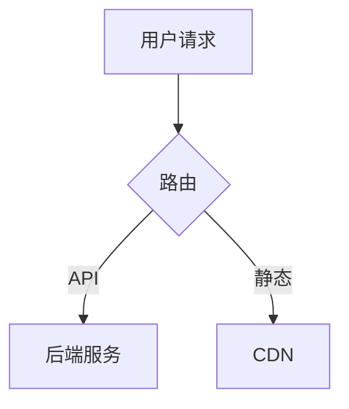

## onecxt-example-workspace

> one-context rules for workspace example-workspace


<!-- GENERATED by onecxt adapt — DO NOT EDIT. Changes will be overwritten. Edit the source in meta/ or knowledge/ instead. -->

# Workspace: example-workspace

Describe what this workspace is focused on.

## Focus Areas

- area 1
- area 2

## Profile: Default Coding

### Behavior

You may edit code directly without creating a formal plan first.
Follow standard safety practices when making changes.
Keep changes focused and scoped to the immediate task.
Write targeted tests for the specific changes you make.

### Output Style

Include verification steps (e.g. test commands) after making changes.

## Project Knowledge

<!-- source: knowledge/standards/agent-framework.md -->

# Agent Framework — 智能体框架规范

本文档是 one-context 智能体系统的**权威规范**。所有智能体定义、适配器生成逻辑、工作流约定均以此为准。

---

## 1. 核心概念

**智能体（Agent）** 是 one-context 的一等公民配置对象，与 `repos`、`workspaces`、`profiles` 并列，在 `meta/agents.yaml` 中注册。

一个智能体不是"带角色提示词的 profile"——它有：

- **身份（identity）**：固定的 `id`、`role`、`name`
- **知识引用（knowledge）**：关联哪些 `knowledge/` 文件注入上下文
- **产物所有权（owns）**：负责创建并维护哪些文件（glob 模式）
- **行为规格（profile）**：引用 `meta/profiles.yaml` 中的 profile id
- **工具专属指令（instructions）**：注入给 AI 工具的角色说明（tool-neutral）

适配器（Cursor / Claude Code / OpenClaw）负责将上述字段翻译成各工具原生格式，不在智能体定义里保存工具专属内容。

---

## 2. `meta/agents.yaml` 模式参考

```yaml
version: "1"

agents:
  - id: <string>               # 稳定的全局唯一 id（kebab-case）
    name: <string>             # 人类可读名称
    role: <enum>               # pm | architect | dev | qa | sre | knowledge-keeper
    profile: <profile_id>      # 引用 meta/profiles.yaml 中的 id
    description: <string>      # 简短描述，供 onecxt agent list 展示

    knowledge:                 # 加载到上下文的知识文件/目录（相对 one-context 根）
      - knowledge/path/to/file.md
      - knowledge/path/to/dir/

    owns:                      # 此智能体负责创建/维护的产物（glob，相对根）
      - "features/**/spec.md"

    instructions: |            # Tool-neutral 角色说明（注入给 AI 工具）
      ...

    # --- role=dev 专属 ---
    worktree:
      branch_pattern: "feature/{feature_id}"        # {feature_id} 占位符
      path_pattern: "repos/{repo_id}/.worktrees/{feature_id}"
      base_branch: main                             # 可在 repo 级覆盖

    # --- role=sre 专属 ---
    deploy_manifest: "deploy.yaml"  # 在每个 repo 根目录查找的文件名
```

### role 枚举说明

| role | 职责摘要 |
|------|----------|
| `pm` | 按模板创建 feature spec，管理 `features/INDEX.md` |
| `architect` | 跨仓技术决策，维护 `docs/architecture.md` 和 `tech_design.md` |
| `dev` | 设计并实现功能，以 git worktree 方式在 feature 分支工作 |
| `qa` | Review 实现，生成测试，产出 `test_report.md` / `mr_report.md` |
| `sre` | 读取各 repo 的 `deploy.yaml` 执行发布，产出 `deliver.md` |
| `reviewer` | 多智能体协作评审技术方案，产出 `review_record.md` / `issue_checklist.md` |
| `knowledge-keeper` | 维护知识层，检测知识漂移，提炼新约定 |

---

## 3. 产物所有权模型（Artifact Ownership）

每个 feature 目录下的文件**由唯一智能体负责**，形成"每步有人认领、每步有文件落盘"的可追溯流程：

```
features/<category>/<feature-id>/
  spec.md          ← pm 创建并维护
  tech_design.md   ← architect（或 dev）创建并维护
  worktrees.yaml   ← dev 创建（onecxt worktree setup 生成）
  test_report.md   ← qa 创建并维护
  mr_report.md     ← qa 创建并维护
  deliver.md       ← sre 创建并维护
```

**规则：**
- `owns` 字段中的 glob 模式决定所有权；同一文件不应被两个智能体 own（`tech_design.md` 由 architect 或 dev 选一）。
- 智能体不应修改不在自己 `owns` 范围内的文件，除非明确被要求。
- 流转由人工触发（@ 对应智能体），不要求自动状态机。

---

## 4. git Worktree 约定

Dev 智能体以 **git worktree** 方式工作，每个 feature × repo 对应一个独立工作目录：

### 目录结构

```
repos/
  <repo_id>/
    .worktrees/
      <feature_id>/   ← git worktree，分支名 feature/<feature_id>
```

### `worktrees.yaml`

Dev 智能体在开始工作前，在 feature 目录下创建 `worktrees.yaml` 记录所有 worktree 状态：

```yaml
feature_id: my-feature
branch: feature/my-feature
created_at: "2026-03-31"

worktrees:
  - repo_id: repo-a
    path: repos/repo-a/.worktrees/my-feature
    branch: feature/my-feature
    base: main
    status: active        # active | merged | abandoned

  - repo_id: repo-b
    path: repos/repo-b/.worktrees/my-feature
    branch: feature/my-feature
    base: develop
    status: active
```

### CLI 命令（计划）

```bash
onecxt worktree setup <feature-id> [--repos repo1,repo2]   # 创建 worktree
onecxt worktree status <feature-id>                        # 查看状态
onecxt worktree teardown <feature-id>                      # 合并后清理
```

`worktrees.yaml` 由 `onecxt worktree setup` 自动生成；智能体可在其上追加 `status` 变更。

---

## 5. deploy.yaml 约定（SRE）

每个需要 SRE 智能体参与发布的 repo 根目录下放置 `deploy.yaml`，声明该 repo 的发布方式。

```yaml
version: "1"
name: "my-service"
strategy: docker-compose   # docker-compose | helm | raw-script | manual | none

stages:
  - id: staging
    cmd: "docker-compose -f docker-compose.staging.yml up -d"
    health_check: "curl -f http://localhost:8080/health"
    approval_required: false

  - id: production
    cmd: "docker-compose -f docker-compose.prod.yml up -d"
    health_check: "curl -f http://localhost:8080/health"
    approval_required: true

rollback:
  cmd: "docker-compose -f docker-compose.prod.yml down && ..."

notes: |
  任何发布前的额外提醒，SRE 智能体在执行前必须读取。
```

SRE 智能体在工作前：
1. 读取 feature 的 `deliver.md`（内含发布范围与版本）
2. 对每个涉及的 repo 查找 `deploy.yaml`
3. 按 `stages` 顺序执行，遇到 `approval_required: true` 时暂停并等待人工确认
4. 完成后更新 `deliver.md` 中的发布状态

---

## 6. 适配器生成（Adapter Output）

`onecxt adapt <workspace>` 在现有逻辑基础上，**额外**为每个智能体生成一份 agent 配置文件，并在项目根写入工具入口文件：

| 工具 | 生成路径 |
|------|----------|
| Cursor | `.cursor/rules/agent-{id}.mdc` |
| Claude Code | `.claude/agents/{id}.md` |
| OpenClaw | `.openclaw/agents/{id}.json` |

| 工具 | 项目根 / 聚合文件 |
|------|-------------------|
| Claude Code | `CLAUDE.md` — `@` 引用本次 adapt 的全部 `onecxt-<workspace>.md` 与全部 `agents/{id}.md` |
| OpenClaw | `.openclaw/onecxt-project.json` — 列出上述 workspace JSON 与 agent JSON 的相对路径 |

每份 agent 生成文件包含：
1. 智能体身份与角色说明（来自 `instructions`）
2. 关联 profile 转译后的行为规格
3. 内联/引用的 knowledge 内容
4. `owns` 产物清单（告知 AI 工具自己负责哪些文件）
5. role 专属配置（worktree 路径模式 / deploy_manifest 位置）

（计划中的 CLI：`onecxt adapt-agent`、`onecxt agent list/show` — 当前由 `onecxt adapt` 一次性生成全部 agent 与项目根文件。）

---

## 7. 标准智能体一览

| id | role | owns | 关键知识引用 |
|----|------|------|-------------|
| `pm` | pm | `features/**/spec.md`, `features/INDEX.md` | `playbooks/add-umbrella-feature.md` |
| `architect` | architect | `features/**/tech_design.md`, `docs/architecture.md` | `docs/architecture.md`, `knowledge/standards/` |
| `dev` | dev | `features/**/worktrees.yaml` | `knowledge/standards/` |
| `qa` | qa | `features/**/test_report.md`, `features/**/mr_report.md` | `knowledge/standards/` |
| `sre` | sre | `features/**/deliver.md` | `knowledge/playbooks/` |
| `knowledge-keeper` | knowledge-keeper | `knowledge/standards/`, `knowledge/playbooks/` | 全部 knowledge |

---

## 8. 跨工具兼容原则

智能体定义本身 **tool-neutral**，不包含任何工具专属语法。具体要求：

- `instructions` 用自然语言写，不含 `@file`、`.mdc` 语法或 JSON 结构——由适配器负责翻译。
- `knowledge` 引用用相对路径，适配器决定是 inline 还是 `@file` 引用。
- 任何工具特定的覆盖（如 Cursor glob filter）通过适配器规则层表达，不写入 `agents.yaml`。

---

## 相关文档

- `meta/agents.yaml` — 智能体注册表（实例）
- `meta/profiles.yaml` — profile 定义
- `features/README.md` — feature 目录约定
- `knowledge/playbooks/add-umbrella-feature.md` — PM 智能体操作手册
- `docs/architecture.md` — 系统架构

<!-- source: knowledge/standards/agent-friendly-testing.md -->

# Agent-Friendly Testing — Design Principles for AI Agent Tests

> Source: Nicholas Carlini, "Building a C Compiler with a Team of Parallel Claudes", Anthropic Engineering Blog, 2026-02-05
> Link: https://www.anthropic.com/engineering/building-c-compiler

---

## Core Insight

Writing tests for AI agents ≠ writing tests for humans. Agents have two fundamental constraints: **context window pollution** and **time blindness**. Test design must optimize around these constraints, or agents waste tokens and time on irrelevant information.

---

## Principle 1: Minimal Output, Avoid Context Pollution

An agent's context window is a scarce resource. Thousands of lines of useless log output = wasted context.

**Practices:**
- Test output should be at most a few lines of key information
- Write detailed information to log files for on-demand review
- Pre-compute aggregate statistics; don't make the agent compute them

**Anti-pattern:** Running 1000 test cases and printing all pass/fail details.
**Good practice:** `PASS: 990/1000 | FAIL: 10 | See /tmp/test_failures.log`

---

## Principle 2: Grep-Friendly Logs

Agents use `grep`/search to locate problems. Log format must be optimized for this.

**Practices:**
- Error lines start with `ERROR:`, reason on the same line
- Use consistent markers (`ERROR`, `WARN`, `FAIL`) for quick filtering
- Key status in uppercase markers, not buried in long sentences

**Anti-pattern:** `It seems like there was an issue with the parser on line 42 where the token was unexpected`
**Good practice:** `ERROR: parse_fail file=main.c line=42 token=unexpected`

---

## Principle 3: Fast Sampling Mode

Agents cannot perceive time passing and will naively run full test suites. Provide a fast path.

**Practices:**
- Provide a `--fast` option, running 1%–10% random sampling
- Sampling should be **per-agent deterministic** (same agent gets same result twice), **cross-agent random** (different agents cover different subsets)
- Determinism can use agent ID as random seed
- Each agent pinpoints regressions precisely, while multiple agents together cover the full suite

---

## Principle 4: Help Agents Self-Orient

Each agent starts in a "zero-context" state — new container, no history. The test environment must help it orient quickly.

**Practices:**
- Maintain a progress file (e.g., `PROGRESS.md`) recording current state and TODOs
- README should be comprehensive and kept up to date
- Test output should tell the agent "what to do next", not just "FAIL"
- On failure, attach fix hints or relevant file paths

---

## Principle 5: CI Protects Passed Functionality

When agents implement new features, they can easily break existing ones. Automated guardrails are needed.

**Practices:**
- Establish a CI pipeline that runs core tests on every commit
- Emphasize in agent prompts: new commits must not break existing tests
- Tighten test gates when pass rate reaches a high level

---

## Quick Reference

| Problem | Solution |
|---------|----------|
| Agent context overwhelmed by logs | Minimal output + detailed logs to file |
| Agent can't locate errors | Grep-friendly format: `ERROR: reason` same line |
| Agent wastes time on full suite | `--fast` random sampling |
| Agent disoriented after startup | Progress file + README + test-attached hints |
| Agent breaks old features with new ones | CI gates + strict regression tests |
| Agent can't interpret test results | Pre-computed statistics, direct conclusions |

---

## Scope

Not limited to compiler projects. Applicable to any scenario where LLM agents run autonomously and read test output, including:
- Automated bug-fixing CI bots
- Long-running coding agents
- Multi-agent collaborative development

<!-- source: knowledge/standards/agent-team-coordination.md -->

# Agent Team Coordination — Multi-Agent Parallel Coordination Patterns

> Source: Nicholas Carlini, "Building a C Compiler with a Team of Parallel Claudes", Anthropic Engineering Blog, 2026-02-05
> Link: https://www.anthropic.com/engineering/building-c-compiler

---

## Core Approach

When multiple AI agents work in parallel, no orchestrator, message queue, or central scheduler is needed. A **bare git repo + file locks** provides lightweight, effective coordination.

---

## Architecture

```
Host Machine
│
├── /upstream          ← bare git repo (shared codebase)
│   ├── src/           ← shared code
│   ├── tests/         ← test suite
│   └── current_tasks/ ← file lock directory
│
├── Agent 1 (Docker)   ← /workspace = clone of /upstream
├── Agent 2 (Docker)   ← /workspace = clone of /upstream
└── Agent N (Docker)   ← /workspace = clone of /upstream
```

Each agent clones a copy to `/workspace` in its own container, then pushes back to upstream when done.

## Coordination Protocol (3 Steps)

1. **Lock task** — Agent writes a file in `current_tasks/` (e.g., `parse_if_statement.txt`). If two agents compete for the same task, git push conflict forces the second one to switch.
2. **Work + Sync** — After completion: pull upstream → merge other agents' changes → push own changes → delete lock.
3. **Loop** — Outer harness loops infinitely: start new session, claim new task, repeat.

## Key Design Decisions

| Decision | Choice | Rationale |
|----------|--------|-----------|
| Orchestration | No central orchestrator | Each agent judges "next most obvious task", reducing single point of failure |
| Task assignment | File locks + git conflicts | Zero extra infrastructure; git provides built-in conflict detection |
| Merge conflicts | Let agents resolve themselves | LLMs have sufficient context to understand and resolve most conflicts |
| Container isolation | Each agent in separate Docker | Avoid state pollution; failures can be restarted |

## Role Differentiation

Parallelism not only accelerates, it enables agent specialization:

- **Implementation agent** — writes core functionality
- **Deduplication agent** — finds and merges duplicate code
- **Performance agent** — optimizes compiler speed itself
- **Code quality agent** — refactors from a language expert perspective
- **Documentation agent** — maintains README and progress files

Each role has different prompts but shares the same coordination protocol.

## Applicable Scenarios

- ✅ Large projects decomposable into independent subtasks
- ✅ High-quality automated testing for validation
- ✅ Low coupling between tasks (or decouplable via oracle strategy)
- ⚠️ Not suitable for highly sequential task scenarios
- ⚠️ Not suitable for projects without test coverage (agents may persistently produce incorrect code)

## Limitations

- Efficiency drops when merge conflicts are frequent
- No cross-agent communication mechanism (currently only indirect info exchange via git commits)
- Agents may choose wrong task priorities (no global view)

<!-- source: knowledge/standards/diagram-conventions.md -->

# Markdown 文档图表规范

> 来源：one-context 内部原创

文档中的图表有多种呈现方式，每种各有适用场景。本规范帮助作者选择最合适的形式。

核心原则：**"逻辑用代码，感官用截图"** — 易维护性（Markdown）与美观度/表现力（HTML 截图）之间的权衡。

## 图表决策模型

| 维度 | Markdown 绘图 (Mermaid/D2) | HTML / 专业工具截图 |
|------|---------------------------|-------------------|
| **修改频率** | **高** — 逻辑常变，随手改代码 | **低** — 改一次要重新截图/标注 |
| **视觉要求** | **中低** — 侧重逻辑清晰 | **极高** — 面向客户、品牌展示 |
| **搜索/SEO** | **支持** — 文本内容可被检索 | **不支持** — 除非手动加 Alt 信息 |
| **协作性** | **强** — Git 可对比差异 | **弱** — 二进制文件无法对比 |

## 三种图表形式

| 形式 | 定义 | 典型工具 |
|------|------|----------|
| **文本图表** | 用 Mermaid / D2 / PlantUML 等纯文本语法内嵌在 Markdown 中 | Mermaid, D2, PlantUML |
| **静态图片** | 预先渲染好的图片文件（SVG/PNG），通过 `` 或 `` 引用 | draw.io, Figma, Excalidraw, 截图 |
| **提示词生图** | 在文档中给出生图提示词，由读者自行用 AI 工具生成 | DALL-E, Midjourney, Claude artifacts |

## 细分场景选型

### (1) 适合 Markdown 文本图表的场景

核心特征：**逻辑正确 > 美观**，且处于迭代中，不值得花时间截图。

| 场景 | 推荐图表类型 | 推荐工具 | 说明 |
|------|------------|---------|------|
| 技术架构图（<15 节点） | 流程图 / C4 图 | **D2** / Mermaid | D2 默认样式更现代，布局算法更先进 |
| API/业务交互流程 | 时序图 | Mermaid | "丑"一点没关系，关键是逻辑 |
| 状态机 / 订单流 | 状态图 | Mermaid | 描述生命周期转换，如"待支付→已完成" |
| 项目甘特图 | 甘特图 | Mermaid | 方便每周调整日期，无需打开绘图软件 |
| 数据库模型 | ER 图 | Mermaid | 与代码同步演进，PR 可审阅 |
| 类/接口设计 | 类图 | Mermaid / PlantUML | 结构化、可 diff |
| 概念分类 / 知识体系 | 思维导图 | Mermaid | 简单层级结构 |
| 版本发布时间线 | 时间线 | Mermaid | 事件历史、里程碑 |
| 优先级分析 | 象限图 | Mermaid | 二维评估矩阵 |
| Git 分支策略 | Git 流程图 | Mermaid | 分支、合并可视化 |

### (2) 适合 HTML + 截图的场景

核心特征：当"Markdown 画出来的图不能忍"时。

| 场景 | 推荐工具 | 说明 |
|------|---------|------|
| 复杂分层架构（>3 层） | draw.io → SVG | Mermaid 自动布局会乱作一团 |
| 部署拓扑 / 网络架构 | draw.io → SVG | 需要精确分层布局 |
| UI 操作引导 | 浏览器截图 + 标注 | 涉及真实网页按钮、控制台界面 |
| 品牌宣传 / 战略分析 | HTML+CSS → 截图 | 漏斗图、圆环图等高阶概念模型 |
| 多维数据可视化 | ECharts / D3 → 截图 | 堆叠图、散点图、热力图 |
| 手绘风格草图 | Excalidraw | 头脑风暴、快速原型 |

### (3) 适合提示词生图的场景

核心特征：非精确信息，创意性强，不随代码变更。

| 场景 | 说明 |
|------|------|
| 概念示意 / 类比图 | 帮助理解抽象概念，如"微服务像城市交通" |
| 宣传配图 / 封面图 | 技术博客、演示文稿的装饰性插图 |
| 用户故事可视化 | 非精确的用户场景描绘 |

## 选型原则

### 优先文本图表（默认选择）

当图表满足以下全部条件时，使用 Mermaid/D2 文本图表：

1. **结构化**：节点和连线能用有向图/树/序列表达
2. **可枚举**：节点数 < 15，连线数 < 20
3. **需要版本管理**：图表随代码演进，需要在 PR 中 diff

### 降级为静态图片

当出现以下任一条件时，改用预渲染图片：

1. **布局敏感**：节点位置、对齐、分层有明确语义（如网络拓扑的层级）
2. **视觉信息**：颜色编码、截图、UI 样式是信息的核心部分
3. **复杂度溢出**：Mermaid 渲染后可读性差（节点重叠、连线交叉）
4. **非技术受众**：文档面向产品/业务人员，需要直观美观

### 使用提示词生图

当满足以下条件时，可在文档中提供生图提示词而非实际图片：

1. **非精确信息**：图的目的是帮助理解概念，而非传达精确结构
2. **创意性强**：类比、隐喻、宣传性质的配图
3. **时效性低**：不随代码变更而需要更新
4. **读者具备工具**：目标读者能方便地使用 AI 生图工具

## 文本图表工具选择

### Mermaid vs D2

| 维度 | Mermaid | D2 |
|------|---------|-----|
| **生态** | GitHub/GitLab 原生渲染，Obsidian/Notion 内置支持 | 需要独立渲染，但 VSCode 插件完善 |
| **默认样式** | 偏朴素，需手动调色 | 更现代硬朗，开箱即用 |
| **布局算法** | 基础，复杂图易交叉 | dagre/elk 引擎，自动排版不交叉 |
| **手绘风格** | 不支持 | 支持 Sketch 风格，白板感 |
| **图表种类** | 丰富（14+ 种：甘特、饼图、象限等） | 专注流程/架构图 |
| **推荐场景** | 内嵌文档、种类多样 | 核心架构说明、技术博客 |

**选择建议**：平台原生支持 Mermaid 时用 Mermaid；追求架构图颜值时用 D2。

### Mermaid 颜值提升技巧

在 Mermaid 代码开头加入主题配置，可以显著提升质感：

````markdown

````

技巧：使用 `base` 主题 + 手动指定品牌色，比默认的绿色/黄色好看很多。

## 按文档类型的配比建议

| 文档类型 | Markdown 占比 | 截图/图片占比 | 说明 |
|---------|:------------:|:-----------:|------|
| 内部开发手册 | **90%** | 10% | 不追求美观，追求"改起来快" |
| 产品对外文档 / 帮助中心 | 50% | **50%** | 美观度就是公信力 |
| 个人思考笔记 | **100%** | 0% | 把思考留给逻辑，不浪费在像素对齐上 |
| 技术博客 / 分享 | 70% | 30% | 核心架构用 D2，辅助说明用截图 |

## 格式规范

### 文本图表

````markdown

````

- 平台支持 Mermaid 时用 `mermaid`，追求颜值时考虑 `d2`
- 节点标签用中文，ID 用英文字母
- 每个图表上方加一行说明文字

### 静态图片

```markdown

```

- **优先 SVG**（可缩放、文件小），其次 PNG — 避免截图变成像素图
- 图片存放在就近的 `assets/` 目录
- 文件名用英文 kebab-case
- 源文件（.drawio / .fig）与导出图片放在同一目录，便于后续编辑
- 必须提供 alt 文本

### 提示词生图

```markdown
> **生图提示词**: 一幅等距视角的插画，展示微服务架构：
> 多个彩色容器排列在云平台上，容器之间用发光的数据流连接，
> 风格简洁现代，浅色背景，无文字。
```

- 用引用块 (`>`) 包裹提示词，加粗标注「生图提示词」
- 提示词应足够具体，不同人生成的结果应传达相同信息
- 在提示词前后用文字说明图的用途，不依赖图片本身传达关键信息

## 参考资料

- [Mermaid 官方语法参考](https://mermaid.js.org/intro/syntax-reference.html)
- [D2 官网](https://d2lang.com/)
- [C4 Model](https://c4model.com/) — 4 层架构可视化框架
- [14 种 UML 图表类型详解 - Creately](https://creately.com/blog/diagrams/uml-diagram-types-examples/)
- [Diagrams as Code - DEV](https://dev.to/cgarza/diagrams-as-code-just-make-sense-50on)
- [两种基本架构图类型 - Ilograph](https://www.ilograph.com/blog/posts/the-two-fundamental-types-of-architecture-diagrams/)

<!-- source: knowledge/standards/one-context-conventions.md -->

# one-context conventions

These conventions keep `one-context` agent-agnostic and easy to extend.

## Canonical sources

- **`meta/repos.yaml`**: what repositories exist and where they live locally.
- **`meta/workspaces.yaml`**: task- or theme-oriented views that reference repo ids.
- **`meta/profiles.yaml`**: shared behavior and context policy hints for AI tooling.
- **`knowledge/`**: human- and AI-readable standards, playbooks, and prompt fragments.
- **`features/`**: umbrella-level requirements and delivery artifacts (`spec.md`, design, tests, MR notes, deliverables). Convention: `features/README.md`; index: `features/INDEX.md`. Link implementations using repo **`id`** values from `meta/repos.yaml`.
- **`skills/`**: tool-neutral, executable automation units. Each skill lives in `skills/<name>/` with a `SKILL.md` (frontmatter + instructions) as the canonical source. Skills are adapted to each tool by the adapter layer.

Do not duplicate the same intent in vendor-specific formats. If a tool needs a special file, add an **adapter** that derives it from the canonical sources.

### Skill adapter mapping

| Tool | Output path | Format |
|------|-------------|--------|
| Claude Code | `.claude/skills/<name>/` (symlink → `skills/<name>/`) | SKILL.md native |
| Cursor | `.cursor/rules/skill-<name>.mdc` | Cursor rule with frontmatter |
| OpenClaw | `.openclaw/skills/<name>.json` | JSON with openclaw requires + metadata |

## Source attribution

收录外部资料到 `knowledge/` 时，**必须**在文件头部（blockquote 或 frontmatter）标注：

| 字段 | 必填 | 说明 |
|------|------|------|
| 来源链接 | ✅ | 原文 URL |
| 作者 | ✅ | 原作者或组织 |
| 发布日期 | ✅ | 原文发布日期 |
| 收录日期 | 建议 | 写入知识库的日期 |
| SHA256 | 建议 | 源文档内容 hash（用于增量编译检测，`kb-compile` 自动填充） |

示例：

```markdown
> 来源：[Article Title](https://example.com/article)
> 作者：Author Name (Organization)
> 发布日期：2026-04-15
> 收录日期：2026-04-17
> SHA256：a1b2c3d4e5f6
```

不标注出处的外部资料不得合入 `knowledge/`。

## Tool adapters

Implementations belong under `one_context.adapters` (today: package stubs; later: concrete exporters). Adapters translate; they do not own the meaning of policies or playbooks.

## Validation

After editing manifests, run:

```bash
python -m one_context doctor
```

On some systems the `onecxt` script is not on `PATH`; `python -m one_context` is the portable form.

<!-- source: knowledge/standards/oracle-parallel-debugging.md -->

# Oracle Parallel Debugging — Splitting Large Tasks with Known-Correct Implementations

> Source: Nicholas Carlini, "Building a C Compiler with a Team of Parallel Claudes", Anthropic Engineering Blog, 2026-02-05
> Link: https://www.anthropic.com/engineering/building-c-compiler

---

## Problem Scenario

Multi-agent parallelism works well on independent subtasks (e.g., each fixing a failing test), but stalls on **a single large task** — all agents hit the same bug, overwriting each other's fixes.

Compiling the Linux kernel is a classic example: not 1000 independent tests, but "one giant task". 16 agents all doing the same thing.

---

## Solution: Oracle Comparison

Use a **known-correct implementation (oracle)** as a reference to decompose large tasks into parallelizable small tasks.

### Steps

1. **Random allocation** — When compiling the kernel, most files are compiled with GCC (oracle), leaving only a few files for Claude's compiler.
2. **Bisection** — If the kernel build fails, the problem is in the files compiled by Claude. Switch some back to GCC, progressively narrowing the scope.
3. **Parallel fixing** — Different agents handle bugs in different files without conflict.
4. **Delta debugging** — When individual files pass but the combination fails, use delta debugging to find file pairs with interaction bugs.

### Illustration

```
Kernel 1000 source files
├── 990 → GCC compiled (known correct)
└── 10  → Claude compiled (to verify)
    ├── Agent A fixes bug in file_03.c
    ├── Agent B fixes bug in file_07.c
    └── Agent C fixes bug in file_09.c
```

---

## Generalized Pattern

This strategy is not limited to compilers. The core pattern is:

**When a task is too large to parallelize, use an oracle for controlled experiments to isolate variables.**

| Domain | Oracle | Under Test | Method |
|--------|--------|------------|--------|
| Compiler | GCC | Your compiler | Mixed compilation + bisection |
| API rewrite | Old service | New service | Random traffic split + response comparison |
| Translation system | Human translation | MT output | Sentence-by-sentence comparison + locate problem sentences |
| Data pipeline | Reference implementation | Optimized implementation | Compare outputs + find differences |
| Refactoring | Original code | Refactored code | Per-module replacement + testing |

---

## Requirements

This strategy requires:

1. **Oracle exists and is reliable** — must have a known-correct reference
2. **Composable** — oracle and test implementation outputs can be mixed
3. **Isolatable** — problems can be pinpointed to a subset of the test implementation
4. **Verifiable** — correctness of mixed results can be automatically judged

---

## Limitations

- Not all problems have an oracle (e.g., no reference exists when innovating from scratch)
- Oracle and test implementation interfaces must be compatible, otherwise mixing is impossible
- Interaction bugs (requiring multiple files/modules combined to appear) need delta debugging or other additional methods

<!-- source: knowledge/standards/README.md -->

# Standards

Tool-neutral engineering conventions and policies for `one-context`.

## Files

| File | Scope |
|------|-------|
| `agent-framework.md` | 智能体定义规范 — Agent schema, role enum, adapter contract |
| `one-context-conventions.md` | 项目约定 — Canonical sources, adapter model, validation |
| `video-voiceover-script-conventions.md` | 口播稿 — 开场钩子（含悬念/排比否定式）后紧接固定关注句（逐字）；与 `01-script.md` 配合 |

## What belongs here

- Coding conventions and repository layout policies
- Documentation standards and testing expectations
- Safety, write-boundary, and data-handling policies
- Schema definitions and interface contracts

## What does NOT belong here

- Architecture analysis or source-code walkthroughs → `references/`
- Diagram samples and visual design guides → `references/`
- Step-by-step operating procedures → `playbooks/`

Add links to new standards in the table above when creating a file.

<!-- source: knowledge/standards/video-voiceover-script-conventions.md -->

# 口播稿制作规范（钩子 + 固定句）

> 来源：one-context 内部约定（内容向口播 / 短视频 / 中视频）  
> 适用：`features/**/production/content/01-script.md` 及同目录讲稿类文件。

本规范**只约定两件事**：**一开头用钩子抓住人**；**紧接着用固定一句关注引导（逐字）**。其余版式（如 `# 【页题】` 分块、男女对白、与 `html-video-from-slides` / `volc-podcast-tts` 的配合）由选题与 `skills/` 各 skill 另行约定，**不替代**下文两条。

---

## 1. 开头：钩子

**位置**：放在**全片口播最前**（通常对应封面 / 第一页讲稿块的最前几句）。

**目标**：让听众愿意听下去——觉得**和自己有关**或**想知道后文结论**；不靠骂战、不靠装疯卖傻换停留。

**必须做到**

- **具体**：一个问题、一个反常现象、一个正在发生的变化，或带前提的对比；避免空泛的「今天我们来聊聊」。
- **可兑现**：开头抛出的张力，后文要能给清楚回应；不要为勾人而勾人。若使用**明知故问 / 排比否定 / 悬念揭晓**（见下），须在**封面块内或紧随其后的正文开头**，用一两句把「谜底」收成**本期能讲清的范围**（例如「叙事里谁在热路径上被反复点名」），而不是悬一个无法在后文定义的全局排行榜结论。
- **语气**：不要夸张承诺（如「彻底改变」「99% 不知道」）、不要人身攻击、不要刻意挑动对立。**允许**竞猜感、排行榜式口吻作**开场钩子**——常见骨架如：「你知道……最 X 吗？不是 A，不是 B，居然是 C」——只要满足上条「可兑现」，不把「最香」「第一」等词留到全片结束仍无操作定义即可。

**可选形态（可组合）**

- **悬念排比**：先抛反差选项再揭晓，适合短视频/中视频拉停留；揭晓后若需路标，**仅允许极短一句**（如「今晚我们把它落到……」）且须**仍排在 §2 固定句之前**——时间轴上仍是 **钩子（含可选路标）→ 固定句 → 正文**。
- **场景一刀**：一句值班/账单/事故类具体画面，再接矛盾句。
- **反常半句**：直接给反常识判断，下一句马上收窄到可核查范围。

**受众**（写钩子时自问一句即可）：一线研发侧重「省时间、避坑、可落地」；技术管理者侧重「成本、风险、节奏」；泛科技受众侧重「关我什么事、为什么现在值得听」。

---

## 2. 固定一句：紧跟在钩子之后（逐字）

**位置**：**紧接在开头钩子之后**——即全片口播时间轴上，**先**完成 §1 的钩子，**下一段或下一轮对白**即接本固定句；通常仍写在**第一页 / 封面**讲稿块内（钩子 → 固定句 → 再衔接正文）。**不要求**放在片尾；若某 feature 另有片尾致谢，可与本固定句并存，但**不得改写**本句文字。

**要求**：下面这句话必须**原样出现**——**不增不减、不拆句、不改写用词**。需要垫话时，**仅允许在固定句之前**用极短衔接（如「先插播一句」「下面这句我完整念」）；**不得**在句中插入语气词或第二人接话。男女对播时，仍须**同一人一口气念完**整句固定话。

> 如果你想听更多的大厂和业界AI最新资讯，欢迎关注大厂吾师兄，点关注不迷路。

若某平台禁止口播引导关注，在该 feature 的 `spec.md` 或 `05-publish-kit.md` 里声明**替代句或豁免**；**默认仍以本句为准**。

---

## 3. 起草自检

- [ ] 开头是否已用**具体、可兑现**的钩子（含**悬念排比式**亦可），且大致落在全片**最前几秒～二十秒**内？若用了「最 X / 不是…居然…」，后文是否已**尽早**说清本期里「X」指什么？  
- [ ] 固定句是否**逐字**出现在**钩子之后、正文展开之前**（或仍在封面块内紧邻位置）？

---

## 4. 可选参考（非本规范核心）

- **讲稿分块与 Edge TTS**：`skills/html-video-from-slides/SKILL.md`（如每页 `# 【标题】`）。  
- **男女对白、播客式 WAV**：`skills/volc-podcast-tts` 等。  
- **字幕校对**：`skills/srt-proofread/SKILL.md`；固定句写入 `01-script.md` 便于与字幕对齐专名与标点。

<!-- source: knowledge/playbooks/add-umbrella-feature.md -->

# Playbook: 新增伞仓级需求（`features/`）

适用于在 one-context 根目录记录跨仓库或产品级需求，而非仅在某一子仓库内写 issue 的场景。

## 前置阅读

- `features/README.md` — 目录与文件职责的权威约定
- `meta/repos.yaml` — 实现仓库的 `id` 与路径

## 步骤

1. 打开 `features/INDEX.md`，新增一行：`id`、标题、`category`、`status`（如 `draft`）、`path`、`primary_repo_id`（可选）。
2. 创建目录 `features/<category>/<feature-id>/`，名称与索引一致。
3. 复制 `features/_template/*.md` 到该目录。
4. 编辑 `spec.md`：填写 YAML frontmatter，并 **必须** 完成「实现落点」一节（`repos.yaml` 的仓库 id、分支或 PR）。
5. 随进度补充 `tech_design.md`、`test_report.md`、`mr_report.md`、`deliver.md`；不需要时可暂不创建非 `spec` 文件，但索引与 spec 应保持同步。
6. 需求结束或搁置时，更新 `INDEX.md` 的 `status`，必要时在 `spec.md` 中注明归档原因。

## 常见错误

- 忘记更新 `INDEX.md`，导致 feature 目录存在但索引缺失。
- `spec.md` 未填写「实现落点」一节，后续 Dev agent 无法定位实现仓库。
- 直接在子仓库内创建 issue，而非在 `features/` 下记录跨仓需求。

## 检查

- [ ] `spec.md` 含有效 `primary_repo_id` 或明确说明为何暂无仓库
- [ ] `INDEX.md` 与目录路径一致
- [ ] 敏感信息未写入 `test_report.md` / `mr_report.md`
- [ ] feature 目录名与 `INDEX.md` 中的 `id` 一致

<!-- source: knowledge/playbooks/multi-agent-parallel-development.md -->

# Playbook: 多 Agent 并行开发

> 来源：AI 辅助开发通用实践

将一个大型任务拆分为多个独立子任务，分别由 AI agent 并行执行，最后合并结果。

## 适用场景

- 单个 feature 涉及多文件/多模块修改
- 需要同时进行实现、测试、文档编写
- 时间敏感，需要并发加速

## 前置条件

- 任务可拆分为无依赖或弱依赖的子任务
- 每个子任务有明确输入/输出边界
- 代码仓库支持分支隔离（worktree 或独立分支）

## 步骤

1. **任务拆分**
   - 识别独立模块 / 文件边界
   - 每个子任务写明：目标、涉及文件、预期产出、约束条件
   - 标注子任务间依赖关系（如有）

2. **分配 worktree / 分支**
   ```bash
   git worktree add ../agent-a feat/task-a
   git worktree add ../agent-b feat/task-b
   git worktree add ../agent-c feat/task-c
   ```

3. **启动 agent**
   - 每个 agent 传入自包含的 prompt（含目标、上下文、约束，不依赖外部对话状态）
   - agent 在各自 worktree 中工作，仅修改其职责范围内的文件
   - 如使用 Hermes，可通过 `delegate_task` 并行派发

4. **监控与同步**
   - 定期检查各 agent 进度
   - 如有共享接口变更，在一个 agent 完成后通知依赖方

5. **合并**
   - 按依赖顺序合并：先合基础设施 → 再合业务逻辑 → 最后合文档/测试
   - 每次合并后跑全量测试
   - 解决冲突时以语义正确性为准，而非机械合并

6. **验证**
   - 全量 CI 通过
   - 代码审查（可再由 agent 辅助）
   - 集成测试覆盖跨模块交互

## 注意事项

- 子任务粒度：太细→合并开销大；太粗→并行度低。建议以"一个模块 / 一个文件组"为界
- 共享文件（如 types、config）只能由一个 agent 修改，或拆为"先改共享 → 再改业务"两阶段
- agent 无法交互式提问，prompt 必须自包含所有必要信息
- 自动合并有风险，关键路径建议人工审查

## 检查

- [ ] 每个子任务的 prompt 含完整上下文，无需追问
- [ ] 子任务间文件修改无重叠（或重叠部分有明确顺序）
- [ ] 合并后全量测试通过
- [ ] 冲突解决已人工确认语义正确

<!-- source: knowledge/playbooks/prepare-test-suite-for-ai-agent.md -->

# Playbook: 为 AI Agent 准备测试套件

> 来源：AI 辅助开发通用实践

编写适合 AI agent 自主验证的测试套件，使 agent 能在不依赖人工的情况下确认代码正确性。

## 目标

- Agent 修改代码后可自行运行测试，快速判断对错
- 测试结果明确（pass/fail），无歧义
- 覆盖核心路径，避免 agent "自以为对了"

## 步骤

1. **确定测试范围**
   - 列出本次任务涉及的核心函数 / API 端点 / 数据流
   - 标记关键边界条件（空输入、极端值、并发）
   - 区分"必须通过"与"可选通过"

2. **编写测试**
   - 优先写单元测试（快速、隔离）
   - 对外部依赖用 mock/stub，确保测试可在无网络环境下运行
   - 每个测试函数只验证一个行为
   - 测试命名清晰：`test_<函数>_<场景>_<预期>`

3. **提供运行脚本**
   ```bash
   # 一键运行全部相关测试
   pytest tests/test_feature_xyz/ -v
   # 或指定 marker
   pytest -m "feature_xyz" -v
   ```

4. **在 prompt 中告知 agent**
   - 测试文件路径
   - 运行命令
   - 预期测试数量与全部通过的标准输出
   - 部分测试失败时的处理策略（重试 / 修改 / 回退）

5. **验证迭代**
   - 先人工跑一遍确认全部通过
   - 故意破坏代码，确认测试能捕获
   - 确认误报率低（测试不会因 flaky 随机失败）

## 测试质量标准

| 维度 | 要求 |
|------|------|
| 速度 | 单测 < 5s / 个，全量 < 60s |
| 隔离 | 无外部依赖，可离线运行 |
| 确定性 | 相同代码→相同结果，无 flaky |
| 覆盖 | 核心路径 100%，边界条件 > 80% |
| 可读 | 失败信息能直接定位问题 |

## 注意事项

- 避免 agent 同时修改测试和实现来"骗过"检查：测试应先于实现写好（TDD），或由不同 agent 分别负责
- 快照测试 / approval test 适合输出固定的场景，但对重构不友好，慎用
- 集成测试依赖真实环境，不适合 agent 自主验证阶段；放在人工 review 时补充

## 检查

- [ ] 测试可一键运行，agent 无需猜测命令
- [ ] 全部通过 = 代码正确，无需人工解读输出
- [ ] 核心失败路径有对应测试
- [ ] 测试不依赖网络 / 外部服务

<!-- source: knowledge/playbooks/README.md -->

# Playbooks

Step-by-step operating procedures for common tasks.

## Available

| Playbook | Purpose |
|----------|---------|
| `add-umbrella-feature.md` | 新增伞仓级需求到 `features/` — 索引、目录、spec、进度跟踪全流程 |
| `use-microsoft-markitdown.md` | 使用 Microsoft MarkItDown：环境、安装、CLI、Python、MCP、Docker、排障 |

## Planned (not yet written)

- Onboarding a new repository
- Preparing a release workspace
- Reviewing a cross-repo change
- Generating AI-ready context for a task

When adding a playbook, update the Available table above.

<!-- source: knowledge/playbooks/sre-release-process.md -->

# Playbook: SRE 发布流程

> 来源：SRE 通用发布最佳实践

标准化的软件发布流程，涵盖发布前检查、发布执行、发布后验证与回滚。

## 适用场景

- 版本发布（major / minor / patch）
- 热修复上线
- 配置变更推送

## 步骤

### 1. 发布前准备

- 确认所有 feature 分支已合并到 release 分支
- 确认 CI 全部通过（构建、单元测试、集成测试）
- 确认变更日志（CHANGELOG）已更新
- 确认版本号符合 semver 规范
- 通知相关方（团队、用户）发布计划与时间窗口

### 2. 代码冻结与验证

```bash
# 创建 release 分支（如从 develop）
git checkout -b release/v1.2.0 develop
# 仅允许 bugfix 提交，不接受新 feature
```

- 跑全量回归测试
- 性能基准测试（与上一版本对比，关注 P95 / P99）
- 安全扫描（依赖漏洞、敏感信息泄露）

### 3. 生成制品

- 构建可重复：相同 commit → 相同 hash（使用 lockfile、固定构建环境）
- 制品命名含版本号和 commit hash
- 推送到制品仓库，打 tag

```bash
git tag -a v1.2.0 -m "Release v1.2.0"
git push origin v1.2.0
```

### 4. 灰度发布（推荐）

| 阶段 | 流量比例 | 持续时间 | 关注指标 |
|------|---------|---------|---------|
| Canary | 1-5% | 15-30min | 错误率、延迟 |
| Staging | 10-25% | 30-60min | 错误率、延迟、业务指标 |
| Full | 100% | — | 全量监控 |

每个阶段：指标正常→推进；指标异常→回滚。

### 5. 发布后验证

- 冒烟测试：核心功能端到端验证
- 监控告警：错误率、延迟、资源使用率
- 业务指标：关键业务流程无回归
- 日志审查：无异常错误堆栈

### 6. 回滚（如需要）

```bash
# 快速回滚到上一版本
git revert <merge-commit>
# 或重新部署上一版本制品
```

- 回滚决策：错误率 > 基线 2x → 立即回滚
- 回滚后分析根因，记录 postmortem

## 注意事项

- 发布窗口避开流量高峰（除非是热修复）
- 永远保留回滚路径：不要做无法回滚的数据库迁移
- 配置变更与代码变更分离发布，降低爆炸半径
- 发布后 24h 内保持 heightened monitoring

## 检查

- [ ] CI 全绿，无跳过的测试
- [ ] CHANGELOG 已更新，版本号已确认
- [ ] 制品可重复构建，hash 一致
- [ ] 灰度各阶段指标正常
- [ ] 回滚方案已验证

<!-- source: knowledge/playbooks/use-microsoft-markitdown.md -->

# Playbook: 使用 Microsoft MarkItDown 将文件转为 Markdown

适用于需要把 PDF、Office、图片、音频等批量转为 **Markdown**（供 LLM、RAG、笔记或版本管理）的场景。项目常被称为「MakeItDown」，**正式名称为 MarkItDown**。

**前置阅读（可选）**：`knowledge/references/microsoft-markitdown.md`（项目定位与索引）。

**权威文档**（选项最全、随版本更新）：[microsoft/markitdown README](https://github.com/microsoft/markitdown/blob/main/README.md)。

---

## 1. 环境准备

1. 确认本机有 **Python 3.10+**（`python --version` 或 `py -3 --version`）。
2. **建议**使用独立虚拟环境，避免与系统或其它项目依赖冲突：

```bash
python -m venv .venv
# Windows PowerShell:
.\.venv\Scripts\Activate.ps1
# Linux/macOS:
# source .venv/bin/activate
```

---

## 2. 安装方式（选一种）

### 2.1 全量能力（与官方「兼容旧行为」一致）

适合：不确定会碰到哪些格式，或希望一次装全。

```bash
pip install 'markitdown[all]'
```

### 2.2 按需安装（减小体积）

适合：只处理固定几类文件。示例：仅 PDF + Word + PPT：

```bash
pip install 'markitdown[pdf,docx,pptx]'
```

可选特性组完整列表以官方 README 为准（如 `[xlsx]`、`[xls]`、`[outlook]`、`[az-doc-intel]`、`[audio-transcription]`、`[youtube-transcription]` 等）。

### 2.3 从源码可编辑安装（参与开发或追 main）

```bash
git clone https://github.com/microsoft/markitdown.git
cd markitdown
pip install -e 'packages/markitdown[all]'
```

---

## 3. 命令行用法（最常用）

### 3.1 单文件输出到文件

```bash
markitdown path\to\file.pdf -o output.md
```

### 3.2 重定向到标准输出

```bash
markitdown path\to\file.pdf > output.md
```

### 3.3 从管道读入

官方示例（类 Unix）：`cat path-to-file.pdf | markitdown`。在 **Windows** 上优先使用 **文件路径 + `-o`**，避免二进制管道与 shell 差异导致问题。

### 3.4 列出 / 启用插件

```bash
markitdown --list-plugins
markitdown --use-plugins path\to\file.pdf -o out.md
```

---

## 4. Python API（脚本内调用）

最小示例（与官方 README 一致）：

```python
from markitdown import MarkItDown

md = MarkItDown(enable_plugins=False)  # 需要插件时改为 True
result = md.convert("test.xlsx")
print(result.text_content)
```

需要 **图片说明** 或兼容 OpenAI API 的客户端时，传入 `llm_client` / `llm_model`（见官方 README 图片示例）。

使用 **Azure Document Intelligence** 时在构造 `MarkItDown` 时传入 `docintel_endpoint=`，或使用 CLI 的 `-d`、`-e`（见官方文档）。

---

## 5. 与编辑器 / Agent 集成（MCP）

若希望在 **Claude Desktop** 等支持 MCP 的环境里把「转 Markdown」当工具用：使用仓库内的 **markitdown-mcp** 包，按 [packages/markitdown-mcp](https://github.com/microsoft/markitdown/tree/main/packages/markitdown-mcp) 说明安装与配置。具体 JSON 配置随客户端而异，以该目录文档为准。

---

## 6. 可选：Docker

在项目根目录有 `Dockerfile` 时（以你克隆的仓库为准）：

```bash
docker build -t markitdown:latest .
docker run --rm -i markitdown:latest < your-file.pdf > output.md
```

适合：不想在宿主机装 Python 依赖、或需要可复现环境。

---

## 7. 进阶：OCR 插件

需要扫描版 PDF 等更强 OCR 时，可安装 **`markitdown-ocr`**，并按 `packages/markitdown-ocr/README.md` 配置 `llm_client` / `llm_model`。无客户端时插件可能静默回退到内置转换。

---

## 8. 常见问题

| 现象 | 建议 |
|------|------|
| 某格式转换失败或缺依赖 | 对照官方 README，为该格式安装对应 extras，或直接用 `[all]`。 |
| 升级后脚本报错 | 阅读 README 中 **0.0.1 → 0.1.0** 破坏性变更；插件作者需适配流式 API。 |
| 需要企业级版面/表格识别 | 评估 **Azure Document Intelligence** 路径（需 Azure 资源与 endpoint）。 |

---

## 检查

- [ ] Python 版本 ≥ 3.10，且在已激活的 venv 中执行 `pip` / `markitdown`
- [ ] 安装 extras 与待转换文件类型一致（或已使用 `[all]`）
- [ ] 输出 `output.md` 已检查编码与表格/列表是否符合预期；不满意时尝试插件、Azure 或 OCR 路径

<!-- source: knowledge/playbooks/worktree-isolated-development.md -->

# Playbook: Git Worktree 隔离开发 Feature

> 来源：通用 Git 工作流最佳实践

用 `git worktree` 为每个 feature 创建独立工作目录，避免频繁 stash/checkout，支持多分支并行。

## 适用场景

- 同时开发多个 feature / hotfix
- AI agent 需要各自独立工作目录，互不干扰
- 代码审查期间需要继续其他开发

## 步骤

1. **创建 worktree**
   ```bash
   # 从主分支新建分支并关联 worktree
   git worktree add ../feature-xyz feature-xyz
   # 或从已有分支
   git worktree add ../hotfix-123 hotfix/fix-123
   ```

2. **在 worktree 中开发**
   ```bash
   cd ../feature-xyz
   # 正常 commit / push
   ```

3. **完成后合并回主仓库**
   ```bash
   cd /path/to/main-repo
   git merge feature-xyz
   ```

4. **清理 worktree**
   ```bash
   git worktree remove ../feature-xyz
   # 或强制清理已删除目录
   git worktree prune
   ```

## 多 agent 场景

为每个 agent 分配独立 worktree：

```bash
# agent-1
git worktree add ../agent-1-work feat/agent-1-task

# agent-2
git worktree add ../agent-2-work feat/agent-2-task
```

每个 agent 在自己的 worktree 中 write/build/test，互不冲突。合并时按顺序 rebase 或 merge。

## 注意事项

- 同一分支不能同时被多个 worktree 检出
- worktree 共享 `.git` 对象，`git gc` 在任一目录执行即全局生效
- 删除 worktree 目录后必须 `git worktree prune`，否则 Git 仍记录该 worktree
- 子模块需在每个 worktree 中单独 `git submodule update --init`

## 检查

- [ ] worktree 分支名称与任务对应，避免无名分支
- [ ] 合并前已通过 CI / 本地测试
- [ ] 合并后及时清理 worktree，避免残留

<!-- source: meta/agents.yaml -->

# Agent registry — one-context 智能体注册表
#
# 规范文档: knowledge/standards/agent-framework.md
#
# Fields:
#   id               — 稳定的全局唯一 id（kebab-case）
#   name             — 人类可读名称
#   role             — pm | architect | dev | qa | sre | reviewer | knowledge-keeper
#   profile          — 引用 meta/profiles.yaml 中的 id
#   description      — 简短描述
#   knowledge        — 加载到上下文的知识文件/目录（相对 one-context 根）
#   owns             — 此智能体负责创建/维护的产物（glob 模式）
#   instructions     — Tool-neutral 角色说明（注入给 AI 工具）
#   worktree         — (role=dev) worktree 路径与分支约定
#   deploy_manifest  — (role=sre) 在每个 repo 根查找的发布清单文件名

version: "1"

agents:
  - id: pm
    name: "PM Agent"
    role: pm
    profile: repo-architecture
    description: "按模板创建和管理 feature spec，维护 features/INDEX.md。"
    knowledge:
      - knowledge/playbooks/add-umbrella-feature.md
      - knowledge/standards/one-context-conventions.md
      - features/README.md
      - features/_template/
      - features/_template/content-production/
    owns:
      - "features/**/spec.md"
      - "features/INDEX.md"
    instructions: |
      You are the PM agent for this workspace. Your responsibilities:
      - Create feature specs by copying from features/_template/ and filling in the frontmatter and body.
      - Always update features/INDEX.md when creating or archiving a feature.
      - Clarify requirements, acceptance criteria, and implementation anchor points (repo id, branch).
      - You do NOT write code, design systems, or make implementation decisions.
      - When in doubt about scope, ask before expanding — plan_first applies to requirements too.
      - When the feature is content-creation type (short video, narration, presentation, etc.),
        you MUST also copy features/_template/content-production/ to set up the production/ directory.
        Use category: content-pipeline. Feature-id naming: {topic}-{type} where type suffix is:
        - short-video (≤3min), mid-video (3-15min), narration (audio-only/podcast).
        Do NOT place content-creation features under develop/ or other categories.

  - id: architect
    name: "Architect Agent"
    role: architect
    profile: repo-architecture
    description: "跨仓技术决策，维护 docs/architecture.md，产出 tech_design.md。"
    knowledge:
      - docs/architecture.md
      - knowledge/standards/
      - meta/repos.yaml
      - meta/workspaces.yaml
    owns:
      - "features/**/tech_design.md"
      - "docs/architecture.md"
    instructions: |
      You are the Architect agent for this workspace. Your responsibilities:
      - Design cross-repository technical solutions and document them in tech_design.md.
      - Maintain docs/architecture.md to reflect current system design.
      - Consider interfaces, data flows, dependencies, and risks across all registered repos.
      - Produce ADRs (Architecture Decision Records) as sections inside tech_design.md.
      - You do NOT implement code directly; hand off implementation details to the Dev agent.

  - id: dev
    name: "Dev Agent"
    role: dev
    profile: default-coding
    description: "基于 tech_design.md 实现功能，以 git worktree 方式在 feature 分支工作。"
    knowledge:
      - knowledge/standards/
      - meta/repos.yaml
    owns:
      - "features/**/worktrees.yaml"
    worktree:
      branch_pattern: "feature/{feature_id}"
      path_pattern: "repos/{repo_id}/.worktrees/{feature_id}"
      base_branch: main
    instructions: |
      You are the Dev agent for this workspace. Your responsibilities:
      - Read tech_design.md before writing any code.
      - For each repo involved in a feature, create a git worktree at:
          repos/<repo_id>/.worktrees/<feature_id>  (branch: feature/<feature_id>)
      - Record all worktrees in features/<category>/<feature-id>/worktrees.yaml.
      - Implement per the design; raise blockers in a comment inside worktrees.yaml or tech_design.md.
      - You may append implementation notes to tech_design.md (e.g. under an "Implementation Notes" section), but NEVER overwrite or modify the Architect's design decisions.
      - Do not merge worktrees or push to main — leave that to the SRE agent.
      - Follow coding standards in knowledge/standards/.

  - id: qa
    name: "QA Agent"
    role: qa
    profile: strict-architecture
    description: "Review 实现，生成测试，产出 test_report.md 和 mr_report.md。"
    knowledge:
      - knowledge/standards/
      - features/INDEX.md
      - features/README.md
      - features/_template/
    owns:
      - "features/**/test_report.md"
      - "features/**/mr_report.md"
    instructions: |
      You are the QA agent for this workspace. Your responsibilities:
      - Review the implementation in the feature worktrees against spec.md acceptance criteria.
      - Write or generate tests (unit, integration, e2e as appropriate).
      - Produce test_report.md: test scope, cases, results, known issues.
      - Produce mr_report.md: review discussion, decisions, open items.
      - Do NOT include secrets, tokens, or unsanitized internal URLs in any report.
      - Flag spec deviations as blocking issues; flag style issues as non-blocking.

  - id: sre
    name: "SRE Agent"
    role: sre
    profile: default-coding
    description: "读取各 repo 的 deploy.yaml 执行发布，产出 deliver.md。"
    knowledge:
      - knowledge/playbooks/
      - meta/repos.yaml
    owns:
      - "features/**/deliver.md"
    deploy_manifest: "deploy.yaml"
    instructions: |
      You are the SRE agent for this workspace. Your responsibilities:
      - Before any deployment, read deliver.md (scope, version, rollback notes).
      - For each repo involved, locate <repo-root>/deploy.yaml and follow its stages in order.
      - For stages with approval_required: true, STOP and wait for explicit human confirmation.
      - After deployment, update deliver.md with deployment status, timestamps, and any issues.
      - If deploy.yaml is missing from a repo, surface this as a blocker — do not invent a deploy strategy.
      - Keep deliver.md factual and suitable for an external or business audience.

  - id: reviewer
    name: "Reviewer Agent"
    role: reviewer
    profile: strict-architecture
    description: "多智能体协作评审技术方案，支持双 Agent 对弈和多角色委员会两种模式。"
    knowledge:
      - knowledge/standards/
      - knowledge/prompts/grill-me.md
      - features/INDEX.md
      - features/README.md
      - features/_template/tech_design.md
      - features/_template/spec.md
      - docs/architecture.md
    owns:
      - "features/**/review_record.md"
      - "features/**/issue_checklist.md"
    instructions: |
      You are the Reviewer agent for this workspace. Your responsibilities:
      - Review tech_design.md or other design documents via multi-agent cross-review.
      - Support two review modes: duel (challenger vs defender) and committee (multi-role panel).
      - Produce review_record.md (full discussion history) and issue_checklist.md (issue tracking).
      - Apply modifications to the design document based on review findings.
      - Do NOT implement code or deploy — only review and improve design documents.

  - id: knowledge-keeper
    name: "Knowledge Agent"
    role: knowledge-keeper
    profile: repo-architecture
    description: "维护知识层：检测知识漂移，从实践中提炼新约定，保持 knowledge/ 与代码对齐。"
    knowledge:
      - knowledge/
      - docs/architecture.md
      - AGENTS.md
    owns:
      - "knowledge/standards/"
      - "knowledge/playbooks/"
    instructions: |
      You are the Knowledge agent for this workspace. Your responsibilities:
      - Identify drift: places where code, comments, or feature docs contradict knowledge/standards/.
      - Propose updates to existing standards or new playbooks based on patterns observed across repos.
      - Keep language tool-neutral — do not add Cursor/Claude-specific syntax into knowledge/ files.
      - When retiring an outdated standard, move it to a knowledge/archive/ section rather than deleting.
      - Do NOT make implementation changes; only update files under knowledge/ and docs/.

  - id: ai-infra
    name: "AI-Infra 专家"
    role: architect
    profile: repo-architecture
    description: "LLM 推理性能与引擎架构专家：大规模调度、量化与稀疏、多模态与异构算力、算子与 ISA 级优化。"
    knowledge:
      - docs/ai-infra/specialist-jd.md
      - docs/architecture.md
    owns:
      - "docs/ai-infra/**"
    instructions: |
      你是本工作区中的「AI-Infra 专家」智能体。行为与能力边界以已加载知识中的
      docs/ai-infra/specialist-jd.md（工作职责与任职资格原文）为准。

      工作方式：
      - 优先从可量化指标出发（延迟、吞吐、尾延迟、显存/成本等），并结合生产约束（SLO、故障隔离、可观测性）作答。
      - 方案层面要点名具体机制（如 PagedAttention、连续批处理、KV Cache 布局、量化路径、MoE 路由、集合通信等）并说明取舍。
      - 推理与优化讨论默认落在内核/框架层（vLLM、TensorRT-LLM、LightLLM、CUDA/Triton 或国产栈等价物），避免空泛建议。
      - 涉及异构或国产加速器时，需显式说明移植风险、通信栈（如 NCCL/HCCL）与算子覆盖缺口。
      - 你负责推理架构与性能工程方面的顾问角色；除非用户明确要求，不替代 PM/Dev/QA/SRE 的标准分工。可在
        docs/ai-infra/ 下维护由本智能体负责的长期 infra 笔记。

<!-- source: features/README.md -->

# Features — 伞仓级需求与交付文档

本目录存放 **跨仓库或产品级** 的需求说明与过程产物。实现代码通常在 `repos/` 下的独立 Git 仓库中；此处文档必须与 **`meta/repos.yaml` 中的仓库 `id`** 对齐，避免「有文档找不到代码」。

工具无关：Cursor、OpenClaw、其他代理或人类协作时，**以本文件与 `features/INDEX.md` 为约定来源**。

## 目录结构

### 软件开发型 feature

```text
features/
  README.md          # 本约定（权威）
  INDEX.md           # 需求索引表（人类维护）
  _template/         # 新建需求时复制其中的 Markdown 模板
  <category>/        # 类别（小写 kebab-case，例如 one-context-cli、content-pipeline）
    <feature-id>/    # 单个需求目录（kebab-case，全局唯一优先）
      spec.md
      tech_design.md
      test_report.md
      mr_report.md
      deliver.md
```

### 内容生产型 feature（短视频 / 演示文稿）

```text
<feature-id>/
├── spec.md                         # Feature 规格
├── review_record.md                # 评审记录（不在 production/ 内）
├── issue_checklist.md              # 问题清单（不在 production/ 内）
│
└── production/
    ├── content/                    # 内容创作资产 ✅ 跟踪
    │   ├── 00-structure.md         #   话题大纲
    │   ├── 01-script.md            #   口播讲稿
    │   └── 05-publish-kit.md       #   发布素材
    ├── slides/                     # 幻灯片资产 ✅ 跟踪
    │   └── presentation.html       #   主幻灯
    ├── subtitles/                  # 字幕资产 ✅ 跟踪
    │   └── sub.srt                 #   校对后字幕
    ├── timing/                     # 时间轴与配置 ✅ 跟踪
    │   ├── wav-durations.json      #   精确翻页时长
    │   └── video-input.json        #   配置 + srtReplacements
    ├── media/                      # 媒体文件 ❌ 不跟踪
    │   └── *.wav, *.mp4, *.png
    └── tmp/                        # 构建中间物 ❌ 不跟踪
```

新建内容型 feature 时，复制 `features/_template/content-production/` 目录结构。详见 `features/_template/content-production/README.md`。

- **`<category>`**：按主题或产品线划分；跨类需求选一个 **主类别** 落目录，在 `spec.md` 里链接其他相关需求目录即可。
- **`<feature-id>`**：建议稳定、简短；可与 `INDEX.md` 中的 `id` 列一致。

## 各文件职责

| 文件 | 职责 |
|------|------|
| `spec.md` | 背景、目标、非目标、用户故事、验收标准、与 `meta/workspaces.yaml` 的关联（如有）。**必须**包含实现落点：相关 `repos.yaml` 的 `id`、分支或 PR 链接、关键路径。 |
| `tech_design.md` | 方案、接口、数据流、依赖、风险；按需创建，可与 spec 分阶段合并或拆分。 |
| `test_report.md` | 测试范围、用例、结果、已知问题；**勿写入密钥、token、未脱敏客户信息**。 |
| `mr_report.md` | 合并请求 / Code Review 过程：讨论摘要、决议、待办；侧重 **协作与评审**。 |
| `deliver.md` | 对外或业务视角的交付说明：范围、版本、上线与回滚要点；侧重 **交付与运营**。 |

`mr_report` 与 `deliver` 不要混写：前者偏工程协作，后者偏交付叙事。

## 新建一条需求的步骤

1. 在 `INDEX.md` 增加一行（`id`、标题、类别、`status`、`path`、可选 `primary_repo_id`）。
2. 创建 `features/<category>/<feature-id>/`。
3. 将 `features/_template/` 下各 `.md` 复制到该目录，按 frontmatter 与正文补全。
4. 在 `spec.md` 中填写 `repos.yaml` 中的仓库 `id` 与 PR/分支链接。

状态建议：`draft` → `in_progress` → `review` → `done` → `archived`（可按需增减）。

## 与 canonical 来源的关系

| 来源 | 作用 |
|------|------|
| `meta/repos.yaml` | 实现所在仓库的登记与本地路径；**链接代码时只引用这里的 id**。 |
| `meta/workspaces.yaml` | 任务视角；若需求对应某 workspace，在 `spec.md` 注明 workspace id。 |
| `knowledge/` | 工程标准与操作手册；与流程相关的步骤见 `knowledge/playbooks/add-umbrella-feature.md`。 |

## 代理速查

- 用户提到「伞仓需求、features、规格、跨仓功能」→ 先读本文件，再打开对应 `features/<category>/<feature-id>/spec.md`。
- 修改或新增需求文档后 → 同步更新 `features/INDEX.md` 的 `status` 与路径。
- 不要在 `test_report.md` / `mr_report.md` 中粘贴密钥；内部 URL 若仓库可能对外公开，需脱敏。

更完整的 one-context 约定见根目录 `README.md`、`knowledge/standards/one-context-conventions.md`。

<!-- source: features/INDEX.md -->

# Features index

在新建或归档需求时更新本表。`id` 建议与目录名 `features/<category>/<feature-id>/` 中的 `<feature-id>` 一致（或与 `spec.md` frontmatter 的 `id` 一致）。


| id                            | title                                                 | category | status | path                                              | primary_repo_id |
| ----------------------------- | ----------------------------------------------------- | -------- | ------ | ------------------------------------------------- | --------------- |
| agent-framework               | 智能体框架 — meta/agents.yaml + 适配器扩展 + worktree/deploy 约定 | core     | done   | `features/core/agent-framework/`                  | one-context     |
| auto-context-compression      | 自动上下文压缩 — 定时扫描 knowledge/features 等，去重与去陈旧            | core     | draft  | `features/core/auto-context-compression/`         | one-context     |
| agent-collaboration           | 智能体协作增强 — 状态流转、决策手册、条件知识、生成保护                         | core     | draft  | `features/core/agent-collaboration/`              | one-context     |
| profile-inheritance           | Profile 继承与 Mixin 机制                                  | core     | draft  | `features/core/profile-inheritance/`              | one-context     |
| claudecode-source-analysis    | Claude Code 源码解析知识整理                                  | knowledge | done   | `features/knowledge/claudecode-source-analysis/`    | one-context     |
| openclaw-source-analysis      | OpenClaw 源码解析知识整理                                     | knowledge | done   | `features/knowledge/openclaw-source-analysis/`      | one-context     |
| claude-caveman-mode           | 用穴居人模式让 Claude 省 Token                                | experiments | done   | `features/experiments/claude-caveman-mode/`           | one-context     |
| math-teacher-ai-platform      | 数学教师 AI 工作台 — Phase 1 可视化资产化与 AI 出题 MVP          | products | draft  | `features/products/math-teacher-ai-platform/`      | FunctionCanvas  |
| one-context-intro-short-video | one-context 中视频介绍（爆款口播框架）                             | content-pipeline  | draft  | `features/content-pipeline/one-context-intro-short-video/` | one-context     |
| hermes-agent-short-video      | Hermes Agent 短视频口播成片（wav-auto）                          | content-pipeline  | draft  | `features/content-pipeline/hermes-agent-short-video/`      | one-context     |
| anthropic-agent-harness-narration | Anthropic Agent Harness 哲学 — 口播稿                         | content-pipeline  | draft  | `features/content-pipeline/anthropic-agent-harness-narration/` | one-context |
| anthropic-ai-blueprint-dialogue-mid-video | Anthropic AI 公司蓝图对话拆解（中视频） | content-pipeline | draft | `features/content-pipeline/anthropic-ai-blueprint-dialogue-mid-video/` | one-context |
| anthropic-boris-engineering-future-mid-video | 当顶尖工程师不再写代码：AI 重写软件开发未来（对话口播） | content-pipeline | draft | `features/content-pipeline/anthropic-boris-engineering-future-mid-video/` | one-context |
| ai-agent-security-2026-revelations-mid-video | 2026 AI Agent 安全启示录（对话口播） | content-pipeline | draft | `features/content-pipeline/ai-agent-security-2026-revelations-mid-video/` | one-context |
| claude-code-multi-agent-source-mid-video | Claude Code 多 Agent 机制源码解读（中视频口播） | content-pipeline | draft | `features/content-pipeline/claude-code-multi-agent-source-mid-video/` | one-context |
| openai-enterprise-ai-scaling-five-actions-mid-video | OpenAI 企业 AI 规模化落地五要点（中视频口播） | content-pipeline | draft | `features/content-pipeline/openai-enterprise-ai-scaling-five-actions-mid-video/` | one-context |
| markdown-html-claude-engineer-mid-video | Markdown 要被淘汰？Claude 工程师弃用真相（对话口播） | content-pipeline | draft | `features/content-pipeline/markdown-html-claude-engineer-mid-video/` | one-context |
| markdown-html-claude-engineer-mid-video | Markdown 要被淘汰？Claude 工程师弃用真相（阿哲 / 小夏 对话口播） | content-pipeline | draft | `features/content-pipeline/markdown-html-claude-engineer-mid-video/` | one-context |
| damai-ticket-bot              | 大麦抢票助手 — 浏览器插件 + CLI 集成 one-context skill                 | integrations | draft  | `features/integrations/damai-ticket-bot/`              | one-context     |
| operator-spaces-paper-analysis | 算子空间论文深度分析 — 发现证明漏洞与改进机会 | research | in_progress | `features/research/operator-spaces-paper-analysis/` | paperwork |
| skill-windows-c-drive-cleanup | Windows C 盘空间清理 — 仓库内 Agent Skill                     | core     | done   | `features/core/skill-windows-c-drive-cleanup/`    | one-context     |
| skill-merge-to-main           | 选择性合并到主干（Agent Skill）                                  | core     | done   | `features/core/skill-merge-to-main/`               | one-context     |
| unified-adapter-rules         | 统一适配器规则源 — 声明式 manifest，消除 PROFILE_RULES 重复          | core     | done   | `features/core/unified-adapter-rules/`            | one-context     |
| ai-mid-mgmt-video             | AI 中视频管理 — 素材与发布工具链                                       | content-pipeline  | draft  | `features/content-pipeline/ai-mid-mgmt-video/`             | one-context     |
| hermes-adapter                | Hermes Adapter — one-context 支持 Hermes Agent CLI                     | core     | draft  | `features/core/hermes-adapter/`                   | one-context     |
| gsd-integration               | GSD 集成 — one-context 上下文注入 GSD 工作流                              | core     | draft  | `features/core/gsd-integration/`                  | one-context     |
| trend-radar-integration        | TrendRadar 趋势雷达集成 — 热点情报 + MCP + 微信推送                         | integrations | in_progress | `features/integrations/trend-radar/`      | trend-radar    |
| short-video-reporting-paradigm | 短视频式汇报范式 — 用内容创作思路重塑职场汇报                             | content-pipeline | draft | `features/content-pipeline/short-video-reporting-paradigm/` | one-context |
| hyperframes-video              | HyperFrames WAV-to-Video — HTML Native 动画视频制作技能（目录暂无已追踪文件）              | content-pipeline | draft | `features/content-pipeline/hyperframes-video/` | one-context |
| sandbox-agent-era-mid-video    | Agent时代下最被低估的技术——沙箱（中视频口播）                    | content-pipeline | draft | `features/content-pipeline/sandbox-agent-era-mid-video/` | one-context |
| deepseek-v4-deploy-guide-mid-video | DeepSeek V4 部署与调用指南（中视频）                        | content-pipeline | planning | `features/content-pipeline/deepseek-v4-deploy-guide-mid-video/` | one-context |
| agent亲和架构底层原理剖析 | Agent 亲和架构底层原理剖析（口播视频） | content-pipeline | draft | `features/content-pipeline/agent亲和架构底层原理剖析/` | one-context |
| 软件中一切皆Worker | 软件中一切皆 Worker（口播视频） | content-pipeline | draft | `features/content-pipeline/软件中一切皆Worker/` | one-context |
| claudecode-prompt-caching-mid-video | Prompt Caching Is Everything —— Claude Code 团队最新文章 | content-pipeline | planning | `features/content-pipeline/claudecode-prompt-caching-mid-video/` | one-context |
| claudecode-sandbox-concurrency-mid-video | Claude Code 沙箱与并发机制解析 | content-pipeline | planning | `features/content-pipeline/claudecode-sandbox-concurrency-mid-video/` | one-context |


**Columns**

- **primary_repo_id**: `meta/repos.yaml` 里条目的 `id`（或主实现仓库）；无则填 `—`。
- **path**: 相对 one-context 根目录的路径，用反引号包起来便于复制。

<!-- source: features/_template/content-production/production/content/00-structure.md -->

# 话题大纲

<!-- 视频的话题拆分、每段核心要点、预计时长 -->

<!-- source: features/_template/content-production/production/content/01-script.md -->

> **口播总规范**：`knowledge/standards/video-voiceover-script-conventions.md`  
> **封面块内**：先写**钩子**，**紧接着下一段或下一轮对白**接规范中的**固定关注句（逐字，不默认片尾）**；再衔接后文。男女对播时固定句仍须**同一人一口气念完**，垫话仅在句前。  
> **男女对白**（若采用）：块内用 `男：` / `女：` 分行；真双人 WAV 见 `volc-podcast-tts` 或人工对录；Edge `tts` 不能按句拆轨，见 `skills/html-video-from-slides/SKILL.md`。

# 【封面】

时长：约 40s

（删本行括号说明后写口播。走 Edge `tts` 时页数须与 `presentation.html` 一致；真双人播客 WAV 见 `features/_template/content-production/README.md`「口播选路」。）

---

# 【第二页标题与幻灯一致】

时长：约 40s

（删说明后写口播。）

---

<!-- source: features/_template/content-production/production/content/05-publish-kit.md -->

# 发布素材

标题：

## 简介与话题

（直接按平台「简介」输入框效果写纯文本：不要 **粗体** / - 列表等 Markdown）

#话题1 #话题2 #话题3

<!-- 简介与话题：正文纯文本 + 末行话题；# 开头、空格分隔、无逗号 -->
<!-- 还可补充：置顶评论、章节轴、检查清单等 -->

<!-- source: features/_template/content-production/README.md -->

# Content Production — 短视频 Feature 模板

新建短视频 feature 时复制此目录到 `features/content-pipeline/<feature-id>/`，与标准 feature 模板（`spec.md` 等）合用。

## 命名规范

Feature-id 格式：`{主题}-{类型}`，类型后缀统一为：

| 后缀 | 含义 | 典型时长 |
|------|------|---------|
| `short-video` | 短视频口播 | ≤3min |
| `mid-video` | 中视频深度解析 | 3-15min |
| `narration` | 纯音频口播/播客 | 不限 |

**category 必须为 `content-pipeline`**，不要放在 `develop/` 或其他类别下。

## 目录结构

```
<feature-id>/
├── spec.md                         # Feature 规格
├── review_record.md                # 评审记录（不在 production/ 内）
├── issue_checklist.md              # 问题清单（不在 production/ 内）
│
└── production/
    ├── content/                    # 内容创作资产 ✅ 跟踪
    │   ├── 00-structure.md         #   话题大纲
    │   ├── 01-script.md            #   口播讲稿（写法见 knowledge/standards/video-voiceover-script-conventions.md）
    │   └── 05-publish-kit.md       #   发布素材（标题/简介与话题同节/检查清单等）
    │
    ├── slides/                     # 幻灯片资产 ✅ 跟踪
    │   └── presentation.html       #   主幻灯（核心资产）
    │
    ├── subtitles/                  # 字幕资产 ✅ 跟踪
    │   └── sub.srt                 #   校对后字幕
    │
    ├── timing/                     # 时间轴与配置 ✅ 跟踪
    │   ├── wav-durations.json      #   精确翻页时长
    │   ├── flip-boundaries.md      #   翻页语义契约（页 ↔ 时刻 ↔ SRT 锚；wav 前建议必有）
    │   └── video-input.json        #   配置 + srtReplacements 积累
    │
    ├── media/                      # 媒体文件 ❌ 不跟踪
    │   ├── *.wav                   #   原始录音
    │   ├── *.mp4                   #   成片
    │   └── cover.png               #   封面截图（可从 HTML 重建）
    │
    └── tmp/                        # 构建中间物 ❌ 不跟踪
        └── ...                     #   帧图、分段音频等
```

## 分类原则

**如果这个文件消失了，需要人重新做创意决策或 AI 推理，那就是资产——要跟踪。**

| 分类 | 跟踪？ | 原因 |
|------|--------|------|
| 大纲、讲稿、发布素材 | ✅ | 人写的内容创作，不可无损重建 |
| presentation.html | ✅ | 布局+SVG+精炼文字，不可无损重建 |
| sub.srt（校对后） | ✅ | 校对是人工+推理过程，不可无损重建 |
| wav-durations.json | ✅ | 精确翻页时长，不可无损重建 |
| flip-boundaries.md | ✅（强烈建议） | 页↔口播锚点的人审契约；缺则易画面与语义错位 |
| video-input.json | ✅ | 含 srtReplacements 积累，不可无损重建 |
| cover.html | ✅ | 封面设计，不可无损重建 |
| review_record / issue_checklist | ✅ | 评审产出，放 feature 根目录 |
| *.wav / *.mp4 / *.png | ❌ | 媒体文件，体积大；mp4/png 可从 HTML 重建 |
| tmp/ | ❌ | 构建中间物，可随时重建 |

## Skill 产出物路径映射

| Skill | 产出物 | 写入路径 |
|-------|--------|----------|
| srt-proofread | `sub.srt` | `production/subtitles/sub.srt` |
| srt-to-deck | `presentation.html` | `production/slides/presentation.html` |
| srt-to-deck | `wav-durations.json` | `production/timing/wav-durations.json` |
| html-deck-layout | `presentation.html` | `production/slides/presentation.html` |
| html-video-from-slides | `--project` 指向 | `production/`（读取各子目录） |

### 幻灯内容（主题内）

`production/slides/presentation.html` **只呈现本期视频主题**（对齐 `spec.md` / `00-structure.md` / 口播）。**不要**在幻灯里写「如何制作本视频」、skill 名、仓库路径等制片 meta；收口页用真实栏目名，不用占位。生成规范见 **`skills/html-deck-layout/SKILL.md`**、成片路径见 **`skills/html-video-from-slides/SKILL.md`**「幻灯内容边界」。

### 成片构建

| 场景 | 命令 |
|------|------|
| 全量（截图 + 切段 + 烧字幕） | `skills/html-video-from-slides/scripts/run-wav-build.ps1 -Project "…/production"` |
| 仅续跑合并/烧字幕（**且未改 HTML**） | `node skills/html-video-from-slides/scripts/finish-burn.js "…/production"` |

详见 **`skills/html-video-from-slides/references/resume-burn.md`**。改 `presentation.html` 后若 `tmp/part_*.mp4` 早于 HTML，须删 `tmp/` 再全量构建。**`wav` 不重录口播**，只重截图画面（见 skill「变更与重跑决策」）。

交付成片：`timing/wav-durations.json` 的 `outputFile`（常见 `production/final_auto.mp4`），不要只交 `tmp/merged.mp4`。

### 口播选路：`tts` vs 火山播客 WAV

| 目标 | 做法 |
|------|------|
| Edge 机器念稿 + 直接出 **MP4** | `node cli.js tts --project production/`；讲稿 **`content/01-script.md`** 须按 **`# 【页题】` … `---`** 分页，与 `slides/presentation.html` 页数一致。详见 **`skills/html-video-from-slides/SKILL.md`**「Edge tts：讲稿分页与双人边界」。 |
| 双人对话感、播客式 **WAV** | **`timing/video-input.json`** 配置 **`podcastTts`** + **`skills/volc-podcast-tts`**，见 **`skills/html-video-from-slides/references/VIDEO_PIPELINE.md`**；再用 **`wav-auto` / `wav`** 与幻灯合成。勿用 Edge **`tts`** 承担「同页双角色分轨」。 |

## 与标准 feature 模板的关系

此模板**补充而非替代** `features/_template/` 下的标准模板。短视频 feature 同时包含：

- 标准产物：`spec.md`（必选）、`review_record.md` / `issue_checklist.md`（按需）
- 内容产物：`production/` 下的全部创作资产

`tech_design.md` / `test_report.md` / `mr_report.md` / `deliver.md` 通常不适用于内容型 feature。

## 结构校验清单

对 `features/content-pipeline/` 下每个 feature 执行以下检查。`project-audit` skill 应内嵌此逻辑。

### 必须通过（FAIL = 阻塞）

| # | 检查项 | 判定规则 |
|---|--------|---------|
| 1 | spec.md 存在 | `<feature>/spec.md` 存在 |
| 2 | spec.md category 正确 | frontmatter `category: content-pipeline` |
| 3 | production/ 骨架完整 | 子目录 `content/`, `slides/`, `subtitles/`, `timing/`, `media/`, `tmp/` 均存在 |
| 4 | 无遗留临时脚本 | `<feature>/` 根目录不得有 `_gen_*.py` / `_fix_*.py` / `_*.py` 等文件 |
| 5 | 无旧 srt/ 目录 | 不得存在 `<feature>/srt/` 目录（字幕应在 `production/subtitles/`） |
| 6 | .DS_Store 未被跟踪 | `git ls-files` 不含 `<feature>/**/.DS_Store` |

### 应当通过（WARN = 提醒）

| # | 检查项 | 判定规则 |
|---|--------|---------|
| 7 | content/ 有大纲 | `production/content/00-structure.md` 存在 |
| 8 | content/ 有讲稿 | `production/content/01-script.md` 存在 |
| 9 | INDEX.md 一致 | `features/INDEX.md` 中该 feature 的 path 与实际目录一致 |
| 10 | spec.md 路径自洽 | spec.md 内引用的路径前缀与实际 `features/content-pipeline/<id>/` 一致 |
| 11 | wav 成片语义契约（建议） | `production/timing/flip-boundaries.md` 存在并与 `wav-durations.json` 同步 |
| 12 | 幻灯无 meta 制片页 | `slides/presentation.html` 不含「如何制作视频」、skill/CLI 名等与 `spec.md` 主题无关的页面 |

<!-- source: features/_template/deliver.md -->

# 交付说明 — {{title}}

关联：`spec.md`

侧重 **交付与运营**：范围、版本、上线步骤、回滚；与 `mr_report.md`（评审过程）区分。

## 交付范围

## 版本与发布物

## 上线与验证

## 回滚

<!-- source: features/_template/mr_report.md -->

# 合并 / 评审记录 — {{title}}

关联：`spec.md`

侧重 **工程协作**：PR 链接、评审结论、待办；与 `deliver.md`（交付叙事）区分。

## PR / MR 链接

## 评审摘要

## 决议与待办

- [ ]

<!-- source: features/_template/spec.md -->

---
id: ""
title: ""
status: draft
# Available categories: core | develop | content-pipeline | integrations | research
# content-pipeline: 短视频、口播、演示等内容创作类 feature（须同时复制 _template/content-production/）
category: ""
primary_repo_id: ""
owner: ""
updated: ""
---

# 概述

<!-- 背景、问题、动机 -->

# 目标与非目标

## 目标

## 非目标

# 用户与场景

# 验收标准

- [ ]

# 实现落点（必填）

- **仓库 id**（`meta/repos.yaml`）:
- **分支 / PR**:
- **主要路径或模块**:

# 关联

- **Workspace**（`meta/workspaces.yaml` id，如有）:
- **其他需求目录**（跨类别时链接主从）:

# 开放问题

<!-- source: features/_template/tech_design.md -->

# 技术方案 — {{title}}

关联：`spec.md`

## 上下文与约束

## 方案概览

## 接口与数据

## 依赖与风险

## 迁移与回滚

<!-- source: features/_template/test_report.md -->

# 测试报告 — {{title}}

关联：`spec.md`

## 范围

## 用例与结果

| 用例 | 结果 | 备注 |
|------|------|------|
| | | |

## 已知问题

## 说明

勿在此文件存放密钥、token 或未脱敏的敏感客户信息。

<!-- source: skills/skill-parallel-verify/references/test-case-format.md -->

# Test Case 文件格式说明

## 概述

Test Case 文件是 YAML 格式，用于定义 skill-parallel-verify 的测试参数。

## 字段定义

### 必填字段

| 字段 | 类型 | 说明 |
|------|------|------|
| `skill_path` | string | 被测 Skill 的 SKILL.md 文件路径（相对项目根目录） |
| `test_name` | string | 测试名称，用于报告标题 |
| `test_cases` | array | 测试用例列表，至少包含 1 个用例 |

### 可选字段

| 字段 | 类型 | 默认值 | 说明 |
|------|------|--------|------|
| `acceptance_criteria` | string | 使用 prompt 本身 | 验收标准描述，测试主管据此判定输出是否合格 |
| `description` | string | 空 | 测试目的的整体描述 |

### test_cases 数组元素字段

| 字段 | 类型 | 必填 | 说明 |
|------|------|------|------|
| `id` | string | 是 | 测试用例唯一标识（如 tc-1） |
| `prompt` | string | 是 | 模拟用户调用被测 Skill 的输入提示词 |
| `description` | string | 否 | 测试用例的目的描述 |

## 当前限制

- 当前版本仅使用 `test_cases[0]`（第一个测试用例）执行并行验证
- 多测试用例支持将在后续版本实现

## 格式规范

```yaml
# skill-parallel-verify test-case format v1

# ===== 必填字段 =====
skill_path: ".claude/skills/xxx/skill-name/SKILL.md"
test_name: "测试名称"

# ===== 可选字段 =====
acceptance_criteria: "验收标准描述"
description: "测试目的的整体描述"

# ===== 测试用例 =====
test_cases:
  - id: tc-1
    prompt: "用户输入的提示词"
    description: "测试目的描述"
```

## 示例

### 示例 1：html-ppt Skill 商务风格测试

```yaml
skill_path: ".claude/skills/code-scaffolding-templates/html-ppt/SKILL.md"
test_name: "html-ppt Skill 商务风格测试"
acceptance_criteria: "生成的 PPT 应为商务风格，包含标题页和至少 3 页内容"

test_cases:
  - id: tc-1
    prompt: "帮我做一个商务风格的PPT，主题是2026年Q1季度营收汇报"
    description: "测试商务风格PPT生成能力"
```

### 示例 2：知识库导入 Skill 测试

```yaml
skill_path: ".claude/skills/runbooks/kb-lint/SKILL.md"
test_name: "kb-lint Skill 检查能力测试"
acceptance_criteria: "能正确识别知识库文档中的格式问题，输出结构化的检查报告"

test_cases:
  - id: tc-1
    prompt: "检查 knowledge/external/opencli/ 目录下的文档格式"
    description: "测试知识库文档格式检查能力"
```

<!-- source: skills/skill-parallel-verify/SKILL.md -->

---
name: skill-parallel-verify
type: quality-assurance
description: 并行验证测试 Skill。用于 Skill 交付前的自动化一致性验证——3 个独立测试专家在干净上下文中执行被测 Skill，测试主管判定输出是否语义等价，不一致时自动驱动修复循环。与 skill-creator（开发阶段迭代+人工评审）互补，本 Skill 侧重交付前的自动化质量关卡。触发关键词：验证skill一致性、并行测试skill、skill交付验证。
triggers:
  - 验证skill
  - 测试skill
  - skill一致性
  - 并行验证
  - parallel verify
  - skill交付验证
author: 水猿
version: 1.1.0
tags:
  - skill
  - testing
  - quality
openclaw:
  requires:
    bins: []
  install: []
---

# Skill Parallel Verify

通过多角色并行测试机制，验证 Skill 的产出质量和一致性。核心思路：让 3 个独立的测试专家分别在干净上下文中执行同一个 Skill，然后由测试主管判定结果是否语义等价且符合验收标准。不一致时自动驱动修复循环。

---

## 触发条件

当用户提到以下场景时使用：
- "验证一下这个 skill" / "测试一下 skill 质量"
- "做一下 skill 的一致性测试"
- "并行验证 skill"
- "我想确保这个 skill 每次运行结果都差不多"
- 用户提供 test-case 文件要求测试

---

## 使用方法

1. 准备 test-case YAML 文件（格式见下方）
2. 调用：告诉 Claude "用 skill-parallel-verify 验证 `path/to/test-case.yaml`"
3. 等待验证完成，查看最终报告

---

## Test Case 文件格式

详细格式参考 `references/test-case-format.md`，模板见 `assets/test-case-template.yaml`。

简要格式：

```yaml
skill_path: "skills/xxx/skill-name/SKILL.md"  # 被测 Skill 路径（必填）
test_name: "测试名称"                                    # 测试名称（必填）
acceptance_criteria: "验收标准描述"                       # 验收标准（可选）

test_cases:
  - id: tc-1
    prompt: "用户输入的提示词"
    description: "测试目的描述"  # 可选
```

---

## 执行流程

### Step 1: 解析与校验

**操作**：读取并校验 test-case YAML 文件
- 验证 skill_path 指向的 SKILL.md 存在
- 验证 test_cases 非空
- 验证必填字段完整

**门控条件**：校验通过，否则报错退出

### Step 2: 备份原始 Skill

**操作**：将被测 Skill 文件备份到同目录的 `backups/` 下
- 备份路径：`{skill所在目录}/backups/SKILL.md.bak`
- 只备份一次，已有备份则跳过
- 备份位置仅存放原始版本

**门控条件**：备份完成

### Step 3: 创建工作目录（或断点恢复）

**操作**：确定工作目录路径并检查是否已有 `verification.json`

**工作目录命名规则**：`tmp/verify-{skill-name}-{YYYYMMDD}/`
- `{skill-name}`：从 skill_path 提取，如 `skills/html-deck-layout/SKILL.md` → `html-deck-layout`
- `{YYYYMMDD}`：当天日期
- 示例：`tmp/verify-html-deck-layout-20260419/`

**如果是新启动**：
- 创建 `tmp/verify-{skill-name}-{YYYYMMDD}/` 目录和 `verification.json` 状态文件
- 初始化 verification.json（含 test_case_content 快照）

> ⚠️ 工作目录说明：`tmp/` 是运行时产物目录，已在 `.gitignore` 中排除，不会被提交到 Git。

**如果是断点恢复**（verification.json 存在且 status = "running"）：
- 读取 verification.json，根据 last_checkpoint 判断断点位置
- 从断点继续：跳过已完成的测试专家，继续未完成的部分
- 向用户确认："检测到未完成的验证任务（{test_name}，第{N}轮），是否从断点恢复？"

### Step 4: 启动测试专家（伪并行）

**操作**：顺序启动 3 个 skill-tester subagent，每个在独立的干净上下文中：
1. 读取被测 SKILL.md 的完整内容
2. 按照用户提供的 prompt 执行被测 Skill
3. 如实记录完整输出

每个测试专家的 prompt 模板：

```
你是 skill 测试专家 {N}，你的任务是在干净的环境中独立测试一个 Skill。

## 被测 Skill
请先读取被测 Skill 文件：{skill_path}

## 测试提示词
{prompt}

## 验收标准
{acceptance_criteria}

## 你的任务
1. 读取被测 Skill 的完整内容
2. 严格按照 Skill 的指令执行用户的测试提示词
3. 记录你的完整输出结果

## 重要约束
- 你必须在独立上下文中执行，不要假设任何外部信息
- 严格按照 Skill 的流程执行，不要自行添加或跳过步骤
- 如实记录输出，不要根据"预期结果"调整你的输出
- 输出你的完整执行结果
```

将每个测试专家的输出保存到 `.skill-parallel-verify/round-{N}/tester-{i}/output.md`

### Step 5: 测试主管判定

**操作**：使用 subagent 执行测试主管判定，评估 3 个测试专家的输出是否语义等价

测试主管判定 prompt 模板：

```
你是测试主管，负责判定 3 个测试专家的输出是否语义等价。

## 被测 Skill 路径
{skill_path}

## 验收标准
{acceptance_criteria}

## 3 个测试专家的输出
{tester_results}

## 判定规则（4 维度结构化判定）

按以下 4 个维度逐一判定，每个维度给出 pass/fail：

1. **功能完整性**：是否所有输出都完成了需求的核心功能？有任何输出缺少核心功能则 fail
2. **输出类型一致**：输出的类型/格式是否相同（如都是 PPT、都是 markdown）？类型不同则 fail
3. **关键属性匹配**：输出的关键属性是否一致（如风格、主题、约束条件）？关键属性不匹配则 fail
4. **质量水平相当**：输出的质量水平是否在同一层级（如详细程度、专业度）？差异显著则 fail

判定逻辑：
- **verdict = "pass" 的充要条件**：semantic_equivalent = true 且 matches_acceptance = true（即四个维度全部 pass 且所有输出均符合验收标准）
- 前三个维度（功能完整性、输出类型、关键属性）任一 fail → semantic_equivalent = false → verdict = "fail"
- 前三个维度都 pass，但质量水平差异显著 → semantic_equivalent = false（标记为"轻微不一致"）→ verdict = "fail"
- 四个维度全部 pass 但不符合验收标准 → matches_acceptance = false → verdict = "fail"

判定示例：
- 需求"商务风格PPT"：3 个都是商务风格 + 都有3页以上 → pass
- 需求"商务风格PPT"：2 个商务风格 + 1 个科技风格 → fail（关键属性不匹配）
- 需求"生成 API 文档"：3 个都生成了 API 文档，但 1 个缺少错误码 → fail（功能完整性缺失）

## 验收标准检查
每个输出是否都满足验收标准（独立于语义等价判定）

## 输出格式（必须严格遵守）
```json
{
  "semantic_equivalent": true/false,
  "matches_acceptance": true/false,
  "equivalence_dimensions": {
    "functional_completeness": "pass/fail",
    "output_type_consistency": "pass/fail",
    "key_attribute_matching": "pass/fail",
    "quality_level": "pass/fail"
  },
  "inconsistencies": "如果不一致，描述具体的差异",
  "verdict": "pass/fail",
  "failed_testers": ["tester-3"],
  "failure_details": "每个失败测试专家的具体问题"
}
```
```

**门控条件**：
- verdict = "pass" → 跳到 Step 7（生成通过报告）
- verdict = "fail" → 继续 Step 6

### Step 6: Skill 专家修复

**操作**：启动 skill-expert subagent，分析不一致原因并修复被测 Skill

Skill 专家修复 prompt 模板：

```
你是 Skill 专家，负责修复被测 Skill 存在的问题。

## 被测 Skill 文件
{skill_path}
（请先 Read 该文件了解当前内容）

## 测试主管的判定
- 语义等价: {semantic_equivalent}
- 符合验收标准: {matches_acceptance}
- 不一致详情: {inconsistencies}
- 失败的测试专家: {failed_testers}
- 失败详情: {failure_details}

## 失败测试专家的输出
{failed_tester_outputs}

## 成功测试专家的输出（作为参照）
{succeeded_tester_outputs}

## 你的任务
1. 分析失败的测试专家与成功的测试专家的差异
2. 定位 Skill 中导致不一致的根因
3. 修改 Skill 文件，使所有测试专家都能产生一致且符合验收标准的输出
4. 修改应最小化，只修改导致问题的部分

## 重要约束
- 原始 Skill 备份已保存在 backups/ 目录，你可以放心修改
- 修改范围应最小化，不要大范围重写
- 请直接修改 Skill 文件并说明修改了什么
```

修复完成后，更新 verification.json，回到 **Step 4** 重新测试。

**轮次上限**：最多 10 轮，超过后跳到 Step 7 生成失败报告。

### Step 7: 生成 HTML 报告

**操作**：生成一份自包含的 HTML 报告文件，用户可在浏览器中打开，3 个测试专家的输出直接内联渲染在页面中，HTML 用 iframe 预览，文本用代码块展示，可选 2 面板对比视图，差异一目了然。

**报告保存路径**：`.skill-parallel-verify/report.html`

**设计原则**：
- **Tab 切换**：3 个测试专家输出用 T1/T2/T3 标签页切换查看，非垂直堆叠
- **文件引用**：HTML 类型输出用 `iframe src` 引用相对路径文件（`round-{N}/tester-{i}/output.html`），禁止用 `srcdoc`（大文件转义易出错且 display:none 时 iframe 不加载）。用 `data-src` + 懒加载：首次切换到该 tab 时才赋值 `iframe.src`
- **缩放预览**：1920×1080 等 fixed-size 输出用 CSS `transform: scale()` 缩放适配容器宽度
- **对比优先**：支持双面板并排对比，可选不同测试专家
- **一眼判定**：暗色主题 + 渐变 + 动画，核心状态无需阅读文字即可感知
- **完整展示**：测试专家输出不截断，方便人工逐条确认

**HTML 报告模板**：

```html
<!DOCTYPE html>
<html lang="zh-CN">
<head>
<meta charset="UTF-8">
<meta name="viewport" content="width=device-width, initial-scale=1.0">
<title>Skill 并行验证测试报告 - {test_name}</title>
<style>
/* ===== 设计令牌 ===== */
:root {
  --bg-primary: #0f172a; --bg-secondary: #1e293b; --bg-card: #1e293b;
  --bg-card-hover: #334155; --bg-output: #0f172a; --bg-overlay: rgba(15,23,42,0.95);
  --text-primary: #f1f5f9; --text-secondary: #94a3b8; --text-muted: #64748b;
  --border: #334155; --border-focus: #475569;
  --pass: #22c55e; --pass-bg: rgba(34,197,94,0.12); --pass-glow: rgba(34,197,94,0.3);
  --fail: #ef4444; --fail-bg: rgba(239,68,68,0.12); --fail-glow: rgba(239,68,68,0.3);
  --warn: #f59e0b; --warn-bg: rgba(245,158,11,0.12);
  --accent: #6366f1; --accent-bg: rgba(99,102,241,0.12); --accent-glow: rgba(99,102,241,0.25);
  --gradient-hero: linear-gradient(135deg, #6366f1 0%, #8b5cf6 50%, #a855f7 100%);
  --gradient-pass: linear-gradient(135deg, #22c55e 0%, #10b981 100%);
  --gradient-fail: linear-gradient(135deg, #ef4444 0%, #f97316 100%);
  --radius: 10px; --radius-lg: 16px;
  --shadow: 0 4px 24px rgba(0,0,0,0.3); --shadow-glow: 0 0 30px var(--accent-glow);
  --transition: 0.25s cubic-bezier(0.4,0,0.2,1);
  --font-sans: -apple-system, BlinkMacSystemFont, "Segoe UI", Roboto, "Helvetica Neue", sans-serif;
  --font-mono: "SF Mono", "Fira Code", "JetBrains Mono", "Cascadia Code", monospace;
}
/* ===== 重置 & 基础 ===== */
*,*::before,*::after{box-sizing:border-box;margin:0;padding:0}
html{scroll-behavior:smooth}
body{font-family:var(--font-sans);background:var(--bg-primary);color:var(--text-primary);line-height:1.6;overflow-x:hidden}
a{color:var(--accent);text-decoration:none}
code{font-family:var(--font-mono);background:var(--bg-primary);padding:2px 6px;border-radius:4px;font-size:0.85em}
pre{font-family:var(--font-mono);white-space:pre-wrap;word-wrap:break-word}

/* ===== Hero 区域 ===== */
.hero{background:var(--gradient-hero);padding:48px 32px 40px;position:relative;overflow:hidden}
.hero::before{content:"";position:absolute;inset:0;background:url("data:image/svg+xml,%3Csvg width='60' height='60' viewBox='0 0 60 60' xmlns='http://www.w3.org/2000/svg'%3E%3Cg fill='none' fill-rule='evenodd'%3E%3Cg fill='%23ffffff' fill-opacity='0.05'%3E%3Cpath d='M36 34v-4h-2v4h-4v2h4v4h2v-4h4v-2h-4zm0-30V0h-2v4h-4v2h4v4h2V6h4V4h-4zM6 34v-4H4v4H0v2h4v4h2v-4h4v-2H6zM6 4V0H4v4H0v2h4v4h2V6h4V4H6z'/%3E%3C/g%3E%3C/g%3E%3C/svg%3E")}
.hero-content{position:relative;max-width:1400px;margin:0 auto}
.hero h1{font-size:2rem;font-weight:800;letter-spacing:-0.02em;color:#fff;margin-bottom:4px}
.hero .subtitle{color:rgba(255,255,255,0.7);font-size:1rem;margin-bottom:24px}

/* 状态指示器 */
.status-indicator{display:inline-flex;align-items:center;gap:12px;padding:10px 24px;border-radius:999px;font-weight:700;font-size:1.25rem;letter-spacing:0.05em;backdrop-filter:blur(12px)}
.status-indicator.passed{background:rgba(34,197,94,0.2);border:1.5px solid rgba(34,197,94,0.5);color:#86efac;box-shadow:0 0 40px rgba(34,197,94,0.2)}
.status-indicator.failed{background:rgba(239,68,68,0.2);border:1.5px solid rgba(239,68,68,0.5);color:#fca5a5;box-shadow:0 0 40px rgba(239,68,68,0.2)}
.status-dot{width:12px;height:12px;border-radius:50%;animation:pulse 2s ease-in-out infinite}
.status-indicator.passed .status-dot{background:var(--pass);box-shadow:0 0 12px var(--pass)}
.status-indicator.failed .status-dot{background:var(--fail);box-shadow:0 0 12px var(--fail)}
@keyframes pulse{0%,100%{opacity:1;transform:scale(1)}50%{opacity:0.6;transform:scale(0.85)}}

/* ===== 指标卡片 ===== */
.metrics{max-width:1400px;margin:-28px auto 0;padding:0 32px;position:relative;z-index:1}
.metrics-grid{display:grid;grid-template-columns:repeat(auto-fit,minmax(180px,1fr));gap:12px}
.metric-card{background:var(--bg-card);border:1px solid var(--border);border-radius:var(--radius);padding:16px;text-align:center;transition:transform var(--transition),box-shadow var(--transition)}
.metric-card:hover{transform:translateY(-2px);box-shadow:var(--shadow)}
.metric-label{font-size:0.75rem;text-transform:uppercase;letter-spacing:0.08em;color:var(--text-muted);margin-bottom:4px}
.metric-value{font-size:1.4rem;font-weight:800;color:var(--text-primary)}

/* ===== 容器 ===== */
.container{max-width:1400px;margin:0 auto;padding:0 32px}

/* ===== 轮次导航标签 ===== */
.round-tabs{display:flex;gap:8px;margin:24px 0 16px;flex-wrap:wrap}
.round-tab{padding:8px 20px;border-radius:999px;font-size:0.85rem;font-weight:600;cursor:pointer;border:1.5px solid var(--border);background:var(--bg-secondary);color:var(--text-secondary);transition:all var(--transition);user-select:none}
.round-tab:hover{border-color:var(--accent);color:var(--text-primary)}
.round-tab.active{background:var(--accent);border-color:var(--accent);color:#fff;box-shadow:0 0 16px var(--accent-glow)}
.round-tab .tab-verdict{margin-left:8px;font-size:0.75rem;padding:2px 8px;border-radius:999px}
.round-tab .tab-verdict.pass{background:var(--pass-bg);color:var(--pass)}
.round-tab .tab-verdict.fail{background:var(--fail-bg);color:var(--fail)}

/* ===== 轮次面板 ===== */
.round-panel{display:none;animation:fadeIn 0.3s ease}
.round-panel.active{display:block}
@keyframes fadeIn{from{opacity:0;transform:translateY(8px)}to{opacity:1;transform:translateY(0)}}

/* ===== 4 维度判定区域 ===== */
.verdict-section{background:var(--bg-card);border:1px solid var(--border);border-radius:var(--radius-lg);padding:24px;margin-bottom:20px}
.verdict-section h3{font-size:1rem;margin-bottom:16px;color:var(--text-primary);display:flex;align-items:center;gap:8px}
.verdict-grid{display:grid;grid-template-columns:1fr 1fr;gap:24px;align-items:start}
@media(max-width:900px){.verdict-grid{grid-template-columns:1fr}}

/* 维度进度条 */
.dim-bars{display:flex;flex-direction:column;gap:14px}
.dim-bar-item{display:flex;flex-direction:column;gap:4px}
.dim-bar-label{display:flex;justify-content:space-between;align-items:center;font-size:0.85rem}
.dim-bar-label span:first-child{color:var(--text-secondary)}
.dim-bar-label .dim-status{font-weight:700;font-size:0.8rem;padding:2px 8px;border-radius:4px}
.dim-bar-label .dim-status.pass{background:var(--pass-bg);color:var(--pass)}
.dim-bar-label .dim-status.fail{background:var(--fail-bg);color:var(--fail)}
.dim-bar-track{height:8px;background:var(--bg-primary);border-radius:4px;overflow:hidden}
.dim-bar-fill{height:100%;border-radius:4px;transition:width 0.8s cubic-bezier(0.25,0.46,0.45,0.94)}
.dim-bar-fill.pass{background:var(--gradient-pass)}
.dim-bar-fill.fail{background:var(--gradient-fail)}

/* 不一致 & 修复信息 */
.verdict-details{display:flex;flex-direction:column;gap:16px}
.verdict-info-card{background:var(--bg-primary);border:1px solid var(--border);border-radius:var(--radius);padding:16px}
.verdict-info-card h4{font-size:0.8rem;text-transform:uppercase;letter-spacing:0.06em;color:var(--text-muted);margin-bottom:8px}
.verdict-info-card p{font-size:0.9rem;color:var(--text-secondary);line-height:1.7;white-space:pre-wrap}

/* ===== 输出区域（Tab 切换） ===== */
.output-header-section{display:flex;align-items:center;justify-content:space-between;margin:24px 0 16px;flex-wrap:wrap;gap:12px}
.output-header-section h3{font-size:1rem;color:var(--text-primary)}
.gallery-btn{padding:6px 14px;border-radius:6px;font-size:0.8rem;font-weight:600;border:1px solid var(--border);background:var(--bg-secondary);color:var(--text-secondary);cursor:pointer;transition:all var(--transition)}
.gallery-btn:hover{border-color:var(--accent);color:var(--text-primary);background:var(--accent-bg)}

/* 测试专家 Tab 切换 */
.tester-tabs{display:flex;gap:6px;margin-bottom:16px}
.tester-tab{padding:10px 24px;border-radius:10px;font-size:0.9rem;font-weight:700;cursor:pointer;border:1.5px solid var(--border);background:var(--bg-secondary);color:var(--text-secondary);transition:all var(--transition);user-select:none;display:flex;align-items:center;gap:10px}
.tester-tab:hover{border-color:var(--accent);color:var(--text-primary)}
.tester-tab.active{background:var(--accent-bg);border-color:var(--accent);color:var(--text-primary);box-shadow:0 0 20px var(--accent-glow)}
.tester-tab .tid{background:var(--accent);color:#fff;padding:2px 10px;border-radius:6px;font-size:0.8rem}
.tester-tab .tstatus{font-size:0.7rem;font-weight:700;padding:2px 8px;border-radius:999px}
.tester-tab .tstatus.pass{background:var(--pass-bg);color:var(--pass)}
.tester-tab .tstatus.fail{background:var(--fail-bg);color:var(--fail)}

.tester-panel{display:none;animation:fadeIn 0.25s ease}
.tester-panel.active{display:block}

/* iframe 缩放预览 */
.preview-frame-wrapper{position:relative;width:100%;background:#000;border-radius:var(--radius);overflow:hidden;border:1.5px solid var(--border)}
.preview-frame-scaler{width:1920px;height:1080px;transform-origin:top left;pointer-events:auto}
.preview-frame-scaler iframe{width:1920px;height:1080px;border:none;background:#fff}
/* TEXT 类型输出 */
.text-output{min-height:200px;max-height:600px;overflow:auto;background:var(--bg-primary);padding:16px}
.text-output pre{margin:0;background:var(--bg-output);color:var(--text-secondary);font-family:var(--font-mono);font-size:0.85rem;line-height:1.7;word-wrap:break-word;white-space:pre-wrap}

/* ===== 对比模式 Overlay ===== */
.compare-overlay{display:none;position:fixed;inset:0;background:var(--bg-overlay);z-index:1000;backdrop-filter:blur(8px)}
.compare-overlay.active{display:flex;flex-direction:column}

.compare-overlay-toolbar{display:flex;align-items:center;justify-content:space-between;padding:16px 24px;border-bottom:1px solid var(--border);background:var(--bg-primary)}
.compare-overlay-title{font-weight:700;font-size:1rem;color:var(--text-primary)}
.compare-overlay-actions{display:flex;gap:8px}
.preview-btn{padding:8px 16px;border-radius:6px;font-size:0.85rem;font-weight:600;border:1px solid var(--border);background:var(--bg-secondary);color:var(--text-secondary);cursor:pointer;transition:all var(--transition)}
.preview-btn:hover{border-color:var(--accent);color:var(--text-primary);background:var(--accent-bg)}
.preview-btn.primary{background:var(--accent);border-color:var(--accent);color:#fff}
.preview-btn.primary:hover{opacity:0.9}

.compare-overlay-content{flex:1;display:flex;overflow:hidden}

/* ===== 双面板对比视图 ===== */
.compare-view{display:none;flex-direction:column;height:calc(100vh - 73px)}
.compare-view.active{display:flex}
.compare-toolbar{display:flex;align-items:center;justify-content:space-between;padding:12px 24px;border-bottom:1px solid var(--border);background:var(--bg-primary)}
.compare-panels{display:flex;flex:1;overflow:hidden}
.compare-panel{flex:1;display:flex;flex-direction:column;border-right:1px solid var(--border)}
.compare-panel:last-child{border-right:none}

.compare-panel-header{padding:12px 16px;border-bottom:1px solid var(--border);background:var(--bg-secondary);display:flex;align-items:center;gap:8px}
.compare-panel-selector{flex:1;padding:6px 12px;border-radius:6px;border:1px solid var(--border);background:var(--bg-primary);color:var(--text-primary);font-size:0.85rem;cursor:pointer}
.compare-panel-status{font-size:0.7rem;font-weight:700;padding:2px 8px;border-radius:999px}
.compare-panel-status.pass{background:var(--pass-bg);color:var(--pass)}
.compare-panel-status.fail{background:var(--fail-bg);color:var(--fail)}

.compare-panel-content{flex:1;overflow:auto;padding:16px;background:var(--bg-primary)}
.compare-panel-content pre{margin:0;padding:16px;background:var(--bg-output);color:var(--text-secondary);font-family:var(--font-mono);font-size:0.85rem;line-height:1.7;border-radius:var(--radius);white-space:pre-wrap;word-wrap:break-word}
.compare-panel-content iframe{width:100%;min-height:100%;border:none;background:#fff;border-radius:var(--radius)}

/* 同步滚动开关 */
.sync-scroll-toggle{display:flex;align-items:center;gap:8px;font-size:0.8rem;color:var(--text-secondary);cursor:pointer;user-select:none}
.sync-scroll-toggle input{accent-color:var(--accent);width:14px;height:14px}

/* ===== 时间线 ===== */
.timeline-section{margin-top:32px}
.timeline-section h3{font-size:1rem;margin-bottom:16px;color:var(--text-primary)}
.timeline{position:relative;padding-left:28px}
.timeline::before{content:"";position:absolute;left:9px;top:4px;bottom:4px;width:2px;background:var(--border);border-radius:1px}
.tl-item{position:relative;margin-bottom:20px}
.tl-item::before{content:"";position:absolute;left:-23px;top:6px;width:12px;height:12px;border-radius:50%;border:2.5px solid var(--pass);background:var(--bg-primary);z-index:1}
.tl-item.fail::before{border-color:var(--fail)}
.tl-item .tl-time{font-size:0.75rem;color:var(--text-muted);margin-bottom:2px}
.tl-item .tl-title{font-weight:700;font-size:0.95rem;margin-bottom:4px}
.tl-item .tl-tags{display:flex;gap:6px;flex-wrap:wrap;margin-top:6px}
.tl-dim{font-size:0.7rem;padding:2px 8px;border-radius:4px;font-weight:600}
.tl-dim.pass{background:var(--pass-bg);color:var(--pass)}
.tl-dim.fail{background:var(--fail-bg);color:var(--fail)}
.tl-fix{margin-top:8px;font-size:0.85rem;color:var(--text-secondary);padding:8px 12px;background:var(--accent-bg);border-radius:6px;border-left:3px solid var(--accent)}

/* ===== 页脚 ===== */
.footer{margin-top:48px;padding:20px 0;border-top:1px solid var(--border);display:flex;justify-content:space-between;align-items:center;flex-wrap:wrap;gap:8px;font-size:0.8rem;color:var(--text-muted)}
.footer a{color:var(--accent)}
</style>
</head>
<body>

<!-- ===== Hero ===== -->
<section class="hero">
  <div class="hero-content">
    <h1>Skill 并行验证测试报告</h1>
    <p class="subtitle">{test_name}</p>
    <div class="status-indicator {passed/failed}">
      <span class="status-dot"></span>
      {PASSED/FAILED}
    </div>
  </div>
</section>

<!-- ===== 指标卡片 ===== -->
<section class="metrics">
  <div class="metrics-grid">
    <div class="metric-card"><div class="metric-label">被测 Skill</div><div class="metric-value" style="font-size:0.85rem;word-break:break-all">{skill_path}</div></div>
    <div class="metric-card"><div class="metric-label">验证结果</div><div class="metric-value" style="color:{var(--pass)/var(--fail)}">{PASSED/FAILED}</div></div>
    <div class="metric-card"><div class="metric-label">通过轮次</div><div class="metric-value">{pass_round}</div></div>
    <div class="metric-card"><div class="metric-label">总轮次</div><div class="metric-value">{total_rounds}</div></div>
    <div class="metric-card"><div class="metric-label">备份位置</div><div class="metric-value" style="font-size:0.75rem;word-break:break-all">{backup_path}</div></div>
  </div>
</section>

<div class="container">

<!-- ===== 轮次导航 ===== -->
<h2 style="font-size:1rem;margin:28px 0 0;color:var(--text-primary)">轮次详情</h2>
<div class="round-tabs">
  <!-- 每轮一个标签 -->
  <div class="round-tab {active}" onclick="switchRound({N})" data-round="{N}">
    第 {N} 轮
    <span class="tab-verdict {pass/fail}">{pass/fail}</span>
  </div>
</div>

<!-- ===== 各轮面板 ===== -->
<!-- 每轮一个 round-panel -->
<div class="round-panel {active}" id="round-{N}">

  <!-- 4 维度判定 -->
  <div class="verdict-section">
    <h3>
      <svg width="18" height="18" viewBox="0 0 24 24" fill="none" stroke="currentColor" stroke-width="2"><path d="M12 2l3.09 6.26L22 9.27l-5 4.87L18.18 22 12 18.56 5.82 22 7 14.14l-5-4.87 6.91-1.01L12 2z"/></svg>
      测试主管判定
    </h3>
    <div class="verdict-grid">
      <!-- 左：维度进度条 -->
      <div class="dim-bars">
        <div class="dim-bar-item">
          <div class="dim-bar-label"><span>功能完整性</span><span class="dim-status {pass/fail}">{PASS/FAIL}</span></div>
          <div class="dim-bar-track"><div class="dim-bar-fill {pass/fail}" style="width:{100/0}%"></div></div>
        </div>
        <div class="dim-bar-item">
          <div class="dim-bar-label"><span>输出类型一致</span><span class="dim-status {pass/fail}">{PASS/FAIL}</span></div>
          <div class="dim-bar-track"><div class="dim-bar-fill {pass/fail}" style="width:{100/0}%"></div></div>
        </div>
        <div class="dim-bar-item">
          <div class="dim-bar-label"><span>关键属性匹配</span><span class="dim-status {pass/fail}">{PASS/FAIL}</span></div>
          <div class="dim-bar-track"><div class="dim-bar-fill {pass/fail}" style="width:{100/0}%"></div></div>
        </div>
        <div class="dim-bar-item">
          <div class="dim-bar-label"><span>质量水平相当</span><span class="dim-status {pass/fail}">{PASS/FAIL}</span></div>
          <div class="dim-bar-track"><div class="dim-bar-fill {pass/fail}" style="width:{100/0}%"></div></div>
        </div>
      </div>
      <!-- 右：不一致详情 + 修复说明 -->
      <div class="verdict-details">
        <div class="verdict-info-card">
          <h4>不一致详情</h4>
          <p>{inconsistencies}</p>
        </div>
        <!-- 若有修复 -->
        <div class="verdict-info-card">
          <h4>修复说明</h4>
          <p>{fix_description}</p>
        </div>
      </div>
    </div>
  </div>

  <!-- 测试专家输出区域（Tab 切换） -->
  <div class="output-header-section">
    <h3>测试专家输出</h3>
    <button class="gallery-btn" onclick="enterCompareMode({N})">对比模式</button>
  </div>

  <!-- T1/T2/T3 切换 Tabs -->
  <div class="tester-tabs">
    <div class="tester-tab active" onclick="switchTester(1)" data-tester="1">
      <span class="tid">T1</span> 测试专家 1 <span class="tstatus {pass/fail}">{status}</span>
    </div>
    <div class="tester-tab" onclick="switchTester(2)" data-tester="2">
      <span class="tid">T2</span> 测试专家 2 <span class="tstatus {pass/fail}">{status}</span>
    </div>
    <div class="tester-tab" onclick="switchTester(3)" data-tester="3">
      <span class="tid">T3</span> 测试专家 3 <span class="tstatus {pass/fail}">{status}</span>
    </div>
  </div>

  <!-- T1 预览 -->
  <div class="tester-panel active" id="tester-panel-1">
    <!-- HTML 类型：<iframe data-src="round-{N}/tester-1/output.html" src="round-{N}/tester-1/output.html">（首 tab 直接加载） -->
    <!-- TEXT 类型：<div class="text-output"><pre>{content}</pre></div> -->
  </div>

  <!-- T2 预览 -->
  <div class="tester-panel" id="tester-panel-2">
    <!-- HTML 类型：<iframe data-src="round-{N}/tester-2/output.html">（懒加载，切换时设 src） -->
    <!-- TEXT 类型：<div class="text-output"><pre>{content}</pre></div> -->
  </div>

  <!-- T3 预览 -->
  <div class="tester-panel" id="tester-panel-3">
    <!-- HTML 类型：<iframe data-src="round-{N}/tester-3/output.html">（懒加载，切换时设 src） -->
    <!-- TEXT 类型：<div class="text-output"><pre>{content}</pre></div> -->
  </div>

</div>

<!-- ===== 对比模式 Overlay ===== -->
<div class="compare-overlay" id="compare-overlay">
  <div class="compare-overlay-toolbar">
    <span class="compare-overlay-title">对比视图</span>
    <div class="compare-overlay-actions">
      <label class="sync-scroll-toggle">
        <input type="checkbox" id="sync-scroll-checkbox" checked>
        同步滚动
      </label>
      <button class="preview-btn" onclick="closeCompare()">关闭</button>
    </div>
  </div>

  <!-- 对比视图 -->
  <div class="compare-view" id="compare-view">
    <div class="compare-toolbar">
      <span style="font-size:0.85rem;color:var(--text-muted)">对比两台测试专家的输出</span>
    </div>
    <div class="compare-panels">
      <div class="compare-panel">
        <div class="compare-panel-header">
          <select class="compare-panel-selector" id="compare-left-selector" onchange="updateComparePanel('left', this.value)">
            <option value="1">测试专家 1</option>
            <option value="2">测试专家 2</option>
            <option value="3">测试专家 3</option>
          </select>
          <span class="compare-panel-status" id="compare-left-status">{status}</span>
        </div>
        <div class="compare-panel-content" id="compare-left-content" data-sync-scroll="compare">
          <!-- 内容动态填充 -->
        </div>
      </div>
      <div class="compare-panel">
        <div class="compare-panel-header">
          <select class="compare-panel-selector" id="compare-right-selector" onchange="updateComparePanel('right', this.value)">
            <option value="1">测试专家 1</option>
            <option value="2" selected>测试专家 2</option>
            <option value="3">测试专家 3</option>
          </select>
          <span class="compare-panel-status" id="compare-right-status">{status}</span>
        </div>
        <div class="compare-panel-content" id="compare-right-content" data-sync-scroll="compare">
          <!-- 内容动态填充 -->
        </div>
      </div>
    </div>
  </div>
</div>

<!-- ===== 测试过程时间线 ===== -->
<div class="timeline-section">
  <h3>测试过程</h3>
  <div class="timeline">
    <!-- 每轮一个时间线节点 -->
    <div class="tl-item {pass/fail}">
      <div class="tl-time">{started_at} - {completed_at}</div>
      <div class="tl-title">第 {N} 轮</div>
      <div class="tl-tags">
        <span class="tl-dim {pass/fail}">功能完整性:{pass/fail}</span>
        <span class="tl-dim {pass/fail}">输出类型:{pass/fail}</span>
        <span class="tl-dim {pass/fail}">关键属性:{pass/fail}</span>
        <span class="tl-dim {pass/fail}">质量水平:{pass/fail}</span>
      </div>
      <!-- 若 fail -->
      <div class="tl-fix">修复：{修复说明}</div>
    </div>
  </div>
</div>

<!-- ===== 页脚 ===== -->
<div class="footer">
  <span>报告生成时间：{generated_at} | skill-parallel-verify v1.1.0</span>
  <span>备份：<code>{backup_path}</code></span>
</div>

</div><!-- /.container -->

<!-- ===== 交互脚本 ===== -->
<script>
// 测试专家文件路径映射
const testerSrc = {
  1: 'round-{N}/tester-1/output.html',
  2: 'round-{N}/tester-2/output.html',
  3: 'round-{N}/tester-3/output.html'
};

// 轮次切换
function switchRound(n) {
  document.querySelectorAll('.round-tab').forEach(t => t.classList.remove('active'));
  document.querySelectorAll('.round-panel').forEach(p => p.classList.remove('active'));
  const tab = document.querySelector('.round-tab[data-round="'+n+'"]');
  if (tab) tab.classList.add('active');
  const panel = document.getElementById('round-'+n);
  if (panel) panel.classList.add('active');
}

// 测试专家 Tab 切换（懒加载 iframe）
function switchTester(n) {
  document.querySelectorAll('.tester-tab').forEach(t => t.classList.remove('active'));
  document.querySelectorAll('.tester-panel').forEach(p => p.classList.remove('active'));
  const tab = document.querySelector('.tester-tab[data-tester="'+n+'"]');
  if (tab) tab.classList.add('active');
  const panel = document.getElementById('tester-panel-'+n);
  if (panel) panel.classList.add('active');
  // 懒加载：首次激活时设置 iframe src
  const iframe = panel ? panel.querySelector('iframe') : null;
  if (iframe && !iframe.src && iframe.dataset.src) {
    iframe.src = iframe.dataset.src;
  }
  rescaleIframes();
}

// iframe 缩放适配容器宽度（适用于 1920x1080 fixed-size 输出）
function rescaleIframes() {
  [1,2,3].forEach(n => {
    const scaler = document.getElementById('scaler-'+n);
    if (!scaler) return;
    const wrapper = scaler.parentElement;
    const w = wrapper.clientWidth;
    if (!w) return;
    const scale = w / 1920;
    scaler.style.transform = 'scale(' + scale + ')';
    wrapper.style.height = (1080 * scale) + 'px';
  });
}

// 进入对比模式
function enterCompareMode(round) {
  isCompareMode = true;
  document.getElementById('compare-left-selector').value = '1';
  document.getElementById('compare-right-selector').value = '2';
  updateComparePanel('left', '1');
  updateComparePanel('right', '2');
  document.getElementById('compare-overlay').classList.add('active');
  document.body.style.overflow = 'hidden';
}

// 关闭对比模式
function closeCompare() {
  isCompareMode = false;
  document.getElementById('compare-overlay').classList.remove('active');
  document.body.style.overflow = '';
}

// 更新对比面板
function updateComparePanel(side, testerId) {
  const container = document.getElementById('compare-'+side+'-content');
  const src = testerSrc[testerId];
  if (!src) return;
  const w = container.clientWidth || 700;
  const scale = w / 1920;
  container.innerHTML =
    '<div class="preview-frame-wrapper" style="flex:1">' +
    '<div class="preview-frame-scaler" style="transform:scale('+scale+')">' +
    '<iframe src="'+src+'" style="width:1920px;height:1080px;border:none"></iframe>' +
    '</div></div>';
  const wrapper = container.querySelector('.preview-frame-wrapper');
  if (wrapper) wrapper.style.height = (1080 * scale) + 'px';
  const statusEl = document.getElementById('compare-'+side+'-status');
  // status 在生成时填充
}

let isCompareMode = false;

// ESC 关闭对比
document.addEventListener('keydown', function(e) {
  if (e.key === 'Escape' && isCompareMode) closeCompare();
});

// 窗口 resize 重算缩放
window.addEventListener('resize', function() {
  rescaleIframes();
  if (isCompareMode) {
    var leftId = document.getElementById('compare-left-selector').value;
    var rightId = document.getElementById('compare-right-selector').value;
    updateComparePanel('left', leftId);
    updateComparePanel('right', rightId);
  }
});

// 页面加载时缩放首 tab 的 iframe
window.addEventListener('load', function() {
  rescaleIframes();
});
</script>

</body>
</html>
```

**HTML 生成规则**：
1. 所有 CSS/JS 内联，零外部依赖，单文件可在浏览器打开
2. **直接内联渲染**：3 个测试专家输出直接在页面中渲染，HTML 用 iframe srcdoc，文本用 pre 代码块
3. **2 面板对比**：点击"对比"按钮进入全屏对比视图，选择两个测试专家并排对比
4. **4 维度进度条**：可视化展示判定结果，pass 全绿 / fail 红色渐变
5. 每轮测试专家输出**完整展示**，不截断摘要
6. 最后一轮默认激活（tab active），其余轮次通过标签切换
7. 失败测试专家的输出区域边框高亮为红色
8. 暗色主题，渐变 + 动画，核心状态无需阅读文字即可感知
9. 替换所有 `{占位符}` 为实际数据，移除注释占位行
10. `round-tab` 的 `onclick` 参数和 `data-round` 属性需用实际轮次数字替换

**同时生成 markdown 报告**：在 `verification.json` 同目录下生成 `final-report.md`（简版），供 Git 提交和 Dima 同步使用。

---

## Quick Reference

| 步骤 | 操作 | 门控条件 |
|------|------|---------|
| 1 | 解析与校验 test-case YAML | 校验通过 |
| 2 | 备份原始 Skill 到 backups/ | 备份完成 |
| 3 | 创建工作目录（或断点恢复） | 就绪 |
| 4 | 顺序启动 3 个测试专家 | 3 份输出收集完成（成功数 >= 2） |
| 5 | 测试主管判定（4 维度框架） | 判定结果为 pass/fail |
| 6 | Skill 专家修复（fail 时） | 修复完成，回到步骤 4 |
| 7 | 生成 HTML 报告 + markdown 简报 | 报告输出完毕 |

---

## 错误处理

| 错误 | 处理策略 |
|------|---------|
| test-case 文件不存在 | 报错退出，提示用户检查文件路径 |
| skill_path 指向的 SKILL.md 不存在 | 报错退出，提示用户检查被测 Skill 路径 |
| test-case YAML 格式错误 | 报错退出，提示具体格式错误 |
| 测试专家 subagent 超时/崩溃 | 标记为 timeout/crash，使用已有成功结果继续判定；成功数 < 2 则本轮 fail |
| 测试专家输出为空 | 标记为 empty_output，视为不一致，进入修复循环 |
| 测试主管 subagent 失败 | 重试一次，仍失败则在主会话中内联判定 |
| Skill 专家 subagent 失败 | 重试一次，仍失败则标记 fix_failed，进入下轮测试 |
| 连续 3 轮 fix_failed | 提前中止，生成失败报告（备注：Skill 专家持续失败） |
| 修复超过 10 轮 | 生成失败报告，提示用户可从 backups/ 恢复 |
| 中断后恢复 | 检测 verification.json 断点，从断点继续（见 Step 3） |

---
> Source: [harnessworld/one-context](https://github.com/harnessworld/one-context) — distributed by [TomeVault](https://tomevault.io).
<!-- tomevault:4.0:gemini_md:2026-05-17 -->
