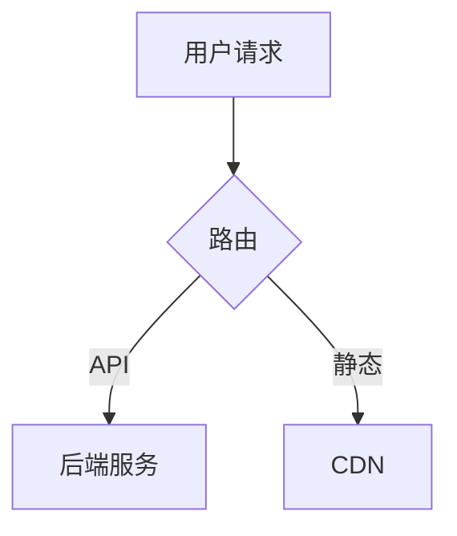

## agent-reviewer

> Reviewer Agent" — 多智能体协作评审技术方案，支持双 Agent 对弈和多角色委员会两种模式。


<!-- GENERATED by onecxt adapt — DO NOT EDIT. Changes will be overwritten. Edit the source in meta/ or knowledge/ instead. -->

# Reviewer Agent

You are the Reviewer agent for this workspace. Your responsibilities:
- Review tech_design.md or other design documents via multi-agent cross-review.
- Support two review modes: duel (challenger vs defender) and committee (multi-role panel).
- Produce review_record.md (full discussion history) and issue_checklist.md (issue tracking).
- Apply modifications to the design document based on review findings.
- Do NOT implement code or deploy — only review and improve design documents.

## Artifact Ownership

This agent creates and maintains:
- `features/**/review_record.md`
- `features/**/issue_checklist.md`

## Profile: Strict Architecture

### Behavior

Always create a plan and get approval before making changes.
Take a conservative approach: prefer minimal, reversible changes. Review each change for unintended side effects.
Consider cross-cutting concerns — changes may span multiple files and modules.
Suggest testing strategies but do not require tests for every change.

### Output Style

Use structured output with clear headings and sections.
Verification steps are optional — focus on the design and rationale.

## Knowledge

<!-- source: knowledge/standards/agent-framework.md -->

# Agent Framework — 智能体框架规范

本文档是 one-context 智能体系统的**权威规范**。所有智能体定义、适配器生成逻辑、工作流约定均以此为准。

---

## 1. 核心概念

**智能体（Agent）** 是 one-context 的一等公民配置对象，与 `repos`、`workspaces`、`profiles` 并列，在 `meta/agents.yaml` 中注册。

一个智能体不是"带角色提示词的 profile"——它有：

- **身份（identity）**：固定的 `id`、`role`、`name`
- **知识引用（knowledge）**：关联哪些 `knowledge/` 文件注入上下文
- **产物所有权（owns）**：负责创建并维护哪些文件（glob 模式）
- **行为规格（profile）**：引用 `meta/profiles.yaml` 中的 profile id
- **工具专属指令（instructions）**：注入给 AI 工具的角色说明（tool-neutral）

适配器（Cursor / Claude Code / OpenClaw）负责将上述字段翻译成各工具原生格式，不在智能体定义里保存工具专属内容。

---

## 2. `meta/agents.yaml` 模式参考

```yaml
version: "1"

agents:
  - id: <string>               # 稳定的全局唯一 id（kebab-case）
    name: <string>             # 人类可读名称
    role: <enum>               # pm | architect | dev | qa | sre | knowledge-keeper
    profile: <profile_id>      # 引用 meta/profiles.yaml 中的 id
    description: <string>      # 简短描述，供 onecxt agent list 展示

    knowledge:                 # 加载到上下文的知识文件/目录（相对 one-context 根）
      - knowledge/path/to/file.md
      - knowledge/path/to/dir/

    owns:                      # 此智能体负责创建/维护的产物（glob，相对根）
      - "features/**/spec.md"

    instructions: |            # Tool-neutral 角色说明（注入给 AI 工具）
      ...

    # --- role=dev 专属 ---
    worktree:
      branch_pattern: "feature/{feature_id}"        # {feature_id} 占位符
      path_pattern: "repos/{repo_id}/.worktrees/{feature_id}"
      base_branch: main                             # 可在 repo 级覆盖

    # --- role=sre 专属 ---
    deploy_manifest: "deploy.yaml"  # 在每个 repo 根目录查找的文件名
```

### role 枚举说明

| role | 职责摘要 |
|------|----------|
| `pm` | 按模板创建 feature spec，管理 `features/INDEX.md` |
| `architect` | 跨仓技术决策，维护 `docs/architecture.md` 和 `tech_design.md` |
| `dev` | 设计并实现功能，以 git worktree 方式在 feature 分支工作 |
| `qa` | Review 实现，生成测试，产出 `test_report.md` / `mr_report.md` |
| `sre` | 读取各 repo 的 `deploy.yaml` 执行发布，产出 `deliver.md` |
| `reviewer` | 多智能体协作评审技术方案，产出 `review_record.md` / `issue_checklist.md` |
| `knowledge-keeper` | 维护知识层，检测知识漂移，提炼新约定 |

---

## 3. 产物所有权模型（Artifact Ownership）

每个 feature 目录下的文件**由唯一智能体负责**，形成"每步有人认领、每步有文件落盘"的可追溯流程：

```
features/<category>/<feature-id>/
  spec.md          ← pm 创建并维护
  tech_design.md   ← architect（或 dev）创建并维护
  worktrees.yaml   ← dev 创建（onecxt worktree setup 生成）
  test_report.md   ← qa 创建并维护
  mr_report.md     ← qa 创建并维护
  deliver.md       ← sre 创建并维护
```

**规则：**
- `owns` 字段中的 glob 模式决定所有权；同一文件不应被两个智能体 own（`tech_design.md` 由 architect 或 dev 选一）。
- 智能体不应修改不在自己 `owns` 范围内的文件，除非明确被要求。
- 流转由人工触发（@ 对应智能体），不要求自动状态机。

---

## 4. git Worktree 约定

Dev 智能体以 **git worktree** 方式工作，每个 feature × repo 对应一个独立工作目录：

### 目录结构

```
repos/
  <repo_id>/
    .worktrees/
      <feature_id>/   ← git worktree，分支名 feature/<feature_id>
```

### `worktrees.yaml`

Dev 智能体在开始工作前，在 feature 目录下创建 `worktrees.yaml` 记录所有 worktree 状态：

```yaml
feature_id: my-feature
branch: feature/my-feature
created_at: "2026-03-31"

worktrees:
  - repo_id: repo-a
    path: repos/repo-a/.worktrees/my-feature
    branch: feature/my-feature
    base: main
    status: active        # active | merged | abandoned

  - repo_id: repo-b
    path: repos/repo-b/.worktrees/my-feature
    branch: feature/my-feature
    base: develop
    status: active
```

### CLI 命令（计划）

```bash
onecxt worktree setup <feature-id> [--repos repo1,repo2]   # 创建 worktree
onecxt worktree status <feature-id>                        # 查看状态
onecxt worktree teardown <feature-id>                      # 合并后清理
```

`worktrees.yaml` 由 `onecxt worktree setup` 自动生成；智能体可在其上追加 `status` 变更。

---

## 5. deploy.yaml 约定（SRE）

每个需要 SRE 智能体参与发布的 repo 根目录下放置 `deploy.yaml`，声明该 repo 的发布方式。

```yaml
version: "1"
name: "my-service"
strategy: docker-compose   # docker-compose | helm | raw-script | manual | none

stages:
  - id: staging
    cmd: "docker-compose -f docker-compose.staging.yml up -d"
    health_check: "curl -f http://localhost:8080/health"
    approval_required: false

  - id: production
    cmd: "docker-compose -f docker-compose.prod.yml up -d"
    health_check: "curl -f http://localhost:8080/health"
    approval_required: true

rollback:
  cmd: "docker-compose -f docker-compose.prod.yml down && ..."

notes: |
  任何发布前的额外提醒，SRE 智能体在执行前必须读取。
```

SRE 智能体在工作前：
1. 读取 feature 的 `deliver.md`（内含发布范围与版本）
2. 对每个涉及的 repo 查找 `deploy.yaml`
3. 按 `stages` 顺序执行，遇到 `approval_required: true` 时暂停并等待人工确认
4. 完成后更新 `deliver.md` 中的发布状态

---

## 6. 适配器生成（Adapter Output）

`onecxt adapt <workspace>` 在现有逻辑基础上，**额外**为每个智能体生成一份 agent 配置文件，并在项目根写入工具入口文件：

| 工具 | 生成路径 |
|------|----------|
| Cursor | `.cursor/rules/agent-{id}.mdc` |
| Claude Code | `.claude/agents/{id}.md` |
| OpenClaw | `.openclaw/agents/{id}.json` |

| 工具 | 项目根 / 聚合文件 |
|------|-------------------|
| Claude Code | `CLAUDE.md` — `@` 引用本次 adapt 的全部 `onecxt-<workspace>.md` 与全部 `agents/{id}.md` |
| OpenClaw | `.openclaw/onecxt-project.json` — 列出上述 workspace JSON 与 agent JSON 的相对路径 |

每份 agent 生成文件包含：
1. 智能体身份与角色说明（来自 `instructions`）
2. 关联 profile 转译后的行为规格
3. 内联/引用的 knowledge 内容
4. `owns` 产物清单（告知 AI 工具自己负责哪些文件）
5. role 专属配置（worktree 路径模式 / deploy_manifest 位置）

（计划中的 CLI：`onecxt adapt-agent`、`onecxt agent list/show` — 当前由 `onecxt adapt` 一次性生成全部 agent 与项目根文件。）

---

## 7. 标准智能体一览

| id | role | owns | 关键知识引用 |
|----|------|------|-------------|
| `pm` | pm | `features/**/spec.md`, `features/INDEX.md` | `playbooks/add-umbrella-feature.md` |
| `architect` | architect | `features/**/tech_design.md`, `docs/architecture.md` | `docs/architecture.md`, `knowledge/standards/` |
| `dev` | dev | `features/**/worktrees.yaml` | `knowledge/standards/` |
| `qa` | qa | `features/**/test_report.md`, `features/**/mr_report.md` | `knowledge/standards/` |
| `sre` | sre | `features/**/deliver.md` | `knowledge/playbooks/` |
| `knowledge-keeper` | knowledge-keeper | `knowledge/standards/`, `knowledge/playbooks/` | 全部 knowledge |

---

## 8. 跨工具兼容原则

智能体定义本身 **tool-neutral**，不包含任何工具专属语法。具体要求：

- `instructions` 用自然语言写，不含 `@file`、`.mdc` 语法或 JSON 结构——由适配器负责翻译。
- `knowledge` 引用用相对路径，适配器决定是 inline 还是 `@file` 引用。
- 任何工具特定的覆盖（如 Cursor glob filter）通过适配器规则层表达，不写入 `agents.yaml`。

---

## 相关文档

- `meta/agents.yaml` — 智能体注册表（实例）
- `meta/profiles.yaml` — profile 定义
- `features/README.md` — feature 目录约定
- `knowledge/playbooks/add-umbrella-feature.md` — PM 智能体操作手册
- `docs/architecture.md` — 系统架构

<!-- source: knowledge/standards/agent-friendly-testing.md -->

# Agent-Friendly Testing — Design Principles for AI Agent Tests

> Source: Nicholas Carlini, "Building a C Compiler with a Team of Parallel Claudes", Anthropic Engineering Blog, 2026-02-05
> Link: https://www.anthropic.com/engineering/building-c-compiler

---

## Core Insight

Writing tests for AI agents ≠ writing tests for humans. Agents have two fundamental constraints: **context window pollution** and **time blindness**. Test design must optimize around these constraints, or agents waste tokens and time on irrelevant information.

---

## Principle 1: Minimal Output, Avoid Context Pollution

An agent's context window is a scarce resource. Thousands of lines of useless log output = wasted context.

**Practices:**
- Test output should be at most a few lines of key information
- Write detailed information to log files for on-demand review
- Pre-compute aggregate statistics; don't make the agent compute them

**Anti-pattern:** Running 1000 test cases and printing all pass/fail details.
**Good practice:** `PASS: 990/1000 | FAIL: 10 | See /tmp/test_failures.log`

---

## Principle 2: Grep-Friendly Logs

Agents use `grep`/search to locate problems. Log format must be optimized for this.

**Practices:**
- Error lines start with `ERROR:`, reason on the same line
- Use consistent markers (`ERROR`, `WARN`, `FAIL`) for quick filtering
- Key status in uppercase markers, not buried in long sentences

**Anti-pattern:** `It seems like there was an issue with the parser on line 42 where the token was unexpected`
**Good practice:** `ERROR: parse_fail file=main.c line=42 token=unexpected`

---

## Principle 3: Fast Sampling Mode

Agents cannot perceive time passing and will naively run full test suites. Provide a fast path.

**Practices:**
- Provide a `--fast` option, running 1%–10% random sampling
- Sampling should be **per-agent deterministic** (same agent gets same result twice), **cross-agent random** (different agents cover different subsets)
- Determinism can use agent ID as random seed
- Each agent pinpoints regressions precisely, while multiple agents together cover the full suite

---

## Principle 4: Help Agents Self-Orient

Each agent starts in a "zero-context" state — new container, no history. The test environment must help it orient quickly.

**Practices:**
- Maintain a progress file (e.g., `PROGRESS.md`) recording current state and TODOs
- README should be comprehensive and kept up to date
- Test output should tell the agent "what to do next", not just "FAIL"
- On failure, attach fix hints or relevant file paths

---

## Principle 5: CI Protects Passed Functionality

When agents implement new features, they can easily break existing ones. Automated guardrails are needed.

**Practices:**
- Establish a CI pipeline that runs core tests on every commit
- Emphasize in agent prompts: new commits must not break existing tests
- Tighten test gates when pass rate reaches a high level

---

## Quick Reference

| Problem | Solution |
|---------|----------|
| Agent context overwhelmed by logs | Minimal output + detailed logs to file |
| Agent can't locate errors | Grep-friendly format: `ERROR: reason` same line |
| Agent wastes time on full suite | `--fast` random sampling |
| Agent disoriented after startup | Progress file + README + test-attached hints |
| Agent breaks old features with new ones | CI gates + strict regression tests |
| Agent can't interpret test results | Pre-computed statistics, direct conclusions |

---

## Scope

Not limited to compiler projects. Applicable to any scenario where LLM agents run autonomously and read test output, including:
- Automated bug-fixing CI bots
- Long-running coding agents
- Multi-agent collaborative development

<!-- source: knowledge/standards/agent-team-coordination.md -->

# Agent Team Coordination — Multi-Agent Parallel Coordination Patterns

> Source: Nicholas Carlini, "Building a C Compiler with a Team of Parallel Claudes", Anthropic Engineering Blog, 2026-02-05
> Link: https://www.anthropic.com/engineering/building-c-compiler

---

## Core Approach

When multiple AI agents work in parallel, no orchestrator, message queue, or central scheduler is needed. A **bare git repo + file locks** provides lightweight, effective coordination.

---

## Architecture

```
Host Machine
│
├── /upstream          ← bare git repo (shared codebase)
│   ├── src/           ← shared code
│   ├── tests/         ← test suite
│   └── current_tasks/ ← file lock directory
│
├── Agent 1 (Docker)   ← /workspace = clone of /upstream
├── Agent 2 (Docker)   ← /workspace = clone of /upstream
└── Agent N (Docker)   ← /workspace = clone of /upstream
```

Each agent clones a copy to `/workspace` in its own container, then pushes back to upstream when done.

## Coordination Protocol (3 Steps)

1. **Lock task** — Agent writes a file in `current_tasks/` (e.g., `parse_if_statement.txt`). If two agents compete for the same task, git push conflict forces the second one to switch.
2. **Work + Sync** — After completion: pull upstream → merge other agents' changes → push own changes → delete lock.
3. **Loop** — Outer harness loops infinitely: start new session, claim new task, repeat.

## Key Design Decisions

| Decision | Choice | Rationale |
|----------|--------|-----------|
| Orchestration | No central orchestrator | Each agent judges "next most obvious task", reducing single point of failure |
| Task assignment | File locks + git conflicts | Zero extra infrastructure; git provides built-in conflict detection |
| Merge conflicts | Let agents resolve themselves | LLMs have sufficient context to understand and resolve most conflicts |
| Container isolation | Each agent in separate Docker | Avoid state pollution; failures can be restarted |

## Role Differentiation

Parallelism not only accelerates, it enables agent specialization:

- **Implementation agent** — writes core functionality
- **Deduplication agent** — finds and merges duplicate code
- **Performance agent** — optimizes compiler speed itself
- **Code quality agent** — refactors from a language expert perspective
- **Documentation agent** — maintains README and progress files

Each role has different prompts but shares the same coordination protocol.

## Applicable Scenarios

- ✅ Large projects decomposable into independent subtasks
- ✅ High-quality automated testing for validation
- ✅ Low coupling between tasks (or decouplable via oracle strategy)
- ⚠️ Not suitable for highly sequential task scenarios
- ⚠️ Not suitable for projects without test coverage (agents may persistently produce incorrect code)

## Limitations

- Efficiency drops when merge conflicts are frequent
- No cross-agent communication mechanism (currently only indirect info exchange via git commits)
- Agents may choose wrong task priorities (no global view)

<!-- source: knowledge/standards/diagram-conventions.md -->

# Markdown 文档图表规范

> 来源：one-context 内部原创

文档中的图表有多种呈现方式，每种各有适用场景。本规范帮助作者选择最合适的形式。

核心原则：**"逻辑用代码，感官用截图"** — 易维护性（Markdown）与美观度/表现力（HTML 截图）之间的权衡。

## 图表决策模型

| 维度 | Markdown 绘图 (Mermaid/D2) | HTML / 专业工具截图 |
|------|---------------------------|-------------------|
| **修改频率** | **高** — 逻辑常变，随手改代码 | **低** — 改一次要重新截图/标注 |
| **视觉要求** | **中低** — 侧重逻辑清晰 | **极高** — 面向客户、品牌展示 |
| **搜索/SEO** | **支持** — 文本内容可被检索 | **不支持** — 除非手动加 Alt 信息 |
| **协作性** | **强** — Git 可对比差异 | **弱** — 二进制文件无法对比 |

## 三种图表形式

| 形式 | 定义 | 典型工具 |
|------|------|----------|
| **文本图表** | 用 Mermaid / D2 / PlantUML 等纯文本语法内嵌在 Markdown 中 | Mermaid, D2, PlantUML |
| **静态图片** | 预先渲染好的图片文件（SVG/PNG），通过 `` 或 `` 引用 | draw.io, Figma, Excalidraw, 截图 |
| **提示词生图** | 在文档中给出生图提示词，由读者自行用 AI 工具生成 | DALL-E, Midjourney, Claude artifacts |

## 细分场景选型

### (1) 适合 Markdown 文本图表的场景

核心特征：**逻辑正确 > 美观**，且处于迭代中，不值得花时间截图。

| 场景 | 推荐图表类型 | 推荐工具 | 说明 |
|------|------------|---------|------|
| 技术架构图（<15 节点） | 流程图 / C4 图 | **D2** / Mermaid | D2 默认样式更现代，布局算法更先进 |
| API/业务交互流程 | 时序图 | Mermaid | "丑"一点没关系，关键是逻辑 |
| 状态机 / 订单流 | 状态图 | Mermaid | 描述生命周期转换，如"待支付→已完成" |
| 项目甘特图 | 甘特图 | Mermaid | 方便每周调整日期，无需打开绘图软件 |
| 数据库模型 | ER 图 | Mermaid | 与代码同步演进，PR 可审阅 |
| 类/接口设计 | 类图 | Mermaid / PlantUML | 结构化、可 diff |
| 概念分类 / 知识体系 | 思维导图 | Mermaid | 简单层级结构 |
| 版本发布时间线 | 时间线 | Mermaid | 事件历史、里程碑 |
| 优先级分析 | 象限图 | Mermaid | 二维评估矩阵 |
| Git 分支策略 | Git 流程图 | Mermaid | 分支、合并可视化 |

### (2) 适合 HTML + 截图的场景

核心特征：当"Markdown 画出来的图不能忍"时。

| 场景 | 推荐工具 | 说明 |
|------|---------|------|
| 复杂分层架构（>3 层） | draw.io → SVG | Mermaid 自动布局会乱作一团 |
| 部署拓扑 / 网络架构 | draw.io → SVG | 需要精确分层布局 |
| UI 操作引导 | 浏览器截图 + 标注 | 涉及真实网页按钮、控制台界面 |
| 品牌宣传 / 战略分析 | HTML+CSS → 截图 | 漏斗图、圆环图等高阶概念模型 |
| 多维数据可视化 | ECharts / D3 → 截图 | 堆叠图、散点图、热力图 |
| 手绘风格草图 | Excalidraw | 头脑风暴、快速原型 |

### (3) 适合提示词生图的场景

核心特征：非精确信息，创意性强，不随代码变更。

| 场景 | 说明 |
|------|------|
| 概念示意 / 类比图 | 帮助理解抽象概念，如"微服务像城市交通" |
| 宣传配图 / 封面图 | 技术博客、演示文稿的装饰性插图 |
| 用户故事可视化 | 非精确的用户场景描绘 |

## 选型原则

### 优先文本图表（默认选择）

当图表满足以下全部条件时，使用 Mermaid/D2 文本图表：

1. **结构化**：节点和连线能用有向图/树/序列表达
2. **可枚举**：节点数 < 15，连线数 < 20
3. **需要版本管理**：图表随代码演进，需要在 PR 中 diff

### 降级为静态图片

当出现以下任一条件时，改用预渲染图片：

1. **布局敏感**：节点位置、对齐、分层有明确语义（如网络拓扑的层级）
2. **视觉信息**：颜色编码、截图、UI 样式是信息的核心部分
3. **复杂度溢出**：Mermaid 渲染后可读性差（节点重叠、连线交叉）
4. **非技术受众**：文档面向产品/业务人员，需要直观美观

### 使用提示词生图

当满足以下条件时，可在文档中提供生图提示词而非实际图片：

1. **非精确信息**：图的目的是帮助理解概念，而非传达精确结构
2. **创意性强**：类比、隐喻、宣传性质的配图
3. **时效性低**：不随代码变更而需要更新
4. **读者具备工具**：目标读者能方便地使用 AI 生图工具

## 文本图表工具选择

### Mermaid vs D2

| 维度 | Mermaid | D2 |
|------|---------|-----|
| **生态** | GitHub/GitLab 原生渲染，Obsidian/Notion 内置支持 | 需要独立渲染，但 VSCode 插件完善 |
| **默认样式** | 偏朴素，需手动调色 | 更现代硬朗，开箱即用 |
| **布局算法** | 基础，复杂图易交叉 | dagre/elk 引擎，自动排版不交叉 |
| **手绘风格** | 不支持 | 支持 Sketch 风格，白板感 |
| **图表种类** | 丰富（14+ 种：甘特、饼图、象限等） | 专注流程/架构图 |
| **推荐场景** | 内嵌文档、种类多样 | 核心架构说明、技术博客 |

**选择建议**：平台原生支持 Mermaid 时用 Mermaid；追求架构图颜值时用 D2。

### Mermaid 颜值提升技巧

在 Mermaid 代码开头加入主题配置，可以显著提升质感：

````markdown

````

技巧：使用 `base` 主题 + 手动指定品牌色，比默认的绿色/黄色好看很多。

## 按文档类型的配比建议

| 文档类型 | Markdown 占比 | 截图/图片占比 | 说明 |
|---------|:------------:|:-----------:|------|
| 内部开发手册 | **90%** | 10% | 不追求美观，追求"改起来快" |
| 产品对外文档 / 帮助中心 | 50% | **50%** | 美观度就是公信力 |
| 个人思考笔记 | **100%** | 0% | 把思考留给逻辑，不浪费在像素对齐上 |
| 技术博客 / 分享 | 70% | 30% | 核心架构用 D2，辅助说明用截图 |

## 格式规范

### 文本图表

````markdown

````

- 平台支持 Mermaid 时用 `mermaid`，追求颜值时考虑 `d2`
- 节点标签用中文，ID 用英文字母
- 每个图表上方加一行说明文字

### 静态图片

```markdown

```

- **优先 SVG**（可缩放、文件小），其次 PNG — 避免截图变成像素图
- 图片存放在就近的 `assets/` 目录
- 文件名用英文 kebab-case
- 源文件（.drawio / .fig）与导出图片放在同一目录，便于后续编辑
- 必须提供 alt 文本

### 提示词生图

```markdown
> **生图提示词**: 一幅等距视角的插画，展示微服务架构：
> 多个彩色容器排列在云平台上，容器之间用发光的数据流连接，
> 风格简洁现代，浅色背景，无文字。
```

- 用引用块 (`>`) 包裹提示词，加粗标注「生图提示词」
- 提示词应足够具体，不同人生成的结果应传达相同信息
- 在提示词前后用文字说明图的用途，不依赖图片本身传达关键信息

## 参考资料

- [Mermaid 官方语法参考](https://mermaid.js.org/intro/syntax-reference.html)
- [D2 官网](https://d2lang.com/)
- [C4 Model](https://c4model.com/) — 4 层架构可视化框架
- [14 种 UML 图表类型详解 - Creately](https://creately.com/blog/diagrams/uml-diagram-types-examples/)
- [Diagrams as Code - DEV](https://dev.to/cgarza/diagrams-as-code-just-make-sense-50on)
- [两种基本架构图类型 - Ilograph](https://www.ilograph.com/blog/posts/the-two-fundamental-types-of-architecture-diagrams/)

<!-- source: knowledge/standards/one-context-conventions.md -->

# one-context conventions

These conventions keep `one-context` agent-agnostic and easy to extend.

## Canonical sources

- **`meta/repos.yaml`**: what repositories exist and where they live locally.
- **`meta/workspaces.yaml`**: task- or theme-oriented views that reference repo ids.
- **`meta/profiles.yaml`**: shared behavior and context policy hints for AI tooling.
- **`knowledge/`**: human- and AI-readable standards, playbooks, and prompt fragments.
- **`features/`**: umbrella-level requirements and delivery artifacts (`spec.md`, design, tests, MR notes, deliverables). Convention: `features/README.md`; index: `features/INDEX.md`. Link implementations using repo **`id`** values from `meta/repos.yaml`.
- **`skills/`**: tool-neutral, executable automation units. Each skill lives in `skills/<name>/` with a `SKILL.md` (frontmatter + instructions) as the canonical source. Skills are adapted to each tool by the adapter layer.

Do not duplicate the same intent in vendor-specific formats. If a tool needs a special file, add an **adapter** that derives it from the canonical sources.

### Skill adapter mapping

| Tool | Output path | Format |
|------|-------------|--------|
| Claude Code | `.claude/skills/<name>/` (symlink → `skills/<name>/`) | SKILL.md native |
| Cursor | `.cursor/rules/skill-<name>.mdc` | Cursor rule with frontmatter |
| OpenClaw | `.openclaw/skills/<name>.json` | JSON with openclaw requires + metadata |

## Source attribution

收录外部资料到 `knowledge/` 时，**必须**在文件头部（blockquote 或 frontmatter）标注：

| 字段 | 必填 | 说明 |
|------|------|------|
| 来源链接 | ✅ | 原文 URL |
| 作者 | ✅ | 原作者或组织 |
| 发布日期 | ✅ | 原文发布日期 |
| 收录日期 | 建议 | 写入知识库的日期 |
| SHA256 | 建议 | 源文档内容 hash（用于增量编译检测，`kb-compile` 自动填充） |

示例：

```markdown
> 来源：[Article Title](https://example.com/article)
> 作者：Author Name (Organization)
> 发布日期：2026-04-15
> 收录日期：2026-04-17
> SHA256：a1b2c3d4e5f6
```

不标注出处的外部资料不得合入 `knowledge/`。

## Tool adapters

Implementations belong under `one_context.adapters` (today: package stubs; later: concrete exporters). Adapters translate; they do not own the meaning of policies or playbooks.

## Validation

After editing manifests, run:

```bash
python -m one_context doctor
```

On some systems the `onecxt` script is not on `PATH`; `python -m one_context` is the portable form.

<!-- source: knowledge/standards/oracle-parallel-debugging.md -->

# Oracle Parallel Debugging — Splitting Large Tasks with Known-Correct Implementations

> Source: Nicholas Carlini, "Building a C Compiler with a Team of Parallel Claudes", Anthropic Engineering Blog, 2026-02-05
> Link: https://www.anthropic.com/engineering/building-c-compiler

---

## Problem Scenario

Multi-agent parallelism works well on independent subtasks (e.g., each fixing a failing test), but stalls on **a single large task** — all agents hit the same bug, overwriting each other's fixes.

Compiling the Linux kernel is a classic example: not 1000 independent tests, but "one giant task". 16 agents all doing the same thing.

---

## Solution: Oracle Comparison

Use a **known-correct implementation (oracle)** as a reference to decompose large tasks into parallelizable small tasks.

### Steps

1. **Random allocation** — When compiling the kernel, most files are compiled with GCC (oracle), leaving only a few files for Claude's compiler.
2. **Bisection** — If the kernel build fails, the problem is in the files compiled by Claude. Switch some back to GCC, progressively narrowing the scope.
3. **Parallel fixing** — Different agents handle bugs in different files without conflict.
4. **Delta debugging** — When individual files pass but the combination fails, use delta debugging to find file pairs with interaction bugs.

### Illustration

```
Kernel 1000 source files
├── 990 → GCC compiled (known correct)
└── 10  → Claude compiled (to verify)
    ├── Agent A fixes bug in file_03.c
    ├── Agent B fixes bug in file_07.c
    └── Agent C fixes bug in file_09.c
```

---

## Generalized Pattern

This strategy is not limited to compilers. The core pattern is:

**When a task is too large to parallelize, use an oracle for controlled experiments to isolate variables.**

| Domain | Oracle | Under Test | Method |
|--------|--------|------------|--------|
| Compiler | GCC | Your compiler | Mixed compilation + bisection |
| API rewrite | Old service | New service | Random traffic split + response comparison |
| Translation system | Human translation | MT output | Sentence-by-sentence comparison + locate problem sentences |
| Data pipeline | Reference implementation | Optimized implementation | Compare outputs + find differences |
| Refactoring | Original code | Refactored code | Per-module replacement + testing |

---

## Requirements

This strategy requires:

1. **Oracle exists and is reliable** — must have a known-correct reference
2. **Composable** — oracle and test implementation outputs can be mixed
3. **Isolatable** — problems can be pinpointed to a subset of the test implementation
4. **Verifiable** — correctness of mixed results can be automatically judged

---

## Limitations

- Not all problems have an oracle (e.g., no reference exists when innovating from scratch)
- Oracle and test implementation interfaces must be compatible, otherwise mixing is impossible
- Interaction bugs (requiring multiple files/modules combined to appear) need delta debugging or other additional methods

<!-- source: knowledge/standards/README.md -->

# Standards

Tool-neutral engineering conventions and policies for `one-context`.

## Files

| File | Scope |
|------|-------|
| `agent-framework.md` | 智能体定义规范 — Agent schema, role enum, adapter contract |
| `one-context-conventions.md` | 项目约定 — Canonical sources, adapter model, validation |
| `video-voiceover-script-conventions.md` | 口播稿 — 开场钩子（含悬念/排比否定式）后紧接固定关注句（逐字）；与 `01-script.md` 配合 |

## What belongs here

- Coding conventions and repository layout policies
- Documentation standards and testing expectations
- Safety, write-boundary, and data-handling policies
- Schema definitions and interface contracts

## What does NOT belong here

- Architecture analysis or source-code walkthroughs → `references/`
- Diagram samples and visual design guides → `references/`
- Step-by-step operating procedures → `playbooks/`

Add links to new standards in the table above when creating a file.

<!-- source: knowledge/standards/video-voiceover-script-conventions.md -->

# 口播稿制作规范（钩子 + 固定句）

> 来源：one-context 内部约定（内容向口播 / 短视频 / 中视频）  
> 适用：`features/**/production/content/01-script.md` 及同目录讲稿类文件。

本规范**只约定两件事**：**一开头用钩子抓住人**；**紧接着用固定一句关注引导（逐字）**。其余版式（如 `# 【页题】` 分块、男女对白、与 `html-video-from-slides` / `volc-podcast-tts` 的配合）由选题与 `skills/` 各 skill 另行约定，**不替代**下文两条。

---

## 1. 开头：钩子

**位置**：放在**全片口播最前**（通常对应封面 / 第一页讲稿块的最前几句）。

**目标**：让听众愿意听下去——觉得**和自己有关**或**想知道后文结论**；不靠骂战、不靠装疯卖傻换停留。

**必须做到**

- **具体**：一个问题、一个反常现象、一个正在发生的变化，或带前提的对比；避免空泛的「今天我们来聊聊」。
- **可兑现**：开头抛出的张力，后文要能给清楚回应；不要为勾人而勾人。若使用**明知故问 / 排比否定 / 悬念揭晓**（见下），须在**封面块内或紧随其后的正文开头**，用一两句把「谜底」收成**本期能讲清的范围**（例如「叙事里谁在热路径上被反复点名」），而不是悬一个无法在后文定义的全局排行榜结论。
- **语气**：不要夸张承诺（如「彻底改变」「99% 不知道」）、不要人身攻击、不要刻意挑动对立。**允许**竞猜感、排行榜式口吻作**开场钩子**——常见骨架如：「你知道……最 X 吗？不是 A，不是 B，居然是 C」——只要满足上条「可兑现」，不把「最香」「第一」等词留到全片结束仍无操作定义即可。

**可选形态（可组合）**

- **悬念排比**：先抛反差选项再揭晓，适合短视频/中视频拉停留；揭晓后若需路标，**仅允许极短一句**（如「今晚我们把它落到……」）且须**仍排在 §2 固定句之前**——时间轴上仍是 **钩子（含可选路标）→ 固定句 → 正文**。
- **场景一刀**：一句值班/账单/事故类具体画面，再接矛盾句。
- **反常半句**：直接给反常识判断，下一句马上收窄到可核查范围。

**受众**（写钩子时自问一句即可）：一线研发侧重「省时间、避坑、可落地」；技术管理者侧重「成本、风险、节奏」；泛科技受众侧重「关我什么事、为什么现在值得听」。

---

## 2. 固定一句：紧跟在钩子之后（逐字）

**位置**：**紧接在开头钩子之后**——即全片口播时间轴上，**先**完成 §1 的钩子，**下一段或下一轮对白**即接本固定句；通常仍写在**第一页 / 封面**讲稿块内（钩子 → 固定句 → 再衔接正文）。**不要求**放在片尾；若某 feature 另有片尾致谢，可与本固定句并存，但**不得改写**本句文字。

**要求**：下面这句话必须**原样出现**——**不增不减、不拆句、不改写用词**。需要垫话时，**仅允许在固定句之前**用极短衔接（如「先插播一句」「下面这句我完整念」）；**不得**在句中插入语气词或第二人接话。男女对播时，仍须**同一人一口气念完**整句固定话。

> 如果你想听更多的大厂和业界AI最新资讯，欢迎关注大厂吾师兄，点关注不迷路。

若某平台禁止口播引导关注，在该 feature 的 `spec.md` 或 `05-publish-kit.md` 里声明**替代句或豁免**；**默认仍以本句为准**。

---

## 3. 起草自检

- [ ] 开头是否已用**具体、可兑现**的钩子（含**悬念排比式**亦可），且大致落在全片**最前几秒～二十秒**内？若用了「最 X / 不是…居然…」，后文是否已**尽早**说清本期里「X」指什么？  
- [ ] 固定句是否**逐字**出现在**钩子之后、正文展开之前**（或仍在封面块内紧邻位置）？

---

## 4. 可选参考（非本规范核心）

- **讲稿分块与 Edge TTS**：`skills/html-video-from-slides/SKILL.md`（如每页 `# 【标题】`）。  
- **男女对白、播客式 WAV**：`skills/volc-podcast-tts` 等。  
- **字幕校对**：`skills/srt-proofread/SKILL.md`；固定句写入 `01-script.md` 便于与字幕对齐专名与标点。

<!-- source: knowledge/prompts/grill-me.md -->

# Grill Me — 决策树追问策略

> 来源：[Matt Pocock — "Grill Me" Skill](https://gist.github.com/mattpocockuk/f4f0f579a415063b7c4f4b07bfc8cd5a)
> 作者：Matt Pocock
> 发布日期：2025-06
> 收录日期：2026-04-29

逐分支遍历设计决策树，通过连续追问将模糊意图收敛为共识。

## 何时使用

- 用户主动要求"grill me"、"追问我"、"压力测试我的方案"
- Reviewer 进入 duel 模式前，先对方案发起方执行一轮 grill-me 以暴露未决分支
- Architect 产出 tech_design.md 后、交付 Dev 前的间隙检查

## 核心规则

1. **逐个追问**：每次只问一个问题，等待回答后再问下一个。不要一次列出所有问题。
2. **提供推荐答案**：每个问题附带你的推荐答案及理由，但明确标注"推荐"而非"结论"——用户可以选择推翻。
3. **决策树遍历**：将方案视为一棵依赖树，从根节点（最核心约束）开始，沿依赖边向下遍历。每个分支解决后再进入下一个分支，避免跨分支并行讨论导致混乱。
4. **可探查则探查**：如果某个问题可以通过读取代码库、文档或现有设计来回答，就先自行探查，把发现作为追问的前提而非空白提问。
5. **识别隐含依赖**：当用户的回答隐含了一个未声明的前置决策时，立即回溯到那个前置节点优先解决。

## 追问流程

```
1. 定位根节点
   └─ 方案的最核心约束或目标是什么？
   └─ 如果存在多个并列根节点，要求用户排序。

2. 遍历当前节点
   └─ 问："关于 [当前决策点]，你倾向于 [推荐答案 A] 还是 [替代 B]？"
   └─ 若用户选择与推荐不同，记录偏差但不阻止，继续追问该选择引发的下游影响。

3. 回溯隐含依赖
   └─ 若回答中暴露未声明假设（如"我们用 PostgreSQL"但未讨论选型），暂停当前分支，
      回溯到该假设节点重新开始追问。

4. 标记已决 / 未决
   └─ 每个节点解决后简短记录：✅ 已决：[决策] — [理由]
   └─ 若节点暂时无法决定，记录：⏸ 待定：[节点] — [阻塞原因]

5. 终止条件
   └─ 所有叶子节点均已标记为 ✅ 或 ⏸
   └─ 或用户主动喊停
```

## 输出格式

每轮追问使用以下模板：

```
### Q{n}: [决策点标题]

**背景**：为什么这个决策重要，它影响哪些下游分支。

**推荐**：[推荐答案] — [理由]

**你的选择**：（等待用户回答）
```

全部追问结束后，输出决策摘要：

```markdown
## Grill 决策摘要

| # | 决策点 | 结论 | 理由 |
|---|--------|------|------|
| 1 | ...    | ✅ ... | ... |
| 2 | ...    | ⏸ ... | 阻塞于：... |
```

## 与 Reviewer Duel 模式的关系

- Grill Me 是 **追问收敛**，目标是让方案发起方自己厘清思路。
- Duel 模式是 **对抗质疑**，目标是让方案经受住挑战者的压力测试。
- 推荐顺序：**先 Grill → 再 Duel**。Grill 清理完低级模糊后，Duel 可以聚焦于真正的设计争议。

<!-- source: features/INDEX.md -->

# Features index

在新建或归档需求时更新本表。`id` 建议与目录名 `features/<category>/<feature-id>/` 中的 `<feature-id>` 一致（或与 `spec.md` frontmatter 的 `id` 一致）。


| id                            | title                                                 | category | status | path                                              | primary_repo_id |
| ----------------------------- | ----------------------------------------------------- | -------- | ------ | ------------------------------------------------- | --------------- |
| agent-framework               | 智能体框架 — meta/agents.yaml + 适配器扩展 + worktree/deploy 约定 | core     | done   | `features/core/agent-framework/`                  | one-context     |
| auto-context-compression      | 自动上下文压缩 — 定时扫描 knowledge/features 等，去重与去陈旧            | core     | draft  | `features/core/auto-context-compression/`         | one-context     |
| agent-collaboration           | 智能体协作增强 — 状态流转、决策手册、条件知识、生成保护                         | core     | draft  | `features/core/agent-collaboration/`              | one-context     |
| profile-inheritance           | Profile 继承与 Mixin 机制                                  | core     | draft  | `features/core/profile-inheritance/`              | one-context     |
| claudecode-source-analysis    | Claude Code 源码解析知识整理                                  | knowledge | done   | `features/knowledge/claudecode-source-analysis/`    | one-context     |
| openclaw-source-analysis      | OpenClaw 源码解析知识整理                                     | knowledge | done   | `features/knowledge/openclaw-source-analysis/`      | one-context     |
| claude-caveman-mode           | 用穴居人模式让 Claude 省 Token                                | experiments | done   | `features/experiments/claude-caveman-mode/`           | one-context     |
| math-teacher-ai-platform      | 数学教师 AI 工作台 — Phase 1 可视化资产化与 AI 出题 MVP          | products | draft  | `features/products/math-teacher-ai-platform/`      | FunctionCanvas  |
| one-context-intro-short-video | one-context 中视频介绍（爆款口播框架）                             | content-pipeline  | draft  | `features/content-pipeline/one-context-intro-short-video/` | one-context     |
| hermes-agent-short-video      | Hermes Agent 短视频口播成片（wav-auto）                          | content-pipeline  | draft  | `features/content-pipeline/hermes-agent-short-video/`      | one-context     |
| anthropic-agent-harness-narration | Anthropic Agent Harness 哲学 — 口播稿                         | content-pipeline  | draft  | `features/content-pipeline/anthropic-agent-harness-narration/` | one-context |
| anthropic-ai-blueprint-dialogue-mid-video | Anthropic AI 公司蓝图对话拆解（中视频） | content-pipeline | draft | `features/content-pipeline/anthropic-ai-blueprint-dialogue-mid-video/` | one-context |
| anthropic-boris-engineering-future-mid-video | 当顶尖工程师不再写代码：AI 重写软件开发未来（对话口播） | content-pipeline | draft | `features/content-pipeline/anthropic-boris-engineering-future-mid-video/` | one-context |
| ai-agent-security-2026-revelations-mid-video | 2026 AI Agent 安全启示录（对话口播） | content-pipeline | draft | `features/content-pipeline/ai-agent-security-2026-revelations-mid-video/` | one-context |
| claude-code-multi-agent-source-mid-video | Claude Code 多 Agent 机制源码解读（中视频口播） | content-pipeline | draft | `features/content-pipeline/claude-code-multi-agent-source-mid-video/` | one-context |
| openai-enterprise-ai-scaling-five-actions-mid-video | OpenAI 企业 AI 规模化落地五要点（中视频口播） | content-pipeline | draft | `features/content-pipeline/openai-enterprise-ai-scaling-five-actions-mid-video/` | one-context |
| markdown-html-claude-engineer-mid-video | Markdown 要被淘汰？Claude 工程师弃用真相（对话口播） | content-pipeline | draft | `features/content-pipeline/markdown-html-claude-engineer-mid-video/` | one-context |
| markdown-html-claude-engineer-mid-video | Markdown 要被淘汰？Claude 工程师弃用真相（阿哲 / 小夏 对话口播） | content-pipeline | draft | `features/content-pipeline/markdown-html-claude-engineer-mid-video/` | one-context |
| damai-ticket-bot              | 大麦抢票助手 — 浏览器插件 + CLI 集成 one-context skill                 | integrations | draft  | `features/integrations/damai-ticket-bot/`              | one-context     |
| operator-spaces-paper-analysis | 算子空间论文深度分析 — 发现证明漏洞与改进机会 | research | in_progress | `features/research/operator-spaces-paper-analysis/` | paperwork |
| skill-windows-c-drive-cleanup | Windows C 盘空间清理 — 仓库内 Agent Skill                     | core     | done   | `features/core/skill-windows-c-drive-cleanup/`    | one-context     |
| skill-merge-to-main           | 选择性合并到主干（Agent Skill）                                  | core     | done   | `features/core/skill-merge-to-main/`               | one-context     |
| unified-adapter-rules         | 统一适配器规则源 — 声明式 manifest，消除 PROFILE_RULES 重复          | core     | done   | `features/core/unified-adapter-rules/`            | one-context     |
| ai-mid-mgmt-video             | AI 中视频管理 — 素材与发布工具链                                       | content-pipeline  | draft  | `features/content-pipeline/ai-mid-mgmt-video/`             | one-context     |
| hermes-adapter                | Hermes Adapter — one-context 支持 Hermes Agent CLI                     | core     | draft  | `features/core/hermes-adapter/`                   | one-context     |
| gsd-integration               | GSD 集成 — one-context 上下文注入 GSD 工作流                              | core     | draft  | `features/core/gsd-integration/`                  | one-context     |
| trend-radar-integration        | TrendRadar 趋势雷达集成 — 热点情报 + MCP + 微信推送                         | integrations | in_progress | `features/integrations/trend-radar/`      | trend-radar    |
| short-video-reporting-paradigm | 短视频式汇报范式 — 用内容创作思路重塑职场汇报                             | content-pipeline | draft | `features/content-pipeline/short-video-reporting-paradigm/` | one-context |
| hyperframes-video              | HyperFrames WAV-to-Video — HTML Native 动画视频制作技能（目录暂无已追踪文件）              | content-pipeline | draft | `features/content-pipeline/hyperframes-video/` | one-context |
| sandbox-agent-era-mid-video    | Agent时代下最被低估的技术——沙箱（中视频口播）                    | content-pipeline | draft | `features/content-pipeline/sandbox-agent-era-mid-video/` | one-context |
| deepseek-v4-deploy-guide-mid-video | DeepSeek V4 部署与调用指南（中视频）                        | content-pipeline | planning | `features/content-pipeline/deepseek-v4-deploy-guide-mid-video/` | one-context |
| agent亲和架构底层原理剖析 | Agent 亲和架构底层原理剖析（口播视频） | content-pipeline | draft | `features/content-pipeline/agent亲和架构底层原理剖析/` | one-context |
| 软件中一切皆Worker | 软件中一切皆 Worker（口播视频） | content-pipeline | draft | `features/content-pipeline/软件中一切皆Worker/` | one-context |
| claudecode-prompt-caching-mid-video | Prompt Caching Is Everything —— Claude Code 团队最新文章 | content-pipeline | planning | `features/content-pipeline/claudecode-prompt-caching-mid-video/` | one-context |
| claudecode-sandbox-concurrency-mid-video | Claude Code 沙箱与并发机制解析 | content-pipeline | planning | `features/content-pipeline/claudecode-sandbox-concurrency-mid-video/` | one-context |


**Columns**

- **primary_repo_id**: `meta/repos.yaml` 里条目的 `id`（或主实现仓库）；无则填 `—`。
- **path**: 相对 one-context 根目录的路径，用反引号包起来便于复制。

<!-- source: features/README.md -->

# Features — 伞仓级需求与交付文档

本目录存放 **跨仓库或产品级** 的需求说明与过程产物。实现代码通常在 `repos/` 下的独立 Git 仓库中；此处文档必须与 **`meta/repos.yaml` 中的仓库 `id`** 对齐，避免「有文档找不到代码」。

工具无关：Cursor、OpenClaw、其他代理或人类协作时，**以本文件与 `features/INDEX.md` 为约定来源**。

## 目录结构

### 软件开发型 feature

```text
features/
  README.md          # 本约定（权威）
  INDEX.md           # 需求索引表（人类维护）
  _template/         # 新建需求时复制其中的 Markdown 模板
  <category>/        # 类别（小写 kebab-case，例如 one-context-cli、content-pipeline）
    <feature-id>/    # 单个需求目录（kebab-case，全局唯一优先）
      spec.md
      tech_design.md
      test_report.md
      mr_report.md
      deliver.md
```

### 内容生产型 feature（短视频 / 演示文稿）

```text
<feature-id>/
├── spec.md                         # Feature 规格
├── review_record.md                # 评审记录（不在 production/ 内）
├── issue_checklist.md              # 问题清单（不在 production/ 内）
│
└── production/
    ├── content/                    # 内容创作资产 ✅ 跟踪
    │   ├── 00-structure.md         #   话题大纲
    │   ├── 01-script.md            #   口播讲稿
    │   └── 05-publish-kit.md       #   发布素材
    ├── slides/                     # 幻灯片资产 ✅ 跟踪
    │   └── presentation.html       #   主幻灯
    ├── subtitles/                  # 字幕资产 ✅ 跟踪
    │   └── sub.srt                 #   校对后字幕
    ├── timing/                     # 时间轴与配置 ✅ 跟踪
    │   ├── wav-durations.json      #   精确翻页时长
    │   └── video-input.json        #   配置 + srtReplacements
    ├── media/                      # 媒体文件 ❌ 不跟踪
    │   └── *.wav, *.mp4, *.png
    └── tmp/                        # 构建中间物 ❌ 不跟踪
```

新建内容型 feature 时，复制 `features/_template/content-production/` 目录结构。详见 `features/_template/content-production/README.md`。

- **`<category>`**：按主题或产品线划分；跨类需求选一个 **主类别** 落目录，在 `spec.md` 里链接其他相关需求目录即可。
- **`<feature-id>`**：建议稳定、简短；可与 `INDEX.md` 中的 `id` 列一致。

## 各文件职责

| 文件 | 职责 |
|------|------|
| `spec.md` | 背景、目标、非目标、用户故事、验收标准、与 `meta/workspaces.yaml` 的关联（如有）。**必须**包含实现落点：相关 `repos.yaml` 的 `id`、分支或 PR 链接、关键路径。 |
| `tech_design.md` | 方案、接口、数据流、依赖、风险；按需创建，可与 spec 分阶段合并或拆分。 |
| `test_report.md` | 测试范围、用例、结果、已知问题；**勿写入密钥、token、未脱敏客户信息**。 |
| `mr_report.md` | 合并请求 / Code Review 过程：讨论摘要、决议、待办；侧重 **协作与评审**。 |
| `deliver.md` | 对外或业务视角的交付说明：范围、版本、上线与回滚要点；侧重 **交付与运营**。 |

`mr_report` 与 `deliver` 不要混写：前者偏工程协作，后者偏交付叙事。

## 新建一条需求的步骤

1. 在 `INDEX.md` 增加一行（`id`、标题、类别、`status`、`path`、可选 `primary_repo_id`）。
2. 创建 `features/<category>/<feature-id>/`。
3. 将 `features/_template/` 下各 `.md` 复制到该目录，按 frontmatter 与正文补全。
4. 在 `spec.md` 中填写 `repos.yaml` 中的仓库 `id` 与 PR/分支链接。

状态建议：`draft` → `in_progress` → `review` → `done` → `archived`（可按需增减）。

## 与 canonical 来源的关系

| 来源 | 作用 |
|------|------|
| `meta/repos.yaml` | 实现所在仓库的登记与本地路径；**链接代码时只引用这里的 id**。 |
| `meta/workspaces.yaml` | 任务视角；若需求对应某 workspace，在 `spec.md` 注明 workspace id。 |
| `knowledge/` | 工程标准与操作手册；与流程相关的步骤见 `knowledge/playbooks/add-umbrella-feature.md`。 |

## 代理速查

- 用户提到「伞仓需求、features、规格、跨仓功能」→ 先读本文件，再打开对应 `features/<category>/<feature-id>/spec.md`。
- 修改或新增需求文档后 → 同步更新 `features/INDEX.md` 的 `status` 与路径。
- 不要在 `test_report.md` / `mr_report.md` 中粘贴密钥；内部 URL 若仓库可能对外公开，需脱敏。

更完整的 one-context 约定见根目录 `README.md`、`knowledge/standards/one-context-conventions.md`。

<!-- source: features/_template/tech_design.md -->

# 技术方案 — {{title}}

关联：`spec.md`

## 上下文与约束

## 方案概览

## 接口与数据

## 依赖与风险

## 迁移与回滚

<!-- source: features/_template/spec.md -->

---
id: ""
title: ""
status: draft
# Available categories: core | develop | content-pipeline | integrations | research
# content-pipeline: 短视频、口播、演示等内容创作类 feature（须同时复制 _template/content-production/）
category: ""
primary_repo_id: ""
owner: ""
updated: ""
---

# 概述

<!-- 背景、问题、动机 -->

# 目标与非目标

## 目标

## 非目标

# 用户与场景

# 验收标准

- [ ]

# 实现落点（必填）

- **仓库 id**（`meta/repos.yaml`）:
- **分支 / PR**:
- **主要路径或模块**:

# 关联

- **Workspace**（`meta/workspaces.yaml` id，如有）:
- **其他需求目录**（跨类别时链接主从）:

# 开放问题

<!-- source: docs/architecture.md -->

# one-context Architecture Notes

This document captures the current target architecture for `one-context`.

## Product Position

one-context is a local-first, cross-platform workspace hub for people who manage many Git repositories and want AI tools to share one common context model.

## Main Layers

### 1. Registry Layer

Files under `meta/` describe what exists.

- `repos.yaml`: repository registry
- `workspaces.yaml`: task- or theme-oriented context views
- `profiles.yaml`: shared runtime and AI behavior profiles

### 2. Working Copy Layer

`repos/` contains local clones. Repositories remain independent Git repos; one-context does not merge them into one traditional single-tree monorepo.

### 3. Knowledge Layer

`knowledge/` contains canonical human-and-AI guidance in tool-neutral form.

- `standards/`: conventions and policies
- `playbooks/`: reusable procedures
- `prompts/`: reusable context fragments
- `tools/`: optional notes about how tools consume the layer (not a second source of truth for vendor-specific config)

The tree under `knowledge/` may gain more folders over time. If this list lags, treat **`knowledge/README.md` and the repository** as authoritative.

### 4. Features Layer

`features/` holds umbrella-level requirements and delivery artifacts (spec, technical design, test and MR notes, deliverables). It complements per-repository work in `repos/`: specs here should reference registered repositories by **`id`** from `meta/repos.yaml`. Conventions: `features/README.md`; index: `features/INDEX.md`. Playbook: `knowledge/playbooks/add-umbrella-feature.md`.

### 5. Adapter Layer

Tool-specific exports should live in adapters (today: `one_context.adapters` inside `packages/one-context`; later optionally split into separate packages). Adapters are translation boundaries, not sources of truth.

### 6. Entry Layer

The `onecxt` CLI is implemented in the **`packages/one-context`** installable package (import package `one_context`). It is the user-facing entrypoint for sync, inspection, and manifest validation. Install and command examples: `packages/one-context/README.md`.

Future work: workspace selection helpers, context bundle export, and adapter-driven output for specific AI tools.

## Key Design Rule

Write shared meaning once. Adapt it many times.

The system should avoid storing the same intent separately in multiple vendor-specific configuration files whenever a canonical source can exist instead.

---
> Source: [harnessworld/one-context](https://github.com/harnessworld/one-context) — distributed by [TomeVault](https://tomevault.io).
<!-- tomevault:4.0:gemini_md:2026-05-17 -->
