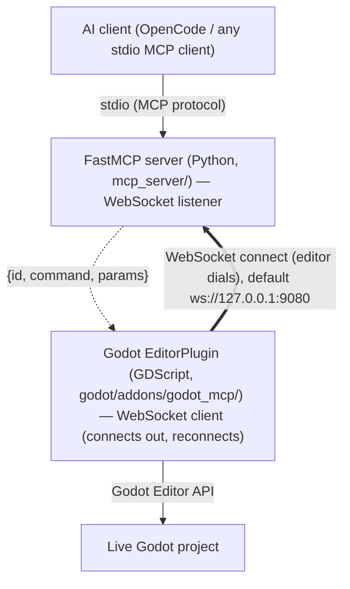

## godot-mcp

> Entry point for AI agent harnesses working in **godot-mcp**.

# AGENTS.md

Entry point for AI agent harnesses working in **godot-mcp**.

> **Reading this as an LLM agent?** The documentation site ships an
> agent-friendly mirror: [`llms.txt`](https://hybridindie.github.io/godot-mcp/llms.txt)
> (index) and [`llms-full.txt`](https://hybridindie.github.io/godot-mcp/llms-full.txt)
> (everything as one markdown document).

## Independent & harness-agnostic

godot-mcp is a **standalone MCP server** — generic Godot editor control over the Model Context Protocol. It is usable by **any** AI agent harness (OpenCode, or any MCP client over stdio or Streamable HTTP) and is **game-agnostic** (no built-in game vocabulary).

It has **no dependency on any specific consumer.** Other projects depend on godot-mcp, never the reverse — e.g. the `godot-agents` orchestrator is coded specifically against this server's tool surface, but godot-mcp must **never** couple back to it (no agent-harness-specific tools, prompts, assumptions, or imports). Keep the surface generic; let consumers adapt to it.

## Current state

The planned ecosystem is **feature-complete**: the engine (scaffold #1, addon + dock #2, bridge #3, server #4, inspection #5, safety #14, mutation #6, scripts #10, `godot://` resources #11, runtime loop #13, toolset gating #26) plus every content domain and capability — physics #41, animation #39, 3D scene #40, particles #42, navigation #43, audio #44, tilemap #45, theme/UI #46, shaders #47, the runtime session bridge #66 (live inspection #35, input sim #36 + recording #68, profiling #38), play-testing/QA #37, batch refactor #48, static analysis #49, and export #50 — are merged. TileSet authoring #82 and MeshLibrary authoring #83 add the resource-authoring tools that let the tilemap and gridmap surfaces place real content. 192 tools across 29 categories — always-on `core` plus 28 toggleable toolsets, of which only `inspection` is enabled by default (the other 27 gated off). New work now means new GitHub issues; the issues remain the authoritative spec, so read the relevant one before implementing. `docs/tool-contracts.md` is the source of truth for the current tool surface.

The **documentation site** (architecture, reasoning, setup, tool reference) is published at
https://hybridindie.github.io/godot-mcp/ — rebuilds on every `docs/site/**` push to `main` via
`.github/workflows/deploy-docs.yml` (VitePress, dead-link checked). For LLM agents, the site ships
[`llms.txt`](https://hybridindie.github.io/godot-mcp/llms.txt) (page index) and
[`llms-full.txt`](https://hybridindie.github.io/godot-mcp/llms-full.txt) (the whole site as one
markdown document, generated by `docs/site/llms-gen.mjs`) — point agents at those URLs
instead of crawling HTML.

## Grounding rules

The constitutional rules live in `.opencode/rules/` and are the source of truth for *how* to build here. Each is path-scoped (frontmatter `paths:`) so it surfaces on the files it governs. Read the relevant rule before writing code in that area:

| Rule | Article | Governs |
|------|---------|---------|
| `architecture.md` | I & II | Library-first; the addon/server boundary (only the addon touches Godot, only the server owns safety) |
| `mcp-tools.md` | VI + safety | Tool/resource/prompt contract; safety classes, `dry_run`/`confirm`, preconditions |
| `error-handling.md` | IV | The versioned JSON envelope (`{id, ok, result, error, hint}`); structured errors |
| `async-patterns.md` | V | Async FastMCP; bridge timeouts, reconnect/backoff, `id` correlation |
| `addon.md` | — | GDScript addon: `@tool`, command router, UndoRedo, JSON-safe serialization, `type_coerce.gd` |
| `testing.md` | III | TDD; contract→integration→unit; suite health (zero skips) |
| `workflow.md` | — | Issue → red test → green → preflight → PR → merge pipeline |
| `enforcement.md` | IX | Gates, PR checklist, CalVer |
| `graphify.md` | — | Graphify LLM-extraction policy: always run graphify via `scripts/graphify.sh` so the repo `.env` (local ollama backend/model) is observed |

These rules are path-scoped; apply the one(s) matching the files you touch. When a rule and this file disagree, the rule wins.

## Architecture

The defining feature is a **four-layer transport chain** (issue #3). Every agent action crosses all four layers:

The editor **dials** the connection (bold) and reconnects; the server still **initiates every command** (dashed). The bridge inversion (#276) changed only who connects, not the request/response direction.

- **MCP server** (`mcp_server/`, Python 3.11+, FastMCP) — the AI-facing entry point over stdio. Exposes **tools**, **resources** (`godot://...` URIs, issue #11), and **prompts** (workflow templates, issue #12). It owns all safety/permission logic and Pydantic domain models; it holds **no** Godot logic itself — it forwards to the addon over the WebSocket bridge.
- **Godot addon** (`godot/addons/godot_mcp/`, GDScript, Godot 4.4+) — an `EditorPlugin` (`@tool`) whose `WebSocketPeer` **client** connects out to the server's bridge listener and reconnects with backoff (#276), routes incoming command envelopes to `cmd_*` handlers that call the Godot Editor API, and shows a status dock. This is the *only* layer that touches Godot.

A typical MCP tool is a thin wrapper: validate/typed-schema in Python → `bridge.send("cmd_name", params)` → addon `cmd_name` handler → JSON result back up the chain. When adding a capability you almost always implement **both** sides (issues tagged `[Both]`): the GDScript `cmd_*` handler and the FastMCP tool that routes to it.

## Cross-cutting conventions

These span many files and are the things easiest to get wrong:

- **JSON envelopes** (issue #3) — versioned from day one. Command: `{ id, command, params }`. Response: `{ id, ok, result, error }`. Requests correlate by `id`. The addon (WebSocket client) reconnects to the server's listener with exponential backoff (#276); `cmd_ping`→`{pong}` is the health check.
- **Structured errors, never stack traces** — failures return `{ ok: false, error, hint }`. Preconditions return a richer form: `{ ok: false, error: "PRECONDITION_FAILED", hint, required }` (issue #14). Errors must be actionable for an agent with no human in the loop.
- **Tool safety classes** (issue #14) — every tool is tagged `read_only` | `mutating` | `destructive` | `runtime`. `mutating`/`destructive` tools take `dry_run: bool = False`; `destructive` tools require `confirm=True`. Common preconditions: `require_active_scene`, `require_bridge_connected`, `require_node_exists(path)`. All safety logic lives in the MCP layer, **not** the addon.
- **UndoRedo for every mutation** (issue #6) — all create/rename/delete/set operations in the addon must register with `EditorUndoRedoManager`.
- **Honest partial results** (issues #424/#437/#461) — results never read as success when the effect half-failed: batches above the 20-node undo threshold return `undoable: false` + hint; `run_commands` early stops return `aborted_at`/`skipped_count`/hint; parse checks that raced an in-flight filesystem scan return `rescan_pending: true`; timeout kills are distinguished from crashes (`exit_code=None` is not a non-zero exit; `expected_timeout` opt-in); unknown project-setting keys are refused with a did-you-mean hint. Contract tests pin every field.
- **JSON-safe serialization** — the scene tree and node properties must serialize to JSON-safe types only (no Godot objects). Large trees support a `max_depth` parameter.
- **Type coercion** (issue #6) — Godot types (`Vector2/3`, `Color`, `Rect2`, `NodePath`) are coerced to/from JSON in a dedicated `type_coerce.gd` helper, not inline.
- **Read-only vs. mutating split** — read-only context is exposed both as tools (issue #5) and as `godot://` resources (issue #11); mutations only ever go through tools.
- **Naming** — `snake_case` for all domain/data fields and Pydantic models; addon command handlers are `cmd_<verb>_<noun>`. Every MCP tool is exposed as `godot_<toolset>_<action>` (issue #224) — the prefix *is* the gating toolset (always-on `core`/meta tools are `godot_<action>`); the mapping is applied centrally in `mcp_server/transforms.py` (via FastMCP 4.0's `ToolTransform`, issue #312) and enforced by `tests/contract/test_tool_transform.py`.

## Game-agnostic scope

godot-mcp deliberately ships **no** game vocabulary — no Tower/Enemy/Wave models, no `create_tower`-style tools or prompts. Its surface is generic Godot: inspection, scene mutation, scripts, resources, and runtime control. A specific game (a tower-defense roguelite is the first consumer) is a **separate project** that imports godot-mcp as an MCP server and layers its own domain models, semantic tools, and prompts on top. Keep that boundary: if a capability only makes sense for one game, it belongs in the game project, not here.

## Toolchain & running

The scaffold (issue #1) is in place: `uv`-managed Python package, the addon under `godot/`, docs, and CI.

- Godot **4.4+** (floor), **validated on 4.7-stable** (the `godot/` project declares `config/features=PackedStringArray("4.7")`); Python **3.11+**; **FastMCP 4.0.1** (PrefectHQ/fastmcp, stable — MCP SDK v2, 2026-07-28 sessionless protocol), managed with **uv**. Always verify Godot APIs against the current docs for the pinned version (via `context7` or `docs.godotengine.org`) rather than from memory — see [[addon]].
- **Dev commands** (run from repo root, mirrored by `.github/workflows/ci.yml`):
  - `uv sync` — create the venv and install runtime + dev deps.
  - `uv run pytest -q` — full suite; single file `uv run pytest tests/unit/test_smoke.py`; single test `uv run pytest tests/unit/test_smoke.py::test_version_is_calver`.
  - `uv run ruff check .` — lint; `uv run mypy` — type check.
  - `./.opencode/hooks/check-no-skipped-tests.sh` — zero-skip suite-health gate.
- Server entrypoint: `uv run godot-editor-mcp` runs the live FastMCP server over stdio (or HTTP via `GODOT_MCP_TRANSPORT=http`, default `127.0.0.1:9090`). `godot_health_check`, `godot_get_server_info` (capability snapshot), and the toolset-gating tools are all shipped.
- The addon is enabled via Godot's *Project Settings → Plugins* (open the `godot/` folder as a project); the addon connects out to the server's bridge listener (default `ws://127.0.0.1:9080`, configurable via `GODOT_MCP_BRIDGE_URL` on both sides) and reconnects automatically. No auth in v1 (localhost-only).
- Clients register the server as a local stdio MCP command: OpenCode via `opencode.json` (concrete examples in `README.md`).

## Skills

Three AI skills ship in [`skills/`](skills/README.md) — installable into any AI client (opencode, Claude) via `scripts/install-skills.sh`:

- `godot-getting-started` — bridge connection, toolset gating, safety classes, reading honesty fields (`undoable`/`aborted_at`/`rescan_pending`), round-trip economy
- `godot-playtest-and-debug` — runtime play-test, input simulation, break-state gate, timeout semantics, debugging
- `godot-expert` — Godot 4.x engine knowledge, 10 sections + 7 reference guides + 11 documented bugs

They are pinned to the live surface by `tests/unit/test_skills_metadata.py` (tool refs resolve, toolset map covers all toolsets, prompts covered, version named) — a surface change without a skills update fails the suite.

## graphify

This project has a knowledge graph at graphify-out/ with god nodes, community structure, and cross-file relationships.

When the user types `/graphify`, use the installed graphify skill or instructions before doing anything else.

Rules:
- For codebase questions, first run `graphify query "<question>"` when graphify-out/graph.json exists. Use `graphify path "<A>" "<B>"` for relationships and `graphify explain "<concept>"` for focused concepts. These return a scoped subgraph, usually much smaller than GRAPH_REPORT.md or raw grep output.
- Dirty graphify-out/ files are expected after hooks or incremental updates; dirty graph files are not a reason to skip graphify. Only skip graphify if the task is about stale or incorrect graph output, or the user explicitly says not to use it.
- If graphify-out/wiki/index.md exists, use it for broad navigation instead of raw source browsing.
- Read graphify-out/GRAPH_REPORT.md only for broad architecture review or when query/path/explain do not surface enough context.
- After modifying code, run `graphify update .` to keep the graph current (AST-only, no API cost).

## OpenCode tooling (opt-in)

Project config (`.opencode/opencode.json`) wires a `review` subagent (read-only pre-PR check before the Qodo bot), a `/preflight` command, and a `watcher.ignore` that keeps the regenerable `graphify-out/`, `.venv`, `godot/.godot/`, and `uv.lock` off the file watcher. `context7`, `pullmd`, and the `graphify` MCP are wired **globally** (`~/.config/opencode/opencode.jsonc`), as is the graphify reminder plugin (`~/.config/opencode/plugins/graphify.js`) — the graphify MCP resolves `graphify-out/graph.json` relative to the cwd via `~/.config/opencode/bin/graphify-mcp-launcher.sh`.

> **MLflow is intentionally absent here.** The `mlflow` Python package is not installable alongside the FastMCP 4.x pin, and eval-observability is a consumer concern: all eval→MLflow logging (tracker, GenAI dataset sync, the `mlflow` MCP server) lives in **godot-agents**, which also owns the eval agents. godot-mcp evals stop at console output.

Two built-in tools are **off by default** and need an env var to activate — uncomment them in [`.env.example`](./.env.example), then `set -a; . ./.env; set +a` before launching opencode:

- `websearch` — `OPENCODE_ENABLE_EXA=1` (Exa-hosted, no API key). Surfaces web results alongside Context7 (which is library-docs-only).
- `lsp` (experimental) — `OPENCODE_EXPERIMENTAL_LSP_TOOL=true` (or `OPENCODE_EXPERIMENTAL=true`). Gives the agent go-to-def / find-references / hover via the configured LSP servers. Opt in only if you want it; it's experimental and not required for any workflow.

## Output and Responses
- For implementation tasks: output code blocks only, no prose
- For process tasks (branching, PRs, test results, summaries): use bullet points, no prose paragraphs.
- For mandatory reports (e.g. missing tooling, deferred phase scope): append a bullet list after any code output.

---
> Source: [hybridindie/godot-mcp](https://github.com/hybridindie/godot-mcp) — distributed by [TomeVault](https://tomevault.io).
<!-- tomevault:4.0:gemini_md:2026-09-23 -->
