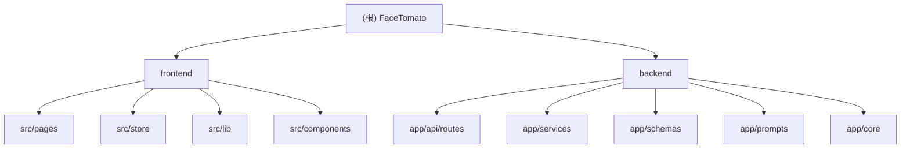

## facetomato

> |------|------|------|

# FaceTomato

## 变更记录 (Changelog)

| 时间 | 操作 | 说明 |
|------|------|------|
| 2026-03-28 | 增量扫描 | 同步首页语义调整：前端 `/` 改为面经题库首页，导航首项调整为题库，`/resume` 保留为简历解析入口 |
| 2026-03-23 | 增量扫描 | 前端本地持久化执行 cutoff：仅保留 `face-tomato-*` canonical key，移除旧品牌 key 自动迁移与 mock interview snapshot 版本兼容说明 |
| 2026-03-20 | 增量扫描 | 更新 backend 安装方式：RAG 依赖改为 `rag` 可选依赖，并补充 mock interview 在未安装 RAG 依赖时的自动回退说明、索引脚本前置条件与文档引用修正 |
| 2026-03-18 | 增量扫描 | 同步根目录 / frontend / backend 文档到当前实现：补充 runtime settings、语音转写、mock interview 本地恢复与 developer trace、RAG/non-RAG fallback、测试清单与路由面 |
| 2026-03-13 09:34:09 | 增量扫描 | 补充 mock interview、Vitest 测试、SSE/RAG/匿名会话恢复文档，覆盖率约 90.1% |
| 2026-03-04 16:22:25 | 初始化 | 首次生成项目文档，覆盖率约 85% |

---

## 项目愿景

FaceTomato（面柿）是一款面向求职场景的职业发展助手，围绕简历解析、JD 匹配分析、面经检索和模拟面试四条主链路，帮助用户从“准备材料”走到“实战演练”。

## 架构总览

- 前端：React 18 + TypeScript + Vite + TailwindCSS + Zustand + Vitest
- 后端：FastAPI + LangChain + 多 LLM 供应商支持 + SSE / WebSocket
- 数据存储：`sessionStorage` / `localStorage`、SQLite、ZVEC 本地检索索引
- 部署形态：前后端分离，Vite 开发服务器代理到 FastAPI

### 关键业务链路

1. 简历解析链路
   - 前端上传 PDF / DOC / DOCX / 图片 / 文本简历
   - 后端通过文档解析 + OCR（可选）+ LLM 抽取结构化 `ResumeData`
   - 支持请求级 runtime 配置覆盖默认模型/OCR 配置

2. JD 优化链路
   - 前端提交 JD 文本并先调用 `/api/jd/extract` 抽取结构化 `JDData`
   - 后端生成概览、建议与 JD-Resume 匹配结果（`/api/resume/jd/*`）
   - 支持请求级 runtime 配置覆盖

3. 面经题库链路
   - 后端基于 SQLite 提供分页、筛选、统计、公司聚合与邻近导航
   - mock interview 在创建阶段可引用题库检索证据

4. 模拟面试链路（当前实现）
   - 会话创建：`POST /api/mock-interview/session/stream-create`（SSE）
   - 对话续流：`POST /api/mock-interview/session/{sessionId}/stream`（SSE）
   - 前端通过 `localStorage` 当前快照结构恢复，后端按请求体重建临时会话态（ephemeral）
   - 支持 developer context / developer trace 事件（retrieval、plan_generation、reflection、interviewer_generation）
   - 当 `MOCK_INTERVIEW_RAG=false`、未安装 `rag` 可选依赖，或 RAG 运行时依赖不可用时，自动退化到 non-RAG 检索策略

5. 语音输入链路
   - 前端先调用 `/api/speech/status` 检查可用性
   - 前端通过 `WS /api/speech/transcribe` 上传 PCM 音频并接收 partial/final 识别结果
   - 支持 runtime speech key 覆盖默认后端配置

## 模块结构图



## 模块索引

> 当前前端首页语义：`/` 进入面经题库，`/resume` 为简历解析独立入口。

| 模块 | 路径 | 语言 | 职责 |
|------|------|------|------|
| frontend | `frontend/` | TypeScript / React | 用户界面层，负责简历上传预览、JD 优化交互、面经题库浏览、模拟面试会话（本地恢复/导出）与语音输入 |
| backend | `backend/` | Python / FastAPI | API 与服务层，负责 OCR/LLM 抽取、JD 匹配、题库查询、RAG 检索、mock interview SSE 与语音转写 |

## 运行与开发

### 前端

```bash
cd frontend
npm install
npm run dev
npm run build
npm run test:run
```

- 开发端口：`5569`
- 代理目标：`http://127.0.0.1:6522`

### 后端

```bash
cd backend
uv sync
cp .env.example .env
uv run uvicorn app.main:app --reload --host 0.0.0.0 --port 6522
```

默认安装不会拉取本地 RAG 大依赖；如果你要启用 mock interview RAG 或执行索引脚本，请先执行：

```bash
cd backend
uv sync --extra rag
```

可选脚本：

```bash
cd backend
uv run python scripts/migrate_db.py --source-dir <path-to-interview-json-root>
uv run python scripts/build_interview_zvec_index.py --help
```

### 环境变量

后端主要配置位于 `backend/.env`，可从 `backend/.env.example` 复制。重点变量：

- 应用与上传
  - `APP_HOST`、`APP_PORT`、`CORS_ORIGINS`、`MAX_UPLOAD_MB`

- LLM 供应商与模型
  - `MODEL_PROVIDER`
  - `OPENAI_API_KEY`、`OPENAI_BASE_URL`、`OPENAI_MODEL`
  - `GOOGLE_API_KEY`、`GOOGLE_MODEL`
  - `ANTHROPIC_API_KEY`、`ANTHROPIC_MODEL`

- OCR
  - `ZHIPU_APIKEY`

- 语音
  - `VOLCENGINE_SPEECH_BASE_URL`、`VOLCENGINE_SPEECH_MODE`
  - `VOLCENGINE_SPEECH_APP_KEY`、`VOLCENGINE_SPEECH_ACCESS_KEY`
  - `VOLCENGINE_SPEECH_RESOURCE_ID`

- 模拟面试
  - `MOCK_INTERVIEW_RAG`
  - `MOCK_INTERVIEW_SESSION_TTL_MINUTES`
  - `MOCK_INTERVIEW_PLAN_TIMEOUT_SECONDS`

- 题库与检索
  - `INTERVIEW_DB_PATH`、`INTERVIEW_ZVEC_INDEX_PATH`
  - `INTERVIEW_RAG_TOPK`、`INTERVIEW_RAG_CANDIDATE_TOPK`
  - `INTERVIEW_RAG_DENSE_WEIGHT`、`INTERVIEW_RAG_SPARSE_WEIGHT`
  - `INTERVIEW_DENSE_EMBEDDING_*`、`INTERVIEW_SPARSE_EMBEDDING_*`

> 说明：前端 runtime settings（LLM/OCR/Speech）通过请求参数传入后端，再由 `runtime_config` 服务与上述 env 默认值逐字段合并。

## 测试策略

### 前端（Vitest + Testing Library）

- 页面测试
  - `frontend/src/pages/__tests__/DiagnosisPage.test.tsx`
  - `frontend/src/pages/__tests__/MockInterviewPage.test.tsx`

- 应用壳层/运行时设置
  - `frontend/src/test/App.test.tsx`

- Resume 组件
  - `frontend/src/components/resume/__tests__/ResumeParsingState.test.tsx`
  - `frontend/src/components/resume/__tests__/ResumeExtractPanel.test.tsx`

- Optimization 组件
  - `frontend/src/components/optimization/__tests__/AnalysisPhase.test.tsx`
  - `frontend/src/components/optimization/__tests__/ResumeDisplayPanel.test.tsx`
  - `frontend/src/components/optimization/__tests__/SuggestionCard.test.tsx`

- Store / Lib
  - `frontend/src/store/__tests__/resumeStore.test.ts`
  - `frontend/src/store/__tests__/runtimeSettingsStore.test.ts`
  - `frontend/src/lib/__tests__/api.test.ts`

### 后端（pytest）

- 简历解析与路由
  - `backend/tests/test_pdf_parser.py`
  - `backend/tests/test_resume_routes.py`

- 优化与匹配
  - `backend/tests/test_resume_optimization_routes.py`
  - `backend/tests/test_resume_optimizer.py`
  - `backend/tests/test_jd_optimization_routes.py`
  - `backend/tests/test_jd_resume_matcher.py`

- 题库与检索
  - `backend/tests/test_interviews.py`
  - `backend/tests/test_interview_rag_service.py`
  - `backend/tests/test_interview_embedding_service.py`
  - `backend/tests/test_embedding_config.py`
  - `backend/tests/test_build_interview_zvec_index_script.py`

- 模拟面试
  - `backend/tests/test_mock_interview_routes.py`
  - `backend/tests/test_mock_interview_service.py`
  - `backend/tests/test_mock_interview_schemas.py`
  - `backend/tests/test_mock_interview_prompts.py`

- 通用 schema 规范化
  - `backend/tests/test_schema_normalization.py`

### 运行时接口自检

- Swagger：`/docs`
- 健康检查：`/health`
- Mock interview SSE：`/api/mock-interview/session/*`
- Speech：`/api/speech/status`、`/api/speech/transcribe`

## 编码规范

### 前端

- TypeScript 严格模式开启，路径别名使用 `@/`
- 页面状态与跨页恢复主要依赖 Zustand persist
- 前端持久化仅保留 canonical `face-tomato-*` key，不再兼容 `face-tamato-*` / `career-copilot-*` 历史 key
- 动画使用 Framer Motion，样式使用 TailwindCSS
- 模拟面试恢复以本地快照为主，后端按请求重建流式上下文；当前仅接受单一快照结构，不再包含 `snapshotVersion` 与升级逻辑

### 后端

- Pydantic / pydantic-settings 管理输入输出与配置
- FastAPI 路由按能力拆分到 `app/api/routes/`
- 服务层区分抽取、优化、题库、检索、模拟面试与语音转写
- 对结构化输出使用 `app/utils/structured_output.py` 做兜底解析

## AI 使用指引

### 修改简历解析逻辑

1. 路由入口：`backend/app/api/routes/resume.py`
2. 抽取服务：`backend/app/services/resume_extractor.py`
3. Prompt：`backend/app/prompts/resume_prompts.py`
4. 前端上传与结果编辑：`frontend/src/pages/ResumePage.tsx`

### 修改 JD 匹配与优化逻辑

1. JD 抽取路由：`backend/app/api/routes/jd.py`
2. JD 优化路由：`backend/app/api/routes/jd_optimization.py`
3. 匹配服务：`backend/app/services/jd_resume_matcher.py`
4. Prompt：`backend/app/prompts/jd_optimization_prompts.py`
5. 前端分析状态：`frontend/src/store/optimizationStore.ts`

### 修改模拟面试逻辑

1. 前端页面：`frontend/src/pages/MockInterviewPage.tsx`
2. 前端流式 API：`frontend/src/lib/mockInterviewApi.ts`
3. 前端恢复逻辑：`frontend/src/lib/mockInterviewRecovery.ts`
4. 前端 transcript 导出：`frontend/src/lib/mockInterviewDeveloperReport.ts`
5. 后端路由：`backend/app/api/routes/mock_interview.py`
6. 后端服务：`backend/app/services/mock_interview_service.py`
7. 面试计划 / 面试官 Prompt：`backend/app/prompts/mock_interview_prompts.py`

### 修改语音输入逻辑

1. 前端语音 hook：`frontend/src/store/useSpeechInput.ts`
2. 前端可用性探测：`frontend/src/lib/api.ts` (`getSpeechStatus`)
3. 后端路由：`backend/app/api/routes/speech.py`
4. 后端服务装配：`backend/app/services/speech_transcription_service.py`
5. Volcengine 协议实现：`backend/app/services/volcengine_speech_transcription_service.py`

### 修改题库与检索逻辑

1. 题库路由：`backend/app/api/routes/interviews.py`
2. SQLite 查询服务：`backend/app/services/interview_service.py`
3. Embedding 适配：`backend/app/services/interview_embedding_service.py`
4. ZVEC 检索编排：`backend/app/services/interview_rag_service.py`
5. 前端题库页：`frontend/src/pages/QuestionBankPage.tsx`

### 调试建议

- 前端代理和测试配置见 `frontend/vite.config.ts`
- 后端主入口与路由装配见 `backend/app/main.py`
- 若模拟面试恢复异常，优先检查：
  - 浏览器 `localStorage`：`face-tomato-mock-interview-recoverable-sessions`
  - 快照是否满足当前结构必需字段，以及 `expiresAt`
  - SSE 事件序列是否完整：
    - 创建：`progress -> developer_trace -> session_created -> done`
    - 对话：`message_start -> message_delta -> message_end -> done`
- 若语音不可用，优先检查：
  - `/api/speech/status` 返回值
  - runtime speech keys 与后端 `VOLCENGINE_SPEECH_*` 默认值
  - WS `ready/partial/final/error` 事件是否正常

---
> Source: [Infinityay/FaceTomato](https://github.com/Infinityay/FaceTomato) — distributed by [TomeVault](https://tomevault.io).
<!-- tomevault:4.0:gemini_md:2026-04-20 -->
