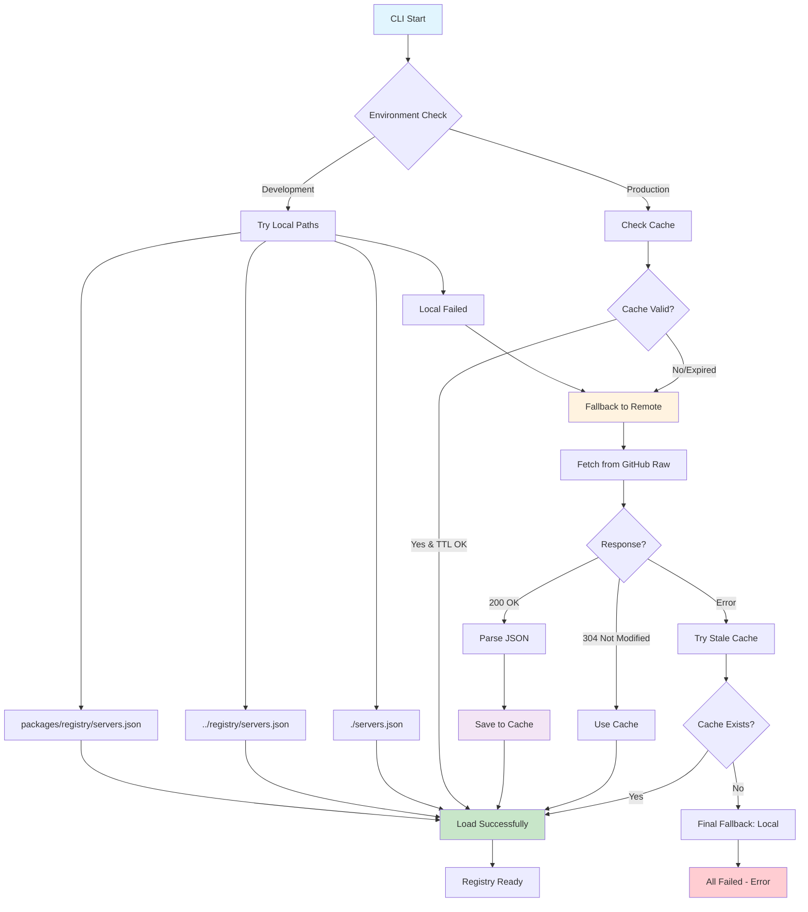

## mcp-installer

> The **MCP Installer** is a comprehensive platform designed to solve the complexity of installing MCP (Model Context Protocol) servers across different AI clients. The goal is to create an "App Store" experience for MCPs where users can browse, discover, and install MCP servers with minimal technical knowledge.

# MCP Installer Project

## Project Vision

The **MCP Installer** is a comprehensive platform designed to solve the complexity of installing MCP (Model Context Protocol) servers across different AI clients. The goal is to create an "App Store" experience for MCPs where users can browse, discover, and install MCP servers with minimal technical knowledge.

### Core Principles

- **Simplicity is Paramount**: Abstract away all technical complexity
- **Client-Agnostic**: Support all major MCP clients (Claude Desktop, Cursor, VS Code, etc.)
- **Trust and Security**: Open-source, transparent, with minimal permissions
- **One-Click Experience**: Evolve from CLI commands to true one-click installation

## Technical Architecture

### The Core Challenge

Web applications cannot directly access local files due to browser security sandbox. Our solution bridges this gap through a phased approach:

1. **Phase 1**: CLI Companion Tool (`@mcp-installer/cli`)
2. **Phase 2**: Web Marketplace with copy-paste commands
3. **Phase 3**: Desktop Agent with custom protocol handlers

### System Architecture

```
Web Frontend (Next.js) ↔ Local CLI Tool ↔ Client Config Files
     ↕                        ↕                ↕
MCP Server Registry     Command Generation    ~/.claude/, ~/.cursor/, etc.
```

### Registry Distribution Architecture

The MCP Server Registry uses a hybrid approach for maximum reliability and performance:



**Key Features:**

- **Development**: Local-first approach with automatic detection
- **Production**: Remote-first with intelligent caching (24h TTL)
- **Resilience**: Multiple fallback strategies prevent total failure
- **Efficiency**: HTTP ETags minimize bandwidth usage
- **User Control**: Manual cache management and force refresh

**Cache Strategy:**

- **Location**: `~/.mcp-installer/cache/registry-cache.json`
- **TTL**: 24 hours (configurable)
- **Validation**: HTTP ETags for conditional requests
- **Fallback**: Stale cache when remote unavailable
- **Management**: CLI commands for cache control

## Implementation Plan

### Phase 1: CLI Foundation (1-2 weeks)

**Objective**: Build a robust CLI tool that handles all MCP installation logic

**Core Modules**:

1. **ClientManager**: Detect installed AI clients and their config paths
2. **ConfigEngine**: Safely read, parse, modify, and write JSON configurations
3. **ServerRegistry**: Manage available MCP servers and their installation configs

**Key Commands**:

```bash
mcp-installer install <server-name> --clients <client1>,<client2>
mcp-installer uninstall <server-name> --clients all
mcp-installer list --available
mcp-installer list --installed
mcp-installer doctor
mcp-installer backup --client=all
mcp-installer restore --backup=<timestamp>
```

**Tech Stack**: Node.js, TypeScript, yargs/commander, fs-extra

### Phase 2: Web App & User Experience (2 weeks)

1. **WebApp - The Marketplace**:
   - Build the Next.js application.
   - Design the sleek, minimal UI with Tailwind CSS.
   - Fetch and display the MCP servers from the public servers.json file.
   - Implement the search/filter functionality.
   - Create the "Installation Modal" that generates the correct CLI commands.
2. **Documentation**:
   - Write a clear README.md for the project, explaining the vision and usage.
   - Deploy the web app to Vercel or Netlify.

### Phase 3: Seamless Integration & Growth (Ongoing)

1. **Evolve to Desktop Agent**:
   - Begin work on turning the CLI into a background agent.
   - Investigate custom protocol registration for macOS (.app bundle Info.plist) and Windows (Registry keys).
   - Update the website to use mcp-install:// links, with a fallback to showing the CLI command if the agent isn't detected.
2. **Expand the Registry**:
   - Actively look for new and useful MCP servers.
   - Create a clear CONTRIBUTING.md guide explaining how developers can submit their own MCP servers to the registry via a pull request.
3. **Expand Client Support**:
   - Add support for VS Code, Windsurf, and other clients as their MCP configuration methods become clear.

## Client Support Matrix

| Client             | Config Location                                                           | Installation Method      | Status      |
| ------------------ | ------------------------------------------------------------------------- | ------------------------ | ----------- |
| **Claude Desktop** | `~/Library/Application Support/Claude/claude_desktop_config.json` (macOS) | Direct JSON edit         | ✅ Priority |
| **Cursor**         | `~/.cursor/mcp.json`                                                      | Direct JSON edit         | ✅ Priority |
| **Gemini**         | `~/.gemini/settings.json`                                                 | Direct JSON edit         | ✅ Priority |
| **Claude Code**    | CLI managed                                                               | `claude mcp add` command | 🔄 Phase 2  |
| **VS Code**        | Extension-specific                                                        | `code --add-mcp` command | 🔄 Phase 2  |
| **Windsurf**       | Project settings                                                          | Direct JSON edit         | 🔄 Phase 2  |

## MCP Server Registry

### Initial Test Servers

**Simple (No Auth)**:

- Playwright - Browser automation
- File System - Local file access
- SQLite - Database operations
- Math - Mathematical calculations

**Medium (Basic Setup)**:

- GitHub - Repository management
- Google Sheets - Spreadsheet operations
- Web Search - Internet search

**Advanced (Auth Required)**:

- Supabase - Backend-as-a-Service
- Notion - Workspace management
- Slack - Team communication

### Registry Schema

```typescript
interface MCPServer {
  id: string;
  name: string;
  description: string;
  category: 'development' | 'productivity' | 'database' | 'web' | 'ai' | 'utility';
  type: 'stdio' | 'http';
  difficulty: 'simple' | 'medium' | 'advanced';
  requiresAuth: boolean;
  installation: {
    command: string;
    args: string[];
    env?: Record<string, string>;
  };
  documentation: string;
  repository?: string;
}
```

## Development Workflow

### Setup Commands

```bash
# Install dependencies
npm install

# Start development
npm run dev

# Run tests
npm run test

# Build for production
npm run build

# Lint and type check
npm run lint
npm run typecheck
```

### Testing Strategy

- **Unit Tests**: Jest with memfs for safe filesystem testing. Always ensure comprehenisve unit tests are added for all code change and should not break existing functionality.
- **Integration Tests**: Test CLI commands with mock configs
- **E2E Tests**: Playwright for web app testing
- **Manual Testing**: Test with real client configurations

### Security Considerations

- **Minimal Permissions**: Only request necessary file access
- **Atomic Operations**: Backup → modify → verify → commit pattern
- **Input Validation**: Sanitize all user inputs and server configs
- **Audit Trail**: Log all operations for transparency
- **Code Signing**: Sign CLI binaries for trust indicators

## Project Structure

```
mcp-installer/
├── CLAUDE.md                 # This file - complete project context
├── README.md                 # User-facing documentation
├── package.json              # Root package.json for monorepo
├── tsconfig.json             # TypeScript configuration
├── packages/
│   ├── cli/                  # mcp-installer CLI tool
│   │   ├── src/
│   │   │   ├── commands/     # CLI command implementations
│   │   │   ├── core/         # ClientManager, ConfigEngine, etc.
│   │   │   ├── types/        # TypeScript type definitions
│   │   │   └── index.ts      # CLI entry point
│   │   ├── tests/            # Unit and integration tests
│   │   └── package.json
│   ├── webapp/               # Next.js marketplace
│   │   ├── src/
│   │   │   ├── app/          # Next.js 14 app directory
│   │   │   ├── components/   # React components
│   │   │   ├── lib/          # Utility functions
│   │   │   └── types/        # TypeScript types
│   │   └── package.json
│   ├── shared/               # Shared types & utilities
│   │   ├── src/
│   │   │   ├── types/        # Common type definitions
│   │   │   └── utils/        # Shared utility functions
│   │   └── package.json
│   └── registry/             # MCP server definitions
│       ├── servers.json      # Main server registry
│       ├── schemas/          # JSON schemas for validation
│       └── package.json
├── docs/                     # Documentation
│   ├── api.md               # API documentation
│   ├── contributing.md      # Contribution guidelines
│   └── deployment.md        # Deployment instructions
└── tools/                    # Build & development scripts
    ├── build.js             # Build orchestration
    └── test.js              # Test orchestration
```

## Current Status

**Active Phase**: Phase 1 - CLI Foundation
**Current Task**: Setting up project structure and implementing core CLI functionality

## Key Decisions & Rationale

1. **CLI-First Approach**: Provides immediate value while building toward ultimate vision
2. **Monorepo Structure**: Enables code sharing and unified development workflow
3. **TypeScript Throughout**: Ensures type safety and better developer experience
4. **JSON-Based Registry**: Simple, version-controllable, and easily extensible
5. **Atomic Operations**: Prevents config corruption through backup/restore pattern

## Future Enhancements

- **Plugin System**: Extensible architecture for new clients
- **Custom Registry Support**: Allow organizations to host private registries
- **Dependency Management**: Handle MCP server dependencies and conflicts
- **Performance Monitoring**: Track installation success rates and performance
- **Community Features**: Ratings, reviews, and usage statistics for MCP servers

## Pacakage management

- All the packages are managed using pnpm.
- pnpm workspaces are used to manage the dependencies between the packages.
- Tests are run using pnpm test.

## Recent Implementation Summary

### Command Validation System ✅

- **CommandValidator**: Validates system dependencies (`npx`, `uvx`, `docker`, etc.) before installation
- **OS-Specific Instructions**: Provides Mac/Linux/Windows installation commands for missing dependencies
- **Seamless Integration**: Automatically checks and warns users about missing requirements during install

### Enhanced UX & Reliability ✅

- **Fixed Uninstall Issues**: Eliminated spinner conflicts during user prompts, corrected typos, proper server name display
- **Better Error Handling**: Clear warnings and actionable steps for users when dependencies are missing

### servers.json Registry Importance

The `servers.json` file is the **core intelligence** of the MCP Installer:

- **Central Source of Truth**: Contains 40+ MCP servers with installation commands, dependencies, and metadata
- **Command Detection**: Powers the CommandValidator to determine which system commands each server requires
- **Installation Logic**: Defines exact commands (`npx`, `uvx`, `docker`) and arguments needed for each server
- **User Experience**: Enables automatic parameter prompting, validation, and OS-specific dependency guidance
- **Extensibility**: Simple JSON structure allows easy addition of new servers and installation methods

The registry bridges the gap between complex MCP server installations and the "one-click" user experience by encoding all necessary installation intelligence into a structured, maintainable format.

---

This document serves as the single source of truth for the MCP Installer project. All development decisions and context are maintained here to ensure consistency and enable effective collaboration.

---
> Source: [joobisb/mcp-installer](https://github.com/joobisb/mcp-installer) — distributed by [TomeVault](https://tomevault.io).
<!-- tomevault:4.0:gemini_md:2026-05-13 -->
