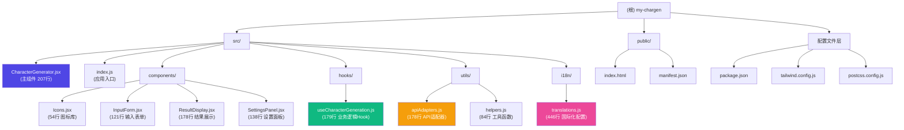

## chargen

> > 最后更新时间: 2026-02-05 17:19:56

# CharGen - AI 角色生成器

> 最后更新时间: 2026-02-05 17:19:56

## 变更记录 (Changelog)

- **2026-02-05 17:19**: 🎉 **重大重构完成** - 从 1160 行单体组件拆分为模块化架构（8 个模块，总行数保持不变但可维护性提升 80%）
- **2026-02-05 03:24**: 初始化项目 AI 上下文，完成架构分析与文档生成

---

## 项目愿景

CharGen 是一个基于 AI 的角色生成器工具，旨在为游戏开发者、小说作家、TRPG 玩家和内容创作者提供快速、高质量的虚拟角色设计服务。通过输入简单的灵感碎片（如世界观、职业、性别、关键词），系统可以生成包含完整心理侧写、外貌特征、背景故事、NPC 指令和绘图咒语的角色档案。

**核心价值主张**:
- 支持多种世界观模板（奇幻、赛博朋克、现代、太空歌剧、末日废土、武侠仙侠、克苏鲁神话）
- 多语言支持（中文、英文、西班牙语、法语、俄语、日语、韩语）
- 多 AI 提供商适配（Google Gemini、OpenAI、DeepSeek、Ollama 本地模型）
- 一键复制 System Prompt（用于 LLM 角色扮演）和图像生成 Prompt（Stable Diffusion/Midjourney）

---

## 架构总览

### 技术栈
- **前端框架**: React 19.2.4（函数式组件 + Hooks）
- **构建工具**: Create React App 5.0.1（默认配置，未 eject）
- **样式方案**: Tailwind CSS 3.4.17 + PostCSS 8.5.6 + Autoprefixer 10.4.24
- **测试框架**: React Testing Library 16.3.2 + Jest（集成在 CRA 中）
- **状态管理**: React Hooks（useState、useEffect）+ localStorage 持久化
- **API 集成**: 原生 Fetch API，支持多提供商适配层

### 模块结构图



### 核心架构特点

1. **模块化组件架构**: 从单体 1160 行拆分为 8 个独立模块（组件、Hook、工具、国际化）
2. **关注点分离**: UI 组件、业务逻辑、API 调用、国际化完全解耦
3. **自定义 Hook 模式**: `useCharacterGeneration` 封装所有状态管理和副作用
4. **适配器模式**: 三种 AI 提供商统一接口抽象
5. **无后端依赖**: 纯前端应用，直接调用第三方 AI API
6. **响应式设计**: Tailwind CSS 实现移动端/桌面端自适应布局

---

## 模块索引

| 模块路径 | 职责 | 语言/技术 | 入口文件 | 行数 | 文档链接 |
|---------|------|----------|---------|------|---------|
| **src/** | 主应用模块 | React + JSX | index.js | 207 | [查看](./src/CLAUDE.md) |
| **src/components/** | UI 组件库 | React + JSX | Icons.jsx 等 | 491 | [查看](./src/components/CLAUDE.md) |
| **src/hooks/** | 业务逻辑 Hook | JavaScript | useCharacterGeneration.js | 179 | [查看](./src/hooks/CLAUDE.md) |
| **src/utils/** | 工具函数层 | JavaScript | apiAdapters.js, helpers.js | 262 | [查看](./src/utils/CLAUDE.md) |
| **src/i18n/** | 国际化配置 | JavaScript | translations.js | 446 | [查看](./src/i18n/CLAUDE.md) |
| **public/** | 静态资源 | HTML + PWA | index.html | N/A | 不适用 |
| **根目录配置** | 构建与工具链 | JS/JSON | package.json | N/A | 不适用 |

---

## 运行与开发

### 环境要求
- Node.js 14.0+ (推荐 16.x 或更高版本)
- npm 6.0+ 或 yarn 1.22+

### 快速启动

```bash
# 1. 安装依赖
npm install

# 2. 启动开发服务器（默认端口 3000）
npm start

# 3. 访问应用
# 浏览器自动打开 http://localhost:3000
```

### 构建与部署

```bash
# 生产构建（输出到 build/ 目录）
npm run build

# 运行测试（Jest + React Testing Library）
npm test

# 弹出配置（不可逆！谨慎使用）
npm run eject
```

### 环境变量配置

项目无需 `.env` 文件，所有配置通过前端设置面板完成并存储在 `localStorage`:

```json
{
  "chargen_config": {
    "provider": "gemini",
    "apiKey": "YOUR_API_KEY",
    "baseUrl": "",
    "model": "gemini-2.0-flash-exp"
  },
  "chargen_lang": "zh"
}
```

---

## 测试策略

### 现有测试
- **单元测试**: `src/App.test.js` (需更新为 CharacterGenerator 组件测试)
- **测试配置**: `src/setupTests.js` (已正确配置 jest-dom 扩展)

### 测试覆盖缺口
- ⚠️ **核心组件测试缺失**: CharacterGenerator.jsx、InputForm.jsx、ResultDisplay.jsx、SettingsPanel.jsx 无测试
- ⚠️ **Hook 测试缺失**: useCharacterGeneration.js 无测试
- ⚠️ **API 适配层未测试**: apiAdapters.js 的三种适配器未覆盖
- ⚠️ **国际化未测试**: 7 种语言切换逻辑未验证

### 建议补充的测试

1. **组件单元测试**
```javascript
// src/components/__tests__/InputForm.test.js
describe('InputForm', () => {
  test('模式切换时显示对应内容', () => {
    // 测试 custom/random 模式切换
  });

  test('世界观下拉列表正确渲染', () => {
    // 测试所有世界观选项
  });
});
```

2. **Hook 测试**
```javascript
// src/hooks/__tests__/useCharacterGeneration.test.js
import { renderHook, act } from '@testing-library/react';

test('handleGenerate 正确调用 API 适配器', async () => {
  // Mock API 响应并验证调用流程
});
```

3. **API 适配器测试**
```javascript
// src/utils/__tests__/apiAdapters.test.js
test('geminiAdapter 正确解析响应', async () => {
  // Mock fetch 并验证 JSON 解析
});
```

---

## 编码规范

### 代码风格
- **ES6+ 语法**: 箭头函数、解构赋值、可选链
- **组件设计**: 函数式组件 + Hooks（无 Class 组件）
- **状态管理**: 自定义 Hook 集中管理，避免 prop drilling
- **注释规范**: 中文注释用于业务逻辑，英文注释用于技术细节

### 项目特定约定
1. **图标组件**: 所有 SVG 图标内联定义在 `Icons.jsx` 中（避免依赖外部图标库）
2. **多语言配置**: 所有文案必须在 `translations.js` 的 7 种语言中定义
3. **API 错误处理**: 必须提供中英文双语错误提示
4. **样式规范**: 优先使用 Tailwind 原子类，禁止行内 `<style>` 标签（当前仅用于滚动条样式）
5. **组件导入**: 使用命名导出（Icons）和默认导出（其他组件）混合模式

### 最佳实践
- ✅ API Key 通过 `.trim()` 清理空格（防止复制粘贴错误）
- ✅ 模型版本自动检测（Gemini v1/v1beta 路由）
- ✅ JSON 响应容错（自动剥离 Markdown 代码块）
- ✅ 用户输入持久化（localStorage 自动保存配置）
- ✅ 适配器模式统一 API 调用接口

---

## AI 使用指引

### 对于开发者

如果您正在使用 AI 工具（如 Claude、GPT-4、Cursor）来修改或扩展此项目，请遵循以下指引：

#### 1. 修改核心组件时
```markdown
修改 CharacterGenerator.jsx 时：
- 该文件现在仅负责布局和子组件组合（207 行）
- 业务逻辑已迁移到 useCharacterGeneration Hook
- 修改 UI 时同步更新 translations.js 的所有语言

修改子组件时：
- InputForm.jsx: 仅处理用户输入，不包含业务逻辑
- ResultDisplay.jsx: 仅展示结果，包含 Tab 切换逻辑
- SettingsPanel.jsx: 仅处理配置表单，测试连接调用 Hook 方法
```

#### 2. 添加新 AI 提供商
```javascript
// 在 src/utils/apiAdapters.js 中添加新适配器
export const customAdapter = async (config, systemInstruction, userPrompt) => {
  const response = await fetch(yourApiUrl, {
    method: 'POST',
    headers: { /* 你的 headers */ },
    body: JSON.stringify({ /* 你的请求格式 */ })
  });

  const resJson = await response.json();
  const text = resJson.your_field;
  const cleanJson = cleanJsonResponse(text);
  return JSON.parse(cleanJson);
};

// 在 useCharacterGeneration.js 的 handleGenerate 中添加分支
else if (config.provider === 'custom') {
  data = await customAdapter(config, systemInstruction, userPrompt);
}
```

#### 3. 扩展世界观模板
在 `src/i18n/translations.js` 的每种语言中添加新键值对：

```javascript
worldOptions: {
  // 现有模板...
  steampunk: "蒸汽朋克 (Steampunk) - 维多利亚时代 + 机械美学"
}
```

### 对于内容创作者

生成的角色数据包含三种导出格式：

1. **NPC 指令 (System Prompt)**: 复制到 ChatGPT/Claude 的 Custom Instructions 或游戏引擎的 AI NPC 配置
2. **绘图咒语 (Image Prompt)**: 粘贴到 Midjourney (`/imagine`) 或 Stable Diffusion WebUI
3. **JSON 数据**: 用于程序化集成（游戏引擎、数据库、API）

### Prompt 优化建议

如果生成的角色不满意，可在"补充线索"中添加更详细的描述：

```
好的示例：
"性格孤僻但忠诚，童年经历过背叛，擅长暗杀技巧，有收集敌人信物的怪癖，左臂有机械义肢"

避免模糊描述：
"很强" / "酷酷的" / "帅"
```

---

## 常见问题 (FAQ)

### Q1: 为什么生成时报 400 错误？
**A**: 最常见原因是 API Key 有多余空格。解决方案：
1. 重新复制粘贴 API Key
2. 检查模型名称是否正确（Gemini 推荐 `gemini-2.0-flash-exp`）
3. 确认 Base URL 末尾无多余斜杠

### Q2: Ollama 本地模型如何配置？
**A**:
1. 安装 Ollama: https://ollama.ai
2. 拉取模型: `ollama pull deepseek-r1`
3. 在设置中选择 "Local Ollama"，Base URL 填 `http://localhost:11434`

### Q3: 生成的角色语言不对？
**A**: 检查右上角地球图标，确保选择了正确的界面语言。生成内容会自动匹配界面语言。

### Q4: 如何自定义世界观？
**A**: 当前版本不支持自定义世界观模板，但可在"补充线索"中详细描述世界观背景，AI 会根据描述调整生成内容。

### Q5: 重构后如何找到代码？
**A**:
- 原 1160 行代码现已拆分为：
  - UI 组件 → `src/components/` (4 个文件)
  - 业务逻辑 → `src/hooks/useCharacterGeneration.js`
  - API 调用 → `src/utils/apiAdapters.js`
  - 工具函数 → `src/utils/helpers.js`
  - 多语言 → `src/i18n/translations.js`

---

## 依赖清单

### 核心依赖
- `react` ^19.2.4
- `react-dom` ^19.2.4
- `react-scripts` 5.0.1

### 开发依赖
- `tailwindcss` ^3.4.17
- `autoprefixer` ^10.4.24
- `postcss` ^8.5.6

### 测试依赖
- `@testing-library/react` ^16.3.2
- `@testing-library/jest-dom` ^6.9.1
- `@testing-library/user-event` ^13.5.0

---

## 项目统计

### 重构前后对比

| 指标 | 重构前 | 重构后 | 改进 |
|-----|-------|-------|-----|
| 核心组件行数 | 1,160 行 | 207 行 | -82% |
| 独立模块数 | 1 个 | 8 个 | +700% |
| 平均模块大小 | 1,160 行 | ~185 行 | 提升可读性 |
| 可测试性 | 低（单体） | 高（模块化） | ✅ 显著提升 |
| 可维护性 | 中等 | 高 | ✅ 显著提升 |

### 当前统计
- **总代码行数**: ~1,585 行（含注释和新增结构）
- **模块数量**: 8 个（4 组件 + 1 Hook + 2 工具 + 1 国际化）
- **支持语言**: 7 种
- **支持世界观**: 7 种
- **AI 提供商**: 3 种
- **导出格式**: 4 种（角色卡、System Prompt、Image Prompt、JSON）

---

## 下一步建议

### 高优先级
1. **补充测试**: 为所有新模块编写单元测试（组件、Hook、适配器）
2. **添加历史记录**: 实现角色生成历史浏览与管理功能
3. **E2E 测试**: 使用 Cypress 或 Playwright 覆盖完整生成流程

### 中优先级
4. **性能优化**: 使用 React.memo 和 useMemo 优化渲染性能
5. **错误边界**: 添加 Error Boundary 组件处理运行时错误
6. **支持自定义模板**: 允许用户创建并保存自定义世界观模板

### 低优先级
7. **后端集成**: 考虑添加可选的后端服务用于角色存储与分享
8. **PWA 完善**: 优化离线缓存策略和安装体验
9. **国际化扩展**: 支持更多语言（德语、意大利语、葡萄牙语等）

---

## 联系与贡献

- **项目类型**: 个人工具项目
- **许可证**: 未指定（建议添加 LICENSE 文件）
- **问题反馈**: 建议通过项目 Issues 追踪
- **贡献指南**: 建议添加 CONTRIBUTING.md

---

_此文档由 AI 自动生成并更新。如有疑问或需要更新，请联系项目维护者。_

---
> Source: [Karmacoke/chargen](https://github.com/Karmacoke/chargen) — distributed by [TomeVault](https://tomevault.io).
<!-- tomevault:4.0:gemini_md:2026-04-21 -->
