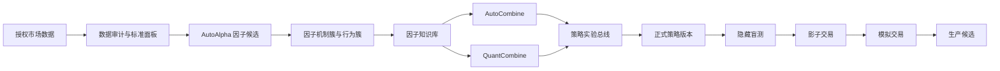

## llm-quant-factory

> 本文件是仓库级开发入口，面向接手本项目的编码智能体、维护者和二次开发者。目标是让新参与者在不破坏研究证据、数据时点或策略治理边界的前提下，快速定位代码、运行服务、实施改动并完成验证。

# AutoAlpha 二次开发与智能体接手指南

本文件是仓库级开发入口，面向接手本项目的编码智能体、维护者和二次开发者。目标是让新参与者在不破坏研究证据、数据时点或策略治理边界的前提下，快速定位代码、运行服务、实施改动并完成验证。

适用范围为整个仓库。若未来某个子目录增加更近层级的 `AGENTS.md`，子目录文件只补充该模块的局部约束。用户的明确要求、许可证、安全策略和版本化研究协议始终优先。

## 1. 一分钟认识项目

AutoAlpha 不是单一的“LLM 生成公式”脚本，而是一套由三个服务共享证据和运行状态的 A 股截面研究平台：

| 组件 | 默认端口 | 责任 | 决策方式 |
|---|---:|---|---|
| AutoAlpha | `8788` | 数据中心、自动因子研究、因子知识库、选股、回测、策略库、模拟交易、作业中心 | 确定性治理 + 受约束 LLM 建议 |
| AutoCombine | `8888` | 在冻结因子范围内探索因子组合与权重 | LLM 辅助搜索 + 确定性门禁 |
| QuantCombine | `8889` | SFFS、NSGA-II、贝叶斯和自适应采样等组合优化 | 非 LLM 的确定性/随机优化 |

三个服务默认共享：

- `AUTOALPHA_RUNTIME` 指向的运行目录；
- 同一个 `autoalpha.sqlite3`；
- 因子库、组合证据、策略实验对象和收藏状态；
- 同一套纯多主评价协议和策略生命周期。

核心链路是：



当前成熟度应按下面的事实理解：

| 能力 | 当前状态 | 不应宣称 |
|---|---|---|
| 因子生成、统一评价、知识库 | 本地可运行并有持久化证据 | 自动产生可实盘 Alpha |
| AutoCombine、QuantCombine | 可复用同一因子库并保存组合实验 | 搜索领先等于独立样本外通过 |
| 策略实验总线和策略库 | 已有统一谱系、版本和晋级状态机 | 已完成券商生产发布 |
| 手动回测、选股、模拟交易 | 可用于研究与纸面执行观察 | 已验证真实成交和资金托管 |
| SQLite | 当前完整本地运行后端 | 已具备多节点高并发能力 |
| PostgreSQL | 迁移工具和部分控制面适配可用 | 主 `ServiceStore` 已完成切换 |

## 2. 首要不变量

任何功能开发都必须保留以下边界。若需求与其中一项冲突，应先显式说明并修改版本化协议，不得在局部代码中静默绕过。

1. **纯多是主协议。** 排名、晋级、组合优化和页面默认指标使用 `long_only_*`；Rank IC、IC 和多空收益只用于诊断。
2. **信号时点不可穿越。** 当前默认是收盘后形成信号，最早在下一交易日开盘执行。滚动窗口必须只使用信号时点已知数据。
3. **隐藏区对研究者不可见。** LLM 只能得到有限分类反馈，不能获得精确隐藏测试指标，也不能根据隐藏结果继续调参。
4. **硬门禁不可平均掉。** 数据污染、未来函数、时点错误、执行不可行、盲测失败和证据缺失不能被高夏普抵消。
5. **公开 walk-forward 不是永久样本外。** 一旦被反复用于模型反馈，它就是自适应研究证据，不得描述为 untouched OOS。
6. **非 PIT 数据只能用于研究代理。** 缺失历史 ST、上市退市、停复牌、涨跌停、开盘可交易状态等字段时，生产晋级必须 fail closed。
7. **LLM 不拥有最终裁决权。** LLM 可以提出假设、表达式、证伪方案和组合建议，但不得修改门禁、审批生产、推断缺失市场状态或下实盘订单。
8. **手动实验不污染自动研究。** 手动回测、选股和截图不能写回隐藏证据或自动研究记忆，除非走显式、可审计的导入协议。
9. **证据必须可复现。** 数据指纹、协议版本、代码版本、随机种子、因子 ID、权重和成本口径必须随实验保留。
10. **当前没有实盘下单通道。** 策略库、影子交易和模拟交易不是券商生产执行证明。

权威定义位于：

- [评价宪章](AutoAlpha/evaluation.md)
- [机构级研究控制](AutoAlpha/docs/INSTITUTIONAL_RESEARCH_CONTROLS.md)
- [生产运行手册](AutoAlpha/docs/PRODUCTION_RUNBOOK.md)
- [数据就绪标准](AutoAlpha/docs/DATA_READINESS.md)

## 3. 接手后的前十分钟

先观察，再修改。不要假设工作树干净，也不要删除不认识的运行状态。

```bash
git status --short
git branch --show-current
git log -5 --oneline

uv sync --frozen --all-groups
(cd AutoAlpha && uv sync --frozen --all-groups)

uv run pytest -q
(cd AutoAlpha && uv run pytest -q)
```

启动服务：

```bash
cd AutoAlpha
./start-services.sh --no-resume
```

检查服务：

```bash
curl -fsS http://127.0.0.1:8788/health
curl -fsS http://127.0.0.1:8788/ready
curl -fsS http://127.0.0.1:8888/api/health
curl -fsS http://127.0.0.1:8889/api/health
```

停止服务：

```bash
cd AutoAlpha
./stop-services.sh
```

日志和 PID 位于：

```text
AutoAlpha/runtime-full-llm/logs/
AutoAlpha/runtime-full-llm/pids/
```

`--no-resume` 只启动服务，不恢复历史研究任务。只有显式提供 `AUTOALPHA_RESUME_TASK_ID` 或 `AUTOCOMBINE_RESUME_TASK_ID` 时才应恢复任务。

启动脚本继承当前 shell 的环境变量，但不会自动加载 `.env.example`。该文件只是配置契约模板。需要本地覆盖时，应在启动前显式导出：

```bash
REPO_ROOT="$(git rev-parse --show-toplevel)"
export AUTOALPHA_DATA_PATH="$REPO_ROOT/data"
export AUTOALPHA_RUNTIME="$REPO_ROOT/AutoAlpha/runtime-full-llm"
export AUTOALPHA_CONFIG="$REPO_ROOT/AutoAlpha/config/research.toml"
```

OpenAI-compatible 和 Tushare 凭证优先通过系统设置页写入 OS Keychain，也可以通过环境变量注入。任何非 loopback 部署都必须设置 `AUTOALPHA_SERVICE_TOKEN`，并在反向代理层配置 TLS 与访问控制。完整变量见
[`AutoAlpha/.env.example`](AutoAlpha/.env.example)。

## 4. 仓库地图

```text
.
├── src/multifactor_ashare/        数据审计与标准面板 CLI
├── tests/                         数据工程测试
├── data/                          本地数据工作区，永不提交
├── AutoAlpha/
│   ├── src/autoalpha/
│   │   ├── agents/                LLM 编排与角色治理
│   │   ├── backtest/              向量、现金账本、成本和时点
│   │   ├── data/                  数据契约、PIT、快照和研究字段
│   │   ├── dsl/                   因子表达式、语义校验和编译
│   │   ├── execution/             成交模拟、容量和 TCA
│   │   ├── governance/            审计链、盲测和发布控制
│   │   ├── operations/            工件、监控和幂等管线
│   │   ├── portfolio/             产品、优化和风险
│   │   ├── registry/              因子卡、指标和生命周期
│   │   ├── research/              统计、切分、门禁和多重检验
│   │   ├── security/              沙箱与安全守卫
│   │   └── service/               API、持久化、任务循环和静态页面
│   ├── config/research.toml        默认版本化研究协议
│   ├── docs/                       设计、运行和迁移文档
│   ├── tests/                      模块、服务、集成和对抗测试
│   ├── start-services.sh
│   └── stop-services.sh
├── examples/public_research_snapshot/
├── docs/assets/screenshots/
└── scripts/                        发布检查与公开样例导出
```

根包与 `AutoAlpha/` 是两个独立 Python 项目，分别有自己的 `pyproject.toml`、`uv.lock` 和虚拟环境。运行命令时先确认当前目录。

## 5. 服务与页面拓扑

### AutoAlpha 控制面

关键页面和后端入口：

| 页面 | 路由 | 静态实现 |
|---|---|---|
| 自动研究 | `/`、`/research/{task_id}` | `service/static/index.html`、`app.js` |
| 任务总表 | `/research-tasks` | `research_tasks.html/js/css` |
| 因子知识库 | `/factors` | `factors.html/js/css` |
| 手动回测 | `/backtest` | `backtest.html/js/css` |
| 选股器 | `/screener` | `screener.html/js/css` |
| 模拟交易 | `/paper-trading` | `paper_trading.html/js/css` |
| 策略库 | `/strategies` | `formal_strategies.html/js/css` |
| 数据中心 | `/data` | `data_center.html/js/css` |
| 作业中心 | `/jobs` | `jobs.html/js/css` |
| LLM 团队 | `/llm-team` | `llm_team.html/js/css` |
| 系统设置 | `/settings` | `settings.html/js/css` |
| 系统导览 | `/guide` | `system_guide.html/js/css` |

FastAPI 入口是 `AutoAlpha/src/autoalpha/service/app.py`。该文件负责路由和控制面装配，复杂业务逻辑应下沉到对应服务模块，避免继续扩大单文件耦合。

### AutoCombine

- FastAPI 入口：`service/autocombine_app.py`
- 搜索与评价：`service/autocombine.py`
- 存储：`service/autocombine_store.py`
- LLM 结构化建议：`service/autocombine_intelligence.py`
- 前端：`service/static/autocombine.*`
- 设计说明：[AUTOCOMBINE.md](AutoAlpha/docs/AUTOCOMBINE.md)

### QuantCombine

- FastAPI 入口：`service/quantcombine_app.py`
- 搜索算法：`service/quantcombine.py`
- 存储：`service/quantcombine_store.py`
- 前端：`service/static/quantcombine.*`
- 设计说明：[QUANTCOMBINE.md](AutoAlpha/docs/QUANTCOMBINE.md)

## 6. 核心领域对象

不要用页面名称代替领域对象。跨服务功能优先围绕以下稳定对象和 ID 建模：

| 对象 | 含义 | 主要持久化位置 |
|---|---|---|
| Research Task | 市场、可见数据区间、协议和迭代状态 | `research_tasks` |
| Iteration | 单次因子提案、评价、门禁和决策 | `iterations` |
| Factor Candidate | 有表达式、机制、来源任务和统一证据的因子 | `factor_pool` |
| Factor Cluster | 同质/行为相似因子簇 | `factor_knowledge*`、物化快照 |
| Combination Candidate | 因子集合、权重和组合证据 | `combine_*`、`quant_combine_*` |
| Strategy Experiment | 跨系统统一实验节点与谱系 | `strategy_experiment_objects/edges` |
| Formal Strategy Version | 信号、调仓、执行、风险、成本和证据冻结版本 | `formal_strategy_versions` |
| Paper Portfolio | 模拟持仓、交易和净值 | `paper_portfolios/positions/trades/nav` |
| System Job | 可恢复、可追踪、有资源组的后台工作 | `system_jobs/system_job_logs` |

策略实验总线的标准谱系：

```text
FACTOR_CANDIDATE
  -> FACTOR_CLUSTER
  -> COMBINATION_CANDIDATE
  -> STRATEGY_VERSION
  -> PAPER_PORTFOLIO
  -> PRODUCTION_CANDIDATE
```

正式策略生命周期必须按顺序推进：

```text
RESEARCH -> FROZEN -> HIDDEN_HOLDOUT -> SHADOW -> PAPER -> PRODUCTION_CANDIDATE
```

转换验证和所需证据定义在 `service/strategy_bus.py`。不要在前端或单独 API 中创建旁路晋级。

## 7. 代码责任索引

| 要修改的能力 | 先读这些文件 | 重点测试 |
|---|---|---|
| 研究循环、记忆、连续迭代 | `service/worker.py`、`research_manager.py`、`full_llm.py` | `test_worker_memory.py`、`test_research_manager.py`、`test_full_llm.py` |
| 评价指标与统一口径 | `service/evaluator.py`、`canonical_evaluation.py`、`metric_convention.py` | `test_evaluator_metrics.py`、`test_canonical_evaluation.py`、`test_metric_convention.py` |
| 因子 DSL 与未来函数防护 | `dsl/`、`data/research_fields.py` | `tests/dsl/`、`tests/data/` |
| 向量与事件回测对齐 | `backtest/ashare_vector.py`、`backtest/ledger.py`、`backtest/timing.py` | `tests/backtest/` |
| 因子库、知识和同质化 | `factor_library.py`、`factor_behavior.py`、`factor_homogeneity.py` | 对应 `test_factor_*.py` |
| 隐藏盲测与研究协议 | `blind_evaluator.py`、`research_protocol.py`、`governance/holdout.py` | `test_blind_evaluator.py`、`test_research_protocol.py`、`test_holdout.py` |
| AutoCombine | `autocombine*.py` | `test_autocombine.py` |
| QuantCombine | `quantcombine*.py` | `test_quantcombine.py` |
| 策略总线与正式策略库 | `strategy_bus.py` | `test_strategy_bus.py` |
| 作业中心和并发 | `system_jobs.py`、`system_job_sql.py`、`external_jobs.py` | `test_system_jobs.py`、`test_system_job_sql.py`、`test_external_jobs.py` |
| 数据中心与增量同步 | `data_center.py`、`data_sync.py`、`data/tushare_*.py` | `test_current_panel.py`、`test_tushare_products.py`、`test_workspace.py` |
| 选股与手动回测 | `screener.py`、`manual_backtest.py` | `test_screener.py`、`test_manual_backtest.py` |
| 模拟交易 | `paper_trading.py` | `test_paper_trading.py` |
| 设置、凭证与鉴权 | `settings_center.py`、`credentials.py`、`app.py` | `test_settings_center.py`、`test_credentials.py`、`test_app_readiness.py` |

## 8. 数据契约

根目录的 `mf-data` 是数据工程入口：

```bash
uv run mf-data audit
uv run mf-data build
uv run mf-data all
uv run mf-data hybrid
uv run mf-data cross-sectional --source /path/to/licensed/source
```

各命令的责任：

| 命令 | 用途 |
|---|---|
| `audit` | 扫描源数据、重建 catalog 和质量报告 |
| `build` | 生成标准研究面板 |
| `all` | 连续执行审计和标准面板构建 |
| `hybrid` | 生成前复权研究价 + 未复权执行价的 `NON_PIT_PROXY` 面板 |
| `cross-sectional` | 从日频原始切片和特征存储构建事件时点调整面板 |

开发数据功能时遵守：

- 所有数据路径通过 `AUTOALPHA_DATA_PATH`、CLI 参数或任务配置传入；
- 禁止在源码中写开发者本机绝对路径；
- 使用 `data/contracts.py`、`data/workspace.py` 和 `data/snapshot.py` 解析数据；
- 不要把 JSON catalog 当 Parquet 扫描；
- 研究价格、执行价格、成交量和成交额单位必须来自元数据，不得猜测；
- 增量更新后必须重建/刷新数据指纹、最大交易日和质量状态；
- `data/`、原始行情、Parquet、SQLite、工件和日志不得进入 Git。

当前默认协议仍是 `NON_PIT_PROXY`。页面显示 `INTEGRITY OK` 只代表文件与研究字段可读，不代表生产级 PIT 成交状态齐全。

## 9. 研究协议与评价

默认协议位于 `AutoAlpha/config/research.toml`，主要分区包括：

- `research`：研究名称、版本、预测周期和随机种子；
- `splits`、`walk_forward`：探索、公开验证、隐藏测试和滚动窗口；
- `governance`：隐藏访问预算与晋级约束；
- `portfolio`、`strategy_evaluation`、`costs`：纯多资本组合和成交假设；
- `budget`、`adaptive_direction`：候选预算与同方向探索限制；
- `evaluation`：稳定性、边际贡献、成本、容量和多重检验门禁。

修改指标或门禁时：

1. 先写清指标定义、方向、单位、缺失值策略和适用阶段；
2. 修改版本化配置或协议常量；
3. 同步 `evaluation.md` 和迁移说明；
4. 同步 canonical evaluator、存储字段、API、图表和排序；
5. 保持旧证据可读，必要时显式标记 `legacy`，不要静默重解释历史值；
6. 增加单位测试、边界测试和至少一个端到端工作流测试。

禁止只改页面标签，或让前端用旧字段临时拼出新指标。

## 10. 持久化、作业与并发

本地默认数据库是：

```text
$AUTOALPHA_RUNTIME/autoalpha.sqlite3
```

三个服务通过各自 Store 适配器共享该库。SQLite 使用 WAL；高成本任务必须进入统一 Job Queue，而不是在 HTTP 请求中同步长跑或由多个线程直接写库。

当前系统作业类型：

```text
factor_library_refresh
factor_homogeneity_backfill
factor_knowledge_map_sync
gate_feedback_policy_sync
gate_funnel_diagnostics
quantcombine_repair_task_seed
strategy_library_seed
strategy_public_validation_freeze
strategy_bus_sync
market_data_sync
```

新增后台作业时：

1. 在 `SUPPORTED_SYSTEM_JOB_TYPES` 注册；
2. 提供幂等 payload 和稳定 job ID；
3. 定义 queue、resource group、并发容量和租约；
4. 提供进度、心跳、结构化日志、取消、重试和恢复；
5. 大计算并行，SQLite 写入串行汇总；
6. 必要时生成物化快照，避免页面反复全表重算；
7. 增加成功、失败、重试和并发冲突测试。

对 SQLite 写任务使用 `sqlite-writer` 资源组并限制为单写者。不要通过增加线程数掩盖数据库锁竞争。

PostgreSQL 尚未完全切换。当前仅已有迁移工具和部分控制面适配边界，主 `ServiceStore` 仍使用 SQLite。`AUTOALPHA_DATABASE_BACKEND=postgresql` 返回
`POSTGRES_JOB_CENTER_ADAPTER_AVAILABLE_SERVICE_STORE_PENDING` 是预期的降级状态。详见
[PostgreSQL 迁移说明](AutoAlpha/docs/POSTGRESQL_MIGRATION.md)。

## 11. 前端开发约定

当前前端是 FastAPI 托管的原生 HTML、CSS 和 JavaScript，没有独立打包链。

- 所有主页面使用 `service/static/platform_header.js/css` 维持统一导航；
- 页面读取 API，不直接读取 SQLite 或本地文件；
- 业务门禁和指标计算放在 Python 后端；
- URL 中的任务 ID 必须真正约束后端查询，禁止回落到“最近任务”；
- 收藏使用统一实体收藏 API，不能只保存在浏览器本地；
- 长任务显示真实作业进度、状态和日志，不制造前端假进度；
- 错误响应展示 FastAPI `detail` 或结构化错误原因，不能只显示“请求失败”；
- 新页面同时检查窄屏、宽屏、空状态、加载状态、失败状态和长文本。

新增页面至少需要：

1. HTML、JS、CSS；
2. `app.py` 页面路由；
3. 对应 API 和 Pydantic 请求模型；
4. 统一顶部导航入口；
5. `test_platform_header.py` 或页面/API 专项测试；
6. 浏览器实际渲染和关键交互验证。

## 12. 常见改动配方

### 新增可供 LLM 使用的数据字段

1. 在数据 catalog 和标准面板中提供字段与时点元数据；
2. 更新 `data/contracts.py`、`research_fields.py` 和工作区检查；
3. 明确 PIT、缺失、单位、频率和修订语义；
4. 将字段加入 LLM 可见字段清单；
5. 为 DSL、快照和未来函数检查补测试；
6. 用一个最小因子验证计算、评价、入库和页面展示。

### 新增 DSL 算子

1. 更新表达式模型、语义规则和编译器；
2. 规定输入类型、窗口、最小历史和 NaN 行为；
3. 阻止负位移、未来索引和不受限全样本统计；
4. 增加合法、非法、等价和时点测试；
5. 验证表达式能经过 evaluator、因子库和手动回测。

### 修改回测执行假设

1. 先区分向量研究代理与现金账本事件引擎；
2. 更新 `backtest/timing.py`、成本/成交模块和 preset；
3. 对齐信号日、成交日、价格字段、T+1、整手、费用和不可交易处理；
4. 给同一固定输入增加双引擎对齐测试；
5. 更新页面披露，不得隐藏调仓日历和成交假设。

### 新增组合优化算法

1. 复用冻结因子宇宙、统一 evaluator 和随机种子；
2. 把算法输出转换为标准候选对象；
3. 应用相同权重约束、因子数约束、相关性和稳定性门禁；
4. 保存每轮来源、参数、权重、指标和 Pareto 状态；
5. 接入策略实验总线，不另建孤立策略表；
6. 为确定性复现、预算停止和失败恢复补测试。

### 修改数据库结构

1. 找到 `ServiceStore` 或组合器 Store 的建表和读写接口；
2. 采用向后兼容的 `CREATE TABLE IF NOT EXISTS` 和显式补列/迁移；
3. 不删除历史列，不原地重写证据语义；
4. 同步 SQLite 与 PostgreSQL DDL/适配器；
5. 用旧库快照升级测试和全新库测试验证；
6. 检查启动恢复、物化快照和三个服务共享访问。

## 13. 测试矩阵

小改动运行最接近的测试；触及共享协议、存储、策略总线、回测或数据契约时扩大范围。

### 数据层

```bash
uv run ruff check src tests scripts
uv run pytest -q
```

### AutoAlpha 全量

```bash
cd AutoAlpha
uv run ruff check .
uv run pytest -q
```

### 常用聚焦测试

```bash
cd AutoAlpha
uv run pytest -q tests/dsl tests/data
uv run pytest -q tests/backtest
uv run pytest -q tests/service/test_store.py tests/service/test_system_jobs.py
uv run pytest -q tests/service/test_autocombine.py tests/service/test_quantcombine.py
uv run pytest -q tests/service/test_strategy_bus.py
uv run pytest -q tests/integration/test_institutional_workflow.py
```

### 发布和构建

```bash
cd ..
uv run python scripts/check_public_release.py
uv build --out-dir /tmp/multifactor-ashare-dist

cd AutoAlpha
uv build --out-dir /tmp/autoalpha-dist
bash -n start-services.sh stop-services.sh
```

### 服务烟雾验证

```bash
cd AutoAlpha
./start-services.sh --no-resume
curl -fsS http://127.0.0.1:8788/ready
curl -fsS http://127.0.0.1:8888/api/bootstrap
curl -fsS http://127.0.0.1:8889/api/bootstrap
```

对前端变更，HTTP 200 不足以证明完成。必须用浏览器验证渲染、交互、控制台、API 请求和至少一个窄屏视口。

## 14. 常见故障定位

| 现象 | 常见原因 | 正确动作 |
|---|---|---|
| `409 Conflict` 启动任务 | 任务已运行、并发配额占满或状态机不允许转换 | 查询任务、运行实例和作业中心，修复状态源，不要吞掉 409 |
| `422 Unprocessable Entity` | 请求字段、日期、因子范围或权重约束不符合 Pydantic 模型 | 查看响应 `detail`，对照请求模型和页面 payload |
| 保存 Provider 配置返回 500 | Keychain、凭证写入、字段命名或权限错误 | 查服务日志和 `credentials.py`，不把密钥写入 SQLite/日志 |
| `database is locked` | 多线程/多进程直接写共享 SQLite | 改走 Job Queue，计算并行、写入单线程，检查 WAL 和租约 |
| 页面指标不更新 | 物化快照 TTL、同步作业失败或任务 ID 绑定错误 | 查 `/api/jobs`、对应 sync job 和 API 实际 payload |
| 新交易日仍为灰色 | 面板最大日期、质量报告、数据指纹或缓存未更新 | 先完成增量同步和面板重建，再刷新数据中心快照 |
| 因子入库但指标为 0 | 只保存了提案，统一重评未完成或证据字段未映射 | 查 iteration、factor pool、重评作业和 metric convention |
| 服务端口存在但页面异常 | 旧进程、错误运行目录或三个服务运行库不一致 | 查看监听 PID、环境变量、日志和 `/ready` |
| PostgreSQL 显示 degraded | 全量 `ServiceStore` 切换尚未完成 | 保持 SQLite，或完成迁移计划后再启用 |

调试时优先收集：

```bash
lsof -nP -iTCP:8788 -sTCP:LISTEN
lsof -nP -iTCP:8888 -sTCP:LISTEN
lsof -nP -iTCP:8889 -sTCP:LISTEN
tail -n 200 AutoAlpha/runtime-full-llm/logs/*.log
curl -fsS http://127.0.0.1:8788/api/platform/doctor
```

## 15. Git、隐私与源码发布卫生

- 默认工作树可能包含其他人的未提交改动，先读 `git status`，不得回滚无关变更；
- 不使用 `git reset --hard`、批量 checkout 或删除运行目录来“修复”状态；
- 只提交与当前任务有关的文件；
- API Key、Tushare Token、数据库 URL、Keychain 内容和会话令牌不得进入源码、样例、日志或截图；
- 公开样例只能包含脱敏研究证据，不包含市场数据、隐藏测试指标或凭证；
- 修改 README、公开样例、构建清单或发布文件后运行 `scripts/check_public_release.py`；
- 大型数据、缓存、运行库、日志、模型输出和回测工件保持在 Git 忽略范围内。

安全问题遵循 [SECURITY.md](SECURITY.md)，贡献流程遵循 [CONTRIBUTING.md](CONTRIBUTING.md)。

## 16. 完成定义

一个改动只有同时满足以下条件才算完成：

- 行为与需求一致，责任边界清楚；
- 没有破坏纯多主协议、信号时点、隐藏隔离和生产 fail-closed；
- 新状态可持久化、重启恢复且有审计记录；
- 共享对象使用稳定 ID 和策略实验谱系；
- 关键错误具有结构化原因，页面能展示；
- 聚焦测试通过，风险较大时全量测试通过；
- 服务启动、健康检查和关键 UI 交互已验证；
- 文档、配置、API 和页面口径一致；
- 没有提交数据、凭证、运行库或本机绝对路径；
- 最终交接记录改了什么、测了什么、仍有哪些边界。

## 17. 智能体交接模板

任务中断、移交或提交前，使用以下结构留下高信号上下文：

```markdown
## 目标
- 用户真正要解决的问题：

## 已完成
- 行为变化：
- 关键文件：
- 数据库/协议变化：

## 验证
- 通过的命令：
- 浏览器验证：
- 未运行的测试及原因：

## 当前运行状态
- 服务与端口：
- 运行中的任务/作业：
- 运行目录：

## 风险与后续
- 已知限制：
- 不可破坏的不变量：
- 下一步最小动作：
```

不要只写“代码已完成”。交接必须让下一位开发者能在不猜测的情况下复现当前状态。

## 18. 进一步阅读

- [项目中文说明](README.md)
- [Project README in English](README_EN.md)
- [AutoAlpha 组件说明](AutoAlpha/README.md)
- [改进路线图](ROADMAP.md)
- [架构决策记录](AutoAlpha/docs/architecture/0001-institutional-core.md)
- [验收矩阵](AutoAlpha/docs/ACCEPTANCE_MATRIX.md)
- [多因子研究](AutoAlpha/docs/MULTIFACTOR_RESEARCH.md)
- [因子行为聚类](AutoAlpha/docs/FACTOR_BEHAVIOR_CLUSTERING.md)
- [因子同质化控制](AutoAlpha/docs/FACTOR_HOMOGENEITY_CONTROL.md)
- [向量回测引擎](AutoAlpha/docs/VECTOR_BACKTEST_ENGINE.md)
- [公开研究样例](examples/public_research_snapshot/README.md)

---
> Source: [khakhasshi/LLM_QUANT_FACTORY](https://github.com/khakhasshi/LLM_QUANT_FACTORY) — distributed by [TomeVault](https://tomevault.io).
<!-- tomevault:4.0:gemini_md:2026-07-29 -->
