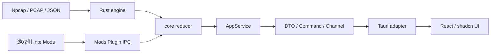

## nte-dps-toolkit

> 本节是全文的强制摘要；与后文冲突时，以后文更具体的条款为准。

# AGENTS.md

## 0. 最小行为守则（动手前必读）

本节是全文的强制摘要；与后文冲突时，以后文更具体的条款为准。

1. **先确认影响层再动手**：修改前先判断工作属于 Rust 领域核心、Tauri 适配层、React 前端、Windows 平台层、Mod 系统、资源或文档，并遵守 §4 的边界。
2. **Rust 核心保持唯一事实源**：抓包、协议解析、战斗归并、历史、资源、更新、Mod IPC 和系统集成继续由 Rust 实现；React 负责展示与交互。
3. **Tauri/React 是唯一桌面 UI**：新功能、交互修复和视觉规范落在 Tauri/React；Rust 保持业务权威；不得恢复已移除的旧桌面 UI、`gui` Feature 或根 crate 桌面 Binary。
4. **保持 CLI 纯净**：`nte-core` 的 CLI-only 依赖树不得出现 Tauri、WebView、React 构建、egui、eframe、wgpu 或窗口库。
5. **跨边界只传稳定契约**：Rust 与 React、游戏 Mod 与桌面程序之间只传显式 DTO、事件、命令和错误码；禁止把内部领域类型、裸指针、窗口句柄或可变状态直接暴露给前端。
6. **高频数据必须批量传输**：逐包、逐 hit、逐帧 IPC 属于禁止实现；使用有序 Channel、状态代次、增量批次、分页和节流。
7. **文案统一走 i18n**：英文字符串作为稳定 key，简体中文继续以 `res/languages/zh-CN.json` 为源；React 与桌面 Rust 契约使用同一翻译资源或稳定 key。
8. **信任边界完整校验一次**：网络字节、文件、Tauri command 参数、Mod manifest、FFI 和系统调用在入口完成校验；边界内部保持类型驱动和简洁实现。
9. **默认禁止清单**（除非用户当次明确要求）：`git commit`、`git push`、批量重构、整仓格式化、同时改动多个独立窗口或主题、升级大版本依赖、改写更新协议、修改 `vendor/`。
10. **改完必验证**：执行与影响面匹配的 Rust、Tauri、TypeScript、前端构建和测试命令；任何未运行项都要在最终回复中写明原因。
11. **UI 由用户人工验收**：智能体不启动桌面程序、不模拟点击、不截图验证。透明、穿透、置顶、快捷键、多屏 DPI 和窗口恢复必须列入人工验证。
12. **保留无关工作树内容**：只修改当前任务直接涉及的文件；发现其他问题只记录，不顺手修复。
13. **局部修复默认走 25 分钟快速通道**：小范围 UI、交互、窗口切换、展示算法和既有契约内的修复按 §0.1 执行；禁止把局部修复扩展成全仓审计、通用框架、依赖清理或完整发布验证。

## 0.1 25 分钟快速通道

### 适用条件

用户一次指出 1～4 个明确的局部差异，并且修改满足以下条件时，默认目标为从开始执行到交付不超过 25 分钟：

- 只涉及现有页面、组件、窗口 command、展示投影或小型确定性算法；
- 继续使用既有 DTO、command、配置字段和依赖；
- 预计净改动不超过 200 行、直接涉及不超过 8 个源码或测试文件；
- 不涉及协议解析、reducer 语义、历史迁移、更新安装、原生插件、`unsafe`、发布或 CI。

用户描述为“简单修改”“这几个差异”“直接修复”时，优先按快速通道判断，不先做全仓架构审计。

### 时间预算

1. **0～3 分钟：定位**。只看用户指出的入口、相邻实现、当前相关 diff 和最近对照代码；找到唯一事实源后立即动手。
2. **3～15 分钟：实现**。优先最小直接修复；第三处重复出现前不抽通用 Hook、trait、service 或新模块。
3. **15～22 分钟：定向验证**。先跑修改模块的 focused test/typecheck/check；同一套全量测试在代码未变化时不得重复运行。
4. **22～25 分钟：交付**。检查任务 diff，给出简短结果和受影响行为的人工验收点。

到第 20 分钟仍未完成时，立即停止扩展范围：保留已确认实现，只补阻断交付的编译或测试；文档整理、命名清理、依赖瘦身和额外抽象另列后续项。若单次干净编译或外部工具等待本身越过预算，最终回复只报告该实际阻塞，不再追加其它验证矩阵。

### 快速通道验证矩阵

- **React 局部改动**：任务文件 Prettier、`typecheck`、最相关的 Vitest；只有改到入口、路由、资源导入或构建配置时才跑 `build`。
- **Tauri command/窗口局部改动**：任务 Rust 文件 rustfmt check、`cargo check --manifest-path src-tauri/Cargo.toml`；只有改到可测试状态机、契约或共享状态时才跑对应 focused test。
- **根 Rust 小算法或投影**：任务文件 rustfmt check、精确测试过滤器、相关 Binary 的一次 `cargo check`；不默认跑全量 test/Clippy/CLI tree。
- **前后端同时改动但契约不变**：分别跑一次前端 typecheck/focused test 和 Tauri check，不追加 no-bundle 打包。

只有以下情况进入 §15 完整矩阵：新增或修改依赖/Feature、DTO 或配置 schema、协议解析或 reducer、历史迁移、更新器、原生/FFI/`unsafe`、发布/CI、跨 Binary 共享边界，或用户明确要求全量验证。

### 快速通道范围纪律

- 修 bug 时保留现有函数名、模块边界和依赖；除非修复本身要求，不顺手重命名共享 API、清理 Feature 或移动文件。
- 两处调用允许少量重复，第三处才评估抽象；抽象必须比直接修复更少代码且不增加验证层级。
- 普通局部修复不新增阶段文档、handoff 章节、截图、性能报告、补丁包或回滚包；用户明确要求、配置/数据迁移或破坏性操作时再生成。
- 工作树很脏时只保存和检查任务文件的前后 diff，不重复输出整仓 status，也不为无关改动建立基线快照。
- 颜色、布局等可枚举结果在实现完成后先用一个小探针确认实际样例，再进入最终验证，避免产物生成后返工。

## 1. 适用范围与优先级

- 本文适用于整个 `NTE DPS TOOL` 仓库，包括 Rust 核心、Tauri 主程序、React 前端、原生 Mods Plugin、资源、构建、测试和文档。
- 优先级：用户当次明确指令 > 更深层目录中的 `AGENTS.md` > 本文。
- 本文中的“必须 / 禁止”是规范性要求；描述性架构与代码现状不一致时，以代码为准，并报告偏差。
- Tauri/React 是产品唯一 UI；根 Rust crate 只提供共享领域能力、CLI 与 updater 所需能力，不拥有桌面 UI 入口。

## 2. 项目定位与产品架构

`NTE DPS TOOL` 是 Windows 桌面实时 DPS 工具。Rust 负责 Npcap 抓包、UE 网络协议解析、战斗模型、资源、历史、更新、Mod IPC 和 Windows 集成；现行桌面界面采用：

```text
Tauri 2
Vite
React
TypeScript
Tailwind CSS
shadcn/ui
```

产品产物保持：

- `nte-dps-tool`：由 Tauri 承载的完整桌面程序；
- `nte-core`：无 GUI 的 stdio sidecar，Feature `cli`；
- `nte-updater`：现有签名更新事务的独立执行程序；
- `dwmapi.dll`：游戏侧 NTE Mods Plugin；
- `desktop` Feature：提供 Tauri 桌面适配所需的共享平台能力，不包含 UI 框架或桌面 Binary。

业务规则不翻译到 TypeScript。Rust 核心保持唯一事实源，Tauri 只做命令、Channel、窗口和平台适配，React 负责产品展示与交互；新增桌面能力必须通过稳定契约跨越边界。

## 3. 不可破坏的约束

- 不提交 `target/`、`logs/`、`data/`、`NTE_Assets/`、`nte-resource-exporter/`、`Dumper-7/`、`tools/`、C# `bin/obj`、Node `node_modules/`、前端临时缓存、`.env`、抓包样本、资源导出 key 或完整解包数据。
- 不把 PCAP 内容、完整网络载荷、用户本机路径、授权资源路径、密钥或 token 写入日志、前端错误、测试快照或提交说明。
- `src/support/encrypted_ini.rs` 中长期稳定的加密 INI 协议 key 可保留；资源导出 key 不进入源码。
- 实时抓包、JSON 导入和 PCAPNG 回放尽量复用同一解析与 reducer 流程。
- `master` 主线不重新启用敌方目标识别显示；相关研究留在明确的 research 分支。
- 当前自定义签名更新与 Mods Plugin 组件更新语义保持稳定；引入 Tauri updater 时不得静默替换现有组件更新协议。
- `plugins/nte-mods` 和 `plugins/nte-mods.enabled` 是软件侧 Mod 工作区。编辑与查看不依赖游戏安装检测，部署插件时才检查游戏路径。
- Mod 热更新保持事务式：完整候选集合成功后原子替换；失败保留上一工作版本；单 Mod 故障隔离。
- 资源导出和离线维护工具属于独立仓库；主程序普通运行不依赖这些工具。

## 4. 总体架构与目录边界

### 4.1 运行分层



各层职责：

| 性质 | 归属 | 禁止 |
| --- | --- | --- |
| 网络字节、PCAPNG、Npcap | `src/engine/` | 依赖 Tauri、React、egui |
| 战斗模型和事件归并 | `src/engine/model.rs`、`src/core/reducer.rs` | 前端状态、窗口逻辑 |
| 抓包环境与控制 | `src/core/` | 读写 WebView、调用 i18n |
| CLI JSON-RPC | `src/api/`、`src/cli/` | Tauri command、React 类型 |
| 稳定桌面 DTO、命令、流式消息 | Rust 前端无关契约模块 | 暴露 `DpsApp`、`CombatState` 可变引用 |
| Tauri command/channel/window 适配 | `src-tauri/src/` | 复制解析、战斗聚合、历史规则 |
| React 页面与状态展示 | `frontend/src/` | 解析原始包、直接访问 Npcap/Win32 |
| Windows 热键、穿透、窗口属性 | Rust 平台层 / Tauri window 适配 | 在 React 中实现 Win32 业务 |
| 文件、配置、历史、资源、i18n | `src/storage/` | 依赖 React 或 WebView |
| Mod 编辑器 UI | `frontend/src/features/mods/` | 把游戏安装检测作为加载前置 |
| 游戏侧受限 Mod VM | `native/nte-mods-plugin/` | 应用 UI 业务、React 组件 |

### 4.2 Rust 根 crate

现有根 crate 继续作为领域和系统能力来源：

- `src/lib.rs`：Feature gating 和共享 crate 根；
- `src/core/`：frontend-neutral 服务、抓包控制、reducer、稳定快照；
- `src/engine/`：协议与领域模型；
- `src/platform/`：Win32、网络、热键、Mod IPC；
- `src/storage/`：配置、历史、资源、i18n、文件；
- `src/api/`、`src/cli/`：`nte-core` 对外协议；
可复用规则放入既有 `core`、`engine`、`storage` 或 `platform` 归属；`src-tauri` 只保留适配代码。不得在根 crate 新建平行桌面 UI 入口。

### 4.3 Tauri crate

规范目录：

```text
src-tauri/
  Cargo.toml
  tauri.conf.json
  capabilities/
  src/
    lib.rs
    main.rs
    commands/
    channels/
    windows/
    state.rs
```

约束：

- `src-tauri` 是适配器，不是第二套业务核心。
- command 名全局唯一，按领域分组注册。
- Tauri managed state 只持有线程安全的服务句柄。
- command 输入和输出使用显式 serde DTO。
- 窗口 label 是稳定标识，集中定义，不在组件中散落字符串。
- capabilities 权限按窗口和功能最小化配置。
- 原生文件、注册表、进程、热键和窗口调用由 Rust 执行。

### 4.4 React 前端

规范目录：

```text
frontend/
  package.json
  vite.config.ts
  tsconfig.json
  components.json
  src/
    app/
    routes/
    components/
      ui/
      nte/
    features/
      combat/
      timeline/
      history/
      mods/
      settings/
      diagnostics/
      hud/
    hooks/
    stores/
    lib/
    mod-sdk/
    locales/
```

职责：

- `components/ui/`：shadcn/ui 生成的基础组件源码，只做通用组件维护；
- `components/nte/`：NTE 设计系统和领域组件；
- `features/<name>/`：页面、局部组件、hooks、store、测试；
- `routes/`：静态和动态页面路由；
- `stores/`：跨页面、跨窗口的前端投影状态，不承载 Rust 领域规则；
- `lib/tauri/`：typed command、Channel 和错误适配；
- `mod-sdk/`：桌面 Mod 的稳定类型、组件 schema 和 capability。

页面不得直接调用裸 `invoke()`；统一经过 typed client。组件不得直接拼接 command 名或窗口 label。

### 4.5 资源源与构建产物

- `res/` 继续作为运行数据、图片、字体和翻译的稳定源。
- React 构建使用显式资源清单、Vite import 或受控复制步骤；同一资源不维护两份手工副本。
- `frontend/dist/`、Vite 缓存和生成的绑定文件不提交，除非发行流程明确要求。
- Mod 资源通过受控协议或 Rust command 读取，路径必须限制在对应 Mod 目录。

## 5. 前后端契约

### 5.1 Rust 是权威状态

- `CombatState`、抓包状态、历史事务、Mod 部署状态和更新事务只在 Rust 中变更。
- React store 是显示投影和短暂交互状态。
- React 发出 `AppCommand`，Rust 校验并执行，然后发布新一代状态。
- 禁止前端先乐观修改权威战斗状态再尝试同步。

### 5.2 DTO

- DTO 字段显式、可序列化、可版本化；默认使用 `camelCase` 与 TypeScript 一致。
- 内部领域结构不得直接作为 Tauri 返回类型。
- 大列表使用摘要、分页、游标或请求式详情。
- 时间、ID、枚举、可选值要有明确语义；64 位整数跨 JS 边界时使用字符串或经过验证的安全表示。
- 错误采用稳定 code + 可展示 message key + 参数；内部错误链写 Rust 日志。

### 5.3 Command、Channel 与 Event

- Command：请求/响应、有限操作、查询、保存、启停、导入导出。
- Channel：有序、高频、持续数据，如战斗状态批次、导入进度、日志和 Mod 控制台。
- Event：窗口生命周期、低频通知和广播。
- 高频流包含 `generation` 或 `sequence`，前端按序消费并识别重连后的完整快照。
- 同一帧产生的状态变化先在 Rust 归并，再发布一个批次。
- 订阅必须返回清理句柄；React 组件卸载时注销监听。

### 5.4 性能预算

- 前端默认消费聚合快照或增量批次，不消费原始网络帧。
- 长表格使用虚拟化、分页或预算控制。
- 图表数据先在 Rust 或 worker 中降采样。
- 序列化和 IPC 不放在抓包热路径。
- 活跃页面按需刷新；后台窗口保持事件驱动。
- 性能优化以测量结果为依据，不增加无使用证据的缓存层。

## 6. Rust 代码规范

- 使用 Rust 2024 和默认 `rustfmt`。
- 类型 `PascalCase`，函数/变量/模块 `snake_case`，常量 `SCREAMING_SNAKE_CASE`。
- I/O 与解析使用现有 `anyhow` 或领域错误类型；面向契约的错误使用稳定枚举。
- 网络、文件、FFI、Tauri 输入在边界返回 `Option`/`Result`，不得 panic。
- 内部不变量优先通过类型、穷举 `match` 和带原因的 `expect()` 表达。
- 禁止用 `.ok()`、`unwrap_or_default()` 或空分支吞掉内部错误。
- 所有 `unsafe` 最小化并附 `SAFETY:` 注释；FFI 资源使用 RAII。
- 后台任务不得阻塞 Tauri 主线程、WebView 渲染或抓包线程。
- 单一调用点不引入 trait；第三处重复出现前不急于抽象。
- 新业务规则必须有同文件测试；解析规则覆盖正常、边界和误判规避。
- 序列化字段改动保持旧配置、旧历史和旧导入文件兼容。

## 7. TypeScript 与 React 规范

### 7.1 TypeScript

- `strict` 必须启用。
- 禁止无说明的 `any`、`@ts-ignore` 和跨层强制类型断言。
- 外部数据在 typed client 边界解析一次；边界内部使用静态类型。
- DTO 类型优先从 Rust 契约生成或由单一 schema 生成，禁止手写两份易漂移结构。
- 枚举使用字符串 union 或生成类型，避免散落魔法数字。
- 路径 alias 以实际 `tsconfig` 和 `components.json` 为准。
- 一个文件只承载一个清晰职责；避免同时包含路由、全局 store、IPC 和大段 UI。

### 7.2 React

- 使用函数组件和 hooks。
- render 保持纯函数；订阅、计时器、Channel 和窗口调用放在 hook/effect 中并完整清理。
- 领域数据通过 feature hook 或 selector 读取，避免整个应用订阅一个巨型对象。
- 临时表单状态留在组件附近；跨页面状态才进入 store。
- selector 返回稳定引用，避免高频批次触发整棵组件树更新。
- 列表必须使用稳定领域 ID 作为 key。
- 异步请求处理 loading、empty、error 和 stale 状态。
- 错误边界至少按窗口或路由设置；单个 Mod 页面异常不拖垮主界面。
- 公共组件 props 保持小而明确；禁止传递整个全局 store。

### 7.3 前端状态

- Rust 权威快照与纯前端 UI 状态分开存储。
- store action 不实现战斗计算、解析或历史迁移。
- 高频序列采用 ring、分页缓存或 normalized map。
- 切换窗口和页面时保留必要选择状态，但不复制整份 Rust 快照。

## 8. shadcn/ui、Tailwind 与视觉规范

- 优先使用已安装的 shadcn/ui 组件并进行组合，再考虑自建基础组件。
- 添加组件前使用当前项目 package runner 调用 shadcn CLI，并先检查 `components.json` 和已安装列表。
- shadcn 组件以源码进入仓库；新增后必须阅读生成文件、修正 alias、图标库和组合问题。
- `components/ui/` 使用通用语义；NTE 特有视觉放在 `components/nte/`。
- Tailwind 使用语义颜色 token，如 `bg-background`、`text-muted-foreground`；避免散落原始色值。
- 布局使用 `flex/grid` 与 `gap-*`，不使用 `space-x-*` / `space-y-*`。
- 条件 class 使用 `cn()`。
- 等宽高使用 `size-*`。
- 表单使用 `FieldGroup`、`Field` 和对应可访问性属性。
- Dialog、Sheet、Drawer 必须包含标题；图标按钮必须有 Tooltip 或 `aria-label`。
- Card 使用完整的 Header/Content/Footer 组合。
- Loading 使用 Skeleton/Spinner，空状态使用 Empty，提示使用 Alert，toast 使用统一封装。
- 表格按页面需求组合 TanStack Table，不创建无法适配所有业务的巨型表格组件。
- 主题、圆角、间距、字体和动效通过设计 token 维护；页面中不复制主题常量。
- 中英文最长文案、窄窗口和 125%/150% DPI 都要纳入人工检查。

## 9. i18n

- 英文字符串是稳定 key。
- 简体中文值继续维护在 `res/languages/zh-CN.json`。
- React 使用统一的 `t()` 封装读取翻译资源；Rust command 和契约返回稳定 code/key，不新增平行翻译源。
- 新增用户可见文案必须同时补中文值。
- Rust `core`、`engine` 和契约层返回稳定 code/key，不调用 UI 翻译函数。
- 动态参数使用命名或显式占位符，禁止字符串拼接改变语序。
- 游戏内专有名词优先使用现有官方资源口径。
- Mod manifest 可提供多语言名称和描述；缺少本地化时展示其原始名称。

## 10. Mod 系统与可扩展 UI

### 10.1 两类运行时

- 游戏侧 `.nte` C++ v5 继续运行于 `native/nte-mods-plugin`，负责游戏对象、反射、事件和受限宿主 API。
- 桌面侧扩展运行于应用侧受控环境，负责页面、Slot、命令、派生视图和用户交互。
- 一个 Mod 包可以同时具有游戏和桌面 entrypoint，但两个运行时通过稳定事件/命令通信。

### 10.2 桌面 Mod API

- 数据入口：版本化只读 DTO、查询和订阅。
- UI 入口：稳定页面注册、Slot 和声明式组件 schema。
- 动作入口：经 Rust 路由的 `AppCommand`。
- 存储入口：限制在 Mod 自己的 namespaced 目录。
- capability 在 manifest 中声明并由宿主校验。
- 外部 Mod 依赖公开 `mod-sdk`，不导入应用内部 feature 组件、store 或路由实现。
- shadcn/ui 是应用内部实现，Mod API 暴露稳定 NTE 组件语义。

### 10.3 编辑器与热更新

- Mod 工坊采用 Monaco 或等价编辑器，补全、签名帮助和诊断从同一 API schema 生成。
- 保存时先完成语法、manifest、capability 和候选集合检查。
- 新运行时成功初始化并生成有效首屏后再原子替换。
- 编译失败保留上一工作版本。
- 单 Mod 运行异常暂停该 Mod；其他 Mod、抓包和主程序继续。
- 控制台显示编译错误、热更新状态、运行时日志和故障来源。

## 11. Windows、窗口与 HUD

### 11.1 Tauri 窗口

- 窗口 label、默认尺寸、最小尺寸、位置恢复和权限集中配置。
- 主窗口、Console、详情、深渊总览和 HUD 分别建模，不在 React 页面临时创建匿名窗口。
- 自定义标题栏使用官方 drag region 和统一窗口控件。
- Always-on-top、鼠标穿透、快捷键、焦点和窗口恢复由 Rust/Tauri window 层协调。
- Tauri HUD 不注册全局 F12；HUD 进入穿透状态后，通过现有控制台入口恢复编辑状态。
- React 只发出意图，不直接维护 Win32 状态机。

### 11.2 HUD 产品验收门槛

Tauri HUD 涉及透明、穿透、置顶、拖拽、缩放或窗口状态改动时，必须人工验证：

1. WebView2 背景透明且没有白边、黑底或系统窗口残影；
2. 快速角落缩放、拖动和模式切换稳定；
3. `setIgnoreCursorEvents` 穿透与编辑模式切换正确；
4. 控制台入口可以在 HUD 穿透后恢复编辑状态；
5. Always-on-top 与游戏全屏/无边框窗口组合正确；
6. 多显示器、不同 DPI、休眠恢复和显示器拔插后位置正确；
7. 抓包高负载时 HUD 更新平滑；
8. 关闭、更新和崩溃恢复不遗留幽灵窗口。

### 11.3 单一桌面 UI 边界

- 桌面产品入口、窗口生命周期与发行构建统一由 `src-tauri` 承载。
- 根 crate 不提供桌面 Binary，不声明旧 `gui` Feature，也不直接依赖 UI 或窗口框架。
- `scripts/verify_architecture.ps1` 必须阻止旧 UI 依赖、源码目录和本地 fork 回流。
- Tauri/React 的现行行为、产品需求和用户验收截图是 UI 验收基线。

## 12. 抓包、解析与历史

- Npcap 动态加载和 FFI 保持 C ABI 准确，所有失败返回显式处理。
- BPF 过滤尽量收窄。
- 原始 PCAPNG 写入是核心诊断能力。
- 实时、PCAPNG 和 JSON 回放字段语义一致。
- 解析器宁可不识别，也不生成高置信误判。
- React 只接收解析后的 DTO；Packets 页面需要的调试字段由 Rust 显式投影。
- 历史数据库和迁移由 Rust 管理；前端通过分页查询和显式导入导出命令访问。
- 修改 GameplayEffect、技能分类、伤害属性或深渊事件时，同步检查相关资源和前端投影。

## 13. 依赖与构建策略

- 新增、升级或删除 Rust、Node、Tauri plugin、shadcn registry 依赖前，说明用途、维护状态、许可证、体积和替代方案，并获得用户确认。
- 初始化前端后，以 lockfile 确定 package runner；禁止在同一项目混用 npm、pnpm、yarn 或 bun。
- 禁止无选择地安装全部 shadcn 组件。
- Tauri 和前端依赖留在各自目录，不进入 CLI-only feature。
- 不引入 Next.js；桌面前端采用 Vite SPA，除非用户明确改变架构。
- 不为少量状态引入大型全局状态框架或异步运行时。
- 保留 release profile 的小体积、LTO 和 `panic = "abort"` 意图。
- WebView2/Tauri、React、Tailwind 和 shadcn 的大版本升级必须先检查 API、窗口行为、构建产物和兼容说明。
- 不为桌面 UI 依赖新增本地 fork；必须修补上游依赖时先说明版本、维护与回退策略并获得确认。

## 14. 项目变更与交付规范

### 14.1 变更分类

- **局部修复**：满足 §0.1 时使用 25 分钟快速通道，只做定向实现与验证。
- **产品功能**：限定一个领域或一组紧密关联的窗口，保持 Rust 规则唯一，并补齐契约、状态和 UI 验收。
- **契约或数据变更**：涉及 DTO、配置、历史、数据库或导入格式时，显式版本化并验证向后兼容。
- **平台或发行变更**：涉及窗口系统、FFI、更新器、Feature、依赖、CI 或打包时，执行 §15 的完整影响面矩阵。

### 14.2 实现顺序

1. 检查当前相关 diff、现行入口、相邻实现和唯一事实源。
2. 领域规则先落到 Rust 对应层；纯展示规则留在 React feature 内。
3. 跨边界变化先定义或更新 DTO、command、Channel、事件和错误语义。
4. React 只实现权威状态的投影、交互和 loading/empty/error/stale 表达。
5. 先执行定向验证，再依据变更分类决定是否进入完整矩阵；代码未变化时不重复同一验证。

### 14.3 完成标准

- 用户要求的行为已实现，相关测试或探针覆盖正常、边界和回归场景。
- 没有在 React 或 Tauri adapter 中复制 Rust 领域规则。
- 新增或变更的异步 UI 具备适用的 loading、empty、error 和 stale 状态。
- UI 改动提供本次实际受影响的人工验收步骤；平台级改动覆盖 §11 专项。
- 任务 diff 不包含无关清理、重构、依赖升级或生成产物。

## 15. 验证要求

本节是高影响修改的完整验证矩阵，不是 §0.1 局部修复的默认路径。快速通道按影响面执行最窄验证；完整矩阵最多在最终代码确定后运行一次。

### 15.1 Rust 基线

非快速通道的 Rust 改动运行：

```powershell
cargo fmt --check
cargo check
cargo test
```

涉及双 Binary、共享 core、资源或 Feature 时追加：

```powershell
cargo check --manifest-path src-tauri/Cargo.toml
cargo check --bin nte-core --no-default-features --features cli
cargo clippy --manifest-path src-tauri/Cargo.toml -- -D warnings
cargo clippy --bin nte-core --no-default-features --features cli -- -D warnings
cargo test --manifest-path src-tauri/Cargo.toml
cargo test --no-default-features --features cli
cargo tree -e normal --no-default-features --features cli
```

CLI 依赖树不得出现：

```text
tauri
wry
webview2-com
eframe
egui
wgpu
rfd
raw-window-handle
```

### 15.2 Tauri

非快速通道或涉及契约、共享状态、capability、打包的 Tauri 改动运行：

```powershell
cargo fmt --check --manifest-path src-tauri/Cargo.toml
cargo check --manifest-path src-tauri/Cargo.toml
cargo test --manifest-path src-tauri/Cargo.toml
```

涉及 capabilities、窗口或打包时追加对应 Tauri 构建检查。

### 15.3 React

非快速通道、完整页面功能或入口/路由/构建改动，使用 lockfile 对应的 package runner 执行：

```text
format/check
lint
typecheck
test
build
```

脚本名以 `package.json` 为准。新增页面至少覆盖：

- 关键纯函数和 selector；
- loading、empty、error；
- 订阅清理；
- 路由或 Slot 注册；
- DTO 兼容和未知枚举展示。

### 15.4 原生 Mod 插件

涉及 `native/nte-mods-plugin` 时使用干净 Release x64 构建：

```powershell
MSBuild.exe .\native\nte-mods-plugin\nte-mods-plugin.sln /t:Clean,Build /p:Configuration=Release /p:Platform=x64 /m
```

同时检查 DLL 依赖、运行时字符串和 IPC 版本。

### 15.5 UI 人工验收

智能体不自行启动桌面 UI。最终回复列出：

- 入口窗口和页签；
- 操作步骤；
- 中英文预期；
- 窄窗口和 DPI；
- loading/empty/error；
- 透明、穿透、置顶、快捷键、拖拽或多窗口专项；
- 现行产品基线或用户验收截图的对照点。

快速通道只列出本次实际受影响的 2～5 个检查点，不复制完整通用清单。

## 16. 禁止事项

除非用户当次明确要求，禁止：

- `git commit`、`git push`、创建 PR；
- 批量移动、拆分、合并或重命名 Rust 模块；
- 恢复已移除的旧桌面 UI、`gui` Feature 或根 crate 桌面 Binary；
- 为维护双 UI 而复制 Tauri/React 行为或 Rust 领域规则；
- 在 React 中复制 Rust 领域算法；
- 在 `src-tauri` 中复制 reducer、历史或解析逻辑；
- 每个 hit、包或动画帧执行一次 Tauri `invoke` / global event；
- 把 `CombatState`、内部 Rust enum 或裸句柄直接序列化给前端；
- 在页面中直接调用裸 Tauri command；
- 在组件中直接调用 Win32；
- 用 `any`、`@ts-ignore` 或静默 catch 掩盖契约错误；
- 为未来功能预留接口、配置和未使用 capability；
- 同时维护两套翻译源；
- 直接编辑生成构建产物；
- 混用 Node package manager；
- 使用 `git add -A` 盲目暂存；
- 修改 `Cargo.toml` 的 `[profile]` / `[patch]`、`vendor/` 或 updater 协议；
- 无关格式化、主题清洗、依赖升级或代码风格重排。

## 17. 提交与最终回复规范

- 未经用户明确要求不提交、不推送。
- 用户要求提交时，只暂存任务相关文件；提交信息以动词开头并描述实际改动。
- 非快速通道最终回复固定包含：
  1. 改动摘要与影响范围；
  2. 改动文件清单；
  3. 已运行验证命令及结果；
  4. 未运行验证及原因；
  5. 需人工验证的点。
- 快速通道最终回复压缩为：改了什么、验证结果、2～5 个手工检查点；不复述调查过程，不附加未请求的审计材料。
- 不把秘密、完整本机路径、PCAP 内容或资源 key 写入回复。
- 若创建或切换分支，明确报告分支名。

---
> Source: [kongbaiz/nte-dps-toolkit](https://github.com/kongbaiz/nte-dps-toolkit) — distributed by [TomeVault](https://tomevault.io).
<!-- tomevault:4.0:gemini_md:2026-08-06 -->
