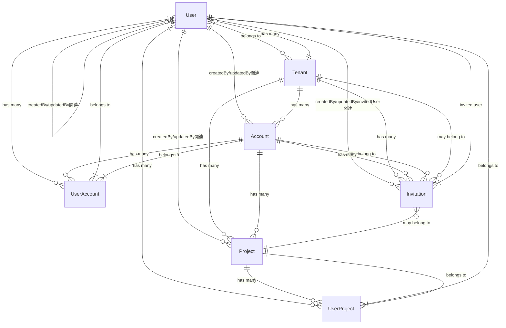
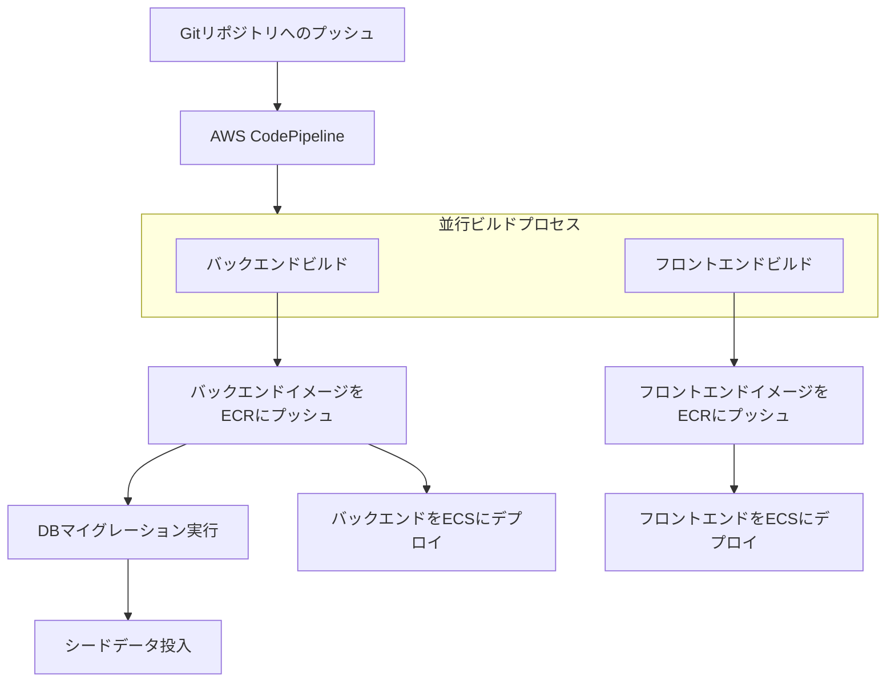
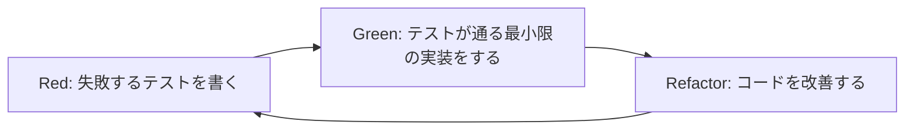
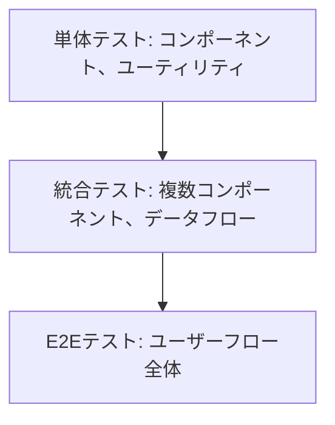
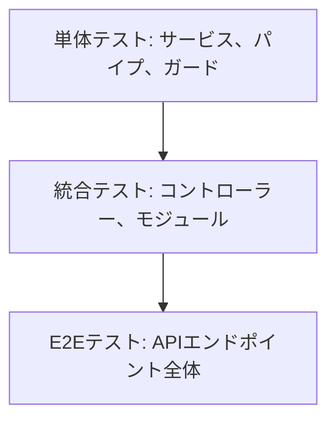

## 001-bestpractices-common

> this file explains best practices. please always refer to this file.


# 001_bestPractices_common.mdc
- このファイルが読み込まれたら必ず「001_bestPractices_common.mdcを読み込みました！」と作業着手前にユーザーに必ず伝えてください。


## 基本原則
以下のルールを遵守して下さい。

### 1. コミュニケーション
- ユーザーとのコミュニケーションは常に日本語でお願いします。

### 2. 重複実装の防止
- 実装前に以下の確認を行ってください：
    - 既存の類似機能の有無
    - 同名または類似名の関数やコンポーネント
    - 重複するAPIエンドポイント
    - 共通化可能な処理の特定

### 3. 単一責任の原則
- 関数が長くなりすぎた場合は、小さな関数に分割して下さい。
- ファイルが大きくなりすぎた場合は、小さなファイルに分割して下さい。

### 4. 参照禁止ファイル
- .envファイルの作成・読込・編集・削除は厳禁です。ユーザーに作業を促して下さい。
- .envファイルはプロジェクトルートに配置しています。

--

## プロジェクト構成
本プロジェクトは、
Nxモノレポを使用したマイクロサービスアーキテクチャを採用しています。
フロントエンドにはNext.js App Router、バックエンドにはNestJS、データベースアクセスにはPrismaを使用しています。

### ルートディレクトリ構造

```
/
├── apps/                      # アプリケーションコード
│   ├── api/                   # NestJSバックエンドアプリケーション
│   ├── api-e2e/               # バックエンドのE2Eテスト
│   ├── frontend/              # Next.jsフロントエンドアプリケーション
│   └── frontend-e2e/          # フロントエンドのE2Eテスト
├── prisma/                    # Prisma Schema及びマイグレーションファイル
├── terraform/                 # Terraformによるインフラ定義
│   ├── environments/          # 環境別設定
│   └── modules/               # 再利用可能なモジュール
├── github/                    # GitHub関連ファイル
├── customRules/               # カスタムルール定義
└── ... (設定ファイル類)
```


## プログラミング言語
本プロジェクトは、バックエンドの実装もフロントエンドの実装も、TypeScriptを使用しています。基本、いかなる場合でもTypeScriptを使用して実装してください。

### 1. 型の使用

- 明示的な型アノテーションを使用
- `any`型は避け、代わりに`unknown`使用
- 複雑な型は`interface`/`type`で定義
- 配列型は`T[]`形式を優先
- 再利用可能な型は個別ファイルにエクスポート

### 2. インターフェース/型エイリアス

- 拡張必要時は`interface`
- 高度な型操作には`type`
- `I`プレフィックス不使用
- 関連する型は同ファイルにまとめる

### 3. Null/Undefinedの扱い

- オプショナルチェーン`?.`活用
- Nullish合体演算子`??`使用
- 非nullアサーション`!`は避ける
- 早期リターンでネスト削減

### 4. モジュール構成

- 絶対パスは`@/*`エイリアス使用
- 型のみの場合は`import type`
- 名前付きエクスポート優先
- 循環参照を避ける

### 5. エラー処理

- 具体的なエラー型を使用
- キャッチしたエラーに型付け
- 非同期は`try/catch`または`Promise.catch()`

### 6. コード品質

- strictモード維持
- 未使用の変数/型は削除
- 型の計算コスト考慮
- 型定義の循環参照回避


## このプロジェクトで使用している技術スタック

### コア技術

1. **Node.js**

   - バージョン: 20.18.0（volta管理）
   - JavaScript ランタイム環境
   - サーバーサイドとフロントエンド開発の統一プラットフォーム

2. **TypeScript**

   - バージョン: 5.5.4
   - 静的型付け
   - 型推論と型チェック
   - インターフェースと型定義
   - 全てのコードベースで使用

3. **Next.js**

   - バージョン: 14.2.11
   - React フレームワーク
   - SSR (Server-Side Rendering) と SSG (Static Site Generation)
   - App Router の活用
   - ページとルーティングの統合管理

4. **React**

   - バージョン: 18.3.1
   - コンポーネントベースのUIライブラリ
   - フックの活用（useState, useEffect など）
   - サーバーコンポーネントとクライアントコンポーネント

5. **NestJS**

   - バージョン: 10.4.1
   - サーバーサイドフレームワーク
   - モジュール化されたアーキテクチャ
   - 依存性の注入
   - デコレータベースのAPI設計

6. **Prisma**

   - バージョン: 5.19.0
   - ORM（Object-Relational Mapping）
   - データベースマイグレーション
   - 型安全なデータベースアクセス
   - PostgreSQLとの統合

7. **Zod**

   - バージョン: 3.23.8
   - スキーマ検証
   - ランタイム型チェック
   - 型推論との連携

8. **Redux Toolkit**
   - バージョン: 2.2.7
   - 状態管理ライブラリ
   - RTK Query によるデータフェッチング
   - スライスによる状態管理の簡素化

### フロントエンド技術

1. **TailwindCSS**

   - バージョン: 3.4.4
   - ユーティリティファーストCSSフレームワーク
   - カスタマイズ可能なデザインシステム

2. **Radix UI**

   - アクセシブルなUIコンポーネント
   - ヘッドレスコンポーネントライブラリ
   - スタイリングの自由度

3. **React Hook Form**

   - バージョン: 7.53.0
   - パフォーマンスに優れたフォーム管理
   - バリデーション連携

4. **TanStack Query**

   - バージョン: 5.56.2
   - データフェッチングとキャッシュ管理
   - 非同期状態管理

5. **TanStack Table**
   - バージョン: 8.19.3
   - 高度なテーブル管理
   - ソート、フィルタリング、ページネーション

### バックエンド技術

1. **PostgreSQL**

   - リレーショナルデータベース
   - 強力なクエリ機能
   - トランザクション処理

2. **BullMQ**

   - バージョン: 5.12.2
   - Redis ベースのジョブキューシステム
   - 非同期タスク処理
   - バックグラウンドジョブ管理

3. **AWS SDK**

   - クラウドサービス統合
   - S3、Cognito などの AWS サービスとの連携

4. **OpenAPI/Swagger**
   - API ドキュメント生成
   - API スキーマ定義
   - クライアント生成の基盤

### 開発ツール

1. **Nx**

   - バージョン: 20.1.2
   - モノレポ管理
   - ビルドシステム
   - タスク実行とキャッシング

2. **ESLint**

   - バージョン: 9.6.0
   - コード品質チェック
   - 自動修正機能

3. **Prettier**

   - バージョン: 3.3.2
   - コードフォーマッター
   - 一貫したコードスタイル

4. **Orval**

   - バージョン: 6.31.0
   - API クライアント自動生成
   - OpenAPI スキーマからの型生成

5. **Jest**

   - バージョン: 29.7.0
   - テストフレームワーク
   - ユニットテストとインテグレーションテスト

6. **Cypress**
   - バージョン: 13.15.2
   - E2E テスト
   - ブラウザ自動化テスト

## 開発環境のセットアップ

### 必要なツール

1. **Node.js のインストール**

   - volta または nvm を使用した Node.js 20.18.0 のインストール
   - yarn 1.22.19 のインストール

2. **環境変数の設定**

   - `.env.example` をコピーして `.env` ファイルを作成
   - 必要な環境変数を設定

3. **プロジェクトのセットアップ**

   ```bash
   # リポジトリのクローン
   git clone https://github.com/xxxxx/xxxxx.git

   # 依存関係のインストール
   yarn install

   # データベースのセットアップ
   npx prisma migrate dev

   # APIクライアントの生成
   yarn codegen

   # 開発サーバーの起動
   yarn dev
   ```

### 開発ワークフロー

1. **フロントエンド開発**

   ```bash
   # フロントエンドのみ開発
   yarn dev:ui
   ```

2. **バックエンド開発**

   ```bash
   # バックエンドのみ開発
   yarn dev:api
   ```

3. **データベース操作**

   ```bash
   # マイグレーションの作成
   npx prisma migrate dev --name [マイグレーション名]

   # スキーマの生成
   npx prisma generate

   # データベースのシード
   yarn seed
   ```

4. **APIクライアント生成**

   ```bash
   # OpenAPIスキーマからクライアント生成
   yarn codegen
   ```

5. **リントとフォーマット**

   ```bash
   # リント
   yarn lint

   # フォーマット
   yarn prettier
   ```

## 技術的制約

1. **フロントエンドの制約**

   - Next.js App Router による制約
   - サーバーコンポーネントとクライアントコンポーネントの分離
   - データフェッチング戦略の選択

2. **バックエンドの制約**

   - NestJS のモジュール構造に従う必要性
   - Prisma スキーマの制約
   - API設計の一貫性

3. **パフォーマンスの制約**
   - 大量のデータ処理時のメモリ使用量
   - APIレスポンスタイムの最適化
   - フロントエンドのレンダリングパフォーマンス

## 依存関係

### 主要な依存関係

1. **フロントエンド**

   - next: Reactフレームワーク
   - react: UIライブラリ
   - @tanstack/react-query: データフェッチング
   - @reduxjs/toolkit: 状態管理
   - tailwindcss: スタイリング
   - zod: バリデーション

2. **バックエンド**

   - @nestjs/core: サーバーフレームワーク
   - @prisma/client: データベースORM
   - @nestjs/swagger: APIドキュメント
   - bullmq: ジョブキュー
   - class-validator: バリデーション

3. **共通**
   - typescript: 型システム
   - axios: HTTPクライアント
   - jest: テスト

### 依存関係管理

1. **Nx モノレポ**

   - apps/frontend: フロントエンドアプリケーション
   - apps/api: バックエンドアプリケーション
   - prisma: データベーススキーマ

2. **パッケージ管理**
   - yarn による依存関係管理
   - package.json でのバージョン指定
   - yarn.lock によるロック


### DBに関する重要なルール
- あなたはDB設計のプロです。
- 常に現状のDB設計に沿って実装をします。
- ORMはPrismaを採用しています。
- schema.prismaは、/prisma内に定義されています。
- schema.prismaを編集、マイグレーションを行った場合は必ず下記に記したER図も更新するようにしてください。
- migrationは必ず

### ER図



以下は各エンティティの主要属性です：

### User
- id, tenantId, name, email, phoneNumber, tenantRole, createdAt, updatedAt
- テナントに所属し、アカウントやプロジェクトにアクセス権を持つ

### Tenant
- id, name, imageUrl, isAgency, createdAt, updatedAt
- 組織を表し、複数のアカウントとユーザーを保持できる

### Account
- id, tenantId, name, imageUrl, closingMonth, createdAt, updatedAt
- テナント内の会計単位、複数のプロジェクトを持つ

### Project
- id, accountId, tenantId, name, imageUrl, dispOrder, createdAt, updatedAt
- 広告管理の中心的な単位、広告やメトリクスなど多くのリソースを持つ

### UserAccount
- userId, accountId, role
- ユーザーとアカウントの関連付け、権限管理

### UserProject
- userId, projectId, role
- ユーザーとプロジェクトの関連付け、権限管理

### Invitation
- id, tenantId, accountId, projectId, email, inviteTo, role, status, expiresAt, token, invitedUserId
- ユーザー招待の管理


## デプロイ概要

本プロジェクトは、AWS上にDockerコンテナとして展開されるマイクロサービスアーキテクチャを採用しています。フロントエンドとバックエンドは別々のコンテナとしてビルド・デプロイされ、AWS CodePipelineを使用したCI/CDパイプラインによって自動化されています。

### デプロイフロー

このプロジェクトのデプロイフローは以下のように構成されています：



### 重要なファイル

デプロイプロセスを理解・修正する際には、以下のファイルを特に注視する必要があります：

#### Dockerfiles

1. **Dockerfile.frontend**
   - フロントエンド（Next.js）のビルドとデプロイに使用
   - マルチステージビルド：ビルド環境と本番環境を分離
   - 環境変数（ENVIRONMENT, NEXT_PUBLIC_CLOUDFRONT_DOMAIN, NEXT_PUBLIC_ADOBE_CLIENT_ID）の設定
   - ポート3000でNext.jsアプリケーションを起動

2. **Dockerfile.backend**
   - バックエンド（NestJS）のビルドとデプロイに使用
   - マルチステージビルド構成
   - 環境変数（ENVIRONMENT）の設定
   - メモリ制限設定（--max-old-space-size=6144）付きでNode.jsアプリケーションを起動

#### BuildSpec設定

1. **buildspec_frontend.yml**
   - フロントエンドのCI/CDパイプライン設定
   - インストール、ビルド、デプロイフェーズを定義
   - AWS ECRへのログインとイメージのプッシュ
   - 環境変数を使用したDockerビルド引数の設定
   - ECSデプロイ用のimagedefinitions.jsonの生成

2. **buildspec_backend.yml**
   - バックエンドのCI/CDパイプライン設定
   - インストール、ビルド、デプロイフェーズを定義
   - データベースマイグレーションとシードデータ投入を実行
   - AWS ECRへのログインとイメージのプッシュ
   - ECSデプロイ用のimagedefinitions.jsonの生成

### 環境変数

デプロイプロセスでは、以下の重要な環境変数が使用されています：

#### 共通
- `ENVIRONMENT`: 環境識別子（dev, stg, prod等）
- `IMAGE_TAG`: コンテナイメージのタグ
- `IMAGE_REPO_URL`: ECRレポジトリURL
- `AWS_REGION`: AWSリージョン
- `AWS_ACCOUNT_ID`: AWSアカウントID

#### フロントエンド特有
- `NEXT_PUBLIC_CLOUDFRONT_DOMAIN`: CloudFrontのドメイン
- `NEXT_PUBLIC_ADOBE_CLIENT_ID`: Adobe APIのクライアントID

### デプロイ後の処理

バックエンドのデプロイプロセスでは、イメージのビルドとプッシュ後に以下の追加タスクが実行されます：

1. **データベースマイグレーション** (`yarn prisma migrate deploy`)
   - Prismaを使用したスキーマ変更の適用

2. **シードデータ投入** (`yarn seed:prod`)
   - 本番環境用の初期データ設定

### インフラストラクチャ

デプロイ先のインフラストラクチャはTerraformで管理されています。関連するTerraform設定は以下のディレクトリにあります：

- `terraform/modules/ap-northeast-1/codeBuild/`: CodeBuildの設定
- `terraform/modules/ap-northeast-1/ecs/`: ECSの設定
- `terraform/modules/ap-northeast-1/ecr/`: ECRの設定

### デプロイに関する注意点

1. **マイグレーション順序**
   - バックエンドデプロイ時、コンテナデプロイ前にマイグレーションが実行されます
   - マイグレーションに失敗した場合、デプロイプロセス全体が失敗します

2. **環境変数管理**
   - 環境変数はCodePipelineで設定され、BuildSpecとDockerfileに渡されます
   - 新しい環境変数を追加する際はパイプライン設定とDockerfileの両方を更新する必要があります

3. **マルチステージビルド**
   - 本番イメージサイズを最小化するためマルチステージビルドを使用しています
   - 依存関係インストールとビルドは最初のステージで行われ、成果物のみが本番イメージにコピーされます

### AI支援時のデプロイ作業

AIにデプロイ関連のタスクを依頼する際は、以下の点に注意してください：

1. **変更対象の明確化**
   - `Dockerfile.frontend`, `Dockerfile.backend`, `buildspec_frontend.yml`, `buildspec_backend.yml` の変更内容を明確に指示する
   - 環境変数の追加や変更がある場合は、全ての関連ファイルでの変更箇所を確認する

2. **デプロイフローへの影響**
   - コードの変更がデプロイプロセスに与える影響を考慮する
   - 特にマイグレーションやシードデータに影響する変更には注意が必要

3. **環境固有の設定**
   - 環境固有（dev/stg/prod）の設定や条件分岐がある場合は明示的に指示する

4. **ビルド順序と依存関係**
   - フロントエンドとバックエンドの依存関係を考慮する
   - ビルドプロセスの順序に影響する変更には特に注意する

AIは必ず上記の4つのファイルを精査してから、デプロイ関連のタスクを実行するようにしてください。


## 概要
このドキュメントでは、コミットとプルリクエストの作成に関するベストプラクティスを説明します。

### コミットの作成

コミットを作成する際は、以下の手順に従います：

1. 変更の確認

   ```bash
   # 未追跡ファイルと変更の確認
   git status

   # 変更内容の詳細確認
   git diff

   # コミットメッセージのスタイル確認
   git log
   ```

2. 変更の分析

   - 変更または追加されたファイルの特定
   - 変更の性質（新機能、バグ修正、リファクタリングなど）の把握
   - プロジェクトへの影響評価
   - 機密情報の有無確認

3. コミットメッセージの作成

   - 「なぜ」に焦点を当てる
   - 明確で簡潔な言葉を使用
   - 変更の目的を正確に反映
   - 一般的な表現を避ける

4. コミットの実行

   ```bash
   # 関連ファイルのみをステージング
   git add <files>

   # コミットメッセージの作成（HEREDOCを使用）
   git commit -m "$(cat <<'EOF'
   feat: ユーザー認証にResult型を導入

   - エラー処理をより型安全に
   - エラーケースの明示的な処理を強制
   - テストの改善

   EOF
   )"
   ```

### プルリクエストの作成

プルリクエストを作成する際は、以下の手順に従います：

1. ブランチの状態確認

   ```bash
   # 未コミットの変更確認
   git status

   # 変更内容の確認
   git diff

   # mainからの差分確認
   git diff main...HEAD

   # コミット履歴の確認
   git log
   ```

2. 変更の分析

   - mainから分岐後のすべてのコミットの確認
   - 変更の性質と目的の把握
   - プロジェクトへの影響評価
   - 機密情報の有無確認

3. プルリクエストの作成

   ```bash
   # プルリクエストの作成（HEREDOCを使用）
   gh pr create --title "feat: Result型によるエラー処理の改善" --body "$(cat <<'EOF'
   ## 概要

   エラー処理をより型安全にするため、Result型を導入しました。

   ## 変更内容

   - neverthrowを使用したResult型の導入
   - エラーケースの明示的な型定義
   - テストケースの追加

   ## レビューのポイント

   - Result型の使用方法が適切か
   - エラーケースの網羅性
   - テストの十分性
   EOF
   )"
   ```

### 重要な注意事項

1. コミット関連

   - 可能な場合は `git commit -am` を使用
   - 関係ないファイルは含めない
   - 空のコミットは作成しない
   - git設定は変更しない

2. プルリクエスト関連

   - 必要に応じて新しいブランチを作成
   - 変更を適切にコミット
   - リモートへのプッシュは `-u` フラグを使用
   - すべての変更を分析

3. 避けるべき操作
   - 対話的なgitコマンド（-iフラグ）の使用
   - リモートリポジトリへの直接プッシュ
   - git設定の変更

### コミットメッセージの例

```bash
# 新機能の追加
feat: Result型によるエラー処理の導入

# 既存機能の改善
update: キャッシュ機能のパフォーマンス改善

# バグ修正
fix: 認証トークンの期限切れ処理を修正

# リファクタリング
refactor: Adapterパターンを使用して外部依存を抽象化

# テスト追加
test: Result型のエラーケースのテストを追加

# ドキュメント更新
docs: エラー処理のベストプラクティスを追加
```

### プルリクエストの例

```markdown
## 概要

TypeScriptのエラー処理をより型安全にするため、Result型を導入しました。

## 変更内容

- neverthrowライブラリの導入
- APIクライアントでのResult型の使用
- エラーケースの型定義
- テストケースの追加

## 技術的な詳細

- 既存の例外処理をResult型に置き換え
- エラー型の共通化
- モック実装の改善

## レビューのポイント

- Result型の使用方法が適切か
- エラーケースの網羅性
- テストの十分性
```


## テスト駆動開発 (TDD) ルール

テスト駆動開発 (Test-Driven Development) は、コードを書く前にテストを書くソフトウェア開発手法です。この方法論を採用することで、設計の質を高め、バグの少ないコードを作成し、リファクタリングを安全に行うことができます。

## TDDの基本サイクル



1. **Red**: まず失敗するテストを書く

   - 必要な機能を明確に定義
   - 期待する振る舞いをテストコードで表現
   - この時点ではテストは失敗する（赤）

2. **Green**: テストが通るように最小限の実装をする

   - テストをパスさせるための最も単純な実装を行う
   - パフォーマンスやコードの美しさより機能性を優先
   - この時点でテストは成功する（緑）

3. **Refactor**: コードをリファクタリングして改善する
   - 重複を排除し、コードを整理
   - 可読性とメンテナンス性を向上
   - テストが依然として通ることを確認

## TDDの重要な考え方

- **テストは仕様である**: テストコードは実装の仕様を表現したもの
- **最初に「何を」考え、次に「どのように」考える**: テストで「何を」達成すべきかを明確にしてから、「どのように」実装するかを考える
- **小さなステップで進める**: 一度に大きな変更を行わず、小さな一歩ずつ進める
- **テストカバレッジより意図のカバレッジを重視**: 単にコードラインをカバーするだけでなく、ビジネスロジックの意図を正確にテストする

## テスト構造の原則

### AAA (Arrange-Act-Assert) パターン

テストコードは以下の3つのセクションで構成することをお勧めします：

1. **Arrange (準備)**: テストの前提条件を設定
2. **Act (実行)**: テスト対象の機能を実行
3. **Assert (検証)**: 期待する結果を検証

```typescript
// Jest を使用した例
describe('UserService', () => {
  it('should return user by id when user exists', async () => {
    // Arrange
    const mockUser = { id: 1, name: 'John Doe' };
    const userRepositoryMock = {
      findById: jest.fn().mockResolvedValue(mockUser),
    };
    const userService = new UserService(userRepositoryMock);

    // Act
    const result = await userService.getUserById(1);

    // Assert
    expect(result).toEqual(mockUser);
    expect(userRepositoryMock.findById).toHaveBeenCalledWith(1);
  });
});
```

### テスト名の命名規則

良いテスト名は「状況→操作→結果」の形式で記述します：

```typescript
it('有効なユーザーIDが提供された場合_getUserByIdを呼び出すと_ユーザー情報を返すこと', async () => {
  // テスト本体
});

// または英語で
it('should return user information when getUserById is called with valid user ID', async () => {
  // テスト本体
});
```

## フロントエンドとバックエンドのテスト戦略

### Next.jsフロントエンドのテスト階層



#### 単体テスト (Jest + React Testing Library)

```typescript
// components/Button.test.tsx
import { render, screen, fireEvent } from '@testing-library/react';
import Button from './Button';

describe('Button', () => {
  it('renders correctly with text', () => {
    render(<Button>Click me</Button>);
    expect(screen.getByText('Click me')).toBeInTheDocument();
  });

  it('calls onClick handler when clicked', () => {
    const handleClick = jest.fn();
    render(<Button onClick={handleClick}>Click me</Button>);
    fireEvent.click(screen.getByText('Click me'));
    expect(handleClick).toHaveBeenCalledTimes(1);
  });
});
```

#### 統合テスト

```typescript
// features/UserProfile.test.tsx
import { render, screen, waitFor } from '@testing-library/react';
import UserProfile from './UserProfile';
import { UserProvider } from '../contexts/UserContext';

// モックの設定
jest.mock('../api/user', () => ({
  fetchUserData: jest.fn().mockResolvedValue({ name: 'John Doe', email: 'john@example.com' })
}));

describe('UserProfile', () => {
  it('fetches and displays user data', async () => {
    render(
      <UserProvider>
        <UserProfile userId="123" />
      </UserProvider>
    );

    // ローディング状態の確認
    expect(screen.getByText('Loading...')).toBeInTheDocument();

    // データ取得後の表示確認
    await waitFor(() => {
      expect(screen.getByText('John Doe')).toBeInTheDocument();
      expect(screen.getByText('john@example.com')).toBeInTheDocument();
    });
  });
});
```

#### E2Eテスト (Cypress)

```typescript
// cypress/e2e/login.cy.ts
describe('Login Flow', () => {
  it('allows user to login and redirects to dashboard', () => {
    cy.visit('/login');

    cy.get('input[name="email"]').type('user@example.com');
    cy.get('input[name="password"]').type('password123');
    cy.get('button[type="submit"]').click();

    // ダッシュボードへのリダイレクトと表示確認
    cy.url().should('include', '/dashboard');
    cy.get('h1').should('contain', 'Welcome to your Dashboard');
  });
});
```

### NestJSバックエンドのテスト階層



#### 単体テスト (Jest)

```typescript
// users/users.service.spec.ts
import { Test } from '@nestjs/testing';
import { UsersService } from './users.service';
import { UsersRepository } from './users.repository';

describe('UsersService', () => {
  let usersService: UsersService;
  let usersRepository: UsersRepository;

  beforeEach(async () => {
    const moduleRef = await Test.createTestingModule({
      providers: [
        UsersService,
        {
          provide: UsersRepository,
          useValue: {
            findById: jest.fn(),
            save: jest.fn(),
          },
        },
      ],
    }).compile();

    usersService = moduleRef.get<UsersService>(UsersService);
    usersRepository = moduleRef.get<UsersRepository>(UsersRepository);
  });

  describe('findById', () => {
    it('should return a user when user exists', async () => {
      const mockUser = { id: 1, name: 'John Doe' };
      jest.spyOn(usersRepository, 'findById').mockResolvedValue(mockUser);

      const result = await usersService.findById(1);

      expect(result).toEqual(mockUser);
      expect(usersRepository.findById).toHaveBeenCalledWith(1);
    });
  });
});
```

#### 統合テスト (NestJS Testing)

```typescript
// users/users.controller.spec.ts
import { Test } from '@nestjs/testing';
import { UsersController } from './users.controller';
import { UsersService } from './users.service';

describe('UsersController', () => {
  let usersController: UsersController;
  let usersService: UsersService;

  beforeEach(async () => {
    const moduleRef = await Test.createTestingModule({
      controllers: [UsersController],
      providers: [
        {
          provide: UsersService,
          useValue: {
            findById: jest.fn(),
            create: jest.fn(),
          },
        },
      ],
    }).compile();

    usersController = moduleRef.get<UsersController>(UsersController);
    usersService = moduleRef.get<UsersService>(UsersService);
  });

  describe('findById', () => {
    it('should return a user', async () => {
      const mockUser = { id: 1, name: 'John Doe' };
      jest.spyOn(usersService, 'findById').mockResolvedValue(mockUser);

      const result = await usersController.findById('1');

      expect(result).toEqual(mockUser);
    });
  });
});
```

#### E2Eテスト (SuperTest)

```typescript
// test/users.e2e-spec.ts
import { Test } from '@nestjs/testing';
import { INestApplication } from '@nestjs/common';
import * as request from 'supertest';
import { AppModule } from '../src/app.module';

describe('UsersController (e2e)', () => {
  let app: INestApplication;

  beforeAll(async () => {
    const moduleFixture = await Test.createTestingModule({
      imports: [AppModule],
    }).compile();

    app = moduleFixture.createNestApplication();
    await app.init();
  });

  afterAll(async () => {
    await app.close();
  });

  it('/users/:id (GET)', () => {
    return request(app.getHttpServer())
      .get('/users/1')
      .expect(200)
      .expect((res) => {
        expect(res.body).toHaveProperty('id');
        expect(res.body).toHaveProperty('name');
      });
  });
});
```

## 並行テスト実行

大規模なテストスイートでは、テスト実行時間を短縮するために並行実行が有効です。

### Jestでの並行テスト実行

```json
// jest.config.js
module.exports = {
  // ...他の設定
  maxWorkers: '50%', // CPUコアの50%を使用
  // または
  maxWorkers: 4, // 固定ワーカー数
};
```

### 並行テスト実行の注意点

1. **テスト間の独立性確保**

   - テストは他のテストに依存しないこと
   - 共有リソース（DBなど）へのアクセスを適切に分離

2. **データ分離**

   - テスト用DBの分離またはトランザクションのロールバック
   - テスト前後のデータクリーンアップ

3. **リソース競合の回避**
   - ファイル操作やポート使用の競合に注意
   - 環境変数の競合回避

```typescript
// マルチテナントDB環境でのテスト分離の例
beforeEach(async () => {
  // テスト用のスキーマを動的に生成
  const schemaName = `test_${Math.random().toString(36).substring(2, 7)}`;
  await db.query(`CREATE SCHEMA IF NOT EXISTS ${schemaName}`);
  await db.query(`SET search_path TO ${schemaName},public`);

  // マイグレーション実行
  await runMigrations(schemaName);

  // このテストのコンテキストにスキーマ名を保存
  testContext.schemaName = schemaName;
});

afterEach(async () => {
  // テスト用スキーマを削除
  await db.query(`DROP SCHEMA IF EXISTS ${testContext.schemaName} CASCADE`);
});
```

## モックとスタブ

### 外部依存のモック化

```typescript
// ユーザーサービスのテスト
describe('UsersService', () => {
  it('should send welcome email when user is created', async () => {
    // EmailServiceのモック
    const emailServiceMock = {
      sendWelcomeEmail: jest.fn().mockResolvedValue(true),
    };

    const usersService = new UsersService(userRepositoryMock, emailServiceMock);

    await usersService.createUser({ name: 'John', email: 'john@example.com' });

    // EmailServiceが正しく呼び出されたか検証
    expect(emailServiceMock.sendWelcomeEmail).toHaveBeenCalledWith('john@example.com', 'John');
  });
});
```

### データベースのモック化

Prismaを使用する場合は、`jest-mock-extended`や`@prisma/client/testing`を使用して効果的にモックできます：

```typescript
// Prismaクライアントのモック
import { PrismaClient } from '@prisma/client';
import { mockDeep, mockReset, DeepMockProxy } from 'jest-mock-extended';

jest.mock('@prisma/client', () => ({
  PrismaClient: jest.fn(),
}));

let prisma: DeepMockProxy<PrismaClient>;

beforeEach(() => {
  prisma = mockDeep<PrismaClient>();
  (PrismaClient as jest.Mock).mockImplementation(() => prisma);
});

test('should create a new user', async () => {
  const mockUser = { id: 1, name: 'John', email: 'john@example.com' };
  prisma.user.create.mockResolvedValue(mockUser);

  const userService = new UserService(prisma);
  const result = await userService.createUser({ name: 'John', email: 'john@example.com' });

  expect(result).toEqual(mockUser);
  expect(prisma.user.create).toHaveBeenCalledWith({
    data: { name: 'John', email: 'john@example.com' },
  });
});
```

## テストリファクタリング

テストコード自体も定期的にリファクタリングすることが大切です：

### DRYなテストコード

```typescript
// テスト前の共通セットアップ
function createUserService(overrides = {}) {
  return new UserService({
    userRepository: { findById: jest.fn(), save: jest.fn() },
    emailService: { sendWelcomeEmail: jest.fn() },
    ...overrides,
  });
}

describe('UserService', () => {
  it('should find user by id', async () => {
    const mockUser = { id: 1, name: 'John' };
    const mockUserRepo = { findById: jest.fn().mockResolvedValue(mockUser) };
    const userService = createUserService({ userRepository: mockUserRepo });

    const result = await userService.findById(1);

    expect(result).toEqual(mockUser);
  });

  // 他のテスト...
});
```

### テストヘルパー関数

```typescript
// テストユーティリティ
function createTestUser(overrides = {}) {
  return {
    id: 1,
    name: 'John Doe',
    email: 'john@example.com',
    isActive: true,
    ...overrides,
  };
}

it('should activate inactive user', async () => {
  const inactiveUser = createTestUser({ isActive: false });
  // ...テストの続き
});
```

## コードカバレッジとレポーティング

### Jestでのカバレッジ測定

```bash
# カバレッジ測定付きでテスト実行
yarn test --coverage
```

```json
// jest.config.js
module.exports = {
  // ...
  coverageThreshold: {
    global: {
      branches: 80,
      functions: 80,
      lines: 80,
      statements: 80
    }
  },
  collectCoverageFrom: [
    "src/**/*.{js,jsx,ts,tsx}",
    "!src/**/*.d.ts",
    "!src/index.{js,ts}",
    "!src/**/*.stories.{js,jsx,ts,tsx}"
  ]
};
```

## TDDの導入と習慣化

### TDDへの段階的移行

1. **既存コードへのテスト追加から始める**

   - 重要な機能やバグ修正時にまずテストを追加

2. **新機能開発にTDDを適用**

   - 新しい機能開発時にはテストファーストで進める

3. **チーム内でTDDセッションを実施**
   - ペアプログラミングやモブプログラミングでTDDを実践

### GitによるTDDの強化

TDDのサイクルに合わせたコミット戦略：

```bash
# Red: 失敗するテストを書く
git add src/user/user.service.spec.ts
git commit -m "test: Add test for user activation"

# Green: 実装を行い、テストをパスさせる
git add src/user/user.service.ts
git commit -m "feat: Implement user activation"

# Refactor: コードを改善する
git add src/user/user.service.ts
git commit -m "refactor: Improve user activation logic"
```

## NestJSとNext.jsのテスト設定

### NestJSのテスト設定

```typescript
// apps/api/jest.config.ts
module.exports = {
  displayName: 'api',
  preset: '../../jest.preset.js',
  globals: {
    'ts-jest': {
      tsconfig: '<rootDir>/tsconfig.spec.json',
    },
  },
  testEnvironment: 'node',
  transform: {
    '^.+\\.[tj]s$': 'ts-jest',
  },
  moduleFileExtensions: ['ts', 'js', 'html'],
  coverageDirectory: '../../coverage/apps/api',
};
```

### Next.jsのテスト設定

```typescript
// apps/frontend/jest.config.ts
module.exports = {
  displayName: 'frontend',
  preset: '../../jest.preset.js',
  transform: {
    '^(?!.*\\.(js|jsx|ts|tsx|css|json)$)': '@nrwl/react/plugins/jest',
    '^.+\\.[tj]sx?$': ['babel-jest', { presets: ['@nrwl/next/babel'] }],
  },
  moduleFileExtensions: ['ts', 'tsx', 'js', 'jsx'],
  coverageDirectory: '../../coverage/apps/frontend',
  setupFilesAfterEnv: ['<rootDir>/jest.setup.js'],
  testEnvironment: 'jsdom',
};
```

## まとめ

テスト駆動開発は単なる手法ではなく、品質を重視する姿勢とフィードバックを素早く得るプロセスです。TDDを習慣化することで：

1. **設計の質向上**: 必要な機能を明確に定義し、クリーンなAPIを設計
2. **バグの削減**: エッジケースやエラー処理を事前に考慮
3. **リファクタリングの安全性確保**: 既存機能を壊さずにコードを改善
4. **開発速度の向上**: 初期は遅く感じても、長期的にはバグ修正時間の削減で効率化
5. **ドキュメントとしての価値**: テストが仕様を示す生きたドキュメントとなる

新たな機能開発や既存コードの修正時には、まずテストから始めることを心がけましょう。

---
> Source: [ks0318-p/Cursor-Project-Rules](https://github.com/ks0318-p/Cursor-Project-Rules) — distributed by [TomeVault](https://tomevault.io).
<!-- tomevault:4.0:gemini_md:2026-05-27 -->
