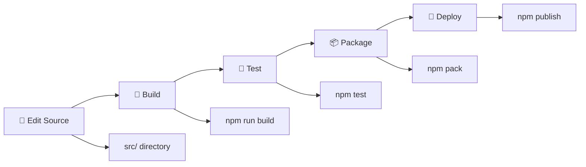

## project-overview

> name: SmartLead MCP Server Project Overview

---
name: SmartLead MCP Server Project Overview
description: Complete project structure guide and navigation for the SmartLead MCP Server
author: LeadMagic Team
version: 1.0.0
# 🚀 SmartLead MCP Server - Project Overview & Navigation

> **Quick Start**: This is your complete guide to the SmartLead MCP Server codebase. Use this to understand the project structure, find files quickly, and navigate the architecture.

## 🎯 **What is This Project?**

The **SmartLead MCP Server** is a comprehensive Model Context Protocol (MCP) server that provides complete access to SmartLead's cold email automation platform through AI coding assistants like Claude, Cursor, Windsurf, and Continue.dev.

### **🔥 Key Stats**
- **116+ MCP Tools** covering the complete SmartLead API
- **9 API Modules** for different functionality areas
- **TypeScript-first** with comprehensive type safety
- **Production-ready** with proper error handling
- **Cross-platform** (macOS, Linux, Windows)

## 🏗️ **Architecture Overview**

### **🚪 Entry Points** (Start Here)
```
📁 Root Entry Points
├── 🎯 src/index.ts          → Main CLI entry point (server/installer router)
├── 🖥️  src/server.ts         → MCP server implementation (registers all tools)
└── 🎨 src/installer.tsx      → Beautiful React Ink installer with purple gradients
```

### **🧠 Core Components**
```
📁 Core System
├── 🔌 src/client/index.ts    → Modern SmartLead API client (aggregates all modules)
├── 🛠️  src/client/base.ts     → Base HTTP client (retry logic, error handling)
└── 📋 src/types.ts           → Global TypeScript types & Zod validation schemas
```

## 📂 **Directory Structure Map**

### **🔧 API Modules** (`src/modules/`)
> Each module handles a specific SmartLead API category

```
📁 src/modules/
├── 🎯 campaigns/client.ts        → Campaign management & automation
├── 👥 leads/client.ts            → Lead & prospect management  
├── 📧 email-accounts/client.ts   → Email account management & warmup
├── 📊 analytics/client.ts        → Analytics & reporting data
├── 📈 statistics/client.ts       → Statistics & performance metrics
├── 🚀 smart-delivery/client.ts   → Deliverability optimization & spam testing
├── 🤖 smart-senders/client.ts    → Domain & sender reputation management
├── 🔗 webhooks/client.ts         → Webhook management & automation
└── 👤 client-management/client.ts → Team & client management
```

### **🛠️ MCP Tools** (`src/tools/`)
> Each tool file exposes SmartLead functionality as MCP tools

```
📁 src/tools/
├── 📋 index.ts              → Central tool registration exports
├── 🎯 campaigns.ts          → 14 campaign management tools
├── 👥 leads.ts              → 17 lead management tools
├── 📧 email-accounts.ts     → 15 email account tools
├── 📊 analytics.ts          → 18 analytics & reporting tools
├── 📈 statistics.ts         → 18 statistics tools
├── 🚀 smart-delivery.ts     → 11 deliverability tools
├── 🤖 smart-senders.ts      → 12 domain management tools
├── 🔗 webhooks.ts           → 9 webhook tools
└── 👤 client-management.ts  → 8 team management tools
```

### **⚙️ Configuration & Setup**
```
📁 Configuration Files
├── 📦 package.json           → NPM package config & dependencies
├── 🔧 tsconfig.json          → TypeScript compiler settings
├── 🎨 biome.json             → Biome linter & formatter config
├── 🔒 .env.example           → Environment variables template
└── ⚙️  mcp-settings-example.json → MCP client configuration template
```

### **📚 Documentation Hub**
```
📁 Documentation
├── 🏠 README.md              → Marketing-optimized project overview
├── 📖 INSTALLATION.md        → Detailed installation & setup guide
├── 🏗️  PROJECT_STRUCTURE.md  → Comprehensive architecture documentation
├── 🔒 SECURITY.md            → Security best practices & guidelines
└── 📝 CHANGELOG.md           → Version history & release notes
```

## 🎯 **Quick Navigation Guide**

### **🔍 Need to Find Something?**

| **I want to...** | **Go to...** | **File(s)** |
|------------------|--------------|-------------|
| 🚀 **Start the server** | Entry point | `src/index.ts` |
| 🛠️ **Add a new MCP tool** | Tools directory | `src/tools/[category].ts` |
| 🔌 **Add API functionality** | Modules directory | `src/modules/[category]/client.ts` |
| 📋 **Define new types** | Types file | `src/types.ts` |
| ⚙️ **Configure the project** | Config files | `package.json`, `tsconfig.json` |
| 📚 **Read documentation** | Docs | `README.md`, `INSTALLATION.md` |
| 🎨 **Customize installer** | Installer | `src/installer.tsx` |
| 🔧 **Debug issues** | Base client | `src/client/base.ts` |

### **🚦 Development Workflow**



## 🚀 **Key Features & Capabilities**

### **✨ What Makes This Special**
- 🎯 **Complete API Coverage**: 116+ tools covering every SmartLead endpoint
- 🎨 **Beautiful Installer**: React Ink interface with purple gradients
- 🔧 **Zero-config Setup**: Auto-detects and configures MCP clients
- 🛡️ **Production Ready**: Comprehensive error handling & security
- 🌍 **Cross-platform**: Works on macOS, Linux, Windows
- 📊 **Real-time Validation**: API key testing and environment setup

### **🎭 User Experience**
- 🚀 **One-command install**: `npx smartlead-mcp-by-leadmagic install`
- 🔄 **Auto-configuration**: Detects Claude Desktop, Cursor, etc.
- 🎨 **Beautiful UI**: Purple gradient terminal interface
- ✅ **Real-time feedback**: Live API validation and setup status

## 🛠️ **Development Quick Start**

### **📦 Installation**
```bash
# Install dependencies
npm install

# Build the project  
npm run build

# Start development
npm run dev
```

### **🔧 Key Commands**
```bash
npm run build     # Build TypeScript to dist/
npm run dev       # Development mode with hot reload
npm run test      # Run test suite
npm run lint      # Run Biome linter
npm start         # Start the built server
```

### **🎯 Adding New Features**
1. **New MCP Tool**: Add to `src/tools/[category].ts`
2. **New API Method**: Add to `src/modules/[category]/client.ts`
3. **New Types**: Add to `src/types.ts`
4. **New Documentation**: Update relevant `.md` files

## 🎉 **Ready to Develop?**

You now have a complete overview of the SmartLead MCP Server! Use the file references above to navigate quickly, and check out the other Cursor rules for specific development patterns and guidelines.

**Next Steps:**
- 🔧 Check `api-patterns.mdc` for development patterns
- 🛠️ See `mcp-tools.mdc` for tool implementation guide  
- 📝 Review `typescript-standards.mdc` for coding standards

1. **Source files** are in TypeScript under `src/`
2. **Build process** compiles to `dist/` directory
3. **Package** is published to NPM as `smartlead-mcp-by-leadmagic`
4. **Users install** via `npx smartlead-mcp-by-leadmagic install`

---
> Source: [LeadMagic/smartlead-mcp-server](https://github.com/LeadMagic/smartlead-mcp-server) — distributed by [TomeVault](https://tomevault.io).
<!-- tomevault:4.0:gemini_md:2026-05-13 -->
