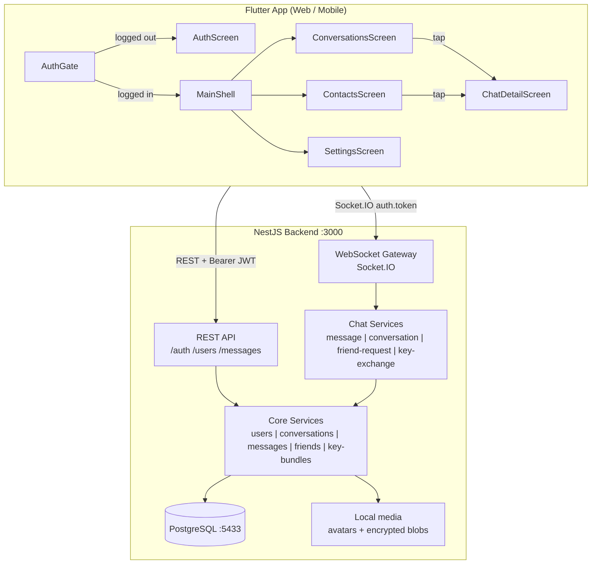
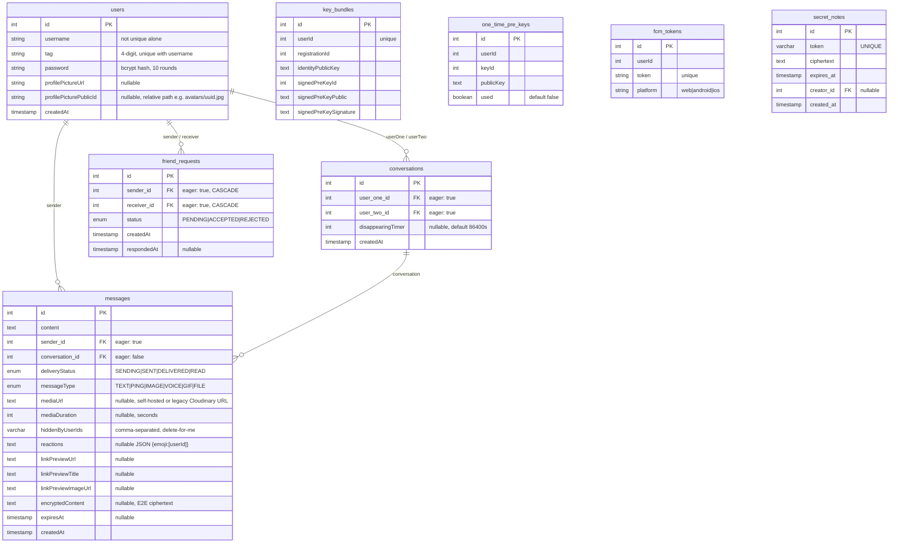

## fireplace

> - Always read this file before every code change


# CLAUDE.md — Fireplace

**Rules:**
- Always read this file before every code change
- Update this file after every code change
- **Before any review or code change:** read ALL files the task touches before writing anything; trace every code path; verify method/field/event names in actual source — never guess
- Single source of truth for agents — if CLAUDE.md says X, X is correct
- All code in English (vars, functions, comments, commits). Polish OK in .md files only

---

## 0. Quick Start

```bash
# Terminal 1: Backend + DB (auto hot-reload)
docker-compose up

# Terminal 2: Flutter web (press 'r' for hot-reload)
cd frontend && flutter run -d chrome
```

**Before start:** Kill stale node processes: `taskkill //F //IM node.exe`
**Low C: disk workaround:** `cd frontend && .\run_android_on_x.ps1` (sets `GRADLE_USER_HOME` + `TEMP`/`TMP` on `X:`, junction `frontend/build` → `X:\fireplace-build\frontend-build`; keep default Pub cache on `C:`). **Device:** `.\run_android_on_x.ps1 -DeviceId emulator-5554` (do not use `-d` here — PowerShell/flutter shim can misparse it as “Target file … not found”). Plain `flutter run` for Android still uses `%USERPROFILE%\.gradle` on `C:`; `flutter clean` does **not** clear it — corrupt `metadata.bin` there needs cache delete or using this script / `GRADLE_USER_HOME=X:\gradle-home`.

**Ports:** Backend :3000 | Frontend :random (check terminal) | DB :5433 (host) -> :5432 (container)

**Stack:** NestJS 11 + Flutter 3.x + PostgreSQL 16 + Socket.IO 4 + JWT + self-hosted media (`MEDIA_BASE_URL` / disk volume; Nginx `X-Accel-Redirect` in prod)

**Phone (same WiFi):** `cd frontend && .\run_web_for_phone.ps1` or `flutter run -d web-server --web-hostname 0.0.0.0 --web-port 8080 --dart-define=BASE_URL=http://YOUR_PC_IP:3000`

**Tests:** `cd backend && npm test` (233 unit tests, 30 suites, no DB required); `cd frontend && flutter test` (88 tests; includes `test/widgets/message/bubble_redesign_test.dart`). Media crypto round-trip tests skip when `webcrypto:setup` was not run (e.g. no cmake on Windows); the 20MB limit test always runs (throws before native crypto).

**Production:** https://fireplace.ignorelist.com — Google Cloud e2-medium VM (Warszawa), Docker + Nginx + Let's Encrypt. Deploy: SSH to server → `~/deploy.sh` (git pull + docker build + flutter web build).

---

## 1. Critical Rules & Gotchas

### TypeORM
- Always `relations: ['sender', 'receiver']` on friendRequestRepository queries — without: empty objects/crash
- Use find-then-remove for friend_requests delete — `.delete()` can't use nested relation conditions
- Always `new Date(val).getTime()` for expiresAt comparisons — TypeORM returns string or Date
- `deliveryStatus` never downgrades — enforced via `DELIVERY_STATUS_ORDER` map
- `synchronize: true` — column additions auto-apply on restart. No migrations

### Frontend
- `file_utils_stub.dart` / `file_utils_io.dart` — conditional import for temp file deletion (web: no-op; native: dart:io)
- Android 16KB page-size compatibility: `zipalign -P 16` can pass while app still shows compatibility warning — verify ELF `LOAD` alignment with `llvm-readelf -l` for `.so` files. In current state `webcrypto` (`libwebcrypto.so`) is built with `Align 0x1000` (arm64 + x86_64), while `libflutter.so` / `libdatastore_shared_counter.so` are 16KB-safe.
- `flutter pub run webcrypto:setup` is for `flutter test` / scripts only (builds `.dart_tool/webcrypto/...`), not for Flutter app plugin binaries packaged into APK/AAB.
- `frontend/patch_webcrypto_16k.ps1` patches cached `webcrypto` Android `CMakeLists.txt` with linker flags `-Wl,-z,max-page-size=16384 -Wl,-z,common-page-size=16384` to produce 16KB-compatible `.so` files; `run_android_on_x.ps1` executes it before `flutter run`.
- `MainActivity` package must match Android namespace/applicationId (`com.fireplace.app`); mismatch (`com.rpgchat.frontend`) causes runtime crash `ClassNotFoundException: com.fireplace.app.MainActivity`.
- Android build outputs should stay at the default `frontend/build` path for Flutter tooling; to use `X:` storage, map `frontend/build` to `X:\fireplace-build\frontend-build` via junction.
- Do not move `PUB_CACHE` to a different drive than the project root on Windows (`X:` vs `C:`) for Android builds; Kotlin incremental caches can fail with `IllegalArgumentException: this and base files have different roots`.
- Android/Kotlin workaround for mixed-drive cache paths: `frontend/android/gradle.properties` sets `kotlin.incremental=false` to avoid daemon cache-close failures on Windows.
- **Gradle “Could not read workspace metadata” under `%USERPROFILE%\.gradle\caches\8.14\transforms\... \metadata.bin`:** Corrupt or locked user Gradle cache on `C:` (often full disk, antivirus, interrupted build). **Fast bypass:** `cd frontend` → `.\run_android_on_x.ps1 -DeviceId emulator-5554` (uses `GRADLE_USER_HOME=X:\gradle-home`). **Or** before plain `flutter run`: `$env:GRADLE_USER_HOME='X:\gradle-home'` (ensure folder exists). **Repair default cache:** set `JAVA_HOME` to Android Studio JBR, `cd frontend/android` → `gradlew.bat --stop`; if deletes fail, close Android Studio and `taskkill /F /IM java.exe`; delete `%USERPROFILE%\.gradle\caches\8.14`; optionally `frontend/android/.gradle`; `flutter clean` → rebuild. **`flutter clean` alone does not fix this** — it does not remove `%USERPROFILE%\.gradle`.
- Emulator ANR note (Android 17 / ps16k image): `System UI isn't responding` can occur in `com.android.systemui`/launcher independently of app startup; verify with `adb logcat` (`ANR in com.android.systemui`, `Input dispatching timed out`) before blaming app code.
- **Android overscroll stretch:** Material 3’s `StretchingOverscrollIndicator` (default under `MaterialScrollBehavior`) warps the whole UI when dragging past scroll edges. `MaterialApp` sets `scrollBehavior: AppScrollBehavior()` (`theme/app_scroll_behavior.dart`) — `buildOverscrollIndicator` returns `child` only so lists still scroll but the screen no longer rubber-stretches globally.
- Use `showTopSnackBar()` — ScaffoldMessenger covers chat input bar; pass `AppLocalizations.of(context)` strings (`snackbar*` keys in `app_en.arb` / `app_pl.arb`) — do not hardcode English for top notifications
- Chat composer hint: `chatMessageHint` in `app_pl.arb` / `app_en.arb` (`ChatInputBar`). Chat date chips: `chatDateToday` / `chatDateYesterday` + `MaterialLocalizations.formatShortDate` for older days (`MessageDateSeparator`)
- `enableForceNew()` on Socket.IO reconnect — Dart caches socket by URL, old JWT reused
- Provider can't call Navigator — use `consumePendingOpen()` / `consumeFriendRequestSent()` patterns
- Do NOT call `getConversations()` or `getFriends()` in `onFriendRequestAccepted` — backend already emits updated lists; extra get* causes race and overwrites with stale data (conversation/contact lost on acceptor)
- On reconnect (same user), `connect()` must NOT clear `_conversations`/`_friends` so the UI does not flicker (empty → full) when socket reconnects after screen wake; use `isReconnect = (_currentUserId == userId)` (no `_conversations.isNotEmpty` check so slow first response does not cause clear). Preserve `_activeConversationId` on reconnect and in `onConnect` call `getMessages(_activeConversationId!)` so the open chat refetches and is not left empty. Backend `messageHistory` payload is `{ conversationId, messages }`; frontend ignores response when `conversationId != _activeConversationId` (avoids overwriting wrong chat).
- Guard `Platform` with `!kIsWeb` — `dart:io` crashes on web
- `copyWith` must include ALL fields — missing field = data silently lost
- Voice recording: mic must stay in widget tree — GestureDetector unmounts -> no events
- Chat send vs mic (idle): `RecordingController` stacks send + mic in a `Stack` (`Opacity` + `IgnorePointer`) so clearing the field after send does **not** swap widgets — swapping used to unmount/remount the input-row sibling and dismiss the soft keyboard on each in-app send (IME send was unaffected)
- Timer via `ValueNotifier<int>` — overlay rebuilds freeze timer
- `clearStatus()` in AuthProvider appears unused but is called from auth_screen.dart — DO NOT DELETE
- Always run `flutter analyze` before deleting "unused" methods
- Widget tests using `AppLocalizations` need delegates: `localizationsDelegates: AppLocalizations.localizationsDelegates, supportedLocales: AppLocalizations.supportedLocales` in `MaterialApp` — without them `AppLocalizations.of(context)` returns null and tests crash
- `blockedByUserIds` returns `Set.unmodifiable` — tests cannot mutate it directly; use `provider.onYouWereBlocked({'userId': X})` to set state
- `use_build_context_synchronously`: capture providers via `context.read<>()` before the first `await` in async methods
- Fire-and-forget futures: use `.ignore()` instead of `.catchError((_){})` — catchError requires callback to return the same type as the Future
- JWT payload no longer carries `profilePictureUrl`; `AuthProvider` loads user profile via `GET /users/me` in `_loadSavedToken`, `login`, and after avatar upload
- To avoid startup logout flicker, `_loadSavedToken` first decodes minimal user fields (`sub/username/tag`) from JWT for immediate local auth state, then refreshes with `/users/me`
- `_loadSavedToken`: if `fetchMe` returns 401, clear saved token/session; if network/server fails, keep token and let reconnect flow retry
- Authenticated media fetch: `/media/msgs/` downloads use `ApiService.fetchMediaBytes(url, token)` (sends `Authorization` only for own-server URLs); legacy external URLs (e.g. Cloudinary) still fetch without auth
- Android emulator media URL fix: backend can emit media URLs with `localhost`; `ApiService.fetchMediaBytes` rewrites loopback `/media/*` URLs to the host from `AppConfig.baseUrl` (e.g. `10.0.2.2`) before GET so GIF/image/file/voice media loads on Android emulator
- `PlaybackController` refactor: capture JWT token once in `_loadAndPlayAudio()` and pass it explicitly to `_downloadAndCache(url, token)` (no hidden token read inside helper)
- **Android FCM (data-only):** Backend sends `data: { type: new_message, unreadCount }` (string) — aggregate unread incoming messages for the recipient (`MessagesService.countTotalUnreadForRecipient`), no message body. Tray copy is localized (device locale pl/en) via `localizedNewMessagesBody` in `push_notification_body.dart`. `FirebaseMessaging.onBackgroundMessage` → `firebaseMessagingBackgroundHandler` calls `showNewMessagePushNotification(count)`; `AndroidNotificationDetails.number` + `DarwinNotificationDetails.badgeNumber` — **Android launcher icon usually shows a dot only** (not a numeric badge); tray text still shows the count. Same `id: 0` replaces the previous tray notification instead of stacking. Web SW `firebase-messaging-sw.js` uses `tag: 'new-message'` + same body rules. `main()` **awaits** `Firebase.initializeApp` then `registerFirebaseBackgroundMessageHandler()` (`push_background_registrar_io.dart` / stub on web via `dart.library.io`) **before** `runApp`. `PushService.initialize` runs `initPushLocalNotificationsPlugin()` after permission so the channel exists. Foreground: still no banner (`onMessage` empty — WebSocket path). Web: conditional exports avoid `flutter_local_notifications` on web; background registration no-op. `AndroidManifest`: `com.google.firebase.messaging.default_notification_channel_id` = `fireplace_messages`. **iOS:** backend uses silent-style APNS payload; visible alerts may need separate verification or alert payload changes.
- **Android `flutter_local_notifications`:** `android/app/build.gradle.kts` sets `compileOptions.isCoreLibraryDesugaringEnabled = true` and `dependencies { coreLibraryDesugaring("com.android.tools:desugar_jdk_libs:2.1.4") }` — required or Gradle fails `:app:checkDebugAarMetadata` (“requires core library desugaring”).
- `ChatDetailScreen` message loading uses `MessagingProvider.getMessages(conversationId)` (single entry point)
- Message pagination: `MessagingProvider` tracks `_hasMore/_isLoadingMore/_paginationOffset`, `loadOlderMessages()` is triggered near scroll top, and chat screen preserves visual position when prepending
- Pagination guard cleanup: if `messageHistory` is ignored due to conversation mismatch while pagination is active, reset `_isLoadingMore`/`_isPaginationLoad` to avoid a stuck loading state
- Multiple backends: if weird data, kill local `node.exe`, use Docker only
- Mobile _openChat: only Navigator.push; ChatDetailScreen initState calls openConversation (avoids double getMessages and decrypt loop)
- `_conversationCache` in MessagingProvider: per-conversation RAM cache (`Map<int, List<MessageModel>>`) for the current session. Populated by `onMessageHistory` (first snapshot after parse/filter, second after `_decryptMessageHistory` completes). Updated by `_handleIncomingMessage` (plain path and encrypted `.then()`), `_handleMessageDelivered` (when `index != -1` in `_messages` so `_messages` snapshot matches that chat), `_handleMessageDeleted`. Entry removed by `_handleChatHistoryCleared`,
  `onConversationDeleted`. Fully cleared by `clearAll()` (logout only). NOT cleared by `clearMessages()` (back navigation) or `onConnect` (socket reconnect). `ChatDetailScreen` calls `loadCachedMessages` before `getMessages`. `ChatDetailScreen` uses `ListView(reverse: true)`: `pixels = 0` is the visual bottom (newest message), eliminating the need to chase `maxScrollExtent`. `jumpTo(0)` / `animateTo(0)` are always correct regardless of lazy build state. `_userHasScrolledChat` (set by `NotificationListener<UserScrollNotification>`) suppresses auto-scroll-to-bottom while the user reads history; cleared when `pixels <= _scrollToBottomThreshold` in `_onScroll`. Pagination trigger: `maxScrollExtent > 0 && pixels >= maxScrollExtent - 300` (near visual top; guards short non-scrollable lists). `loadCachedMessages(id)` returns bool — true when RAM cache was applied. `_effectiveActiveConversationId` (test override OR `ConversationsProvider.activeConversationId`) is used in `onMessageHistory` and incoming-message paths.

### Backend
- `ChatValidationService.validateCanMessage(senderId, recipientId)` — shared validation for blocked + friends; used by sendMessage, startConversation
- mediaUrl (non-E2E / legacy) must match `MEDIA_URL_REGEX` in `chat.dto.ts` — Cloudinary `https://res.cloudinary.com/.../(video|image|raw)/upload/...` or self-hosted `${MEDIA_BASE_URL}/media/...` (prevents SSRF)
- Delete account cascade: key bundles -> OTPs -> msgs -> convs -> friend_reqs -> user (no cascade on User entity)
- `conversationsService.delete()` deletes msgs first (no cascade)
- Chat services: critical failures stop execution; non-critical (emit lists) log and continue
- Skip server-side link preview when `encryptedContent` present (server can't read content)
- Reply-to preview: MessageMapper uses "Encrypted message" when replyTo has encryptedContent; frontend fallback for `[encrypted]`
- `handleMessageDelivered` verifies caller is recipient (not sender) — ownership enforced
- `handleStartConversation` requires friendship — blocks strangers from opening DMs
- `handleStartConversation` emits `conversationsList` + `openConversation` to caller only; recipient gets only `conversationsList` (B does not auto-open chat; B sees unread badge when A sends first message)
- OTP claim is atomic: `UPDATE ... WHERE id = (SELECT ... LIMIT 1) RETURNING *` in `key-bundles.service.ts`
- `isBlockedByEither` uses single OR query (one DB round-trip, not two)
- `_conversationsWithUnread` uses `Promise.all` — parallel, not sequential
- `findByConversation` uses DB-level `skip`/`take` when no hidden messages
- `og:image` from link preview validated via `isSafeImageUrl` (HTTPS + non-private host only); IPv6 brackets stripped before regex; backend resolves relative og:image URLs using pageUrl
- WS rate limiting: `WsThrottlerGuard` on `sendMessage` — per-user tracker (user id); `@Throttle({ default: { limit: 300, ttl: 900000 } })` on `handleSendMessage` overrides the global module default (100/15 min) so one active user cannot exhaust the cap and lose all outbound sends until the window expires. Guard provides mock `res` with no-op `header()` (Socket has no such method; ThrottlerGuard expects it)
- WS throttling also guards read-heavy events: `getMessages/getConversations/getFriends/getFriendRequests/getBlockedList` use `300/15m`; `searchUsers` uses `30/60s`; `fetchPreKeyBundle` uses guard-only with global limits
- JWT invalidation after password change: `User.passwordChangedAt` is set in `resetPassword`; `JwtStrategy.validate()` rejects when `payload.iat <= passwordChangedAt` (seconds precision)
- `GET /media/msgs/:filename` is JWT-guarded; avatars remain public
- Avatar uploads validate actual file bytes (JPEG/PNG magic bytes) in both media upload avatar path and users profile-picture endpoint
- Health endpoint added: `GET /health` runs `SELECT 1` and returns `503` on DB failure (for Docker healthcheck)
- Raw SQL in `markConversationAsReadFromSender`: use `"deliveryStatus"` (quoted) — PostgreSQL column is camelCase
- `messages` table has composite index `idx_messages_conv_created` on `(conversation_id, createdAt DESC)` — auto-created in dev via synchronize; production requires manual: `CREATE INDEX CONCURRENTLY idx_messages_conv_created ON messages (conversation_id, "createdAt" DESC);`
- WS throttle guards: `@UseGuards(WsThrottlerGuard)` + `@Throttle(...)` must appear on ALL mutating WebSocket events — global ThrottlerModule only covers HTTP
- SSRF: `PRIVATE_IP_RE` in `link-preview.service.ts` blocks `169.254.x`, `fe80:`, RFC-1918 and loopback — verify coverage when adding new IP range exclusions
- `_conversationsWithUnread` uses batch `countUnreadForRecipientBatch` + `getLastMessagesBatch` (2 queries total, not 2N)
- Production: logger level `['error','warn','log']` — no debug
- friend_requests: unique index on (sender, receiver)

### E2E Encryption
- **`uploadOneTimePreKeys` payload:** must be `{ keys: [...] }`, not a bare array. `EncryptionProvider` emits via `_emit` (same as `socket.emit`) and must match `UploadOneTimePreKeysDto`; a raw list fails backend validation (`unknownValue` / non-object root).
- Fresh install: 20 one-time pre-keys (not 100) for fast startup; preKeysLow replenishes when < 10
- Pre-key storage: parallel writes (Future.wait); replenishment uses chunked parallel (25 at a time)
- `EncryptionService.decrypt()` returns `Future` — must use async patterns
- Message history decrypts async: renders immediately, then decrypts in-place with `notifyListeners()`
- Own messages skip decryption (sender has plaintext from optimistic display)
- Conversation list shows "Encrypted message" for encrypted lastMessage (not decrypted at list level)
- Session establishment uses Completer with 10s timeout — on failure, message marked as failed (no unencrypted fallback)
- Send when recipient offline: on encrypt/session failure we clear `_pendingPreKeyFetches[recipientId]` so retry gets a fresh pre-key fetch. If failure is key-bundle or timeout, we schedule a single delayed retry (4s) so when recipient logs in and uploads keys, the message can send without user tapping Retry. Manual Retry cancels the delayed retry; connect/logout cancels it via `_cancelDelayedRetryIfAny()`.
- Keys NOT cleared on logout (persist for re-login). Only cleared on account deletion via `clearEncryptionKeys()`
- All Signal store keys use `e2e_${userId}_` prefix — multi-account isolation in same browser
- `clearAllKeys()` uses selective deletion (reads all, deletes by prefix) — never wipes other data
- **DualStorage**: All Signal stores use `DualStorage` (writes to both `flutter_secure_storage` AND `SharedPreferences`). On web, IndexedDB+WebCrypto can lose data when all tabs are closed; localStorage (SharedPreferences) is the reliable fallback. Reads try flutter_secure_storage first, then SharedPreferences.
- Web: WebOptions(dbName: 'FireplaceE2E') for app-specific storage; Privacy & Safety shows web key-storage warning
- **Cache-first history decryption**: `_decryptMessageHistory` checks persisted cache (SharedPreferences/localStorage) BEFORE attempting live decryption. Avoids unnecessary session ratchet advancement and recovers messages when keys are lost. `EncryptionProvider` owns this cache via `saveDecryptedContent()` / `getDecryptedContent()` and an in-memory `_decryptedContentCache`; `MessagingProvider` no longer accesses `EncryptionService` directly and uses only `EncryptionProvider`'s delegation methods for decrypted-content persistence.
- `_pendingSendContent: Map<String, Map<String, dynamic>>` stores tempId→{content, messageType?, mediaUrl?, mediaDuration?, mediaKey?, mediaIv?, linkPreviewUrl?, ...} when any send method creates the optimistic message; extra fields added in `_encryptAndSend()`. Survives `_messages` list overwrites (e.g. `messageHistory` arriving before `messageSent`). Cleared on both fresh connect and reconnect in `onConnect`. Drained in `_addMessageToState`. CRITICAL: for image/voice/GIF/file, write `mediaKey`/`mediaIv` immediately after `MediaCryptoService.encrypt()` and **before** `uploadEncryptedMedia` / further awaits — if `messageHistory` interleaves, `_addMessageToState` must already see key+IV or they are lost.
- `retryFailedMessage`: if upload already succeeded, the optimistic `MessageModel` holds `mediaUrl` + `mediaKey` + `mediaIv`; retry calls `_encryptAndSend` again (image/GIF/file always; voice when `mediaUrl` is `http…` and keys present). Legacy Cloudinary media retries omit keys. GIF failures after upload are retriable; GIF failures before upload still cannot retry without re-picking.
- `_initializeE2E()` skips `_encryptionService.initialize()` when `_e2eInitialized = true` (reconnect path) — prevents transient mobile storage errors from setting `_e2eInitialized = false` and causing all history messages to become permanently `[Decryption failed]`. Key bundle re-upload still runs on every connect.

---

## 2. Architecture Overview



**State Management:** 7 providers (ChangeNotifier): `AuthProvider` (login/logout/token/user), `ConnectionProvider` (socket lifecycle, connect/disconnect, reconnect), `ConversationsProvider` (conversation list, active chat, unread counts), `MessagingProvider` (messages, send/receive, E2E orchestration, typing — same library split: `abstract class _MessagingProviderBase extends ChangeNotifier` + fields/lifecycle in `messaging_provider.dart`, behavior in `part` mixins `messaging_provider_{handlers,send,e2e}.dart`, concrete `class MessagingProvider extends _MessagingProviderBase with ... {}`; cross-mixin calls use abstract method stubs declared on the base class), `FriendsProvider` (friends, requests, blocking, search), `EncryptionProvider` (E2E keys, session management), `SettingsProvider` (themeMode: light/dark/blue; locale: pl/en, default pl). Services: `SocketService` (Socket.IO, event-map pattern), `ApiService` (REST), `EncryptionService` (Signal Protocol), `MediaCryptoService` (AES-256-GCM for message media blobs in isolate), `LinkPreviewService` (OG metadata).

**Provider wiring:** ConnectionProvider orchestrates socket events and routes them to sub-providers via `on()` listeners. Sub-providers receive an `_emit` callback for sending socket events. Cross-provider calls use explicit method interfaces (`removeConversationsForUser`, `updateLastMessage`, etc.). Wired in `conversations_screen.dart` initState.

**Backend services:** `ChatGateway` (thin, ~406 LOC, pure delegation) delegates to `ChatMessageService`, `ChatConversationService`, `ChatFriendRequestService`, `ChatKeyExchangeService`, `ChatPresenceService`, `ChatBlockService`, `ChatSearchService`, `ChatReactionService`, `ChatLinkPreviewService`. REST: `AuthController`, `UsersController`, `MessagesController`. Mappers: `UserMapper`, `MessageMapper`, `ConversationMapper`, `FriendRequestMapper` — all have `toPayload()`.

**DTO validation:** `chat/utils/dto.validator.ts` — runtime validation via `class-transformer` + `class-validator`. DTOs in `chat/dto/`.

---

## 3. File Location Map

### Backend (`backend/src/`)

| Domain | Key Files |
|---|---|
| **Auth** | `auth/auth.service.ts`, `auth/auth.controller.ts`, `auth/jwt-auth.guard.ts`, `auth/jwt.strategy.ts`, `auth/password.constants.ts` |
| **Users** | `users/user.entity.ts`, `users/users.service.ts`, `users/users.controller.ts` |
| **Conversations** | `conversations/conversation.entity.ts`, `conversations/conversations.service.ts` |
| **Messages** | `messages/message.entity.ts`, `messages/message.mapper.ts`, `messages/messages.service.ts`, `messages/messages.controller.ts` (link-preview only) |
| **Media** | `media/local-storage.service.ts`, `media/media.controller.ts`, `media/media-cleanup.service.ts`, `media/media.module.ts`, `media/dto/upload-media.dto.ts` |
| **Friends** | `friends/friend-request.entity.ts`, `friends/friends.service.ts` |
| **Chat** | `chat/chat.gateway.ts`, `chat/services/chat-{message,conversation,friend-request,key-exchange,presence,block,search,reaction,link-preview}.service.ts` |
| **DTOs** | `chat/dto/chat.dto.ts` + `{typing,recording-voice,...}.dto.ts` |
| **Key Bundles** | `key-bundles/key-bundle.entity.ts`, `key-bundles/one-time-pre-key.entity.ts`, `key-bundles/key-bundles.service.ts` |
| **Mappers** | `chat/mappers/{conversation,user,friend-request}.mapper.ts`, `messages/message.mapper.ts` |
| **FCM/Push** | `fcm-tokens/fcm-token.entity.ts`, `fcm-tokens/fcm-tokens.service.ts`, `push-notifications/push-notifications.service.ts` |
| **Secret Notes** | `secret-notes/secret-note.entity.ts`, `secret-notes/secret-notes.service.ts`, `secret-notes/secret-notes.controller.ts`, `secret-notes/secret-notes.module.ts` |
| **Utils** | `chat/utils/dto.validator.ts`, `chat/services/chat-validation.service.ts`, `chat/services/link-preview.service.ts`, `app.module.ts` |

### Frontend (`frontend/lib/`)

| Domain | Key Files |
|---|---|
| **Entry** | `main.dart`, `config/app_config.dart`, `constants/app_constants.dart` |
| **Models** | `models/{user,conversation,message,friend_request}_model.dart` |
| **L10n** | `l10n/app_pl.arb`, `l10n/app_en.arb`, `l10n/app_localizations.dart` (generated), `l10n.yaml` |
| **Providers** | `providers/{auth,connection,conversations,messaging,friends,encryption,settings}_provider.dart`, `providers/messaging_provider_{handlers,send,e2e}.dart`, `providers/chat_reconnect_manager.dart`, `providers/conversation_helpers.dart` |
| **Services** | `services/socket_service.dart`, `api_service.dart`, `encryption_service.dart`, `media_crypto_service.dart`, `link_preview_service.dart`, `gif_service.dart`; **push:** `push_service.dart`, `push_notification_body.dart`, `push_local_notifications.dart` (exports io vs web stub), `push_background_handler.dart`, `push_background_registrar_io.dart` / `push_background_registrar_stub.dart` |
| **Utils** | `utils/e2e_envelope.dart` (Signal plaintext envelope build/parse) |
| **Encryption** | `services/encryption/signal_stores.dart` (4 persistent Signal stores) |
| **Screens** | `screens/{auth,main_shell,conversations,contacts,settings,chat_detail,add_or_invitations,privacy_safety}_screen.dart` |
| **Widgets** | `widgets/{chat_action_tiles,conversation_tile,top_snackbar,avatar_circle,anti_quantum_note_dialog,gif_picker_sheet}.dart`; `widgets/message/{chat_message_bubble,text_message_content,image_message_content,gif_message_content,file_message_content,ping_message_content,voice_message_content,message_content_factory,message_metadata_row,reaction_chips_row}.dart`; `widgets/input/{chat_input_bar,recording_controller,attachment_handler,reply_preview_bar}.dart`; `widgets/audio/{playback_controller,waveform_display}.dart`. Old top-level `chat_message_bubble.dart`, `chat_input_bar.dart`, `voice_message_bubble.dart` are re-export shims. |
| **Theme** | `theme/rpg_theme.dart` (`FireplaceColors` ThemeExtension), `theme/app_scroll_behavior.dart` (`MaterialApp` scroll behavior — no stretch overscroll) |
| **Push** | `services/push_service.dart`, `push_notification_body.dart`, `push_local_notifications*.dart`, `push_background_*.dart`, `firebase_options.dart`, `web/firebase-messaging-sw.js` |

---

## 4. Database Schema



**Constraints:** `users` unique on `(username, tag)` — Discord-style `username#tag`. No cascade on User entity — `deleteAccount()` manually cleans dependents. `secret_notes.token` unique — used as the public URL token for one-time reveal.

---

## 5. How-To: Adding New Features

### Add a new WebSocket event:
1. Define DTO in `chat/dto/` with class-validator decorators
2. Add handler in `chat/services/chat-*.service.ts`
3. Add `@SubscribeMessage` in `chat/chat.gateway.ts` -> delegate to service
4. Add emit + listener in `services/socket_service.dart`
5. Register listener in `ConnectionProvider._registerEventListeners()` (routes to sub-provider), handle state + `notifyListeners()` in the target provider

### Add a new REST endpoint:
1. Add method in `*.service.ts`, route in `*.controller.ts` with `@UseGuards(JwtAuthGuard)`
2. Add API call in `services/api_service.dart`, call from provider/screen

### Add a new DB column:
1. Add to `*.entity.ts` (@Column) -> restart backend (auto-sync)
2. Update mapper if WebSocket payload, update frontend model (constructor, `fromJson()`, `copyWith()`)

---

## 6. Key Behaviors & Gotchas (Runtime)

**Optimistic messaging:** temp message (id=-timestamp, SENDING, tempId) → encrypt async → `sendMessage` → backend `messageSent` with tempId → replace temp with real.

**Blocking state:** `_blockedUsers` = blocked by me. `_blockedByUserIds` (Set) = users who blocked me — cleared on every connect (server doesn't replay `youWereBlocked` on reconnect). On `youWereBlocked`: add to set, remove from friends/conversations, clear active chat. When `friendsList` arrives, remove all friend IDs from `_blockedByUserIds` (clears "can't message" banner after unblock+re-add).

**consumePendingOpen / consumeFriendRequestSent / consumePendingFriendAccepted:** Provider stores ID/flag from socket event; screen polls and navigates/shows snackbar. Necessary because providers can't call Navigator.

**E2E envelope:** `{ content, messageType?, mediaUrl?, mediaDuration?, mediaKey?, mediaIv?, linkPreview? }` — `messageType` defaults to `TEXT` (backward compat). Server stores `messageType=TEXT`, `mediaUrl=null` (blind to real type). Ciphertext: `"{type}:{base64}"` (type 3 = PreKey, type 1 = Signal). Media keys travel **only** inside the envelope; `.bin` blobs on server are opaque.

**Delete actions:**

| Action | Deletes | Friend? | Event |
|---|---|---|---|
| Delete Conversation (swipe) | Messages + Conversation | Kept | `deleteConversationOnly` |
| Unfriend (long-press contacts) | FriendRequest + Conv + Messages | Removed | `unfriend` |
| Clear History (action tile) | Messages only | Kept | `clearChatHistory` |
| Delete for me (long-press msg) | Hidden for current user | Kept | `deleteMessage` mode=for_me |
| Delete for everyone (own msg) | Hard-deleted for both | Kept | `deleteMessage` mode=for_everyone |

---

## 7. Frontend Screens & Widgets

**Navigation:** AuthGate → AuthScreen OR MainShell (IndexedStack: Conversations, Contacts, Settings). Desktop >600px: sidebar+detail layout.

**Screen gotchas:**
- `AuthScreen`: `clearStatus()` on tab switch — DO NOT DELETE (called from auth_screen.dart, appears unused in providers)
- `ConversationsScreen`: `consumePendingOpen()` after `startConversation` resolves
- `ChatDetailScreen`: Timer.periodic 1s for expired msgs; `markConversationRead` on open
- `AddOrInvitationsScreen`: auto-send if 1 search result, picker if multiple; `consumeFriendRequestSent()`

**Widget gotchas:**
- Old top-level `chat_message_bubble.dart`, `chat_input_bar.dart`, `voice_message_bubble.dart` are re-export shims — do not delete
- `ConversationTile`: calls `MessagingProvider.onConversationDeleted` **and** optimistically removes row before socket ack — both must happen in the same gesture or dismiss animation gets stuck with stuck red background
- `ChatInputBar`: `minLines:1/maxLines:6` prevents chat `Column` overflow on long drafts
- `ChatBackgroundPattern`: radius snapped to device pixels to prevent moiré at high DPR
- **Chat message bubbles (Telegram-style):** Plain `MessageType.text` without `linkPreviewUrl` uses a bottom-right time overlay inside `TextMessageContent` (ghost `WidgetSpan` width ~66px + `Stack` + `Positioned`; `MessageContentFactory.build` optional `timeOverlay`). Text with link preview, ping, file: unchanged inline/below-row time from `_isShortMessage` + `MessageMetadataRow`. **GIF/image:** `GifMessageContent` / `ImageMessageContent` are full-bleed `SizedBox(width: double.infinity, height: 220)`, `BoxFit.cover`, no inner `ConstrainedBox(200)` / `ClipRRect`; `ChatMessageBubble` uses transparent fill, `EdgeInsets.zero` padding, `Clip.hardEdge`, and a dark pill `Positioned` time overlay on the media `Stack`. **Metadata colors:** `FireplaceColors.bubbleTimeMine` / `bubbleTimeTheirs` drive time + disappearing countdown + non-read ticks in `MessageMetadataRow` and voice footer (blue theme: icy `#E8F4FC` on sent bubble `#2481CC` instead of gray `timeColorDark`).

**Models:** `UserModel` (`displayHandle` getter), `ConversationModel` (immutable), `MessageModel` (`copyWith` for status/content/media). Frontend-only: `MessageDeliveryStatus.failed`.

---

## 8. Environment & Config

| Variable | Required | Purpose |
|---|---|---|
| `DB_HOST/PORT/USER/PASS/NAME` | Yes | PostgreSQL |
| `JWT_SECRET` | Yes | JWT signing (>=32 chars in prod) |
| `MEDIA_BASE_URL` | No | Public base URL for media links (default `http://localhost:3000`) |
| `MEDIA_DIR` | No | Backend filesystem root for avatars + `msgs/*.bin` (default `/app/media`) |
| `FIREBASE_SERVICE_ACCOUNT` | No | FCM push (graceful if missing) |
| `ALLOWED_ORIGINS` | No | CORS (comma-separated, strict in prod) |
| `BASE_URL` | No | Frontend dart define, defaults to `http://{host}:3000` |
| `GIPHY_API_KEY` | No | Frontend dart define for Giphy API (defaults to beta key in dev) |
| `METADATA_RETENTION_DAYS` | No | Reserved for future auto-purge of old metadata |

**Docker:** `db` postgres:16-alpine (5433->5432), `backend` node:20-alpine (:3000) with named volume `media_storage` mounted at `/app/media`. Frontend runs locally; `frontend/nginx.conf` proxies `/media/*` and internal `X-Accel-Redirect` for production web container.

**Firebase setup:** Copy `.example` files -> fill values: `firebase_secrets.dart`, `firebase-config.js`, `FIREBASE_SERVICE_ACCOUNT` env var.

---

## 9. Known Limitations

- E2E: no multi-device, no key recovery. Legacy Cloudinary media (no `mediaKey`) loads via direct URL. 20MB decrypt limit enforced before `MediaCryptoService.decrypt()`. Own history shows `[encrypted]` if storage evicted.
- No message edit, no fuzzy search, no iOS APNs
- No unique constraint on `(sender, receiver)` in friend_requests
- Large files: `chat-friend-request.service.ts`, `chat-message.service.ts`
- Migration scripts in `backend/scripts/` (manual)
- Metadata: server stores who/with-whom/when (see `docs/METADATA.md`); future privacy options in `docs/plans/2026-03-11-metadata-privacy-design.md`
- `secret_notes` table: `synchronize: true` auto-creation — requires `NODE_ENV=development` in docker-compose
- Android 16KB warning root cause currently points to `webcrypto` 0.6.0 native library alignment (`libwebcrypto.so` `LOAD Align 0x1000`); package has no newer pub release yet.
---

**Maintain this file.** After every code change, update the relevant section.

---
> Converted and distributed by [TomeVault](https://tomevault.io/claim/Lentach) — claim your Tome and manage your conversions.
<!-- tomevault:4.0:gemini_md:2026-04-09 -->
