## hikami-go

> > - [`AGENTS.md`](./AGENTS.md) — **ZCode Agent 运行时上下文**(每个任务启动时自动读取)。聚焦"Agent 工作时最常用"的命令、约定、结构与边界,内容自包含、轻量。

# Hikami-Go

> **📄 文档分工说明**
> - [`AGENTS.md`](./AGENTS.md) — **ZCode Agent 运行时上下文**(每个任务启动时自动读取)。聚焦"Agent 工作时最常用"的命令、约定、结构与边界,内容自包含、轻量。
> - `CLAUDE.md`(本文件)— **详尽的人类可读参考**:项目愿景、完整架构图(Mermaid)、28 模块逐一解析、数据流、编码规范。Claude Code 等工具读取;ZCode 仅在 onboarding 时作为一次性迁移源。
> - 修改工程约定时,**优先更新 `AGENTS.md`**(ZCode 实际依赖它);架构性大改动再同步本文件。两者共享同一份"真实信息",只是详略与受众不同。
>
> **🗂 `.claude/` 目录说明**:本仓库根的 `.claude/index.json`(及历史上的 `.claude/`)是 **Claude Code 时代的遗留物**,本项目已全面切换到 ZCode。ZCode 运行时不读取 `.claude/`(ZCode 只认 `.claude-plugin/plugin.json`,与本目录无关)。该目录按用户决定**保留但标注**,不再维护;`AGENTS.md` 才是 ZCode 的真实入口。

## 项目愿景

Hikami-Go 是面向 B 站主播的单机自动化直播音频处理服务。它用 Go 完成 B 站直播音频流录制、回放发现与下载、手动导入、ASR 转写、AI 直播回顾生成、WebDAV 归档上传和 B 站专栏发布，统一抽象为"来源适配 + 标准化 + 后处理"管道。发布成功后可选自动归档到 WebDAV（状态旁路任务，不推进会话主状态）。系统不保存视频画面，最终交付为单个服务二进制 + 外部工具运行时依赖。

## 架构总览

单机 Go 服务，SQLite 单文件数据库，Gin HTTP + WebSocket，自研 goroutine 任务池。所有来源统一进入标准化模块后，走相同的 ASR / 回顾 / 上传 / 发布管道。技术栈见下方，模块结构图见本文末。

**核心数据流：**

```text
来源适配器          标准化           后处理
  live_record  --> normalize --> asr --> recap --> upload --> publish
  replay_download                 |                              |
  manual_import                   |                              v
                          场次状态机 (state)            archive (状态旁路: published → 不改主状态, 仅写 archived_at)
```

**场次生命周期：**

```text
discovered --> downloading/recording/importing --> media_ready
  --> asr_submitted --> asr_done --> recap_done --> uploaded --> published
  (任何状态可 --> failed，失败状态可恢复到后续管道节点)

注：archive 从 published 出发，是「状态旁路任务」——不调用 states.Apply、不发 Event，
    成功后仅写 archived_at 时间戳；失败时由 cmd/hikami 特判只写 last_error，不降级 published。
```

**技术栈：**

| 组件 | 选型 |
|------|------|
| 语言 | Go 1.25.5 |
| HTTP 框架 | Gin |
| WebSocket | gorilla/websocket |
| 数据库 | SQLite (modernc.org/sqlite, 纯 Go 无 CGO) |
| 配置 | Viper (YAML) |
| 日志 | slog (结构化 JSON,输出 stdout；生产经 systemd 进 journald) |
| 定时任务 | robfig/cron/v3 |
| 外部工具 | ffmpeg, ffprobe, yt-dlp, rclone |
| AI | DashScope ASR + OpenAI-compatible/Anthropic 回顾生成 |
| 前端 | Vue 3 + Vite (内嵌 SPA)；V10 自建 H* 组件库（19 个），已移除 Element Plus |

## 模块结构图

```mermaid
graph TD
    ROOT["hikami-go (根)"] --> CMD["cmd/hikami"]
    ROOT --> INTERNAL["internal"]
    ROOT --> WEB["web"]

    INTERNAL --> CONFIG["config"]
    INTERNAL --> DB["db"]
    INTERNAL --> FSUTIL["fsutil"]
    INTERNAL --> AIPROV["aiprovider"]
    INTERNAL --> RUNTIME["runtime"]
    INTERNAL --> BILIUTIL["biliutil"]
    INTERNAL --> CHANNEL["channel"]
    INTERNAL --> SESSION["session"]
    INTERNAL --> STATE["state"]
    INTERNAL --> WORKER["worker"]
    INTERNAL --> HANDLER["handler"]
    INTERNAL --> SOURCE["来源适配"]
    INTERNAL --> PIPELINE["处理管道"]
    INTERNAL --> SCHEDULER["scheduler"]
    INTERNAL --> SECRETS["secrets"]
    INTERNAL --> RUNTIMECFG["runtimeconfig"]
    INTERNAL --> GLOSSARY["glossary"]
    INTERNAL --> NOTIFY["notify"]
    INTERNAL --> ARCHIVE["archive"]

    SOURCE --> DISCOVER["discover"]
    SOURCE --> DOWNLOAD["download"]
    SOURCE --> LIVE_REC["live_record"]
    SOURCE --> IMPORTER["importer"]

    PIPELINE --> NORMALIZE["normalize"]
    PIPELINE --> ASR["asr"]
    PIPELINE --> RECAP["recap"]
    PIPELINE --> UPLOAD["upload"]
    PIPELINE --> PUBLISHER["publisher"]
    PIPELINE --> ARCHIVE2["archive(状态旁路)"]

    click CMD "./cmd/hikami/CLAUDE.md" "查看 CLI 入口文档"
    click CONFIG "./internal/config/CLAUDE.md" "查看配置模块文档"
    click DB "./internal/db/CLAUDE.md" "查看数据库模块文档"
    click FSUTIL "./internal/fsutil/CLAUDE.md" "查看原子文件写入模块文档"
    click AIPROV "./internal/aiprovider/CLAUDE.md" "查看 AI Provider 类型文档"
    click RUNTIME "./internal/runtime/CLAUDE.md" "查看运行时探测文档"
    click BILIUTIL "./internal/biliutil/CLAUDE.md" "查看 B 站工具文档"
    click CHANNEL "./internal/channel/CLAUDE.md" "查看主播管理文档"
    click SESSION "./internal/session/CLAUDE.md" "查看场次管理文档"
    click STATE "./internal/state/CLAUDE.md" "查看状态机文档"
    click WORKER "./internal/worker/CLAUDE.md" "查看任务池文档"
    click HANDLER "./internal/handler/CLAUDE.md" "查看 API 文档"
    click DISCOVER "./internal/discover/CLAUDE.md" "查看回放发现文档"
    click DOWNLOAD "./internal/download/CLAUDE.md" "查看下载模块文档"
    click LIVE_REC "./internal/live_record/CLAUDE.md" "查看直播录制文档"
    click IMPORTER "./internal/importer/CLAUDE.md" "查看导入模块文档"
    click NORMALIZE "./internal/normalize/CLAUDE.md" "查看标准化模块文档"
    click ASR "./internal/asr/CLAUDE.md" "查看 ASR 模块文档"
    click RECAP "./internal/recap/CLAUDE.md" "查看回顾生成文档"
    click UPLOAD "./internal/upload/CLAUDE.md" "查看上传模块文档"
    click PUBLISHER "./internal/publisher/CLAUDE.md" "查看发布模块文档"
    click SCHEDULER "./internal/scheduler/CLAUDE.md" "查看调度器文档"
    click SECRETS "./internal/secrets/CLAUDE.md" "查看密钥管理文档"
    click RUNTIMECFG "./internal/runtimeconfig/CLAUDE.md" "查看运行时配置覆盖文档"
    click GLOSSARY "./internal/glossary/CLAUDE.md" "查看术语表文档"
    click NOTIFY "./internal/notify/CLAUDE.md" "查看通知模块文档"
    click ARCHIVE "./internal/archive/CLAUDE.md" "查看归档模块文档"
    click WEB "./web/CLAUDE.md" "查看前端文档"
```



## 精简模块索引

| 路径 | 职责 | 测试用例 | 文档 |
|------|------|----------|------|
| `cmd/hikami` | CLI 入口、服务启动、自动触发链（normalize→asr→recap→publish→archive 的 SetOnSuccess 回调）、归档注入与旁路注册、初始化、Windows 系统托盘（systray tag，shutdownCoordinator sync.Once 幂等关闭 + 桌面模式文件日志 %LOCALAPPDATA%，2026-07-14）。2026-08-15 M14:自动链能力 gate 改实时探测,用户中途补齐配置后 auto ASR/publish/archive 不再被启动快照卡死(+4 测试) | 4 | [CLAUDE.md](./cmd/hikami/CLAUDE.md) |
| `internal/config` | YAML 配置加载、校验、默认值、DownloaderConfig、ASRS3Config、ArchiveConfig、ToolsConfig（yt-dlp/rclone 路径 web 可编辑）、Effective\* 默认方法、AdminToken/loopback 校验、ApplyOverrides（runtimeconfig 持久化覆盖，含 tools+mcp+vad+replay 段）。2026-07-19:`cron.discovery` 默认值 `@every 20m`→`""`(禁用,回放页发现回放改为独立 URL 入口,scheduler 不再自动遍历主播表下载;旧 config.yaml 显式配置维持不变)。2026-07-21:`DefaultDashScopeASRURL`/`DefaultDashScopeTasksURL` 常量 + `EffectiveASRURL()`/`EffectiveTasksURL()` 空串兜底(修复 ASR 配置丢失 BUG)。2026-07-22:新增 `MCPConfig`/`MCPServerConfig`(stdio/http/sse transport + 自定义请求头)/`MCPBuiltinConfig`(Brave/Tavily)+ `MCPSectionDTO`(presence-aware)+ `EffectiveMaxToolRounds()` 兜底 + ApplyOverrides mcp case(DB v36 runtime_settings 白名单 `+mcp`)。2026-07-25:`output_root` 默认值 `hikami-go`→`./data`(对齐文档约定,`hikami-go/` 与 module 同名 git 不自动忽略曾致录播产物误入暂存;main.go 启动检测旧目录打 WARN 引导迁移)+ `TestSetDefaults_OutputRoot` 回归防线。2026-07-27:新增 `VADConfig`(Enabled/ThresholdDB/MinSilenceSec/PaddingSec/DetectionMode 固定 peak/MinOutputRatio)+ `Validate()`(handler inline 调)+ `VADSectionDTO` + ApplyOverrides vad case(DB v38 白名单 `+vad`)+ setDefaults(`vad.enabled=true` 默认开,实测 -40dB/2s 降 3-10% ASR 计费)。2026-07-30:新增 `ReplayConfig`(AutoASR/AutoRecap)+ `ReplaySectionDTO` + ApplyOverrides replay case(DB v39 白名单 `+replay`)+ 纯函数 `ReplayAutoEnabled`/`IsReplaySourceType`(回放类全局自动开关「全局兜底,主播优先」判定,main.go 自动链复用,8 case 表驱动测试)。2026-08-13 PR#1:downloader 加 auto_retry/max_retry_attempts/max_concurrent/min_interval_seconds/failure_backoff_seconds 5 字段、VAD 加 engine+5 个 ina_* 字段(EffectiveEngine/InaPython/InaScript 兜底)、dashscope.temporary_storage_enabled | 49 | [CLAUDE.md](./internal/config/CLAUDE.md) |
| `internal/db` | SQLite 打开与 schema 迁移 (v39，含 runtime_settings 10 段 CHECK含mcp+vad+replay/archived_at/auto_recap/bypass_fail_state/glossary_candidates.ai_review)、DB 文件权限 0600 | 11 | [CLAUDE.md](./internal/db/CLAUDE.md) |
| `internal/fsutil` | 原子文件写入辅助（WriteFileAtomic/WriteJSONAtomic）。2026-08-15 L4:`RemoveTempCookieFiles`(启动清扫崩溃残留的 ytdlp 明文 cookie 临时文件) | 5 | [CLAUDE.md](./internal/fsutil/CLAUDE.md) |
| `internal/executil` | 子进程窗口隐藏辅助（HideWindow，Windows 桌面模式 `-H windowsgui` 下抑制子进程黑色控制台闪现；非 Windows no-op） | 0 | [CLAUDE.md](./internal/executil/CLAUDE.md) |
| `internal/aiprovider` | AI Provider 共享返回类型。2026-07-22:新增 `ToolCapableProvider` 接口(`GenerateWithTools(ctx, GenerateRequest)`) + `result.go` 加 Role/Message/Tool/ToolCall/GenerateRequest/GenerateResult.ToolCalls;OpenAI/Anthropic provider 实现 tool calling(请求体加 tools/tool_choice,parse 读 tool_calls)。空 tools 等价于 `Generate`(零回归契约测试) | 5 | [CLAUDE.md](./internal/aiprovider/CLAUDE.md) |
| `internal/mcp` | MCP 搜索工具集成(2026-07-22 新增,mark3labs/mcp-go v0.56.0)。Manager 管理外部 server(stdio/http/sse transport)+ 内置 in-process 搜索工具注册表(Brave `web_search`/Tavily `tavily_search`,key 空降级);`RunWithTools` agent loop(检测 ToolCalls→执行→回传→再调,maxRounds + token 预算 80% 阈值 + ctx 取消防护);Reload 热重载(inflight WaitGroup 排空 + drainServers);结果硬上限 1500 字。recap/glossary 通过包级函数变量 `RunToolsAwareGenerate` 间接调用(规避反向导入) | 19 | [CLAUDE.md](./internal/mcp/CLAUDE.md) |
| `internal/runtime` | 外部工具探测、FFmpeg 自动解析/下载/嵌入、健康检查、磁盘/Cookie 检查。2026-08-13 PR#1:probe 能力判定加 CLI provider 免 API key + DashScope 临时存储后端。2026-08-15 M4:txz 解包(ulikunitz/xz,BtbN linux 资产)+ linux manifest 钉版 autobuild tag | 31 | [CLAUDE.md](./internal/runtime/CLAUDE.md) |
| `internal/biliutil` | B 站 Cookie、登录、WBI、UA、加密工具、视频链接解析、view/playurl/弹幕 XML/seg.so API 客户端、buvid 设备指纹（-352 风控对抗共享层：GetBuvids 24h 缓存 + Invalidate 失效重试 + InjectBuvids replace 注入）、封面下载/回放标题清洗、b23.tv 短链解析（2026-08-08:`ResolveShortLink` 在 download.CreateFromURL 入口把短链 HTTP 解析为含 BV 长链,修复短链回放标题变 BV 兜底 + 弹幕缺失;失败降级不阻断,落地 host 校验属 B 站官方域）。2026-08-13 PR#1:`replay_date.go`(录播标题提取日期填 StartedAt)+ `ExtractVideoPart`/`ExtractVideoSourceID`(BV+p 构造 `_pNNN` 分 P 级来源标识)。2026-08-15/16 审核:H6 CheckCookieExpiry 剥 `#HttpOnly_` 前缀、M10 ResolveCookie level-1 降级告警 + Delete 引用检查(ErrAccountInUse)、L16 `SourceIDWithPart`(锚定 entry.ID 追加同款后缀;**2026-08-19 E2E 修正**:yt-dlp flat-playlist entry.id 常无 `BV` 前缀,锚定前从 rawURL 提取 BV 兜底,修复 discover 与 download-by-url 去重键脱节) | 98 | [CLAUDE.md](./internal/biliutil/CLAUDE.md) |
| `internal/channel` | 主播 CRUD、识别（-352 风控对抗：buvid 注入 + WBI 签名）、自动化配置（auto_record/auto_asr/auto_publish/auto_recap 三态）、per-channel 发布配置（2026-07-20 补 `publish_account_id` 全链路,打通 ResolveCookie level 1 channel override）。2026-07-19:`UnassignedID` 占位 channel + `EnsureUnassigned` 启动幂等 + `ListVisible` 过滤占位(回放页下载/导入不选主播时的兜底) | 69 | [CLAUDE.md](./internal/channel/CLAUDE.md) |
| `internal/session` | 场次 CRUD、去重、统计（GetStats/GetDashboardStats）、失败重试、local_available/archived_at 标记；CreateLive 同槽冲突返回 ErrAlreadyLive（不再复用/重置）。2026-07-21:新增 `ResetFailedSession` 方法(仅 ASR 失败可 reset + active task 原子守卫 + CAS 二次校验,保留 publish_target/published_at,不删 task 历史)。**2026-07-25:加守卫③.5**(reset 前 os.Stat audio.asr.mp3,缺失返回 ErrAudioFileMissing)+ **variadic NewStore(db, outputRoot...)**(向后兼容 50 处调用)+ 5 个 reset 错误哨兵,session_test +1 → 50 | 50 | [CLAUDE.md](./internal/session/CLAUDE.md) |
| `internal/state` | 场次聚合状态机与失败恢复、ApplyWithPublishTarget（published 为终态，无 publish_reverted 出口）。2026-08-13 PR#1:failed 补 `download_started` 入边(下载重试重入)。2026-08-15 M6:补 `import_started`/`live_record_started` 入边(对称) | 11 | [CLAUDE.md](./internal/state/CLAUDE.md) |
| `internal/worker` | 任务池、任务存储、Hub 广播、重试取消、Register+WithBypassFailState（状态旁路任务元数据）、任务实例级 BypassFailState（重新生成等非推进型任务失败不降级主状态）、live_record 进程接管回调、recoverRunning 两阶段（running 类型分发 + pending 孤儿重入队解除 scheduler 死锁）。2026-07-21:`syncSessionState` 加 attempt 校验(retry 复用同一 task ID 旧 attempt 延迟 callback 重查 DB 不匹配则丢弃,worker_test +2)。2026-08-01:`recoverRunning` 的 `asr`/`asr_poll`/`upload` 分支补 `syncSessionState` 同步 session 状态(对齐 live_record/default 分支,修复 ASR 阶段被 OOM 杀死后 session 卡 `asr_submitted` → 重排任务 `Apply(EventASRSubmitted)` 触发 `ErrInvalidTransition` → 误进 failed,worker_test +3)。2026-08-13 PR#1:`defer.go` `DeferredError`(下载限速等本地约束把任务退回 pending 延迟重入队,不加 attempt/不降级/不通知)+ download 任务按 `downloader.auto_retry` 策略自动重试。2026-08-15 M11:`CreateTaskIfNoActive`(INSERT…WHERE NOT EXISTS 原子幂等)+ `UpdatePayload`(draft_id 持久化)+ `EnqueueIfNoActive` | 54 | [CLAUDE.md](./internal/worker/CLAUDE.md) |
| `internal/handler` | Gin REST API、WebSocket、引导、诊断、配置导出/导入（9 段配置含 MCP+VAD+Replay+secrets 事务化持久化到 runtime_settings）、回顾模型列表（2026-07-15 精简到 DeepSeek 2 个，前端 HCombobox 支持手动输入）、DashScope/ASR S3/archive/tools/MCP/VAD/Replay 配置端点、stats/dashboard（单连接查询，已修复自死锁）、recap/regenerate 重新生成端点、glossary JSON 双格式导入、GET /channels/:id、运行时状态代际校验、admin token 认证中间件。2026-07-19:下载/导入空 channel_id 兜底 _unassigned + 新端点 POST /api/sessions/discover/preview-by-url(回放页 URL 驱动发现,解耦主播管理)。2026-07-20:`listBiliSeries` 加 `?channel_id=` query,走 ResolveCookie 三级链支持主播级发布账号拉文集。2026-07-21:新端点 `POST /api/sessions/:sid/reset`(ASR 失败 reset 入口,4 个 409 错误 case)+ `writeSessionDetail` helper 抽取,server_test +4。2026-07-23:MCP 配置段纳入配置备份导入导出(投影 DTO + 密钥走 Secrets,仿 WebDAV/ASRS3 范式),config_export_test +6。2026-07-25:writeError 新增 `ErrAudioFileMissing`→409(配合 session 守卫③.5,测试数不变);`TestDiscoverPreviewByURL` 加 account_id body 解析 case(preview-by-url 端点 body 字段 cookie_file→account_id)。2026-07-27:新端点 `GET/PUT /api/config/vad`(ASR 前置 VAD 静音裁剪配置,inline Validate 拒非法值)+ 配置导出/导入加 VAD 段(无密钥直接投影 VADSectionDTO,旧 bundle 缺段 nil 零回归)。2026-07-30:新端点 `GET/PUT /api/config/replay`(回放类全局自动开关)+ 配置导出/导入加 Replay 段(同 VAD 范式)+ **删除 recap-partial/recap-with-range 端点**(`POST /api/sessions/:sid/recap-partial` + `recap-with-range`,自定义时间段回顾功能下线),config_export_test +4/server_test +1 → 104。2026-08-13/14 PR#1+补丁:jsonBindErrorMessage 字段级 JSON 类型提示 + VAD ina_* 导出字段。2026-08-15 审核:H1 /ws token 鉴权、H2 onboarding dismissed 修正、P0 secrets 导入 key 白名单 + MCP Authorization 脱敏回显、M12 copy-config 源值污染 + 删账号 409 明细、L2 import 2GiB 上限(413) | 126 | [CLAUDE.md](./internal/handler/CLAUDE.md) |
| `internal/discover` | B 站回放发现（两步式预览勾选下载：PreviewAll 预览→Execute 执行；保留一步式 DiscoverAll 作回退；title_prefix 匹配原始标题在 CleanReplayTitle 之前）。2026-07-19:新增 `Preview(ctx, PreviewInput)` 不绑定 channel 表的预览(回放页 URL 驱动入口);**发现阶段默认走登录账号 cookie**(v3 拆双 helper:`resolveURLCookie`/`resolveChannelCookie`,账号池 cookie 加密场景走 LoadCookie 解密 + 临时明文文件给 yt-dlp,与下载链路对齐)。2026-07-25:**Cookie 选择改为选已登录 B 站账号**(`POST /api/sessions/discover/preview-by-url` body 字段 `cookie_file`→`account_id`);`resolveURLCookie` 插入「显式 account_id」分支复用 ResolveCookie 三级链(消除两份重复逻辑 + GetByID 预检查 + fallthrough WARN)。2026-07-29:**`previewFromEntries` 标题解析改有界并发**(`previewTitleConcurrency=5` semaphore,空标题视频走 5 路并发 resolveTitle,按序写回 + ctx 取消响应;配合 download 侧 viewClient 缓存修复把预览从 ~29s 压到 ~3-5s,修复「发现不了回放」)。2026-08-13 PR#1:`ReplayDateFromTitle` 填回放场次 StartedAt。2026-08-16 L14:SourceID 用 `SourceIDWithPart` 追加 `_pNNN` 分 P 后缀,多 P 合集各分 P 不互相去重 | 37 | [CLAUDE.md](./internal/discover/CLAUDE.md) |
| `internal/download` | 回放音频下载（native 单 P/多 P + yt-dlp 双后端，concat list 路径转义；2026-07-15 yt-dlp 注入 --ffmpeg-location + 单 P 补弹幕抓取）、单链接触发、CookieAccountStore cookie 解析。2026-07-29:`Handler` 加长生命周期 `viewClient *biliutil.VideoClient`(`ResolveDownloadTitle` 改用实例方法复用 BuvidStore/WBI 缓存,修复发现回放预览标题解析击穿缓存致 30s 超时)+ `SetViewClient` 测试注入 setter。2026-08-01:native 下载器改用「无进度超时 + 总超时」双层机制(修复长视频回放 `Body.Read` 长时间无字节流入被 `http.Client.Timeout` 误掐)+ `downloader_select` 新增 `isTransientNetErr`/`classifyNativeErr` 判定(暂态网络错误 auto 模式回退 yt-dlp,业务错误不回退),download_test +10。2026-08-08:`CreateFromURL` 入口插入 `ResolveShortLink`(经 `shortLinkResolver` 字段 + `SetShortLinkResolver` 测试注入,nil 兜底包级默认),把 b23.tv 短链解析为含 BV 长链,让下游 ExtractVideoID/cid/弹幕/标题统一受益,download_test +2。2026-08-13 PR#1:`risk_control.go` `downloadLimiter`(max_concurrent/min_interval/failure_backoff 批量下载保护,默认关零回归)+ `downloader.auto_retry` 仅 download 任务自动重试 + 显式 `?p=N` 只下载所选分 P。2026-08-15:X2 `SetLimiter` 预留注入点 + L3 probeDuration/concatAudio 透传 ctx | 76 | [CLAUDE.md](./internal/download/CLAUDE.md) |
| `internal/live_record` | 直播音频与弹幕录制、ffmpeg 进程接管（Adopt）、-352 频道级阶梯冷却（5/10/20m，CheckLive RefreshKeys+Invalidate 重试 + ErrRiskControl352 哨兵 + jitter）、重连按错误类型分支（selectStream→maxReconnect / CDN 瞬时→cdnRetryBudget）、HTTP 412/403/429 风控冷却（ErrHTTPRiskControl）、0 字节僵尸文件检测（ErrZeroByteStalled）+ 不增长检测（ErrRecordingNotGrowing）、probe 失败独立预算重连、**重连预算耗尽统一收口**(2026-08-08,`finishWithAudioIfAny` helper 统一 CDN/selectFail/afterRecord/probe-error 四条耗尽路径的「有音频→保留/无音频→失败」判定,补 8-3 漏掉的 CDN+selectFail 两分支裸 break)。2026-08-15:H3 取消收尾改 `context.WithoutCancel` 派生 ctx(任务取消不再卡 session 于 recording)、M5 重连分段统一编号 `segmentSeq`(混走 CDN/afterRecord 时 part 文件不互相覆盖) | 93 | [CLAUDE.md](./internal/live_record/CLAUDE.md) |
| `internal/importer` | 手动 multipart 导入 | 15 | [CLAUDE.md](./internal/importer/CLAUDE.md) |
| `internal/normalize` | 媒体标准化、弹幕解析（JSONL/XML/多 P 合并）、元数据生成、**convertAtomic 空文件 post-condition**(2026-07-25,ffmpeg exit 0+空输出时拒绝 Rename)。2026-08-13 PR#1:metadata 加 `duration_ms`(分 P 选页时长)。2026-08-15 M13:XML 弹幕 user_id 改取 user_hash(fields[6],dmid 每条唯一致去重虚高) | 71 | [CLAUDE.md](./internal/normalize/CLAUDE.md) |
| `internal/asr` | DashScope ASR、S3 存储后端、本地临时音频、公网 IP 检测、弹幕校正。2026-07-21:3 个调用点改用 `EffectiveASRURL()`/`EffectiveTasksURL()`(空串兜底,修复 ASR 配置丢失 BUG);新增 `dashscope_test.go` 4 个测试(EffectiveURLs 默认值 + Submit/CheckTask 用 `urlCapturingTransport` 捕获实际请求 URL 验证调用点)。2026-07-27:**ASR 前置 VAD 静音裁剪**(降 DashScope 计费 3-10%):`VADProcessor`(`vad_processor.go`,持 `*config.Config` 指针改参立即生效;Detect 跑 silencedetect 扫静音 + Trim 跑 atrim+concat 滤镜链 + BuildSilenceMap 区间→segment 表含 padding)+ `SilenceMap`(`vad_silence_map.go`,JSON 持久化 v1 + Load/round-trip)+ `NewHandler` 加 variadic `vadProc`(不传禁用零回归,main.go 装配注入);HandleTask 内 Detect→Trim→ASR→用 silence_map 反向映射回原始时间线;三层兜底(失败/裁剪比<min_output_ratio/缺 filter→用原始音频)。新增 4 文件 31 测试(vad_processor 14 + vad_silence_map 12 + vad_handler 3 + vad_integration 2)。2026-08-13 PR#1:DashScope 临时存储(`dashscope_temp_publisher.go`,直传 OSS 临时对象免自建存储)、inaSpeechSegmenter VAD 引擎(`ina_segmenter.go`+scripts/ina_segment.py,`vad.engine="ina"`+5 个 ina_* 配置)、`ErrNoSpeechDetected` 全静音跳过、SRT 时间线同步重建。2026-08-16 ISSUE-006:**dashscope_task_id 持久化关闭崩溃恢复双付费窗口**——`submittingTranscriber` 两阶段接口(SubmitASRTask/AwaitASRTask)+ submit 后立即持久化 taskID 进 payload(`SetTaskPayloadWriter` 注入 workerPool.Store())+ 恢复重入 await 轮询零付费 + 瞬态错误 fail-closed(不静默重提交)+ `ErrDashScopeTaskDead` 哨兵 + `remotePathFor` 与 publish 单一真相源 + G-1 CreateTask 改 EnqueueIfNoActive;删除 TranscribeWithTaskID 旧恢复接口 | 123 | [CLAUDE.md](./internal/asr/CLAUDE.md) |
| `internal/recap` | AI 回顾、模板、分段、续写、术语发现、符号化纯文本文章输出（emoji 前缀分行）、署名识别（hasGeneratedNotice 兼容改名过渡期变体）、术语校正词边界感知替换（replaceTermBoundaryAware，2026-07-16）、ResolvedTemplate snake_case json tag、local_available 守卫、CapabilityChecker 能力 gate、disabledProvider 禁用即禁用、CreateRegenTask（重新生成，覆盖本地 md 不碰 B站，带 BypassFailState）。2026-07-22:`generateRecap` 走 MCP 工具感知(有工具 + provider 实现 `ToolCapableProvider`→`mcp.RunWithTools`,否则普通 `Generate` 零回归);`aiprovider` 加 `ToolCapableProvider` 接口 + GenerateRequest/GenerateResult.ToolCalls(OpenAI/Anthropic 实现 GenerateWithTools,空 tools 等价于 Generate)。2026-07-30:**删除 `CreateTaskWithRange`/`canCreateRangeRecap`**(自定义时间段回顾功能下线,handler recap-partial/recap-with-range 端点同步删,续写 continuation 不受影响)。2026-08-13 PR#1:CreateTask 幂等(重叠提交复用活跃任务)+ 本地 CLI 串行 gate(API provider 不降并发)+ canHandleRecap 接受 failed + codex_cli stdin-only 免 key。2026-08-13 ISSUE-007:provider_openai 空 content 分流重试(+8 测试)。2026-08-15:MCP 空 content 守卫(H4)+ anthropic 分流重试(M1)+ claude_cli 空 model(H6)+ EnqueueIfNoActive(M11)+ live_type 赋值(L6) | 136 | [CLAUDE.md](./internal/recap/CLAUDE.md) |
| `internal/upload` | WebDAV 归档上传（rclone + 原生 WebDAV）、前置产物校验、清理策略+local_available 闭环。2026-08-15:M2 WebDAV 客户端 30min 整体超时(无响应不再永久挂起)、L5 Fetch 后本地目录存在性校验(防假成功置 local_available) | 40 | [CLAUDE.md](./internal/upload/CLAUDE.md) |
| `internal/publisher` | B 站专栏草稿/发布与 Markdown 转 Opus，含 -352 风控自动处理（buvid 注入 via 共享 BuvidStore + gaia 验证 + WBI 刷新重试）、封面来源解析（recap cover > 配置 cover_url 本地路径自动上传/网络 URL 原样）、local_available 守卫（专栏只能手动去 B站管理，本系统不删不改）。2026-07-20:`resolvePublishCookie` 改调 `ResolveCookie(ctx, null, channel.PublishAccountID, ...)` 让 level 1 channel override 真正生效(配合 channel.PublishAccountID 全链路打通)。2026-08-15/16:M11 发布链幂等(draft_id 经 payload 持久化 + 重试删旧草稿 + EnqueueIfNoActive + 超时人工确认提示)、canHandlePublish 放行 failed、X1 成功后置 Progress 降级告警、L7 truncateRunes | 74 | [CLAUDE.md](./internal/publisher/CLAUDE.md) |
| `internal/archive` | 发布后 WebDAV 归档（状态旁路任务：从 published 出发，不推进主状态仅写 archived_at），复用 upload.Copier/Deleter，与 upload 互斥 | 13 | [CLAUDE.md](./internal/archive/CLAUDE.md) |
| `internal/scheduler` | 定时发现、直播检查、告警任务。2026-07-19:`cron.discovery` 默认禁用(config.go SetDefault 改空串),scheduler 不再自动遍历主播表下载;CheckAll/CheckAndStartAll 用 ListVisible 过滤占位 | 13 | [CLAUDE.md](./internal/scheduler/CLAUDE.md) |
| `internal/secrets` | API Key 管理 | 9 | [CLAUDE.md](./internal/secrets/CLAUDE.md) |
| `internal/runtimeconfig` | 全局运行时配置覆盖持久化（runtime_settings 表 per-section JSON 10 段含 tools+mcp+vad+replay，SaveTx/WithTx 与 secrets 原子写入；启动由 ApplyOverrides 覆盖 config.yaml 基线） | 10 | [CLAUDE.md](./internal/runtimeconfig/CLAUDE.md) |
| `internal/glossary` | 术语表与 AI 术语发现候选（ImportJSON 双格式：对象/裸数组 fallback，ErrInvalidJSON→400）。2026-07-22:Discoverer 加 MCP 工具感知(`SetMaxToolRounds` 注入,有工具 + provider 支持→RunWithTools 核实候选,否则普通 Generate 零回归);新增 `review.go` `Review` 分批(10条)AI+搜索复核 pending 候选、更新 ai_review+confidence+canonical(status 保持 pending 保留人工把关)+ `UpdateCandidateReview`(DB v37 glossary_candidates ADD COLUMN ai_review) | 77 | [CLAUDE.md](./internal/glossary/CLAUDE.md) |
| `internal/notify` | 通知事件与发送器。2026-08-15 H7:Send 经 `WithoutCancel`+15s 超时派生 sendCtx(脱离调用方取消链,垂死任务通知可送达)+ `Configured()`/`SendTest()` + test 端点 409/500 修正 | 15 | [CLAUDE.md](./internal/notify/CLAUDE.md) |
| `web` | Vue 3 前端管理界面（V10 自建 H* 组件库 19 个含 HCombobox，移除 Element Plus；features 分域 + composables 收敛 + Vitest 测试 212 例/29 文件；设置页 4 折叠分组 V10 重写 + 录播/回放子 tab + 两步式发现回放抽屉 + 抽屉内重新生成回顾 + 回顾模型 HCombobox 手动输入；2026-07-20 新增 `ChannelPublishConfig.vue` 主播级发布字段表单 + StreamerDrawer/ChannelAdvancedConfig 联动；2026-07-21 sessionActions +8 用例覆盖 failed reset 入口 + ASR 失败识别,前端 192→200；2026-07-22 设置页加「AI 搜索(MCP)」折叠区 + `MCPCardV10.vue`(开关+max_rounds+Brave/Tavily key 只写+外部 server 增删改)；2026-07-24 v2 视觉统一 + Sora 字体本地嵌入(`styles/` 全局 token 入口,禁止组件内硬编码颜色/圆角/阴影)；2026-07-25 新增 `DiscoverPreviewDrawer.test.ts` 7 用例(发现回放抽屉首次有测试,Cookie 选择 HInput→HSelect 选账号),前端 200→207、27→28 文件；2026-07-27 新增 `VADCardV10.vue`(ASR 前置 VAD 5 字段表单:开关/阈值/最短静音/padding/最低裁剪比)+ `settings.ts` getVADConfig/updateVADConfig(过渡期手写,spec 已补 generated.ts 待重生成)+ `VADCardV10.test.ts` 5 用例,前端 207→212、28→29 文件；2026-08-16 审核修复批次:H5 HInput 透传 type/list、L8 tasks store inflight 去重、L9 `useSessionPagination`(列表收缩分页收敛)、L10 `useRecapDrawerContent`(openRecap 竞态守卫)、L11 发现抽屉勾选清空、L12 `/tasks` redirect 保 query,前端 212→242、29→36 文件） | 242 | [CLAUDE.md](./web/CLAUDE.md) |

完整路径、入口文件、测试数量见下方「精简模块索引」表。

## 详细文档索引

| 文档 | 内容 |
|------|------|
| [api-routes.md](./CLAUDE-detail/api-routes.md) | 所有 API 端点（~105 条）与通知事件完整清单 |
| [pipelines.md](./CLAUDE-detail/pipelines.md) | 回顾管道、术语发现、模板、续写、来源模式、健康检查、引导 |
| [frontend-types.md](./CLAUDE-detail/frontend-types.md) | TypeScript 类型定义与前端 API 模块说明 |
| [development.md](./CLAUDE-detail/development.md) | 构建、运行、配置（20 项）、完整编码规范、完整 AI 使用指引（逐模块深度） |
| [testing.md](./CLAUDE-detail/testing.md) | 测试策略和现有测试覆盖 |
| [promo-video/](./docs/promo-video/) | B 站宣传片完整制作包（2026-08-16，31 文件）：[00-overview.md](./docs/promo-video/00-overview.md) 入口 + 文稿/分镜/字幕 SRT/发布套件/AI 工具指引/TTS/选题 + `video/` Remotion 可渲染源码（`npx remotion render` 一条命令出 mp4） |
| [plans/](./plans/) | 活跃设计文档（当前无活跃计划）。已落地的历史计划归档于 [plans/archive/](./plans/archive/)（12 份，2026-07-17 自 `docs/plan-*` 迁入）：录播稳定性异常 #10/#11/P2 修复、auto_recap 默认值反转 + -352 风控加固、config + UI 修复、ASR 成本/失败清理/title_prefix 三项 issue、recap 模型手动输入、调查问题修复 2026-07-15、调查问题修复 2026-07-16（TemplateCardV10/术语词边界/ResolvedTemplate json tag） |

> 架构、技术栈、模块结构图、场次状态机、变更记录已并入本文（根 CLAUDE.md），不再单独拆分为 CLAUDE-detail 子文件，以消除拆分维护导致的漂移。

## 核心编码规范

- 单一 Go module：`hikami-go`；业务代码放在 `internal/` 下，前端放在 `web/`。
- 配置以 SQLite 为主来源，YAML 只负责全局配置和首次引导。
- 主播隔离：路径、任务、状态、锁必须携带 `channel_id`。
- 原始层不可覆盖：`raw/` 保存原始输入，后续产物写入 `asr/`、`package/`、`recap/`。
- 标准产物采用临时文件 + 校验 + rename 的原子写入方式。
- 外部工具交互必须通过接口抽象，便于单元测试和集成测试替身实现。
- 状态转换只由 `internal/state` 执行，业务模块不得直接散写 session 状态。
- 错误定义在各模块中，handler 层通过 `errors.Is` 映射 HTTP 状态码。
- Cookie、WBI、UA、Cookie 加密和路径校验统一走 `internal/biliutil`。
- 新增数据库结构只追加 `internal/db/migrate.go` 的 `migrations`，保持迁移幂等。
- WebSocket 必须执行 Origin 校验；敏感文件权限默认 `0600`，目录默认 `0700`。
- 前端按功能域组织组件，复用 `utils/lifecycle.ts`、`utils/friendlyStatus.ts` 和现有 composables。

完整规范见 [development.md](./CLAUDE-detail/development.md)。

## AI 使用指引

- 先读模块级 `CLAUDE.md` 和邻近代码，再修改；不要越过模块职责边界。
- 路由注册在 `internal/handler/server.go` 的 `routes()`；配置结构在 `internal/config/config.go`。
- 状态机转换表在 `internal/state/state.go` 的 `transitions`。
- 任务类型常量在各模块内定义，例如 `download.TaskType`、`normalize.TaskType`。
- 回顾生成主流程在 `internal/recap/handler.go`Provider 返回 `aiprovider.GenerateResult`；模板预设与符号化（emoji 前缀分行）纯文本格式在 `internal/recap/presets.go`。
- Cookie 查找优先使用 `CookieAccountStore.ResolveCookie`，不得各模块自行维护优先级。
- FFmpeg 路径解析由 `runtime.ResolveFFmpeg` 完成，支持系统 PATH / 嵌入资源 / 在线下载三级回退。
- 上传模块支持 rclone 和原生 WebDAV（gowebdav）两种后端，由 `WebDAVConfig.NativeConfigured()` 自动选择。
- 发布成功后归档到 WebDAV（`internal/archive`）是「状态旁路任务」：从 `published` 出发，**不**调用 `states.Apply`、不发任何 Event，仅写 `archived_at`；失败时由 `cmd/hikami` 的 `SetFailSessionStateFn`（签名含 `bypassState bool`，由 `worker.bypassFailState(taskType)` 判定，upload/archive 经 `worker.WithBypassFailState()` 注册声明）对旁路任务仅写 `last_error`（否则 `EventTaskFailed` 全局特判会把 `published` 降级为 `failed`）。归档复用 `upload.CleanupSession`/`Copier`/`Deleter` 后端（`guardStatus=published` 区分守卫态），`CreateTask` 与活跃 upload 互斥；`archive` 经 `worker.Register(..., WithBypassFailState())` 声明旁路（与 publish 同策略，失败后用户手动重试）。详见 [archive](./internal/archive/CLAUDE.md)。
- **自动触发链**（设计 4.1/4.3/4.5）：`cmd/hikami` 通过各模块 `SetOnSuccess(func(ctx, task))` 串联 `normalize→(auto_asr)→asr→recap→(auto_publish)→publish→(auto_after_publish)→archive` 全链。每段回调检查主播开关与对应能力后调下一阶段 `CreateTask`，失败仅 warn 不阻断。关键设计：① 回顾能力 gate **下沉到 `recap.CreateTask`**（注入 `CapabilityChecker`，复用 server 代际刷新快照，自动链与手动 API 走同一套校验，消除 main.go 启动快照陈旧导致的不一致）；② `recap_ai.enabled=false` 时 `NewConfiguredProvider` 返回 `disabledProvider`，`Generate` 抛 `ErrRecapDisabled`——禁用即禁用，不退回 LocalProvider 占位；③ 各业务 handler 内冗余的 `Apply(EventTaskFailed)` 已移除，失败降级统一由 worker 处理；④ per-channel `auto_recap` 为 `*bool` 三态（nil→`resolveAutoRecap(nil,true)` 默认开）。
- 回放下载支持 `downloader.backend: auto/native/ytdlp`：`auto` 默认先走 native BV 下载（单 P/多 P），遇非 BV、番剧等 `ErrNativeUnsupported` 时自动回退 yt-dlp；显式 `native`/`ytdlp` 为单后端。
- **前端嵌入由 `//go:build embedded_web` 控制**：`make build-go`/`make build` 自动加该 tag 且 `strings` 自检前端是否嵌入，`make build-go-api` 不带 tag（纯 API，启动打 WARN 降级到 fallback 页）；**CI release 的 TAGS 必须始终含 `embedded_web`**（embed_ffmpeg 仅 Windows 叠加），漏 tag 会让 `embed.go` 被排除导致前端静默丢失（`1781937` 曾踩坑）。
- ASR 临时音频发布支持三级后端：本地 HTTP 服务（优先）> S3 兼容对象存储 > rclone（回退），由 `ASRTempConfig.NativeConfigured()` 和 `ASRS3Config.Configured()` 自动选择。
- B 站专栏发布 API 的 -352 风控由 `BiliOpusClient` 内置处理（`doRequestWithGaia`）：buvid 指纹注入 + gaia 两步验证 + WBI 密钥刷新重试，业务层无需感知；`DeleteDraft` 走 `doRequest` 仅 WBI 刷新。
- 配置导出（`GET /api/config/export`）聚合 7 个全局配置段（recap_ai/publish/webdav/asr_s3/dashscope/archive/mcp）+ Secrets/Channels/Glossary/Templates/BiliAccounts 为 JSON；WebDAV/ASR S3/MCP 用专用导出投影 DTO 剔除明文密钥字段（MCP 段剔除 Builtin.BraveAPIKey/TavilyAPIKey + Servers Headers Authorization，密钥随 Secrets 走，仿 WebDAV/ASRS3 范式）。配置导入（`POST /api/config/import?strategy=merge/overwrite`）两阶段事务化：阶段一把 7 段配置 + secrets 绑进同一 `runtimeconfig.WithTx` 事务（overwrite 用 `secrets.ClearTx`），commit 成功后才提交内存 cfg 与进程 env；持久化前 `validateImportedSections` 复用各 update handler 的段内校验，非法值 400 不落盘。阶段二（仅 overwrite，核心事务成功后）清 glossary/templates/cookies。
- 运行时状态的并发读写由 `internal/handler` 的代际校验机制保护：`configGen atomic.Uint64` 单调递增，所有配置更新点（导入/密钥/发布/回顾/WebDAV）在 `publishMu` 写锁内 `bumpConfigGen()` 后调用 `refreshRuntimeStatus(cfgSnapshot, gen)`；过期快照（`configGen.Load() > gen`）在 Probe 完成后被丢弃。各 capability handler（submitASR/generateRecap/uploadSession/fetchSession/publishSession）必须通过 `currentRuntimeStatus()` 读取，不得直接访问 `s.runtimeStatus` 字段。新增配置更新点时务必复用同一套 helpers。
- 术语表、回顾模板、续写、per-channel 回顾配置的完整上下文见 [pipelines.md](./CLAUDE-detail/pipelines.md)。
- API 路由和前端类型修改需同步检查 [api-routes.md](./CLAUDE-detail/api-routes.md) 与 [frontend-types.md](./CLAUDE-detail/frontend-types.md)。
- 用户未主动要求时，不要计划或执行 git commit、push、reset、分支切换等操作。

## 常用验证命令

```bash
make test
make build-go
make web-build
make build
make fmt
make tidy
```

## 部署与日志

**生产部署用 systemd**(service 定义在 `/etc/systemd/system/hikami.service`,`Restart=on-failure` 崩溃自愈):

```bash
systemctl start hikami       # 启动(跑磁盘上的 ./hikami 二进制)
systemctl restart hikami     # 重启
systemctl status hikami      # 状态
```

> ⚠️ **`systemctl restart` 不会重新编译。** 改完 Go 代码后必须先 `make build-go` 重编 `./hikami`,再 `systemctl restart hikami`——否则 service 跑的还是旧二进制。

**日志与状态存储分开,排查问题两者都要看:**

| 位置 | 内容 | 查看 |
|------|------|------|
| **journald** | 运行时事件日志(slog JSON 流) | `journalctl -u hikami -f`(实时)/ `-n 200` / `--since "1 hour ago"` / `-p err` |
| **`hikami.db`** | 结构化状态(session/task/channel 表、时间戳、last_error) | `sqlite3 hikami.db "..."` |
| **`logs/*.log`** | 历史(2026-07-04 前,手动启动 stdout 重定向产生) | 已停写,仅供回溯 |

**日志落盘机制**:程序代码里 slog 只输出到 `os.Stdout`(`cmd/hikami/main.go`),**自身不写文件**。生产环境经 systemd `StandardOutput=journal` 进 journald(唯一实时日志源);开发环境(`make run`/手动 `./hikami`)日志到终端 stdout,需自行 `2>&1 | tee file` 落盘。`config.logs.{level,format}` 控制级别与格式;`config.logs.dir` 建目录但程序不主动写文件。

**DB 时间字段时区**(2026-07-04 统一):`sessions`/`tasks` 表用户可见时间字段(`started_at`/`ended_at`/`published_at`/`uploaded_at`/`archived_at`/`created_at`/`updated_at`)统一存本地时区 RFC3339(`2026-07-04T09:07:39+08:00`)。此前历史数据可能是 UTC 无时区格式,显示会偏移。前端 `formatDateTime` 用 `new Date()` 解析,带时区字符串能正确显示本地时间。

优先运行与改动相关的最小测试；跨模块、迁移、API 或前端类型变更后运行 `make test`，前端变更运行 `cd web && npm run type-check` 或 `make web-build`。

## 变更记录 (Changelog)

### 2026-08-17 · /init 增量同步 — preview 滚动预览工作流 + 宣传片制作包入档(纯文档)

上次 `/init`(08-16,`2f93c35`)后 7 个 commit 逐项对账:ISSUE-006 修复三连(`8b81924`/`c1403dc`/`a90cb19`)当次会话已同步 asr/worker 模块文档与本文件索引(asr 107→**123**),本轮机械核对确认无漂移;**入档对象为 `77561a6`+`093cbd6` 的 `preview.yml`**——push main(纯 md/docs 跳过)或手动触发,构建 desktop+ffmpeg 变体(与 release.yml 单矩阵项同参,`go vet` 快速门禁),双通道交付:artifact(短 SHA 命名,保留 30 天)+ 固定 tag `preview` **滚动预发布**(Releases 公开直链免登录、同名资产覆盖始终一条、`prerelease` 不占 Latest、不触发 `v*` 门禁、concurrency 防排队;实跑 run 31999373720/32000613691 双次验证)。另:`354fa07` B 站宣传片制作包(31 文件,Remotion 可渲染源码)入本文件「详细文档索引」;`cmd/hikami/CLAUDE.md` 回填 ISSUE-006 装配行(`asrHandler.SetTaskPayloadWriter`,08-16 欠账);AGENTS.md「关键文件索引」+CI 工作流+promo-video 两行。**全量逐包核对 29/29 零漂移**;DB v39/Go 1.25.5/web 36 文件 242 例均未动无漂移。验证:纯文档,`git diff` 仅 *.md,零回归。详见 AGENTS.md 2026-08-17 /init 条目。

### 2026-08-17 · H1/L14 手工冒烟完成(纯冒烟,零代码改动)

一次性临时实例(独立 DB/token/禁 cron)验证 08-15 批次遗留项:**H1 /ws 鉴权全过**(协议级 6/6:401×2/101×2/恶意 Origin 403/REST 401+200;前端全链路:无 token 弹窗离线 → 正确 token 已连接 → 运行期改错 token 心跳断开 401 循环不崩 → 改回自动重连);**L14 多 P 后缀全过**(真实 40 分 P 视频 BV1SW411P7Du:40 条 `?p=` 条目 → 40 个 `_pNNN` source_id 零重复,单 P 合集 150 条零误加)。**H3 未测**(灰泽满 live_status=0 无直播窗口,留待下次)。运维发现:`cmd/hikami/webdist` 陈旧(8/6)会让纯 `go build` 嵌入旧前端——本机验证前须先 `make web-build`。详见 AGENTS.md 2026-08-17 条目。

### 2026-08-16 · ISSUE-006 修复:崩溃恢复重复提交 DashScope 付费任务

**fix(asr)**:落实 `docs/KNOWN_ISSUES.md` ISSUE-006(2026-08-01 记录的最后待修复项)的正解方向①——`dashscope_task_id` 持久化。流程:自查(根因+双窗口分析)→ plan-code-reviewer 根因复核(APPROVE,附 A-1/B-1/G-1/G-2 采纳)→ 计划文档(`plans/plan-issue006-dashscope-taskid-persist-2026-08-16.md`)→ 计划审核(NEEDS_FIX 3M/3L/3S 全采纳修订)→ 实施 → 执行后审核(NEEDS_FIX 1M:`poll` 终态未映射哨兵,已修+D4b 测试)。改动:`asr.go`(`submittingTranscriber`/`taskPayloadWriter` 接口 + 三步付费安全决策树 + `persistDashScopeTaskID` + G-1 CreateTask 改 `EnqueueIfNoActive`)、`dashscope.go`(`SubmitASRTask`/`AwaitASRTask` 拆分 + `ErrDashScopeTaskDead` 哨兵 + fail-closed + `remotePathFor` 单一真相源;删除 `TranscribeWithTaskID*`)、`temp_server.go`(`ObjectPath`)、`main.go`(注入 `workerPool.Store()`)、`worker.go`(注释)。测试 asr 107→**123**(+16);核心契约:恢复重入 Submit 零调用、fail-closed 零 POST、防无限重提交。验证:22 包绿+6 Windows 预存 flake=基线、vet/gofmt/embedded_web 编译(28.7MB)全过。残余窗口(毫秒级 submit→persist/persist 持续失败/G-2 人工 reset/URL 过期/恢复期改 VAD)记录于 KNOWN_ISSUES 已修复段。

### 2026-08-16 · `/init-project` 增量同步 — PR#1 + 审核批次的模块文档回填(纯文档)

上次 /init(08-07,08-14 重新落盘为 `52da885`)后 38 个 commit 未做模块级文档同步。本轮:① **全量逐包核对**(`^func Test` 机械统计 vs 根索引)30/30 包零偏差(计数已由 08-15 批次 d54d9e6 同步,本轮核实);② **回填 18 份模块 CLAUDE.md**(asr/biliutil/config/discover/download/worker/state/notify/fsutil/normalize/recap/publisher/upload/live_record/runtime/handler/cmd/web)——PR#1(`c9a3e51`)特性 + VAD 导出补丁(`ad7bda4`) + 审核修复批次(08-15/16)的正文/文件清单/changelog 全部落档;③ 订正 config 模块文档测试数 48→49(07-30 起漏记 1);④ AGENTS.md 补 PR#1 条目(此前完全无记录)。

### 2026-08-13 · 批量回放可靠性 PR #1(远端协作提交,两轮审核通过)

**feat(replay)**:commit `c9a3e51`(59 文件 +2778/-203,作者 RX Zhang,主 agent + plan-code-reviewer 两轮审核无 Critical/High;Medium 项「config 备份导入遗漏 VAD 新字段」由维护者补丁 `ad7bda4` 跟进)。六大特性组:

- **DashScope 临时存储**(`asr/dashscope_temp_publisher.go`,`dashscope.temporary_storage_enabled`):调 uploads API 取签名 policy→multipart 直传 OSS 临时对象,免自建 HTTP/S3/rclone;48h 自动过期。
- **inaSpeechSegmenter VAD 引擎**(`asr/ina_segmenter.go` + `scripts/ina_segment.py`):`vad.engine="silence"|"ina"` 双引擎 + 5 个 `ina_*` 配置;`ErrNoSpeechDetected` 全静音跳过收尾;`remapResultTimeline` SRT 同步重建。
- **批量下载保护**(`download/risk_control.go` downloadLimiter + `worker/defer.go` DeferredError):`downloader.max_concurrent/min_interval_seconds/failure_backoff_seconds`,worker 延期重入队不阻塞其它任务;`downloader.auto_retry` 仅 download 任务的自动重试。
- **多 P 来源标识**(`biliutil` ExtractVideoPart/ExtractVideoSourceID/ReplayDateFromTitle):`BV..._pNNN` 分 P 级去重 + 回放标题提取日期填 StartedAt;normalize metadata 加 duration_ms(分 P 选页时长)。
- **回顾幂等重试**(`recap/handler.go`):CreateTask 幂等 + 本地 CLI 串行 gate(API provider 不降并发) + canHandleRecap 接受 failed;state failed 补 download_started 入边;codex_cli stdin-only 免 key。
- **杂项**:handler `jsonBindErrorMessage` 字段级 JSON 类型提示;前端 SessionTable 翻页(totalItems)与回顾排队显示、PublishCard 数字字段 computed setter。

### 2026-08-16 · 全项目审核修复批次(7 High + 14 Medium + 3 跨域 + 14 Low)

**fix(全仓)**:2026-08-14/15 两轮审核(12 提交增量 + 全项目 40k 行 Go/23k 行前端,7 High 全部双方确认)→ 计划 `plans/plan-full-review-fixes-2026-08-15.md`(plan-code-reviewer 三轮 r3 APPROVED)→ 35 commit 落地(`1c1898e..84c5e34`,08-15 前二十四步 + 08-16 P2 收尾)。逐项明细见 AGENTS.md 2026-08-16 条目,要点:

- **P0 七 High**:`/ws` 补 token 鉴权+写超时(H1,前后端同 commit)、onboarding dismissed 判断修正(H2)、live_record 取消收尾改 `context.WithoutCancel`(H3)、MCP 工具路径空回顾守卫(H4,ISSUE-007 绕行收口)、HInput 透传 type/list(H5)、CheckCookieExpiry 剥离 `#HttpOnly_` 前缀(H6)、notify.Send 脱离调用方取消链(H7)。
- **P1**:copy-config 源值污染、MCP GET Authorization 脱敏、secrets 导入白名单、ffmpeg txz 解包、live_record 分段统一编号 segmentSeq、state failed 补 import/live_record 入边、claude_cli 空 model、anthropic 空 content 分流重试、XML 弹幕 user_id 改 uhash、发布链幂等(原子活跃守卫+draft_id 持久化)、ResolveCookie 降级告警+Delete 引用检查、WebDAV 30min 超时、自动链能力 gate 实时化(M14);X1 成功后置 Progress 失败降级为告警、X2 预留 SetLimiter 注入点。
- **P2(L 系)**:L2-L15 全部(死代码删除/ctx 透传/cookie 残留清扫/Fetch 校验/live_type 赋值/中文摘要 rune 截断/tasks inflight/分页收敛/openRecap 竞态/发现勾选清空//tasks redirect/temp publisher 对象键/discover 多 P SourceID/import 大小上限)。
- **L14 实施偏差**:计划原方案 `ExtractVideoSourceID(entryURL(entry))` 对非 BV 格式 ID 走 sha1 兜底会改变既有去重口径,改为新 `biliutil.SourceIDWithPart` 锚定 entry.ID 只追加 `_pNNN` 后缀(与 download 路径口径一致,零回归)。
- **验证**:vet/build/test 全过(仅 2 个记载的 Windows 进程检测 flake)、前端 242 测试全过。**各模块 CLAUDE.md 正文段未同步本批**,留待 `/init-project`。

### 2026-08-08 · b23.tv 短链解析修复(回放类标题/弹幕缺失)

**fix(download/biliutil)**:新增 `internal/biliutil/shortlink.go`(`ResolveShortLink`)+ `shortlink_test.go`(6 用例),改 `internal/download/download.go`(`CreateFromURL` 入口插短链解析 + `shortLinkResolver` 字段 + `SetShortLinkResolver` setter)+ `download_test.go`(+2)。codex 两阶段审核 r16 NEEDS_FIX(1 High+1 Low+2 Suggestion 全采纳)→ r17 APPROVED。

**触发**:8-7 官方录播用 `https://b23.tv/AJIsbvW`(b23.tv 短链)下载,音频正常(yt-dlp 自动跟随 302),但**回顾文档无弹幕、标题变 BV 号兜底**。

**根因**:项目 BV 号提取依赖正则 `BV[1-9A-HJ-NP-Za-km-z]{10}`(`biliutil/videoid.go:14` + `download/native.go:34`),b23.tv 短链 URL 不含 BV 字面量,需 HTTP 302 重定向到 `bilibili.com/video/BVxxx` 才能拿到。yt-dlp 自己跟随重定向所以音频能下,但 Go 代码的 BV 提取不跟随 → `ExtractVideoID` 走 sha1 兜底 → `ResolveDownloadTitle` 查不到标题 → `singlePCid` cid=0 跳过弹幕。

**修复**:① `ResolveShortLink(ctx, client, rawURL)`——只处理 b23.tv(host 严格判定 EqualFold+去尾点,排除 query 含 b23.tv / host 仿冒),Go http.Client 默认跟随 10 次重定向取 `resp.Request.URL`,落地 URL 双校验(host 属 B 站官方域 + 含 BV),失败/非 B 站/无 BV 全部降级返回原值(打 WARN,与 cover/danmaku 降级策略一致);② `download.CreateFromURL` 入口单一收口(4 处下游标题/cid/弹幕/native 提取自动受益,DRY);③ `shortLinkResolver` 字段 + `SetShortLinkResolver` 测试注入(对齐 `SetViewClient` 范式,nil 兜底包级默认)。

**codex r16 收敛点**:High(download 测试依赖真实 b23.tv 外网 + 不能钉死解析行为→改注入桩断言 SourceID==BV);Low(LimitReader 64KB 不保证排空→注释修正);Suggestion#1(host 大小写 B23.TV/尾点 b23.tv.→EqualFold+TrimSuffix);Suggestion#2(落地域名校验→evil.com 落地降级)。

**测试**:biliutil 84→**90**(+6:FollowsRedirectToBV/NonB23ReturnsAsIs/NoBVInFinalFallback/NetworkErrorFallback/IsB23ShortLink 含大小写尾点 case/NonBilibiliFinalFallback)、download 68→**70**(+2:B23ShortLinkResolvesToBV 断言 SourceID==BV + SourceURL==落地长链 / B23ShortLinkDegradesSafely 断言降级 SourceID 是 sha1 非 BV)。**验证**:`go test ./internal/biliutil/... ./internal/download/...` 全过、`go vet` 干净、`gofmt` 合规、embedded_web 编译成功(27MB)。**回归**:零(非 b23.tv URL 零开销短路;失败降级=现状;唯一新增 HTTP 仅 b23.tv 触发)。

### 2026-08-08 · live_record 重连预算耗尽统一收口(CDN/selectFail 补守卫)

**fix(live_record)**:`internal/live_record/manager.go` +79/-34、`manager_test.go` +108(2 新测试)。codex 四阶段审核 r12(根因复核 ANALYSIS_PARTIAL)→ r13 NEEDS_FIX(日志字段+测试注释)→ r14 NEEDS_FIX(注释残留)→ r15 APPROVED。

**触发**:2026-08-07 灰泽满那场(`bili_1298779265_live_20260807_225255`)live_record 判 failed,但 `audio.part.4.m4a`(36.7MB/1535s 完整)白录,流水线没跑。与 8-2 那场症状几乎一样,但走的是**不同的代码分支**。

**根因**(codex 独立复核确认):8-3 commit `5504d09` 给"重连预算耗尽"补 `hasRecordedAudio` 守卫时,只覆盖了 `switch decision` 里两条路径(`afterRecordReconnect`/`afterRecordProbeFailReconnect`),**漏了循环顶部的 CDN 预算耗尽分支**(`:838-840` 裸 `break reconnect` 无守卫)和 **selectFailedPending 预算耗尽分支**(`:879-881` 同样无守卫)。8-7 那场:part.4 录满后再次断流,后续重连全 404,最后一轮错误是 CDN 404 命中循环顶部 CDN 分支抢先 `break`,带着 404 出循环 → `:1056 return err` 丢弃 part.4。

**修复**(codex 更根本方案,统一收口):① 新增 helper `finishWithAudioIfAny(scenario, channelID, roomID, audioSegments, carryErr)`——有已录音频→返回 nil(成功收尾),无音频→返回 carryErr(失败);② CDN + selectFail 两条漏掉的分支补对称守卫;③ 现有 afterRecord/afterRecordProbeFail 两处内联逻辑改调 helper(DRY);④ 4 处均带 scenario 日志(cdn/select-stream/after-record/probe-error)+ channel_id/room_id 恢复生产排查上下文。**不碰风控中止/afterRecordFinishError/ctx.Canceled**(codex 警告:无差别放行会掩盖风控和真实失败)。

**测试** +2:`TestHandleTaskCDNBudgetExhaustedWithAudioFinishesSuccess`(`recordOnceThenCDNFailRecorder` 首段成功+后续 404,断言 err==nil + 音频保留 + recorder==7 次)+ `TestHandleTaskSelectStreamBudgetExhaustedWithAudioFinishesSuccess`(同理 selectStream 耗尽)。负向基线(CDN/selectFail 耗尽+无音频→失败)已有测试钉死,行为不变。

**验证**:`go test ./internal/live_record/` 全过(153s,零回归)、`go vet` 干净、`gofmt` 合规、embedded_web 编译成功(27MB)。**回归**:零(默认路径不经耗尽分支,改动只在重连预算耗尽时触发,新行为=保留音频送下游,比丢弃更安全)。

### 2026-08-01 · `/init-project` 增量同步 — recoverRunning 状态同步 + native 下载器超时修复

**无代码改动，纯文档漂移修复**。HEAD `aa04b26`(上次 `/init` 终点,2026-07-30)→ 当前 `328c7f2`,3 个提交(均为 2026-08-01 `fix/recover-running-asr-stuck-2026-08-01` 分支)。AGENTS.md changelog 已由远端 `c6c5bb9` 写好(+16 行,✓),但**根 CLAUDE.md 索引与 worker/download 两个模块 CLAUDE.md 的测试段 + changelog 未同步**——典型「AGENTS.md changelog 写了但索引/模块文档忘了同步」型漂移(与 07-20/07-21/07-24/07-27/07-30 同款)。

**全量逐包核对**(27 internal 包 + cmd + web `^func Test` 机械统计 vs 根 CLAUDE.md 索引声称值)：**26/28 包零偏差**(config 48✓、db 11✓、handler 104✓、recap 113✓、asr 98✓、live_record 89✓、web 29 文件/212 例✓ 等),仅 worker、download 2 处漂移,全对应本次 08-01 改动。

**改动 5 处**：① 根 CLAUDE.md worker 索引行 44→47 + 补 08-01 说明；② 根 CLAUDE.md download 索引行 58→68 + 补 08-01 说明；③ 本 changelog 条目；④ `internal/worker/CLAUDE.md` 测试段 worker_test.go 37→40 + 总数 44→47 + changelog 补 08-01 段；⑤ `internal/download/CLAUDE.md` 测试段(native_test.go 10→14、downloader_select_test.go 3→9、总数 56→68)+ 文件清单补 08-01 改动 + changelog 补 08-01 段。

**核实通过(无需改)**：DB v39✓、Go 1.25.5✓、技术栈声明✓、AGENTS.md 08-01 changelog 已完整记录(根因/修复/验证/审核记录齐全)✓、config/discover 等其余 26 包测试计数零偏差。**验证**：`go test ./internal/worker/... ./internal/download/...` 全绿、`go vet` 干净、`gofmt` 合规。**回归**：零(纯文档)。

### 2026-07-30 · `/init-project` 增量同步 — 回放类全局自动开关 + 删除自定义时间段回顾

**无代码改动，纯文档漂移修复**。HEAD `aade8b9`(上次 `/init` 终点)→ 当前工作区(未提交,07-30 回放自动开关功能改动)，AGENTS.md changelog 已有详尽条目，但根 CLAUDE.md 索引的 runtimeconfig 行「9 段」漏 +replay(实际 10 段)、runtimeconfig CLAUDE.md changelog 漏登 vad(07-27)+replay(07-30)两段——典型「changelog 写了但索引/兄弟模块文档忘了同步」型漂移(与 07-24/07-27 同款)。

**全量逐包核对**(27 internal 包 + cmd + web `^func Test` 机械统计 vs 根 CLAUDE.md 索引声称值)：**28/29 包零偏差**(config 48✓、db 11✓、handler 104✓、recap 113✓、web 29 文件/212 例✓，均反映 07-30 改动)，仅 runtimeconfig 行「9 段含 tools+mcp+vad」1 处漂移→已修正为「10 段含 tools+mcp+vad+replay」(与 db 行第 130「10 段」、handler 行第 141「9 段配置」各自口径一致：runtime_settings 白名单 10 段含 tools / config_export bundle 9 段不含 tools)。

**改动**：① 根 CLAUDE.md runtimeconfig 索引行 9→10 段 + 补 +replay；② 根 CLAUDE.md changelog 补 07-30 独立条目(此前缺)；③ `internal/runtimeconfig/CLAUDE.md` changelog 补 vad(07-27 v38)+replay(07-30 v39)两段(正文表格第 45-66 行已在 07-27/07-30 同步更新到位，仅 changelog 漏登)。**核实通过(无需改)**：DB v39 迁移数组最后一条对齐(v39 replay 白名单 10 段)✓、Go 1.25.5✓、技术栈声明✓、handler 行「9 段配置含 MCP+VAD+Replay」(config_export bundle 口径，不含 tools，正确)✓、AGENTS.md 07-30 changelog 已完整记录✓。**验证**：`go test ./internal/config/... ./internal/db/... ./internal/handler/... ./internal/recap/... ./internal/runtimeconfig/... ./internal/session/...` 全绿(db `TestOpen_SetsFilePermissions0600` 失败是 Windows 0600 预存 flake，与 07-20/07-24/07-25/07-27/07-29 记载一致、零代码改动)、前端 `vitest run` 29 文件 212 测试全过 + type-check 0 error。**回归**：零(纯文档)。详见 `AGENTS.md` 2026-07-30 changelog 与 `plans/plan-replay-auto-switch-2026-07-30.md`。

### 2026-07-29 · 发现回放预览性能修复（标题解析击穿缓存致 30s 超时）

branch `fix/discover-title-perf-2026-07-29`,qoderclicn(Qwen3.8-Max-Preview,read-only)「写计划→审计划→执行→审代码」四阶段闭环,reasoning high 全程。**触发**:用户粘贴合集 URL `space.bilibili.com/1298779265/lists/5070891?type=series` 后「发现不了回放」。**诊断**:日志显示 yt-dlp 成功列出 38 条回放,但请求耗 29s 被前端 axios 30s 超时(`client.ts:8`)砍掉 → `context canceled`。**根因(经 qoderclicn 独立复核裁决成立)**:① 包级 `biliutil.FetchVideoInfo` 每次调用 `vc := &VideoClient{}` 新建实例 → `BuvidStore`(24h)/WBI signer(1h)缓存随实例丢弃,每条视频重打 finger/spi + nav + view 共 3 个串行请求;② `discover.previewFromEntries` 串行 `resolveTitle`,合集页 `--flat-playlist` 几乎全空标题 → 38×3 串行 ≈ 29s。

**改动(7 文件 +338/-25)**:① **主修复 A**:`download.Handler` 加长生命周期 `viewClient *biliutil.VideoClient`(NewHandler 初始化,构造签名不变 → main.go 零改动)+ `SetViewClient` 测试注入 setter;`ResolveDownloadTitle` 改用 `h.viewClient.Fetch` 复用缓存;删除包级 `FetchVideoInfo`(唯一调用方改实例方法后变死代码)。② **性能 B2**:`previewFromEntries` 改有界并发(`previewTitleConcurrency=5` semaphore + WaitGroup),title_prefix 过滤在并发前,按序写回 + ctx 取消响应;`DiscoverChannel`(有副作用)保持串行。③ **兜底 C**:前端 `previewDiscoverSessions`/`previewDiscoverSessionsByURL` 单独 90s 超时(`client.post(url,data,{timeout:90000})`,不扩展共享 helper)。**测试**:download 56→58(+2 httptest 计数 spi=1/view=2 钉死缓存复用 + 默认 viewClient 守卫)、discover 34→36(+2 并发度 CAS maxInflight + 顺序保持)。**验证**:4 个新测试全过、go vet 干净、gofmt 合规、embedded_web 构建成功(28MB)、前端 type-check 0 error + vitest 29 文件 212 测试全过;全量仅剩预存 Windows flake(cookie 0600/ffprobe/进程检测,与本次无关)。**回归**:零。详见 `plans/plan-discover-title-perf-2026-07-29.md` 与 `AGENTS.md` 2026-07-29 changelog。

### 2026-07-29 · VAD 功能文档漂移修复（`/init-project` 增量同步）

**无代码改动,纯文档漂移修复**。HEAD `76fcf6a`(上次 `/init` 终点)→ 当前 `bafa2a4`,2 commit。代码 commit(`b1ba520` feat VAD + `bafa2a4` fix ffmpeg pcm_s16le)已在部分模块文档落了 changelog,但根 CLAUDE.md 精简模块索引与 asr CLAUDE.md 正文测试段、runtime CLAUDE.md changelog 漏同步——典型「代码改了、部分模块文档跟了、索引/兄弟模块忘了」型漂移。本轮同步 6 处漂移:asr 67→98、config 40→45、handler 94→99、db v37→v38/9→10、runtime(补 ffmpeg pcm_s16le changelog)、web 207→212/28→29。**核实通过**:DB v38 迁移数组对齐、Go 1.25.5、技术栈声明、其余 22 包零偏差。**验证**:`go test ./internal/asr/... ./internal/config/... ./internal/handler/...` 全绿(db 失败是 Windows 0600 预存 flake)、前端 `vitest run` 29 文件 212 测试全过。详见 `AGENTS.md` 2026-07-29 changelog。**回归**:零(纯文档)。

### 2026-07-25 · media_ready 状态与音频文件一致性修复

**branch `fix/media-ready-consistency-2026-07-25`**(qoder Qwen3.8-Max-Preview 计划审核 Ready with fixes + 代码审核 Ready,reasoning high 全程)。**触发**:用户反馈"软件回放界面有好多音频已就绪",DB + 本地文件交叉核查发现 64 个 `media_ready` session 中仅 1 个本地真有 `audio.asr.mp3`,其余 63 个连 session 目录都不存在(2026-07-16 批量脏数据:64 个 download+normalize 任务 1 分钟跑完,部分 normalize finished-started=0~1s)。

**qoder 根因独立审核**(Ready with fixes,补全我首轮分析两处遗漏):① **I-1**(真凶)`FFmpegConverter.Convert` 只检查退出码,ffmpeg 输入截断/损坏时可 exit 0 + 空输出 → `convertAtomic` Rename 成功 → session 误进 media_ready;② **I-2**(分析完整性)`state.go:205-206` 的 `failed+EventNormalizeSucceeded→media_ready` 是状态机内第四条入边(经 retry 触发),行为正确无需改;③ **I-3** `ResetFailedSession` 的 `local_available` 标志位不等于文件存在;④ **I-4** 无运行时一致性校验。

**3 Phase 实施**(I-2/I-4 列后续):
- **Phase 1(I-1 根因堵漏)**:`normalize.go` `convertAtomic` 在 Convert 返回后、Rename 前 `os.Stat(tempPath)`,size==0 删 tmp 返回 error(任务进 failed,不进 media_ready)。新增 `TestConvertAtomicEmptyOutput`。normalize 测试 68→**69**。**为什么 Size==0 够**:tmp→rename 原子性已防中途崩溃;mp3 帧格式「exit 0+部分帧」几乎不可能;加 ffprobe 时长校验属过度工程。
- **Phase 2(I-3 reset 加固)**:① `session.Store` 加 `outputRoot` 字段 + **variadic `NewStore(db, outputRoot...)`**(全项目约 50 处测试调用零改动,仅 main.go 生产调用传 `cfg.OutputRoot`);② 新哨兵 `ErrAudioFileMissing`;③ `ResetFailedSession` 守卫③.5(local_available 之后、task type 之前)`os.Stat(audio.asr.mp3)`,缺失返回 `ErrAudioFileMissing`;④ `main.go` 注入 `cfg.OutputRoot`;⑤ `handler` writeError 加 `ErrAudioFileMissing`→409 case(同组 ErrLocalFilesRemoved 一致);⑥ 6 个越过守卫③的现有 reset 测试通过新 `touchResetAudio(t, root)` helper 创建音频文件 + `NewStore(db, t.TempDir())`;⑦ 新增 `TestResetFailedSession_AudioFileMissing`。session 测试 49→**50**。**顺手修正文档**:07-21 changelog 把 5 个哨兵误写成 4 个且名字过时(`ErrResettableConditionFailed`/`ErrInvalidResetState` 实际不存在),本轮订正。
- **Phase 3(历史数据清理脚本)**:`scripts/cleanup-media-ready-stale.go`(--output-root 必填、dry-run 默认、--apply 才写、busy_timeout=5000、rows.Err 检查、事务化 UPDATE)。**未执行 --apply**(运维操作,留用户决定时机)。dry-run 验证 64 个 media_ready 全部缺文件。

**qoder 计划审核**(Ready with fixes,2 Important 全采纳):① NewStore 影响面从「若干处」修正为「~50 处跨 12 文件」→ 改 variadic option 让 50 处零改动;② 9 个 reset 测试 fixture 细化 → 明确 6 个越过守卫③的需 `t.TempDir()` + touchResetAudio。**qoder 代码审核**(Ready,0 Critical/0 Important/4 Minor):采纳 3 个(`rows.Err()` 检查、空 if 分支重构为 `!= ""`、DSN 特殊字符注释),1 个(handler 测试)评估 risk very low 接受。

**验证**:改动包测试全绿(normalize/session/handler/state/asr)、go vet 通过、gofmt 改动文件合规、embedded_web 编译成功(28MB)。live_record/worker 失败是 Windows 进程检测预存 flaky(`git diff --stat` 证实零改动)。**回归**:零(variadic 向后兼容 + 新守卫仅文件缺失时拦截)。文档:本段 + normalize/session/handler CLAUDE.md + AGENTS.md changelog + `plans/plan-media-ready-consistency-2026-07-25.md`。

### 2026-07-24 · 发布流水线修复 + Windows 产物命名约定反转 + `/init` 增量同步

**`ci(release): 修复 Go 版本号 + 产物重命名(-lite→-ffmpeg) + README 版本指引`**(commit `959d0ff` + merge `10d0c3f`,无代码改动,纯 CI/构建/文档)。**触发**:07-24 v2 视觉改动后发 release 时发现 CI 与命名两处问题。**改动**:

① **CI release.yml**:`go-version` `1.25.0`→`1.25.5`(对齐 `go.mod`,消除 toolchain 自动下载 warning);加 `workflow_dispatch` 触发器(可手动重跑失败发布)+ checkout 加 `ref` 条件(手动触发时 checkout 到指定 tag 的 commit);Release 加 `prerelease` 自动判定(tag/inputs 含 `-` 标预发布,如 `v1.0.0-rc1`)。

② **产物命名约定反转**(消除「lite=功能阉割」误解):旧「默认=有 ffmpeg,`-lite`=无 ffmpeg」→ 新「**默认=无 ffmpeg(最精简),`-ffmpeg`=内嵌 ffmpeg**」。4 产物:`hikami-windows-amd64.exe`(无 ffmpeg,控制台)、`hikami-windows-amd64-ffmpeg.exe`(内嵌,控制台)、`hikami-windows-amd64-desktop.exe`(无 ffmpeg,托盘)、`hikami-windows-amd64-desktop-ffmpeg.exe`(内嵌,托盘,✨推荐)。**修复隐藏 bug**:原 ffmpeg 分支覆盖赋值会冲掉 desktop 的 systray tag,改为顺序追加(`embedded_web` → `systray` → `embed_ffmpeg`)。Makefile 4 个 Windows target 同步重命名(`build-windows-amd64-lite`→`build-windows-amd64-ffmpeg` 等)。

③ **README**:加「该下哪个版本」选择指引(4 产物场景对照表 + 命名约定说明)、双击运行/命令行运行/后台服务说明、无头服务器警告(desktop 版依赖桌面会话,Server Core 需用非 desktop)。项目结构段补 internal/ 分层说明 + 技术栈 Go 1.25→1.25.5。

**`/init-project` 增量同步**(本轮,HEAD `84ef792`→`10d0c3f`,仅 2 commit 纯 CI/构建/文档,**无 .go / web 改动**):核对发现 3 处当前状态文档漂移(历史 changelog 条目内的 `-lite` 属于「当时的真实记录」不改写历史,仅加交叉引用):① 根 CLAUDE.md 技术栈 `Go 1.25.0`→`1.25.5`;② `docs/DESIGN.md` 依赖管理段 `Go 版本 1.25.0`→`1.25.5` + 补 mcp-go/systray 依赖说明;③ 2026-07-14 Windows 托盘 changelog 条目加「2026-07-24 命名约定反转」交叉引用。**核实通过**:无代码改动 → 测试计数与模块索引无漂移(沿用 07-24 v2 条目的 27 包/200 测试基线)、Makefile/release.yml/cmd CLAUDE.md/development.md/README 已在 `959d0ff` 同步更新。**验证**:`go.mod` go 1.25.5 ✓。**回归**:零(纯文档 + CI/Makefile,无源码)。文档:本条 + AGENTS.md changelog + 上述 3 处修正。

### 2026-07-24 · 前端视觉统一 v2 + Sora 字体本地嵌入 + README 截图 + `/init` MCP 集成文档回填

**4 commits**(`a9f040f` v1 轻微优化 + `45c4c61` v2 全局 token + `de239d4` Sora 嵌入 + `83d78a9` README 截图;qoderclicn/Qwen3.8-Max-Preview 计划+执行审核多轮)。**触发**:用户反馈首页风格不统一、想要轻微优化。v1(`a9f040f`)只做局部微调(首页 6 子组件 `.section-title` 去掉对中文无效的 `text-transform:uppercase`/`letter-spacing`、卡片 hover 加 `translateY` 微浮起、`--accent-glow` token、grid gap 调整),用户反馈"看不出变化"——**根因**:v1 只在 token 之上做局部微调、没动全局 token 体系。**v2(`45c4c61`)改为「全局 token 先行」**:`design-tokens.css` 升级对齐 `hikami-full-redesign.html` 原型——accent #0075de→#0066cc(加深加饱和)、圆角 8/12/14→10/14/18、新增 `--font-display`(Sora)/`--font-mono`/`--live`/`--recording` 语义色、success 改暖绿、阴影更柔和;`ui.css` 的 HPill 4 个状态色硬编码 rgba/十六进制**全部 tokenize**;`base.css` 加 `fadeUp`/`.stagger` 入场动画 + `prefers-reduced-motion` 无障碍守卫。**Sora 本地嵌入(`de239d4`)**:v2 原用 google fonts CDN 加载 Sora,不适合单文件自托管/内网离线部署;改为只嵌 1 个 woff2(25K,可变字体 latin 主块),`fonts.css` 单 `@font-face` + `font-weight:500 700` 范围声明;`public/fonts/LICENSE.txt`(OFL 1.1 全文)随 exe `//go:embed webdist` 分发满足 OFL §2;exe +29K(可忽略),中文不受影响(Sora 不覆盖中文走系统字体)。**README 截图(`83d78a9`)**:首页/主播管理/回顾列表/AI 回顾 Markdown 源码/设置 5 张界面图。**测试计数不变**(200/27,纯 CSS + 字体嵌入 + README,零逻辑改动)。**确立规范**:`styles/` 为全局样式唯一入口,改 token = 所有 `var()` 消费者自动统一,**禁止组件内硬编码颜色/圆角/阴影**。

**`/init-project` 增量同步**(本轮,无代码改动,纯文档漂移修复):机械统计发现 **2026-07-22 MCP 集成**(6 phase,commit `5b84b63`)与 07-24 v2 视觉改动的文档**未同步到根 CLAUDE.md 模块索引与多个模块 CLAUDE.md**(典型「AGENTS.md changelog 写了但索引/模块文档忘了同步」型漂移,与 07-18/07-20/07-21 同款)。全量逐包核对(27 internal 包 + web + cmd `^func Test` 机械统计 vs 根 CLAUDE.md 索引声称值):**22/28 包零偏差**,6 处漂移 + 1 个缺失模块。**根 CLAUDE.md 模块索引 6 处**:① **新增 `internal/mcp` 行**(19 测试,07-22 新包此前索引完全缺失);② `config` 35→**39**(+4 MCP ApplyOverrides + MCPConfig EffectiveMaxToolRounds);③ `glossary` 68→**77**(+9:review.go 批量复核 8 + discovery MCP 感知 1);④ `recap` 105→**115**(+10:`anthropic_tools_test.go` 5 + `provider_tools_test.go` 5,Phase 1 tool-calling);⑤ `runtimeconfig` 9→**10**(+1 `TestSaveAcceptsMCPSection`);⑥ `aiprovider` 行补 ToolCapableProvider 接口说明(测试数不变 5);⑦ `web` 行补 07-22 MCPCardV10 + 07-24 v2 视觉/Sora。**模块 CLAUDE.md 正文段 4 处**:config/glossary/recap/runtimeconfig 各补 07-22 MCP 集成段 + 测试计数刷新。**核实通过**:handler/CLAUDE.md(07-22/07-23 已完整记录)、mcp/CLAUDE.md(07-22 新建已齐全)、web/CLAUDE.md 测试段(200 ✓)、DB v37 migrations、Go 1.25.5 声明。**验证**:全项目 `go test ./...` 27 包全绿、前端 `vitest run` 27 文件 **200 测试全过**。文档:本段 + config/glossary/recap/runtimeconfig CLAUDE.md + AGENTS.md changelog。

### 2026-07-22 · MCP 搜索工具集成 — 增强 AI 回顾与术语校正

**功能**(commit `5b84b63`,6 phase 完整实施,qoderclicn 计划审核 v1/v2 两轮收敛 + 执行后代码审核)。**触发**:用户反馈"AI 搜索和自动校正术语表功能比较鸡肋",要求接入 MCP(mark3labs/mcp-go v0.56.0)搜索工具,让 AI 主动联网查证增强术语校正。**调研结论**:现有 AI 层是纯文本单次调用(`Provider.Generate`),**零 tool calling 基础设施**。**6 层架构**:① `aiprovider` 加 `ToolCapableProvider` 接口 + `GenerateRequest`/`GenerateResult.ToolCalls`(OpenAI/Anthropic 实现 `GenerateWithTools`,空 tools 等价 `Generate` 零回归);② `config` 加 `MCPConfig`/`MCPServerConfig`(stdio/http/sse + 自定义请求头)/`MCPBuiltinConfig`(Brave/Tavily)+ `MCPSectionDTO`(presence-aware)+ `EffectiveMaxToolRounds()` 兜底 + ApplyOverrides mcp case(**DB v36** runtime_settings 白名单 `+mcp`)+ `GET/PUT /api/config/mcp`;③ 新包 `internal/mcp`(`Manager` 管理外部 server + 内置 in-process 工具注册表;`builtin.go` Brave/Tavily key 空降级、结果硬上限 1500 字;`loop.go` `RunWithTools` agent loop maxRounds + token 预算 80% + ctx 取消;Reload 热重载 inflight WaitGroup 排空);④ recap `generateRecap` + glossary `Discoverer` 走工具感知(有工具 + provider 支持→RunWithTools,否则普通 Generate 零回归),经包级函数变量 `RunToolsAwareGenerate` 注入避免反向导入;⑤ `glossary/review.go` `Review` 分批(10条)AI+搜索复核 pending 候选(**DB v37** glossary_candidates ADD COLUMN ai_review);⑥ 前端 `MCPCardV10.vue` + 设置页「AI 搜索(MCP)」折叠区 + OpenAPI spec。**降级保证**:未配置/CLI provider(claude_cli/codex_cli 不实现 ToolCapableProvider)/server 连不上→全部静默降级普通 Generate,行为与无 MCP 完全一致(有 empty-tools 等价测试保护)。**执行后 qoderclicn 代码审核**(Kimi-K2.7-Code):Critical 0,3 Important(Reload 排空在途调用 / TimeoutSec 生效 / generateChunk 硬编码 maxRounds→SetMaxToolRounds setter 注入)+ 4 Minor 全部采纳。**依赖**:mark3labs/mcp-go v0.56.0(go.mod go 版本 1.25.0→1.25.5,已验证 Windows 交叉编译兼容,exe +1M 纯 Go 不破坏交叉编译)。详细记录见 `AGENTS.md` 2026-07-22 changelog 条目。

### 2026-07-23 · MCP 配置纳入配置备份导入导出

**Bug 修复**(branch 主线,qoder 计划审核 Ready with fixes + 执行后复审)。**触发**:用户实测「配置备份」功能发现导出 JSON 不含 `mcp` 字段,换机器后 MCP 配置(servers/Brave/Tavily key/enabled/max_tool_rounds)需全部手动重建(详见 `docs/MCP配置导入导出缺失问题分析.md`、`docs/KNOWN_ISSUES.md` ISSUE-005)。**根因**:`ConfigExportBundle` 结构(config_export.go)只有 6 个全局段,MCP 段是 2026-07-22 新增(6 phase 集成),引入时漏更新 `config_export.go`。**方案**:用户选定**投影 DTO + 密钥走 Secrets**(仿 WebDAV/ASRS3 范式),非直接嵌 `config.MCPConfig`。

**改动**(`internal/handler/config_export.go` 单文件):① 新增 `MCPExportSection`/`mcpServerExport`/`mcpBuiltinExport` 投影 DTO(剔明明文密钥);② 3 个 helper `mcpToExport`(cfg→投影+密钥写 secrets map)/`mcpServerSecretKey`(index+name 双键防碰撞)/`mcpFromExport`(投影→cfg+密钥回填);③ `ConfigExportBundle` 加 `MCP *MCPExportSection`(指针+omitempty,旧备份缺段为 nil);④ 导出填充 + 导入恢复(section 收集走 `MCPSectionDTO`,与 PUT handler 同构)+ manager.Reload 热重载;⑤ 密钥约定:Brave/Tavily → `MCP_BRAVE_API_KEY`/`MCP_TAVILY_API_KEY`(固定键名);server 鉴权头 → `MCP_SERVER_{idx}_{NAME}_AUTHORIZATION`(双键防归一化碰撞)。**qoder 计划审核**(Qwen3.8-Max-Preview,Ready with fixes):3 Important(同名碰撞→双键方案;缺 round-trip 测试→新增;Headers nil vs {}→仅按需分配)+ 3 Minor 全部采纳。

**测试**:`config_export_test.go` 11→**17**(+6:`TestExportBundleOmitsMCPPlaintextSecrets` 密钥不泄漏 / `TestExportBundleMCPIsOmittable` omitempty / `TestMCPExportImportRoundTrip` 完全可逆 / `TestMCPExportImportRoundTrip_NameCollision` 双键防碰撞 / `TestImportConfigPersistsMCPSection` merge 持久化+密钥回填 / `TestImportConfigOldBundleLeavesMCPUntouched` 旧 bundle 零回归)。handler 包函数口径 87→**94**。**零回归**:旧 bundle 无 mcp 段→`nextMCP = s.cfg.MCP` 基线 + `bundle.MCP==nil` 跳过 section 收集,有测试钉死。**验证**:handler/config/mcp 包测试全过、go vet/gofmt 通过;worker/live_record 的失败是 Windows 进程检测预存 flake 与本改动无关。文档:`internal/handler/CLAUDE.md` + `docs/MCP配置导入导出缺失问题分析.md`(状态→已修复)+ `docs/KNOWN_ISSUES.md`(ISSUE-005→已修复)+ `AGENTS.md` changelog + `plans/plan-mcp-config-export-import-2026-07-23.md`。

### 2026-07-21 · `/init-project` 增量同步 — bug 修复测试增量回填

- **背景**:HEAD `2ad1f66`(2026-07-21 docs sync for `b1ec623` 主播级发布字段)已是 AGENTS.md changelog 顶部条目。但机械统计发现:`2ad1f66` 只同步了 `b1ec623`(主播级发布字段)的文档,**未同步**同日稍早的三个 bug 修复 commit (`61f3989` v6 + `add3b51` v7 + `655edf4` gofmt)带来的测试增量——这些 commit 的 changelog 在 AGENTS.md 已详细写明(v6/v7 条目),但**根 CLAUDE.md 精简模块索引与对应模块 CLAUDE.md 的「测试与质量」正文段没跟着更新**,典型的「changelog 写了但索引忘了同步」型漂移(与 2026-07-20 同款)。
- **全量逐包核对**(27 internal 包 `^func Test` 机械统计 vs 根 CLAUDE.md 精简模块索引声称值):**22/27 包零偏差**,5 处数字漂移,全部对应 07-21 bug 修复的测试新增。
- **根 `CLAUDE.md` 精简模块索引 6 处**:`config` 34→**35**(+1 `TestDashScopeEffectiveURLs`)、`session` 40→**49**(+9 `TestResetFailedSession_*` 8 个 v6 + 1 个 v7 原子守卫)、`worker` 42→**44**(+2 `TestSyncSessionState_Stale/FreshAttempt_*`)、`handler` 83→**87**(+4 `TestResetSession_*`)、`asr` 63→**67**(+4 `dashscope_test.go` EffectiveURLs + Submit/CheckTask 调用点 URL 捕获)、`web` 192→**200**(+8 `sessionActions` failed reset 入口 + isASRFailure)。
- **模块 CLAUDE.md 正文测试段 5 处**(文件清单段 + 正文段 + changelog):① `config/CLAUDE.md` `config_test.go` 34→**35** + Effective 段补 `TestDashScopeEffectiveURLs` + 07-21 changelog;② `session/CLAUDE.md` `session_test.go` 40→**49** + 接口表补 `ResetFailedSession` 方法说明 + 文件清单补「4 个 reset 错误哨兵」+ 07-21 changelog;③ `worker/CLAUDE.md` `worker_test.go` 35→**37** + 正文段补 `syncSessionState attempt 校验` 子项 + 07-21 changelog;④ `handler/CLAUDE.md` `server_test.go` 67→**71** + 函数口径总数 83→**87** + 文件清单补「POST /api/sessions/:sid/reset 端点 + writeSessionDetail helper」+ 07-21 changelog;⑤ `asr/CLAUDE.md` 文件清单新增 `dashscope_test.go`(4 用例)+ dashscope.go 说明补「3 调用点改用 Effective」+ 07-21 changelog。
- **`web/CLAUDE.md` 3 处**:测试状态段 192→**200**(运行时)、`sessionActions.test.ts` 48→**56**(运行时,静态 52)+ 正文补「failed 行 retry/reset 并存 + isASRFailure + UIActionName 'reset'」、目录树行 `sessionActions.ts` 说明「6→7 个状态推进型动作含 'reset'」+ `sessionActions.test.ts`「47→52/56」+ 07-21 changelog。
- **核实通过(无需改)**:根 CLAUDE.md 项目摘要/技术栈/数据流段、AGENTS.md 各模块说明(07-21 v6/v7 changelog 已完整记录在顶部两条)、各模块 changelog 自身(recap 105✓、live_record 89✓、channel 69✓、download 56✓、normalize 68✓、glossary 68✓、publisher 68✓、biliutil 84✓、aiprovider 5✓、runtime 26✓、scheduler 13✓、runtimeconfig 9✓、secrets 9✓、db 9✓、fsutil 4✓、notify 12✓、archive 13✓、importer 15✓、executil 0✓、discover 32✓、state 11✓、upload 38✓、cmd/hikami 0✓ 等 22 包零偏差)、DB v35 migrations 数组确认(最后 4 条为 v35 runtime_settings +tools 表重建)、Go 1.25.0 / systray / build tags 声明仍成立。
- **验证**:全项目 `go test ./...` 27 包全绿、前端 `vitest run` 27 文件 **200 测试全过**。文档:本段 + AGENTS.md changelog + config/session/worker/handler/asr/web CLAUDE.md。**回归**:零(纯文档数字校正,无代码改动)。

### 2026-07-20 · `/init-project` 增量同步 — 测试计数漂移修复

- **背景**：HEAD `b1ec623`(2026-07-20 主播级发布字段)已是 AGENTS.md changelog 最顶部条目,代码侧零新提交。本轮核心任务为**核实文档与代码是否真的对齐**——不凭 changelog 已写就假设无漂移,机械统计 `^func Test` 逐包交叉核实。
- **全量逐包核对**(27 internal 包机械统计 vs 根 CLAUDE.md 精简模块索引声称值):**23/27 包零偏差**,4 处数字漂移,均为「changelog 写了但索引表/正文段忘了同步」型。
- **根 `CLAUDE.md` 精简模块索引 4 处**:`channel` 66→**69**、`handler` 80→**83**、`publisher` 67→**68**、`web` 180 例/26 文件→**192 例/27 文件**。channel/handler/publisher 三处对应 07-20 主播级发布字段改动(AGENTS.md changelog 已写 `channel 66→69`、`publisher +1`、`handler +3`,但根索引这三行没同步);web 对应 07-20 新增 `ChannelPublishConfig.test.ts` 12 用例。
- **模块 CLAUDE.md 正文测试段 5 处**(文件清单段已对、正文段未同步的自相矛盾):① `channel/CLAUDE.md` `channel_test.go` 54→**62** + 文件清单段 55→**62** + `identify_test.go` 5→**7**;② `handler/CLAUDE.md` `server_test.go` 59→**67** + 函数口径总数 75→**83**;③ `publisher/CLAUDE.md` `publisher_test.go` 29→**34**。
- **`web/CLAUDE.md` changelog 笔误**:07-20 条「`ChannelPublishConfig.test.ts` 11 用例 / 180→191」→「**12 用例** / **180→192**」(实测 vitest run 确认 12 用例,与正文段 line 392「192 用例」自洽)。
- **核实通过(无需改)**:根 CLAUDE.md 项目摘要/技术栈/数据流段、AGENTS.md 各模块说明(07-19/07-20 改动已完整记录在 changelog 顶部两条)、各模块 CLAUDE.md 的 changelog 自身(07-20 条目均已正确记录改动 + 测试增量)、discover(32✓)、recap(105✓)等其余 23 包。
- **验证**:全项目 `go test ./...` 27 包全绿、前端 `vitest run` 27 文件 192 测试全过。文档:本次 changelog + AGENTS.md changelog + channel/handler/publisher/web CLAUDE.md。

### 2026-07-18 · Windows 子进程闪窗 + B 站扫码二维码 修复

- **背景**：2 份调查文档（`docs/子进程闪窗问题分析.md`、`docs/扫码二维码问题分析.md`）均误标"✅ 已修复"，实际仓库未落地（与 07-15 同款情况）。合并计划 `plans/plan-investigations-2026-07-18.md`，codex 计划审核 APPROVED（`reviews/main--r12.md`，路由 pppzzz，0 Critical/0 High）。
- **Issue A 子进程闪窗（后端）**：桌面模式（`-H windowsgui`）下派生控制台子进程（ffmpeg/yt-dlp/rclone/cmd）时黑色窗口闪现（Win32：GUI 子系统父进程无控制台 → 子进程新建控制台）。新增零依赖小包 `internal/executil/`（`HideWindow(cmd)`：Windows OR 进 `CREATE_NO_WINDOW 0x08000000`，非 Windows no-op；build constraint 互斥）。改造 **11 个生产文件 / 18 处调用点**（main.go openBrowser 三分支共享一处 + normalize/importer/download×5/live_record×3/upload×2/asr×2/discover/recap claude+codex CLI）。位置选 `executil` 而非 `runtime`：规避 `runtime/probe.go→asr` 的 import cycle 风险。与 `cmd.Cancel`（ffmpeg SIGTERM）正交、与 pipe 兼容。
- **Issue B 扫码二维码（前端）**：设置页首次点击必现空白（`AccountsCardV10.vue` 的 `watch(qrSession.url)` 在 `<div v-if="qrSession">` 内 canvas 挂载前同步触发，`!canvasRef.value` → return → 永不画）+ 主播页偶发空白（canvas 默认 300×150 隐患，防御性加固）+ 设置页「刷新状态」按钮被拉成 1505px 长条（flex 缺 `align-items: flex-start`）。修复：两处 canvas 加 `:width/:height` + renderQRCode 显式设位图尺寸；设置页 watch 抽 renderQRCode（nextTick + rAF + 一帧重试）；flex 容器加 `align-items: flex-start`。**保留 07-15 `{ immediate: true }` 不改回 onMounted**（避免无收益回归面）。
- **测试**：后端 27 包全过、4 种编译目标（windows-desktop/-lite/windows-amd64/linux）全过、go vet/gofmt 通过；前端 vitest 26 文件 180 测试全过、type-check 0 error、build 通过。
- **codex 计划审核**：路由 pppzzz，VERDICT APPROVED，2 Medium（canvas 根因措辞 + 静态验收 grep）/2 Low（文件计数 + ffmpeg 顺序措辞）/1 Suggestion（一帧重试），全部纳入计划。
- **文档订正**：2 份调查文档（状态 + 7 处 API 标注错误）+ 新建 `internal/executil/CLAUDE.md` + AGENTS.md changelog + web/CLAUDE.md + 本段。
- **待回归**：Windows 实机走一场完整回顾流水线确认零闪窗 + chrome-devtools-mcp 像素级确认二维码。

### 2026-07-17 · 子文件夹文档漂移全面修复 + 计划归档 + vite 端口 bug

- **vite dev 代理端口 bug 修复**(`8630b95`):`web/vite.config.ts` 的 `/api`、`/ws` 代理目标从 `localhost:8080` 改为 `127.0.0.1:6334`,与 `config.go` 的 `web.listen` 默认值对齐,修复 `npm run dev` 连不上默认后端。全仓 8080 仅此一处 + 文档残留,无其他依赖。
- **文档漂移全面修复**(`881f093`,codex-review 5 轮 r1→r5 APPROVED):2 个 Explore agent 盘点 + 交叉核实,修复 22 个文档文件。`docs/DESIGN.md` 22 处(Element Plus×3、8080×3、迁移表 v18→v35 补 v19-v35、Schema 补 4 表、路由表 8 假视图→4 真视图+redirect、`useChannelHealth`×3→7 真实 composables、组件族重写、删"未配置 Vitest"补 180 用例等);`data-flow.md`(v27→v35、audio.wav→audio.asr.mp3);`BUSINESS_FLOW.md`(ASR 默认 qwen3→fun-asr);`README.md`/`FRONTEND_ARCHITECTURE.md`(Element Plus→自建 H*、组件/composables 计数);`DOCUMENTATION_INDEX.md`/`KNOWN_ISSUES.md`;`CLAUDE-detail/` 4 文件;各模块 CLAUDE.md。
- **计划归档 + 仓库清理**(`881f093`+`78d703d`):12 个 `docs/plan-*.md` → `plans/archive/`(git mv);同步 5 处引用;清理 3 处失效 `plans/archive/*.md` 链接(根 CLAUDE:168 + `internal/archive/archive.go` 代码注释 + archive CLAUDE);`.gitignore` 放行 `plans/archive/`(`plans/*` + `!plans/archive/`);移除误入库的 `.zcode/plans/` + 补 `.zcode/` 忽略。

### 2026-07-16 · 术语校正词边界 + ResolvedTemplate json tag + TemplateCardV10 添加变量修复

- **术语校正词边界感知替换**（`0ec038f`）：`glossary_correction.go`/`transcript_correction.go` 两处 `strings.ReplaceAll` 纯子串匹配，含 ASCII 字母数字的 term 嵌在更长单词里时被误替换（AI 嵌 MAIL、277 嵌 123277456）。新增 `replaceTermBoundaryAware`/`hasAlphanumeric`/`isASCIIAlphanumeric`，对含 `[A-Za-z0-9]` 的 term 强制词边界、纯 CJK 回落 ReplaceAll 零回归。位置B 顺带修正 applied 记录准确性。
- **ResolvedTemplate 补 json tag**（`0ec038f`）：`template.go:57-63` 4 字段无 tag → Go 用 PascalCase 序列化 → 前端按 snake_case 访问得 undefined，主播级模板「跟随全局」预览全空。补 `json:"snake_case"` tag，同步 OpenAPI spec 4 文件 + 重新生成 `generated.ts`。
- **TemplateCardV10「添加变量」无效**（`09548ab`）：`kvRows` writable computed 读写环 + setter 过早丢弃空 key，点「+ 添加变量」后新行立即被销毁。改为独立 ref + 保存时 flush；`:key` 从数组索引改稳定 id；composable 的 loadData/save/importTemplateFile 返回 `Promise<boolean>`（成功/失败协议，codex BLOCKING）。

### 2026-07-15 · 回顾模型手动输入 + HCombobox + 4 个调查问题修复

- **回顾模型支持手动输入 + HCombobox**（`e17fa9c` + merge `797a8e4`）：回顾模型选择原先用 `HSelect` 只能从预设选。新增 `HCombobox.vue`（input + datalist 组合框，可输入任意模型名 + 下拉快捷选项，clearable 清空回路，渐进增强），H* 组件库 16→19。`RecapCardV10`/`StreamerDrawer` 两处改用 HCombobox。后端 `recommendedRecapModels` 精简到 DeepSeek 2 个（flash + pro），`TestGetRecapModels` 改精确集合+顺序断言。
- **4 个调查问题修复**（`a1a595d`，codex 计划+执行审核 APPROVED）：① **download yt-dlp `--ffmpeg-location` 注入**：`ytDlpArgs()` 原只处理 `--cookies`，致 yt-dlp 后处理（`-x` 音频提取）找不到 ffmpeg；重写注入 `--ffmpeg-location <dir>` + `ffmpegLocationDir()` helper（裸命令名/空值返回空保持 PATH 回退）。② **download 单 P 弹幕抓取缺失**：`downloadSingleP` 原无弹幕抓取；新增 `singlePCid()`（bvid→view API→Pages[0].CID），成功后调 `fetchDanmakuShared` 写 `raw/danmaku.xml`，失败不阻断。③ **ui RecapDrawerV10 面板 z-index 缺失**：面板 `recap-drawer-panel` class 全前端无 CSS 定义 → 被 z-index:100 遮罩盖住；class 改为 `drawer rtl open recap-drawer-panel` 复用 ui.css fixed+z-index:101。④ **channel B站扫码二维码首次不显示**：真实根因是 `watch(visible)` 缺 `immediate:true`（v-if 挂载、visible 初值即 true，watch 默认只在变化时触发 → startLogin 永不调用）；主修复加 `{ immediate: true }`，补充 `renderQRCode` 加 `await nextTick()`。

### 2026-07-14 · Windows 系统托盘 + 隐藏控制台 + 文件日志

- **Windows 系统托盘**（`ad34a15`）：为 Windows 桌面用户优化，双击 exe 无控制台黑窗、托盘图标可打开管理界面/退出、日志自动落盘。① 新增 `cmd/hikami/tray_windows.go`（`//go:build windows && systray`，基于 `fyne.io/systray`）+ `tray_other.go`（等价占位，build tag 互斥保证全平台可编译）+ `trayicon.go`/`trayicon.ico`（`//go:embed` 图标字节）；② **关闭流程重构为 `shutdownCoordinator`**（sync.Once 幂等）：托盘「退出」/信号都走 `requestShutdown`，关 HTTP 后调 `systray.Quit()` 让 `systray.Run()` 返回、main 继续 defer 链（LIFO），**不调 os.Exit** 保证 defer 执行；③ **桌面模式文件日志**：`initLogFile` 在 Windows+systray 下优先写 `%LOCALAPPDATA%/Hikami-Go/hikami.log`（失败回退 exe 同目录便携模式），其他平台返回 stdout；④ Makefile 新增 `build-windows-desktop`/`-lite` target（`-tags 'embed_ffmpeg,embedded_web,systray'` + `-ldflags='-H windowsgui -s -w'`）；⑤ CI release.yml windows 矩阵新增 `desktop: true` 变体。依赖：`go.mod` 新增 `fyne.io/systray v1.12.2`。（2026-07-24 命名约定反转：`-lite` → `-ffmpeg`，见下方 2026-07-24 条目。）

### 2026-07-13 · 嵌入裁剪版 ffmpeg + Windows exe 闪退修复 + 不再创建空 logs/

- **嵌入裁剪版 ffmpeg**（`7eb7203`）：`build-windows-amd64` 嵌入的 ffmpeg 从 BtbN 完整 gpl 版（~80MB）改为裁剪版（~8-12MB）。新增 `scripts/build-ffmpeg-minimal.sh`（Docker+MinGW-w64 交叉编译，`--disable-everything` 后白名单启用 flv/concat/mov/mp3 demuxer/muxer + mp3/aac encoder；依据：录制全 `-c:a copy` 零编码器）+ `scripts/verify-ffmpeg-minimal.sh`（逐条复刻真实参数验证）+ `scripts/README-ffmpeg-build.md`。`ffmpeg_manifest.go` Version 改 `embedded-minimal-7.x`。`.gitignore` 白名单放行 `assets/ffmpeg.zip`。未改任何解析逻辑。
- **Windows exe 闪退修复**（`4a79b44`）：裁剪版 zip 顶层是 `bin/ffmpeg.exe`，但 manifest 仍写死 BtbN 完整版目录结构 `ffmpeg-master-latest-win64-gpl-shared/bin/ffmpeg.exe` → 解包后按 manifest 找不到二进制 → 启动 fatal。修复：`ffmpeg_manifest.go` 的 `windows-amd64` 段 `FFmpegPath`→`bin/ffmpeg.exe`、`FFprobePath`→`bin/ffprobe.exe`、`ArchiveURL` 删除（留空防误下 80MB 完整版）。
- **不再创建空 logs/ 目录**（`f39c44d`）：`config.EnsureDirs()` 删掉建 `logs/` 那段——程序只把 slog 日志写到 stdout（`main.go`），从不落盘，`logs.dir` 配置项是历史遗留，保留字段仅为向后兼容老 config.yaml 不报错。
- **discover title_prefix 匹配修复**（`96b5115`）：`DiscoverChannel`/`PreviewChannel` 的 title_prefix 匹配改在 `resolveTitle`（内部调 `CleanReplayTitle` 去掉 `【直播回放】` 前缀）**之前**的原始标题上做，否则清洗后的标题不再匹配前缀。

### 2026-07-08 · 配置默认值 + 设置页 UI + Bug 报告核实修复 + V10 前端全页面重写

- **配置默认值 + 设置页 UI 三处修复**（branch `fix/config-and-ui-2026-07-08`）：① `output_root` 默认值 `huizeman`→`hikami-go`；② 设置页 sidebar `position:sticky` 钉顶；③ 新增 `tools` 配置段（yt-dlp/rclone 路径 web 可编辑，第 7 个 runtimeconfig 段，DB v35 迁移表重建扩展 CHECK 白名单 +tools）+ `ToolsCardV10.vue` 可编辑表单；④ HDialog 确认框 DOM 结构从兄弟改嵌套 + `@click.self` 修冒泡误关。前端 149→151 测试、config 31→45、handler 95、db 9。
- **Bug 报告核实修复**（branch `fix/bug-report-2026-07-08`）：5 条报告核实 3 真 1 不成立 1 夸大。① glossary JSON 导入双格式 fallback（裸数组）+ ErrInvalidJSON→400；② publish `private_pub` 全局段 `0` 规范化为默认 `2`（堵 publisher 收到 0 路径）；③ 补 `GET /api/channels/:id` 路由（Store.Get 已存在）；④ channels PUT 全字段替换是设计如此（文档说明不改代码）；⑤ cover_url 默认 `/home/cc` 不成立（仓库无此默认值）。新增 7 测试。
- **Vue 3 V10 全页面重写 Phase 6 完成**（branch `feat/remove-element-plus`）：基于 OpenAPI 契约重写 4 视图 + 自建 V10 组件库（16 个 H* 组件 + HMessage/HConfirm/HToast）+ `design-tokens.css`，完全移除 Element Plus。删除手写 `api/types.ts`（549 行），39 个 import 迁移到 `api/types-derived.ts`。149 测试通过、type-check/build 通过、bundle 体积大幅下降。

### 2026-07-07 · 后端接口 OpenAPI 文档落地 + 录播稳定性异常 #10/#11 + P2

- **OpenAPI 文档落地**（`docs/api/`，branch `feat/api-openapi-doc`）：手写 OpenAPI 3.0.3 YAML，121 端点 + WebSocket 事件契约，作为 V10 前端重写契约源。`openapi.yaml`（paths 内联）+ 14 个 schema + Swagger UI + `api-gap-analysis.md` + Makefile 3 target。10 个关键陷阱如实记录（`/ws` 无 `/api` 前缀、ResolvedTemplate PascalCase、multipart import、PUT secrets 空串删除、auto_recap 三态、6 组 config patch 语义、QR 410、配置密钥只写等）。
- **录播稳定性异常 #10/#11 + P2**（branch `fix/live-record-anomaly-10-11-p2`，codex 计划 v1→v4 APPROVED + 执行复审 v1→v3 APPROVED）：① **异常 #10（重连死循环 P0）**：probe 失败用独立 `probeErrorBudget=1` 控制 + 耗尽时校验有效音频（有→成功收尾，无→失败避免空音频污染回顾）；② **异常 #11（0 字节僵尸 + NotGrowing P1）**：`healthStats` 四字段聚合 + 0 字节连续 2 次→`ErrZeroByteStalled`、`failCount>=3`→`ErrRecordingNotGrowing` + 取消；HandleTask `peekAbortReason` 收尾：前序有有效音频→覆盖走成功保留，无→失败路径；③ **P2（HTTP 412/403/429 风控冷却）**：`ErrHTTPRiskControl` 哨兵 + `getJSON` 识别风控码 + 全部 6 个 CheckLive 调用点 + GetStream 覆盖冷却。live_record 72→89（+17 测试）。
- **auto_recap 默认值反转 + -352 剩余端点加固**（branch `fix/recap-default-and-risk-hardening`）：① `auto_recap` 默认 true→false（新建主播默认不自动回顾，已有主播不受影响，迁移 DEFAULT 保持 1）；② `biliutil/video.go` VideoClient 改指针接收者 + buvid/WBI 签名注入；③ `handler/server.go` 抽 `biliCreativeGet` 共享 client helper 补 Referer/Origin。

### 2026-07-06 · 录播稳定性 9 个异常修复

- **异常 #1~#8**（`3ae2435`）：录播稳定性专项 8 个异常。① **重启后孤儿 pending 任务死锁**：`worker.recoverRunning` 阶段二恢复 pending 任务（只入队不递增 attempt，超限 MarkFailed + syncSessionState 同步 session 状态），解除 `discovered → ActiveLiveForChannel 误判 active → scheduler 死锁跳过该主播`的死锁——根因是重启后内存队列清空但 DB pending 任务不会被 `loop()` 消费。② `CheckAndStartAll.checkOne` 对 CheckLive/Start 失败打 WARN 不再静默吞。③ `BilibiliClient` 注入共享 `BuvidStore` + WBI 签名 + Referer/Origin，加固 CheckLive/GetStream 的 -352（降级容错）。④ **删除 `worker.live_record_num` 死配置项**：调度器从不读它，录制走共享 `worker.num` 池，`worker.num` 为唯一并发旋钮；viper 默认忽略未知字段，旧配置含此字段被静默忽略（新增 `TestLoadConfigBackcompatLiveRecordNumRemoved` 验证）。⑤ **重连循环重构**：按 err 类型分支——selectStream 失败（含 CheckLive 判定下播）走 `maxReconnect`，CDN 瞬时错误（404/connection reset）走独立 `cdnRetryBudget=5` + 指数退避绕过 maxReconnect；两类重试均不调 CheckLive 避免 `live:false` 抖动误判为下播而放弃整段录制。⑥ 健康检测 `activeRecord` 加 `CurrentOutputPath`，切换分段时 `updateCurrentOutputPath` 重置 `fileSizes`/`failCount` 基线。⑦ `globLatestAudio` 兜底 Adopt 重启接管时恢复丢失的 CurrentOutputPath。⑧ checkOne 经 `ensureStartAllowed`+`startWithInfo` 透传已得 info，省掉 Start 路径的二次 `getInfoByRoom`。
- **异常 #9**（`f13c854`）：**scheduler 批量 CheckLive 触发 -352 频率风控**。B 站 -352 实为周期性脉冲（实测 8~9min/波），修复前调度器雪崩式硬打致 100% 持续失败。① **CheckLive 单次重试**：把 buvid 注入+WBI 签名+请求封进 `query()` 闭包，首请求 -352 时按 **baseCookie**（BuvidStore 缓存 key + signer 选择 key，注入前的原始 cookie）`RefreshKeys` 刷 WBI 密钥 + `buvids.Invalidate(baseCookie)` 失效指纹缓存后重试一次，仍 -352 返回新哨兵 `ErrRiskControl352`（`live_record/types.go`）。WBI 密钥源自账号身份（nav API）不随 buvid 变，故 signer 按 baseCookie 选（codex 审核要点）。② **频道级阶梯冷却**：`cooldown352Until`/`cooldownStep`（5/10/20m），`checkOne`/`Check` 用 `errors.Is(err, ErrRiskControl352)` 识别哨兵触发冷却，冷却期跳过该频道的 CheckLive，CheckLive 成功后重置 step。③ **jitter**：CheckLive 前 0~800ms 随机抖动（放在 activeFor/冷却早退之后、CheckLive 之前），摊开并发突发。④ 新增配套 `biliutil.BuvidStore.Invalidate`（+4 测试）。
- **部署验证**（61min 实战，3 路录制）：CheckLive 成功率 95%（3470/3645），脉冲期冷却兜住、脉冲间即恢复，0 ERROR；3 路录制健康。调研文档：`docs/archive/录播稳定性/`（测试计划/结果/修复计划/异常9修复方案/测试结果）。
- **文档**：同步 live_record/biliutil/worker/config 的 CLAUDE.md + 根 CLAUDE.md/AGENTS.md changelog。**测试计数**：live_record 36→72、biliutil 80→84（+Invalidate 4、+cover 2/replay_title 2 此前漏登）、worker 38→41、config 19→31。

### 2026-07-05 · 修复识别主播 -352 风控 + buvid 风控对抗下沉共享

- **背景**：用户反馈"添加主播识别不了，显示网络错误"。systematic-debugging 定位根因：`internal/channel/identify.go` 的 `getJSON` 发往 `getInfoByRoom` 端点时 UA 用 `"Mozilla/5.0 Hikami-Go"`、无 Referer/Origin、无 buvid、无 WBI → 触发 B 站 -352 风控。日志铁证 `error="bilibili room info error: code=-352"`，curl 复现确认。前端"网络错误"是误导（后端把 -352 包成 500，axios 把所有非 2xx 都提示"网络错误"）。
- **关键发现**：仓库内已有两份成熟的 buvid 拉取实现（`publisher/bilibili_opus.go` 的 `getBuvids` + `live_record/danmaku.go` 的 `getBuvidConf`），逻辑重复。且**探针实测**：buvid 注入是 -352 对抗的**必要但不充分**条件——`getInfoByRoom` 端点还需 WBI 签名才能完全通过（buvid only 仍 -352，buvid + WBI → 200 code=0，这正是 danmaku 的 `getDanmuInfo` 用 `WBISigner` 的原因）。
- **修复（3 处）**：① 新增 `internal/biliutil/buvid.go`：`BuvidStore`（按 cookie 24h 缓存 buvid3/buvid4，nil-safe）+ `InjectBuvids`（**replace 语义**——剔除旧同名 cookie 段再追加新值，避免 B 站按首个同名 cookie 解析导致新指纹失效）+ 6 个测试。② **identify 修复**：`Identify` 注入 buvid；`identifyByRoom`/`liveRoomIDByUID` 用按 cookie 缓存的 `WBISigner` 做 WBI 签名；`getJSON` 改用 `BiliUserAgent` + `Referer`/`Origin: https://live.bilibili.com`。③ **下沉重构（行为等价）**：`publisher` 和 `live_record/danmaku` 的本地 buvid 实现删除，改用共享 `BuvidStore`，消除两份重复。
- **验证**：后端 27 包全过（biliutil 69→80、channel 59→61、publisher 66→67、live_record 不变）；strace 确认测试无对外网络连接（passthroughSigner + buvid 桩隔离）；**手动验证** `curl -X POST localhost:16334/api/channels/identify -d '{"live_room_id":924973}'` → 200 返回 UID 1401928（火西肆）。
- **codex 审核**：计划 v1 NEEDS_CHANGES（4 条：InjectBuvids 重复 buvid3、spiURL 私有致测试打真实网、publisher helper 捕获旧 client、danmaku nil panic）→ v2 全部落实后 APPROVED。执行后再次 codex 审核实际代码。
- **文档**：同步 biliutil/channel/publisher/live_record 的 CLAUDE.md + 根 CLAUDE.md/AGENTS.md changelog。

### 2026-07-05 · 配置备份导入持久化 + B站账号卡片区分登录态

- **配置备份导入持久化到 runtime_settings**（`6a2bb18`）：此前导入的配置只改内存 cfg + 进程 env，重启即丢；现改为两阶段事务化持久化。① **导出 bundle 6 段指针化**：recap_ai/publish/webdav/asr_s3/dashscope/archive 全部 `*T` + `omitempty`，缺失段反序列化为 nil，导入侧用「段是否存在」统一 presence 判断（兼容旧备份）。② **导出 DTO 剔除明文密钥**：WebDAV/ASR S3 改用 `WebDAVExportSection`/`ASRS3ExportSection`（不嵌含密钥的 `config.WebDAVConfig`/`ASRS3Config`），Password/AccessKeySecret 不进导出文件，密钥统一走 Secrets 段。③ **导入两阶段**：阶段一把 6 段 + secrets 绑进同一 `runtimeconfig.WithTx`（overwrite 用新增 `secrets.ClearTx` 清旧密钥），commit 成功后才提交内存 cfg + 进程 env；阶段二（仅 overwrite，核心事务成功后）清 glossary/templates/cookies。④ **持久化前校验**：`validateImportedSections` 复用各 update handler 的段内约束（provider 白名单/URL/枚举/负数/env 名/timer 范围），非法值返回 400 不落盘，避免污染 `runtime_settings` 导致启动 `ApplyOverrides`→`Validate` 失败。⑤ **修正 managed tombstone**：WebDAV/ASR S3 先回填 env 字段再用 effective env 判 managed，覆盖 overwrite 下 env 改名且 bundle 缺新 secret 的场景。新增 `config_export_test.go`（11 个回归用例），handler 测试总数 55→66。
- **B站账号卡片区分登录态**（`a449d7e`）：`BiliAccountsCard.vue` 对 `cookie_file` 为空的账号（如从备份导入的元数据）显示灰色「未登录」标签、卡片整体 `opacity: 0.6` 置灰，避免把导入的裸元数据误读为已扫码登录的账号。
- **文档**：同步更新 handler/secrets 的 CLAUDE.md、api-routes、根 CLAUDE.md 模块索引 + 设计说明 + changelog、根 AGENTS.md changelog、web/CLAUDE.md。

### 2026-07-04 · 回归 systemd 部署 + DB 时间统一本地时区 + 自动发布跳过补日志

- **回归 systemd 部署**：此前服务实际由手动 `./hikami`(stdout 重定向到 `logs/hikami-*.log`)运行,而 `/etc/systemd/system/hikami.service`(配 `Restart=on-failure`、`StandardOutput=journal`)自 6/29 起一直 `inactive`。切换:停手动进程 → 重编 `./hikami`(含本次改动)→ `systemctl start hikami`。日志实时源从 `logs/*.log` 改为 **journald**(`journalctl -u hikami -f`);`logs/` 目录停写(历史文件保留,`.gitignore` 已忽略)。**关键:`systemctl restart` 不重新编译,改代码后必须先 `make build-go` 再 restart。** 新增"部署与日志"小节、技术栈表日志行补充 journald。
- **DB 时间统一本地时区**：根因——`sessions` 表用 `time.Now().Format(RFC3339)` 存本地时区,但 `tasks` 表 + `state.go` 的 `published_at`/`uploaded_at` 用 SQLite `datetime('now')` 存 **UTC**(SQLite 的 `datetime('now')` 无视系统时区恒返回 UTC);前端 `formatDateTime` 用 `new Date()` 解析,无时区字符串被当本地时间,任务时间显示早 8h。修复:`worker/task.go`(新增 `nowRFC3339()`,Create 显式传 created/updated_at,8 处 UPDATE)+ `state/state.go`(Apply 事务内统一 nowStr,5 处)+ `session/session.go`(3 处,`SetArchivedAt` 去掉 `.UTC()`)共 16 处 `datetime('now')` 改 `nowRFC3339()`。新数据生效,历史 UTC 数据不迁移。codex-review(pppzzz)APPROVED,报告 `reviews/main--r34.md`。
- **自动发布跳过补日志**：`cmd/hikami/main.go` recap→publish 回调原 `if err != nil || !ch.AutoPublish { return }` 静默返回(诊断 7/3 漏自动发布时无任何日志可查),拆分为:get channel 失败打 WARN(带 error)、`auto_publish` 关闭打 INFO(带 channel_id/session_id)。下次"自动发布为何没触发"可一眼定位。

### 2026-07-03 · 移除专栏删除/编辑 + 新增重新生成回顾

- **背景**：回顾页「删除」「编辑」按钮会调 B站 API 删除/替换已发布专栏（`removeOpus`/`editOpus`），但用户期望 B站内容只能手动去 B站管理。
- **砍掉专栏删除/编辑**：移除 `publisher.RemoveOpus`/`EditOpus`、`biliOpusClient.RemoveOpus`、`OpusClient.RemoveOpus` 接口签名、handler `editOpus`/`removeOpus` + 路由（`POST /opus/edit`、`DELETE /opus`）。连带清理 4 处死代码：`state.ApplyRevertPublish`、`EventPublishReverted`、`transitions[StatusPublished]` 出口表（published 改为终态）、`session.SetPublishTarget`。前端 `UIActionName` 8→6、删 `publishOpusAction`、SessionTable 删按钮、`api/sessions.ts` 删封装。
- **新增「重新生成回顾」**：`POST /api/sessions/:sid/recap/regenerate` → `recap.CreateRegenTask`（守卫 recap_done/published，覆盖本地 md 不碰 B站）。**任务实例级 bypass**：`worker.Task`/`CreateInput` 加 `BypassFailState bool`（DB v34 加列），`syncSessionState` 改 OR 逻辑（实例级 || 类型级），失败时仅写 `last_error` 不降级 published/recap_done 主状态。`main.go` onSuccess 回调对 published 早退（避免自动发布→降级链）。
- **前端**：`RecapDrawer.vue` 加硬编码「重新生成」按钮（`v-if recap_done/published`），emit `regenerate` → `handleRegenerate` → `regenerateRecap`。
- **测试**：后端 26 包全过（+`TestCreateBypassFailStateRoundTrip`、`TestCreateRegenTask*` 3 个）；前端 vitest 97（删 edit/remove 用例 100→97）。文档：api-routes(-2+1)、state/session/handler/publisher/archive/worker/db/recap 的 CLAUDE.md、web/CLAUDE.md、FRONTEND_ARCHITECTURE.md、根 AGENTS/CLAUDE 同步。

### 2026-07-03 · `/init-project` 增量更新

- **校验类型**:增量更新(`d45695f` 上次文档 → `be509b6` HEAD,区间仅前端 3 文件改动,后端零改动)。
- **未同步的 UI 重构**:设置页折叠分组(`af9df47` + `be509b6`)。`views/SettingsView.vue` 由 13 张平铺卡片重组为 4 个 `el-collapse` 折叠分组——总览(`grp-overview`,合并原配置进度/系统状态/专家配置状态三卡为单总览卡)/流水线配置(`grp-pipeline`,6 卡)/账号与备份(`grp-accounts`)/高级(`grp-advanced`)。删除"API 密钥"空壳卡(密钥改由 DashScope/ASRS3/Recap 各子卡内联管理)。`scrollToSection` 跨分组先展开并等 ~320ms 过渡再滚动。`be509b6` 修 `.column-row > .column-note { grid-column: 2 }`(专栏投稿 column-note 被 2 列 grid auto-placement 挤进 label 列竖排)。
- **更新模块**:`web/CLAUDE.md`——目录树补登遗漏的 `DashScopeSettingsCard.vue`/`ASRS3SettingsCard.vue`(实为 9 `.vue`,此前仅列 7);`SettingsView.vue` 章节由"5 分区平铺"重写为"4 折叠分组"。
- **测试计数口径修正**:`vitest run` 运行时实为 **100**(此前文档写 96)。`sessionActions.test.ts` 运行时 51(静态 `it` 47,因 `describe.each(['download','import'])` 将 6 个回放类用例 ×2 展开为 12)。根模块索引 `web` 行 96→100;`web/CLAUDE.md` 测试状态小节同时标注运行时/静态两数。
- **根 AGENTS.md**:前端结构小节 `features/settings/components/` 行补 9 卡 + 4 折叠分组要点;新增本轮 changelog。
- **覆盖面**:26 个 internal 模块 + `cmd/hikami` + `web` 的 28 份 CLAUDE.md 面包屑齐全;本轮无新增模块、无后端改动。Mermaid 模块依赖图无变化。

### 2026-07-02 · `/init-project` 增量更新

- **校验类型**:增量更新(跟随 2 个功能提交 `83ef024` 发现回放两步式 + `e9cb624` 回放类不自动发布,仅文档)。
- **更新模块**:
  - `internal/discover/CLAUDE.md`:新增 `PreviewAll`/`Execute`/`ExecuteItem`/`Result.Exists`/`annotateExists`,2 个 API 端点(`/discover/preview`、`/discover/execute`),测试计数 5→10。
  - `internal/handler/CLAUDE.md`:路由表 +2(两步式发现 preview/execute),关键设计 +1 条。
  - `cmd/hikami/CLAUDE.md`:recap→publish 自动触发链回调按 `session.SourceType`(download/import)拦截回放类自动发布。
  - `web/CLAUDE.md`:新增 `composables/useDiscoverReplay.ts`(composables 6→7),RecapsView 录播/回放子 tab + 回放类动作隐藏,`sessionActions.test.ts` 41→47,Vitest 90→96（静态 `it` 计数口径;`describe.each` 运行时展开后实为 94→100,见 2026-07-03 条口径修正）。
  - `CLAUDE-detail/api-routes.md`:+2 discover 路由。
- **根模块索引**:`discover` 行描述+测试数(5→10)、`web` 行测试数(90→96,静态口径)同步更新。
- **建议下一步**:无新增模块或孤儿目录,文档与代码树一致;后续重跑 `/init-project` 按本索引增量。

### 2026-07-01 · `/init-project` 增量更新

- **校验类型**:增量更新 / 漂移修正(无源码改动,仅文档)。
- **新增模块文档**:`internal/runtimeconfig/CLAUDE.md` 首次生成(DB v33 引入的全局运行时配置覆盖存储,配合 `feat(config): 全局运行时配置持久化到 SQLite`)。含面包屑、接口表、数据模型(section 白名单 6 段 + DTO 映射表)、8 测试用例说明。
- **漂移修正**:
  - 根 `CLAUDE.md` Mermaid 图补 `runtimeconfig` 节点 + click 链接;模块索引表补 `runtimeconfig` 行。
  - `internal/db/CLAUDE.md`:迁移版本补 v31(`archived_at`)/v32(`auto_recap`)/v33(`runtime_settings`),表数 9→10、版本 32→33,补 `runtime_settings` DDL 说明;如实标注 `TestMigrateCreatesAllTables` 的 `expected` 清单**未**纳入 `runtime_settings`(建议后续补测)。
  - 根模块索引 db 行 `v32→v33`;模块总数 27→28。
- **模块覆盖**:27 → **28 个模块级 `CLAUDE.md`**(新增 runtimeconfig),全部与实际目录一一对应;`AGENTS.md` 仍仅根级一份。
- **面包屑**:29 个模块文档首行面包屑齐全(新增 runtimeconfig 为第 29 个)。
- **建议下一步**:① 给 `internal/db/migrate_test.go` 的 `TestMigrateCreatesAllTables` 补 `runtime_settings` 断言;② runtimeconfig 已文档完备,无需补扫。

### 2026-06-28 · `/init-project` 增量校验

- **校验类型**:断点续扫 / 一致性校验(无源码改动,仅文档元数据更新)。
- **模块覆盖**:26 个 `internal/*` 模块 + `cmd/hikami` + `web` + 根级,共 28 份模块级 `CLAUDE.md`,全部存在且与实际目录一一对应。
- **面包屑导航**:28 个模块文档首行均已带 `[根目录](…/CLAUDE.md) > **模块名**` 面包屑(web 为 `[Hikami-Go](../CLAUDE.md)`)。
- **Mermaid 结构图**:根级 `CLAUDE.md` 已含 `模块结构图` Mermaid graph,覆盖全部模块并带 `click` 跳转链接。
- **测试数量校验**:根级「精简模块索引」表中 26 个模块的测试用例计数与实际 `func Test` 统计**逐一比对一致**(0 偏差),代码与文档零漂移。
- **可运行性**:`go build -tags embedded_web ./...` 通过(exit 0),文档描述的架构与实际可编译代码一致。
- **子文档**:CLAUDE-detail/(`api-routes.md`、`development.md`、`frontend-types.md`、`pipelines.md`、`testing.md`)与 docs/(`FRONTEND_ARCHITECTURE.md`、`BUSINESS_FLOW.md`、`data-flow.md`、`DESIGN.md`、`DOCUMENTATION_INDEX.md`、`BILI_OPUS_CAPTURE_GUIDE.md`、`archive/`)齐全。
- **覆盖率**:Go 源文件 154 个、模块 27 个(含 cmd),文档覆盖 100%;未发现新增未索引目录或孤儿模块。
- **建议下一步**:文档已高度完备,无需补扫;后续若有新模块/大改动,重跑 `/init-project` 将按本索引做增量更新。

---
> Source: [lililixxx1/hikami-go](https://github.com/lililixxx1/hikami-go) — distributed by [TomeVault](https://tomevault.io).
<!-- tomevault:4.0:gemini_md:2026-08-23 -->
