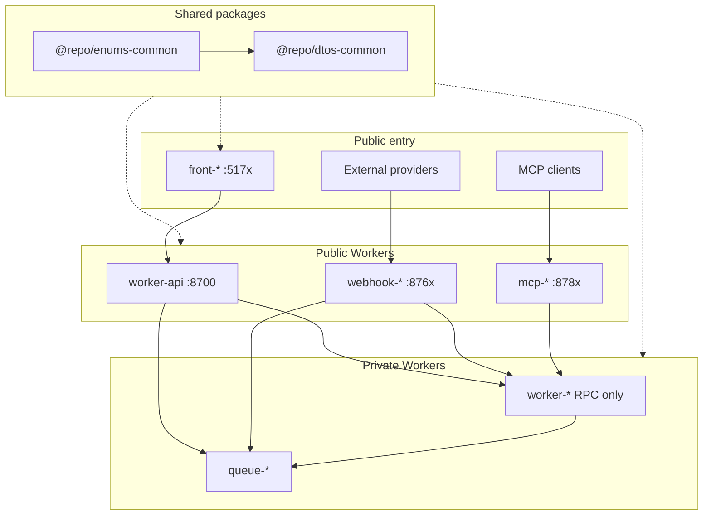

## monorepo-template

> A minimal, production-oriented monorepo starter built on **pnpm workspaces** with **Turborepo**, **Cloudflare Workers**, **Hono**, and a **React (Vite) frontend** styled with **Tailwind CSS v4**. `front-app` talks to `worker-api` over **HTTP**; service bindings are the preferred pattern for Worker-to-Worker communication when you add more Workers.

# Monorepo Agent Instructions

## Project Overview

A minimal, production-oriented monorepo starter built on **pnpm workspaces** with **Turborepo**, **Cloudflare Workers**, **Hono**, and a **React (Vite) frontend** styled with **Tailwind CSS v4**. `front-app` talks to `worker-api` over **HTTP**; service bindings are the preferred pattern for Worker-to-Worker communication when you add more Workers.

## Quick Start

```bash
pnpm install    # dependencies + workspace links
pnpm login      # Cloudflare (remote Worker features)
pnpm prepare    # Husky pre-commit hooks
pnpm dev        # all dev servers
```

After scaffolding a new worker under `apps/`, run `pnpm install` before turbo commands.

## Architecture



## Worker Prefixes

| Prefix | Example | Role | Production surface |
|--------|---------|------|--------------------|
| `worker-api` | `worker-api` | HTTP gateway (sticky name) | Public HTTP only |
| `worker-` | `worker-account` | Business logic | **RPC only** via service bindings |
| `queue-` | `queue-email` | Queue-only consumer | `queue()` handler; no public HTTP |
| `webhook-` | `webhook-example` | External webhook ingress | Public HTTP for provider callbacks |
| `mcp-` | `mcp-tools` | MCP server | Public HTTP MCP (SSE / streamable HTTP); tools call `worker-*` via RPC |
| `front-` | `front-app` | React SPA | Vite → gateway over HTTP only |

If a Worker is both RPC and a queue consumer, keep prefix **`worker-*`** (business range) and use the dual-handler layout. Use **`queue-*`** only for queue-only consumers.

## Where to Put Things

| Task | Location |
|------|---------|
| New API endpoint route | `apps/worker-api/src/routes/<feature>.ts` → mount in `src/index.ts` |
| Request/response Zod schemas (HTTP) | `packages/dtos-common/src/api/<feature>.ts` |
| Service-binding RPC schemas | `packages/dtos-common/src/rpc/<feature>.ts` |
| Queue message schemas | `packages/dtos-common/src/queue/<feature>.ts` |
| Webhook payload schemas | `packages/dtos-common/src/webhook/<feature>.ts` |
| Shared constrained value set | `packages/enums-common/src/index.ts` |
| Worker-local value set | `apps/<worker>/src/enums/` |
| DB schema / migrations / query helpers | `apps/<owner>/src/db/` (one owning Worker; never `packages/db-*`; no shared DB bindings) |
| Frontend API service | `apps/front-app/src/services/worker-api/<feature>.ts` |
| Frontend page | `apps/front-app/src/pages/` + `src/routes/` (TanStack file routes) |
| Reusable UI / hooks | `apps/front-app/src/components/ui/`, `src/hooks/` |
| Worker bindings / config | `apps/<worker>/wrangler.jsonc` |
| Local dev secrets | `apps/<worker>/.dev.vars` (from `.dev.vars.example`) |

Queue-only apps (`queue-*`) and dual-handler `worker-*` use: `handlers/request.ts`, `handlers/message.ts`, shared `services/`, minimal `index.ts`.

## Environment

Use Node 24 and the exact pnpm version pinned in root `package.json`. Copy `.dev.vars.example` → `.dev.vars` per app before local runs. Agent worktrees do not copy real env files; provision isolated credentials explicitly in each worktree. Secrets and wrangler vars: path-scoped rule `backend/workers-config`. Local ports when scaffolding: `backend/ports` (human tables in [README.md](README.md)).

## Root Scripts (pnpm)

`pnpm run` lists every root script. The ones that are not guessable:

| Command | Description |
|---------|-------------|
| `pnpm run ci` | lint + format + check-types + **types:check + boundaries + build** (full-repo local PR gate; CI uses `--affected` for check-types/build) |
| `pnpm lint:agent` | Lint with `--format=agent` - one machine-readable line per diagnostic, no auto-fix |
| `pnpm types` | Regenerate `worker-configuration.d.ts` in apps (**commit the result**) |
| `pnpm types:check` | Verify committed Worker types still match `wrangler.jsonc` (apps only; inside `pnpm run ci`) |
| `pnpm boundaries` | Check package dependency tags against `turbo.json` (inside `pnpm run ci`) |

### Scoping (pnpm / Turborepo)

Pass turbo filters on turbo-backed tasks (`check-types`, `build`, `dev`, `deploy`, `preview`, `types`):

| Flag | Effect | Example |
|------|--------|---------|
| `--filter=<package>` | One package | `pnpm turbo run dev --filter=worker-api` |
| `--filter=...pkg...` | Package + dependents/deps | `pnpm turbo run build --filter=...front-app...` |
| `--affected` | Changed packages vs base | `pnpm turbo run build --affected` |

Local `pnpm run ci` runs the full graph (no `--affected`) so agents and humans get a complete gate without needing a meaningful git base. GitHub CI runs `check-types` and `build` with `--affected`, and always runs full `types:check` on apps.

**Lint and format are not turbo-backed.** OXC runs as a single pass from the repo root. This is deliberate: oxlint resolves `settings.better-tailwindcss.entryPoint` against the process CWD, so a per-package `oxlint .` silently breaks the context-aware Tailwind rules, and it re-spawns `tsgolint` once per package. A whole-repo pass is ~2.0s. To narrow it, pass a path instead: `pnpm --filter=front-app run lint`.

### Turbo commands for agents

| Need | Command | Notes |
|------|---------|-------|
| Full local PR gate | `pnpm run ci` | Full graph (no `--affected`); includes boundaries, lint, format, typecheck, types:check, build |
| Scoped typecheck | `pnpm turbo run check-types --filter=<package>` | Prefer this while iterating on one package |
| Scoped build | `pnpm turbo run build --filter=<package>` | Still runs that package's `check-types` first |
| Local full-stack dev | `pnpm turbo run dev --filter=front-app` | Also starts `worker-api` via `with` |
| Watch shared-package edits | `pnpm turbo watch dev --filter=front-app` | `watchUsingTaskInputs` + interruptible `dev` restart only when task inputs change; JIT + Vite HMR usually enough without it |
| Affected only | `pnpm turbo run check-types --affected` / `build --affected` | **GitHub CI only** - needs a meaningful git base; do not use as the local PR gate |
| Lint / format | `pnpm run lint:check` / `format:check` (or `pnpm lint:agent`) | Always from repo root; never `cd` into a package and run `oxlint .` |

`pnpm boundaries` calls `turbo boundaries` (a CLI command, not a package task). Keep lint/format outside Turborepo.

## Agent tooling

Cursor / Claude dual-tree layout, sync policy, hooks, skills, and MCP: skill `monorepo-agent-setup`. Hook scripts: [hooks/AGENTS.md](hooks/AGENTS.md). Use `pnpm turbo docs task-caching` for version-matched guidance.

### Subagent roster

Three - `verifier`, `bundle-analyzer`, `docs-researcher` - each read-only in the sense that matters: none can edit a file. Their descriptions load automatically from `.claude/agents/*.md`; do not restate them here.

Not installed, and why: templates for `code-reviewer`, `security-reviewer`, `refactorer`, and `db-reader` are not wired yet - there is no database, no client-data surface, and no test suite. When one of those surfaces lands, add a matching agent under `.claude/agents/` / `.cursor/agents/` (see skill `monorepo-agent-setup`).

### When to delegate

| Reach for | When |
|-----------|------|
| **Main thread** | Iterative work; phases sharing context; a small targeted change; anything latency-sensitive (a subagent starts cold). |
| **Plan mode** | The approach is uncertain, or the change spans files. Skip it if you could describe the diff in one sentence. |
| **Skill** | A reusable procedure that needs the *current* context - the nine `/review-*` commands, `/git-commit`. |
| **Subagent** | The work emits output you will never re-read (CI logs, a build dump, doc pages, a broad sweep); **or** you need a tool restriction the main thread cannot express; **or** you need a fresh context so the reviewer is not the author. |
| **Never a subagent** | A trivial or strictly sequential step, or work sharing mutable state with the main thread. |

Three things that are easy to get wrong:

- **`tools` is the only real least-privilege gate.** `permissions.defaultMode` is `acceptEdits`, and a parent `acceptEdits` takes precedence over any subagent `permissionMode`, so a `permissionMode: plan` line on an agent is silently ignored. Omit `Edit`/`Write`/`Bash` to make an agent read-only; do not rely on the mode.
- **`Explore` and `Plan` do not load `CLAUDE.md` or `.claude/rules/`.** Every other subagent does, including always-on `guardrails.md` and this file. Restate any binding constraint in the delegation prompt for those two.
- **Agents never write scratch files, reports, or notes into the working tree.** Findings come back in the reply.

## Agent Guides

Every workspace carries its own `AGENTS.md` + `CLAUDE.md` pair (`apps/*`, `packages/*`, `hooks/`). Claude Code loads a subdirectory's pair automatically the first time it reads a file in that subtree, so there is no index to consult or maintain - open the code and the local conventions arrive with it. Give a new app or package the same pair.

## Enforced Boundaries

Package dependency rules are **machine-checked** by `pnpm boundaries` (part of `pnpm run ci`) - a violation fails CI, it is not a convention. The tag rules live in root `turbo.json` under `boundaries.tags` (self-documenting, with comments); each package declares its tag in its own `turbo.json`.

Two invariants worth knowing before you add a dependency:

- Apps are entry points, never installable dependencies: **nothing may import an `app`**. Worker-to-Worker calls go through service-binding RPC declared in `wrangler.jsonc` - never a package import.
- A new app or package needs its own `turbo.json` with `"extends": ["//"]` and a `tags` entry, or `pnpm boundaries` reports it as untagged.

Detail loads from `.claude/rules/core/boundaries.md` / `.cursor/rules/core/boundaries.mdc` when you touch a `turbo.json`.

## Decision Checklist

1. Worker-to-Worker call? **Service binding RPC**, not HTTP (no extra request fee on Workers Standard).
2. DB access? Schema + binding in **one** owning `worker-*` / `queue-*` under `src/db/` - never `packages/db-*`, never the same DB binding on multiple apps. Other apps use **service-binding RPC** (or a queue).
3. Public HTTP only for gateway, webhooks, MCP, and frontends - not for business RPC or queue-only workers.

Shared DTO/enum ownership, naming, and code style are path-scoped under `.cursor/rules/` / `.claude/rules/` (`contracts`, `quality`).

## Contribution

- Run `pnpm run ci` before opening a PR.
- Update the relevant `AGENTS.md` when adding endpoints, bindings, env vars, or conventions.
- HTTP contracts live in `@repo/dtos-common`; update `worker-api` and `front-app` together.
- Continuous deployment strategy (exploratory; not an implementation guide): [docs/continuous-deployment-workers.md](docs/continuous-deployment-workers.md). Operating-model decisions for Stages 1–2: [docs/cd-operating-model.md](docs/cd-operating-model.md).

---
> Source: [louisbrulenaudet/monorepo-template](https://github.com/louisbrulenaudet/monorepo-template) — distributed by [TomeVault](https://tomevault.io).
<!-- tomevault:4.0:gemini_md:2026-08-11 -->
