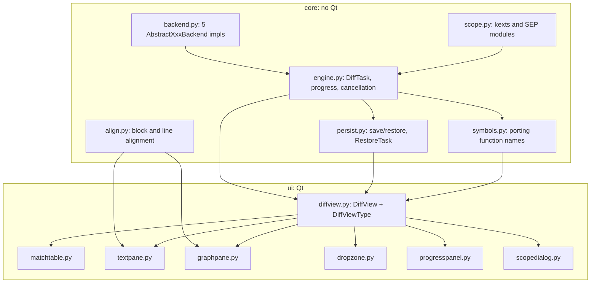

## binja-diff

> Guidance for AI agents working in this repository.

# CLAUDE.md

Guidance for AI agents working in this repository.

## What this repository is

`binja_diff/` is a Binary Ninja UI plugin that diffs two binaries side by side
using QBinDiff for function matching. Everything else in the repository is a
vendored read-only reference checkout:

| Directory | Status |
| --- | --- |
| `binja_diff/` | The plugin. This is the only thing to edit. |
| `qbindiff/` | Upstream QBinDiff source, for reference. Do not modify. |
| `quokka/` | Upstream Quokka source, for reference. Not used at runtime. |
| `binaryninja-api/` | Binary Ninja API source and headers, for reference. Do not modify. |
| `.venv-qbindiff/` | Virtualenv used by the test suite. Not committed. |

Read the vendored trees freely; they are the authoritative source for API
signatures, which is important because much of the Binary Ninja Python API is
generated at build time and is not introspectable from a checkout.

## Environment

QBinDiff lives in a virtualenv rather than Binary Ninja's bundled interpreter,
because it pins numpy >= 2 and pulls in scipy and scikit-learn. Use that
interpreter for anything touching qbindiff:

```bash
.venv-qbindiff-312/bin/python ...
```

Two failure modes are worth recognizing on sight, because both look like
"QBinDiff is not installed" and neither is:

- **Python version mismatch.** A site-packages built for a different minor
  version is silently unimportable. It must match whatever Binary Ninja runs
  (`import sys; sys.version` in its console).
- **Namespace shadowing.** A `qbindiff` directory sits at the repository root.
  If the repo root lands on `sys.path` it shadows the installed package as a
  namespace package: `import qbindiff` succeeds and every submodule fails.

`dependency_error()` in `binja_diff/__init__.py` distinguishes these and names
the cause; extend it rather than reintroducing a generic message.

QBinDiff also imports `python-magic`, which dlopens the system `libmagic`. On a
minimal Linux image that library is often absent and surfaces as
`ImportError: failed to find libmagic` at plugin startup.

## Running the tests

```bash
.venv-qbindiff-312/bin/python binja_diff/tests/run_all.py
```

There are two tiers.

`test_live.py` needs a **headless** licence, which the Personal edition does
not grant: it prints SKIP on a machine that only has the GUI. A headless host
is worth arranging before touching classification — every bug in `align.py`
that survived more than one round did so because it could only be reproduced
against real Binary Ninja rendering, and the stub encoded what the author
assumed the tokens looked like rather than what they are.

`test_backend.py`, `test_align.py`, `test_engine.py`, `test_persist.py`,
`test_symbols.py`, `test_scope.py` and `test_cli.py` install a stub
`binaryninja` module into `sys.modules` and run the **real** QBinDiff against
it, including a full end-to-end diff with belief propagation. They cover the
backend's object model, instruction and operand extraction, block and line
alignment, `DiffTask`'s completion, cancellation and failure paths, the
saved-diff format, what porting symbols refuses to do, container scoping, and
the CLI's argument contract and report. These need no Binary Ninja
installation.

`test_live.py` drives the **real** Binary Ninja API over real binaries. It
prints SKIP and exits 0 wherever Binary Ninja is not importable. It is the only
test that validates against genuine analysis output, so run it after touching
`core/`. Pass two paths to pick the binaries (`test_live.py /bin/ls /bin/cat`);
it defaults to `/bin/true` against `/bin/false`. `run_all.py --no-live` skips
it.

Building a pair of binaries that differ only in constants is the sharpest test
of the diff classifier, and cheap:

```bash
printf 'int check(int x){return x>42?x*3:x+7;}\nint main(){return check(10);}\n' > /tmp/a.c
sed 's/42/99/' /tmp/a.c > /tmp/b.c
gcc -O0 -o /tmp/a /tmp/a.c && gcc -O0 -o /tmp/b /tmp/b.c
.venv-qbindiff-312/bin/python binja_diff/tests/test_live.py /tmp/a /tmp/b
```

Two things to know about the stubbed harness:

- `binja_diff/__init__.py` imports `binaryninja` at module scope, so the stub
  must be registered before any `binja_diff` import. That is what
  `tests/bootstrap.py` is for; load it by path, not through the package.
- The stub only models the API surface the plugin actually uses. When you touch
  a new Binary Ninja API, extend `tests/stub_binaryninja.py` to match, and
  check the real signature against `binaryninja-api/` first.

Also lint and type-check before finishing:

```bash
ruff check . && ruff format --check . && ty check
```

Those are the same three commands `.pre-commit-config.yaml` runs, reading
`ruff.toml` and `ty.toml` from the repo root, so a green run here is a green
commit. Both configs exclude the vendored trees.

Two settings are load-bearing rather than taste, and re-enabling either breaks
something that no test will catch:

- **isort (`I`) is off in ruff.** Sorting the imports under `ui/` puts `PySide6`
  before `binaryninjaui`, which takes the process down (see below).
- **`unresolved-import` is off in ty.** Nothing the plugin imports resolves from
  a bare checkout — the Binary Ninja modules live in the app bundle, qbindiff is
  in a separate virtualenv, and the relative imports only resolve once the
  checkout is a plugin directory. As an error it would fail on every machine.

`import binaryninjaui` still needs `# noqa: F401` wherever the module is not
referenced afterwards. Where it *is* referenced, drop the `noqa` and keep the
comment: ruff's RUF100 flags the redundant suppression.

## Non-obvious constraints

**A script in the plugin directory puts that directory on `sys.path`.** Python
prepends a script's own directory, so every top-level name in this checkout —
`core`, `ui`, `tests`, and the script itself — then shadows any installed
package of that name. This is not theoretical: the headless CLI was called
`bindiff.py` for one test run, and qbindiff's `from bindiff import BindiffFile`
imported *it*, taking the diff down before it started. `binja-diff.py` is
hyphenated so it cannot be imported at all, and it drops its own directory from
`sys.path` before importing anything; it registers the package by path (the
same trick as `tests/bootstrap.py`), which needs no path entry. Same family as
the `qbindiff/` namespace shadowing above.

**Import order in `ui/`.** Every module under `binja_diff/ui/` imports
`binaryninjaui` before `PySide6`. Binary Ninja ships a custom PySide6 build
ABI-matched to its own `libbinaryninjaui`; importing them in the wrong order
loads the wrong PySide6 and hard-crashes the process rather than raising. Never
reorder those imports, and never let a formatter do it either.

**`core/` must not import Qt.** That separation is what makes the headless
tests possible. Keep engine and alignment logic out of the UI modules.

**Cleanup runs on `QWidget.destroyed`, not `__del__`.** Shiboken-backed objects
do not reliably see `__del__`, so the secondary `BinaryView` is released from a
`destroyed` handler in `ui/diffview.py`. Only close a `BinaryView` the plugin
loaded itself; the ones the UI owns must be left alone.

**`binaryninja.load()` must not be used as a context manager here.** The `with`
form closes the view on exit, and the diff view holds the secondary view for
its whole lifetime.

**`load()` accepts `.bndb` as well as raw binaries**, restoring the saved
analysis. Its `progress_func` fires *only* for databases, and returning False
from it aborts the load — which `load()` then reports as a generic
`Unable to create new BinaryView`. `load_secondary()` translates that into a
clean `None` when cancelled, so pressing Cancel never surfaces as an error.

**An unrecognized file still opens**, as a raw view with zero functions, rather
than failing. `run_diff()` rejects empty views explicitly, because otherwise a
corrupt input produces an empty diff that looks like a plugin bug.

**`BinaryView.executable` is False for custom views** unless they override
`perform_is_executable()`; the API requires that override for executable custom
views, but firmware loaders routinely forget it (sep-binja did). A `ViewType`
returning priority 0 for such data silently disappears from the view dropdown —
nothing errors. `DiffViewType.getPriority` therefore accepts any view whose
`view_type` is not `"Raw"` (some loader recognized the file) rather than
trusting `executable` alone. Keep the `"Raw"` exclusion: it is what keeps the
Diff view out of plain hexdumps.

**Qt 6 dropped `QDropEvent.pos()`.** Use `position()`.

**IL has to exist before the linear view renders it.** Asked for LLIL/MLIL/HLIL
that has not been generated, it returns one `"Loading..."` line and fills the
real text in asynchronously. A `TokenizedTextWidget` would repaint when that
lands; a `QTextEdit` written once does not, so the placeholder is simply what
the user reads. `align.ensure_il()` reads `func.llil` / `.mlil` / `.hlil` first,
which forces generation — the `*_if_available` variants deliberately do not.
This is also why visiting the Basic Blocks tab and coming back used to "fix"
it: `il_basic_blocks` touches those same properties.

**`palette(mid)` is unreadable in Binary Ninja's dark themes.** It is Qt's
answer for muted text, and there `mid` sits a shade off the window color, so
dimmed labels render near-black on near-black — no error, just an unreadable
panel. `theme.muted_text()` blends a widget's own foreground into its own
background instead, which works in either polarity. The tradeoff is that the
color is resolved once rather than following a live theme switch.

**A view can still be analyzing when a diff starts.** The diff view is
available as soon as the tab opens, so `run_diff` waits on both sides through
`wait_for_analysis` before reading any function. Skipping that does not fail:
QBinDiff happily diffs whatever subset of functions existed at that instant,
and the result looks plausible and changes between runs.
`update_analysis_and_wait()` is the only call that guarantees pending work has
finished, but it blocks with no progress and no way to cancel, and the API
refuses it outright on a UI or worker thread (a `BackgroundTaskThread` is
neither). Hence poll `analysis_progress` first — that part is cancellable and
has a fraction — and use the blocking call once idle to close the race.

**qbindiff's `Program.__iter__` yields `Function` objects, not keys**, despite
`Program` being a `MutableMapping`. `keys()` therefore does not return
addresses and `values()` raises `KeyError`. Use `items()`, or iterate directly
when you only want the values. `Function` behaves the same way with respect to
its basic blocks.

**Progress comes from generators, not callbacks.** `differ.process_iterator()`
yields absolute values in `[0, 1000]` and may yield more than 1000 times;
`differ.matching_iterator()` yields the iteration number and may converge
before `maxiter`. `differ.mapping` is only populated once
`matching_iterator()` is fully exhausted, so a cancelled run has no mapping.

**Both generators stop reporting long before they stop working**, and on a
large pair the unreported stretch is the majority of the run:

| Generator | Reports | Then silently does |
| --- | --- | --- |
| `process_iterator` | the feature visitor, per function | one full N×M similarity matrix *per registered feature*, then the post passes |
| `matching_iterator` | one value per belief-propagation iteration | sparsification (an argsort over N×M) and `find_squares`, **before** its first yield |

Measured on a synthetic 2500×2500 pair: 0.3s of reported extraction, then 2.2s
with nothing to report, and the gap grows quadratically. Left alone this reads
as a hang at "Extracting features 100%".

Nothing can be reported *from inside* a blocked generator, so the label has to
be set before each silent stretch starts. `feature_phase()` switches to
"Building the similarity matrix" when the fraction crosses `EXTRACTION_DONE`
(0.995) — the visitor's last yield lands one function short of 1000, which
rounds to 1000 for any program of a few hundred functions and is instant below
that — and `run_diff` sets "Preparing the matcher" before entering
`matching_iterator`. Both report `INDETERMINATE`, which the progress panel
renders as a busy bar rather than one frozen at 100%.

## Architecture



The plugin talks to QBinDiff through `Program.from_backend()`, which accepts an
`AbstractProgramBackend`. That is the whole integration point, and it is why no
change to the vendored `qbindiff/` is needed.

QBinDiff matches functions only. Basic block and line alignment are ours, in
`core/align.py`, computed lazily for the selected function pair.

### A DiffResult holds records, not qbindiff objects

`DiffResult` copies the address, name, similarity and confidence out of each
`Match` instead of keeping the `Mapping`. Two reasons, and both are easy to
undo by accident:

- qbindiff's `Match` points back at the two `Program` graphs, which own every
  feature vector extracted during the diff. Holding one keeps tens of megabytes
  alive for the lifetime of the view, in order to read an address.
- A result made of plain records is serializable, which is what `core/persist.py`
  saves. Re-introducing a live qbindiff object into `DiffResult` breaks saving,
  not just memory use.

`nb_match` and friends are therefore properties of `DiffResult`; they used to be
read off `mapping`.

### Saved diffs, and what a saved diff cannot contain

`core/persist.py` serializes a `DiffResult` to JSON and stores it either as a
metadata string on the primary `BinaryView` or in a `.bndiff.json` file — same
payload, two sinks. Restoring re-opens the secondary binary (a `RestoreTask`,
because analysis is slow) and rebuilds the result from the file; nothing below
function level is stored, since alignment is recomputed on selection anyway.

Three constraints worth knowing before touching it:

- **`store_metadata` reaches disk only when the database does**, and a view that
  was never saved as a `.bndb` has no database at all — `store_metadata` still
  succeeds there, in memory. `is_persistent()` exists so the UI can say which
  case the user is in rather than promising a diff that will not survive.
- **A saved diff is addresses and nothing else**, so it silently pairs the wrong
  functions if a binary was rebuilt underneath it. `ViewInfo.differences()`
  fingerprints both sides (name, size, function count) to catch that. The
  primary can be checked before restoring; the secondary only after it has been
  loaded, which is why one is a prompt and the other a log warning.
- **`DiffResult.timings` is not saved**, on purpose. It describes the run that
  produced a result, not the result, and a restored diff sets it to its own
  load time. Writing the original phase durations into the file would put a
  "matched in 12 minutes" next to a restore that took twelve seconds.
- **The format is versioned and validated.** `from_dict` rejects a payload that
  is not ours or is newer than `VERSION`, because the metadata store and a
  `*.json` file are both places where someone else's data can turn up. Keep
  additive changes tolerant (`data.get`) rather than bumping `VERSION`.

### Diffing one kext, or one SEP module

Matching is quadratic, so a kernelcache is not a slow diff, it is one that does
not finish: 256 kexts against 256 kexts. `core/scope.py` cuts the input to one
part, which brought an iPhone kernelcache pair down to **41 seconds for
`AppleSEPManager`** (2490 functions).

Both container formats are lazy, and that is what makes this cheap — but they
are loaded differently, and only one can be loaded at all:

- **Kernelcache** (`KCView`). A view starts with *zero* functions;
  `KernelCacheController.apply_image()` maps a kext in on demand. Public core
  API, reachable from any `BinaryView`, so `ensure_loaded()` really loads.
  Membership is asked of `get_image_containing()` rather than computed: an
  image announces where its header sits and nothing more.
- **SEP firmware** (sep-binja's `SEP Firmware` view). Also lazy, but its
  `load_module()` lives on the view's *Python* object, and `binaryninja.load()`
  hands back a generic `BinaryView` wrapper — `BinaryViewType.open()` returns
  `None`, and re-constructing the view raises "view type not registered".
  sep-binja closes that gap itself: `sep_api.py` keeps a weak registry of live
  views keyed by **the address of the core object** (every wrapper of one view
  shares it) and publishes itself as `sys.modules["sep_binja_api"]`. Looked up,
  never imported — the plugin's module name is whatever folder it was installed
  under, and importing its package pulls in the UI half. With it a module loads
  on demand exactly like a kext; without it only already-mapped modules appear,
  derived from the sections sep-binja leaves behind
  (`module:segment:section`), and `ensure_loaded()` reports False rather than
  pretending.

**Analyze a container after mapping its parts in, never before.** Binary
Ninja's initial analysis runs once, and a lazy container has no code in it at
that point; segments mapped afterwards get only what recursive descent reaches
from an entry point, never the linear sweep. Measured on a 26-module SEP image,
same file and same code both ways:

| How the 26 modules were mapped | Functions |
| --- | --- |
| all of them, then analyze once | 31499 |
| one at a time, analyzing after each | 26959 |
| analyze first, then map them all | 26896 |

The middle row is the trap inside the trap: mapping a part is not what costs
the functions, *completing an analysis* is, so a loop that settles the view
after every part is barely better than analyzing up front. Hence
`ensure_all_loaded()` takes a list and analyzes once, `sep_api.load_modules()`
is plural for the same reason, and `ensure_loaded()` is the one-element case
rather than the primitive. Nothing errors, and `reanalyze()` does not recover
the difference (it re-analyzes the functions that exist; the missing ones were
never created).
Hence `load_secondary()` returns an unloaded container *without* analyzing it
and leaves that to `wait_for_analysis`, once `scope`/`mirror_loaded` has
mapped something in. The primary in the GUI is Binary Ninja's own view and is
analyzed before the plugin ever sees it, so a whole-container diff started
there compares the smaller function set; the headless CLI opens both sides
itself and does not.

**Regions are matched by name, never by address.** The picker runs against the
primary alone, before the second binary is opened — which is the point, since
offering the choice must not require analyzing 268 MB twice.

**"Everything" cannot mean "leave both views alone."** A container holds no
code until something maps it in, and the secondary is opened by the plugin
seconds earlier, so an unscoped diff of two containers would compare nothing
against nothing — which surfaced as `run_diff`'s "contains no functions", an
error about an unreadable file for a file that read fine. `mirror_loaded()`
resolves it in the only direction that carries information: the primary is
whatever its owner already loaded, so its parts are mirrored onto the secondary
by name. An untouched primary has no parts to mirror, and there "everything"
falls back to loading the file in full — for SEP, via `load_all_modules` in
sep-binja's API (26 modules, bounded). A kernelcache is refused there instead,
and says why: 256 kexts is exactly the diff scoping exists to prevent.

### Porting symbols writes to a real database

`core/symbols.py` copies function names from one side of a diff to the other.
It is the only part of the plugin that modifies anything the user owns, which
sets the rules it follows:

- **Names come from the live views, not from the result.** `MatchRecord` holds
  the names as of the diff; renaming a function and *then* porting is the
  normal order, so the result supplies addresses and nothing else. The reverse
  of that is `refresh_names()`, which pushes the views' names back into the
  result — without it the match table still shows the `sub_...` names that were
  just replaced.
- **The batch is one `bv.undoable_transaction()`.** One Ctrl+Z undoes the
  port, and an exception part-way through reverts every rename instead of
  leaving a half-named database. Cancelling deliberately does *not* revert:
  what was applied stays, and stays undoable.
- **A placeholder is not a symbol.** `is_generated_name()` (shared with the
  matcher's anchor pass) decides both what is worth porting and what may be
  overwritten. Real names on the receiving side are kept unless the user opts
  in, because they are usually theirs.
- **Nothing is written before a count is shown.** `plan_port()` is pure and
  read-only, so the caller can count first; `apply_port()` is the only writer.
  Skips are counted by reason rather than dropped, since "it did nothing" needs
  an explanation to be actionable.
- **Porting is driven from the match table's context menu**, over the selected
  rows, in either direction — there is no bulk "port everything" dialog any
  more. `plan_port(result, options, only=addresses)` takes the primary
  addresses of those rows, keyed on the primary side whichever way the names
  travel because that is what identifies a pair on screen. A hand-picked
  selection also drops the similarity floor to zero: the threshold exists to
  keep a whole-table port from acting on noise, and someone looking at the pair
  they right-clicked has better evidence than it does.
- **Into the secondary, the port saves the database itself.** That view is not
  open in a tab, so an unsaved rename there is one that disappears with the
  view; the menu entry is disabled outright when it has no database to save
  into.

The secondary is not open in a tab, so nothing else will ever offer to save it
— `save_database()` exists for that, and the dialog only offers it when the
receiving side actually has a `.bndb`.

### Normalization has two levels, and conflating them is a real bug

`core/align.py` deliberately keeps two normalizers, used for different jobs:

- `normalize_line()` is **aggressive**: it collapses hex literals *and*
  auto-generated location names to the same `0x?`. It *aligns* rows, so two
  builds at different base addresses still line up, and it decides the `MINOR`
  tier — everything it folds is a difference in *where things live*.
  Because `compare_line` has already turned `sub_10001aa08` into an address,
  the hex fold catches both spellings: a target that *moved* comes out `~`
  whichever side resolved it. `var_`/`arg_` keep a placeholder of their own —
  those are storage, not locations, and folding them into "some address" would
  hide a change of variable.
- `compare_line()` is **conservative**: whitespace, plus auto-generated
  location names rewritten to the address they encode (`sub_10001a9c8` →
  `0x10001a9c8`). Its single job is to decide that a row is genuinely
  unchanged, and `bl 0x10001a9c8` against `bl sub_10001a9c8` is the same line —
  the same database rendered twice does not always resolve the same symbols, so
  without this, diffing a `.bndb` against itself marks every call site.

Using the aggressive form to classify is what made changed constants invisible:
`mov eax, 0x1` and `mov eax, 0x2` both normalize to `mov eax, 0x?`, so a real
change rendered as unchanged.

Folding auto-generated names in `compare_line` was the same mistake one level
down. `bl sub_100018fe8` against `bl sub_100019028` came out `EQUAL`, so a
function calling a helper that moved was reported *identical* while the two
panes plainly showed different text. Anything the reader can see has to be at
least `~`; only `normalize_line` may fold it. Note `call memcpy` against
`call malloc` stays `CHANGED` — a real name is not an address.

The three-way outcome is:

There is a third, token-based tier: `shape_signature()` replaces the *text* of
register, literal and stack-variable tokens with placeholders, keyed off
`InstructionTextTokenType` rather than a register-name regex so it is not
x86-only. It exists because adding one local makes a compiler renumber registers
through a whole loop; grading each of those `CHANGED` buries the one real change
among a dozen false ones. It returns `None` for plain strings, so that tier is
simply skipped when no tokens are available.

| Comparison | Status | Marker |
| --- | --- | --- |
| `compare_line` equal | `EQUAL` | none |
| `normalize_line` equal | `MINOR` | `~` |
| `shape_signature` equal | `MINOR` | `~` |
| all differ | `CHANGED` | `!` |

`MINOR` exists so that churn which does not change behaviour — a rebase, a
register reallocation — stays visible without drowning out real edits. If you
touch these functions, `test_align.test_change_visibility`,
`test_align.test_shape_signature` and `test_live.test_changes_are_visible` are
the guards.

### Binary Ninja's annotations are not part of the code

`{__saved_x22}`, `{0xfffffffe}` and the rest are commentary the renderer
appends when it has worked out what a saved register held or what a constant
evaluates to. **Whether it renders them depends on the view, not on the code**:
in a real SEP diff the secondary rendered them on every function and the
primary rendered none, so two byte-identical functions differed on most of
their lines and the whole table read "changed".

`instruction_text()` drops `AnnotationToken`s before anything is compared, and
`align_lines` keys both the alignment and the classification off it. Do not
"simplify" that back to `str(line)`: the panes must keep *showing* the
annotations, and the comparison must keep ignoring them.

### The match table's status is not the similarity

`MatchRow.similarity` is QBinDiff's own score, and it says nothing about the
text: a pair reaches 1.0 with every address in it changed, and 0.0 while being
the same function.

That second case is worth knowing precisely, because it looks like a bug.
`QBinDiff.get_similarities` **overrides** the base implementation and does not
report the matrix the matching used at all: it recomputes a MinHash per
function where each *whole basic block* is one shingle, holding that block's
concatenated mnemonics, and returns the Jaccard. Blocks therefore match exactly
or not at all. A single-block function that gained one instruction shares no
shingle with its own previous build and scores **0.000** — measured on a real
pair, 77 instructions against 84 in one block each, zero shingles in common —
while `confidence` stays 1.0 because belief propagation paired it correctly
from the call graph. Because it is recomputed for reporting, no matching
parameter changes it: `--sparsity 0.0` leaves it at 0.000.

Three things follow. `PortOptions.min_similarity` is compared against *this*
number, so a threshold of 0.9 silently refuses to port names for exactly the
functions that changed a little — which is why porting from the match table's
context menu sets the floor to zero. The Status column has to come from the
per-line classification below, never from this score. And the table's **Similarity**
column is `align.text_similarity()`, not `MatchRecord.similarity` — the share of non-`GAP` rows that are
`EQUAL` or `MINOR` — computed in the same pass as the status and cached beside
it, so it costs nothing extra. The pair above reads 87% there against 0.000
from QBinDiff. Sorting that column falls back to QBinDiff's score for rows
nobody has looked at yet, for the same reason the Status column sorts on
similarity: asking every row at once would classify the whole table on the UI
thread. The Status column used to print "identical" for `similarity >= 0.999`,
which contradicted the pane the user opened next — every line marked `~`.

`align.classify_pair()` folds the per-line statuses into one verdict
(`IDENTICAL` / `MINOR` "offsets only" / `CHANGED`) and hands back the rows it
used, so the Status cell and its tooltip cannot disagree. Three consequences to
preserve:

- **The status is computed from the basic blocks, never from the linear view.**
  `function_instruction_lines()` concatenates each block's `disassembly_text` —
  the same source the graph pane uses, and the one that was right throughout.
  The linear rendering carries the prototype, arrives asynchronously, and hands
  back lines *without tokens* until something else has drawn the function; no
  tokens means `shape_signature` cannot answer, which demotes "same operation,
  different registers" from `~` to a full rewrite. That is why every match-table
  row read "changed" until it was clicked, and why nothing but clicking fixed
  it. Block text has none of those properties, and it makes `classify_pair`
  testable against the stub.
- **It is computed lazily, in `data()`, and cached per address pair.** Doing it
  for every match up front means disassembling both binaries in full before the
  table can appear. Qt only asks about visible rows, so the cost follows the
  scrollbar. `MatchTableModel.set_result` clears the cache — porting symbols
  changes call-site text, and therefore some verdicts.
- **The Status column still *sorts* on `(kind, -similarity)`.** Sorting asks
  every row at once, which would classify the whole table on the UI thread and
  hang exactly as long as the eager version would.

`FunctionStatus.UNKNOWN` ("differs") is the escape hatch above
`MAX_CLASSIFY_INSTRUCTIONS`; keep it, or one enormous function stalls painting.

### Block pairing: text first, topology second

`_align_remaining()` pairs leftover blocks by normalized instruction text and
only falls back to `DiGraphDiffer` for what text could not place. The order
matters and the reverse was a real bug: a CFG inside one function is nearly
symmetric, many blocks share in/out degree, and a purely structural matcher
paired a loop body with an epilogue. Since it returned a mapping, that pairing
was accepted unconditionally, and *every* line of both blocks then classified as
a difference — a two-line source change repainted the whole function. Two builds
of the same source agree far more on what instructions say than on graph shape.
`test_align.test_block_alignment_cases` pins the loop-body/epilogue case.

### The text panes render themselves, on purpose

`ui/textpane.py` builds a `QTextEdit` instead of using Binary Ninja's
`TokenizedTextWidget`. That widget has **no per-line background**: the only
highlight it knows about is the token under the cursor, and it silently ignores
`DisassemblyTextLine.highlight`. Setting that attribute is not an error and not
a no-op you can detect at runtime, so the diff colors simply never appeared
while the gutter markers did. Do not "simplify" this back to
`TokenizedTextWidget` without a replacement for the row background.

The tradeoff is that foreground colors must be fetched explicitly with
`getTokenColor(widget, token.type)` (cached per token type, since a single
function repeats the same handful thousands of times) rather than coming for
free. `theme.background()` is also forced onto the widget's `Base` palette role
because `theme.line_color()` blends its tints against that exact color; if the
widget used the default base, every highlight would be slightly wrong.

`FlowGraphNode.highlight` in `ui/graphpane.py` is a different story: the flow
graph widget does render it, which is why the basic block view worked all along.

### Graph nodes: tint lines, not the whole block

The graph colors differences and nothing else. `block_highlight()` returns a
color for `UNMATCHED` only and `None` for everything else, so:

- **identical** blocks are left plain — the common case, and noise if filled;
- **changed** blocks are left plain too, because the differing instructions are
  tinted individually via `DisassemblyTextLine.highlight` on
  `FlowGraphNode.lines`, which the core stores and the widget renders;
- **unmatched** blocks are the one whole-block fact worth a fill.

Callers must treat a `None` from `block_highlight()` as "leave the node alone";
it is not an error. Graph nodes also have no room for the `~` / `!` markers the
text panes rely on, so `_GRAPH_EQUIVALENT` folds `MINOR` into `CHANGED` there:
with no key on screen, two shades of "modified" only ask the reader to decode a
distinction they cannot see. The text panes keep the tiers apart because the
markers and legend make them readable, which is why `graph_line_color()` and
`line_color()` are separate functions rather than one shared table.

Statuses must be computed from **the node's own lines**, never from
`BasicBlock.disassembly_text`. A node prepends a symbol label (`main:`) that the
basic block's text does not have, and only for some blocks, so the two
renderings are off by a varying amount and index-zipping silently tints the wrong
instructions. `align_line_statuses()` takes the lines you intend to color for
exactly this reason, and `highlight_lines()` requires the same list object that
produced the statuses because the `lines` getter builds fresh objects per call.
`test_live.test_graph_line_highlighting` pins both the length agreement and the
fact that the highlight survives the round trip through the core.

### Qt type selectors in stylesheets match subclasses

`ui/dropzone.py` styles its card through `#binjaDiffCard`, an id selector, not
`QFrame`. A bare type selector also matches every *subclass*, and `QLabel`,
`QSplitter`, `QAbstractScrollArea` and others all derive from `QFrame` — so
`setStyleSheet("QFrame { border: 2px dashed ... }")` drew a dashed border around
each individual label rather than around the panel. Prefer an id selector, or
`.QFrame` if you really want exact-class matching.

### The pre-diff tab is a three-page stack

`ui/diffview.py` switches a `QStackedWidget` between the drop prompt, the
progress panel and the results. Keep them mutually exclusive: an enabled "drop a
binary here" panel sitting on screen during a 30-second diff invites a second
drop that `start_diff` then refuses with a dialog.

`start_diff` calls `_release_secondary` followed by `_clear_results`, and the
order is not incidental. `_release_secondary` closes the previous secondary
`BinaryView`, which the old `DiffResult` and every pane still hold references
to, so failing to clear them leaves widgets pointing at a closed view.

## Conventions

- Comments explain constraints and rationale, never mechanics. If a comment
  restates the code, delete it.
- Type-annotate new code; the codebase uses `from __future__ import annotations`
  throughout.
- Line length is 100.
- When adding a Binary Ninja API call, verify the signature in
  `binaryninja-api/` first. Do not guess, and do not trust memory: several
  plausible-looking methods do not exist, and enums like
  `InstructionTextTokenType` live in the generated `enums.py` that is absent
  from the checkout (read `binaryninjacore.h` instead).

---
> Source: [matteyeux/binja-diff](https://github.com/matteyeux/binja-diff) — distributed by [TomeVault](https://tomevault.io).
<!-- tomevault:4.0:gemini_md:2026-08-03 -->
