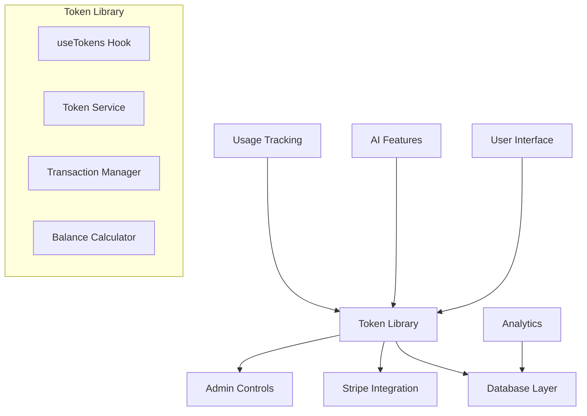
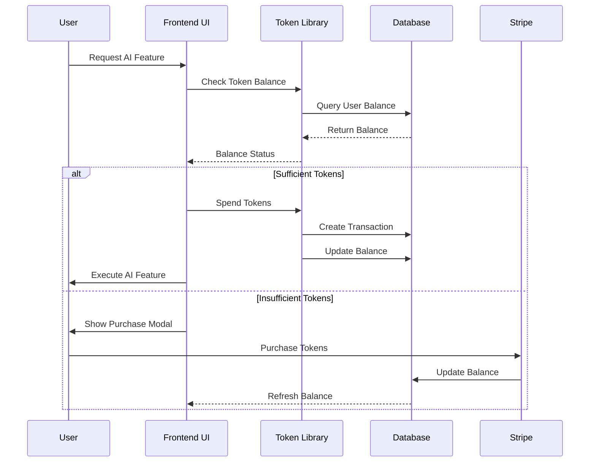

## agentopia

> 1. [Overview](#overview)

# Token/Credits System SOP - OfferGen AI Platform

## Table of Contents
1. [Overview](#overview)
2. [System Architecture](#system-architecture)
3. [Database Schema](#database-schema)
4. [Backend Implementation](#backend-implementation)
5. [Frontend Token Library](#frontend-token-library)
6. [UI Components](#ui-components)
7. [Admin Management](#admin-management)
8. [Integration Guide](#integration-guide)
9. [Testing Procedures](#testing-procedures)
10. [Deployment & Monitoring](#deployment--monitoring)
11. [Troubleshooting](#troubleshooting)

## Overview

The Token/Credits System is a modular, reusable library that provides a unified way to manage AI feature access across the OfferGen AI platform. It acts as a virtual currency system where users purchase tokens and spend them on AI-powered features.

### Key Features
- **Modular Design**: Easy to add/remove from any feature
- **Real-time Balance**: Live token balance updates
- **Transaction History**: Complete audit trail
- **Admin Controls**: Full administrative management
- **Stripe Integration**: Seamless payment processing
- **Usage Analytics**: Detailed consumption tracking
- **Flexible Pricing**: Configurable token costs per feature

## System Architecture

### Core Components



### Data Flow



## Database Schema

### Core Tables

```sql
-- Token Transactions (Main ledger)
CREATE TABLE token_transactions (
  id UUID PRIMARY KEY DEFAULT gen_random_uuid(),
  user_id UUID REFERENCES auth.users(id) ON DELETE CASCADE NOT NULL,
  transaction_type TEXT NOT NULL CHECK (transaction_type IN ('purchase', 'usage', 'refund', 'bonus', 'expiration')),
  amount INTEGER NOT NULL, -- Positive for credits, negative for debits
  description TEXT NOT NULL,
  metadata JSONB DEFAULT '{}',
  created_at TIMESTAMPTZ DEFAULT NOW(),
  expires_at TIMESTAMPTZ, -- For expiring tokens
  
  -- Indexes for performance
  INDEX idx_token_transactions_user_id (user_id),
  INDEX idx_token_transactions_type (transaction_type),
  INDEX idx_token_transactions_created (created_at DESC)
);

-- Token Purchases (Stripe integration)
CREATE TABLE token_purchases (
  id UUID PRIMARY KEY DEFAULT gen_random_uuid(),
  user_id UUID REFERENCES auth.users(id) ON DELETE CASCADE NOT NULL,
  limit_type limit_type NOT NULL,
  token_amount INTEGER NOT NULL,
  price_paid NUMERIC(10,2) NOT NULL,
  stripe_payment_intent_id TEXT,
  status TEXT DEFAULT 'pending' CHECK (status IN ('pending', 'completed', 'failed', 'refunded')),
  created_at TIMESTAMPTZ DEFAULT NOW(),
  updated_at TIMESTAMPTZ DEFAULT NOW(),
  
  -- Indexes
  INDEX idx_token_purchases_user_id (user_id),
  INDEX idx_token_purchases_status (status)
);

-- User Usage Tracking (Current balances and limits)
CREATE TABLE user_usage (
  id UUID PRIMARY KEY DEFAULT gen_random_uuid(),
  user_id UUID REFERENCES auth.users(id) ON DELETE CASCADE NOT NULL,
  limit_type limit_type NOT NULL,
  current_usage INTEGER DEFAULT 0,
  additional_tokens INTEGER DEFAULT 0, -- Purchased tokens
  token_balance INTEGER DEFAULT 0, -- Current token balance
  last_reset_at TIMESTAMPTZ DEFAULT NOW(),
  created_at TIMESTAMPTZ DEFAULT NOW(),
  updated_at TIMESTAMPTZ DEFAULT NOW(),
  
  UNIQUE(user_id, limit_type),
  INDEX idx_user_usage_user_id (user_id)
);

-- Admin Settings (Token pricing and rates)
CREATE TABLE admin_settings (
  id UUID PRIMARY KEY DEFAULT gen_random_uuid(),
  setting_key TEXT UNIQUE NOT NULL,
  setting_value JSONB NOT NULL,
  description TEXT,
  updated_by UUID REFERENCES auth.users(id),
  created_at TIMESTAMPTZ DEFAULT NOW(),
  updated_at TIMESTAMPTZ DEFAULT NOW()
);
```

### Database Functions

```sql
-- Get user token balance
CREATE OR REPLACE FUNCTION get_user_token_balance(p_user_id UUID)
RETURNS INTEGER AS $$
DECLARE
  balance INTEGER := 0;
BEGIN
  SELECT COALESCE(SUM(amount), 0) INTO balance
  FROM token_transactions
  WHERE user_id = p_user_id
    AND (expires_at IS NULL OR expires_at > NOW());
  
  RETURN GREATEST(balance, 0);
END;
$$ LANGUAGE plpgsql SECURITY DEFINER;

-- Add tokens to user account
CREATE OR REPLACE FUNCTION add_user_tokens(
  p_user_id UUID,
  p_amount INTEGER,
  p_transaction_type TEXT,
  p_description TEXT,
  p_metadata JSONB DEFAULT '{}'
) RETURNS BOOLEAN AS $$
BEGIN
  INSERT INTO token_transactions (
    user_id,
    transaction_type,
    amount,
    description,
    metadata
  ) VALUES (
    p_user_id,
    p_transaction_type,
    p_amount,
    p_description,
    p_metadata
  );
  
  RETURN TRUE;
END;
$$ LANGUAGE plpgsql SECURITY DEFINER;

-- Use tokens (spend)
CREATE OR REPLACE FUNCTION use_user_tokens(
  p_user_id UUID,
  p_amount INTEGER,
  p_description TEXT,
  p_metadata JSONB DEFAULT '{}'
) RETURNS BOOLEAN AS $$
DECLARE
  current_balance INTEGER;
BEGIN
  -- Check current balance
  SELECT get_user_token_balance(p_user_id) INTO current_balance;
  
  IF current_balance < p_amount THEN
    RAISE EXCEPTION 'Insufficient token balance. Required: %, Available: %', p_amount, current_balance;
  END IF;
  
  -- Create usage transaction (negative amount)
  INSERT INTO token_transactions (
    user_id,
    transaction_type,
    amount,
    description,
    metadata
  ) VALUES (
    p_user_id,
    'usage',
    -p_amount,
    p_description,
    p_metadata
  );
  
  RETURN TRUE;
END;
$$ LANGUAGE plpgsql SECURITY DEFINER;

-- Get user token history
CREATE OR REPLACE FUNCTION get_user_token_history(p_user_id UUID)
RETURNS TABLE (
  id UUID,
  transaction_type TEXT,
  amount INTEGER,
  description TEXT,
  created_at TIMESTAMPTZ,
  expires_at TIMESTAMPTZ,
  metadata JSONB
) AS $$
BEGIN
  RETURN QUERY
  SELECT 
    tt.id,
    tt.transaction_type,
    tt.amount,
    tt.description,
    tt.created_at,
    tt.expires_at,
    tt.metadata
  FROM token_transactions tt
  WHERE tt.user_id = p_user_id
  ORDER BY tt.created_at DESC
  LIMIT 100;
END;
$$ LANGUAGE plpgsql SECURITY DEFINER;

-- Process token purchase (called by Stripe webhook)
CREATE OR REPLACE FUNCTION process_token_purchase(
  p_payment_intent_id TEXT,
  p_token_purchase_id UUID
) RETURNS BOOLEAN AS $$
DECLARE
  purchase_record RECORD;
BEGIN
  -- Get purchase details
  SELECT * INTO purchase_record
  FROM token_purchases
  WHERE id = p_token_purchase_id;
  
  IF NOT FOUND THEN
    RAISE EXCEPTION 'Token purchase not found: %', p_token_purchase_id;
  END IF;
  
  -- Update purchase status
  UPDATE token_purchases 
  SET 
    status = 'completed',
    stripe_payment_intent_id = p_payment_intent_id,
    updated_at = NOW()
  WHERE id = p_token_purchase_id;
  
  -- Add tokens to user account
  PERFORM add_user_tokens(
    purchase_record.user_id,
    purchase_record.token_amount,
    'purchase',
    'Token purchase completed',
    jsonb_build_object(
      'purchase_id', p_token_purchase_id,
      'payment_intent_id', p_payment_intent_id,
      'price_paid', purchase_record.price_paid
    )
  );
  
  RETURN TRUE;
END;
$$ LANGUAGE plpgsql SECURITY DEFINER;
```

## Backend Implementation

### 1. Token Service Class

**File**: `src/lib/tokenService.ts`

```typescript
export class TokenService {
  private supabase: SupabaseClient;
  
  constructor(supabaseClient: SupabaseClient) {
    this.supabase = supabaseClient;
  }
  
  // Get user token balance
  async getBalance(userId: string): Promise<number> {
    const { data, error } = await this.supabase
      .rpc('get_user_token_balance', { p_user_id: userId });
    
    if (error) throw error;
    return data || 0;
  }
  
  // Spend tokens
  async spendTokens(
    userId: string, 
    amount: number, 
    feature: string, 
    description: string
  ): Promise<boolean> {
    try {
      const { data, error } = await this.supabase
        .rpc('use_user_tokens', {
          p_user_id: userId,
          p_amount: amount,
          p_description: description,
          p_metadata: { feature }
        });
      
      if (error) throw error;
      return true;
    } catch (error) {
      console.error('Error spending tokens:', error);
      return false;
    }
  }
  
  // Add tokens (admin or purchase)
  async addTokens(
    userId: string,
    amount: number,
    type: 'purchase' | 'bonus' | 'refund',
    description: string,
    metadata: any = {}
  ): Promise<boolean> {
    try {
      const { data, error } = await this.supabase
        .rpc('add_user_tokens', {
          p_user_id: userId,
          p_amount: amount,
          p_transaction_type: type,
          p_description: description,
          p_metadata: metadata
        });
      
      if (error) throw error;
      return true;
    } catch (error) {
      console.error('Error adding tokens:', error);
      return false;
    }
  }
  
  // Get transaction history
  async getTransactionHistory(userId: string): Promise<TokenTransaction[]> {
    const { data, error } = await this.supabase
      .rpc('get_user_token_history', { p_user_id: userId });
    
    if (error) throw error;
    return data || [];
  }
  
  // Create token purchase record
  async createTokenPurchase(
    userId: string,
    tokenAmount: number,
    pricePaid: number,
    limitType: string = 'ai_tokens'
  ): Promise<string> {
    const { data, error } = await this.supabase
      .from('token_purchases')
      .insert({
        user_id: userId,
        limit_type: limitType,
        token_amount: tokenAmount,
        price_paid: pricePaid,
        status: 'pending'
      })
      .select()
      .single();
    
    if (error) throw error;
    return data.id;
  }
}
```

### 2. Token Configuration

**File**: `src/lib/tokenConfig.ts`

```typescript
export interface TokenPackage {
  id: string;
  name: string;
  tokens: number;
  price: number;
  bonus?: number;
  popular?: boolean;
  stripeProductId: string;
  stripePriceId: string;
}

export interface FeatureTokenCost {
  feature: string;
  cost: number;
  description: string;
}

export const TOKEN_PACKAGES: TokenPackage[] = [
  {
    id: 'tokens_100',
    name: '100 AI Tokens',
    tokens: 100,
    price: 5,
    stripeProductId: 'prod_SbkjOsn8wvc8Fe',
    stripePriceId: 'price_1RgXEBG3zEsLeiUuWAnf21S2'
  },
  {
    id: 'tokens_250',
    name: '250 AI Tokens',
    tokens: 250,
    price: 12,
    bonus: 25,
    stripeProductId: 'prod_SbkjScmpVUcVJu',
    stripePriceId: 'price_1RgXEUG3zEsLeiUuh3ZSgDBa'
  },
  {
    id: 'tokens_500',
    name: '500 AI Tokens',
    tokens: 500,
    price: 20,
    bonus: 75,
    popular: true,
    stripeProductId: 'prod_SbkkhfxpIoH4Qh',
    stripePriceId: 'price_1RgXElG3zEsLeiUuTuLtPnzo'
  },
  {
    id: 'tokens_1000',
    name: '1,000 AI Tokens',
    tokens: 1000,
    price: 38,
    bonus: 200,
    stripeProductId: 'prod_SbkkwJ93G5K6VQ',
    stripePriceId: 'price_1RgXF4G3zEsLeiUuG1QQ2WAT'
  },
  {
    id: 'tokens_5000',
    name: '5,000 AI Tokens',
    tokens: 5000,
    price: 99,
    bonus: 1500,
    stripeProductId: 'prod_Sbkl6dkBPGGt3h',
    stripePriceId: 'price_1RgXFWG3zEsLeiUu5PH0rhu8'
  }
];

export const FEATURE_TOKEN_COSTS: FeatureTokenCost[] = [
  {
    feature: 'ai_chat',
    cost: 10,
    description: 'AI Assistant conversation'
  },
  {
    feature: 'offer_generation',
    cost: 50,
    description: 'AI-powered offer creation'
  },
  {
    feature: 'customer_profile_generation',
    cost: 30,
    description: 'AI customer profile creation'
  },
  {
    feature: 'ad_generation',
    cost: 40,
    description: 'AI ad campaign generation'
  },
  {
    feature: 'report_generation',
    cost: 70,
    description: 'AI report and analytics generation'
  },
  {
    feature: 'content_generation',
    cost: 25,
    description: 'AI content creation'
  },
  {
    feature: 'sales_copy_generation',
    cost: 35,
    description: 'AI sales copy writing'
  },
  {
    feature: 'website_copy_generation',
    cost: 45,
    description: 'AI website copy generation'
  }
];

export const getTokenCost = (feature: string): number => {
  const featureCost = FEATURE_TOKEN_COSTS.find(f => f.feature === feature);
  return featureCost?.cost || 1;
};

export const getTokenPackage = (packageId: string): TokenPackage | undefined => {
  return TOKEN_PACKAGES.find(pkg => pkg.id === packageId);
};
```

## Frontend Token Library

### 1. Core Hook - useTokens

**File**: `src/hooks/useTokens.ts`

```typescript
import { useState, useEffect, useCallback } from 'react';
import { useAuth } from '../contexts/AuthContext';
import { supabase } from '../lib/supabase';
import { TokenService } from '../lib/tokenService';
import { TOKEN_PACKAGES, getTokenCost } from '../lib/tokenConfig';

export interface TokenTransaction {
  id: string;
  transaction_type: 'purchase' | 'usage' | 'refund' | 'bonus' | 'expiration';
  amount: number;
  description: string;
  created_at: string;
  expires_at: string | null;
  metadata: any;
}

export const useTokens = () => {
  const { user } = useAuth();
  const [balance, setBalance] = useState<number>(0);
  const [transactions, setTransactions] = useState<TokenTransaction[]>([]);
  const [loading, setLoading] = useState(true);
  const [purchaseLoading, setPurchaseLoading] = useState(false);
  const [error, setError] = useState<string | null>(null);
  
  const tokenService = new TokenService(supabase);

  // Fetch token balance
  const fetchBalance = useCallback(async () => {
    if (!user) {
      setBalance(0);
      return;
    }

    try {
      const balance = await tokenService.getBalance(user.id);
      setBalance(balance);
    } catch (err) {
      console.error('Error fetching token balance:', err);
      setError(err instanceof Error ? err.message : 'Failed to fetch token balance');
    }
  }, [user, tokenService]);

  // Fetch transaction history
  const fetchTransactions = useCallback(async () => {
    if (!user) {
      setTransactions([]);
      return;
    }

    try {
      const history = await tokenService.getTransactionHistory(user.id);
      setTransactions(history);
    } catch (err) {
      console.error('Error fetching token transactions:', err);
      setError(err instanceof Error ? err.message : 'Failed to fetch token transactions');
    }
  }, [user, tokenService]);

  // Use tokens for a feature
  const useTokens = async (amount: number, feature: string, description: string): Promise<boolean> => {
    if (!user) return false;
    
    if (balance < amount) {
      setError('Insufficient token balance');
      return false;
    }

    try {
      const success = await tokenService.spendTokens(user.id, amount, feature, description);
      
      if (success) {
        // Update local state immediately for better UX
        setBalance(prev => prev - amount);
        await fetchTransactions();
      }
      
      return success;
    } catch (err) {
      console.error('Error using tokens:', err);
      setError(err instanceof Error ? err.message : 'Failed to use tokens');
      return false;
    }
  };

  // Purchase tokens
  const purchaseTokens = async (packageId: string): Promise<boolean> => {
    if (!user) return false;
    
    setPurchaseLoading(true);
    setError(null);
    
    try {
      const tokenPackage = TOKEN_PACKAGES.find(pkg => pkg.id === packageId);
      if (!tokenPackage) {
        throw new Error('Invalid token package');
      }
      
      // Create token purchase record
      const purchaseId = await tokenService.createTokenPurchase(
        user.id,
        tokenPackage.tokens + (tokenPackage.bonus || 0),
        tokenPackage.price
      );
      
      // Create Stripe checkout session
      const { data: { session } } = await supabase.auth.getSession();
      
      if (!session?.access_token) {
        throw new Error('No valid session found');
      }
      
      const response = await fetch(`${import.meta.env.VITE_SUPABASE_URL}/functions/v1/stripe-checkout`, {
        method: 'POST',
        headers: {
          'Content-Type': 'application/json',
          'Authorization': `Bearer ${session.access_token}`,
        },
        body: JSON.stringify({
          price_id: tokenPackage.stripePriceId,
          mode: 'payment',
          success_url: `${window.location.origin}/success?purchase=${purchaseId}`,
          cancel_url: window.location.href,
          metadata: {
            token_purchase_id: purchaseId
          }
        }),
      });

      if (!response.ok) {
        const errorData = await response.json();
        throw new Error(errorData.error || 'Failed to create checkout session');
      }

      const { url } = await response.json();
      
      if (url) {
        window.location.href = url;
        return true;
      } else {
        throw new Error('No checkout URL received');
      }
    } catch (err) {
      console.error('Error purchasing tokens:', err);
      setError(err instanceof Error ? err.message : 'Failed to purchase tokens');
      return false;
    } finally {
      setPurchaseLoading(false);
    }
  };

  // Initialize
  useEffect(() => {
    const fetchData = async () => {
      setLoading(true);
      setError(null);
      
      try {
        await Promise.all([
          fetchBalance(),
          fetchTransactions()
        ]);
      } catch (err) {
        console.error('Error initializing token data:', err);
        setError(err instanceof Error ? err.message : 'Failed to initialize token data');
      } finally {
        setLoading(false);
      }
    };

    fetchData();
  }, [fetchBalance, fetchTransactions]);

  return {
    balance,
    transactions,
    loading,
    purchaseLoading,
    error,
    useTokens,
    purchaseTokens,
    getTokenCost,
    refreshBalance: fetchBalance,
    refreshTransactions: fetchTransactions,
    tokenPackages: TOKEN_PACKAGES
  };
};
```

### 2. Token Context Provider

**File**: `src/contexts/TokenContext.tsx`

```typescript
import React, { createContext, useContext, ReactNode } from 'react';
import { useTokens } from '../hooks/useTokens';

interface TokenContextType {
  balance: number;
  transactions: any[];
  loading: boolean;
  purchaseLoading: boolean;
  error: string | null;
  useTokens: (amount: number, feature: string, description: string) => Promise<boolean>;
  purchaseTokens: (packageId: string) => Promise<boolean>;
  getTokenCost: (feature: string) => number;
  refreshBalance: () => void;
  refreshTransactions: () => void;
  tokenPackages: any[];
}

const TokenContext = createContext<TokenContextType | undefined>(undefined);

export const useTokenContext = () => {
  const context = useContext(TokenContext);
  if (context === undefined) {
    throw new Error('useTokenContext must be used within a TokenProvider');
  }
  return context;
};

export const TokenProvider: React.FC<{ children: ReactNode }> = ({ children }) => {
  const tokenData = useTokens();

  return (
    <TokenContext.Provider value={tokenData}>
      {children}
    </TokenContext.Provider>
  );
};
```

### 3. Token Guard Component

**File**: `src/components/tokens/TokenGuard.tsx`

```typescript
import React, { useState } from 'react';
import { useTokens } from '../../hooks/useTokens';
import { TokenPurchaseModal } from './TokenPurchaseModal';
import { AlertTriangle, CreditCard } from 'lucide-react';
import { Button } from '../ui/Button';

interface TokenGuardProps {
  feature: string;
  children: React.ReactNode;
  fallback?: React.ReactNode;
  showPurchaseModal?: boolean;
}

export const TokenGuard: React.FC<TokenGuardProps> = ({
  feature,
  children,
  fallback,
  showPurchaseModal = true
}) => {
  const { balance, getTokenCost } = useTokens();
  const [showModal, setShowModal] = useState(false);
  
  const requiredTokens = getTokenCost(feature);
  const hasEnoughTokens = balance >= requiredTokens;

  if (hasEnoughTokens) {
    return <>{children}</>;
  }

  if (fallback) {
    return <>{fallback}</>;
  }

  return (
    <div className="p-4 bg-yellow-50 border border-yellow-200 rounded-lg">
      <div className="flex items-start space-x-3">
        <AlertTriangle className="w-5 h-5 text-yellow-600 flex-shrink-0 mt-0.5" />
        <div className="flex-1">
          <h3 className="font-medium text-yellow-800">Insufficient Tokens</h3>
          <p className="text-sm text-yellow-700 mt-1">
            This feature requires {requiredTokens} tokens. You currently have {balance} tokens.
          </p>
          {showPurchaseModal && (
            <Button
              variant="outline"
              size="sm"
              className="mt-3 text-yellow-700 border-yellow-300 hover:bg-yellow-100"
              onClick={() => setShowModal(true)}
            >
              <CreditCard className="w-4 h-4 mr-2" />
              Purchase Tokens
            </Button>
          )}
        </div>
      </div>
      
      {showModal && (
        <TokenPurchaseModal
          isOpen={showModal}
          onClose={() => setShowModal(false)}
        />
      )}
    </div>
  );
};
```

## UI Components

### 1. Token Balance Display

**File**: `src/components/tokens/TokenBalance.tsx`

```typescript
import React from 'react';
import { Zap, Plus } from 'lucide-react';
import { useTokens } from '../../hooks/useTokens';
import { Button } from '../ui/Button';
import { Badge } from '../ui/Badge';

interface TokenBalanceProps {
  size?: 'sm' | 'md' | 'lg';
  showPurchaseButton?: boolean;
  onClick?: () => void;
  className?: string;
}

export const TokenBalance: React.FC<TokenBalanceProps> = ({
  size = 'md',
  showPurchaseButton = false,
  onClick,
  className = ''
}) => {
  const { balance, loading } = useTokens();

  const sizeClasses = {
    sm: 'text-sm',
    md: 'text-base',
    lg: 'text-lg'
  };

  const iconSizes = {
    sm: 'w-3 h-3',
    md: 'w-4 h-4',
    lg: 'w-5 h-5'
  };

  if (loading) {
    return (
      <div className={`flex items-center space-x-2 ${className}`}>
        <div className="w-4 h-4 border-2 border-blue-600 border-t-transparent rounded-full animate-spin"></div>
        <span className={sizeClasses[size]}>Loading...</span>
      </div>
    );
  }

  return (
    <div className={`flex items-center space-x-2 ${className}`}>
      <Zap className={`text-yellow-500 ${iconSizes[size]}`} />
      <span className={`font-medium text-gray-900 ${sizeClasses[size]}`}>
        {balance.toLocaleString()}
      </span>
      <Badge variant="secondary" size="sm">tokens</Badge>
      
      {showPurchaseButton && (
        <Button
          variant="outline"
          size="sm"
          onClick={onClick}
        >
          <Plus className="w-3 h-3 mr-1" />
          Buy More
        </Button>
      )}
    </div>
  );
};
```

### 2. Token Purchase Modal

**File**: `src/components/tokens/TokenPurchaseModal.tsx`

```typescript
import React, { useState } from 'react';
import { useTokens } from '../../hooks/useTokens';
import { Modal } from '../ui/Modal';
import { Button } from '../ui/Button';
import { Card } from '../ui/Card';
import { Badge } from '../ui/Badge';
import { Zap, CreditCard, Star, CheckCircle } from 'lucide-react';

interface TokenPurchaseModalProps {
  isOpen: boolean;
  onClose: () => void;
  preselectedPackage?: string;
}

export const TokenPurchaseModal: React.FC<TokenPurchaseModalProps> = ({
  isOpen,
  onClose,
  preselectedPackage
}) => {
  const { tokenPackages, purchaseTokens, purchaseLoading, balance } = useTokens();
  const [selectedPackage, setSelectedPackage] = useState(preselectedPackage || '');

  const handlePurchase = async () => {
    if (!selectedPackage) return;
    
    const success = await purchaseTokens(selectedPackage);
    if (success) {
      onClose();
    }
  };

  return (
    <Modal
      isOpen={isOpen}
      onClose={onClose}
      title="Purchase AI Tokens"
      size="xl"
    >
      <div className="space-y-6">
        {/* Current Balance */}
        <Card className="bg-blue-50 border-blue-200">
          <div className="flex items-center justify-between">
            <div>
              <h3 className="font-medium text-blue-900">Current Token Balance</h3>
              <p className="text-sm text-blue-700">Use tokens for AI-powered features</p>
            </div>
            <div className="text-right">
              <div className="text-2xl font-bold text-blue-900">{balance.toLocaleString()}</div>
              <p className="text-sm text-blue-700">tokens</p>
            </div>
          </div>
        </Card>

        {/* Token Packages */}
        <div className="grid md:grid-cols-2 lg:grid-cols-3 gap-4">
          {tokenPackages.map((pkg) => (
            <Card
              key={pkg.id}
              className={`cursor-pointer transition-all duration-200 ${
                selectedPackage === pkg.id
                  ? 'ring-2 ring-blue-500 border-blue-500'
                  : 'hover:shadow-lg hover:border-blue-200'
              } ${pkg.popular ? 'border-blue-200 bg-blue-50' : ''}`}
              onClick={() => setSelectedPackage(pkg.id)}
            >
              {pkg.popular && (
                <div className="absolute -top-2 left-1/2 transform -translate-x-1/2">
                  <Badge variant="primary" size="sm">
                    <Star className="w-3 h-3 mr-1" />
                    Most Popular
                  </Badge>
                </div>
              )}

              <div className="text-center p-4">
                <div className="flex items-center justify-center mb-3">
                  <div className={`p-3 rounded-lg ${
                    pkg.popular ? 'bg-blue-100' : 'bg-gray-100'
                  }`}>
                    <Zap className={`w-6 h-6 ${
                      pkg.popular ? 'text-blue-600' : 'text-gray-600'
                    }`} />
                  </div>
                </div>

                <h3 className="font-semibold text-gray-900 mb-1">{pkg.name}</h3>
                
                <div className="mb-3">
                  <div className="flex items-center justify-center space-x-2">
                    <span className="text-2xl font-bold text-gray-900">
                      {pkg.tokens.toLocaleString()}
                    </span>
                    <span className="text-sm text-gray-600">tokens</span>
                  </div>
                  
                  {pkg.bonus && (
                    <div className="flex items-center justify-center space-x-1 mt-1">
                      <span className="text-sm text-green-600 font-medium">
                        +{pkg.bonus} bonus
                      </span>
                      <CheckCircle className="w-3 h-3 text-green-600" />
                    </div>
                  )}
                </div>

                <div className="mb-4">
                  <span className="text-3xl font-bold text-gray-900">${pkg.price}</span>
                  <div className="text-xs text-gray-500 mt-1">
                    ${(pkg.price / (pkg.tokens + (pkg.bonus || 0))).toFixed(3)} per token
                  </div>
                </div>

                <Button
                  variant={selectedPackage === pkg.id ? 'primary' : 'outline'}
                  size="sm"
                  className="w-full"
                  onClick={() => setSelectedPackage(pkg.id)}
                >
                  {selectedPackage === pkg.id ? (
                    <>
                      <CheckCircle className="w-4 h-4 mr-2" />
                      Selected
                    </>
                  ) : (
                    'Select Package'
                  )}
                </Button>
              </div>
            </Card>
          ))}
        </div>

        {/* Purchase Button */}
        <div className="flex justify-end space-x-3 pt-4 border-t border-gray-200">
          <Button variant="outline" onClick={onClose}>
            Cancel
          </Button>
          <Button
            onClick={handlePurchase}
            disabled={!selectedPackage || purchaseLoading}
            className="bg-green-600 hover:bg-green-700"
          >
            {purchaseLoading ? (
              <div className="w-4 h-4 border-2 border-white border-t-transparent rounded-full animate-spin mr-2" />
            ) : (
              <CreditCard className="w-4 h-4 mr-2" />
            )}
            {purchaseLoading ? 'Processing...' : 'Purchase Tokens'}
          </Button>
        </div>
      </div>
    </Modal>
  );
};
```

### 3. Token Usage Indicator

**File**: `src/components/tokens/TokenUsageIndicator.tsx`

```typescript
import React from 'react';
import { Zap, AlertTriangle } from 'lucide-react';
import { useTokens } from '../../hooks/useTokens';
import { Badge } from '../ui/Badge';

interface TokenUsageIndicatorProps {
  feature: string;
  showCost?: boolean;
  showBalance?: boolean;
  className?: string;
}

export const TokenUsageIndicator: React.FC<TokenUsageIndicatorProps> = ({
  feature,
  showCost = true,
  showBalance = true,
  className = ''
}) => {
  const { balance, getTokenCost } = useTokens();
  
  const cost = getTokenCost(feature);
  const hasEnoughTokens = balance >= cost;

  return (
    <div className={`flex items-center space-x-2 ${className}`}>
      {showCost && (
        <Badge variant="secondary" size="sm">
          <Zap className="w-3 h-3 mr-1" />
          {cost} tokens
        </Badge>
      )}
      
      {showBalance && (
        <Badge 
          variant={hasEnoughTokens ? 'success' : 'warning'} 
          size="sm"
        >
          {hasEnoughTokens ? (
            <CheckCircle className="w-3 h-3 mr-1" />
          ) : (
            <AlertTriangle className="w-3 h-3 mr-1" />
          )}
          Balance: {balance.toLocaleString()}
        </Badge>
      )}
    </div>
  );
};
```

### 4. Token Transaction History

**File**: `src/components/tokens/TokenTransactionHistory.tsx`

```typescript
import React from 'react';
import { useTokens } from '../../hooks/useTokens';
import { Card } from '../ui/Card';
import { Badge } from '../ui/Badge';
import { Plus, Minus, RefreshCw, Gift, Clock } from 'lucide-react';

interface TokenTransactionHistoryProps {
  limit?: number;
  showTitle?: boolean;
  className?: string;
}

export const TokenTransactionHistory: React.FC<TokenTransactionHistoryProps> = ({
  limit = 10,
  showTitle = true,
  className = ''
}) => {
  const { transactions, loading } = useTokens();

  const getTransactionIcon = (type: string, amount: number) => {
    switch (type) {
      case 'purchase':
        return <Plus className="w-4 h-4 text-green-600" />;
      case 'usage':
        return <Minus className="w-4 h-4 text-blue-600" />;
      case 'refund':
        return <RefreshCw className="w-4 h-4 text-gray-600" />;
      case 'bonus':
        return <Gift className="w-4 h-4 text-purple-600" />;
      case 'expiration':
        return <Clock className="w-4 h-4 text-red-600" />;
      default:
        return <RefreshCw className="w-4 h-4 text-gray-600" />;
    }
  };

  const getTransactionBadge = (type: string) => {
    switch (type) {
      case 'purchase':
        return <Badge variant="success" size="sm">Purchase</Badge>;
      case 'usage':
        return <Badge variant="primary" size="sm">Usage</Badge>;
      case 'refund':
        return <Badge variant="secondary" size="sm">Refund</Badge>;
      case 'bonus':
        return <Badge variant="warning" size="sm">Bonus</Badge>;
      case 'expiration':
        return <Badge variant="error" size="sm">Expired</Badge>;
      default:
        return <Badge variant="secondary" size="sm">{type}</Badge>;
    }
  };

  const displayTransactions = transactions.slice(0, limit);

  if (loading) {
    return (
      <Card className={className}>
        {showTitle && <h3 className="font-semibold text-gray-900 mb-4">Token History</h3>}
        <div className="space-y-3">
          {[1, 2, 3].map(i => (
            <div key={i} className="animate-pulse flex items-center space-x-3">
              <div className="w-8 h-8 bg-gray-200 rounded-full"></div>
              <div className="flex-1">
                <div className="h-4 bg-gray-200 rounded w-3/4 mb-2"></div>
                <div className="h-3 bg-gray-200 rounded w-1/2"></div>
              </div>
              <div className="h-6 bg-gray-200 rounded w-16"></div>
            </div>
          ))}
        </div>
      </Card>
    );
  }

  return (
    <Card className={className}>
      {showTitle && <h3 className="font-semibold text-gray-900 mb-4">Token History</h3>}
      
      {displayTransactions.length === 0 ? (
        <div className="text-center py-6">
          <Zap className="w-8 h-8 text-gray-400 mx-auto mb-2" />
          <p className="text-gray-600">No token transactions yet</p>
        </div>
      ) : (
        <div className="space-y-3">
          {displayTransactions.map((transaction) => (
            <div key={transaction.id} className="flex items-center justify-between p-3 border-b border-gray-100 last:border-0">
              <div className="flex items-center space-x-3">
                <div className="p-2 bg-gray-100 rounded-full">
                  {getTransactionIcon(transaction.transaction_type, transaction.amount)}
                </div>
                <div>
                  <p className="font-medium text-gray-900">{transaction.description}</p>
                  <div className="flex items-center space-x-2 text-xs text-gray-500">
                    <span>{new Date(transaction.created_at).toLocaleDateString()}</span>
                    {transaction.metadata?.feature && (
                      <span>• {transaction.metadata.feature}</span>
                    )}
                  </div>
                </div>
              </div>
              <div className="flex items-center space-x-3">
                <span className={`font-bold ${
                  transaction.amount > 0 ? 'text-green-600' : 'text-blue-600'
                }`}>
                  {transaction.amount > 0 ? '+' : ''}{transaction.amount}
                </span>
                {getTransactionBadge(transaction.transaction_type)}
              </div>
            </div>
          ))}
        </div>
      )}
    </Card>
  );
};
```

### 5. Feature Token Cost Display

**File**: `src/components/tokens/FeatureTokenCost.tsx`

```typescript
import React from 'react';
import { Zap, Info } from 'lucide-react';
import { useTokens } from '../../hooks/useTokens';
import { Badge } from '../ui/Badge';

interface FeatureTokenCostProps {
  feature: string;
  description?: string;
  showBalance?: boolean;
  variant?: 'inline' | 'card' | 'tooltip';
  className?: string;
}

export const FeatureTokenCost: React.FC<FeatureTokenCostProps> = ({
  feature,
  description,
  showBalance = false,
  variant = 'inline',
  className = ''
}) => {
  const { getTokenCost, balance } = useTokens();
  
  const cost = getTokenCost(feature);
  const hasEnoughTokens = balance >= cost;

  const content = (
    <div className="flex items-center space-x-2">
      <Zap className="w-4 h-4 text-yellow-500" />
      <span className="text-sm font-medium">
        {cost} token{cost !== 1 ? 's' : ''}
      </span>
      {description && (
        <span className="text-xs text-gray-500">• {description}</span>
      )}
      {showBalance && (
        <Badge variant={hasEnoughTokens ? 'success' : 'warning'} size="sm">
          Balance: {balance.toLocaleString()}
        </Badge>
      )}
    </div>
  );

  switch (variant) {
    case 'card':
      return (
        <div className={`p-3 bg-gray-50 border border-gray-200 rounded-lg ${className}`}>
          {content}
        </div>
      );
    
    case 'tooltip':
      return (
        <div className={`relative group ${className}`}>
          <Info className="w-4 h-4 text-gray-400 cursor-help" />
          <div className="absolute bottom-full left-1/2 transform -translate-x-1/2 mb-2 px-3 py-2 bg-gray-900 text-white text-xs rounded-lg opacity-0 group-hover:opacity-100 transition-opacity whitespace-nowrap">
            {content}
          </div>
        </div>
      );
    
    default:
      return <div className={className}>{content}</div>;
  }
};
```

## Admin Management

### 1. Token Management Dashboard

**File**: `src/components/admin/TokenManagementDashboard.tsx`

```typescript
import React, { useState, useEffect } from 'react';
import { supabase } from '../../lib/supabase';
import { TokenService } from '../../lib/tokenService';
import { 
  Zap, 
  Users, 
  DollarSign, 
  TrendingUp,
  Plus,
  Edit3,
  RefreshCw,
  Download
} from 'lucide-react';
import { Card } from '../ui/Card';
import { Button } from '../ui/Button';
import { Badge } from '../ui/Badge';

export const TokenManagementDashboard: React.FC = () => {
  const [stats, setStats] = useState({
    totalTokensPurchased: 0,
    totalTokensUsed: 0,
    totalRevenue: 0,
    activeUsers: 0,
    topFeatures: []
  });
  const [loading, setLoading] = useState(true);

  useEffect(() => {
    fetchTokenStats();
  }, []);

  const fetchTokenStats = async () => {
    try {
      setLoading(true);
      
      // Fetch token statistics
      const { data: tokenStats } = await supabase
        .from('admin_token_stats')
        .select('*')
        .order('day', { ascending: false })
        .limit(30);

      // Fetch feature usage
      const { data: featureUsage } = await supabase
        .from('user_token_usage_by_feature')
        .select('*')
        .order('tokens_used', { ascending: false })
        .limit(10);

      // Calculate totals
      const totalPurchased = tokenStats?.reduce((sum, stat) => sum + (stat.tokens_purchased || 0), 0) || 0;
      const totalUsed = tokenStats?.reduce((sum, stat) => sum + (stat.tokens_used || 0), 0) || 0;
      const uniqueUsers = new Set(tokenStats?.map(stat => stat.unique_users) || []).size;

      setStats({
        totalTokensPurchased: totalPurchased,
        totalTokensUsed: totalUsed,
        totalRevenue: totalPurchased * 0.05, // Approximate revenue
        activeUsers: uniqueUsers,
        topFeatures: featureUsage || []
      });
    } catch (error) {
      console.error('Error fetching token stats:', error);
    } finally {
      setLoading(false);
    }
  };

  const addTokensToUser = async (userId: string, amount: number, reason: string) => {
    const tokenService = new TokenService(supabase);
    
    try {
      await tokenService.addTokens(userId, amount, 'bonus', reason, {
        added_by: 'admin',
        timestamp: new Date().toISOString()
      });
      
      // Refresh stats
      await fetchTokenStats();
    } catch (error) {
      console.error('Error adding tokens:', error);
    }
  };

  return (
    <div className="space-y-6">
      <div className="flex items-center justify-between">
        <h1 className="text-2xl font-bold text-gray-900">Token Management</h1>
        <div className="flex space-x-3">
          <Button variant="outline" onClick={fetchTokenStats}>
            <RefreshCw className="w-4 h-4 mr-2" />
            Refresh
          </Button>
          <Button variant="outline">
            <Download className="w-4 h-4 mr-2" />
            Export Data
          </Button>
        </div>
      </div>

      {/* Stats Overview */}
      <div className="grid grid-cols-1 sm:grid-cols-2 lg:grid-cols-4 gap-6">
        <Card>
          <div className="flex items-center space-x-3">
            <div className="p-3 bg-blue-100 rounded-lg">
              <Zap className="w-6 h-6 text-blue-600" />
            </div>
            <div>
              <p className="text-sm text-gray-600">Tokens Purchased</p>
              <p className="text-2xl font-bold text-gray-900">
                {stats.totalTokensPurchased.toLocaleString()}
              </p>
            </div>
          </div>
        </Card>

        <Card>
          <div className="flex items-center space-x-3">
            <div className="p-3 bg-green-100 rounded-lg">
              <TrendingUp className="w-6 h-6 text-green-600" />
            </div>
            <div>
              <p className="text-sm text-gray-600">Tokens Used</p>
              <p className="text-2xl font-bold text-gray-900">
                {stats.totalTokensUsed.toLocaleString()}
              </p>
            </div>
          </div>
        </Card>

        <Card>
          <div className="flex items-center space-x-3">
            <div className="p-3 bg-purple-100 rounded-lg">
              <DollarSign className="w-6 h-6 text-purple-600" />
            </div>
            <div>
              <p className="text-sm text-gray-600">Token Revenue</p>
              <p className="text-2xl font-bold text-gray-900">
                ${stats.totalRevenue.toLocaleString()}
              </p>
            </div>
          </div>
        </Card>

        <Card>
          <div className="flex items-center space-x-3">
            <div className="p-3 bg-orange-100 rounded-lg">
              <Users className="w-6 h-6 text-orange-600" />
            </div>
            <div>
              <p className="text-sm text-gray-600">Active Users</p>
              <p className="text-2xl font-bold text-gray-900">
                {stats.activeUsers.toLocaleString()}
              </p>
            </div>
          </div>
        </Card>
      </div>

      {/* Feature Usage */}
      <Card>
        <h3 className="font-semibold text-gray-900 mb-4">Top Features by Token Usage</h3>
        <div className="space-y-3">
          {stats.topFeatures.map((feature: any, index) => (
            <div key={index} className="flex items-center justify-between p-3 bg-gray-50 rounded-lg">
              <div>
                <p className="font-medium text-gray-900">
                  {feature.feature?.replace(/_/g, ' ').replace(/\b\w/g, l => l.toUpperCase())}
                </p>
                <p className="text-sm text-gray-600">
                  {feature.usage_count} uses by {feature.unique_users} users
                </p>
              </div>
              <Badge variant="primary" size="sm">
                {feature.tokens_used?.toLocaleString()} tokens
              </Badge>
            </div>
          ))}
        </div>
      </Card>
    </div>
  );
};
```

### 2. Token Package Management

**File**: `src/components/admin/TokenPackageManager.tsx`

```typescript
import React, { useState, useEffect } from 'react';
import { supabase } from '../../lib/supabase';
import { TOKEN_PACKAGES } from '../../lib/tokenConfig';
import { Card } from '../ui/Card';
import { Button } from '../ui/Button';
import { Input } from '../ui/Input';
import { Modal } from '../ui/Modal';
import { Badge } from '../ui/Badge';
import { Zap, Edit3, Plus, Save, X } from 'lucide-react';

export const TokenPackageManager: React.FC = () => {
  const [packages, setPackages] = useState(TOKEN_PACKAGES);
  const [editingPackage, setEditingPackage] = useState<any>(null);
  const [showEditModal, setShowEditModal] = useState(false);
  const [usageRates, setUsageRates] = useState<Record<string, number>>({});

  useEffect(() => {
    fetchUsageRates();
  }, []);

  const fetchUsageRates = async () => {
    try {
      const { data } = await supabase
        .from('admin_settings')
        .select('setting_value')
        .eq('setting_key', 'token.usage_rates')
        .single();

      if (data?.setting_value) {
        setUsageRates(data.setting_value);
      }
    } catch (error) {
      console.error('Error fetching usage rates:', error);
    }
  };

  const updateUsageRates = async (newRates: Record<string, number>) => {
    try {
      await supabase
        .from('admin_settings')
        .upsert({
          setting_key: 'token.usage_rates',
          setting_value: newRates,
          description: 'Token cost per feature'
        });

      setUsageRates(newRates);
    } catch (error) {
      console.error('Error updating usage rates:', error);
    }
  };

  const syncWithStripe = async () => {
    // Sync token packages with Stripe products
    try {
      // This would fetch from Stripe and update local config
      console.log('Syncing with Stripe...');
    } catch (error) {
      console.error('Error syncing with Stripe:', error);
    }
  };

  return (
    <div className="space-y-6">
      <div className="flex items-center justify-between">
        <h2 className="text-xl font-bold text-gray-900">Token Package Management</h2>
        <div className="flex space-x-3">
          <Button variant="outline" onClick={syncWithStripe}>
            <RefreshCw className="w-4 h-4 mr-2" />
            Sync with Stripe
          </Button>
          <Button onClick={() => setShowEditModal(true)}>
            <Plus className="w-4 h-4 mr-2" />
            Add Package
          </Button>
        </div>
      </div>

      {/* Token Packages */}
      <div className="grid md:grid-cols-2 lg:grid-cols-3 gap-6">
        {packages.map((pkg) => (
          <Card key={pkg.id}>
            <div className="flex items-start justify-between mb-4">
              <div className="flex items-center space-x-3">
                <div className="p-2 bg-blue-100 rounded-lg">
                  <Zap className="w-5 h-5 text-blue-600" />
                </div>
                <div>
                  <h3 className="font-semibold text-gray-900">{pkg.name}</h3>
                  <p className="text-sm text-gray-600">{pkg.tokens.toLocaleString()} tokens</p>
                </div>
              </div>
              <Button
                variant="ghost"
                size="sm"
                onClick={() => {
                  setEditingPackage(pkg);
                  setShowEditModal(true);
                }}
              >
                <Edit3 className="w-4 h-4" />
              </Button>
            </div>

            <div className="space-y-3">
              <div className="flex justify-between">
                <span className="text-gray-600">Price:</span>
                <span className="font-medium">${pkg.price}</span>
              </div>
              
              {pkg.bonus && (
                <div className="flex justify-between">
                  <span className="text-gray-600">Bonus:</span>
                  <Badge variant="success" size="sm">+{pkg.bonus}</Badge>
                </div>
              )}
              
              <div className="flex justify-between">
                <span className="text-gray-600">Per Token:</span>
                <span className="font-medium">
                  ${(pkg.price / (pkg.tokens + (pkg.bonus || 0))).toFixed(3)}
                </span>
              </div>
              
              {pkg.popular && (
                <Badge variant="primary" size="sm" className="w-full justify-center">
                  Most Popular
                </Badge>
              )}
            </div>
          </Card>
        ))}
      </div>

      {/* Usage Rates */}
      <Card>
        <h3 className="font-semibold text-gray-900 mb-4">Feature Token Costs</h3>
        <div className="grid md:grid-cols-2 lg:grid-cols-3 gap-4">
          {Object.entries(usageRates).map(([feature, cost]) => (
            <div key={feature} className="flex items-center justify-between p-3 bg-gray-50 rounded-lg">
              <span className="font-medium text-gray-900">
                {feature.replace(/_/g, ' ').replace(/\b\w/g, l => l.toUpperCase())}
              </span>
              <Badge variant="primary" size="sm">
                {cost} tokens
              </Badge>
            </div>
          ))}
        </div>
        <Button
          variant="outline"
          size="sm"
          className="mt-4"
          onClick={() => {
            // Open usage rates editor
          }}
        >
          <Edit3 className="w-4 h-4 mr-2" />
          Edit Rates
        </Button>
      </Card>
    </div>
  );
};
```

## Integration Guide

### 1. Adding Token Support to a Feature

#### Step 1: Import the Hook
```typescript
import { useTokens } from '../hooks/useTokens';
```

#### Step 2: Use the Hook
```typescript
const MyAIFeature: React.FC = () => {
  const { useTokens, getTokenCost, balance } = useTokens();
  const [loading, setLoading] = useState(false);
  const [error, setError] = useState<string | null>(null);

  const handleAIGeneration = async () => {
    setLoading(true);
    setError(null);
    
    // Calculate token cost
    const tokenCost = getTokenCost('my_ai_feature');
    
    // Check and spend tokens
    const success = await useTokens(
      tokenCost,
      'my_ai_feature',
      'AI Feature Generation'
    );
    
    if (!success) {
      setError('Insufficient tokens. Please purchase more tokens.');
      setLoading(false);
      return;
    }
    
    try {
      // Proceed with AI feature
      await performAIGeneration();
    } catch (err) {
      setError('AI generation failed');
    } finally {
      setLoading(false);
    }
  };

  return (
    <div>
      <TokenGuard feature="my_ai_feature">
        <Button onClick={handleAIGeneration} disabled={loading}>
          {loading ? 'Generating...' : 'Generate with AI'}
        </Button>
      </TokenGuard>
      
      <FeatureTokenCost 
        feature="my_ai_feature" 
        showBalance={true}
      />
      
      {error && (
        <div className="text-red-600 text-sm mt-2">{error}</div>
      )}
    </div>
  );
};
```

#### Step 3: Add Feature to Token Config
```typescript
// Add to FEATURE_TOKEN_COSTS in tokenConfig.ts
{
  feature: 'my_ai_feature',
  cost: 25,
  description: 'My new AI feature'
}
```

### 2. Removing Token Support

#### Step 1: Remove Token Checks
```typescript
// Remove useTokens hook and token-related logic
const MyFeature: React.FC = () => {
  // Remove: const { useTokens, getTokenCost } = useTokens();
  
  const handleFeature = async () => {
    // Remove: const success = await useTokens(...);
    // Remove: if (!success) return;
    
    // Keep only the core feature logic
    await performFeature();
  };

  return (
    <div>
      {/* Remove: <TokenGuard> wrapper */}
      <Button onClick={handleFeature}>
        Use Feature
      </Button>
      {/* Remove: <FeatureTokenCost> */}
    </div>
  );
};
```

#### Step 2: Remove from Config
```typescript
// Remove from FEATURE_TOKEN_COSTS in tokenConfig.ts
```

### 3. Modular Integration Examples

#### Example 1: AI Chat Feature
```typescript
const AIChatFeature: React.FC = () => {
  const { useTokens, getTokenCost, balance } = useTokens();
  
  const sendMessage = async (message: string) => {
    const cost = getTokenCost('ai_chat');
    
    if (balance < cost) {
      showTokenPurchaseModal();
      return;
    }
    
    const success = await useTokens(cost, 'ai_chat', 'AI Chat Message');
    if (success) {
      await processAIChat(message);
    }
  };

  return (
    <TokenGuard feature="ai_chat">
      <ChatInterface onSendMessage={sendMessage} />
    </TokenGuard>
  );
};
```

#### Example 2: Bulk Operations
```typescript
const BulkAIProcessor: React.FC = () => {
  const { useTokens, getTokenCost, balance } = useTokens();
  
  const processBulkItems = async (items: any[]) => {
    const costPerItem = getTokenCost('bulk_processing');
    const totalCost = costPerItem * items.length;
    
    if (balance < totalCost) {
      setError(`Need ${totalCost} tokens for ${items.length} items`);
      return;
    }
    
    // Process items one by one, spending tokens for each
    for (const item of items) {
      const success = await useTokens(
        costPerItem,
        'bulk_processing',
        `Processing item: ${item.id}`
      );
      
      if (success) {
        await processItem(item);
      } else {
        break; // Stop if tokens run out
      }
    }
  };

  return (
    <div>
      <TokenUsageIndicator feature="bulk_processing" />
      <Button onClick={() => processBulkItems(selectedItems)}>
        Process {selectedItems.length} Items
      </Button>
    </div>
  );
};
```

## Testing Procedures

### 1. Unit Tests

**File**: `src/tests/tokenSystem.test.ts`

```typescript
import { describe, it, expect, beforeEach } from 'vitest';
import { TokenService } from '../lib/tokenService';
import { getTokenCost } from '../lib/tokenConfig';

describe('Token System', () => {
  let tokenService: TokenService;
  
  beforeEach(() => {
    tokenService = new TokenService(mockSupabaseClient);
  });

  describe('Token Costs', () => {
    it('should return correct token cost for features', () => {
      expect(getTokenCost('ai_chat')).toBe(10);
      expect(getTokenCost('offer_generation')).toBe(50);
      expect(getTokenCost('unknown_feature')).toBe(1);
    });
  });

  describe('Token Balance', () => {
    it('should calculate balance correctly', async () => {
      const balance = await tokenService.getBalance('user-123');
      expect(balance).toBeGreaterThanOrEqual(0);
    });
  });

  describe('Token Spending', () => {
    it('should spend tokens successfully with sufficient balance', async () => {
      const success = await tokenService.spendTokens(
        'user-123',
        10,
        'ai_chat',
        'Test chat'
      );
      expect(success).toBe(true);
    });

    it('should fail to spend tokens with insufficient balance', async () => {
      const success = await tokenService.spendTokens(
        'user-123',
        999999,
        'ai_chat',
        'Test chat'
      );
      expect(success).toBe(false);
    });
  });
});
```

### 2. Integration Tests

**File**: `src/tests/tokenIntegration.test.ts`

```typescript
import { describe, it, expect } from 'vitest';
import { render, screen, fireEvent, waitFor } from '@testing-library/react';
import { TokenGuard } from '../components/tokens/TokenGuard';
import { TokenProvider } from '../contexts/TokenContext';

describe('Token Integration', () => {
  it('should show content when user has enough tokens', async () => {
    render(
      <TokenProvider>
        <TokenGuard feature="ai_chat">
          <div>AI Chat Feature</div>
        </TokenGuard>
      </TokenProvider>
    );

    await waitFor(() => {
      expect(screen.getByText('AI Chat Feature')).toBeInTheDocument();
    });
  });

  it('should show purchase modal when tokens insufficient', async () => {
    render(
      <TokenProvider>
        <TokenGuard feature="expensive_feature">
          <div>Expensive Feature</div>
        </TokenGuard>
      </TokenProvider>
    );

    await waitFor(() => {
      expect(screen.getByText('Insufficient Tokens')).toBeInTheDocument();
    });
  });
});
```

### 3. End-to-End Tests

**File**: `cypress/e2e/tokenSystem.cy.ts`

```typescript
describe('Token System E2E', () => {
  beforeEach(() => {
    cy.login('test@example.com');
  });

  it('should complete token purchase flow', () => {
    cy.visit('/tokens');
    
    // Select token package
    cy.get('[data-testid="token-package-500"]').click();
    
    // Click purchase
    cy.get('[data-testid="purchase-tokens"]').click();
    
    // Should redirect to Stripe checkout
    cy.url().should('include', 'checkout.stripe.com');
  });

  it('should use tokens for AI features', () => {
    cy.visit('/dashboard');
    
    // Check initial balance
    cy.get('[data-testid="token-balance"]').should('contain', '100');
    
    // Use AI feature
    cy.get('[data-testid="ai-generate-button"]').click();
    
    // Confirm token usage
    cy.get('[data-testid="confirm-token-usage"]').click();
    
    // Check updated balance
    cy.get('[data-testid="token-balance"]').should('contain', '90');
  });

  it('should show purchase modal when tokens insufficient', () => {
    // Set user to have 0 tokens
    cy.setTokenBalance(0);
    
    cy.visit('/dashboard');
    
    // Try to use AI feature
    cy.get('[data-testid="ai-generate-button"]').click();
    
    // Should show purchase modal
    cy.get('[data-testid="token-purchase-modal"]').should('be.visible');
  });
});
```

## Deployment & Monitoring

### 1. Database Migration

**File**: `supabase/migrations/create_token_system.sql`

```sql
-- Create token system tables and functions
-- (Include all the SQL from the Database Schema section)

-- Insert default admin settings
INSERT INTO admin_settings (setting_key, setting_value, description) VALUES
('token.usage_rates', '{
  "ai_chat": 10,
  "offer_generation": 50,
  "customer_profile_generation": 30,
  "ad_generation": 40,
  "report_generation": 70,
  "content_generation": 25,
  "sales_copy_generation": 35,
  "website_copy_generation": 45
}', 'Token cost per feature'),
('token.packages', '{
  "packages": [
    {
      "id": "tokens_100",
      "name": "100 AI Tokens",
      "tokens": 100,
      "price": 5,
      "stripeProductId": "prod_SbkjOsn8wvc8Fe",
      "stripePriceId": "price_1RgXEBG3zEsLeiUuWAnf21S2"
    }
  ]
}', 'Available token packages');
```

### 2. Environment Setup

```bash
# Add to .env
VITE_ENABLE_TOKEN_SYSTEM=true
VITE_DEFAULT_TOKEN_BALANCE=100

# Supabase environment
STRIPE_SECRET_KEY=sk_...
STRIPE_WEBHOOK_SECRET=whsec_...
```

### 3. Monitoring Dashboard

**File**: `src/components/admin/TokenMonitoring.tsx`

```typescript
export const TokenMonitoring: React.FC = () => {
  const [metrics, setMetrics] = useState({
    dailyUsage: [],
    topUsers: [],
    lowBalanceUsers: [],
    revenueMetrics: {}
  });

  const fetchMetrics = async () => {
    // Fetch real-time token metrics
    const { data: dailyUsage } = await supabase
      .from('admin_token_stats')
      .select('*')
      .order('day', { ascending: false })
      .limit(30);

    // Fetch users with low balances
    const { data: lowBalanceUsers } = await supabase
      .rpc('get_users_with_low_token_balance', { threshold: 10 });

    setMetrics({
      dailyUsage: dailyUsage || [],
      lowBalanceUsers: lowBalanceUsers || [],
      // ... other metrics
    });
  };

  return (
    <div className="space-y-6">
      {/* Real-time metrics dashboard */}
      <Card>
        <h3 className="font-semibold text-gray-900 mb-4">Token Usage Metrics</h3>
        {/* Charts and metrics */}
      </Card>

      {/* Low balance alerts */}
      <Card>
        <h3 className="font-semibold text-gray-900 mb-4">Low Balance Alerts</h3>
        {metrics.lowBalanceUsers.map(user => (
          <div key={user.id} className="flex items-center justify-between p-3 bg-yellow-50 rounded-lg">
            <span>{user.email}</span>
            <Badge variant="warning" size="sm">{user.balance} tokens</Badge>
          </div>
        ))}
      </Card>
    </div>
  );
};
```

## Performance Optimization

### 1. Database Optimization

```sql
-- Optimize token balance calculation
CREATE MATERIALIZED VIEW user_token_balances AS
SELECT 
  user_id,
  SUM(amount) as balance,
  MAX(created_at) as last_transaction
FROM token_transactions
WHERE expires_at IS NULL OR expires_at > NOW()
GROUP BY user_id;

-- Refresh materialized view periodically
CREATE OR REPLACE FUNCTION refresh_token_balances()
RETURNS void AS $$
BEGIN
  REFRESH MATERIALIZED VIEW user_token_balances;
END;
$$ LANGUAGE plpgsql;

-- Schedule refresh every hour
SELECT cron.schedule('refresh-token-balances', '0 * * * *', 'SELECT refresh_token_balances();');
```

### 2. Frontend Optimization

```typescript
// Implement token balance caching
const useTokensWithCache = () => {
  const [cachedBalance, setCachedBalance] = useState<{
    balance: number;
    timestamp: number;
  } | null>(null);

  const getCachedBalance = useCallback(async () => {
    const now = Date.now();
    
    // Use cache if less than 5 minutes old
    if (cachedBalance && (now - cachedBalance.timestamp) < 300000) {
      return cachedBalance.balance;
    }
    
    // Fetch fresh balance
    const balance = await fetchBalanceFromAPI();
    setCachedBalance({ balance, timestamp: now });
    
    return balance;
  }, [cachedBalance]);

  return { getCachedBalance };
};
```

## Security Considerations

### 1. Token Transaction Security

```sql
-- Row Level Security for token transactions
ALTER TABLE token_transactions ENABLE ROW LEVEL SECURITY;

CREATE POLICY "Users can only see own transactions" ON token_transactions
  FOR SELECT USING (user_id = auth.uid());

CREATE POLICY "Only system can insert transactions" ON token_transactions
  FOR INSERT WITH CHECK (false); -- Only functions can insert

-- Prevent direct token manipulation
REVOKE ALL ON token_transactions FROM authenticated;
GRANT SELECT ON token_transactions TO authenticated;
```

### 2. Admin Access Control

```typescript
// Admin-only token operations
const adminTokenOperations = {
  addTokens: async (userId: string, amount: number, reason: string) => {
    // Verify admin access
    const { data: adminUser } = await supabase
      .from('admin_users')
      .select('role')
      .eq('user_id', currentUser.id)
      .single();

    if (!adminUser) {
      throw new Error('Unauthorized: Admin access required');
    }

    // Proceed with token addition
    return await tokenService.addTokens(userId, amount, 'bonus', reason);
  }
};
```

### 3. Rate Limiting

```typescript
// Implement rate limiting for token operations
const tokenRateLimit = new Map<string, number>();

const checkRateLimit = (userId: string, operation: string): boolean => {
  const key = `${userId}:${operation}`;
  const lastOperation = tokenRateLimit.get(key) || 0;
  const now = Date.now();
  
  // Allow one operation per minute
  if (now - lastOperation < 60000) {
    return false;
  }
  
  tokenRateLimit.set(key, now);
  return true;
};
```

## Troubleshooting

### 1. Common Issues

#### Issue: Token balance not updating
**Solution**:
```typescript
// Force refresh token balance
const forceRefreshBalance = async () => {
  // Clear any cached data
  localStorage.removeItem('token_balance_cache');
  
  // Fetch fresh from database
  await refreshBalance();
  
  // Verify with direct query
  const { data } = await supabase
    .rpc('get_user_token_balance', { p_user_id: user.id });
  
  console.log('Fresh balance:', data);
};
```

#### Issue: Token purchase not completing
**Solution**:
```typescript
// Debug token purchase flow
const debugTokenPurchase = async (purchaseId: string) => {
  // Check purchase record
  const { data: purchase } = await supabase
    .from('token_purchases')
    .select('*')
    .eq('id', purchaseId)
    .single();
  
  console.log('Purchase record:', purchase);
  
  // Check for corresponding transaction
  const { data: transaction } = await supabase
    .from('token_transactions')
    .select('*')
    .eq('metadata->purchase_id', purchaseId);
  
  console.log('Transaction record:', transaction);
};
```

### 2. Debug Tools

```typescript
// Token system debug utilities
export const tokenDebugUtils = {
  // Get user's complete token history
  getFullHistory: async (userId: string) => {
    const { data } = await supabase
      .from('token_transactions')
      .select('*')
      .eq('user_id', userId)
      .order('created_at', { ascending: false });
    
    return data;
  },
  
  // Verify balance calculation
  verifyBalance: async (userId: string) => {
    const { data: transactions } = await supabase
      .from('token_transactions')
      .select('amount')
      .eq('user_id', userId);
    
    const calculatedBalance = transactions?.reduce((sum, t) => sum + t.amount, 0) || 0;
    const dbBalance = await supabase.rpc('get_user_token_balance', { p_user_id: userId });
    
    return {
      calculated: calculatedBalance,
      database: dbBalance.data,
      match: calculatedBalance === dbBalance.data
    };
  },
  
  // Reset user tokens (admin only)
  resetUserTokens: async (userId: string) => {
    await supabase
      .from('token_transactions')
      .delete()
      .eq('user_id', userId);
    
    await supabase.rpc('add_user_tokens', {
      p_user_id: userId,
      p_amount: 100,
      p_transaction_type: 'bonus',
      p_description: 'Admin reset - starting balance'
    });
  }
};
```

## Maintenance

### 1. Regular Tasks

#### Daily
- [ ] Monitor token purchase success rates
- [ ] Check for failed transactions
- [ ] Review low balance alerts
- [ ] Validate Stripe webhook delivery

#### Weekly
- [ ] Analyze feature usage patterns
- [ ] Review token pricing effectiveness
- [ ] Update usage rate configurations
- [ ] Generate revenue reports

#### Monthly
- [ ] Full token system audit
- [ ] Performance optimization review
- [ ] Security assessment
- [ ] User feedback analysis

### 2. Automated Maintenance

```sql
-- Clean up expired tokens (run daily)
CREATE OR REPLACE FUNCTION cleanup_expired_tokens()
RETURNS void AS $$
BEGIN
  -- Mark expired tokens
  UPDATE token_transactions 
  SET metadata = metadata || '{"expired": true}'
  WHERE expires_at < NOW() 
    AND transaction_type = 'purchase'
    AND NOT (metadata ? 'expired');
  
  -- Log expiration
  INSERT INTO token_transactions (
    user_id,
    transaction_type,
    amount,
    description,
    metadata
  )
  SELECT 
    user_id,
    'expiration',
    -amount,
    'Tokens expired',
    jsonb_build_object('original_transaction_id', id)
  FROM token_transactions
  WHERE expires_at < NOW() 
    AND transaction_type = 'purchase'
    AND metadata->>'expired' = 'true'
    AND NOT EXISTS (
      SELECT 1 FROM token_transactions t2 
      WHERE t2.metadata->>'original_transaction_id' = token_transactions.id::text
      AND t2.transaction_type = 'expiration'
    );
END;
$$ LANGUAGE plpgsql;
```

## Conclusion

This Token/Credits System provides a complete, modular solution for managing AI feature access across the OfferGen AI platform. The system is designed to be:

- **Easy to integrate**: Simple hooks and components
- **Easy to remove**: Clean separation of concerns
- **Scalable**: Handles high transaction volumes
- **Secure**: Proper access controls and validation
- **Maintainable**: Clear code structure and documentation
- **Monitorable**: Comprehensive analytics and debugging tools

The modular design allows developers to quickly add token support to any feature or remove it just as easily, making it a flexible foundation for the platform's monetization strategy.

---

**Last Updated**: January 2025
**Version**: 1.0
**Next Review**: March 2025

---
> Converted and distributed by [TomeVault](https://tomevault.io/claim/maverick-software) — claim your Tome and manage your conversions.
<!-- tomevault:4.0:gemini_md:2026-04-13 -->
