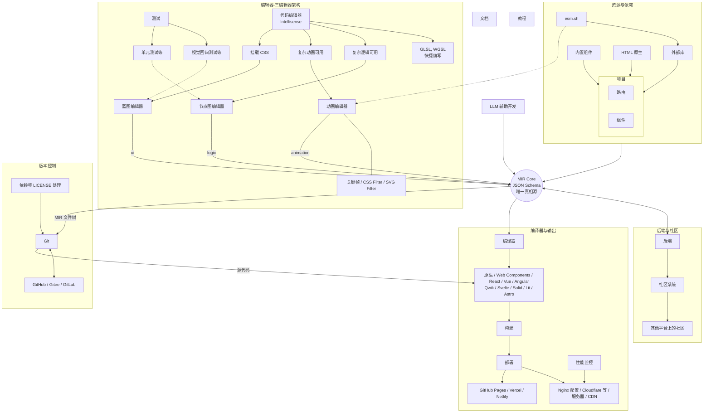
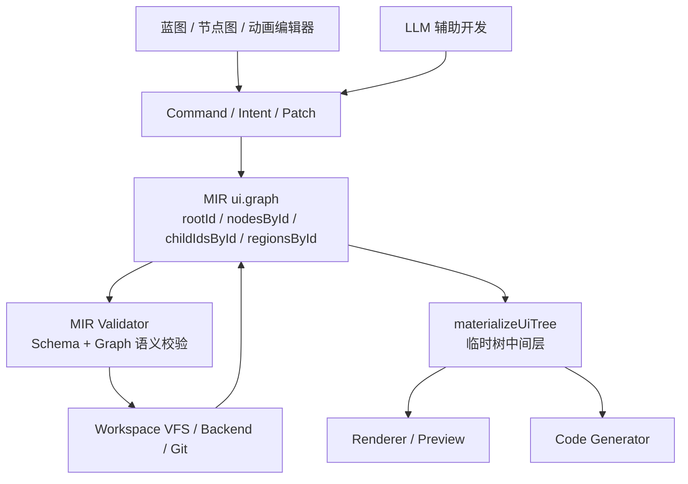

## mdr-front-engine

> 你是一名资深前端开发工程师，正在开发一款叫 MdrFrontEngine 的工业级浏览器端可视化前端开发工具。以下是这款工具的核心架构。

# MdrFrontEngine Agents 开发指南

你是一名资深前端开发工程师，正在开发一款叫 MdrFrontEngine 的工业级浏览器端可视化前端开发工具。以下是这款工具的核心架构。

## MIR 结构与读写链路

## 代码规范

1. 读写文档都要用 UTF-8 编码。
2. 所有代码必须考虑可扩展性和健壮性。
3. `@mdr/ui` 包下组件库使用 SCSS 进行样式编写，其他样式则用 Tailwind。要用最新的 Tailwind 4 写法，摒弃旧写法；尤其注意 Tailwind 当中关于 var 的写法，比如用 `text-(--text-primary)` 而不是 `text-[var(--text-primary)]`。
4. 优先使用 `@/...` 导入同一个包下的代码，而不是使用相对路径。
5. 为方便开发者看懂代码，当且仅当在重要模块的核心方法或核心组件前编写规范的文档注释，写明白模块的调用链路的逻辑。不要写无用注释。
6. 如果文件过长，拆分。
7. 当且仅当需要测试时，补全测试。考虑边界条件。
8. 不要加耦合测试，尤其不要写依赖 DOM 层级、内部 class、具体标签结构、`querySelector`、`closest`、`parentElement`、快照或实现细节的测试；优先测试用户可感知行为、公开 API、状态结果和稳定语义。
9. 当完整的功能写好后，先运行 `pnpm run format` 来格式化代码。
10. 仅在有明确提示的时候提交并推送。commit msg 使用纯英文，按照业界规范写法：使用 `type(scope): description` 格式。
11. 在保持 monochrome-ui 设计风格的前提下，样式和 UX 设计可以模仿 Figma 和 Dify。
12. 扫描文件名时，优先使用 `git ls-files`、`git diff --name-only` 等 Git 相关命令限定仓库文件，避免递归扫到 `node_modules` 等依赖目录。

---
> Source: [Mdr-Tutorials/Mdr-Front-Engine](https://github.com/Mdr-Tutorials/Mdr-Front-Engine) — distributed by [TomeVault](https://tomevault.io).
<!-- tomevault:4.0:gemini_md:2026-05-07 -->
