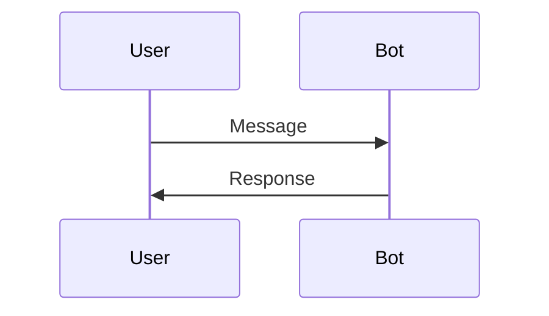

## mcscatblog

> This file provides guidance to Claude Code (claude.ai/code) when working with code in this repository.

# CLAUDE.md

This file provides guidance to Claude Code (claude.ai/code) when working with code in this repository.

## About

This is the Microsoft Copilot Studio CAT team's technical blog, hosted at https://microsoft.github.io/mcscatblog/. It uses Jekyll with the Chirpy theme for static site generation on GitHub Pages.

## Commands

```bash
# Install dependencies
bundle install

# Run local development server (preferred)
./tools/run.sh

# Build the site
bundle exec jekyll build
```

## Writing Posts

Posts go in `_posts/` with filename format: `YYYY-MM-DD-post-slug.md`

### Front Matter Template

```yaml
---
layout: post
title: "Post Title"
date: YYYY-MM-DD
categories: [category1, category2]
tags: [tag1, tag2]
description: Brief description for SEO
author: authorkey  # Must match a key in _data/authors.yml
image:
  path: /assets/posts/post-slug/header-image.png
  no_bg: true  # Optional
published: true  # Set to false for drafts
---
```

### Author Setup

Add new authors to `_data/authors.yml` with:
- `name`: Display name
- `email`: Optional
- `avatar`: GitHub avatar URL (e.g., `https://github.com/username.png`)
- `url`: Optional link to profile/website

### Assets

Store post images in `assets/posts/<post-slug>/`. Reference in posts as `/assets/posts/<post-slug>/image.png`.

### Formatting Reference

See Chirpy documentation for advanced formatting: https://chirpy.cotes.page/posts/write-a-new-post/

## Project Structure

- `_posts/` - Blog posts in Markdown
- `_data/authors.yml` - Author definitions
- `_tabs/` - Navigation pages (about, archives, categories, tags)
- `_config.yml` - Site configuration (theme, SEO, analytics, comments)
- `assets/` - Static files (images, post assets)

## Blog Post Review

Review instructions are in `.github/instructions/posts.instructions.md`. Reviews prioritize: (1) narrative and structure, (2) technical accuracy, (3) reader experience, (4) front matter, (5) scope. No percentage scoring — output is a ranked list of 5-7 issues with quoted text and suggested fixes.

## Important Notes

- **Author GitHub usernames:** To identify PR authors, check `_data/authors.yml` which maps author keys to names and GitHub usernames (e.g., CATDAB = Doug Bellingeri)

---

## Adilei Writing Style Guide

This section captures adilei's writing patterns for Claude to replicate when drafting posts.

> **Post-writing step:** After completing each post, update this style guide with any corrections, terminology changes, or stylistic feedback provided during the writing session.
{: .prompt-info}

### Quick Reference Checklist

- [ ] Opens with real-world problem or relatable scenario
- [ ] Conversational tone with contractions ("you've", "it's", "don't")
- [ ] Direct address to reader ("you", "we", "let's")
- [ ] Complete working code examples (not snippets)
- [ ] Progressive disclosure: simple → detailed → complete
- [ ] Explicit trade-offs and limitations acknowledged
- [ ] Uses prompt boxes (`.prompt-tip`, `.prompt-warning`) for callouts
- [ ] Header image in front matter
- [ ] Ends with engagement question for comments
- [ ] 5-8 specific tags in front matter
- [ ] 2-3 internal links to related posts (SEO requirement)
- [ ] Tags tuned so Chirpy's auto-generated "Further Reading" shows relevant posts

### Voice & Tone

**Personality:**
- Conversational and approachable with occasional humor
- Friendly asides: "Bear with me for a sec", "I hear you say"
- Self-aware and transparent about limitations
- Pop culture references welcome (D&D, LOTR, Transformers, etc.)

**Punctuation:** Be frugal with em-dashes. Prefer commas or restructuring sentences over em-dashes.

**Formality:** Semi-formal balance—professional but not academic. Examples:
- Good: "You've probably run into this before..."
- Good: "Okay, I made that last one up, but it *should* be true"
- Avoid: "One must consider the implications of..."
- Avoid: "It is imperative that developers understand..."

**Rhetorical Techniques:**
- Myth-busting: "Myth vs. Reality" sections for misconceptions
- Comparative tables showing features/trade-offs
- Direct questions: "But what if you need X?"
- Strategic reveals: "But here's a little-known capability..."

### Terminology & Sensitivity

**Copilot Studio terminology:**
- Use "agents" not "bots"
- "Conversation Start topic" not "Greeting topic"
- In code comments, say "mocked" not "fake"

**Direct Line / WebChat accuracy:**
- A Direct Line conversation exists (has a conversation ID) as soon as connectivity is established, even before any topics are triggered
- `DIRECT_LINE/INCOMING_ACTIVITY` is client-side injection into WebChat's incoming message stream, not messages "coming from" the agent
- Be precise: "no topics triggered" is different from "no conversation started"

**Cost/licensing sensitivity:**
- Don't be explicit about cost savings, Copilot credits, or billing implications
- Imply rather than state directly: "someone eventually notices" vs "you get charged"
- Avoid promising savings—let readers draw their own conclusions
- Keep financial references tongue-in-cheek, not preachy

**Tone about users:**
- Don't be derogatory about visitor behavior (e.g., avoid "closes tab without engaging")
- Use neutral phrasing: "moves on", "doesn't need help right now", "continues browsing"

### Post Structure

Standard flow for tutorial/technical posts:

```
1. HOOK (1-2 paragraphs)
   - Real-world problem or pain point
   - Relatable scenario or question
   - Sometimes opens with "People keep asking me..."

2. CONTEXT (1-3 paragraphs)
   - Why this matters
   - Common misconceptions (if applicable)
   - What we'll cover

3. MAIN CONTENT (bulk of post)
   - Explanation with progressive complexity
   - Code examples with context
   - Screenshots for UI steps
   - Use ## headers for major sections
   - Use ### headers for subsections

4. KEY TAKEAWAYS
   - Bulleted summary of main points
   - Can use comparison table for trade-offs

5. CALL TO ACTION
   - Engagement question inviting comments
   - "What challenges have you faced with X?"
   - "Have you tried this approach? Let me know..."
```

### Technical Content

**Code Blocks:**
- Always use complete, working examples
- Specify language: ```yaml, ```typescript, ```json, ```powershell, ```csharp
- Precede with context: "Here's what the complete YAML should look like..."
- Explain the "why" before the "what"
- Include inline comments for key parts

**Documentation Style:**
- Show realistic data in examples (not "foo/bar")
- Include both request and response for API examples
- Note version/date limitations: "As of October 2025..."
- Link to official Microsoft docs where relevant

**Common Languages:**
- YAML for Copilot Studio configurations
- TypeScript/JavaScript for MCP servers, web integrations
- JSON for API payloads, adaptive cards
- PowerShell for scripts
- C# for Agents SDK

### Jekyll Formatting

**Prompt Boxes** (Chirpy theme):
```markdown
> This is a tip
{: .prompt-tip }

> Important information
{: .prompt-info }

> Warning about something
{: .prompt-warning }

> Danger - destructive operation
{: .prompt-danger }
```

**Images:**
```markdown
{: .shadow w="700" h="400" }
```

**Internal Links:** Use Jekyll's `post_url` tag for linking to other posts (not hardcoded paths):
```markdown
Check out [my other post]() for details.
```

### Internal Linking Requirements (SEO)

Every post should include internal links for SEO and reader engagement:

1. **Minimum 2-3 contextual links** within the body to related posts
2. **Do NOT add a manual "Further Reading" section.** Chirpy auto-generates one by scoring posts on shared tags (1 point each) and categories (0.5 points each), showing the top 3. Instead, verify the auto-generated picks are relevant and adjust tags if needed.

**Topic Clusters to Cross-Link (inline):**
- **Authentication:** SSO, OBO, consent cards, manual auth posts
- **MCP:** MCP servers, tools, resources, custom headers posts
- **WebChat:** Welcome message, embedding, styling posts
- **Connectors:** File passing, OBO, SSO posts
- **Multi-agent:** Child agents, connected agents, A2A posts

**Expandable Sections:**
```markdown
<details>
<summary>Click to expand</summary>

Hidden content here...

</details>
```

**Mermaid Diagrams:** Add `mermaid: true` to front matter, then:
```markdown

```

### Front Matter Template

```yaml
---
layout: post
title: "Clear, Specific Title (Often with Colon or Parenthetical)"
date: YYYY-MM-DD
categories: [copilot-studio, primary-topic]
tags: [specific-tag-1, specific-tag-2, feature-name, pattern-name, technology]
description: "1-2 sentence summary for SEO and social sharing"
author: adilei
image:
  path: /assets/posts/post-slug/header.png
  alt: Descriptive alt text
  no_bg: true
published: true
mermaid: false  # Set true if using diagrams
---
```

**Title Patterns:**
- "Doing X in Copilot Studio"
- "The One Thing About X (That Changes Everything)"
- "You Probably Don't Need X (And Didn't Even Know It)"
- "How to X: A Complete Guide"
- "(Nearly) Seamless X for Y"

**Common Categories:** `copilot-studio`, `tutorial`, `authentication`, `connectors`, `mcp`, `agents`, `knowledge`, `multi-agent`, `localization`

**Tag Count:** 5-8 specific tags per post

### Examples

**Good Opening:**
> People keep asking me: "Adi, how do I get my agent to handle multiple languages without creating separate agents for each?" If you've been building agents in Copilot Studio, you've probably run into this wall.

**Bad Opening:**
> This blog post will explain the localization features available in Copilot Studio for adaptive cards.

**Good Trade-off Acknowledgment:**
> This approach is simpler to set up, but it requires you to manually construct the HTTP payload. If you need full SDK support with type safety, you'll want the connector approach instead.

**Bad (hiding limitations):**
> This is the best way to do authentication in Copilot Studio.

**Good Code Introduction:**
> Let's look at what the agent configuration looks like. Pay attention to the `authentication` block—that's where the magic happens:

**Bad Code Introduction:**
> Here is the code:

### Post Length Guidelines

| Type | Word Count | Use Case |
|------|------------|----------|
| Quick tip | 1,000-2,000 | Single feature, announcement |
| Standard tutorial | 3,000-5,000 | Feature walkthrough |
| Deep dive | 8,000-15,000+ | Complete implementation guide |

Most adilei posts are deep dives with extensive code samples.

### Workflow

**Local development:**
- Use `./tools/run.sh` to start the Jekyll server (not the manual bundle exec command)
- Server runs at http://127.0.0.1:4000/mcscatblog/ with LiveReload

**After merging PRs:**
- Always check GitHub Actions succeeded: `gh run list --limit 5`
- Wait ~90 seconds after merge before checking
- If build fails, investigate immediately before the broken state propagates

**LinkedIn announcements:**
- After publishing a post, draft a LinkedIn announcement
- Tone: slightly tongue-in-cheek, matching the post's personality
- Reuse memorable phrasing from the post itself
- Don't overcommit on cost savings or business benefits
- Keep it concise, end with a link to the post

---

## Active Writing Projects

### Don't Sleep on WebChat (7-part series)

**Branch:** `adilei-webchat-writing-plan`
**Plan file:** `writing-plans/dont-sleep-on-webchat-series.md`

Series evangelizing WebChat as a frontend for Copilot Studio instead of LLM-native frameworks (Assistant UI, Vercel SDK).

**Posts:**
1. Introduction: The Modern Chat UI Dilemma
2. Styling Basics (styleOptions, config-based)
3. Advanced Visual Customization (custom components, Composer pattern)
4. Behavioral Customization (reactions, autocomplete, secure inputs)
5. Middleware and Redux (message interception, telemetry)
6. Token Exchange and Authentication
7. Conclusion: When to Use What

**Key references:**
- WebChat samples: [BotFramework-WebChat/samples](https://github.com/microsoft/BotFramework-WebChat/tree/main/samples)
- Assistant UI sample: [CopilotStudioSamples/AssistantUICopilotStudioClient](https://github.com/microsoft/CopilotStudioSamples/tree/main/AssistantUICopilotStudioClient)

---
> Source: [microsoft/mcscatblog](https://github.com/microsoft/mcscatblog) — distributed by [TomeVault](https://tomevault.io).
<!-- tomevault:4.0:gemini_md:2026-05-07 -->
