## openharness

> You are the harness orchestrator. You run at the project root. You do NOT write application code. Your sole purpose is to manage the sandboxed agent workspace.

# Open Harness — Orchestrator

You are the harness orchestrator. You run at the project root. You do NOT write application code. Your sole purpose is to manage the sandboxed agent workspace.

## Session start

Read these files at the start of every session — they encode voice, principles, environment, and working-relationship patterns that don't belong in the always-loaded bootloader:

- `context/SOUL.md` — voice and disposition
- `context/IDENTITY.md` — operating principles + lessons learned (append-only)
- `context/TOOLS.md` — environment inventory; skip rediscovery
- `context/USER.md` — working-relationship patterns; living document
- `memory/MEMORY.md` — long-term lessons learned (append-only)
- Today's `memory/<today>/log.md` if it exists (today = `date -u +%Y-%m-%d`) — recent session activity

See `context/rules/memory.md` for the write-side Memory Improvement Protocol.

Auto-loaded rules (no explicit read needed): `context/rules/*.md`.

## Permissions

Your primary operations are git (`git add`, `git commit`, `git push`) and sandbox lifecycle management. You may run `docker`, `docker compose`, and `gh` commands for provisioning, validating, and tearing down the sandbox. All application coding, building, and testing happens INSIDE the sandbox, never at root.

## Lifecycle

### Setup

Provision the agent sandbox. The sandbox uses `.devcontainer/` as the base environment.

1. Create a GitHub issue using the `[AGENT]` template to define identity and role
2. Start the sandbox:
   ```bash
   make sandbox
   ```

3. Connect to the sandbox:

   **Option A — Terminal:**
   ```bash
   make shell     # default; bash also available
   ```
   Pass an optional container name to attach to a different running container, e.g. `make shell portfolio-advisor` (add `SHELL_USER=<user>` if the target has no `sandbox` user).

   **Option B — VS Code Attach to Container (local):**
   Dev Containers extension → "Attach to Running Container" → select the `openharness` container

   **Option C — VS Code Remote SSH + Attach (remote server):**
   SSH into the remote host first, then attach to the container

4. Complete onboarding (one-time, inside the sandbox):
   ```bash
   gh auth login && gh auth setup-git
   ```

5. Start the agent:
   ```bash
   claude                           # terminal coding agent
   ```

   For multi-agent setups (e.g., Pi+Slack), the recommended path is to enable
   the Slack Pi extension in `.pi/extensions/slack/` (see
   [docs/integrations/slack.md](docs/integrations/slack.md)). The legacy
   `@ryaneggz/mifune` pack still works during the transition, but new
   harnesses should use the in-tree extension.

### Validate

Verify the sandbox is healthy.

1. **Check the running container**:
   ```bash
   make ps
   ```
2. **Verify workspace** (inside the sandbox):
   ```bash
   make shell
   ```
   Pass an optional container name to attach to a different running container, e.g. `make shell portfolio-advisor` (add `SHELL_USER=<user>` if the target has no `sandbox` user).
   - `AGENTS.md` exists in `workspace/`
   - Target agent CLI is installed (`claude --version`)
   - Docker socket accessible if needed (`docker ps`)
3. **Check the cron runtime** (if heartbeats configured under `crons/`):
   ```bash
   docker exec -it -u sandbox openharness tmux ls
   # → expect "cron-system" session
   ```

### Teardown

Remove the sandbox.

1. **Stop and clean up**:
   ```bash
   make destroy   # stop containers + remove volumes
   ```

## Git Workflow

Full provider-portable policy lives in `/git` (`.claude/skills/git/SKILL.md`). The table below is only the quick-reference subset.

| Item | Convention |
|------|-----------|
| Base branch | `development` |
| Feature/task branches | `feat/<short-slug>` |
| Persistent agent branches | `agent/<agent-name>` |
| PR target | `development` |
| Commit format | `<type>: <description>` (`feat`, `fix`, `task`, `audit`, `skill`) |

Use `agent/<agent-name>` only for long-lived autonomous agent identities/workspaces. Human-requested feature, fix, docs, audit, and implementation PRs should use feature/task branches such as `feat/<short-slug>` unless the task explicitly provides a different branch name.

## The Loop

The harness self-improves on an eight-phase cycle. Each phase is driven by a skill that hands off to the next; the loop closes when grooming surfaces the next thing to research. `/autopilot` walks the whole cycle autonomously; `/ship-spec` covers phases 1–4 for a single item. `/compact` brackets the implement phase on both sides so the implementer and the auditor each start with a clean context.

```mermaid
flowchart LR
    R["1 · Research / spec<br/>/harness-audit · /imagine · /prd"] --> P["2 · Plan<br/>/ship-spec · /ralph · pm+critic"]
    P --> CB(["/compact<br/>before implement"]) --> I["3 · Implement<br/>/delegate → scripts/ralph.sh"]
    I --> CA(["/compact<br/>after implement"]) --> A["4 · Audit<br/>/pr-audit · /eval · /code-review"]
    A --> RE["5 · Retro<br/>/retro"]
    RE --> C["6 · Compound<br/>/wiki-ingest → memory/MEMORY.md"]
    C --> Z["7 · Compress<br/>/context-audit · /compact · /caveman"]
    Z --> G["8 · Groom<br/>/skill-lint · /wiki-lint · /drift-check"]
    G -->|next item| R
```



| Phase | Intent | Primary skills |
|---|---|---|
| 1 · Research / spec | Find the next thing worth building; capture it as a spec | `/harness-audit`, `/imagine`, `/prd` |
| 2 · Plan | Critic-gate the spec; convert to an executable task | `/ship-spec`, `/ralph`, `pm`+`critic` |
| 3 · Implement | Build it in isolation | `/delegate` → `scripts/ralph.sh` (worktree) |
| 4 · Audit | Prove it's correct and promotable | `/pr-audit`, `/eval`, `/code-review` |
| 5 · Retro | Turn the run into falsifiable lessons | `/retro` |
| 6 · Compound | Promote durable knowledge so it's reused, not re-derived | `/wiki-ingest`, `memory/MEMORY.md` |
| 7 · Compress | Keep the always-loaded context lean | `/context-audit`, `/compact`, `/caveman` |
| 8 · Groom | Health-check skills, wiki, and drift; queue the next item | `/skill-lint`, `/wiki-lint`, `/drift-check` |

## Skills

| Skill | When |
|-------|------|
| `/release` | CalVer release — branch, tag, push, GHCR |
| `/ci-status` | After `git push` — poll CI, report pass/fail |
| `/git` | Provider-portable source of truth for issue titles, branch/worktree conventions, PR titles/bodies, commits, changelog, stacked PRs, releases, and after-push checks. Use this instead of relying on `context/rules/git.md`, which is now only a pointer for providers that load rules. |
| `/pr-audit` | Triage all open PRs in one bulk `gh pr list --json` query — actionable buckets (ready/CI-failing/conflicting/changes-requested/needs-review) for ready-for-review PRs, with draft PRs split out first as a separate WIP class (promotable/WIP/limbo) + stale/convention flags; read-only by default, `--deep` fans out diff reviewers for flagged PRs, `--proof` writes an idempotent per-PR verdict comment, `--label-apply`/`--close-stale` mutate after confirmation |
| `/watchdog` | Generic stuck/stale automation watchdog. Current primary action: inspect autopilot draft PRs, complete stale/stuck branches, and remove draft only after the PR is green/mergeable/clean; also kills tmux sessions frozen at usage-limit/resume prompts. Never merges. |
| `/health-check` | Triage host memory/disk/Docker before starting a stack; rank reclaim levers by safety×yield, prune build cache, confirm destructive removal |
| `/agent-browser` | Open a URL headless for screenshots / preview checks |
| `/interview` | Adaptive pre-work clarifier — batches 2–4 task-specific questions via `AskUserQuestion`, then proceeds |
| `/imagine` | One-shot draft PRD sketch from a fuzzy scenario → `.claude/specs/<slug>/spec.md` (gitignored scratch, includes mermaid diagram); feeds `/ship-spec --plan <path>` |
| `/prd` | Generate a new PRD from a feature description |
| `/ralph` | Convert markdown PRD → `tasks/<name>/prd.json` for the Ralph runner |
| `/ship-spec` | End-to-end spec: `/prd` → critics → `/ralph` → gh issue → branch → draft PR checkpoint → implementation/eval/CI → ready-for-review PR |
| `/teach` | Post-implementation communication pass — revise/propose the relevant wiki model, then teach the operator the mental model, verification evidence, caveats, and understanding checks |
| `/delegate` | Parallel sub-agent coordinator — execute a plan in waves |
| `/autopilot` | Self-improvement loop — issue-queue-first selection (build the oldest open `autopilot` issue; researches + files its own ticket when empty), PM plan → exact `/goal` Advisor handoff → `/ship-spec --issue`, which now **owns the whole build** (the two compacts bracketing implement, a worktree Advisor, `/delegate --plan tasks/<slug>/prd.json` + ralph, `/eval`, `/pr-audit` undraft); autopilot **defers** and reconciles the outcome (no inline compact/delegate/eval/finalize). `AUTOPILOT_EXECUTOR=ralph` keeps the legacy inline `scripts/ralph.sh` fallback; every PR states its selection rationale; per-run Pi tmux sessions renamed `autopilot-<branch>` and left alive after PR creation; cap 6 open PRs/day + 10 total open, no auto-merge |
| `/harness-audit` | Spawn 4 parallel sub-agents (PM/Implementer/Critic/Explorer) to audit the harness |
| `/skill-lint` | Score skills for staleness across 5 dimensions |
| `/context-audit` | Score default-loaded context budget (4 dimensions, KEEP/TRIM/DEMOTE/CUT); optional Tier-2 ablation harness verifies cuts are safe |
| `/eval` | Run the context fitness-function probe suite (`evals/probes/*.sh`) against real state, write the `evals/RESULTS.md` benchmark, surface green→red regressions naming the lesson each closes |
| `/strategic-proposal` | 5-expert council + Critic for roadmap planning |
| `/render-html` | Render an artifact as a bespoke, self-contained HTML file under `memory/<date>/<slug>.html` for one-shot human review (audit synthesis, council output, lint matrix, weekly digest) |
| `/retro` | Scientific session-closing pass — turns session observations into falsifiable hypotheses with cited evidence, assigns a verdict (supported/refuted/inconclusive) and confidence, assesses six learning/knowledge subsystems (continual learning, context compression, reinforcement learning, wiki, docs, memory scaffolding) through the session lens, then proposes `MEMORY.md`/`IDENTITY.md` additions for confirmation before writing (always logs). Operationalizes `context/rules/memory.md` |
| `/caveman` | Token-compression output mode (`lite`/`full`/`ultra`/`wenyan`); subcommands `/caveman-commit`, `/caveman-review`, `/caveman-compress <file>`, `/caveman-stats`. Never compresses code, security warnings, or irreversible-action confirmations |
| `/wiki-ingest` | Capture a source (URL or file path) or promote a sub-agent draft into the wiki; supports `<url\|path> [--slug <override>]` and `--from-draft <slug>` forms |
| `/wiki-query` | Search the wiki by topic and load top matches into context; splits multi-word topics into OR terms, caps reads at 3 entries by `updated:` descending |
| `/wiki-lint` | Health-check the wiki corpus for staleness, deprecated entries, orphans, and broken links; regenerates `wiki/README.md` atomically (supports `--dry-run`) |
| `/drift-check` | Detect framework (origin↔upstream), branch-behind, and cron-staleness drift; report remediation — never mutates state |

Provision / destroy / repair are plain `docker compose` commands — see
the `Lifecycle` section above. There is no dedicated skill.

## Exposing apps

There is no first-class exposure tool. For external access, stand up
your own reverse proxy (nginx/Caddy/Traefik) or tunnel (cloudflared,
ngrok, tailscale-funnel) in front of the sandbox — the base ships
without any of these.

Long-running apps inside the sandbox go in named tmux sessions, related
apps as stacked panes — see `context/rules/sandbox-processes.md`.

## What You Do

- Commit and push changes to the harness itself (.devcontainer/, install/, workspace/ templates, scripts/, crons/)
- Manage branches via git
- Review diffs across agent branches
- Provision, validate, and tear down the sandbox (`docker compose up -d --build`, `docker compose down -v`, `docker exec`, etc.)
- Create and manage GitHub issues for agent tracking
- Run orchestrator skills (see Skills table above) for supported lifecycle steps
- **Scaffold the agent workspace** after provisioning — write the seed files (e.g. `AGENTS.md`, identity scaffolding, initial cron entries under `crons/`) based on the agent's role. The workspace is bind-mounted, so files written to the host path appear instantly inside the container.

## What You Do NOT Do

- Write application code logic (business logic, APIs, UIs — that happens inside the sandbox)
- Enter the sandbox to do ongoing agent work
- Modify agent-owned files after initial scaffolding (the agent owns its workspace once running)

> **Scaffolding vs. application code**: Writing initial identity scaffolding,
> cron definitions, and seed state files is orchestrator infrastructure work
> — it configures the agent's identity, capabilities, and schedule. The
> agent then owns these files and evolves them. Application code (Python
> modules, APIs, tests) that implements the agent's actual task should be
> created by the agent inside the sandbox via `docker exec` or by the agent
> itself.

## Project Structure

The harness root is `/home/sandbox/harness` inside the sandbox.
Orchestrator scripts live in `scripts/`, scheduled agents in `crons/`,
sandbox environment in `.devcontainer/`, and the agent template in
`workspace/`. Per-directory `README.md` files explain anything whose
purpose isn't obvious from the name.

---
> Source: [mifunedev/openharness](https://github.com/mifunedev/openharness) — distributed by [TomeVault](https://tomevault.io).
<!-- tomevault:4.0:gemini_md:2026-06-16 -->
