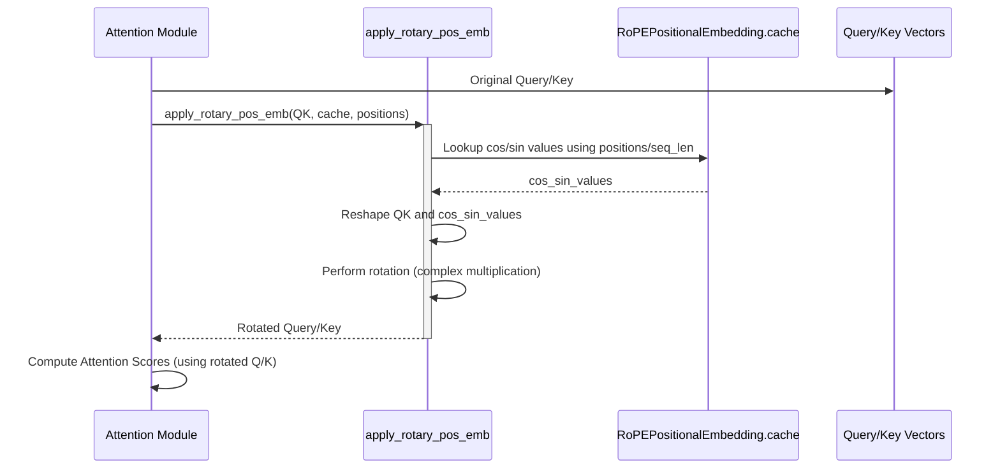

## rotary-position-embeddings-rope

> description: JAXgarden tutorial chapter on Rotary Position Embeddings (RoPE) for injecting relative positional information in attention.

---
description: JAXgarden tutorial chapter on Rotary Position Embeddings (RoPE) for injecting relative positional information in attention.
globs: 
alwaysApply: false
---
# Chapter 8: Rotary Position Embeddings (RoPE)

In the [previous chapter](attention_mechanism__multiheadattention___dot_product_attention_.mdc), we explored the core `MultiHeadAttention` mechanism and its efficient backend implementations. However, standard self-attention is permutation-invariant, meaning it doesn't inherently understand the order of tokens in a sequence. To address this, models need positional information. This chapter introduces Rotary Position Embeddings (RoPE), a clever technique for incorporating relative position information directly into the attention mechanism.

**Motivation:** Traditional methods for adding positional information include adding learned absolute position embeddings or fixed sinusoidal embeddings to the input token embeddings. While effective, these methods add extra parameters (learned embeddings) or modify the input representation before the transformer layers. RoPE offers an alternative by *rotating* the query and key vectors based on their absolute positions *before* the dot-product calculation in the attention mechanism. This rotation is designed such that the dot product between a rotated query and a rotated key naturally depends on their relative positions, effectively injecting relative positional awareness directly into the attention scores without adding separate embedding vectors.

**Central Use Case:** Applying RoPE within the attention modules of models like [LlamaForCausalLM](llamaforcausallm.mdc) (`LlamaAttention`) or [ModernBERTForMaskedLM](modernbertformaskedlm.mdc) (`ModernBertAttention`). RoPE modifies the query and key vectors just before their dot product, enabling the attention mechanism to weigh interactions based on how far apart tokens are in the sequence.

## Key Concepts

1.  **Core Idea:** RoPE operates by viewing pairs of features in the query and key vectors as complex numbers and rotating them in the complex plane. The angle of rotation depends on the token's absolute position (`m`) and the feature index (`i`). When computing the dot product between a rotated query (at position `m`) and a rotated key (at position `n`), the resulting score implicitly depends on their relative distance (`m - n`).
2.  **Mathematical Basis:** The rotation is achieved using sinusoidal functions derived from the position index (`m`) and the feature dimension (`d`). Specifically, frequencies (`theta_i`) are calculated based on the feature index `i` and a base value (`base`, often 10000 or larger). The rotation involves multiplying elements by `cos(m * theta_i)` and `sin(m * theta_i)`.
3.  **Implementation Variations:** `jaxgarden` provides two main implementations reflecting common practices:
    *   **`LlamaRotaryEmbedding`:** Used in [LlamaForCausalLM](llamaforcausallm.mdc). It calculates the `cos` and `sin` values *on-the-fly* based on the input `position_ids`. This is flexible for varying sequence lengths during generation.
    *   **`RoPEPositionalEmbedding`:** Used in [ModernBERTForMaskedLM](modernbertformaskedlm.mdc). It *pre-computes* and caches the `cos` and `sin` values for positions up to a specified `max_position_embeddings` during initialization. This can be more efficient if the maximum sequence length is known and fixed, as it replaces calculation with lookup.
4.  **Application Point:** RoPE is applied to the query and key vectors *after* their initial linear projections (`Wq`, `Wk`) but *before* the dot-product attention score calculation (`QK^T`). This modification is typically encapsulated within a helper function (e.g., `apply_rotary_pos_emb`) called by the attention module.

## Using RoPE

RoPE is generally an internal component of attention modules. You typically don't interact with `LlamaRotaryEmbedding` or `RoPEPositionalEmbedding` directly unless implementing a custom attention layer. Instead, you configure the model (via its `Config` object) which implicitly configures the RoPE within its attention layers.

**Example 1: RoPE within `LlamaAttention`**

The `LlamaAttention` module internally instantiates `LlamaRotaryEmbedding` and uses it within its `__call__` method.

```python
# Inside LlamaAttention initialization (__init__)
# config values like head_dim and rope_theta are passed
self.rotary_emb = LlamaRotaryEmbedding(
    dim=config.head_dim,
    base=config.rope_theta,
    rngs=rngs
)

# Inside LlamaAttention forward pass (__call__)
def __call__(self, x, position_ids, attention_mask):
    # ... project x to query, key, value ...
    query = self.q_proj(x).reshape(...) # [batch, n_heads, seq_len, head_dim]
    key = self.k_proj(x).reshape(...)   # [batch, n_kv_heads, seq_len, head_dim]
    value = self.v_proj(x).reshape(...) # [batch, n_kv_heads, seq_len, head_dim]

    # Calculate cos/sin on the fly (assuming batch_size=1 for simplicity here)
    cos, sin = self.rotary_emb(position_ids[0])

    # Apply RoPE rotation *before* attention calculation
    query, key = self.apply_rotary_pos_emb(query, key, cos, sin)

    # ... repeat key/value if GQA, compute attention scores ...
    # attn_weights = jnp.matmul(query, key.transpose(...)) / scale
    # ... compute final output ...
    return output
```
**Explanation:** `LlamaAttention` creates a `LlamaRotaryEmbedding` instance. In the forward pass, it calls this instance with `position_ids` to get the `cos` and `sin` values dynamically. These are then passed to `apply_rotary_pos_emb` (a method within `LlamaAttention`) to rotate `query` and `key`.

**Example 2: RoPE within `ModernBertAttention`**

`ModernBertAttention` uses the pre-computed cache from `RoPEPositionalEmbedding`.

```python
# Inside ModernBertAttention initialization (__init__)
# config values like head_dim, max_position_embeddings, rope_theta are passed
self.rotary_emb = RoPEPositionalEmbedding(
    rngs=rngs,
    dim=self.head_dim,
    max_position_embeddings=max_pos, # Can depend on local/global
    base=rope_theta # Can depend on local/global
)
# The cache is stored in self.rotary_emb.cache

# Inside ModernBertAttention forward pass (__call__)
# It uses a standalone apply_rotary_pos_emb function defined in modernbert.py
from jaxgarden.models.modernbert import apply_rotary_pos_emb

def __call__(self, hidden_states, attention_mask, ..., position_ids):
    # ... project hidden_states to qkv ...
    # Split into query, key, value: [batch, num_heads, seq_len, head_dim]
    # Transpose for RoPE application: [batch, seq_len, num_heads, head_dim]
    query = query.transpose((0, 2, 1, 3))
    key = key.transpose((0, 2, 1, 3))

    # Apply RoPE using the pre-computed cache
    query = apply_rotary_pos_emb(query, self.rotary_emb.cache, position_ids)
    key = apply_rotary_pos_emb(key, self.rotary_emb.cache, position_ids)

    # Transpose back: [batch, num_heads, seq_len, head_dim]
    query = query.transpose((0, 2, 1, 3))
    key = key.transpose((0, 2, 1, 3))

    # ... compute attention scores ...
    # attn_scores = jnp.matmul(query, key.swapaxes(-2, -1)) / scale
    # ... compute final output ...
    return output_tuple
```
**Explanation:** `ModernBertAttention` creates a `RoPEPositionalEmbedding` instance, which pre-computes the cache. In the forward pass, the standalone `apply_rotary_pos_emb` function is called, passing the `query` and `key` vectors along with the *cached* sinusoidal values (`self.rotary_emb.cache`) and optional `position_ids` for lookup.

## Internal Implementation

Let's examine the core logic.

### `LlamaRotaryEmbedding` (On-the-fly Calculation)

*   **File:** `jaxgarden/models/llama.py`

**Walkthrough:**
1.  The `__call__` method receives `position_ids` (typically `[1, seq_len]`).
2.  It calculates the inverse frequencies (`inv_freq`) based on `self.dim` and `self.base`. This determines how quickly the angle changes for different feature dimensions.
3.  It uses `jnp.einsum` to efficiently compute the angles (`freqs`) for all positions and half the dimensions: `angle = position_id * inv_freq`.
4.  It concatenates the angles to cover the full dimension (`emb`).
5.  It computes and returns the cosine and sine of these angles.

```python
# Simplified from LlamaRotaryEmbedding.__call__
@nnx.jit()
def __call__(self, position_ids: jnp.ndarray) -> tuple[jnp.ndarray, jnp.ndarray]:
    # inv_freq shape: [dim/2]
    inv_freq = 1.0 / (self.base ** (jnp.arange(0, self.dim, 2, dtype=jnp.float32) / self.dim))
    # Expand dims for einsum: inv_freq -> [1, 1, dim/2]
    inv_freq_expanded = jnp.expand_dims(inv_freq, axis=(0, 1))
    # position_ids -> [1, seq_len, 1]
    position_ids_expanded = jnp.expand_dims(position_ids, axis=(0, 2)).astype(jnp.float32)

    # Calculate angles: freqs shape [1, seq_len, dim/2]
    freqs = jnp.einsum("bij,bjk->bik", position_ids_expanded, inv_freq_expanded)

    # Concatenate angles for full dimension: emb shape [1, seq_len, dim]
    emb = jnp.concatenate([freqs, freqs], axis=-1)

    # Compute cos and sin: Shapes [seq_len, dim] (after squeeze)
    cos = jnp.cos(emb).squeeze(0).astype(jnp.bfloat16) # Assuming batch=1 input
    sin = jnp.sin(emb).squeeze(0).astype(jnp.bfloat16)
    return cos, sin
```

### `RoPEPositionalEmbedding` (Pre-computed Cache)

*   **File:** `jaxgarden/models/modernbert.py`

**Walkthrough:**
1.  **`create_sinusoidal_positions` (Helper Function):** Calculates angles `pos * theta` for all positions up to `max_length` and half the dimensions. Returns stacked `(cos, sin)` values. Shape: `[max_length, dim//2, 2]`.
2.  **`RoPEPositionalEmbedding.__init__`:** Calls `create_sinusoidal_positions` and stores the result in `self.cache`.
3.  **`apply_rotary_pos_emb` (Helper Function):**
    *   Takes an input tensor `x` (query or key), the `cache`, and optional `positions`.
    *   Determines the sequence length (`seq_len`) from `x`.
    *   Looks up the `cos`/`sin` values from the `cache`. If `positions` are given, it uses advanced indexing; otherwise, it takes the first `seq_len` entries from the cache.
    *   Reshapes `x` and the looked-up cache values for broadcasting and rotation.
    *   Performs the rotation using the complex number multiplication analogy: `x_rotated = x * cos +/- x_flipped * sin`.
    *   Reshapes the result back to the original shape.



```python
# Simplified from modernbert.py create_sinusoidal_positions
def create_sinusoidal_positions(max_length, dim, base=10000.0):
    positions = jnp.arange(max_length, dtype=jnp.float32) # [max_length]
    dim_indices = jnp.arange(0, dim, 2, dtype=jnp.float32) # [dim/2]
    theta = 1.0 / (base ** (dim_indices / dim)) # [dim/2]
    angles = jnp.einsum("i,j->ij", positions, theta) # [max_length, dim/2]
    # Stack cos and sin along a new last dimension
    return jnp.stack([jnp.cos(angles), jnp.sin(angles)], axis=-1) # [max_length, dim//2, 2]

# Simplified from RoPEPositionalEmbedding.__init__
class RoPEPositionalEmbedding(nnx.Module):
    def __init__(self, ..., dim, max_position_embeddings, base):
        # ... super().__init__() ...
        # Pre-compute and store the cache
        self.cache = create_sinusoidal_positions(
            max_position_embeddings, dim, base
        )
        # Cache shape: [max_position_embeddings, dim//2, 2]

# Simplified from modernbert.py apply_rotary_pos_emb
def apply_rotary_pos_emb(x, cache, positions=None):
    # x shape: [batch, seq, heads, dim]
    # cache shape: [max_len, dim//2, 2]
    seq_len = x.shape[1]

    # Lookup from cache based on positions or seq_len
    if positions is not None:
        rope_cache = cache[positions] # [batch, seq, dim//2, 2]
    else:
        rope_cache = cache[:seq_len] # [seq, dim//2, 2]
        rope_cache = jnp.expand_dims(rope_cache, 0) # [1, seq, dim//2, 2]

    # Reshape x for rotation: [batch, seq, heads, dim//2, 2]
    x_reshaped = x.reshape(*x.shape[:-1], -1, 2)
    # Expand cache dims for broadcasting: [batch/1, seq, 1, dim//2, 2]
    rope_cache = jnp.expand_dims(rope_cache, 2)

    # Perform rotation (like complex multiplication)
    cos_vals = rope_cache[..., 0]
    sin_vals = rope_cache[..., 1]
    x_real = x_reshaped[..., 0]
    x_imag = x_reshaped[..., 1]
    x_rotated_real = x_real * cos_vals - x_imag * sin_vals
    x_rotated_imag = x_imag * cos_vals + x_real * sin_vals

    x_out = jnp.stack([x_rotated_real, x_rotated_imag], axis=-1)
    # Reshape back to original: [batch, seq, heads, dim]
    return x_out.reshape(x.shape)
```
*Note:* The `apply_rotary_pos_emb` method within `LlamaAttention` performs a similar rotation logic but uses the dynamically calculated `cos` and `sin` values instead of a pre-computed cache. The core rotation math (`x * cos +/- rotate_half(x) * sin`) is equivalent.

## Conclusion

Rotary Position Embeddings (RoPE) provide an elegant and effective way to incorporate relative positional information into transformer attention mechanisms. By rotating query and key vectors based on their absolute positions using sinusoidal functions, RoPE makes the attention scores sensitive to relative distances without requiring additional learned parameters or modifying input embeddings directly. `jaxgarden` offers both on-the-fly (`LlamaRotaryEmbedding`) and pre-computed/cached (`RoPEPositionalEmbedding`) implementations, catering to different model architectures and efficiency considerations, as seen in [LlamaForCausalLM](llamaforcausallm.mdc) and [ModernBERTForMaskedLM](modernbertformaskedlm.mdc) respectively.

This concludes the core chapters outlined for the `jaxgarden` tutorial structure. Understanding these components provides a solid foundation for using and extending the library.


---

Generated by [Rules for AI](https://github.com/altaidevorg/rules-for-ai)

---
> Source: [ml-gde/jaxgarden](https://github.com/ml-gde/jaxgarden) — distributed by [TomeVault](https://tomevault.io).
<!-- tomevault:4.0:gemini_md:2026-05-22 -->
